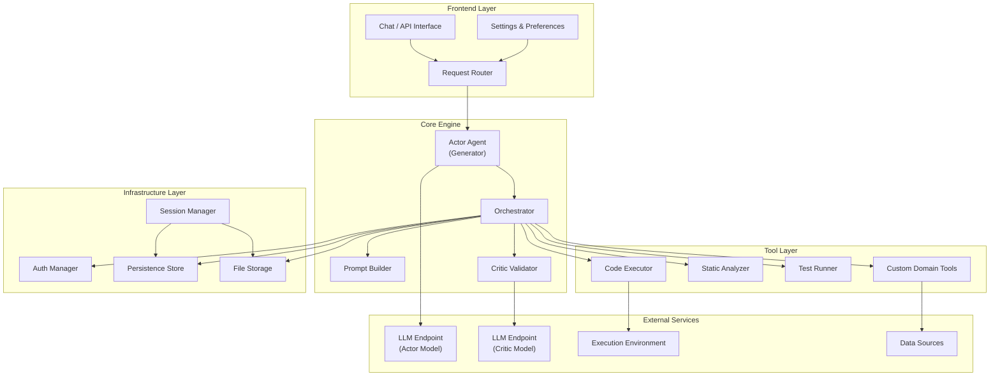
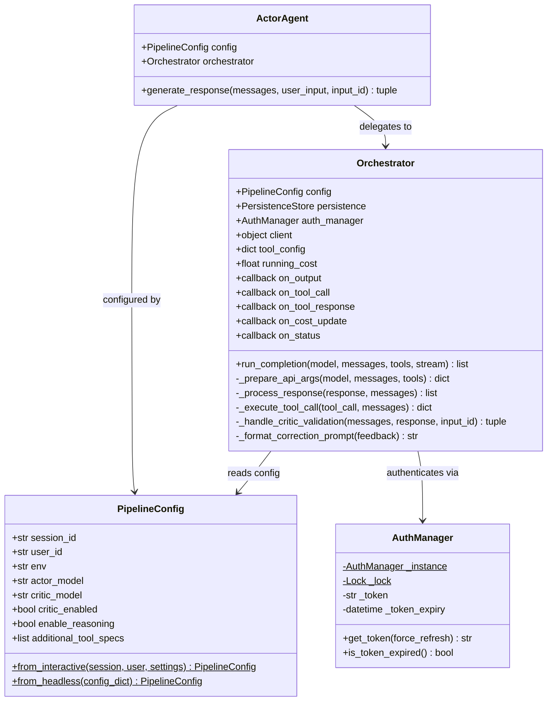
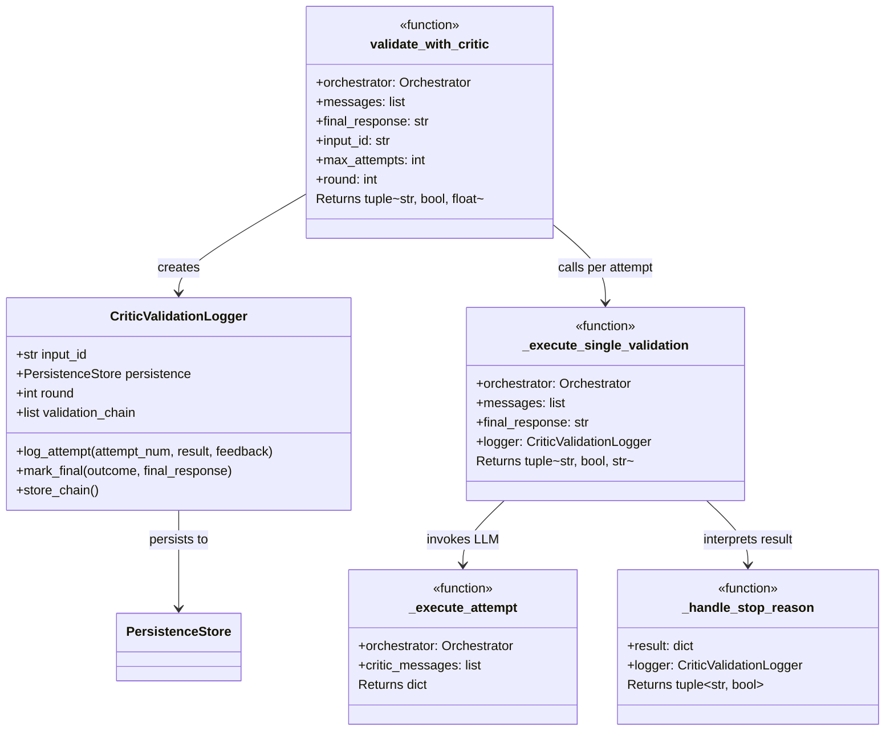
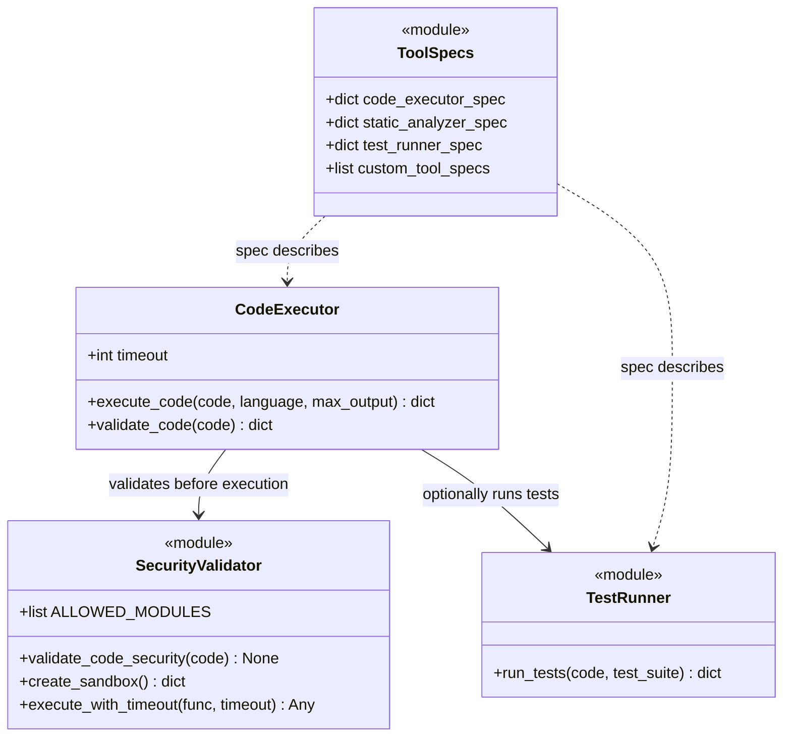
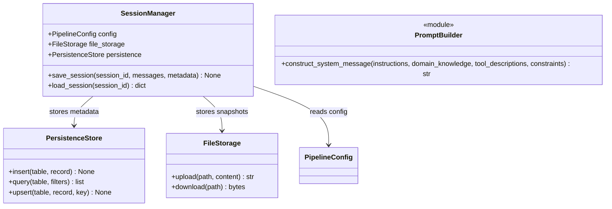
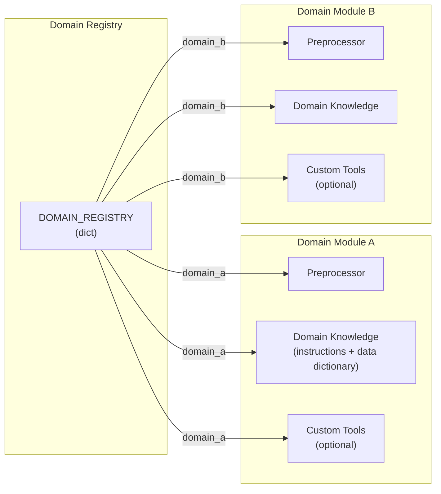
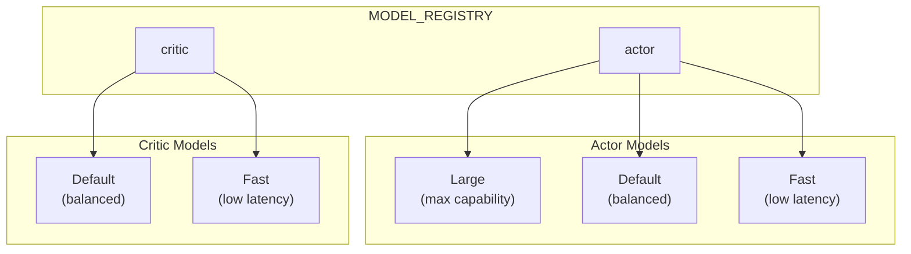
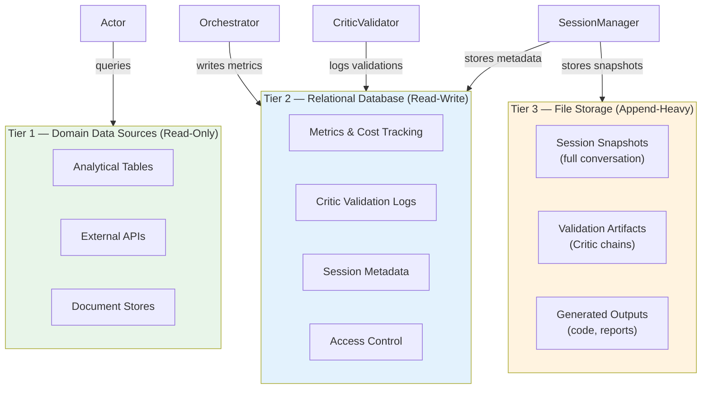
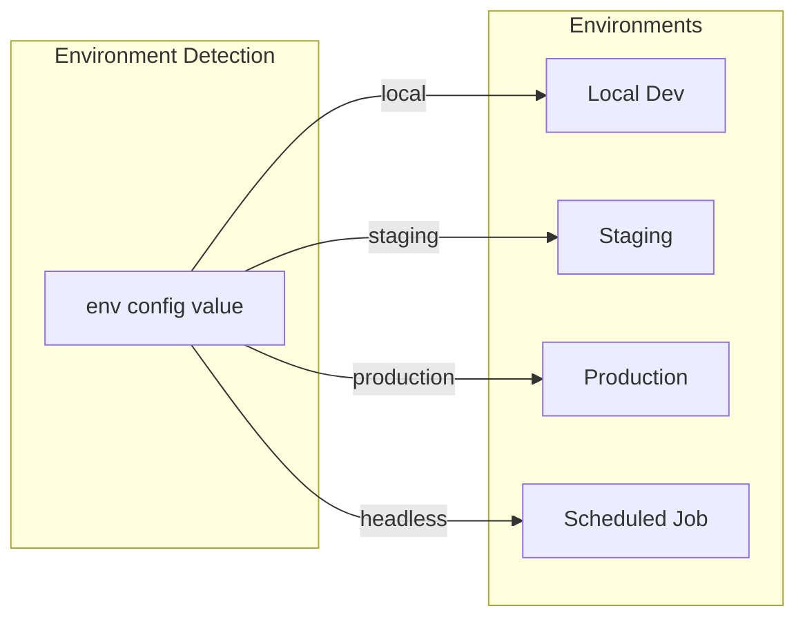

# Actor-Critic Agent Architecture

> **Series**: Actor-Critic Agent Design Pattern
> **Document**: 01 — System Architecture
> **Scope**: Generic dual-agent adversarial pattern for validated, tool-augmented output generation

---

## 1. System Purpose

Modern LLM-based systems that generate executable artifacts — code, SQL queries, analytical reports, infrastructure configurations — face a fundamental reliability problem: a single generative pass offers no guarantee of correctness, completeness, or compliance with domain constraints. Humans catch errors through review; an automated system needs a structural equivalent.

The **Actor-Critic** architecture addresses this by splitting generation and validation into two adversarial agents:

| Role | Responsibility |
|------|---------------|
| **Actor** (Generator) | Produces output from natural language input using tools (code execution, data retrieval, domain APIs). Optimizes for *usefulness and completeness*. |
| **Critic** (Validator) | Evaluates the Actor's output against a structured rubric — correctness, security, style, completeness. Optimizes for *accuracy and compliance*. |

The productive tension between these two agents mirrors the Actor-Critic paradigm from reinforcement learning: the Actor proposes actions, the Critic supplies a value signal, and the system iterates toward higher-quality outputs without human intervention at each step.

**Running example throughout this document:** An Actor agent that generates Python code from natural language descriptions, paired with a Critic agent that validates the code for correctness, security violations, and style compliance before returning it to the user.

---

## 2. High-Level Architecture



**Data flow:**
1. A user request enters through the Frontend Layer and is routed to the Actor Agent.
2. The Actor, via the Orchestrator, calls LLM endpoints and executes tools (code, analysis, tests).
3. Once the Actor produces a final response, the Orchestrator hands it to the Critic Validator.
4. The Critic evaluates the response and either approves it or returns structured feedback.
5. On rejection, the Orchestrator feeds the Critic's feedback back to the Actor for self-correction.
6. The loop repeats up to a configurable maximum number of attempts.

---

## 3. Static Class Diagrams

### 3.1 Core Agent Classes



### 3.2 Critic Validation Classes



### 3.3 Tool Execution Classes



### 3.4 Infrastructure Classes



---

## 4. Component Responsibilities

### Entry Point

The system starts at the **Request Router**, which accepts either an interactive chat message or a headless API call. Both paths converge on the same `ActorAgent.generate_response()` method — the only difference is how `PipelineConfig` is constructed.

### PipelineConfig: The Bridge

`PipelineConfig` is the single source of truth for a pipeline run. It carries everything downstream components need — session identity, model selections, feature flags, and tool specifications — so that no component reaches into global state.

Two factory methods handle the two primary entry modes:

```python
@dataclass
class PipelineConfig:
    session_id: str
    user_id: str
    env: str
    actor_model: str
    critic_model: str
    critic_enabled: bool
    enable_reasoning: bool
    additional_tool_specs: list

    @staticmethod
    def from_interactive(session, user, settings: dict) -> "PipelineConfig":
        """Build config from UI session state and user preferences."""
        return PipelineConfig(
            session_id=session["session_id"],
            user_id=user["id"],
            env=settings.get("env", "production"),
            actor_model=settings.get("actor_model", MODEL_REGISTRY["actor"]["default"]),
            critic_model=settings.get("critic_model", MODEL_REGISTRY["critic"]["default"]),
            critic_enabled=settings.get("critic_enabled", True),
            enable_reasoning=settings.get("enable_reasoning", False),
            additional_tool_specs=settings.get("additional_tools", []),
        )

    @staticmethod
    def from_headless(config_dict: dict) -> "PipelineConfig":
        """Build config from a flat dictionary (API / scheduled job)."""
        return PipelineConfig(**config_dict)
```

### Callback-Driven UI Integration

The Orchestrator never imports UI code. Instead, the frontend wires **callbacks** at initialization time. This decouples the core engine from any specific rendering framework.

| Callback | Signature | Purpose |
|----------|-----------|---------|
| `on_output` | `(chunk: str) → None` | Stream partial output tokens to the UI as they arrive |
| `on_tool_call` | `(name: str, args: dict) → None` | Display tool invocation (e.g., "Running code…") |
| `on_tool_response` | `(name: str, result: dict) → None` | Display tool result (e.g., execution output) |
| `on_cost_update` | `(delta: float, total: float) → None` | Update running cost display |
| `on_status` | `(status: str, detail: str) → None` | Show pipeline phase ("Validating with Critic…") |

Example wiring in a web frontend (e.g., Gradio, Streamlit, or a custom React app):

```python
def setup_pipeline(session_state):
    config = PipelineConfig.from_interactive(
        session=session_state,
        user=session_state["user"],
        settings=session_state["settings"],
    )
    orchestrator = Orchestrator(
        config=config,
        persistence=PersistenceStore(),
        auth_manager=AuthManager.get_instance(),
    )
    orchestrator.on_output = lambda chunk: message_container.markdown(chunk)
    orchestrator.on_tool_call = lambda name, args: status_bar.info(f"Calling {name}…")
    orchestrator.on_cost_update = lambda d, t: cost_display.metric("Cost", f"${t:.4f}")
    orchestrator.on_status = lambda s, d: status_bar.info(f"{s}: {d}")

    return ActorAgent(config=config, orchestrator=orchestrator)
```

---

## 5. Configuration and Registry System

### Domain / Use-Case Registry

Each domain the system supports is a self-contained module. A central registry maps domain identifiers to their module components:



```python
DOMAIN_REGISTRY = {
    "code_generation": {
        "preprocessor": "domains.code_generation.preprocess.Preprocessor",
        "instructions": "domains/code_generation/INSTRUCTIONS.md",
        "domain_knowledge": "domains/code_generation/DOMAIN_KNOWLEDGE.md",
        "custom_tools": "domains.code_generation.tools",
    },
    "data_analysis": {
        "preprocessor": "domains.data_analysis.preprocess.Preprocessor",
        "instructions": "domains/data_analysis/INSTRUCTIONS.md",
        "domain_knowledge": "domains/data_analysis/DOMAIN_KNOWLEDGE.md",
        "custom_tools": None,
    },
}
```

Each domain module contains:

| Component | Required | Purpose |
|-----------|----------|---------|
| `preprocessor` | Yes | Loads domain config, metadata, and constraints |
| `instructions` | Yes | Behavioral guidelines for the Actor (Markdown) |
| `domain_knowledge` | Yes | Schema definitions, business rules, reference material |
| `custom_tools` | No | Domain-specific tool specs and handlers |

### Model Configuration



```python
MODEL_REGISTRY = {
    "actor": {
        "large": "llm-provider/large-model-endpoint",
        "default": "llm-provider/default-model-endpoint",
        "fast": "llm-provider/fast-model-endpoint",
    },
    "critic": {
        "default": "llm-provider/critic-default-endpoint",
        "fast": "llm-provider/critic-fast-endpoint",
    },
}
```

The Critic typically does not need a "large" variant — its task (structured evaluation against a rubric) is less open-ended than generation, so a smaller, faster model often suffices.

---

## 6. Storage Architecture

The system uses a three-tier storage model that separates concerns by access pattern and data lifecycle.



| Tier | Storage Type | Access Pattern | Retention | Examples |
|------|-------------|---------------|-----------|---------|
| **Tier 1** | Domain data sources | Read-only from the pipeline | Managed externally | Analytical tables, APIs, document stores |
| **Tier 2** | Relational database | Structured read-write | Retained for auditing | LLM cost logs, Critic validation results, session metadata |
| **Tier 3** | File / object storage | Append-heavy, bulk retrieval | Archived periodically | Full conversation snapshots, Critic feedback chains, generated artifacts |

**Why three tiers?** Tier 1 data is often large and governed by external teams — the pipeline must not write to it. Tier 2 data is small, structured, and queried frequently (dashboards, cost reports). Tier 3 data is large and rarely queried but essential for debugging and replay.

---

## 7. Environment-Aware Design

The system adapts its behavior based on the detected environment. This is controlled by a single configuration value (`env`) that propagates through `PipelineConfig`.



| Aspect | Local Dev | Staging | Production | Scheduled Job |
|--------|-----------|---------|------------|---------------|
| **Logging level** | DEBUG | INFO | WARNING | INFO |
| **Critic enabled** | Optional (toggle) | Always | Always | Always |
| **Debug display** | Full (tool calls, raw LLM output) | Partial | Minimal | None (logs only) |
| **Config source** | Local file (`.env` / `secrets.toml`) | Environment variables | Secret manager | Job parameters |
| **Auth mode** | Dev token / skip | OAuth | OAuth (singleton, auto-refresh) | Service principal |
| **Cost tracking** | Local DB / console | Staging DB | Production DB | Production DB |
| **Persistence** | SQLite / local Postgres | Staging Postgres | Production Postgres | Production Postgres |

```python
def configure_logging(env: str):
    levels = {
        "local": logging.DEBUG,
        "staging": logging.INFO,
        "production": logging.WARNING,
        "headless": logging.INFO,
    }
    logging.basicConfig(level=levels.get(env, logging.INFO))


def should_display_debug(env: str) -> bool:
    return env in ("local", "staging")


def get_auth_manager(env: str) -> AuthManager:
    if env == "local":
        return AuthManager.from_dev_token(os.getenv("DEV_TOKEN"))
    if env == "headless":
        return AuthManager.from_service_principal(
            client_id=os.getenv("SP_CLIENT_ID"),
            client_secret=os.getenv("SP_CLIENT_SECRET"),
        )
    return AuthManager.get_instance()  # singleton with OAuth auto-refresh
```

> **Real-world note:** A production deployment of this pattern uses environment detection (e.g., `local`, `staging`, `production`) to toggle debug sidebars, logging verbosity, and catalog selection — demonstrating how the same generic pattern adapts to any cloud topology (AWS, GCP, Azure, or a managed data platform).

---

## Summary

This document established the structural foundation of the Actor-Critic agent architecture:

- **Dual-agent adversarial design** separates generation (Actor) from validation (Critic), creating a self-correcting pipeline.
- **PipelineConfig** acts as the single configuration bridge between frontends and the core engine.
- **Callback-driven integration** decouples the engine from any specific UI framework.
- **Domain registry** enables multiple use cases within one deployment.
- **Three-tier storage** separates domain data, operational metrics, and bulk artifacts.
- **Environment-aware configuration** adapts behavior from local development to production to headless jobs.

The next document covers the Orchestrator and tool execution pipeline in detail — how tool calls are dispatched, how results flow back into the LLM context, and how the Critic validation loop integrates with the generation cycle.

---

<div align="center">

**Actor-Critic Agent Design Pattern — Document Series**

| Document | Title |
|----------|-------|
| **01** | **Actor-Critic Architecture** *(this document)* |
| [02](./02_actor_critic_workflow.md) | Agentic Workflow Deep-Dive |
| [03](./03_critic_validation_system.md) | Critic Validation System |
| [04](./04_tool_calling_system.md) | Tool Calling System |
| [05](./05_guardrail_design_and_causal_analysis.md) | Guardrail Design & Causal Analysis |
| [06](./06_adversarial_dynamics_and_convergence.md) | Adversarial Dynamics & Convergence |
| [07](./07_limitations_and_enhancements.md) | Limitations & Enhancements |
| [08](./08_causal_nash_equilibrium_convergence.md) | Causal Nash Equilibrium Convergence |

</div>
