# Actor-Critic Agentic Workflow

> **Series**: Actor-Critic Agent Design Pattern
> **Document**: 02 — End-to-End Workflow

This document traces the complete lifecycle of a request through a dual-agent system that follows the **Actor-Critic reinforcement-learning paradigm**. The Actor (Generator) produces outputs using tools; the Critic (Validator) evaluates those outputs and triggers corrections when necessary.

Throughout, we use a **code-generation assistant** as the running example: the Actor writes code, calls linters and test-runners, and the Critic validates correctness, security, and grounding.

---

## 1. The Dual-Agent Paradigm

The architecture separates *generation* from *validation* into two independently-reasoned agents, each backed by a distinct LLM. This mirrors the Actor-Critic split in reinforcement learning, where the Actor selects actions and the Critic estimates value.

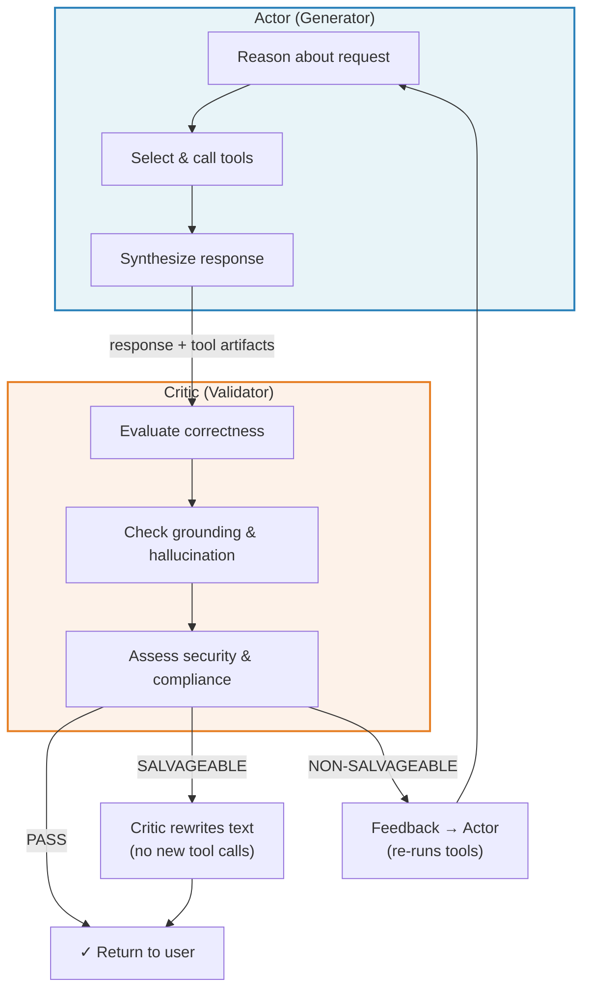

### Why Cross-Model Diversity Matters

| Concern | Mitigation |
|---|---|
| Shared blind spots | Use different model families (e.g., GPT-series Actor, Claude-series Critic) so systematic biases do not overlap |
| Sycophantic agreement | A Critic from a different provider is less likely to rubber-stamp the Actor's reasoning |
| Cost efficiency | The Critic can run on a smaller, cheaper model since validation is narrower than generation |
| Latency control | Critic evaluation runs only once per attempt and can use a faster model tier |

> **Example from practice**: A production analytics platform may pair a high-capability Actor model with a cost-efficient Critic from a different family, achieving both quality and budget goals.

---

## 2. End-to-End Sequence Diagram

The following diagram traces a single user request from submission through Actor generation, tool execution, Critic validation (with correction branches), and final rendering.

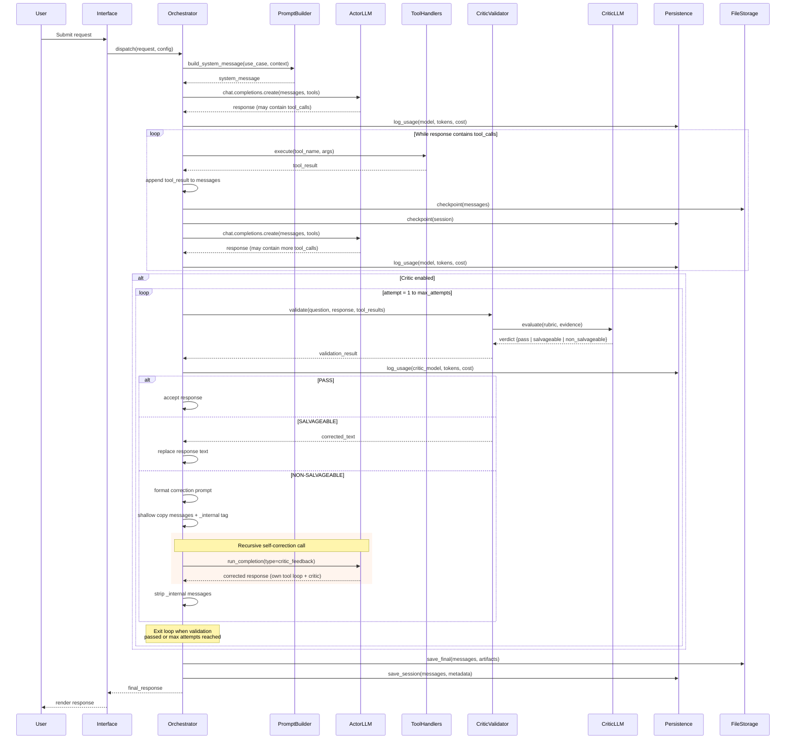

### Key Observations

- **Tool calls are iterative**: the Actor may chain multiple rounds of tool calls before producing a final text response.
- **Checkpointing after every tool round** enables crash recovery without re-executing expensive tool calls.
- **Non-salvageable correction is recursive**: the inner `run_completion` call runs its own independent tool loop and Critic validation, converging on a corrected response.
- **Internal messages never leak**: `_internal`-tagged messages are stripped before the response reaches the user.

---

## 3. System Prompt Construction

The system message is the single most important lever for controlling agent behavior. It is assembled dynamically at request time from composable fragments.

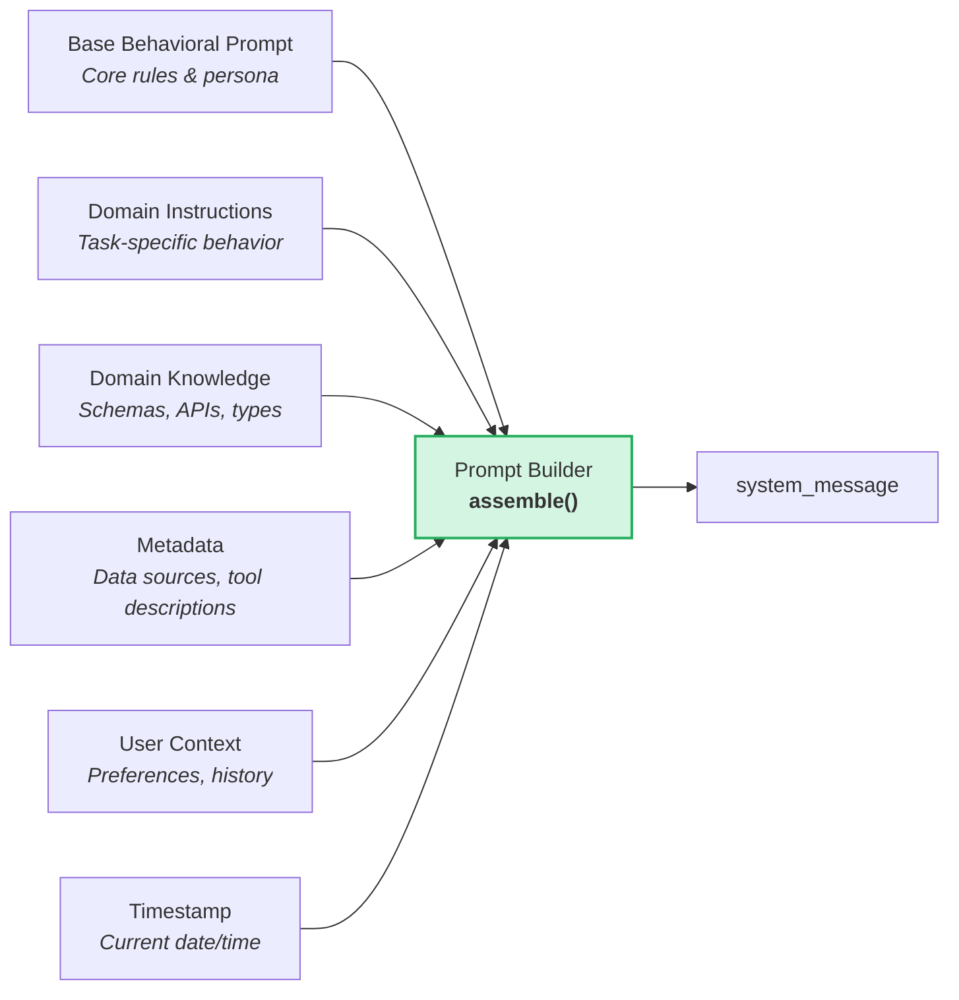

### Assembly Pattern

```python
def build_system_message(
    base_prompt: str,
    domain_instructions: str,
    domain_knowledge: str,
    sources: list[dict],
    user_context: dict | None = None,
    current_timestamp: str | None = None,
) -> str:
    current_timestamp = current_timestamp or datetime.now().isoformat()

    system_message = f"""# Instructions
{base_prompt}

## Domain Context
{domain_instructions}

## Domain Knowledge
{domain_knowledge}

## Available Data Sources
{format_data_sources(sources)}

## Current Timestamp
{current_timestamp}
"""

    if user_context:
        system_message += f"\n## User Context\n{format_user_context(user_context)}\n"

    return system_message
```

### Key Design Decisions Embedded in the System Prompt

| Decision | Rationale |
|---|---|
| **Data-driven only — no recommendations** | The agent presents facts and computed results; it does not speculate beyond what tools return. Prevents hallucinated advice. |
| **Clarify before acting** | When the request is ambiguous, the agent asks a clarifying question rather than guessing intent. Reduces wasted tool calls. |
| **Self-validation checklist** | The prompt includes a pre-flight checklist the Actor must mentally run before responding (e.g., "Did I answer the exact question asked?"). Acts as a lightweight inner critic. |
| **Tool-first computation** | Arithmetic, aggregations, and lookups must go through tools — the LLM must not perform calculations in-context. Eliminates a class of numerical hallucinations. |
| **Sequential tool calls** | Tools are called one at a time (no parallel dispatch) so each call can use results from the previous one. Simplifies debugging and cost attribution. |

---

## 4. The LLM Interaction Cycle

### API Argument Preparation

Different model families require different API arguments. The orchestrator normalizes this behind a model-family dispatcher.

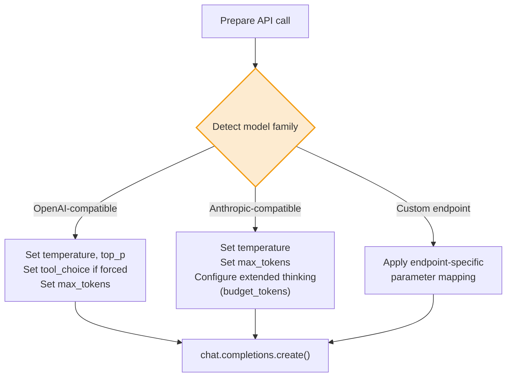

### Response Processing Pipeline

Every LLM response — whether from the Actor or the Critic — passes through the same 6-step pipeline.

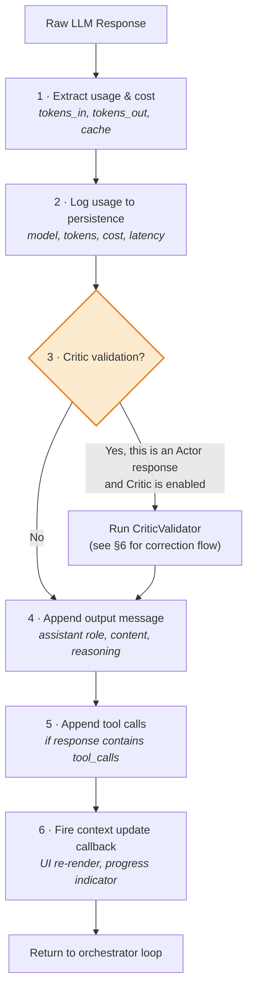

**Step 1 — Cost extraction** deserves special attention: the raw `usage` object varies by provider, so a normalizer maps provider-specific fields (e.g., `cache_creation_input_tokens`, `prompt_tokens_details.cached_tokens`) to a canonical schema before cost calculation.

---

## 5. Tool Call Loop Mechanics

### State Machine

The tool-call loop is the inner engine of the Actor agent. It runs until the LLM produces a response with no further tool calls, then hands off to the Critic.

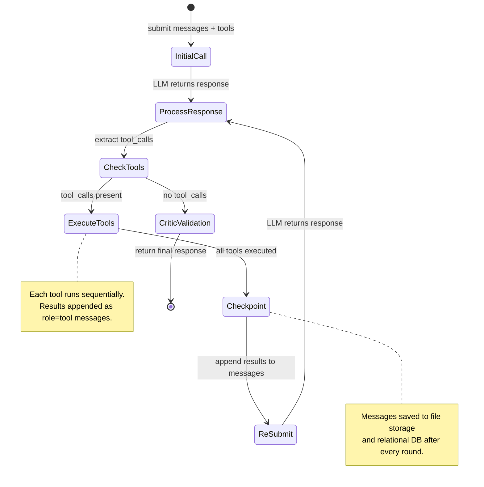

### Tool Execution Pattern

```python
for tool_call in response.tool_calls:
    tool_name = tool_call.function.name
    args = json.loads(tool_call.function.arguments)

    if tool_name in tool_handlers:
        result = tool_handlers[tool_name](**args)
    else:
        result = f"Unknown tool: {tool_name}"

    messages.append({
        "role": "tool",
        "tool_call_id": tool_call.id,
        "content": str(result),
    })
```

### Tool Registration Pattern

Tools are defined as paired *specification* + *handler* entries. A factory function splits them into the two structures the orchestrator needs.

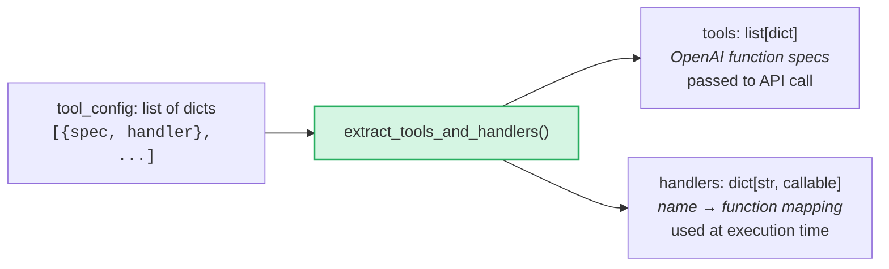

```python
def extract_tools_and_handlers(
    tool_config: list[dict],
) -> tuple[list[dict], dict[str, callable]]:
    tools = [entry["spec"] for entry in tool_config]
    handlers = {
        entry["spec"]["function"]["name"]: entry["handler"]
        for entry in tool_config
    }
    return tools, handlers
```

This separation keeps tool definitions declarative and co-located (easy to audit) while giving the orchestrator efficient O(1) handler lookup at runtime.

---

## 6. Self-Correction Flow

Self-correction is the mechanism by which non-salvageable Critic feedback triggers the Actor to re-generate its response from scratch, potentially re-running tools. The design uses **recursive orchestrator invocation** to reuse all existing logic (tool loop, checkpointing, Critic validation) without duplication.

### Detailed Sequence

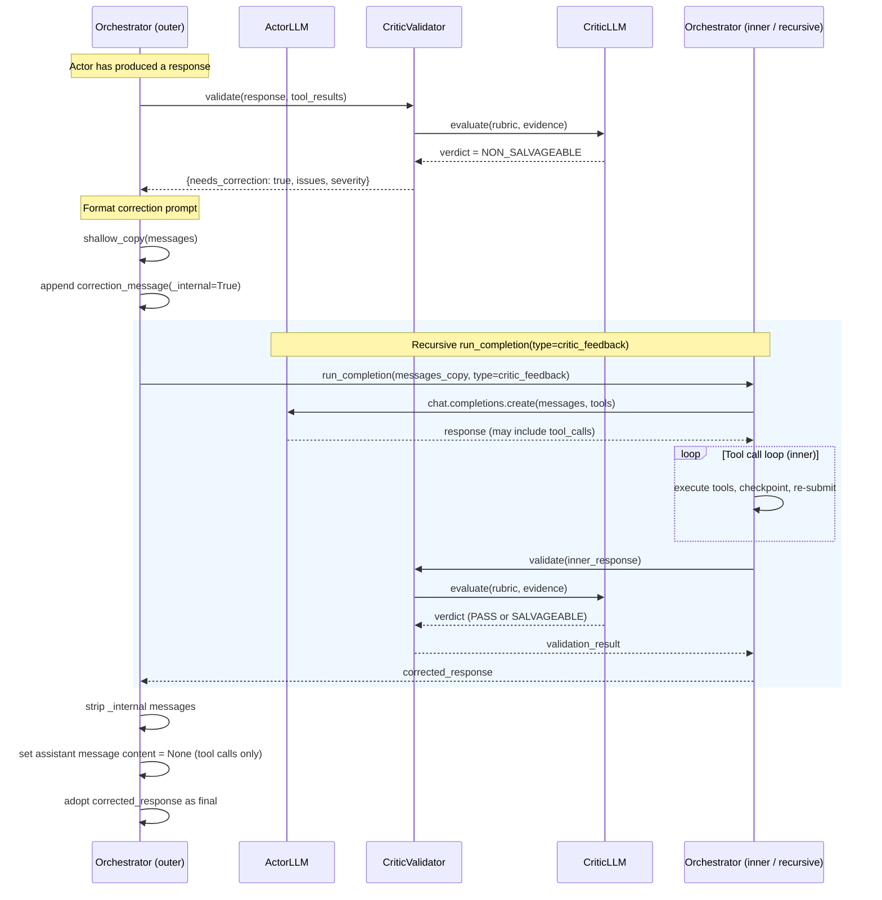

### Two-Layer Prompt Guardrailing

The user must never see evidence of corrections. Two independent guardrails enforce this.

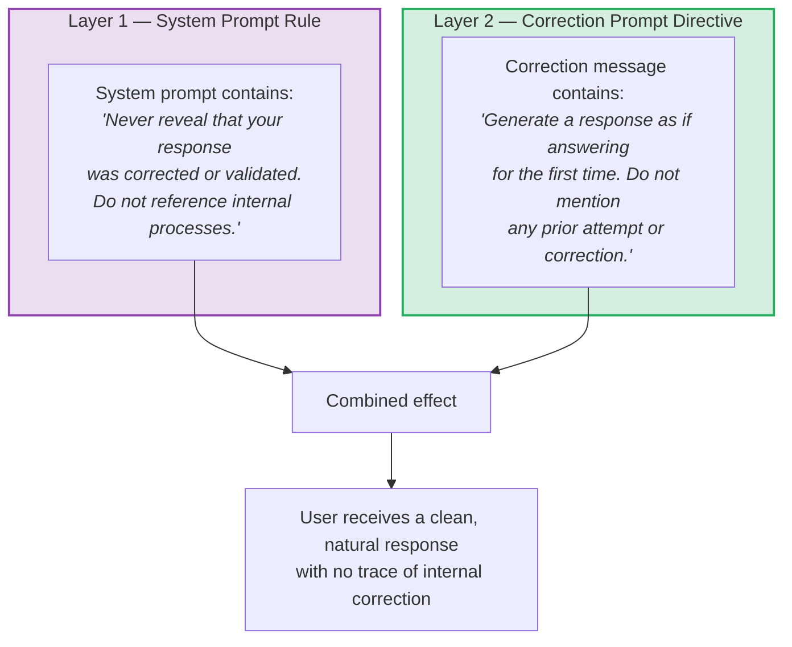

Having two independent layers means the guardrail holds even if one layer is partially ignored by the LLM. This is defense-in-depth applied to prompt engineering.

### Internal Message Lifecycle

Internal messages exist only for the duration of a correction cycle and are never persisted or shown to the user.

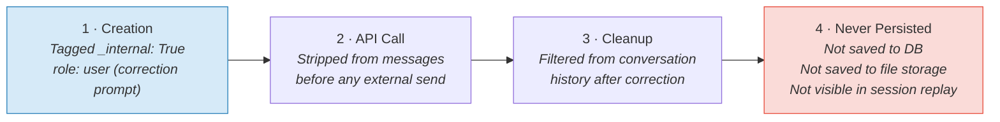

### Correction Prompt Template

```text
VALIDATION FAILED - CORRECTION REQUIRED

Issues detected: {detected_issues}
Root Cause: {root_cause}
Severity: {severity}
Recommendation: {recommendation}

Generate a corrected response addressing all identified issues.
Respond as if answering the user's question for the first time.
Do not reference any prior attempt, validation, or correction process.
```

The template is deliberately terse and structured. Verbose correction prompts risk the LLM echoing the correction language back to the user. Bullet-point issues with a clear directive minimize that risk.

---

## 7. Session Checkpointing

Checkpointing preserves conversation state after every tool-call round, enabling crash recovery without re-executing expensive or non-idempotent tool calls.

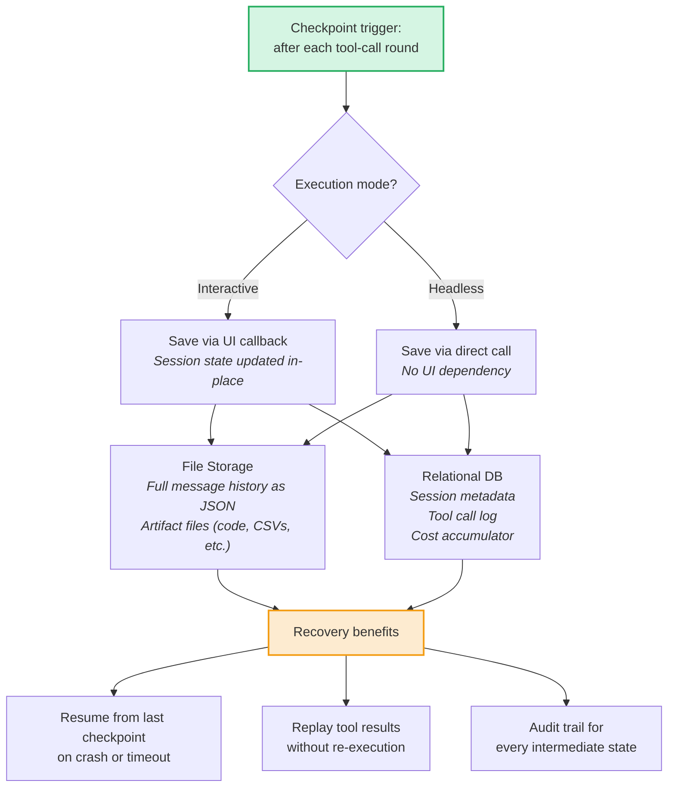

---

## 8. Cost Tracking Pipeline

Every LLM call — Actor or Critic, outer or recursive — feeds into a unified cost-tracking pipeline.

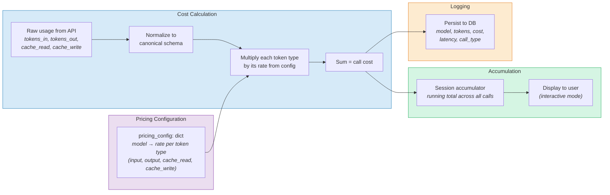

### Rate Normalization

Providers express rates differently (per-million tokens, per-thousand tokens, in dollars, in platform-specific units). The cost module normalizes everything to a single canonical unit (e.g., USD) using a conversion factor from the pricing config.

```python
def calculate_cost(usage: dict, model: str, pricing: dict) -> float:
    rates = pricing[model]
    cost = (
        usage["input_tokens"] * rates["input"]
        + usage["output_tokens"] * rates["output"]
        + usage.get("cache_read_tokens", 0) * rates.get("cache_read", 0)
        + usage.get("cache_write_tokens", 0) * rates.get("cache_write", 0)
    )
    return cost * rates.get("unit_conversion", 1.0)
```

---

## 9. Headless vs Interactive Execution

The same orchestrator backend drives both interactive (UI-driven) and headless (API/batch) execution modes. The difference is entirely in how callbacks and configuration are wired.

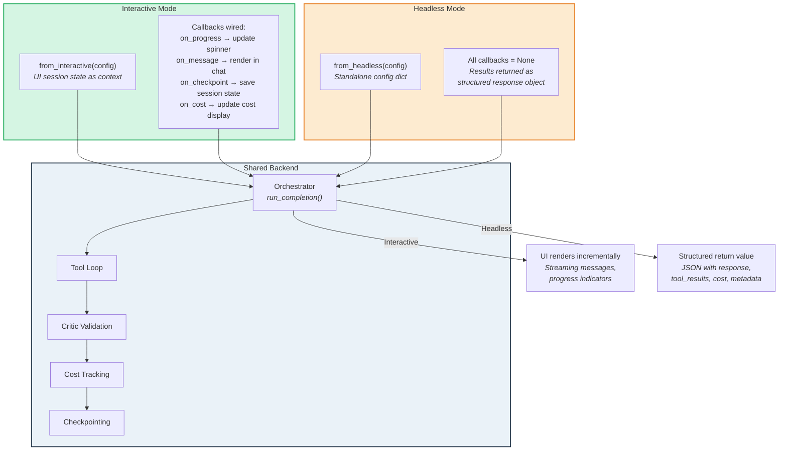

### Configuration Factory Pattern

```python
@classmethod
def from_interactive(cls, session_state: dict) -> "Orchestrator":
    return cls(
        messages=session_state["messages"],
        tools=session_state["tools"],
        on_progress=lambda msg: update_spinner(msg),
        on_message=lambda msg: render_chat_message(msg),
        on_checkpoint=lambda: save_session_state(),
        on_cost=lambda c: update_cost_display(c),
    )

@classmethod
def from_headless(cls, config: dict) -> "Orchestrator":
    return cls(
        messages=config["messages"],
        tools=config["tools"],
        on_progress=None,
        on_message=None,
        on_checkpoint=None,
        on_cost=None,
    )
```

The callback-or-None pattern means the orchestrator's core logic contains no UI imports and no conditional branches for "am I headless?". Each callback site is simply:

```python
if self.on_progress:
    self.on_progress("Executing tool: " + tool_name)
```

This makes the orchestrator independently testable and deployable in serverless / batch contexts without any UI framework dependency.

---

## Summary

| Phase | Actor | Critic | Key Artifact |
|---|---|---|---|
| Prompt construction | Receives assembled system message | — | `system_message` |
| Generation | Calls LLM, executes tools iteratively | — | `messages[]`, tool results |
| Validation | — | Evaluates response against rubric | `validation_result` |
| Salvageable fix | — | Rewrites text in-place | Corrected `content` |
| Non-salvageable fix | Re-runs via recursive call with feedback | Re-validates inner response | Corrected response (internal messages stripped) |
| Checkpointing | After every tool round | — | File storage + DB snapshot |
| Cost tracking | Every LLM call logged | Every LLM call logged | `cost_accumulator` |

The workflow's power comes from composability: the same `run_completion` function handles first attempts, recursive corrections, and headless batch runs. The Critic is an opt-in layer that bolts onto the existing tool loop without modifying it. And checkpointing ensures that even long, multi-tool conversations can recover gracefully from failures.
