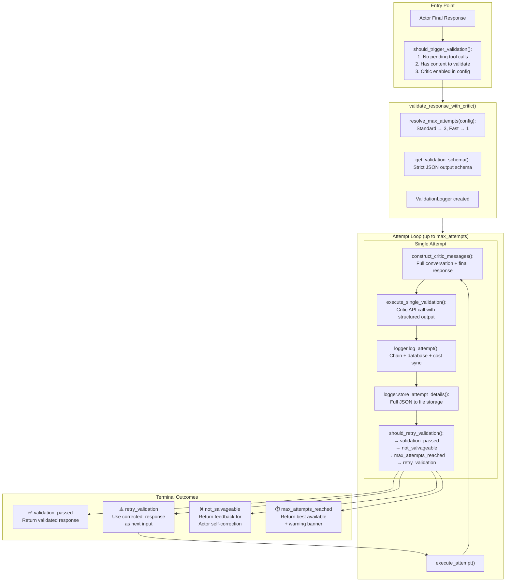
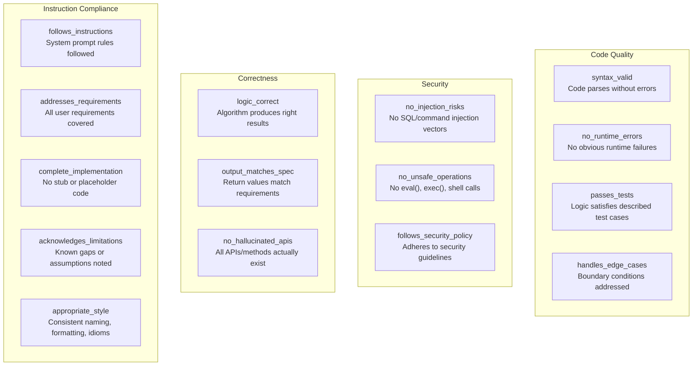
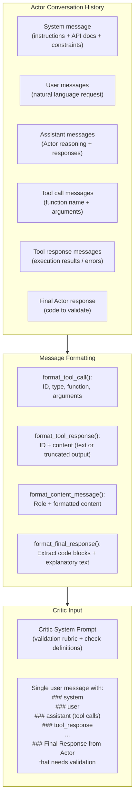
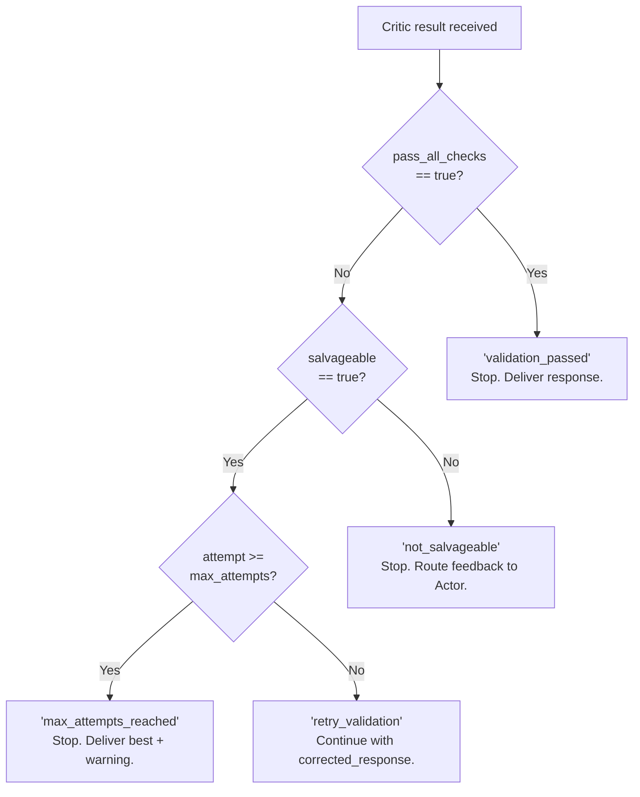
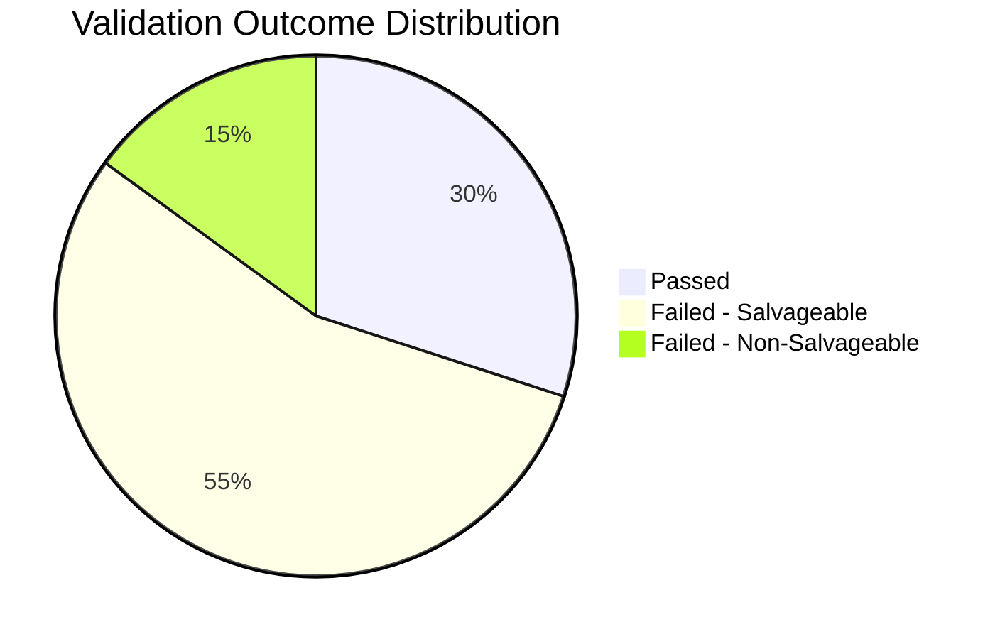
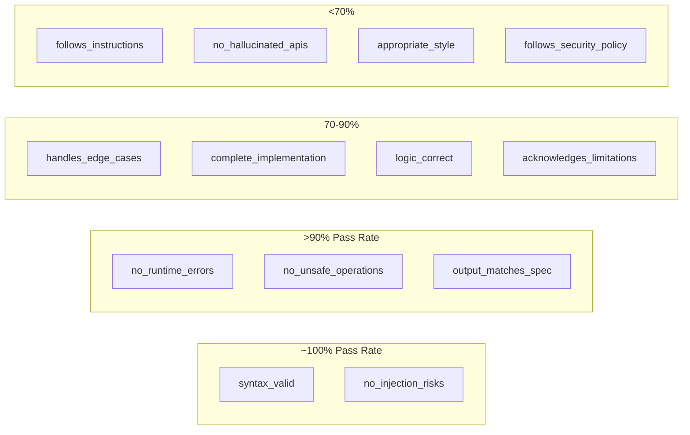
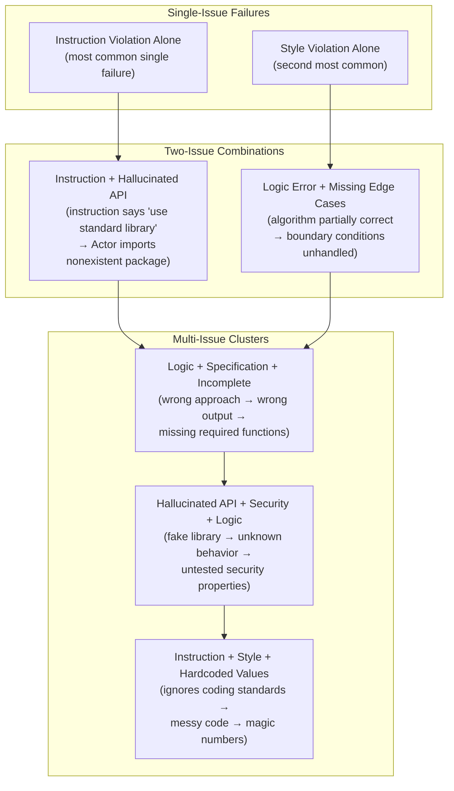
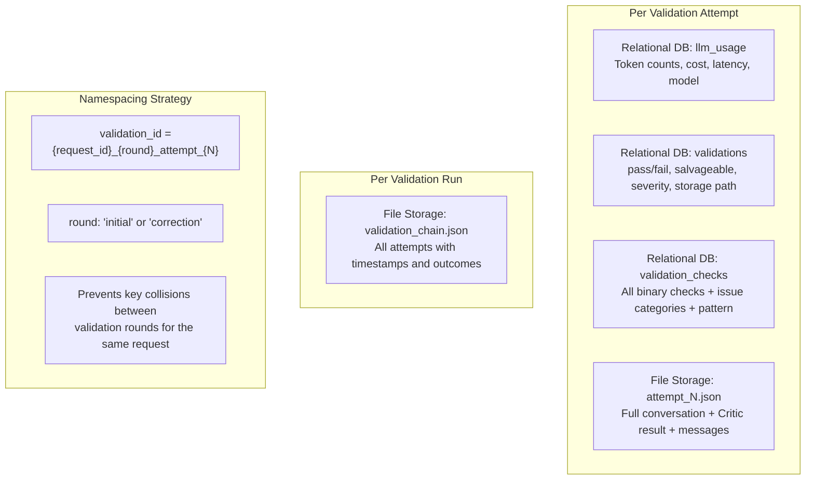
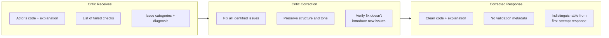

# Actor-Critic Agent Design — Critic Validation System

This document provides a detailed analysis of the Critic validation subsystem — the automated quality gate that evaluates every Actor response before it reaches the user. We use **code generation** as the running example throughout: an Actor that generates code from natural language requests, and a Critic that validates correctness, security, and style.

> **Note on terminology:** The Actor-Critic pattern is a general architecture. Specific implementations may use different names — for example, "Primary Agent" and "Validator" or "Generator" and "Checker." The principles described here are implementation-agnostic.

---

## Table of Contents

- [Purpose and Design Philosophy](#purpose-and-design-philosophy)
- [Validation Architecture](#validation-architecture)
- [Validation Schema](#validation-schema)
- [Validation Flow — Step by Step](#validation-flow--step-by-step)
- [Salvageable vs Non-Salvageable Errors](#salvageable-vs-non-salvageable-errors)
- [Empirical Considerations](#empirical-considerations)
- [Failure Pattern Taxonomy](#failure-pattern-taxonomy)
- [Logging and Observability](#logging-and-observability)
- [Critic Prompt Engineering](#critic-prompt-engineering)

---

## Purpose and Design Philosophy

LLMs can produce syntactically elegant code that is subtly incorrect — a hallucinated API method that looks right, an off-by-one error buried in a loop, an SQL injection vulnerability masked by clean formatting. The Critic exists to catch these failures before they ship to users, applying an independent model as a structured second opinion.

Key design decisions:

1. **Cross-model validation** — Using a different model family for the Critic than the Actor creates diversity in reasoning patterns. Where one model has blind spots, the other is less likely to share them. For example, if the Actor is a Claude variant, the Critic might be a GPT variant, or vice versa.

2. **Structured output** — The Critic returns a machine-parseable JSON schema, not free-text commentary. This enables programmatic routing: the orchestrator can branch on `pass_all_checks`, iterate on `salvageable`, or escalate on `not_salvageable` without parsing natural language.

3. **Graduated response** — Three tiers of validation outcomes:
   - **Pass**: All checks satisfied. Deliver the Actor's output as-is.
   - **Salvageable fix**: Issues exist but the Critic can correct them from the available context (e.g., fixing a variable name, adding missing error handling to already-correct logic).
   - **Non-salvageable feedback**: Fundamental problems requiring the Actor to re-execute (e.g., wrong algorithm, hallucinated library).

4. **Two correction paths** — The Critic self-corrects surface-level issues (style, minor logic fixable from existing output). For fundamental issues (wrong approach, missing data retrieval, hallucinated APIs), feedback is routed back to the Actor for re-execution with new tool calls.

5. **Fail-safe default** — After exhausting the maximum number of validation attempts, the system delivers the best available response accompanied by a warning banner. No user query is silently dropped.

---

## Validation Architecture



---

## Validation Schema

The Critic returns a strict JSON schema with four categories of binary checks, an issues array, and a diagnosis object. All categories are designed for the code generation domain.

### Binary Validation Checks



Each check resolves to a boolean (`true`/`false`). The top-level `pass_all_checks` field is the logical AND of all individual checks.

### Issues Detected (16 Categories)

When checks fail, specific issues are categorized and classified by salvageability:

| Category | Description | Salvageability |
|---|---|---|
| `syntax_error` | Code contains syntax errors (missing brackets, invalid tokens) | Salvageable |
| `logic_error` | Incorrect algorithm or control flow | Depends |
| `hallucinated_api` | References a non-existent API, method, or library function | Not salvageable |
| `missing_error_handling` | No try/catch for risky operations (I/O, network, parsing) | Salvageable |
| `security_vulnerability` | Injection vectors, unsafe eval, hardcoded secrets | Not salvageable |
| `incomplete_implementation` | Missing required functions, TODO stubs left in place | Depends |
| `wrong_language` | Code written in the wrong programming language | Not salvageable |
| `style_violation` | Naming convention, formatting, or idiom issues | Salvageable |
| `type_error` | Mismatched types, wrong argument types to functions | Salvageable |
| `deprecated_api_usage` | Uses deprecated or removed APIs/methods | Salvageable |
| `missing_imports` | Required imports or dependencies not included | Salvageable |
| `race_condition` | Concurrency issues in async or multi-threaded code | Not salvageable |
| `resource_leak` | Unclosed file handles, database connections, sockets | Salvageable |
| `wrong_data_structure` | Inappropriate data structure for the problem | Not salvageable |
| `hardcoded_values` | Magic numbers or environment-specific values embedded | Salvageable |
| `specification_mismatch` | Output format, return type, or interface doesn't match spec | Depends |

**Salvageability key:**
- **Salvageable**: The Critic can fix it by rewriting portions of the Actor's output.
- **Not salvageable**: Requires the Actor to re-execute with new tool calls or a fundamentally different approach.
- **Depends**: Salvageable if the fix is minor and the surrounding logic is sound; not salvageable if the error is structural.

### Diagnosis Structure

Every validation failure includes a structured diagnosis:

```json
{
    "root_cause": "Function uses deprecated API endpoint",
    "severity": "high",
    "pattern": "deprecated_api_usage",
    "recommendation": "Replace fetch('/v1/users') with fetch('/v2/users')"
}
```

| Field | Type | Description |
|---|---|---|
| `root_cause` | string | Human-readable explanation of what went wrong |
| `severity` | enum | `low` · `medium` · `high` · `not applicable` |
| `pattern` | string | Machine-readable category from the 16-category taxonomy |
| `recommendation` | string | Actionable fix suggestion for the correction path |

---

## Validation Flow — Step by Step

### Phase 1: Message Construction

The orchestrator flattens the entire Actor conversation into a single structured user message for the Critic. This ensures the Critic has full context — including every tool call and its result — without needing to participate in the original conversation.



The flattening serves two purposes: (1) models handle a single well-structured message more reliably than a multi-turn history they didn't participate in, and (2) it provides a clean contract boundary — the Critic receives exactly one input and returns exactly one structured output.

### Phase 2: API Execution

The orchestrator calls the Critic model with forced structured output:

```python
base_args = {
    'model': critic_model,            # Different model family than Actor
    'messages': critic_messages,
    'response_format': validation_schema,  # Strict JSON schema enforcement
}

# Model-specific configuration (example)
if is_reasoning_model(critic_model):
    base_args['reasoning_effort'] = 'medium'

response = client.chat.completions.create(**base_args)
result = json.loads(response.choices[0].message.content)
```

The `response_format` parameter enforces the JSON schema at the API level — the model cannot return a response that doesn't conform. This eliminates an entire class of parsing failures.

### Phase 3: Retry Decision

After each attempt, the orchestrator evaluates the result:



On `retry_validation`, the Critic's `corrected_response` replaces the Actor's original output and the loop re-executes — the Critic validates its own correction. This catches cases where the Critic's fix introduced new issues.

---

## Salvageable vs Non-Salvageable Errors

This distinction is the critical routing decision. It determines whether the Critic patches the output itself or whether the Actor must re-execute from scratch.

```mermaid
flowchart TB
    subgraph Salvageable["Salvageable (Critic fixes output)"]
        direction TB
        S1["Style violations<br/>naming, formatting, indentation"]
        S2["Missing imports<br/>obvious from code context"]
        S3["Minor type errors<br/>fixable without changing logic"]
        S4["Missing error handling<br/>add try/catch around existing code"]
        S5["Hardcoded values<br/>extract to constants or parameters"]
        S6["Deprecated API<br/>known migration path exists"]
        S7["Resource leaks<br/>add cleanup to existing code"]

        SP["Process: Critic provides<br/>corrected_response →<br/>re-validated up to max_attempts"]
    end

    subgraph NonSalvageable["Non-Salvageable (Actor re-executes)"]
        direction TB
        N1["Wrong algorithm<br/>O(n!) when O(n log n) exists"]
        N2["Hallucinated APIs<br/>library.nonExistentMethod()"]
        N3["Wrong language<br/>Python when JavaScript requested"]
        N4["Wrong data structure<br/>fundamental design mismatch"]
        N5["Race conditions<br/>requires architectural rethink"]
        N6["Missing data retrieval<br/>never queried required source"]

        NP["Process: Critic feedback injected<br/>as correction prompt →<br/>Actor makes new tool calls"]
    end

    S1 --> SP
    S2 --> SP
    S3 --> SP
    S4 --> SP
    S5 --> SP
    S6 --> SP
    S7 --> SP

    N1 --> NP
    N2 --> NP
    N3 --> NP
    N4 --> NP
    N5 --> NP
    N6 --> NP
```



**The key heuristic**: if the fix requires only rewriting text/code already present in the Actor's output, it's salvageable. If the fix requires new information or a new execution path the Actor never explored, it's not salvageable.

### Failure Output

After all validation attempts are exhausted:

```
⚠️ The below response did not pass all validation checks. Here is my best attempt.

💡 Consider:
- Rephrase your request to be more specific
- Break down complex tasks into smaller steps
- Specify the programming language, framework version, and expected behavior explicitly
- Start a new session to reset context

---
[Best available response — last corrected version or original]
```

The warning banner is important: it sets user expectations without silently dropping the response. In most cases, the "best available" response is still directionally useful — it may have a style issue or missing edge case, not a fundamental flaw.

---

## Empirical Considerations

Any deployment of the Actor-Critic pattern should track metrics to evaluate Critic effectiveness. The specific numbers will vary by domain, model pairing, and prompt engineering maturity, but the measurement structure is universal.

### Overall Pass Rate Distribution

Track the proportion of validation outcomes across all runs:



> The actual distribution depends on Actor quality, Critic strictness, and domain complexity. A well-tuned system typically sees salvageable failures dominate — this means the Actor is directionally correct but imprecise, which is the ideal operating region.

### Check-Level Performance Ranking

Not all checks fail equally. Expect a gradient from near-perfect to chronically failing:



### Critical Finding: Instruction-Following Is Typically the Hardest Check

Across Actor-Critic deployments, the `follows_instructions` check tends to have the lowest pass rate. This reflects the inherent difficulty LLMs face in adhering to complex, multi-layered behavioral constraints — a system prompt with dozens of rules creates a combinatorial space of potential violations. This is consistent across domains: whether the Actor generates code, analytics reports, or creative writing, instruction compliance is the long pole.

### Latency Considerations

Each validation attempt adds a full LLM inference cycle:

| Metric | Typical Range | Notes |
|---|---|---|
| Single validation call | 10–60s | Depends on context length and model |
| Per-attempt overhead | 15–75s | Includes message construction + logging |
| Worst case (3 attempts) | 45–225s | Significant user-facing latency |

Mitigations:
- **Fast mode**: Set `max_attempts = 1` for latency-sensitive paths
- **Parallel validation**: Run Critic concurrently with UI streaming (show Actor output, then overlay Critic result)
- **Selective triggering**: Only validate complex outputs; auto-pass trivial ones (e.g., clarification questions)

---

## Failure Pattern Taxonomy

Validation failures rarely occur in isolation. They cluster into predictable patterns, with causal chains connecting related check failures.



### Causal Chain Interpretation

The most common escalation path follows a predictable sequence:

1. **Instruction violation** — The Actor doesn't fully adhere to behavioral constraints (e.g., "always use TypeScript strict mode")
2. **Unsupported claims** — Without constraints, the Actor takes liberties (e.g., assumes a library is available)
3. **Hallucinated APIs** — The Actor references methods that don't exist in the assumed library
4. **Logic errors** — Code built on hallucinated foundations produces wrong results
5. **Security gaps** — Unvetted code paths introduce vulnerabilities

This cascade means that improving instruction-following at the root can reduce downstream failures across multiple check categories. Prompt engineering efforts should prioritize instruction compliance.

### Cluster Analysis for Prompt Improvement

Track which failure categories co-occur. If two checks consistently fail together (e.g., `hallucinated_api` and `security_vulnerability`), they likely share a root cause. Address the upstream failure to resolve both.

---

## Logging and Observability

The Critic system should write to multiple persistence layers, enabling both real-time monitoring and post-hoc analysis.



### Storage Structure

```
/storage/sessions/{user_id}/{session_id}/validations/{request_id}/
├── initial/
│   ├── attempt_1.json
│   ├── attempt_2.json
│   ├── attempt_3.json
│   └── validation_chain.json
└── correction/
    ├── attempt_1.json
    └── validation_chain.json
```

### What to Log Per Attempt

| Layer | Fields | Purpose |
|---|---|---|
| Relational DB (usage) | model, input_tokens, output_tokens, cost, latency_ms | Cost tracking and performance monitoring |
| Relational DB (result) | pass_all_checks, salvageable, severity, pattern, attempt_number | Aggregate analytics and dashboards |
| Relational DB (checks) | Each binary check as a column, issue categories, diagnosis fields | Check-level performance analysis |
| File storage (detail) | Full Critic input, full Critic output, all message content | Debugging and prompt iteration |
| File storage (chain) | Ordered list of all attempts with timestamps | End-to-end validation trace |

### Namespacing to Prevent Key Collisions

A single user request can trigger multiple validation rounds:
- **Initial round**: Critic validates the Actor's first response (up to `max_attempts` tries)
- **Correction round**: If the Actor self-corrects after non-salvageable feedback, the new response goes through validation again

The `{request_id}_{round}_attempt_{N}` pattern ensures each attempt has a unique key, even when the same request triggers multiple Critic invocations.

---

## Critic Prompt Engineering

The Critic's system prompt is one of the most carefully engineered components of the system. It must balance strictness (catching real errors) against permissiveness (avoiding false positives that waste retry budget).

### Turn Type Detection

The prompt instructs the Critic to differentiate between response types:

- **Clarification turns** (Actor asks a follow-up question): Auto-pass. No code to validate.
- **Partial responses** (Actor provides explanation but hasn't finished generating code): Auto-pass with note.
- **Code generation turns** (Actor provides code): Full validation against all checks.

This prevents the Critic from failing responses that are structurally correct but don't contain code to validate.

### False Positive Prevention

An extensive section on avoiding false positives — the most common source of wasted retry budget:

- **Equivalent implementations**: Using a `for` loop vs. `map()` for the same result → PASS
- **Reasonable library choices**: Using `axios` instead of `fetch` when either satisfies requirements → PASS
- **Minor naming variations**: `getUserData` vs. `fetchUserData` when no naming convention specified → PASS
- **Stylistic differences**: Single quotes vs. double quotes, trailing commas → PASS (unless style guide specified)
- **Alternative algorithms**: Using quicksort vs. mergesort when no complexity constraint given → PASS

### The Materiality Test

Before failing any check, the Critic should apply a materiality test:

> 1. **Is the core logic correct?** — Does the code produce the right output for standard inputs?
> 2. **Would the issue matter in practice?** — Would this cause a bug in production, or is it cosmetic?
> 3. **Is it a stylistic preference?** — Is the Critic imposing its own preference, or enforcing a stated requirement?
> 4. **Did the Actor actually get it wrong, or just do it differently?** — Multiple correct implementations exist for most problems.

The materiality test prevents the most insidious failure mode: the Critic "improving" correct code and introducing new bugs in the process. Each correction attempt carries risk — it should only trigger when the issue materially affects correctness, security, or compliance.

### Correction Requirements

When the Critic provides a `corrected_response`, it must:

- **Fix ALL identified issues** — Partial fixes fail re-validation and waste an attempt
- **Preserve the Actor's structure** — Code blocks, explanatory text, section headers
- **Maintain language-specific formatting** — Indentation, syntax highlighting markers
- **Keep the user-facing tone** — No references to "validation check #7" or internal system details
- **Never include validation metadata** — The corrected response must be indistinguishable from a first-attempt Actor response



### Prompt Maintenance

The Critic prompt requires ongoing maintenance as the system evolves:

- **New failure modes**: When the Actor produces a novel error pattern, add it to the Critic's taxonomy
- **False positive patterns**: When the Critic repeatedly fails correct output, add an explicit exception
- **Domain evolution**: As the code generation domain changes (new frameworks, deprecated APIs), update the Critic's knowledge base
- **Check calibration**: Periodically review check-level pass rates; consistently 100% checks may be too lenient, consistently <30% checks may be too strict or poorly defined

---

*Previous: [← Actor Workflow](02_actor_workflow.md) | Next: [Tool Calling System →](04_tool_calling_system.md)*
