# 04 — Tool Calling System

> **Series**: Actor-Critic Agent Design Pattern
> **Running Example**: A *code generation* agent where the Actor produces source code and can execute it, run tests, perform static analysis, and lint — while the Critic validates correctness, style, and safety.

---

## 1. Tool Architecture Overview

The tool calling subsystem bridges two execution environments — **remote** (cloud-sandboxed, higher latency, stronger isolation) and **local** (in-process, low latency, weaker isolation) — unified by shared infrastructure for authentication, security, and token accounting.

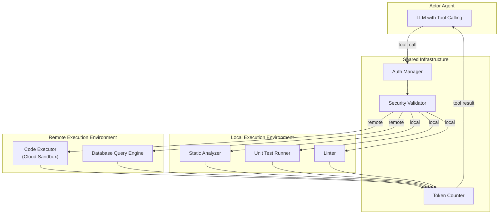

### Tool Comparison Matrix

| Tool | Environment | Typical Latency | Isolation Level | Output Size Risk | Auth Required |
|------|-------------|----------------|-----------------|------------------|---------------|
| **Code Executor** | Remote | 2–30 s | Full sandbox | High (stdout/files) | Yes |
| **Static Analyzer** | Local | 0.1–1 s | Process-level | Low (findings list) | No |
| **Unit Test Runner** | Local | 1–10 s | Process-level | Medium (test report) | No |
| **Linter** | Local | 0.1–0.5 s | Process-level | Low (diagnostics) | No |
| **Custom domain tools** | Varies | Varies | Varies | Varies | Varies |

Remote tools carry higher latency but provide strong isolation guarantees — critical when executing LLM-generated code. Local tools trade isolation for speed and are appropriate for read-only analysis that cannot modify system state.

---

## 2. Tool Registration and Dispatch

### Spec + Handler Pattern

Every tool is a **spec + handler** pair. The spec is an OpenAI-compatible function definition sent to the LLM; the handler is the callable that runs when the LLM invokes that tool.

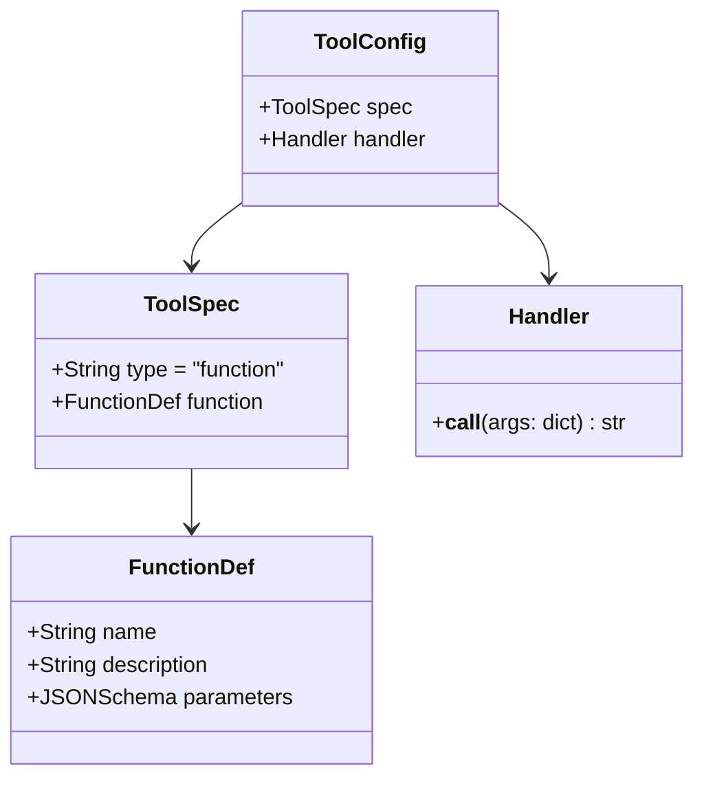

This separation keeps the LLM-facing contract (spec) decoupled from execution logic (handler), enabling independent evolution of either side.

### Registration in the Actor Agent

Tools are assembled into a list of `ToolConfig` dicts during agent setup. Domain-specific tools — loaded from a preprocessor — are appended after the core set.

```python
tool_config = [
    {
        'spec': code_executor_spec,
        'handler': lambda args: execute_code(
            code=args.get('code'),
            language=args.get('language'),
            reason=args.get('reason'),
        )
    },
    {
        'spec': static_analyzer_spec,
        'handler': lambda args: run_static_analysis(
            code=args.get('code'),
            language=args.get('language'),
            rules=args.get('rules', 'default'),
        )
    },
    {
        'spec': test_runner_spec,
        'handler': lambda args: run_tests(
            code=args.get('code'),
            test_code=args.get('test_code'),
            framework=args.get('framework', 'pytest'),
        )
    },
]

# Domain-specific tools appended
for tool in config.additional_tool_specs:
    tool_config.append(tool)
```

### Extraction and Dispatch

Before the first LLM call, the unified `tool_config` list is split into two structures:

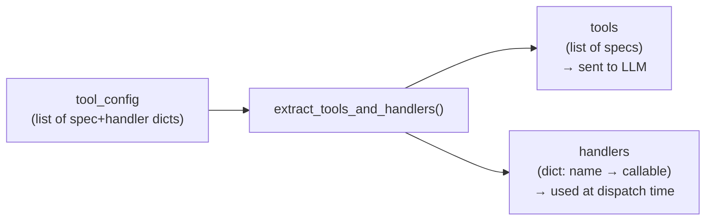

At dispatch time, the orchestrator reads the `function.name` from the LLM's `tool_call`, looks it up in the `handlers` dict, deserializes the JSON arguments, and invokes the callable. The string result is wrapped in a `tool` role message and appended to the conversation.

---

## 3. Code Execution: Remote Sandbox

Remote code execution is the highest-risk tool. The sequence below shows every validation and isolation gate between the Actor's tool call and the sandbox.

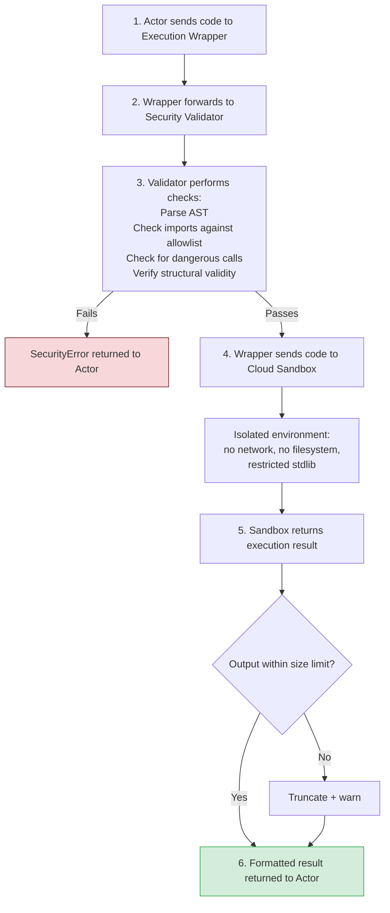

### Code Execution Guardrails

Every piece of LLM-generated code passes through a multi-stage validation pipeline before it reaches the sandbox.

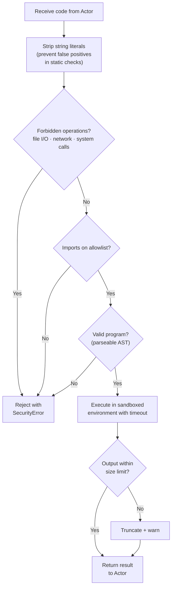

String literal stripping (step 1) prevents false positives — the code `print("do not call os.system()")` should not be flagged. The actual AST walk operates on the structural representation, not raw text.

---

## 4. Static Analysis: Local Execution

Static analysis runs in-process with no sandbox overhead, making it suitable for rapid feedback loops during iterative code generation.

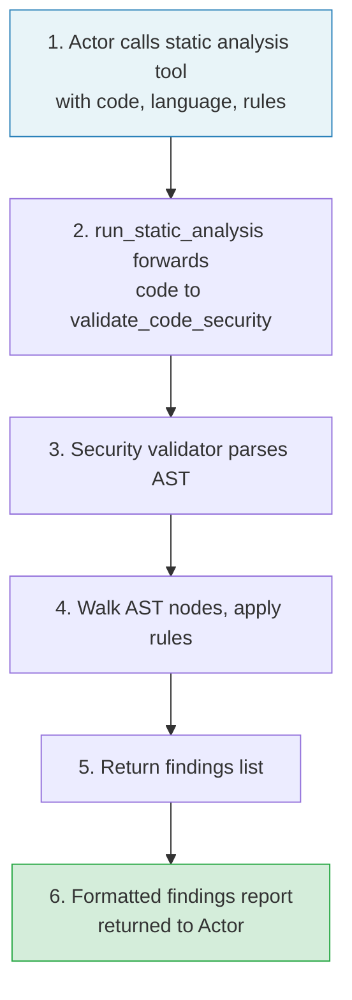

### Three Execution Variants

The code analysis subsystem supports three modes, selected based on the nature of the task the Actor is performing.

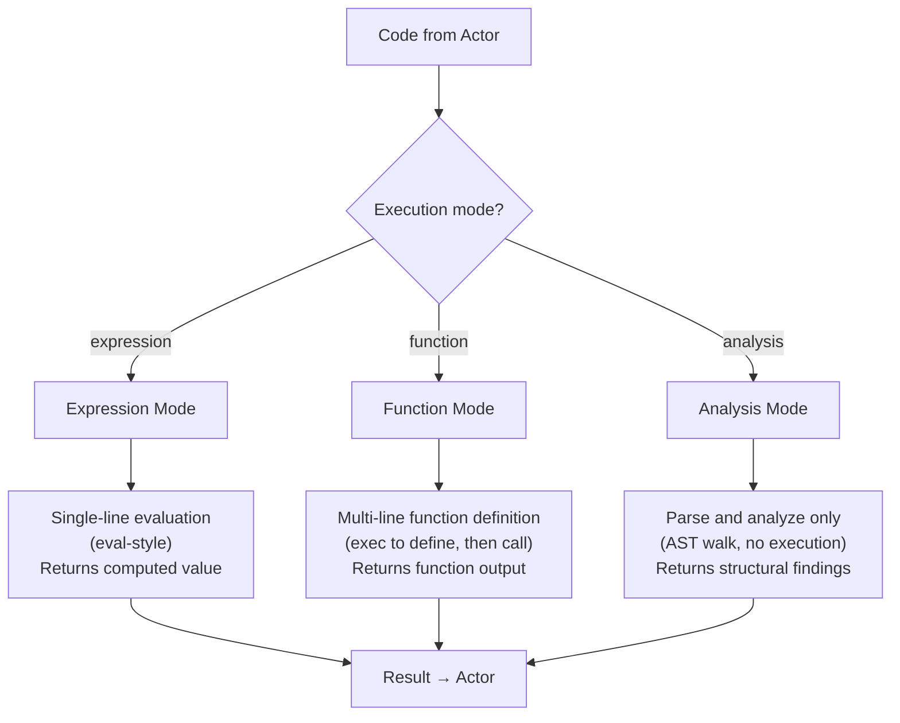

| Mode | Use Case | Executes Code? | Typical Latency |
|------|----------|---------------|-----------------|
| **Expression** | Quick computations, metric formulas | Yes (eval) | < 100 ms |
| **Function** | Complex transformations, multi-step logic | Yes (exec + call) | 100 ms – 1 s |
| **Analysis** | Style checks, complexity metrics, import audits | No (AST only) | 50–200 ms |

Analysis mode is the only variant that can safely run on untrusted code without a sandbox, since it never executes — it only parses and inspects the tree.

---

## 5. Security Model

### Defense Layers

Security is not a single gate but a series of independent layers, each catching a different class of threat. A failure at any layer halts execution.

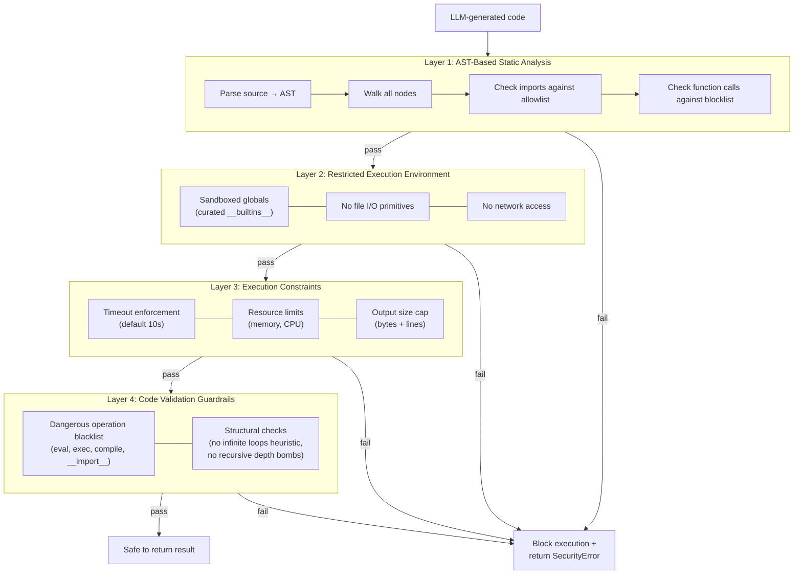

### Allowed vs. Forbidden Operations

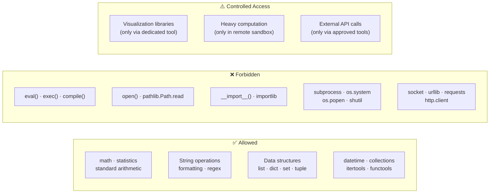

The **Controlled** category covers operations that are legitimate but must go through a specific tool rather than raw code execution. For example, generating a chart is allowed — but only through a dedicated visualization tool that handles rendering in a controlled context, not via arbitrary `matplotlib` calls in user code.

---

## 6. Custom Domain Tools

The tool system is extensible. Each domain-specific preprocessor (one per use case) can register additional tools that the Actor discovers at setup time.

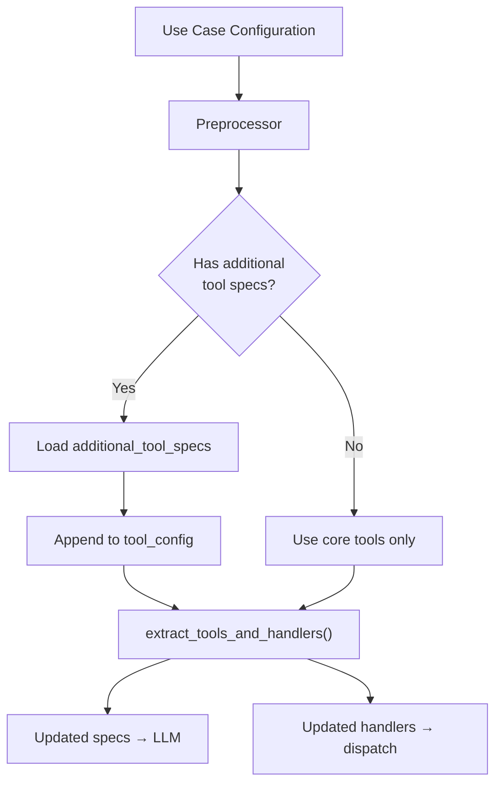

Below is an example custom tool that generates a type-safe API client from an OpenAPI specification — a domain-specific capability that makes sense for a code generation use case.

```python
custom_tool_spec = {
    'type': 'function',
    'function': {
        'name': 'generate_api_client',
        'description': 'Generate a type-safe API client from an OpenAPI specification',
        'parameters': {
            'type': 'object',
            'properties': {
                'spec_url': {'type': 'string', 'description': 'URL to OpenAPI spec'},
                'language': {'type': 'string', 'enum': ['python', 'typescript', 'go']},
                'auth_method': {'type': 'string', 'enum': ['bearer', 'api_key', 'oauth2']},
            },
            'required': ['spec_url', 'language'],
        },
    },
}


def handle_generate_api_client(args: dict) -> str:
    spec_url = args['spec_url']
    language = args['language']
    auth_method = args.get('auth_method', 'bearer')

    spec = fetch_and_validate_openapi_spec(spec_url)
    client_code = render_client_template(spec, language, auth_method)
    return client_code


custom_tool_config = {
    'spec': custom_tool_spec,
    'handler': handle_generate_api_client,
}
```

Custom tools follow the same spec + handler contract as core tools. The only additional requirement is that they must be **self-contained** — they cannot depend on internal agent state or assume a particular conversation history.

---

## 7. Result Size Management

LLM context windows are finite and expensive. Tool results that exceed token limits degrade reasoning quality or cause hard failures. The system enforces limits at multiple levels.

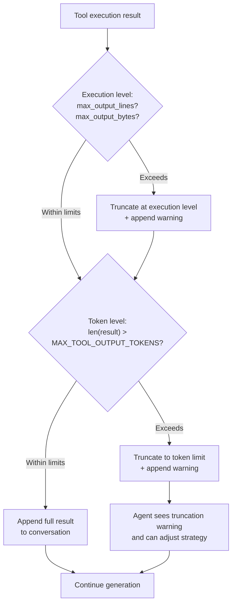

### The Pagination Protocol

When a tool result exceeds limits, the Actor is expected to adapt its strategy rather than accept a truncated result.

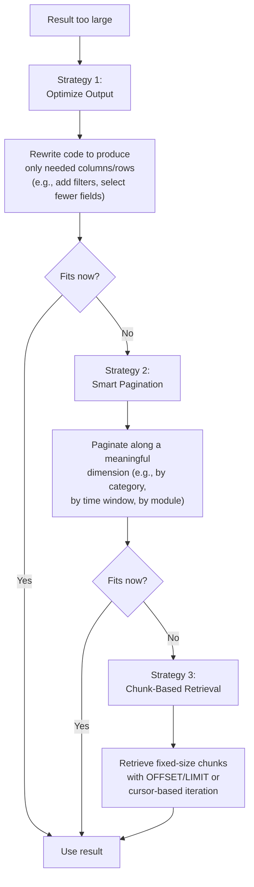

The protocol is encoded in the Actor's system prompt as a behavioral guideline. The Critic can detect violations — for example, when the Actor accepts a truncated result without attempting optimization — and flag them during validation.

---

## 8. Error Handling Patterns

### Tool Execution Error Flow

Every tool call passes through a unified dispatch function that handles deserialization failures, missing handlers, and execution errors uniformly.

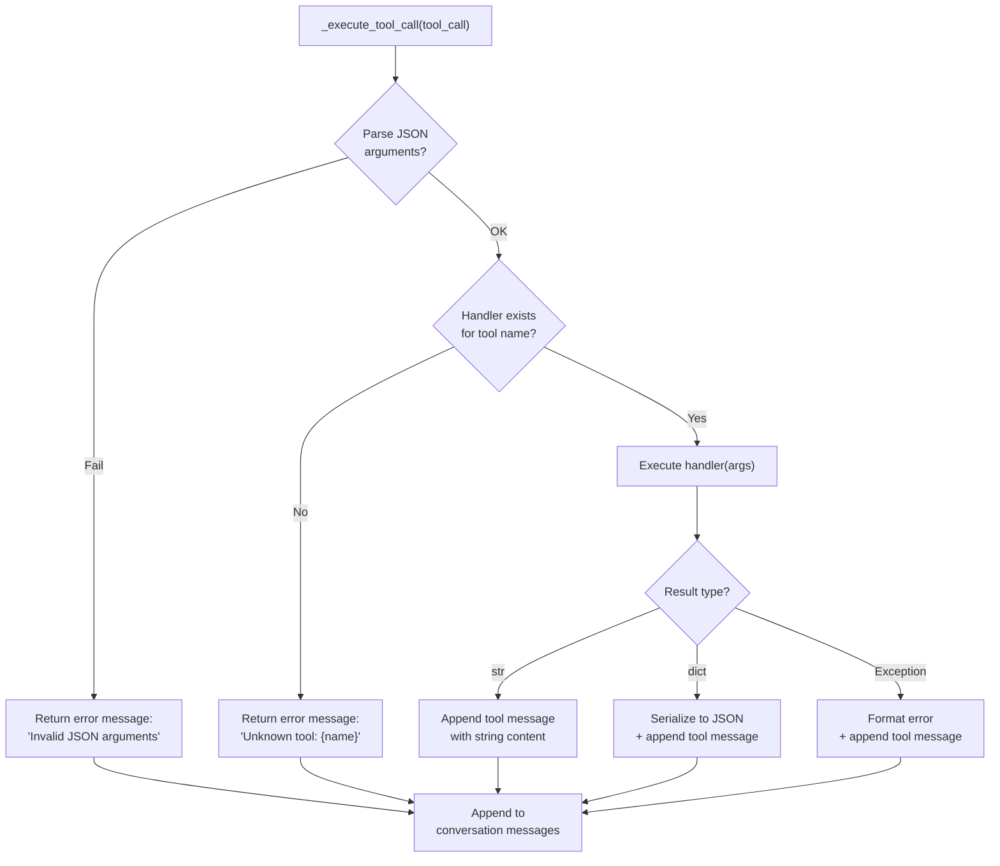

All paths converge on appending a `tool` role message. The Actor always sees a result — even if that result is an error description. This prevents the conversation from entering an inconsistent state where a `tool_call` has no corresponding `tool` response.

### Authentication Error Recovery

Two strategies address authentication failures, chosen based on the cost profile of the operation.

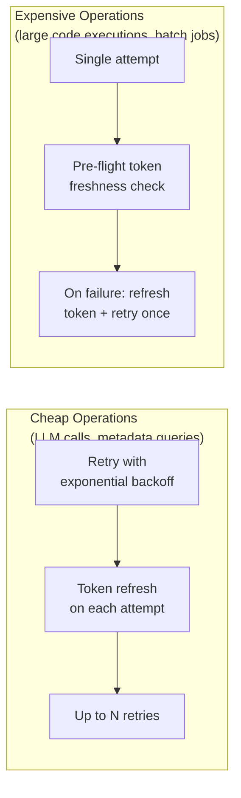

**Retry with backoff** — used for LLM completions and lightweight API calls where individual attempts are cheap but transient auth failures are common (e.g., token expiry during a long conversation):

```python
@retry(wait=wait_random_exponential(min=5, max=10), stop=stop_after_attempt(5))
def completion_with_retry(self, **kwargs):
    try:
        return self.client.chat.completions.create(**kwargs)
    except AuthenticationError:
        self.client.api_key = self.auth_manager.get_token(force_refresh=True)
        raise  # Trigger retry
```

**Single-attempt with pre-flight check** — used for expensive operations where blind retries waste significant resources:

```python
def execute_expensive_operation(self, payload):
    if self.auth_manager.is_token_expiring_soon(threshold_seconds=300):
        self.auth_manager.get_token(force_refresh=True)

    try:
        return self.executor.run(payload)
    except AuthenticationError:
        self.auth_manager.get_token(force_refresh=True)
        return self.executor.run(payload)  # Single retry
```

The choice between strategies is made at registration time — each handler knows its own cost profile and wraps itself accordingly. The dispatch layer does not impose a universal retry policy.

---

## Summary

| Concept | Key Mechanism |
|---------|---------------|
| **Tool Architecture** | Remote (sandboxed) vs. local (in-process) with shared auth/security/token infrastructure |
| **Registration** | Spec + handler pairs, extracted into parallel structures for LLM and dispatch |
| **Code Execution** | Multi-stage validation pipeline → isolated sandbox with timeout |
| **Static Analysis** | Three modes (expression, function, analysis) with AST-based safety |
| **Security** | Four independent defense layers; allowlist + blocklist + sandbox + constraints |
| **Custom Tools** | Domain preprocessors register additional spec + handler pairs at setup |
| **Result Size** | Execution-level and token-level caps; three-strategy pagination protocol |
| **Error Handling** | Unified dispatch with guaranteed tool-role response; auth strategy per cost profile |

> **Next**: [05 — Observability and Cost Tracking](./05_observability_and_cost_tracking.md) covers token accounting, logging, and production monitoring.
