# Guardrail Design and Causal Analysis

> **Series**: Actor-Critic Agent Design Pattern
> **Document**: 05 — Guardrail Design & Causal Analysis
> **Scope**: Guardrail interactions, the confounder problem, and Structural Causal Models (SCMs) for diagnosing and resolving multi-agent deadlocks

---

## 1. The General Confounder Problem

### What Is Confounding?

In causal inference, **confounding** occurs when a variable $U$ causally influences both the treatment $X$ and the outcome $Y$, creating a spurious statistical association between $X$ and $Y$ that does not reflect a direct causal effect.

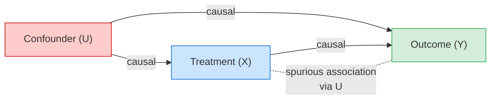

An observer who measures only $X$ and $Y$ cannot distinguish the direct causal effect $X \to Y$ from the backdoor path $X \leftarrow U \to Y$. The standard remedy is Pearl's **backdoor adjustment**, which conditions on the confounder to block the spurious path:

$$P(Y \mid do(X)) = \sum_{U} P(Y \mid X, U) \cdot P(U)$$

The $do(\cdot)$ operator denotes an *intervention* — physically setting $X$ to a value rather than passively observing it. Without adjustment, observational data conflates causal and confounded effects.

### Confounding in Adversarial Multi-Agent Systems

In an Actor-Critic architecture, the Critic observes the Actor's output and issues a pass/fail signal. This signal drives the Actor's next attempt. But when a **hidden variable** influences both the Actor's output quality and the Critic's ability to evaluate it, the feedback loop becomes confounded:

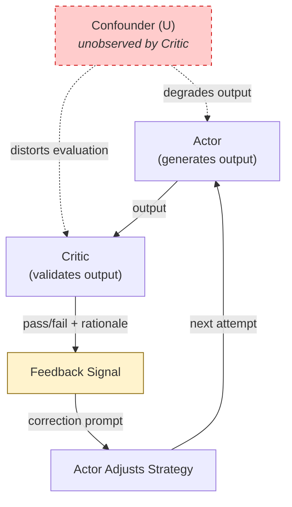

The Critic cannot distinguish whether a bad outcome was caused by the **Actor's strategy** (fixable via correction) or by an **environmental variable** (not fixable by the Actor). When the Critic attributes an environmentally caused failure to the Actor's strategy, the correction prompt sends the Actor searching for a solution in a space that contains none — the beginning of oscillation.

---

## 2. Flavors of Confounding in Actor-Critic Systems

### Flavor 1: Task-Difficulty Confounding

**Confounder:** intrinsic task complexity.

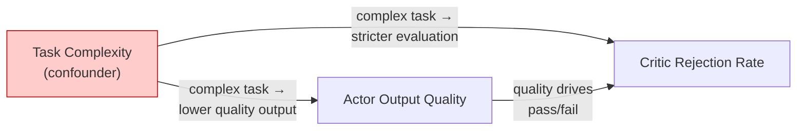

A complex task simultaneously causes lower-quality Actor output (the task is genuinely harder to solve) AND a higher Critic rejection rate (the Critic's rubric penalizes incompleteness or subtlety). The Critic cannot distinguish "the Actor chose a bad strategy" from "the task is inherently hard and no strategy would score well on the first pass."

**Example — Code Generation:** The Actor observes over many interactions that verbose code with extensive inline comments correlates with Critic approval. It shifts its strategy toward generating verbose, heavily commented code. The real explanation: simple tasks — where verbose commenting is easy and natural — are also the tasks the Critic passes on the first attempt. For complex tasks, the verbosity is a cargo-cult adaptation that doesn't address the actual difficulty.

### Flavor 2: Physical-Constraint Confounding

**Confounder:** system guardrails (output size limits, execution timeouts, memory limits).

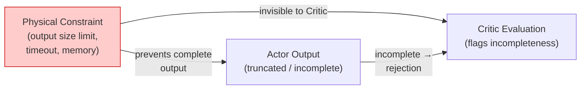

A physical constraint prevents the Actor from producing complete output AND causes the Critic to flag the output as incomplete. The Critic cannot distinguish a **lazy Actor** (chose not to be thorough) from a **physically constrained Actor** (tried to be thorough but was blocked).

**Example — Code Generation:** A user asks the Actor to generate a comprehensive integration test suite covering all 200 API endpoints in a microservices platform. The full suite would require ~50,000 tokens. The output guardrail caps responses at 5,000 tokens. The Actor generates the most critical 20 tests and offers to continue in batches. The Critic rejects: "Test suite is incomplete — covers only 10% of endpoints." The Actor tries pagination. The Critic rejects each page: "Partial output — does not answer the user's request for a complete suite." Context fills with failed attempts. Deadlock.

### Flavor 3: Temporal-State Confounding

**Confounder:** accumulated context window state.

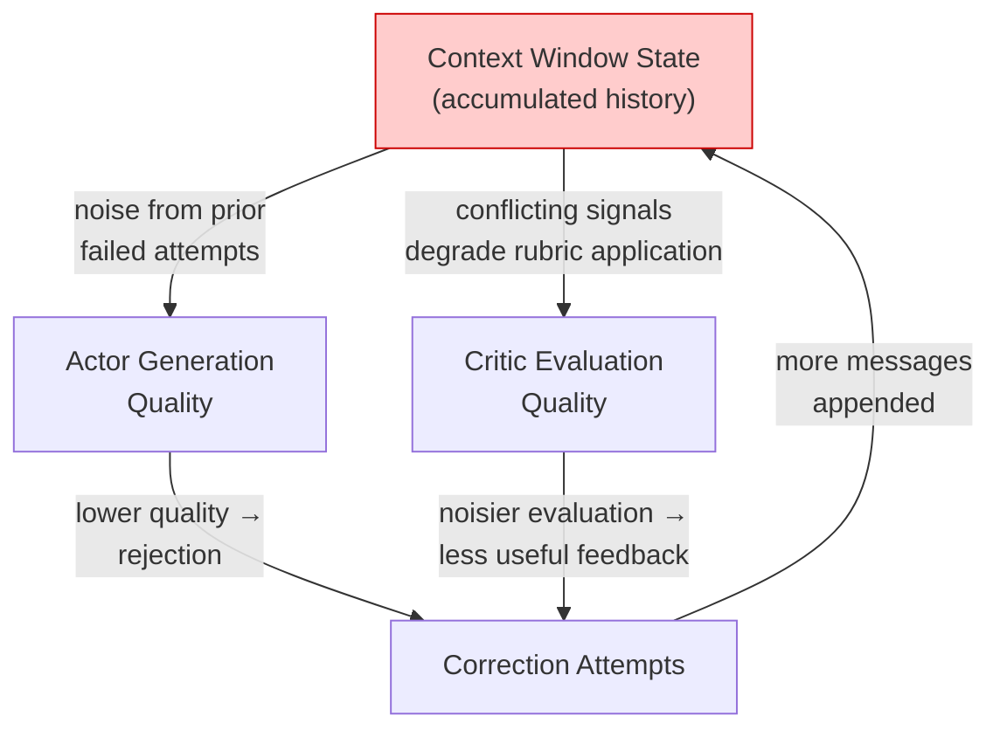

As the correction loop iterates, the context window fills with prior attempts, error messages, correction prompts, and Critic feedback. This accumulated state degrades **both** the Actor's generation quality (the model attends to contradictory prior instructions) and the Critic's evaluation quality (the Critic's context is polluted with failed attempts that bias its rubric application). Each correction attempt makes the next one worse — a positive feedback loop toward context exhaustion.

---

## 3. Guardrail Taxonomy

### The Guardrail Interaction Graph

Every Actor-Critic system operates under multiple simultaneous guardrails. These guardrails are not independent — they interact, and some interactions create infeasible constraint regions.

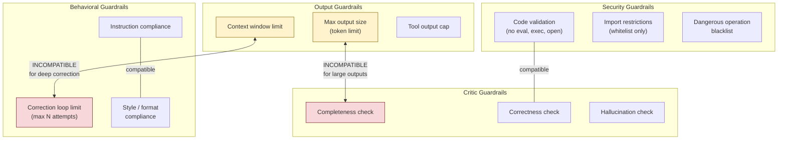

The **incompatibility edges** are the dangerous ones:
- **Output size ↔ Completeness check**: When the complete answer exceeds the output limit, no Actor strategy can simultaneously satisfy both.
- **Context window ↔ Correction loop**: Each correction attempt consumes context. A long correction loop can exhaust the window before convergence.

### Taxonomy of Guardrail Interactions

| Type | Definition | Example | Risk |
|---|---|---|---|
| **Compatible** | Both constraints satisfiable simultaneously for all task classes | Security validation + style check — secure code and well-formatted code are independent properties | None |
| **Hierarchical** | One guardrail takes precedence; the subordinate yields | Context window crash overrides the correction loop — the system halts rather than crashing | Low — predictable degradation |
| **Incompatible** | No feasible Actor strategy satisfies both for some task class | Output token limit + completeness check when the complete answer exceeds the limit | **HIGH** — deadlock |
| **Confounding** | One guardrail's effect is unobserved by the evaluating agent | Output size limit invisible to the Critic's completeness check — the Critic sees incompleteness but not its cause | **HIGH** — causal misattribution |

Incompatible and Confounding guardrails often co-occur: the constraint that creates the infeasibility is typically the same one hidden from the Critic.

---

## 4. Case Study: Guardrail Deadlock

### The Scenario

A user asks the Actor to generate integration tests for all 200 API endpoints in a platform's REST API. The full test suite — with setup, teardown, assertions, and edge cases for each endpoint — requires approximately 50,000 tokens. The system's output guardrail limits any single response to 5,000 tokens.

| Parameter | Value |
|---|---|
| User request | "Generate integration tests for all 200 API endpoints" |
| Required output size | ~50,000 tokens |
| Output guardrail | 5,000 tokens max |
| Critic rubric | "Response must answer the user's question completely" |
| Correction loop limit | 3 attempts |

### The Deadlock Sequence

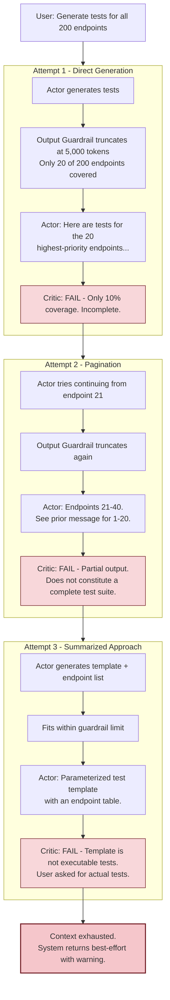

### The Causal Misattribution

| Observation | Critic's Interpretation | True Cause |
|---|---|---|
| Test suite covers only 20 of 200 endpoints | Actor strategy failure — Actor should have generated all tests (fixable) | Output guardrail prevents returning more than ~20 endpoints worth of tests (unfixable by Actor) |
| Paginated output across multiple messages | Actor formatting failure — should consolidate into single response | Single-response output limit makes consolidation physically impossible |
| Template-based alternative offered | Actor deviated from user's request | Actor correctly adapted to physical constraint; Critic's rubric doesn't account for this |

### Why the System Cannot Converge

Both agents reason correctly **within their respective observation spaces**. The Actor correctly determines that the full output is physically impossible and offers reasonable alternatives. The Critic correctly determines that none of the alternatives fully answer the user's question. The intersection of their individually correct judgments is **empty** — no strategy exists that the Actor can execute and the Critic will accept.

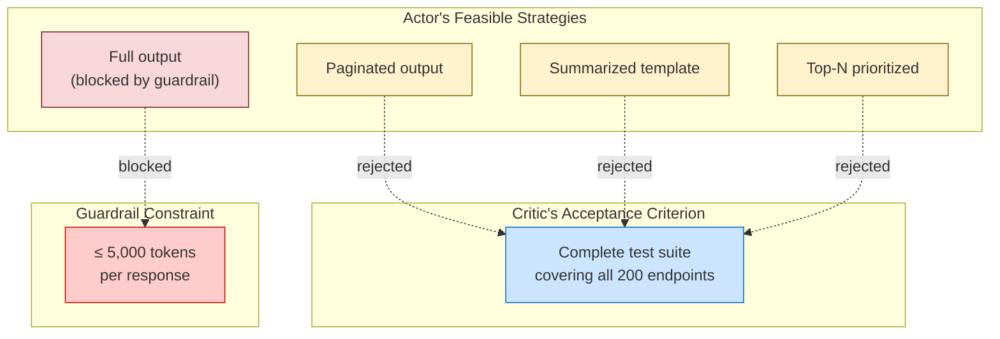

**Formal convergence requires three conditions.** The deadlock violates all of them:

| Condition | Requirement | Status |
|---|---|---|
| **Feasibility** | There exists at least one Actor strategy that the Critic will accept | **Violated** — No strategy fits within 5,000 tokens AND constitutes a complete 200-endpoint test suite |
| **Observability** | The Critic observes all variables that affect the Actor's output | **Violated** — The Critic does not observe the output guardrail's activation |
| **Monotonicity** | Each correction attempt moves the Actor closer to acceptance | **Violated** — Attempts cycle between truncation, pagination, and summarization without approaching the acceptance boundary |

---

## 5. Deconfounding: Making Hidden Constraints Observable

### The Fix as Informal Backdoor Adjustment

The Critic's evaluation without deconfounding:

$$P(\text{FAIL} \mid \text{incomplete output})$$

This conflates two very different situations — the Actor **chose** to produce incomplete output (strategy failure) and the Actor **was prevented** from producing complete output (physical constraint). The backdoor adjustment conditions on the constraint:

$$P(\text{FAIL} \mid \text{incomplete output},\ \text{physical constraint})$$

When we decompose by constraint status, the Critic's judgment changes:

| Physical Constraint | Output Completeness | Correct Critic Judgment |
|---|---|---|
| **Inactive** | Complete | PASS |
| **Inactive** | Incomplete | FAIL — Actor strategy failure |
| **Active** | Complete (within constraint) | PASS |
| **Active** | Incomplete (due to constraint) | **PASS with caveat** — Actor adapted correctly to physical limitation |

Without conditioning on the constraint, the Critic collapses rows 2 and 4 into the same judgment: FAIL. With the constraint observable, the Critic can distinguish row 4 (correct Actor behavior under constraint) from row 2 (genuine Actor failure).

### Formal Deconfounding via SCM

The deconfounded system makes the physical constraint **observable** to the Critic, blocking the backdoor path:

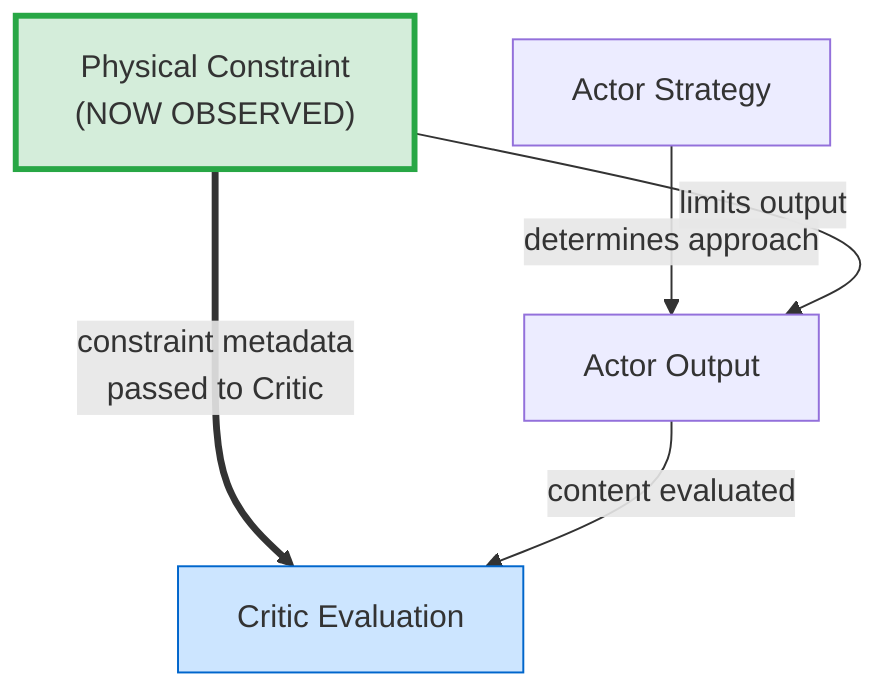

In the original (confounded) system, the path $\text{Physical Constraint} \to \text{Actor Output} \leftarrow \text{Actor Strategy} \to \text{Critic Evaluation}$ was confounded because the Critic could not condition on the Physical Constraint. In the deconfounded system, the Critic receives the constraint signal directly (the bold edge), blocking the backdoor and enabling correct causal attribution.

---

## 6. Building an SCM for Guardrail Interactions

### Step 1: Enumerate All Guardrails

Before constructing the causal model, catalog every constraint that could influence Actor output or Critic evaluation:

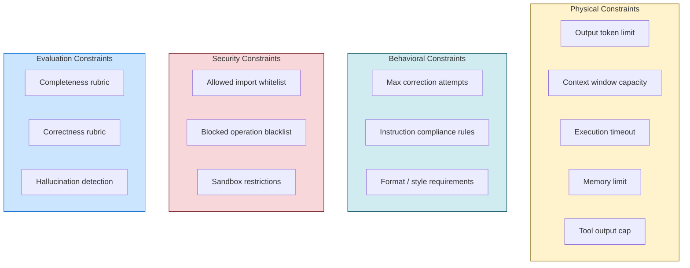

### Step 2: Construct the Causal DAG

Map the causal relationships between user request, guardrails, Actor strategy, and Critic evaluation. **Dashed edges** indicate relationships that are real but unobserved by the Critic:

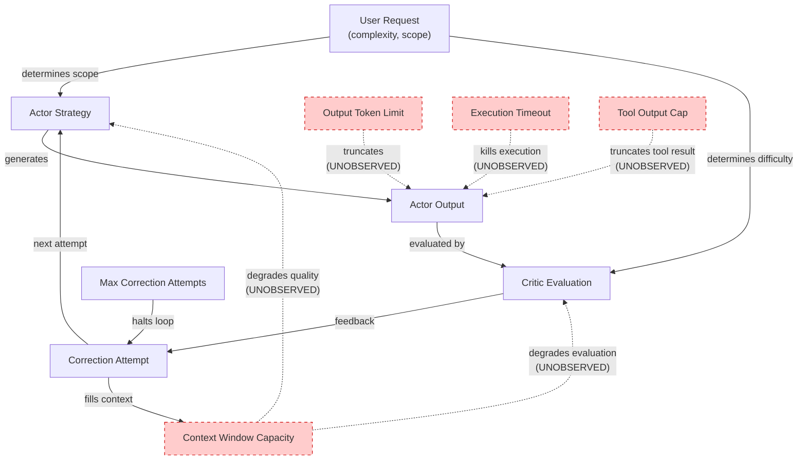

### Step 3: Identify Backdoor Paths

Three backdoor paths create confounded feedback signals:

**Path 1 — Output Truncation Confounding:**

$$\text{Actor Strategy} \leftarrow \text{User Request} \to \text{Output Token Limit activation} \to \text{Actor Output} \to \text{Critic Evaluation}$$

The Critic sees incomplete output but does not observe whether the Output Token Limit was the cause. Attribution: Actor strategy failure. True cause: physical truncation.

**Path 2 — Context Degradation Confounding:**

$$\text{Actor Strategy} \leftarrow \text{Context Window Capacity} \to \text{Critic Evaluation}$$

As context fills (from correction attempts), both the Actor's generation quality and the Critic's evaluation quality degrade. The Critic sees declining Actor output quality but does not observe that its own evaluation is simultaneously degrading.

**Path 3 — Tool Execution Confounding:**

$$\text{Actor Strategy} \leftarrow \text{User Request} \to \text{Execution Timeout / Tool Output Cap} \to \text{Actor Output} \to \text{Critic Evaluation}$$

A tool execution times out or its output is capped. The Actor receives an error and must adapt. The Critic sees the adapted (incomplete) output but does not observe the tool-level constraint that forced the adaptation.

### Step 4: Apply Backdoor Adjustment

For each backdoor path, identify the confounder to observe and the mechanism for making it observable:

| Backdoor Path | Confounder | Adjustment Mechanism |
|---|---|---|
| Output Truncation | Output Token Limit activation | Attach `constraint_type: SIZE_CONSTRAINED` and `max_tokens` / `actual_tokens` metadata to Critic input |
| Context Degradation | Context Window Capacity utilization | Attach `context_utilization: 0.87` and `correction_attempt: 2 of 3` metadata to Critic input |
| Tool Execution Constraint | Execution Timeout / Tool Output Cap | Attach `tool_constraint: TIMEOUT` or `tool_constraint: OUTPUT_TRUNCATED` with details to Critic input |

### The Problem: Constraint Signals Exist but Don't Reach the Critic

In many implementations, the execution layer already detects and signals these constraints — but the signals are returned as **plain text error messages to the Actor**, not as **structured metadata to the Critic**:

```python
def execute_code(code: str, timeout: int = 30) -> str:
    result = sandbox.run(code, timeout=timeout)

    if result.truncated:
        return "Result too large. Please reduce output size or summarize."

    if result.token_count > MAX_TOOL_OUTPUT_TOKENS:
        return f"Output exceeds {MAX_TOOL_OUTPUT_TOKENS} token limit. Modify your code."

    if result.timed_out:
        return f"Execution timed out after {timeout}s. Optimize or reduce scope."

    return result.output
```

These messages give the Actor enough information to adapt its strategy, but the Critic never sees them. The Critic receives the Actor's **adapted output** — which looks like incomplete work — without knowing that the adaptation was forced by a physical constraint. The causal signal is present in the system but routed to the wrong consumer.

---

## 7. Guardrail-Aware Validation Architecture

### The Deconfounding Layer

Insert a **constraint collection layer** between the Actor's output and the Critic's evaluation. This layer gathers active guardrail signals and attaches them as structured metadata.

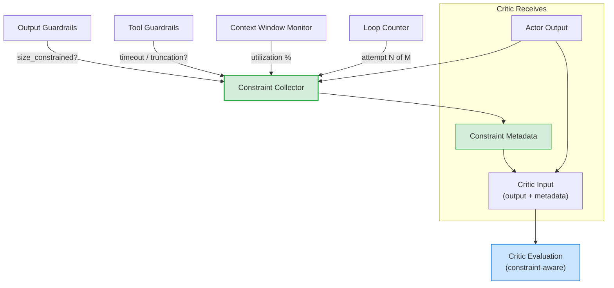

The constraint collector classifies the Actor's operating condition:

| Constraint Class | Trigger | Critic Behavior |
|---|---|---|
| `UNCONSTRAINED` | No guardrails active | Normal rubric — hold Actor to full standard |
| `SIZE_CONSTRAINED` | Output exceeds token limit | Accept partial output if Actor's prioritization and coverage strategy are sound |
| `TIMEOUT_CONSTRAINED` | Tool execution timed out | Evaluate Actor's fallback strategy rather than output completeness |
| `CONTEXT_EXHAUSTED` | Context utilization > 90% or on final correction attempt | Accept best-effort output; flag for user that full answer requires a fresh session |

### Constraint-Aware Validation Formula

The Critic's evaluation function becomes conditional on the constraint class:

$$
P(\text{FAIL} \mid \text{output}, \text{constraints}) = \begin{cases}
P(\text{FAIL} \mid \text{output}, \text{UNCONSTRAINED}) & \text{full rubric} \\\\
P(\text{FAIL} \mid \text{output}, \texttt{SIZE CONSTRAINED}) & \text{relaxed completeness, strict prioritization} \\\\
P(\text{FAIL} \mid \text{output}, \texttt{TIMEOUT CONSTRAINED}) & \text{evaluate fallback quality} \\\\
P(\text{FAIL} \mid \text{output}, \texttt{CONTEXT EXHAUSTED}) & \text{accept best-effort}
\end{cases}
$$

This is the backdoor adjustment in practice: the Critic conditions on the constraint variable, separating Actor strategy quality from environmental limitation.

---

## 8. From Oscillation to Convergence

### The Oscillation Mechanism

Without deconfounding, the correction loop follows a predictable path to context exhaustion:

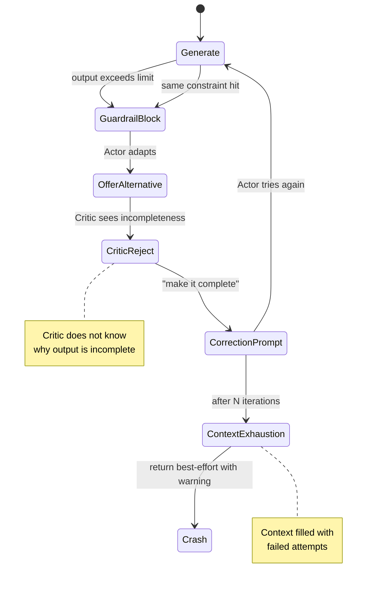

Each iteration adds ~1,000–3,000 tokens of correction prompt and failed output to the context window, accelerating the approach to exhaustion without moving closer to acceptance.

### Causal Conditions for Convergence

A correction loop converges if and only if all three conditions hold:

**Condition 1 — Feasibility:**

$$\exists\ s \in \mathcal{S}_{\text{Actor}} \text{ such that } \text{Critic}(s) = \text{PASS}$$

There must exist at least one strategy in the Actor's feasible set that the Critic will accept. When a guardrail makes the Critic's acceptance criterion physically unreachable, no amount of iteration helps.

*Deconfounding restores feasibility* by allowing the Critic to relax its acceptance criterion when it observes an active constraint — expanding the acceptance region to include constrained-but-well-adapted strategies.

**Condition 2 — Observability:**

$$\forall\ v \in \text{Vars}(\text{Actor Output}),\ v \in \text{Obs}(\text{Critic})$$

Every variable that causally affects the Actor's output must be observable by the Critic. Hidden guardrails violate this condition.

*Deconfounding restores observability* by routing constraint signals to the Critic as structured metadata.

**Condition 3 — Monotonicity:**

$$d(\text{Critic}(s_{t+1}),\ \text{PASS}) < d(\text{Critic}(s_t),\ \text{PASS})$$

Each correction attempt must move the Actor's output closer to the acceptance boundary. When the Actor oscillates between incompatible strategies (full output → truncated, summarized → rejected, full output → truncated again), the distance to acceptance does not decrease.

*Deconfounding restores monotonicity* because the Critic's feedback becomes actionable — it targets the Actor's actual strategy choices rather than the symptoms of hidden constraints, so each correction addresses a real deficiency.

---

## 9. Generalizing the Methodology

The guardrail analysis methodology applies to any Actor-Critic system, regardless of domain. The procedure is:

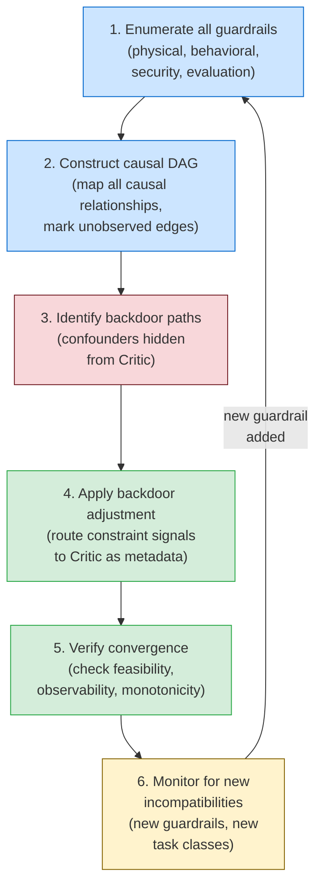

| Step | Action | Output |
|---|---|---|
| **Enumerate** | Catalog every constraint the Actor operates under | Complete guardrail inventory |
| **Construct DAG** | Map causal relationships; mark edges invisible to the Critic | Causal graph with observed/unobserved edge annotations |
| **Identify backdoor paths** | Trace every path from Actor Strategy to Critic Evaluation that passes through an unobserved variable | List of confounded feedback channels |
| **Apply adjustment** | For each backdoor path, route the confounder's signal to the Critic as structured metadata | Deconfounded Critic input schema |
| **Verify convergence** | Check that feasibility, observability, and monotonicity hold for all supported task classes | Convergence proof or identification of remaining infeasible regions |
| **Monitor** | When new guardrails are added or task classes change, re-enter the loop | Ongoing system health |

**Key insight:** Guardrails are not independent safety checks — they form a **causal system** whose interactions determine whether the Actor-Critic loop converges. Treating each guardrail in isolation misses the emergent incompatibilities that arise from their joint effect on the feedback loop. The SCM formalism provides a principled method for discovering, diagnosing, and resolving these interactions before they manifest as production deadlocks.

> **Real-world note:** A production platform implementing this Actor-Critic pattern for natural language analytics encountered exactly the deadlock described in Section 4 when users requested exhaustive item listings that exceeded output guardrails. Applying the deconfounding methodology (constraint metadata passed to the Critic) resolved the oscillation and enabled the system to gracefully degrade under physical constraints instead of entering correction loops that inevitably crashed.

---

## Summary

This document established a causal framework for understanding and resolving guardrail interactions in Actor-Critic systems:

- **Confounding** occurs when hidden variables (physical constraints, task complexity, context degradation) influence both Actor output and Critic evaluation, creating misattributed feedback signals.
- **Three flavors** — task-difficulty, physical-constraint, and temporal-state confounding — cover the major failure modes.
- **Guardrail interactions** follow a taxonomy: compatible, hierarchical, incompatible, and confounding — with incompatible and confounding interactions creating deadlock risk.
- **Deadlocks** arise when the intersection of the Actor's feasible strategies and the Critic's acceptance criteria is empty due to hidden constraints.
- **Deconfounding** via backdoor adjustment — making constraint signals observable to the Critic — restores feasibility, observability, and monotonicity.
- **The SCM methodology** (enumerate → DAG → backdoor paths → adjust → verify → monitor) provides a repeatable procedure for any Actor-Critic deployment.

---

<div align="center">

**Actor-Critic Agent Design Pattern — Document Series**

| Document | Title |
|----------|-------|
| [01](./01_actor_critic_architecture.md) | Actor-Critic Architecture |
| [02](./02_actor_critic_workflow.md) | Agentic Workflow Deep-Dive |
| [03](./03_critic_validation_system.md) | Critic Validation System |
| [04](./04_tool_calling_system.md) | Tool Calling System |
| **05** | **Guardrail Design & Causal Analysis** *(this document)* |
| [06](./06_adversarial_dynamics_and_convergence.md) | Adversarial Dynamics & Convergence |
| [07](./07_limitations_and_enhancements.md) | Limitations & Enhancements |
| [08](./08_causal_nash_equilibrium_convergence.md) | Causal Nash Equilibrium Convergence |

</div>
