# Adversarial Dynamics and Convergence

> **Series**: Actor-Critic Agent Design Pattern
> **Document**: 06 — Adversarial Dynamics and Convergence
> **Scope**: The adversarial nature of the dual-agent relationship, co-evolution theory, and causal inference integration for convergence toward equilibrium

---

## 1. Overview: The Dual-Agent Setup

The Actor-Critic architecture creates an inherently adversarial relationship by assigning two agents *opposing optimization targets* over the same artifact. The Actor's mandate is to maximize the helpfulness of its output — comprehensive, insightful, directly addressing the user's intent. The Critic's mandate is to maximize the correctness of what reaches the user — accurate, grounded, compliant with domain constraints.

These mandates conflict at the margin. A maximally helpful response may speculate beyond what the evidence supports. A maximally correct response may omit useful information because it cannot be fully verified. The architecture channels this tension through three resolution paths.

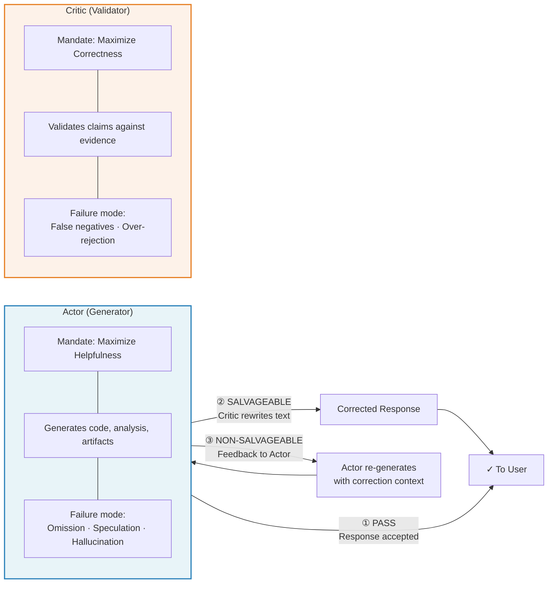

**Running example**: A code-generation assistant where the Actor writes Python functions from natural language descriptions and the Critic validates correctness, security, and style before the code reaches the user.

| Path | Trigger | Who Acts | Example |
|------|---------|----------|---------|
| **Pass** | Response meets all rubric criteria | Neither — response forwarded | Actor generates a correct `binary_search` with tests; Critic finds no issues |
| **Salvageable** | Minor errors fixable without new tool calls | Critic rewrites | Off-by-one in a loop bound; Critic patches the index |
| **Non-salvageable** | Fundamental errors requiring new computation | Actor re-generates | Actor used wrong algorithm entirely; Critic sends structured feedback |

---

## 2. Why the Setup Is Adversarial

### 2.1 Opposing Objectives by Design

The Actor and Critic are not simply two stages of a pipeline — they are agents with structurally opposed optimization pressures:

| Dimension | Actor Optimizes For | Critic Optimizes For |
|-----------|-------------------|---------------------|
| **Coverage** | Comprehensive — answer the full question | Minimal — only what can be verified |
| **Risk tolerance** | Accept reasonable inferences | Reject anything not grounded in evidence |
| **Tool usage** | Use tools liberally to build rich output | Flag unnecessary or incorrect tool calls |
| **Output length** | Enough detail to be useful | Short enough to audit completely |

This tension is *productive*. Without the Actor's drive toward completeness, responses would be uselessly terse. Without the Critic's drive toward correctness, responses would be confidently wrong. The architecture depends on neither agent "winning" — quality emerges from the sustained conflict.

### 2.2 Cross-Model Diversity as Adversarial Pressure

When the Actor and Critic use different model families (e.g., GPT-series Actor, Claude-series Critic), their disagreements become a feature rather than a bug:

- **Different training corpora** mean different factual blind spots. A hallucination that one model produces confidently may be flagged as unsupported by the other.
- **Different RLHF tuning** means different calibration of confidence. One model's "I'm 90% sure" may be another's "this needs verification."
- **Different reasoning heuristics** mean different failure modes. Chain-of-thought shortcuts that one model takes may look obviously wrong to another.

This is the **ensemble diversity principle** applied to adversarial validation: the error correlation between diverse models is lower than between instances of the same model. A homogeneous Actor-Critic pair (same model, same weights) would share systematic biases, reducing the Critic to a consistency check rather than an independent evaluation.

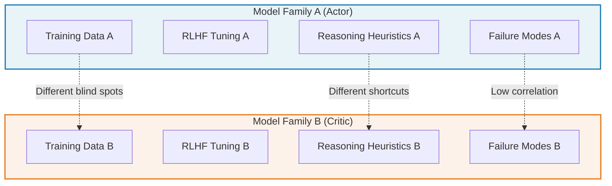

### 2.3 Veto Power and Asymmetric Authority

The adversarial relationship is *one-directional*. The Critic holds veto power; the Actor does not:

| Action | Actor | Critic |
|--------|-------|--------|
| Generate response | ✓ | ✗ |
| Pass response to user | ✗ | ✓ |
| Overwrite response text (salvageable) | ✗ | ✓ |
| Reject response entirely (non-salvageable) | ✗ | ✓ |
| Challenge a decision | ✗ | ✗ (no mechanism) |

The Actor cannot dispute a rejection. It receives structured feedback and must comply. This asymmetry is deliberate — it ensures that correctness is a hard constraint while helpfulness is a soft optimization target. But it also means the system cannot self-correct when the Critic is wrong (false negatives, over-rejection).

### 2.4 Information Asymmetry

The information flow between Actor and Critic is asymmetric in a way that limits learning:

- **On PASS**: The Actor receives no signal. It does not know *why* it passed, which aspects the Critic checked, or how close it was to rejection.
- **On SALVAGEABLE**: The Actor never sees the correction. The Critic's rewrite replaces the Actor's text silently.
- **On NON-SALVAGEABLE**: The Actor receives the Critic's feedback — the *only* case where information flows from Critic to Actor.
- **After correction**: Internal messages (the feedback exchange) are stripped from the conversation history before the next user turn.

This means the Actor operates in an information-impoverished environment. It generates into a void where only failures produce signal, and even those signals are ephemeral.

---

## 3. The Recursive Self-Correction Flow: Intra-Episode Adversarial Refinement

### 3.1 What the Recursive Flow Achieves

When the Critic issues a NON-SALVAGEABLE verdict, the system enters a recursive self-correction loop. This is not a simple retry — the Actor receives structured feedback and can take an entirely different approach.

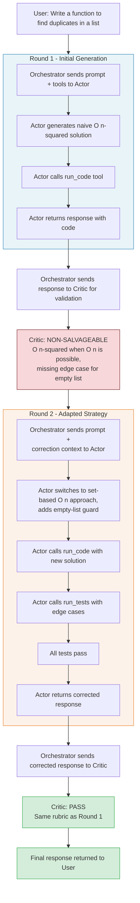

Key observations:

- **Round 2 is not constrained to patching Round 1.** The Actor can make entirely new tool calls, choose a different algorithm, restructure the response. The correction context is additive guidance, not a patch instruction.
- **The Critic applies the same rubric in both rounds.** It does not lower the bar because the Actor already failed once. It does not raise it either.
- **The system caps at a configurable maximum number of attempts** (typically 3) to prevent infinite loops.

### 3.2 Three Asymmetries That Limit the Dynamic

The recursive flow creates real intra-episode adversarial dynamics, but three structural asymmetries prevent it from achieving full co-evolution:

#### Asymmetry 1: The Validator Does Not Adapt

The Critic applies the identical rubric in Round 1 and Round 2. It has no mechanism to:
- Sharpen checks based on the specific error it found
- Relax checks that the Actor consistently passes
- Learn from its own false positives or false negatives

The rubric is static within an episode and across episodes.

#### Asymmetry 2: Adaptation Is Ephemeral

After correction completes, internal messages are stripped from the conversation history:

```python
messages = [m for m in corrected_messages if not m.get('_internal')]
```

The Actor's adaptation — the insight that "set-based approaches are preferred" or "always handle empty inputs" — does not persist. The next user query starts from the same baseline. There is no cross-episode memory of what was learned during correction.

#### Asymmetry 3: Feedback Is Unidirectional

The Actor cannot challenge the Critic's findings. If the Critic incorrectly rejects a valid approach (false negative), the Actor's only option is to comply and produce a different response. There is no appeal mechanism, no burden of proof on the Critic, and no record that a disagreement occurred.

### 3.3 The Courtroom Analogy

Each user query is a **trial**:

| Legal System | Actor-Critic System |
|-------------|-------------------|
| Attorney presents argument | Actor generates response with evidence (tool results) |
| Judge evaluates against law | Critic evaluates against rubric |
| Attorney can present rebuttal | Actor can re-generate with correction context |
| Judge applies same legal standard | Critic applies same rubric |
| Trial record is sealed | Internal messages are stripped |
| No precedent carries forward | No cross-episode memory |

Within a single trial, there is genuine adversarial dynamics — the Actor adapts its strategy based on the Critic's feedback, and the Critic independently re-evaluates. But there is no **case law**. Each trial starts from zero. The system cannot build on past corrections, and neither agent develops a track record that influences future interactions.

### 3.4 Placing on the Adversarial Spectrum

```
Static           Intra-Episode        Inter-Episode        True
Validation   →   Adaptation       →   Co-Evolution     →   Adversarial
(one pass)       (Actor-Critic)       (missing)            (symmetric)
```

| Property | Static Validation | Intra-Episode Adaptation | Inter-Episode Co-Evolution | True Adversarial |
|----------|------------------|-------------------------|--------------------------|-----------------|
| Generator changes behavior across rounds? | No | **Yes** (within episode) | Yes (across episodes) | Yes (continuously) |
| Validator changes criteria? | No | No | **Yes** (criteria evolve) | Yes (continuously) |
| Feedback persists across episodes? | No | No | **Yes** (memory) | Yes (persistent state) |
| Multiple rounds per episode? | No | **Yes** (up to max) | Yes | Yes |
| Bidirectional feedback? | No | No | Partially | **Yes** (symmetric) |

The current Actor-Critic pattern sits at the **Intra-Episode Adaptation** level — a significant step beyond static validation, but short of the inter-episode learning that would constitute true co-evolution.

---

## 4. Remaining Gaps Toward Full Co-Evolution

### 4.1 Shared Goal (Cooperative Framing)

Despite the adversarial tension, both agents serve the same user. The Actor wants to produce a helpful response; the Critic wants to ensure it is correct. Neither agent benefits from the other's failure — a Critic that rejects everything is as dysfunctional as an Actor that hallucinates everything.

This makes the relationship closer to **peer review** than a **zero-sum game**:

| Zero-Sum Game | Peer Review (Actual) |
|--------------|---------------------|
| One agent's gain is the other's loss | Both agents serve a shared objective |
| Optimal strategy is to defeat the opponent | Optimal strategy is to improve the artifact |
| Adversarial tension is the end goal | Adversarial tension is a means to a cooperative end |
| No shared utility function | Shared utility: user satisfaction with correct, helpful output |

The productive framing: adversarial dynamics are a **mechanism** for achieving a cooperative outcome. The tension between helpfulness and correctness is not a bug — it is the control system that keeps the output in the useful-and-accurate region of the space.

### 4.2 Asymmetric Power Structure

The Critic is a **gatekeeper**, not an opponent. It does not compete with the Actor for resources, attention, or credit. It holds a structural position of authority:

- It sees the Actor's full output (including tool calls and intermediate reasoning)
- The Actor never sees the Critic's internal deliberation
- The Critic's verdict is final within the episode (subject only to the max-attempts cap)

This asymmetry prevents several failure modes (Actor gaming the Critic, Critic-Actor collusion) but also prevents the system from self-correcting when the Critic's rubric is miscalibrated. The Critic is trusted by construction, not by demonstrated track record.

---

## 5. Classification: Adversarial Validation Pattern

The Actor-Critic pattern maps onto several established concepts from security, science, and machine learning:

| Established Concept | Mapping to Actor-Critic | Key Similarity | Key Difference |
|--------------------|-----------------------|---------------|---------------|
| **Red Team / Blue Team** | Actor = Red (generative, probing), Critic = Blue (defensive, evaluative) | Adversarial roles with different mandates | Red team is intentionally adversarial; Actor is cooperative |
| **Peer Review** | Actor = author, Critic = reviewer | Independent evaluation of produced work | Peer review is bidirectional; Actor cannot respond to reviews |
| **Checker Pattern** | Critic = checker verifying Actor's work | Separate verification step | Checker pattern is typically single-pass, no recursion |
| **GAN Discriminator** | Critic = discriminator, Actor = generator | One produces, the other evaluates | GANs train via gradient; Actor-Critic uses natural language feedback |
| **Adversarial Examples** | Critic's false negatives are "adversarial inputs" to the Actor | Force the system to handle hard cases | Adversarial examples are crafted; Critic errors are unintentional |

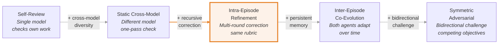

The current Actor-Critic pattern occupies the **Intra-Episode Refinement** position — leveraging cross-model diversity and recursive correction but lacking persistent adaptation and bidirectional challenge.

---

## 6. Achieving Co-Evolution: Iterative State Updates

### 6.1 The Core Mechanism: Persistent Adversarial Memory

The gap between intra-episode refinement and inter-episode co-evolution is bridged by **persistent adversarial memory**: a feedback loop where both agents' behavior evolves based on aggregate historical outcomes.

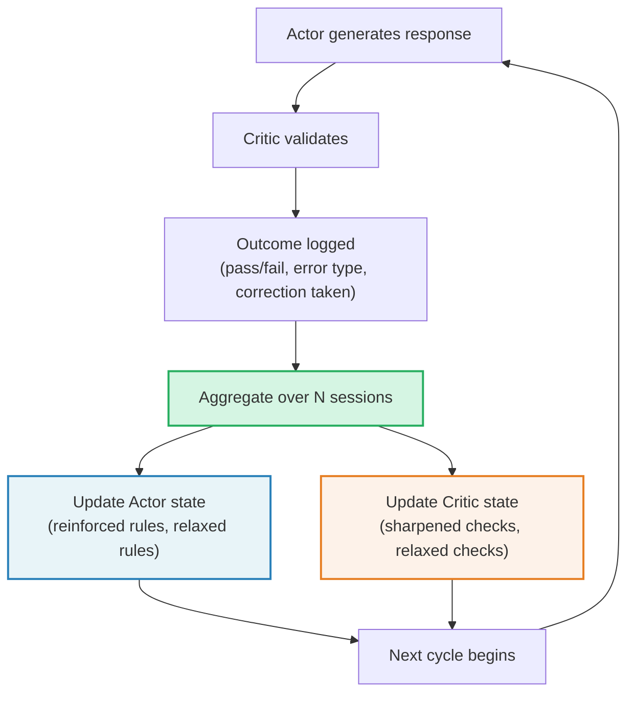

The key insight: adaptation should not happen within individual episodes (too noisy, too few data points) but **across batches of episodes** where patterns become statistically reliable.

### 6.2 Implementation Approaches

#### Approach 1: Prompt Augmentation via Error Patterns

The simplest path to co-evolution — periodic batch analysis of validation outcomes distilled into prompt addenda for both agents.

**Mechanism:**
1. Collect validation outcomes over a window (e.g., 500 sessions).
2. Cluster failure modes by error type, frequency, and resolution.
3. For the Actor: generate reinforcement rules ("In the last period, 32% of failures were off-by-one errors in loop bounds. Always validate loop termination conditions against boundary inputs.").
4. For the Critic: adjust check sensitivity ("Style-related rejections had a 45% user-override rate. Reduce weight on naming convention checks.").
5. Append these as addenda to each agent's system prompt.

**Trade-offs:**
- Low implementation cost — only prompt changes, no architecture changes.
- Coarse granularity — the same addenda apply to all queries regardless of context.
- Batch latency — adaptations lag behind emerging patterns by the window size.

#### Approach 2: Retrieval-Augmented Adversarial Memory

Instead of static prompt addenda, retrieve *relevant* past validation outcomes at query time. This enables context-sensitive adaptation.

**Mechanism:**
1. Index all validation outcomes with metadata: error type, domain, complexity, resolution strategy.
2. At generation time, retrieve the K most relevant past outcomes for the current query (by semantic similarity, domain match, or error-type overlap).
3. Inject retrieved outcomes into the Actor's context: "For similar code-generation tasks, common failure modes include: [retrieved examples]."
4. Inject into the Critic's context: "For similar validations, past false positives included: [retrieved examples]."

**Trade-offs:**
- Context-sensitive — different queries trigger different adaptations.
- Higher implementation cost — requires embedding, indexing, retrieval infrastructure.
- Risk of retrieval noise — irrelevant past outcomes may confuse rather than help.

#### Approach 3: Explicit Parameterized State

The most structured approach — maintain a shared `adversarial_state.json` that both agents' prompts reference directly, updated by an offline pipeline.

```json
{
    "actor_state": {
        "reinforced_rules": [
            {
                "pattern": "null_check_missing",
                "instruction": "Always add null checks for optional parameters",
                "frequency": 12
            },
            {
                "pattern": "off_by_one",
                "instruction": "Validate loop bounds against empty and single-element inputs",
                "frequency": 8
            }
        ],
        "relaxed_rules": [
            {
                "pattern": "type_annotation",
                "note": "User prefers dynamic typing — do not add type hints unless requested",
                "frequency": 15
            }
        ]
    },
    "critic_state": {
        "sharpened_checks": [
            {
                "check": "logic_correctness",
                "focus": "Off-by-one errors in loop termination conditions",
                "miss_rate": 0.32
            },
            {
                "check": "edge_case_coverage",
                "focus": "Empty input, single element, negative values",
                "miss_rate": 0.28
            }
        ],
        "relaxed_checks": [
            {
                "check": "style_compliance",
                "note": "Naming conventions are subjective — reduce rejection weight",
                "false_positive_rate": 0.45
            }
        ]
    }
}
```

**Trade-offs:**
- Fully transparent — state is human-readable and auditable.
- Structured updates via pipeline — no ad-hoc prompt engineering.
- Risk of state staleness if the update pipeline falls behind.
- Requires careful schema design to avoid combinatorial explosion of patterns.

---

## 7. Toward a Truly Adversarial Workflow

### 7.1 Architecture: Adversarial Co-Evolutionary Agents

Moving beyond the current pattern requires granting the Actor symmetric agency — the ability to challenge the Critic's decisions, not just comply with them.

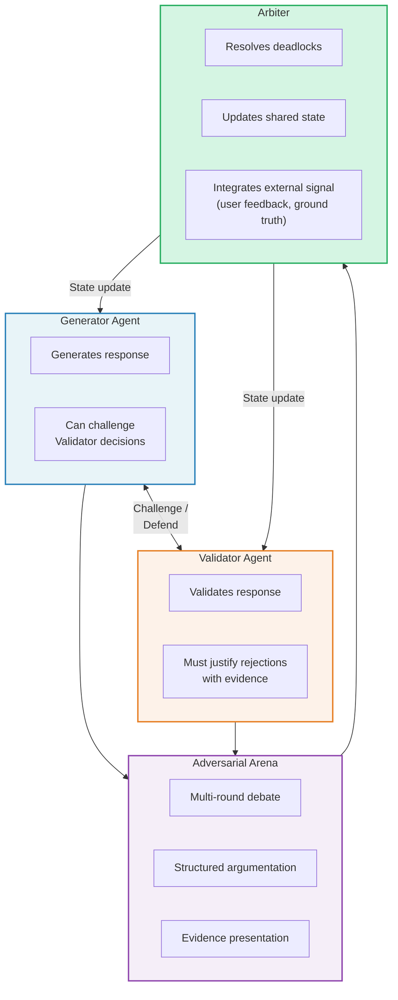

**Requirements for true adversarial architecture:**

| Requirement | Description |
|------------|-------------|
| **Symmetric agency** | Both agents can initiate challenges, present evidence, and revise positions |
| **Opposing loss functions** | Actor penalized for rejections it could have avoided; Critic penalized for false positives and false negatives |
| **Iterative competition** | Multiple rounds of challenge-response within and across episodes |
| **Emergent quality** | Output quality improves as a consequence of competition, not as a directly optimized objective |

### 7.2 Key Mechanisms

#### Mechanism 1: Bidirectional Challenge Protocol

The Actor can challenge a Critic finding by presenting counter-evidence:

1. Critic rejects: "Function does not handle negative inputs."
2. Actor challenges: "The function uses `abs()` on line 3, which handles negative inputs. See test case output."
3. Critic must defend: "The `abs()` call handles magnitude but inverts the sign contract — callers expect signed output."
4. Or Critic revises: "Acknowledged — `abs()` handles the negative case. Withdrawing this finding."

This requires both agents to maintain and reference *evidence* (tool outputs, test results, specification text) rather than making unsupported assertions.

#### Mechanism 2: Adversarial Training Rounds

Periodic calibration runs using queries with known-correct answers. These reveal each agent's error profile without risking user-facing quality.

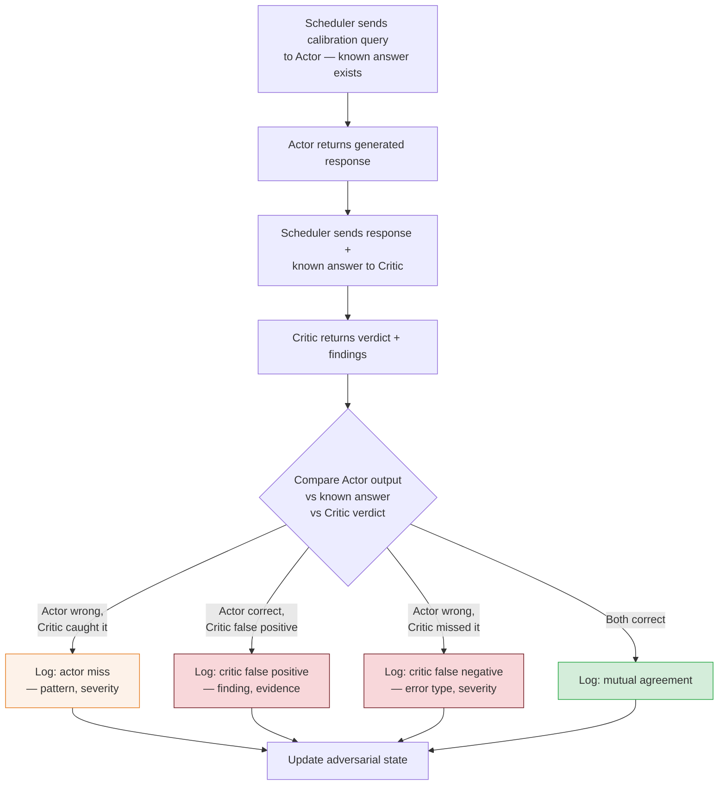

**Four calibration outcomes:**

| Outcome | Actor | Critic | State Update |
|---------|-------|--------|-------------|
| **Actor miss** | Wrong | Correctly rejected | Reinforce Actor rule for this error pattern |
| **Critic false positive** | Correct | Incorrectly rejected | Relax Critic check for this pattern |
| **Critic false negative** | Wrong | Incorrectly passed | Sharpen Critic check for this error type |
| **Mutual agreement** | Correct | Correctly passed | Confirm both agents calibrated for this case |

#### Mechanism 3: Competitive Scoring

Maintain running scores for both agents that create mutual pressure:

- **Actor pass rate**: fraction of responses that pass Critic validation on the first attempt. Higher is better for the Actor.
- **Critic precision**: fraction of rejections that are valid (not false positives). Higher is better for the Critic.
- **Critic recall**: fraction of actual errors that the Critic catches. Higher is better for the Critic.

Each agent's improvement pressures the other:
- If the Actor improves (higher pass rate), the Critic's recall on *remaining* errors must increase to stay useful.
- If the Critic improves (higher precision), the Actor must address *genuine* issues rather than gaming superficial checks.

### 7.3 The Equilibrium Problem

A truly adversarial system must contend with three convergence risks:

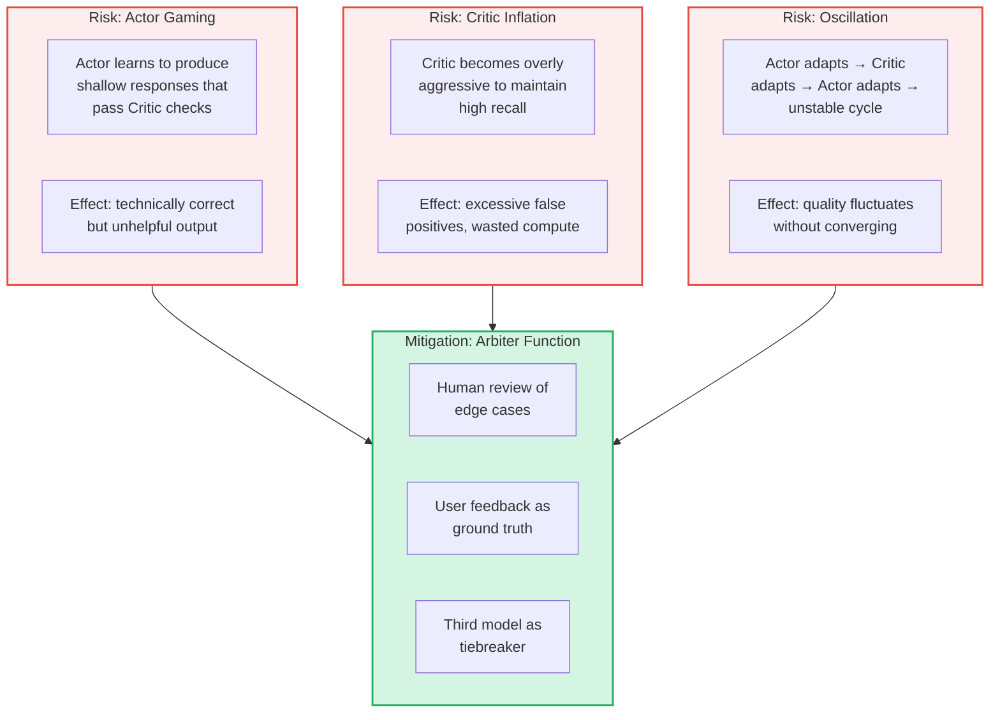

The **Arbiter function** provides the external ground truth that prevents the adversarial dynamic from degenerating. Without it, the system is a closed loop where both agents optimize against each other's outputs rather than against an external standard of quality.

### 7.4 When True Adversarial Design Is Warranted

Not every system needs full adversarial co-evolution. The added complexity is justified only when specific conditions hold:

| Condition | Why It Justifies Adversarial Design | Example |
|-----------|-----------------------------------|---------|
| **High-stakes decisions** | Cost of error exceeds cost of adversarial overhead | Medical code generation, financial calculations |
| **Adversarial users** | Users may intentionally probe for weaknesses | Public-facing code assistants, security-sensitive tools |
| **Rapid domain evolution** | Static rubrics become stale quickly | Emerging frameworks, evolving API surfaces |
| **Scale** | Manual review is infeasible | Thousands of generations per day |
| **Ground truth availability** | Calibration data exists for adversarial training | Domains with test suites, benchmarks, or formal specifications |

---

## 8. Improving with Causal Inference

### 8.1 The Confounding Problem

The correction signal flowing from Critic to Actor is **confounded**. When the Actor receives feedback that its code was rejected, it cannot distinguish between three causal explanations:

1. **Genuine strategy flaw**: the Actor's approach was wrong, and a different strategy would have succeeded.
2. **Task difficulty**: the task was inherently hard, and most strategies would have failed.
3. **Critic false positive**: the Actor's code was actually correct, but the Critic's rubric was miscalibrated.

Without disentangling these causes, the Actor's adaptation is blind — it may change strategies that were working, leave broken strategies intact, or optimize for the Critic's biases rather than actual code quality.

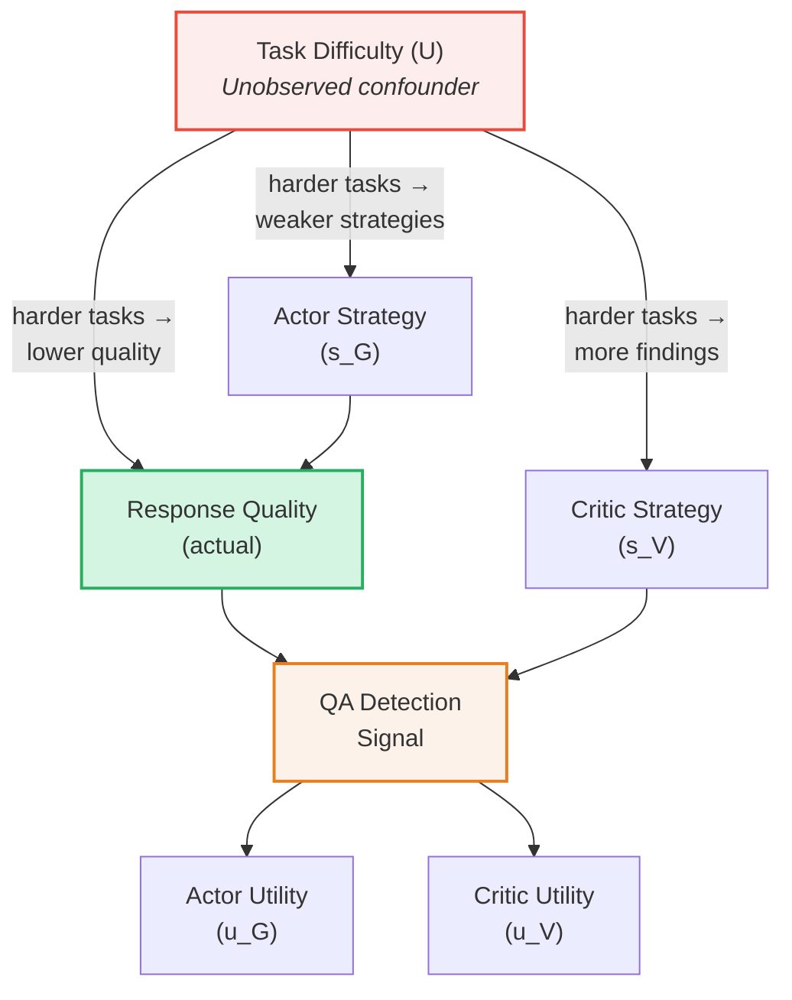

Task Difficulty (U) is a **confounder** that creates spurious associations between Actor strategy and Critic outcomes. When we observe that "verbose Actor responses are rejected more often," the causal story might be:

- **Causal**: verbosity introduces more surface area for errors → Critic finds real issues.
- **Confounded**: harder tasks elicit longer responses *and* have more genuine errors → Critic catches difficulty-driven errors, not verbosity-driven errors.

Without causal adjustment, updating the Actor's strategy based on raw rejection rates conflates these effects.

### 8.2 Two Levels of Integration

Causal inference integrates into the adversarial framework at two distinct levels:

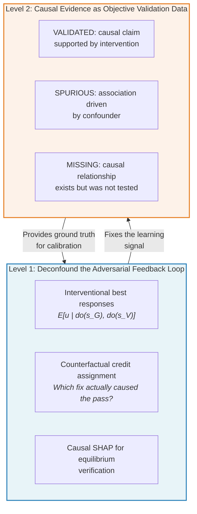

**Level 1** fixes the adversarial feedback loop itself — ensuring that when the Actor adapts, it adapts to the *right* signal. **Level 2** uses causal evidence as objective validation data, giving the Critic a principled basis for classification beyond pattern matching.

### 8.3 Interventional Best Responses

In the adversarial framing, each agent plays a strategy: the Actor chooses a generation strategy $s_G$ (algorithm choice, code structure, documentation level) and the Critic chooses a validation strategy $s_V$ (which checks to emphasize, what threshold to apply). The observed outcome — utility $u$ — depends on both strategies *and* the confounding task difficulty.

The **observational** best response is:

$$E[u \mid s_G, s_V]$$

This is confounded. What we need is the **interventional** best response:

$$E[u \mid do(s_G), do(s_V)]$$

Using Pearl's backdoor adjustment (conditioning on the confounder set $\mathbf{Z}$ that blocks all backdoor paths):

$$E[u \mid do(s_G), do(s_V)] = \sum_{\mathbf{z}} E[u \mid s_G, s_V, \mathbf{z}] \cdot P(\mathbf{z})$$

In practice, $\mathbf{Z}$ includes measurable proxies for task difficulty: query complexity (AST depth of the target code), domain novelty (embedding distance from training distribution), and constraint density (number of explicit requirements in the prompt).

**Applied to the correction flow**: when the Actor receives feedback, the correction prompt can be augmented with causal attribution:

```
Issue: logic_error (off-by-one in loop bounds)
Causal attribution: 0.82 from Actor strategy, 0.18 from task complexity.
Focus correction on: loop termination condition.
```

This tells the Actor: "This error is 82% your fault and 18% due to task difficulty. Focus your correction on the loop logic, not on simplifying the overall approach."

### 8.4 Counterfactual Credit Assignment

When the Actor changes multiple aspects of its response during correction, which change actually caused the Critic to pass the revised version? Without counterfactual analysis, the Actor may learn the wrong lesson.

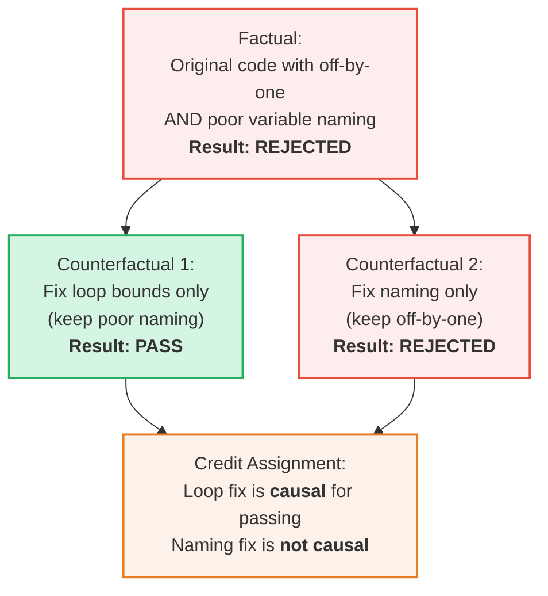

**Counterfactual credit assignment** isolates the causal contribution of each change:

1. **Factual world**: the Actor's original code (with multiple issues) was rejected.
2. **Counterfactual 1**: "What if only the loop bounds were fixed?" → passes. This change is causal.
3. **Counterfactual 2**: "What if only the naming was fixed?" → still rejected. This change is not causal.

The Actor should reinforce the lesson "validate loop bounds" rather than "use better variable names." Without counterfactual analysis, both changes would receive equal credit, diluting the learning signal.

In practice, counterfactual evaluation can be approximated by running the Critic on synthetically modified versions of the response, varying one dimension at a time while holding others fixed.

### 8.5 Causal SHAP for Equilibrium Verification

Causal SHAP (SHapley Additive exPlanations with causal constraints) decomposes the contribution of each strategy dimension to the overall outcome, respecting the causal graph rather than treating all features as exchangeable.

For the Actor-Critic system, Causal SHAP can quantify how much each strategy dimension contributes to the pass rate:

| Strategy Dimension | Causal SHAP Contribution to Pass Rate | Interpretation |
|-------------------|--------------------------------------|---------------|
| Algorithm choice | +0.31 | Strongest driver — choosing the right algorithm matters most |
| Edge case handling | +0.24 | Second strongest — boundary conditions are critical |
| Code structure | +0.08 | Moderate — affects readability checks |
| Documentation level | +0.03 | Weak — Critic rarely rejects on documentation alone |
| Variable naming | −0.02 | Slightly negative — time spent on naming trades off with logic effort |
| Type annotations | +0.01 | Negligible — Critic's type checks have minimal impact |

This decomposition tells the Actor *where to invest effort* and tells the Critic *which checks actually drive quality*. Strategy dimensions with high Causal SHAP contributions should be prioritized by both agents; dimensions with near-zero contributions are candidates for relaxation.

### 8.6 Pearl's Causal Hierarchy

The progression from current observational feedback to full causal integration maps directly onto Pearl's three-level causal hierarchy:

| Level | Pearl's Hierarchy | Current System | With Causal Integration |
|-------|------------------|---------------|----------------------|
| **L1: Association** | $P(y \mid x)$ — "What do I observe?" | Confounded correction signal. Actor sees rejection rates correlated with strategies but cannot distinguish causation from confounding. | Still used as the raw data source. |
| **L2: Intervention** | $P(y \mid do(x))$ — "What if I act?" | Not implemented. Actor cannot ask "what would happen if I changed *only* this strategy?" | **Deconfounded correction.** Backdoor adjustment strips out task-difficulty confounding. Correction prompts include causal attribution. |
| **L3: Counterfactual** | $P(y_x \mid x', y')$ — "What if I had acted differently?" | Not implemented. No mechanism to evaluate "which specific change caused the pass?" | **Credit assignment.** Counterfactual evaluation isolates the causal contribution of each change to the correction outcome. |

### 8.7 The Convergence Pipeline

Integrating causal inference into the adversarial dynamic produces a four-phase convergence pipeline:

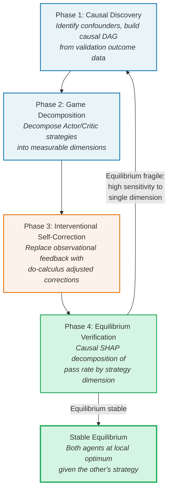

**Phase 1 — Causal Discovery**: Analyze historical validation outcomes to identify confounders (task difficulty, domain, user expertise) and build a causal DAG relating Actor strategy, Critic strategy, confounders, and outcomes.

**Phase 2 — Game Decomposition**: Decompose each agent's behavior into measurable strategy dimensions (algorithm choice, edge case handling, check severity, threshold settings) that can be independently varied and measured.

**Phase 3 — Interventional Self-Correction**: Replace the raw correction signal with causally adjusted feedback. The Actor's correction prompt includes causal attribution; the Critic's calibration data excludes confounder-driven variation.

**Phase 4 — Equilibrium Verification**: Use Causal SHAP to decompose the current pass rate by strategy dimension. If the equilibrium is **stable** (no single dimension has outsized sensitivity), the system has converged. If it is **fragile** (small changes in one dimension cause large quality swings), feed back into Phase 1 for further causal discovery.

### 8.8 Custom Tools as Causal Interventions

In tool-augmented systems, the decision to create a new custom tool is itself a strategic choice. Causal inference transforms tool creation from an ad-hoc response to errors into a principled intervention:

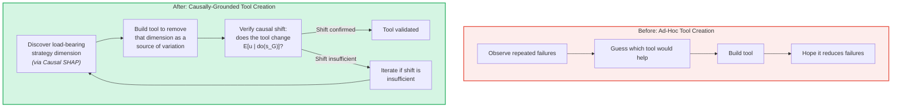

**Example**: Causal SHAP reveals that "algorithm choice" has a 0.31 contribution to the pass rate — the single largest driver. Rather than hoping the Actor will learn to choose better algorithms, the system creates a custom tool: an algorithm recommender that maps problem characteristics to appropriate algorithms. This tool *removes algorithm choice from the Actor's strategy space*, converting it from a variable (high variance, high impact) to a constant (tool-mediated, lower variance).

The causal verification step confirms: after deploying the tool, does $E[u \mid do(s_G)]$ actually shift upward? If not, the causal model was wrong, and the pipeline cycles back to discovery.

---

## Summary

The Actor-Critic pattern creates productive adversarial tension between a helpfulness-maximizing generator and a correctness-maximizing validator. The current design achieves **intra-episode adversarial refinement** — real adaptation within a single query's correction loop — but falls short of inter-episode co-evolution due to three structural gaps: the Critic's static rubric, ephemeral adaptation, and unidirectional feedback.

Closing these gaps requires:

1. **Persistent adversarial memory** (Section 6) to carry forward what both agents learn from each correction cycle.
2. **Symmetric agency** (Section 7) to allow the Actor to challenge Critic decisions and create genuine bidirectional pressure.
3. **Causal inference** (Section 8) to deconfound the correction signal, assign credit correctly, and verify that the system converges to a stable equilibrium rather than oscillating or gaming.

The convergence pipeline — from causal discovery through game decomposition, interventional self-correction, and equilibrium verification — provides a principled path from the current "courtroom with no case law" to a system that genuinely learns from its own adversarial dynamics.
