# Limitations and Enhancement Proposals

> **Series**: Actor-Critic Agent Design Pattern
> **Document**: 07 — Limitations & Enhancements
> **Scope**: Systematic analysis of known constraints in the dual-agent pattern, with prioritized proposals for improvement

---

## Overview

No architecture ships without trade-offs. The Actor-Critic pattern delivers measurable quality gains — but at the cost of latency, complexity, and coupling assumptions that become visible at production scale. This document catalogues the ten most significant limitations observed in real deployments and pairs each with a concrete enhancement proposal.

Throughout, we continue with the **code-generation assistant** running example: an Actor that writes Python from natural language, a Critic that validates correctness and security, and a tool layer that executes code in a sandbox.

---

## Part I — Current Limitations

### L1. Low Critic Pass Rate

In production deployments, a majority of Actor responses trigger at least one Critic correction cycle. A typical pass-rate distribution looks like this:

| Outcome | Approximate Share |
|---|---|
| Pass on first attempt | 30–40% |
| Salvageable (Critic rewrites) | 40–50% |
| Non-salvageable (Actor must retry) | 10–20% |

**Root cause.** The Critic operates against a strict rubric — often dozens of dimensions (correctness, security, grounding, formatting, completeness). The Actor's system prompt encodes complex, sometimes contradictory behavioral constraints. A response that is functionally correct may still fail on a formatting rule or a missing disclaimer.

**Impact.** Each retry adds a full LLM round-trip. In a code-generation scenario, a query that could return in 8 seconds balloons to 25+ seconds after two correction cycles. Users perceive the system as slow, and teams often respond by disabling the Critic entirely — trading quality for speed.

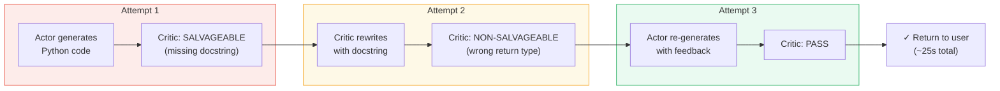

---

### L2. Instruction-Following Gap

The dominant failure mode is not tool errors or hallucination — it is **instruction non-compliance**. LLMs struggle with complex, multi-layered behavioral constraints, especially when those constraints span hundreds of lines and contain implicit priorities.

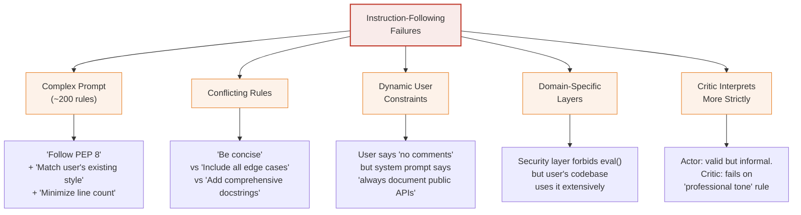

The problem compounds because the Critic evaluates the *same* ambiguous rules. When the Actor interprets "be concise" as "omit boilerplate," the Critic may interpret it as "include everything but use fewer words." Neither is wrong — the specification is under-determined.

---

### L3. Critic Latency Overhead

The Critic's sequential validation creates a latency floor that scales with the number of retry attempts.

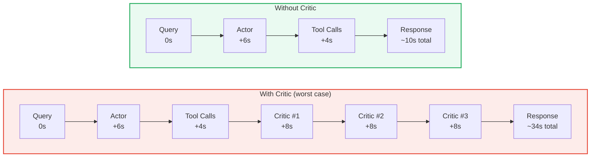

| Scenario | Estimated Latency | Cost Multiplier |
|---|---|---|
| No Critic | ~10s | 1× |
| Critic, pass on first try | ~18s | 1.5× |
| Critic, 1 correction | ~26s | 2.2× |
| Critic, max retries (3) | ~34s | 3.5× |

**The paradox.** In production, the Critic is most valuable for high-stakes queries — but those are exactly the queries where latency is most painful. Teams often disable the Critic for performance, undermining the architecture's primary value proposition.

---

### L4. Single-Model Actor

All requests route to the same Actor model regardless of complexity. A simple "add a docstring to this function" query consumes the same model tier and token budget as "refactor this module into a plugin architecture with dependency injection."

| Query Complexity | Ideal Model Tier | Current Behavior |
|---|---|---|
| Simple lookup / clarification | Fast, cheap model | Full model (over-provisioned) |
| Standard code generation | Default model | Full model (appropriate) |
| Complex multi-file refactor | Large reasoning model | Full model (under-provisioned) |

Over-provisioning wastes cost. Under-provisioning produces lower-quality outputs that trigger more Critic retries, compounding L1 and L3.

---

### L5. No Streaming Support

The Actor-Critic loop is synchronous: the user sees nothing until the entire pipeline — generation, tool execution, validation, possible retries — completes. During a 30-second worst-case pass, the user stares at a spinner with no progress indication.

This violates a core UX principle: **perceived latency** matters as much as actual latency. A streaming response that arrives token-by-token over 10 seconds feels faster than a batch response that arrives all at once after 10 seconds.

The synchronous design also prevents partial rendering of tool results (e.g., showing intermediate code output while the Actor continues reasoning).

---

### L6. Sandbox Isolation Limitations

Code execution sandboxes in many Actor-Critic deployments use thread-based isolation:

| Concern | Thread-Based Sandbox | Process-Based Sandbox |
|---|---|---|
| Memory isolation | ✗ Shared address space | ✓ Separate address space |
| CPU time limits | ✗ `threading.Timer` is cooperative | ✓ Hard kill via `os.kill()` |
| Resource caps (RAM) | ✗ No enforcement | ✓ `ulimit` / cgroups |
| Infinite loop protection | ✗ Cannot interrupt tight loops | ✓ SIGKILL after timeout |
| Side-effect isolation | ✗ Can modify shared state | ✓ Fully isolated |

In a code-generation assistant, the Actor may produce an infinite `while True` loop. A thread-based sandbox cannot reliably terminate it — the GIL prevents preemption of CPU-bound Python code.

---

### L7. Code Injection Surface

The Actor generates code as strings; the executor runs those strings via `exec()` or `subprocess`. Validation relies on pattern-matching blocklists (`eval`, `exec`, `__import__`, `open`).

**Weaknesses of pattern matching:**

- **Obfuscation bypasses**: `getattr(__builtins__, 'ev'+'al')('...')` evades a naive `eval` blocklist
- **Encoding tricks**: base64-encoded payloads decoded at runtime
- **Indirect imports**: `importlib.import_module('os').system('...')`
- **No parameterization**: every execution is a fresh string, so there is no way to distinguish structure from data

The risk is bounded in controlled deployments (trusted users, no internet access in sandbox), but it represents a fundamental architectural weakness for any system that aims to execute LLM-generated code in less controlled environments.

---

### L8. Critic Schema Mismatch with Reasoning Tokens

Modern LLMs support **extended thinking** (reasoning tokens) — a chain-of-thought that is returned alongside the final answer. When the Actor uses reasoning tokens:

1. The Actor's response contains both `reasoning` content (internal chain-of-thought) and `text` content (user-facing answer).
2. The Critic receives the full response, including reasoning tokens.
3. If the Critic issues a `SALVAGEABLE` correction, it produces a replacement as plain text.
4. The reasoning tokens from the Actor's original response are discarded.

This means corrected responses lose the transparency of the Actor's reasoning chain. Downstream consumers that rely on reasoning tokens (e.g., for explainability, auditing, or debugging) receive an incomplete record.

---

### L9. Tight Coupling to Specific LLM Providers

Model-specific logic — argument formatting, usage extraction, pricing calculation, error handling — is typically spread across multiple modules rather than encapsulated behind a provider interface.

Adding a new model provider (or even a new model version from the same provider) requires changes in:

| File / Module | Change Required |
|---|---|
| Prompt builder | Model-specific argument keys (`max_tokens` vs `max_completion_tokens`) |
| LLM caller | API client initialization, response parsing |
| Cost tracker | Pricing rates, token counting fields |
| Error handler | Provider-specific exception types |
| Configuration | Model endpoint URLs, feature flags |

This tight coupling slows model migration and prevents A/B testing across providers without significant refactoring.

---

### L10. No Memory Across Sessions

Each conversation starts from zero. The system does not learn from:

- **Successful code patterns**: a function the Actor got right once must be re-derived next time
- **User preferences**: preferred coding style, import conventions, naming patterns
- **Critic feedback history**: if the same rule triggers 80% of corrections, no one knows without manual log analysis
- **Domain knowledge**: project-specific patterns, API idioms, common error resolutions

Statelessness means the Actor and Critic repeat the same mistakes and corrections across sessions, wasting tokens and latency.

---

## Part II — Enhancement Proposals

### E1. Graduated Validation Strategy

> **Addresses**: L1 (low pass rate), L3 (latency overhead)

Instead of applying the full Critic rubric to every response, classify the response by complexity and route to an appropriate validation tier.

| Tier | Criteria | Validation | Estimated Overhead |
|---|---|---|---|
| **Light** | Simple tasks, <2 tool calls, short output | Schema check + key constraint spot-check | ~2–5s |
| **Standard** | Medium complexity, 2–5 tool calls | Full rubric, 1 Critic attempt | ~8–12s |
| **Deep** | Complex multi-step, >5 tool calls or multi-file output | Full rubric, up to 3 attempts + re-verification | ~20–35s |

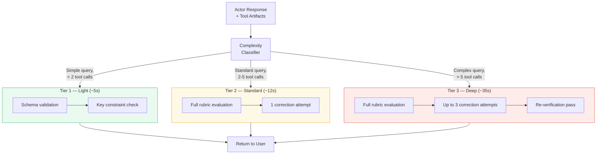

**Complexity classification** can be done cheaply: count tool calls, measure output token length, check for multi-file indicators — no LLM call needed. For a code-generation assistant, a single-function output with no imports is Tier 1; a multi-module refactor with tests is Tier 3.

**Expected impact**: 40–60% of queries drop to Tier 1, cutting average validation latency by half while maintaining deep validation where it matters.

---

### E2. Pre-Flight Instruction Distillation

> **Addresses**: L2 (instruction-following gap)

Replace the flat, 200-line system prompt with a **priority-stratified hierarchy** that makes rule importance explicit to the model.

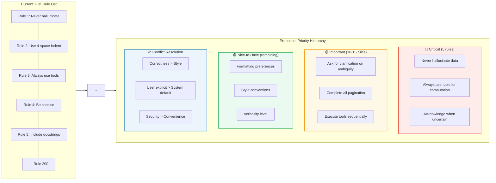

**Key design decisions:**

1. **Critical rules** (≤5): violations here always trigger Critic failure. Examples: never fabricate code output, always run code through the executor rather than simulating results, acknowledge tool errors honestly.
2. **Important rules** (10–15): violations trigger Critic warnings but may pass if the response is otherwise correct.
3. **Nice-to-have rules** (remaining): Critic notes them but does not fail the response.
4. **Conflict resolution** is explicit: when "be concise" and "include comprehensive error handling" conflict, the priority chain resolves it (correctness > completeness > style > brevity).

The Critic's rubric mirrors the same hierarchy, so both agents agree on what matters. This eliminates the category of failures where the Critic rejects a response over a low-priority rule.

---

### E3. Async Streaming with Progressive Validation

> **Addresses**: L3 (latency overhead), L5 (no streaming)

Stream the Actor's response to the user in real-time while launching the Critic asynchronously in the background. The user sees tokens arriving immediately; if the Critic passes, nothing changes. If the Critic corrects, the UI performs a smooth replacement.

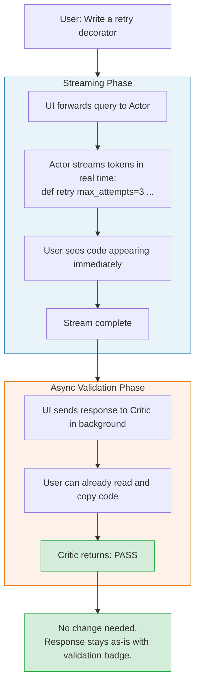

**Correction flow:**

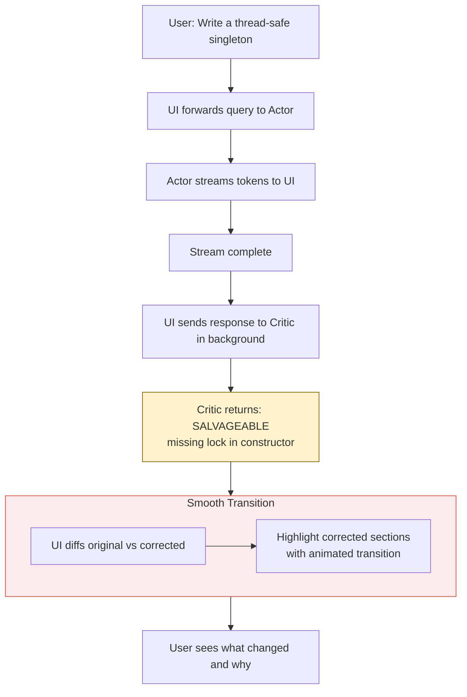

**Perceived latency improvement**: the user begins reading the response within 1–2 seconds instead of waiting 10–34 seconds. Even if a correction occurs, the user has already absorbed context from the initial stream.

---

### E4. Multi-Agent Routing

> **Addresses**: L4 (single-model Actor)

Route queries to an appropriate model tier based on estimated complexity before the Actor begins generation.

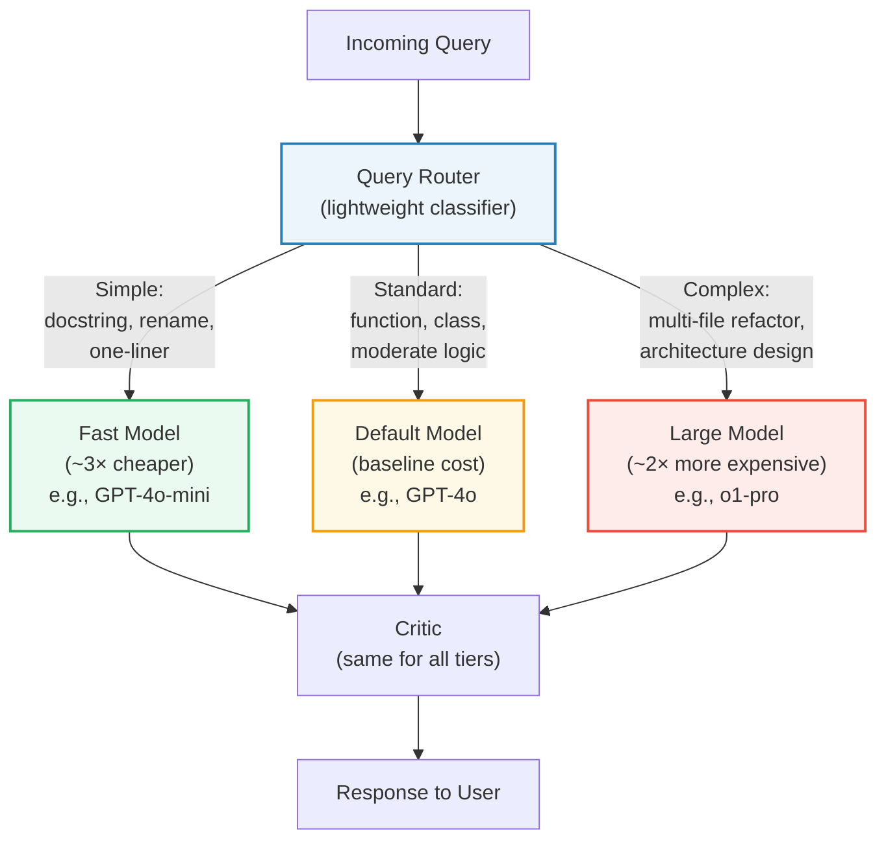

**Routing heuristics** (no LLM call needed):

| Signal | Fast | Default | Large |
|---|---|---|---|
| Estimated output tokens | <200 | 200–1000 | >1000 |
| Tool calls expected | 0–1 | 2–4 | 5+ |
| Keywords detected | "add comment", "rename", "fix typo" | "implement", "write", "create" | "refactor", "redesign", "migrate" |
| Conversation depth | First message, simple | Mid-conversation | Long chain with prior failures |

**Fallback mechanism**: if the fast model's response fails Critic validation, auto-escalate to the default model. If default fails, escalate to large. This creates a cost-efficient cascade where cheap models handle easy work and expensive models handle only what requires them.

---

### E5. Process-Level Sandbox

> **Addresses**: L6 (sandbox isolation limitations)

Replace thread-based code execution with process-level isolation, providing hard resource limits and reliable termination.

```python
import subprocess
import resource
import json
import tempfile
import os

def execute_sandboxed(code: str, timeout: int = 10, max_memory_mb: int = 256) -> dict:
    max_memory = max_memory_mb * 1024 * 1024

    def set_limits():
        resource.setrlimit(resource.RLIMIT_AS, (max_memory, max_memory))

    with tempfile.NamedTemporaryFile(mode='w', suffix='.py', delete=False) as f:
        f.write(code)
        f.flush()
        try:
            result = subprocess.run(
                ['python', f.name],
                capture_output=True,
                text=True,
                timeout=timeout,
                preexec_fn=set_limits,
            )
            return {
                'success': result.returncode == 0,
                'stdout': result.stdout,
                'stderr': result.stderr,
            }
        except subprocess.TimeoutExpired:
            return {'success': False, 'error': f'Execution timed out after {timeout}s'}
        finally:
            os.unlink(f.name)
```

**Isolation guarantees:**

| Property | Guarantee |
|---|---|
| Memory limit | Hard cap via `RLIMIT_AS`; process killed on violation |
| CPU timeout | `subprocess.TimeoutExpired` → SIGKILL; no cooperative exit needed |
| File system | Can mount read-only or use `tempfile` sandbox |
| Network | Optional: run with `unshare --net` or in network-isolated container |
| Side effects | Fully isolated address space; cannot mutate parent process state |

For maximum isolation, wrap the subprocess in a Docker container with resource constraints defined via `--memory`, `--cpus`, and `--network none`.

---

### E6. Code Parameterization Layer

> **Addresses**: L7 (code injection surface)

Instead of executing raw code strings, introduce a **structured code intent** representation for common operations, with a validated raw-code fallback for complex cases.

**Structured intent** (simple operations):

```python
{
    "intent": "transform_dataframe",
    "source": "df",
    "operations": [
        {"type": "filter", "column": "status", "op": "eq", "value": "active"},
        {"type": "groupby", "columns": ["region"], "agg": {"revenue": "sum"}},
        {"type": "sort", "column": "revenue", "ascending": False}
    ]
}
```

The executor translates this intent into code deterministically — no LLM-generated string is ever `exec`'d for these operations.

**Validated raw code** (complex operations):

```python
{
    "intent": "raw_code",
    "code": "def merge_forecasts(actual, predicted):\n    ...",
    "validation": {
        "ast_parse": True,
        "no_restricted_calls": True,
        "max_complexity": 15,
        "sandbox_level": "process"
    }
}
```

Raw code goes through AST-level validation (not regex pattern matching), checking for restricted node types (`Import`, `Call` to blocklisted functions) at the syntax tree level rather than the string level. This eliminates obfuscation bypasses.

---

### E7. Persistent Cross-Session Memory

> **Addresses**: L10 (no memory across sessions)

Introduce a memory layer that persists useful context across sessions, enabling the system to improve over time.

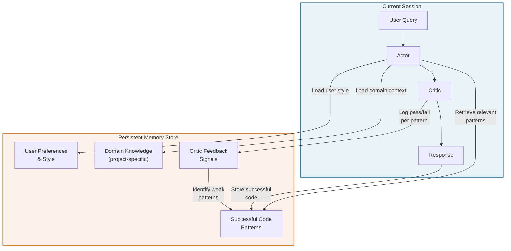

**Memory categories:**

| Category | What Is Stored | Retrieval Trigger |
|---|---|---|
| **Code patterns** | Function signatures, implementations that passed Critic on first attempt | Semantic similarity to current query |
| **User preferences** | Preferred libraries, naming conventions, comment style | User ID match |
| **Domain knowledge** | Project-specific APIs, common imports, error patterns | Project/repo context |
| **Feedback signals** | Pass/fail rate per task type, common Critic corrections | Aggregate analysis for prompt tuning |

**Implementation approach**: embed successful code patterns and user queries using a lightweight embedding model; store in a vector database. At query time, retrieve the top-k most relevant patterns and inject them into the Actor's context as few-shot examples. An analytics platform like AIR Insights could leverage its existing persistence layer (PostgreSQL + Delta tables) to store and retrieve these patterns without introducing new infrastructure.

---

### E8. Feedback-Driven Prompt Optimization

> **Addresses**: L1 (low pass rate), L2 (instruction-following gap)

Use accumulated Critic validation data to systematically identify prompt weaknesses and iteratively improve them.

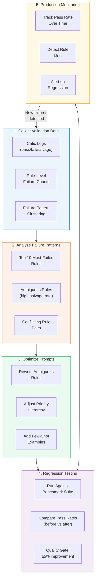

**Concrete example**: analysis of 1,000 Critic evaluations might reveal that 35% of `SALVAGEABLE` corrections are for "missing error handling in generated code." This signals that the Actor's system prompt should include a critical-tier rule: *"All generated functions must include error handling for expected failure modes."* Adding a few-shot example of proper error handling further reduces the failure rate.

**Quality gate**: no prompt change ships to production unless it demonstrates ≥5% improvement on a curated benchmark suite of representative queries.

---

### E9. Model-Agnostic Backend

> **Addresses**: L9 (tight coupling to specific LLM providers)

Define a provider interface that encapsulates all model-specific logic behind a uniform contract.

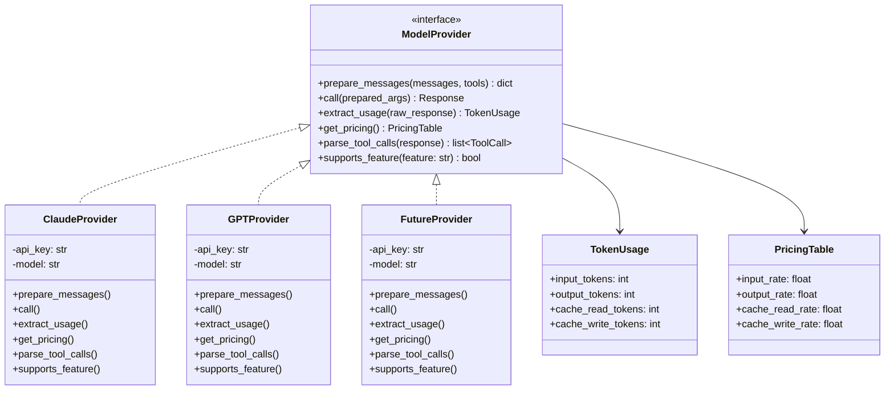

**Key design decisions:**

- `prepare_messages()` handles provider-specific argument formatting (`max_tokens` vs `max_completion_tokens`, system message placement, tool schema differences).
- `supports_feature()` enables feature detection: `provider.supports_feature('extended_thinking')` returns `True` for Claude, `False` for GPT — no more scattered `if model == 'claude'` branches.
- `get_pricing()` centralizes cost calculation per provider, eliminating the need for a global pricing dictionary that must be manually updated.

Adding a new provider means implementing one class. Zero changes to the orchestrator, prompt builder, or cost tracker.

---

### E10. Observability Dashboard

Build a real-time operational dashboard from data that Actor-Critic systems already produce (Critic logs, token usage, session records).

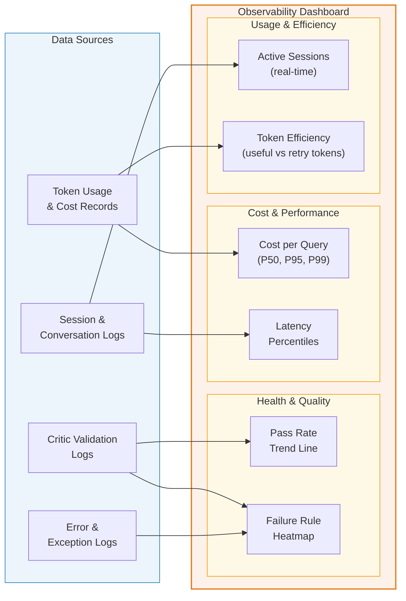

**Dashboard panels:**

| Panel | Metric | Source | Refresh |
|---|---|---|---|
| Pass Rate Trend | % of responses passing Critic on first attempt, rolling 7-day | Critic logs | 5 min |
| Failure Heatmap | Count of failures per rubric rule, colored by severity | Critic logs | 15 min |
| Cost per Query | P50 / P95 / P99 cost in USD | Token usage records | 5 min |
| Latency Percentiles | P50 / P95 / P99 end-to-end latency | Session timestamps | 5 min |
| Token Efficiency | Ratio of tokens in final response vs total tokens consumed (including retries) | Token usage records | 15 min |
| Active Sessions | Current concurrent sessions | Session manager | Real-time |

No new data collection is required — these metrics derive from logs and records that the system already writes. The dashboard serves both operational monitoring (is the system healthy?) and prompt engineering feedback (which rules cause the most failures?).

---

## Part III — Prioritized Roadmap

### Gantt Chart

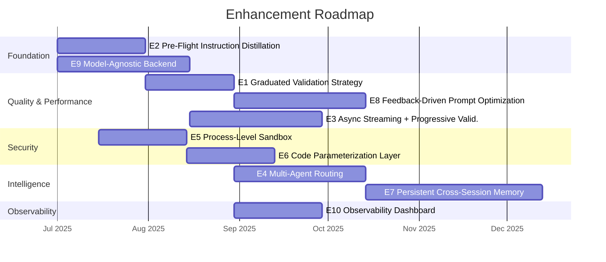

### Priority Ranking

| Priority | Enhancement | Impact | Effort | Dependencies |
|---|---|---|---|---|
| **1** | E2 — Pre-Flight Instruction Distillation | High: directly reduces dominant failure mode | Medium: prompt restructuring + Critic rubric alignment | None |
| **2** | E1 — Graduated Validation Strategy | High: cuts average latency ~50%, maintains quality | Medium: complexity classifier + tiered Critic config | E2 (aligned rubric) |
| **3** | E9 — Model-Agnostic Backend | High: unblocks E3, E4; reduces maintenance burden | Medium: interface design + provider migration | None |
| **4** | E5 — Process-Level Sandbox | High: critical security improvement | Low: well-understood subprocess patterns | None |
| **5** | E8 — Feedback-Driven Prompt Optimization | High: continuous quality improvement loop | Medium: analysis pipeline + benchmark suite | E1, E2 (validation data) |
| **6** | E3 — Async Streaming | Medium: perceived latency elimination | High: streaming architecture + UI changes | E9 (provider abstraction) |
| **7** | E6 — Code Parameterization | Medium: eliminates injection class of vulnerabilities | Medium: AST parser + intent schema design | E5 (sandbox as fallback) |
| **8** | E4 — Multi-Agent Routing | Medium: cost optimization + quality for complex tasks | Medium: router logic + model provisioning | E1 (complexity classifier) |
| **9** | E10 — Observability Dashboard | Medium: operational visibility | Low: dashboard from existing data | E1 (validation tier data) |
| **10** | E7 — Persistent Memory | Medium: long-term quality improvement | High: embedding pipeline + vector store + retrieval | E8 (feedback signals) |

---

## Summary

The Actor-Critic pattern's core value — separating generation from validation — is sound. Its limitations are primarily engineering constraints, not architectural flaws. The three highest-leverage improvements are:

1. **Instruction Distillation (E2)**: attacks the dominant failure mode (instruction non-compliance) at the source. A priority-stratified prompt with explicit conflict resolution rules reduces ambiguity for both Actor and Critic, improving first-pass accuracy before any other optimization.

2. **Graduated Validation (E1)**: eliminates the all-or-nothing validation cost. By routing simple queries to lightweight checks, the system preserves deep validation for complex tasks while cutting average latency in half. This makes it practical to keep the Critic enabled in production.

3. **Feedback-Driven Prompt Optimization (E8)**: closes the loop. Instead of treating prompt engineering as a one-time activity, it becomes a continuous improvement cycle driven by real validation data. Rules that cause the most failures get rewritten; the benchmark suite prevents regressions.

Together, these three enhancements form a reinforcing cycle: better instructions → higher first-pass rate → more validation data → better instructions. The remaining enhancements (streaming, routing, security hardening, memory, observability) build on this foundation to address cost, latency, security, and long-term learning.

---

*Next in series: [08 — Case Study: Production Deployment Patterns](08_case_study_production_patterns.md)*
