# Causal Nash Equilibrium Convergence

> **Series**: Actor-Critic Agent Design Pattern
> **Document**: 08 — Causal Nash Equilibrium Convergence
> **Scope**: Formal game-theoretic foundations of Nash Equilibrium convergence in adversarial multi-agent systems, and how causal inference resolves the confounding problem that causes best-response dynamics to cycle

---

## 1. Background: Nash Equilibrium in Multi-Agent Systems

The Actor-Critic pattern (Document 06) establishes that adversarial dual-agent systems exhibit productive tension between a helpfulness-maximizing Generator and a correctness-maximizing Verifier. Document 06 explains *what* causal inference does for convergence at a practical level. This document provides the *formal game-theoretic foundations* — why causal inference is not merely helpful but **necessary** for convergence when unobserved confounders exist.

### 1.1 The State of the Field

The multi-agent reinforcement learning (MARL) community has developed several algorithmic families for computing or approximating Nash Equilibria in multi-agent settings:

| Framework | Core Idea | Key Contribution |
|---|---|---|
| **Nash-Q Learning** (Hu & Wellman, 1998) | Compute Nash Equilibrium on joint Q-value matrices at each state | First principled MARL algorithm with NE convergence guarantees under restrictive assumptions |
| **Deep Nash Q-Network** (Xie et al., 2025) | Scale Nash-Q to high-dimensional state spaces via deep function approximation | Bridges tabular game theory with modern deep RL |
| **Correlated Q-Learning** | Extend Nash-Q to correlated equilibria, allowing agents to coordinate via shared randomization | Broader equilibrium concept that is computationally easier to find |
| **Satisficing Paths** (Yongacoglu et al., 2024) | Relax strict best-response to ε-satisficing responses, ensuring paths to equilibrium exist | NeurIPS 2024 result showing that relaxed rationality guarantees convergence where strict rationality cycles |
| **Adversarial Team Markov Games** (Kalogiannis et al., 2023) | Unify zero-sum and potential games under a single framework with efficient equilibrium computation | Shows that team structure within adversarial settings admits polynomial-time solutions |

These frameworks share a common assumption: agents observe the *true* payoff structure, or at minimum, the payoff signal is **unconfounded**. When a Generator observes that strategy $s_G$ yielded utility $u_G$, the implicit assumption is that $u_G$ reflects the causal effect of $s_G$ — not a spurious association driven by an unobserved variable.

### 1.2 The Open Problems

Three fundamental challenges remain unresolved in the general MARL setting:

**Problem 1: Distributed Control vs. Nash Equilibrium.** Liu et al. (2025) prove that achieving distributed control (each agent optimizes independently using only local information) while simultaneously converging to a Nash Equilibrium is impossible in most formulations. The Actor-Critic pattern is inherently distributed — the Generator and Verifier optimize separately — placing it squarely in the regime where convergence is not guaranteed.

**Problem 2: Unrealistic Assumptions.** Nash-Q and its descendants require that agents perform perfect strategy optimization at each step and maintain consistent beliefs about the opponent's strategy. In practice, LLM-based agents exhibit stochastic behavior, approximate reasoning, and inconsistent internal representations across calls. The "rational agent" assumption fails at the foundation.

**Problem 3: Non-Stationarity.** When two agents learn concurrently, each agent's environment is non-stationary because the other agent's policy is changing. De La Fuente et al. (2024) survey the literature and conclude that non-stationarity remains the central obstacle to MARL convergence. Standard convergence proofs assume a fixed opponent — an assumption violated by construction in co-evolutionary systems.

### 1.3 The Missing Bridge: Causal Reasoning

The core thesis of this document:

> **Causal inference resolves the confounding that causes best-response dynamics to cycle. Without causal reasoning, agents chase correlations and oscillate. With causal reasoning — specifically interventional best responses, game decomposition via d-separation, and counterfactual credit assignment — the adversarial game admits convergence guarantees that standard MARL cannot provide.**

The insight is that Problems 1–3 above are not independent. They share a common root cause: agents update their strategies based on **observational** feedback that conflates the causal effect of their actions with the influence of unobserved confounders. Causal inference does not merely help — it is the structural prerequisite for convergence in confounded multi-agent settings.

---

## 2. Scenario: Adversarial Dual-Agent Error Correction

### 2.1 Agent Definitions

Consider two agents engaged in a RAG (Retrieval-Augmented Generation) pipeline for code generation:

**Agent G (Generator/Actor)** produces code from natural language specifications augmented with retrieved context. Its strategy space spans three dimensions:

| Dimension | Range | Description |
|---|---|---|
| Retrieval method | {sparse, dense, hybrid} | How context documents are retrieved |
| Context window | {2k, 4k, 8k, 16k} tokens | How much retrieved context to include |
| Output aggressiveness | [0, 1] continuous | Willingness to generate speculative code vs. conservative stubs |

**Agent V (Verifier/Critic)** validates the generated code against correctness, security, and specification compliance. Its strategy space:

| Dimension | Range | Description |
|---|---|---|
| Verification depth | {surface, standard, deep} | How many validation checks to run |
| Evidence threshold | [0, 1] continuous | Confidence required to flag an issue |
| Correction aggressiveness | [0, 1] continuous | Willingness to rewrite (salvageable) vs. reject (non-salvageable) |

### 2.2 Utility Functions

This is a **general-sum game** — not zero-sum. Both agents can simultaneously improve or degrade, and one agent's gain does not require the other's loss.

$$u_G = \underbrace{\text{quality score}}_{\text{user satisfaction}} - \underbrace{\lambda_1 \cdot \text{correction penalty}}_{\text{cost of being corrected}} - \underbrace{\lambda_2 \cdot \text{latency cost}}_{\text{time to generate}}$$

$$u_V = \underbrace{\text{true positives}}_{\text{real errors caught}} - \underbrace{\mu_1 \cdot \text{false positive penalty}}_{\text{wrongly flagged code}} - \underbrace{\mu_2 \cdot \text{missed error cost}}_{\text{real errors not caught}}$$

The general-sum structure is critical. In a zero-sum game, one agent's improvement necessarily hurts the other, and Nash Equilibria are computable in polynomial time via linear programming. In the general-sum case, NE computation is PPAD-complete — and the confounding problem makes it strictly harder.

### 2.3 Agent Interaction Flow

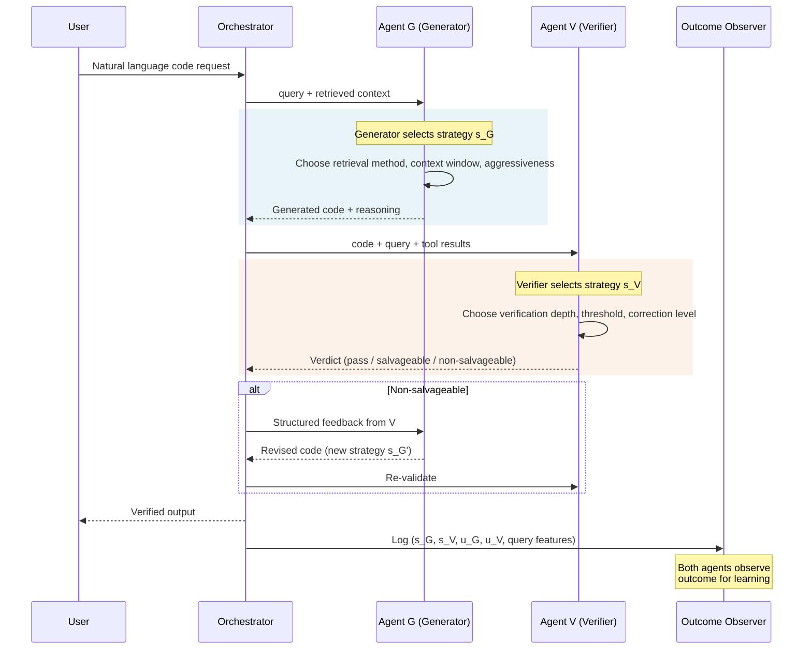

Both agents observe the outcome — but the outcome is **confounded** by query difficulty, which neither agent directly observes. This is the source of the convergence problem.

---

## 3. The Confounding Problem — Why Best-Response Dynamics Fail

### 3.1 The Structural Causal Model

The full causal structure of the Generator-Verifier interaction includes an unobserved confounder — **Query Difficulty (U)** — that simultaneously influences both agents' strategies and the quality of the generated output.

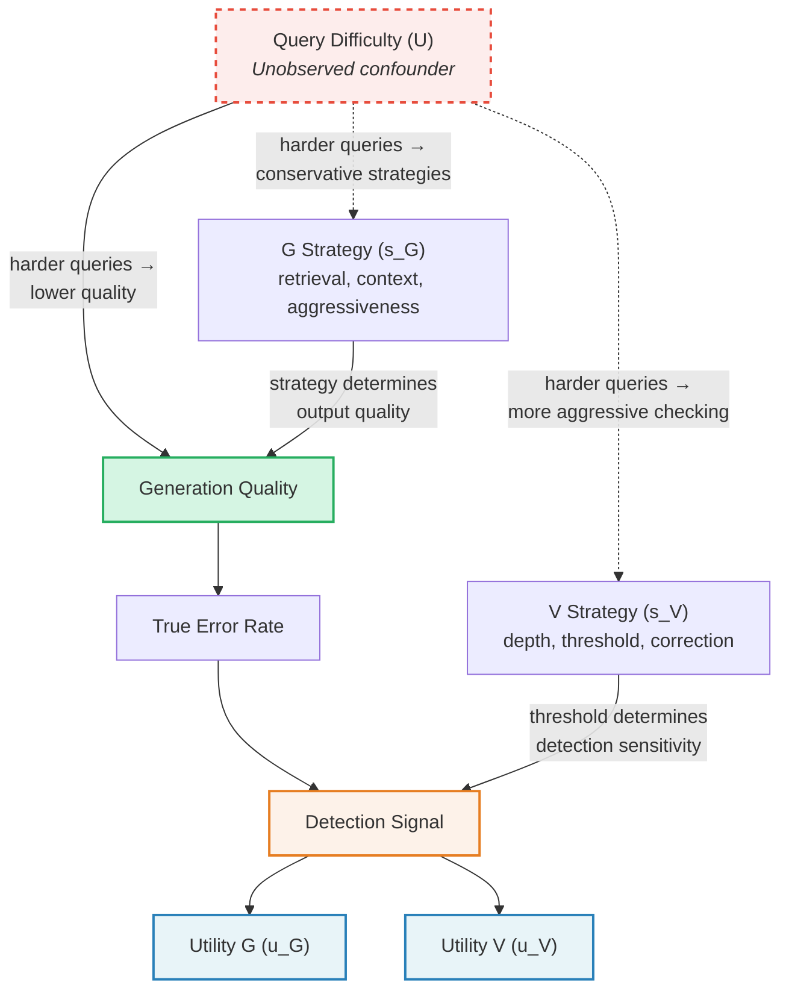

The **dashed edges** from U represent confounding paths. Query Difficulty affects:
- **G's strategy**: harder queries push G toward conservative generation (shorter context, less speculation)
- **V's strategy**: harder queries push V toward aggressive checking (lower thresholds, deeper verification)
- **Generation quality**: harder queries produce lower-quality code regardless of strategy

These three paths create **backdoor paths** between $s_G$ and $u_G$ (and between $s_V$ and $u_V$) that pass through U, making the observed association between strategy and utility a biased estimate of the true causal effect.

### 3.2 The Concrete Failure Mode

Consider a specific failure trajectory in the RAG code-generation scenario:

**Step 1 — Generator observes a spurious correlation.**
G notices that when it uses longer context windows (8k+ tokens), the Verifier flags fewer errors. Naively: longer context → fewer flags → shift to longer context.

**Step 2 — The real mechanism is confounded.**
Longer context windows correlate with *easier* queries. Why? Easy queries have abundant, high-quality documentation that fills large context windows. Hard queries have sparse, ambiguous documentation. The reduced flag rate is driven by query difficulty, not context length.

**Step 3 — Verifier observes a confounded signal.**
V notices that aggressive checking (low threshold) catches more errors when G uses short context. V concludes: short context → more real errors → sharpen checks on short-context generations. But the real cause is that short context correlates with hard queries, which have more genuine errors regardless of context length.

**Step 4 — Both agents chase spurious correlations.**
G shifts to 8k context for all queries (including hard ones where the extra context is noise). V sharpens checks selectively on short-context generations (missing errors in long-context hard queries). Both agents have moved *away* from the Nash Equilibrium based on confounded signals.

**Step 5 — Oscillation.**
G's long-context strategy now produces poor results on hard queries → V catches more errors → G retreats to short context → V relaxes → G extends context again. The system cycles indefinitely.

### 3.3 Formal Statement

The standard best-response dynamic computes:

$$BR_G(s_V) = \arg\max_{s_G} \; E[u_G \mid s_G, s_V]$$

This conditions on $s_V$ but does **not** block the backdoor path through U. The conditional expectation $E[u_G \mid s_G, s_V]$ includes the confounded association:

$$E[u_G \mid s_G, s_V] = \underbrace{E[u_G \mid do(s_G), do(s_V)]}_{\text{true causal effect}} + \underbrace{\text{bias}(U \to s_G, U \to u_G)}_{\text{confounding bias}}$$

When the confounding bias is non-zero — which it is whenever query difficulty varies — the observational best response diverges from the interventional best response. Agents that play observational best responses cycle; agents that play interventional best responses converge.

---

## 4. Four Causal Mechanisms That Enable Convergence

### 4.1 Overview: The Convergence Pipeline

The path from confounded oscillation to Nash Equilibrium convergence requires four mechanisms, each building on the previous:

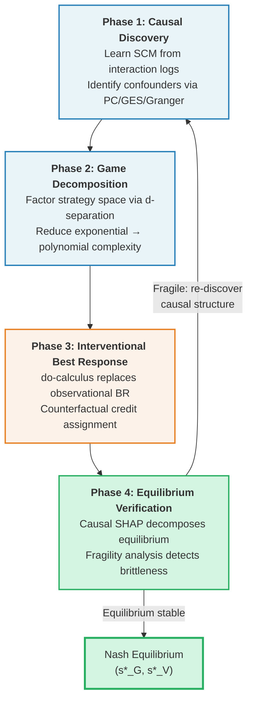

The feedback loop from Phase 4 back to Phase 1 is essential. Causal structures can shift as the data distribution changes (new query types, model updates, domain expansion). An equilibrium that was stable under one SCM may become fragile under a new one.

### 4.2 Mechanism 1: Interventional Best Responses via Do-Calculus

The core fix replaces the observational best response with an **interventional** best response that blocks all backdoor paths through confounders.

**Observational (confounded):**

$$BR_G(s_V) = \arg\max_{s_G} \; E[u_G \mid s_G, s_V]$$

**Interventional (deconfounded):**

$$BR_G(s_V) = \arg\max_{s_G} \; E[u_G \mid do(s_G), do(s_V)]$$

The $do(\cdot)$ operator severs all incoming edges to the intervened variable in the causal graph. Applying Pearl's backdoor adjustment formula:

$$P(u_G \mid do(s_G), do(s_V)) = \sum_{U} P(u_G \mid s_G, s_V, U) \cdot P(U)$$

This formula marginalizes over the confounder distribution $P(U)$, yielding the true causal effect of strategy choices on utility — free of confounding bias.

**Convergence guarantee.** When the SCM is correctly specified and the backdoor criterion is satisfied, interventional best responses form a **contraction mapping** on the joint strategy space. For any two strategy profiles $(s_G, s_V)$ and $(s'_G, s'_V)$:

$$d(BR(s_G, s_V), BR(s'_G, s'_V)) \leq \gamma \cdot d((s_G, s_V), (s'_G, s'_V)), \quad \gamma < 1$$

Standard observational best responses lack this contraction property because the confounding bias introduces non-monotonic distortions in the perceived payoff landscape.

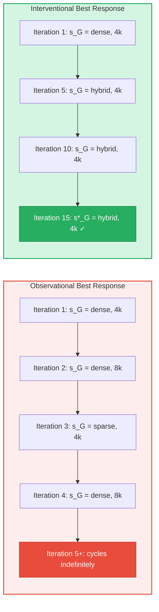

### 4.3 Mechanism 2: Game Decomposition via Causal Discovery

The joint strategy space of G and V has $|S_G| \times |S_V|$ entries. With three retrieval methods, four context windows, a continuous aggressiveness parameter (discretized to 10 levels), three verification depths, and two continuous parameters (discretized to 10 each) — the joint space is $3 \times 4 \times 10 \times 3 \times 10 \times 10 = 360{,}000$ strategy profiles. Exhaustive search for Nash Equilibria in this space is computationally prohibitive.

Causal discovery identifies which strategy dimensions are **causally independent** via d-separation. If two dimensions are d-separated given the observed variables, they can be optimized in independent sub-games.

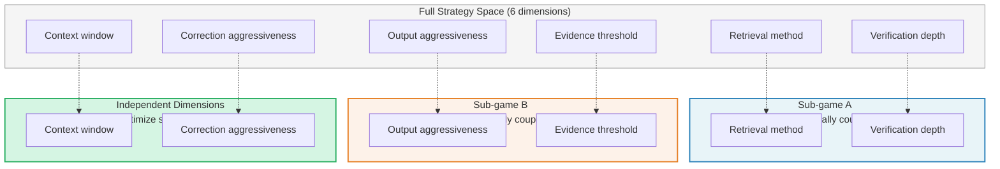

**Complexity reduction.** Instead of searching a 360,000-entry joint space, the decomposed game requires searching:
- Sub-game A: $3 \times 3 = 9$ profiles
- Sub-game B: $10 \times 10 = 100$ profiles
- Independent dimensions: $4 + 10 = 14$ single-agent optimizations

Total: $9 + 100 + 14 = 123$ evaluations — a **2,927× reduction**. The reduction is from exponential in the number of strategy dimensions to polynomial, because d-separation factoring converts a single high-dimensional game into multiple low-dimensional games.

Causal discovery algorithms used to identify this structure:
- **PC Algorithm**: constraint-based, tests conditional independence to orient edges
- **GES (Greedy Equivalence Search)**: score-based, searches over equivalence classes of DAGs
- **Granger Causality**: time-series variant, identifies temporal causal relationships from sequential interaction logs

### 4.4 Mechanism 3: Counterfactual Credit Assignment

When G changes multiple strategy dimensions between iterations and the outcome improves, which change deserves credit? Standard MARL assigns credit to the *joint* strategy change, which dilutes the learning signal and slows convergence.

Pearl's twin-network counterfactual provides a principled alternative:

$$CF_G = E[u_G(s'_G, s_V) \mid s_G, s_V, \text{outcome}] - E[u_G(s_G, s_V) \mid s_G, s_V, \text{outcome}]$$

This computes the expected utility under a counterfactual strategy $s'_G$ while holding the Verifier's strategy fixed and conditioning on the actual observed outcome — giving a **deconfounded gradient signal** for each strategy dimension.

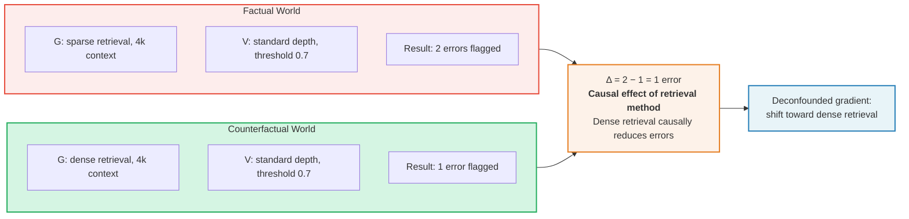

Counterfactual credit assignment reduces reward variance because it isolates the contribution of each dimension rather than attributing the full reward change to the joint action. Lower variance → faster convergence, particularly in the early iterations where the signal-to-noise ratio is poorest.

### 4.5 Mechanism 4: Causal SHAP for Equilibrium Verification

Once the system converges to a candidate equilibrium $(s^*_G, s^*_V)$, Causal SHAP verifies whether the equilibrium is robust or fragile. The interventional SHAP value for strategy dimension $j$:

$$\phi_j^{\text{causal}}(s^*_G) = E_{S \subseteq \text{features} \setminus \{j\}} \left[ u_G(do(S \cup \{j\})) - u_G(do(S)) \right]$$

Unlike standard SHAP, which treats all features as exchangeable, Causal SHAP respects the causal graph — only computing contributions along causally valid paths.

**Purpose 1 — Interpretability.** Causal SHAP reveals which strategy dimensions are *load-bearing* (high contribution, the equilibrium depends on them) versus *slack* (low contribution, can vary without affecting the equilibrium).

**Purpose 2 — Fragility detection.** If a single dimension has a disproportionate SHAP value relative to all others, the equilibrium is *brittle* — a small perturbation in that dimension collapses the equilibrium. This triggers a return to Phase 1 (causal discovery) to investigate whether the causal structure has shifted.

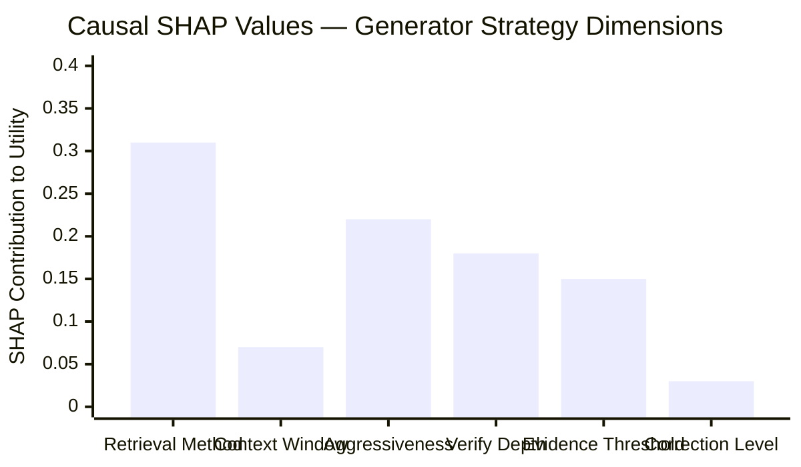

In this example, *Retrieval Method* ($\phi = 0.31$) and *Output Aggressiveness* ($\phi = 0.22$) are the load-bearing dimensions. *Context Window* ($\phi = 0.07$) and *Correction Level* ($\phi = 0.03$) are slack — the equilibrium is insensitive to them. If *Retrieval Method* alone accounted for $> 0.50$ of total SHAP, the equilibrium would be flagged as fragile.

---

## 5. Concrete Walkthrough: One Convergence Cycle

### 5.1 Initial Observation

The system begins with arbitrary initial strategies:
- **G**: dense retrieval, 4k context window, aggressiveness = 0.5
- **V**: standard depth, evidence threshold = 0.7, correction aggressiveness = 0.5

Over the first 100 interactions, the observed error flag rate is **23%**. Both agents begin updating their strategies.

### 5.2 Without Causal Inference (Standard MARL)

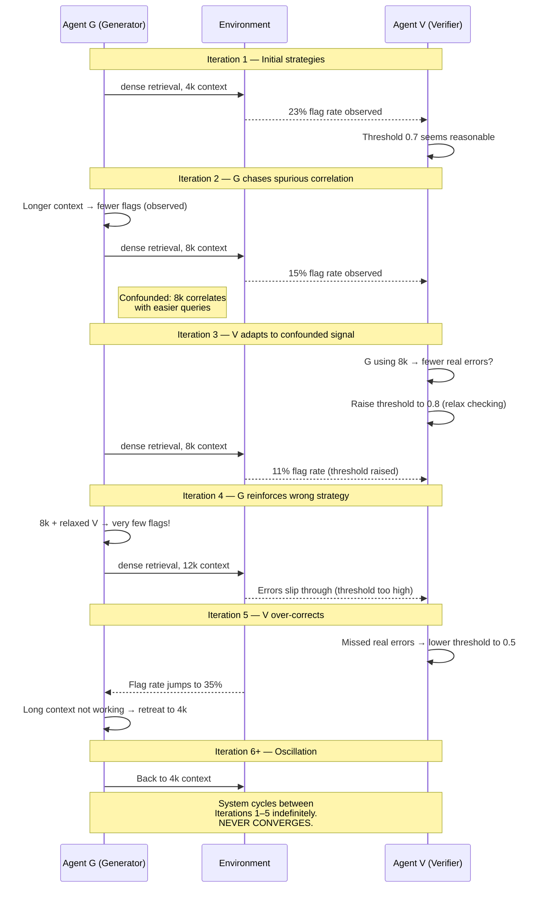

The fundamental problem: G and V are both updating based on **observational** associations ($E[u \mid s_G, s_V]$) that conflate the causal effect of their strategies with the confounding effect of query difficulty. Each agent's "improvement" distorts the other's signal, creating a non-stationary feedback loop with no fixed point.

### 5.3 With Causal Inference

The causal inference engine applies backdoor adjustment to compute the *true* effect of each strategy dimension, marginalizing over query difficulty:

$$P(\text{flag rate} \mid do(\text{context}=8k)) = \sum_U P(\text{flag rate} \mid \text{context}=8k, U) \cdot P(U)$$

**Numerical example:**

| Query Difficulty (U) | P(U) | P(flag \| context=8k, U) | Contribution |
|---|---|---|---|
| Easy | 0.4 | 0.08 | 0.032 |
| Medium | 0.35 | 0.22 | 0.077 |
| Hard | 0.25 | 0.40 | 0.100 |
| **Total** | | | **≈ 0.21** |

The **interventional** flag rate under $do(\text{context}=8k)$ is approximately **0.21** — significantly higher than the naive conditional $P(\text{flag rate} \mid \text{context}=8k) \approx 0.15$. The 6-percentage-point gap is entirely attributable to confounding: easy queries are over-represented in the 8k-context stratum.

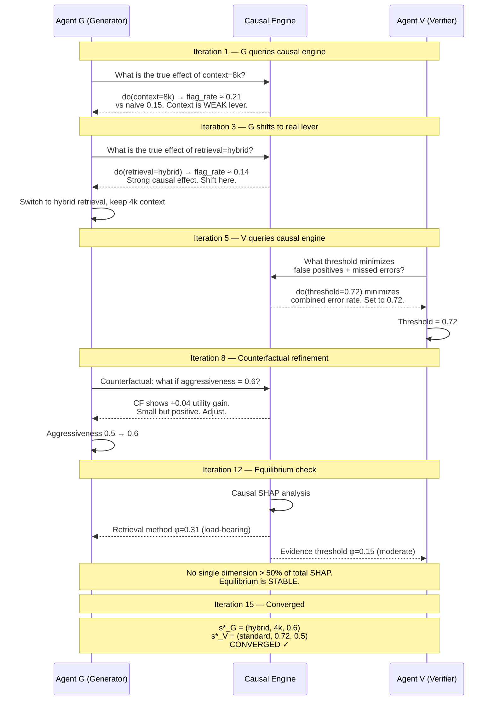

The causal engine prevents G from chasing the spurious context-length correlation and redirects it toward the genuinely effective lever (retrieval method). V's threshold is set by interventional analysis rather than reactive adjustment. The system converges in approximately 15 iterations versus indefinite oscillation.

---

## 6. The Deeper Theoretical Connection

### 6.1 From Confounded Games to Potential Games

A **potential game** is one where a single potential function $\Phi(s_G, s_V)$ exists such that any unilateral improvement by either agent increases $\Phi$. Potential games have the **finite improvement property**: any sequence of unilateral best-response deviations terminates at a Nash Equilibrium in finite steps.

The key theoretical result: **the interventional game (using $do(\cdot)$) removes the cycling feedback loops that prevent the confounded game from being a potential game.**

In the confounded game, the perceived utility landscape contains non-monotonic distortions introduced by the confounder. Agent G's perceived best response depends on the confounder distribution *within the stratum it observes*, which shifts as V changes strategy (because V's strategy also correlates with the confounder). This creates circular dependencies that violate the potential game property.

In the interventional game, utilities are computed by marginalizing over the confounder distribution $P(U)$. This removes the stratum-dependent distortions, yielding a utility landscape where unilateral improvements are *monotonic* — and thus the finite improvement property holds.

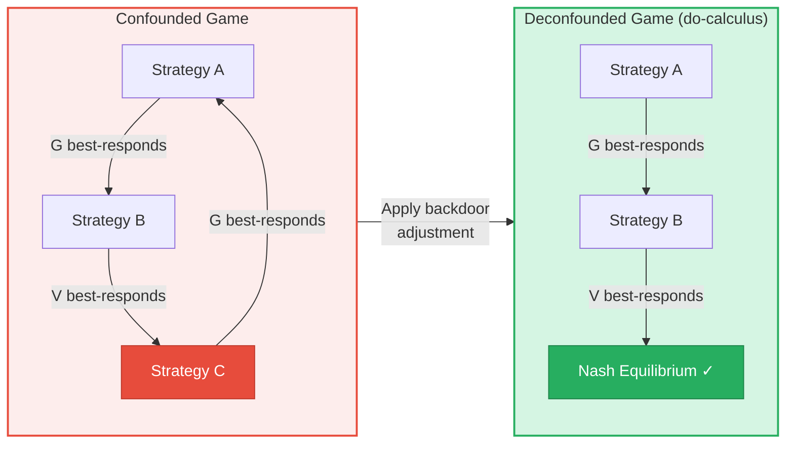

### 6.2 Connection to Pearl's Causal Hierarchy

The three levels of Pearl's causal hierarchy map directly onto the quality of best-response dynamics:

| Level | Pearl's Hierarchy | Query Form | Best-Response Quality | Convergence |
|---|---|---|---|---|
| **L1: Association** | $P(y \mid x)$ | "What do I observe when I play $s_G$?" | Standard BR — confounded. Observes correlations that conflate strategy effects with confounder effects. | **Fails.** Cycles indefinitely when confounders exist. |
| **L2: Intervention** | $P(y \mid do(x))$ | "What happens if I *set* $s_G$, regardless of natural causes?" | Interventional BR — deconfounded. Marginalizes over confounders to isolate true causal effect. | **Converges.** Contraction mapping when SCM is correct. |
| **L3: Counterfactual** | $P(y_{x'} \mid x, y)$ | "Given what I observed, what *would have* happened under $s'_G$?" | Counterfactual credit — deconfounded gradient. Assigns credit to individual dimensions conditioned on observed outcome. | **Accelerates.** Reduces variance, faster convergence to same NE. |

L2 is **necessary** for convergence. L3 is not strictly necessary but **accelerates** convergence by providing a more informative gradient signal.

### 6.3 Relationship to Existing Frameworks

| Framework | What It Does | What It Misses | How This Approach Extends It |
|---|---|---|---|
| **Nash-Q Learning** (Hu & Wellman, 1998) | Computes NE on joint Q-value matrices | Assumes payoffs are unconfounded; no causal reasoning | Replaces observational Q-values with interventional Q-values via backdoor adjustment |
| **Causal Games** (Everett & Fox, 2021) | Adds causal structure (DAGs) to strategic games; defines causal best response | Addresses static games; doesn't tackle MARL convergence or iterative dynamics | Extends causal game formalism to iterative multi-agent learning with convergence guarantees |
| **Interventional Game Theory** | Uses $do(\cdot)$ operator in game-theoretic analysis | Limited to single-shot or static repeated games; no learning dynamics | Combines interventional reasoning with iterative strategy updates and equilibrium verification |
| **Satisficing Paths** (Yongacoglu et al., 2024) | Relaxes best-response to ε-satisficing, ensures equilibrium paths exist | Doesn't address confounders — paths exist but may lead to confounded equilibria | Combines satisficing relaxation with causal deconfounding for paths to *true* equilibria |
| **This approach** | SCM + dynamic MARL iteration + causal verification | See Section 8.2 for limitations | Bridges causal inference and MARL convergence via interventional BR, game decomposition, counterfactual credit, and Causal SHAP verification |

---

## 7. Implementation Architecture

### 7.1 System Components

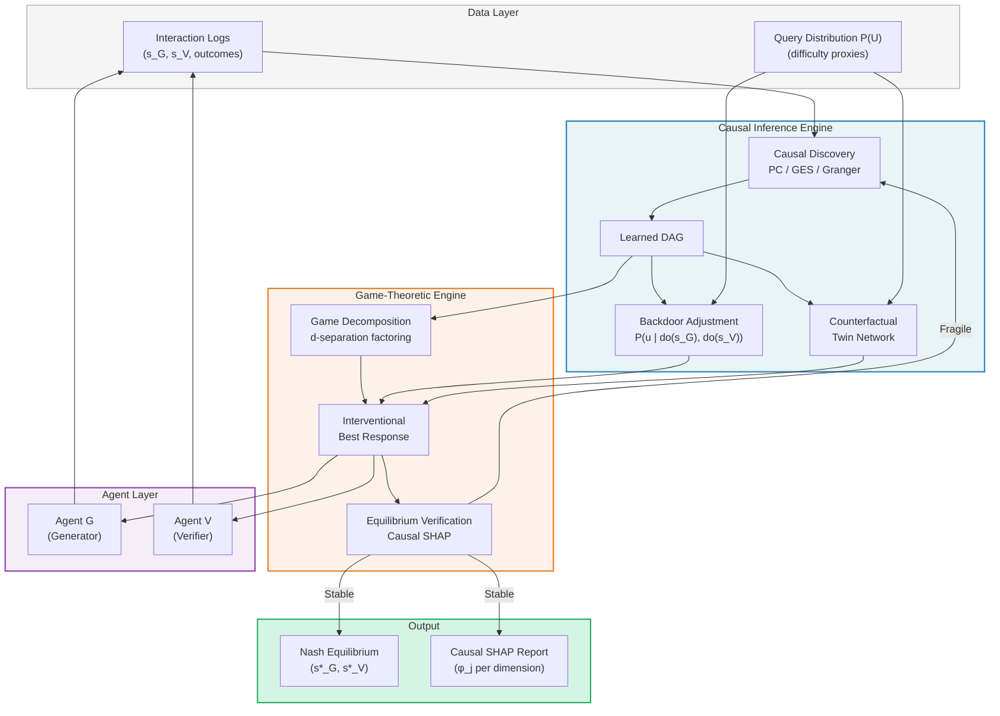

**Data flow summary:**
1. Interaction logs and query difficulty proxies feed the **Causal Discovery** module, which learns the SCM.
2. The learned DAG feeds both the **Game Decomposition** module (identifying independent sub-games) and the **Backdoor Adjustment / Counterfactual** modules (computing deconfounded effects).
3. The **Game-Theoretic Engine** uses the decomposed sub-games and interventional estimates to compute best responses for each agent.
4. Agents receive updated strategy recommendations, execute them, and log outcomes back to the Data Layer.
5. **Equilibrium Verification** uses Causal SHAP to assess stability. If fragile, the loop returns to Causal Discovery.

### 7.2 Algorithm Pseudocode

```
Algorithm: Causal Nash Equilibrium Convergence (CNEC)
────────────────────────────────────────────────────────────────────

Input:   Interaction logs D
         Query difficulty distribution P(U)
         Convergence threshold ε
         Fragility threshold τ
         Learning rate α
         Maximum iterations T

Output:  Nash equilibrium (s*_G, s*_V)
         Causal SHAP report {φ_j}

────────────────────────────────────────────────────────────────────
1. CAUSAL DISCOVERY
────────────────────────────────────────────────────────────────────
   DAG ← PC_Algorithm(D)                          // or GES, Granger
   Confounders ← identify_backdoor_paths(
       DAG, s_G, s_V, u_G, u_V
   )
   Verify: backdoor_criterion_satisfied(DAG, Confounders)

────────────────────────────────────────────────────────────────────
2. GAME DECOMPOSITION
────────────────────────────────────────────────────────────────────
   strategy_dims ← {d_1, d_2, ..., d_K}          // all dimensions
   SubGames ← d_separation_factoring(DAG, strategy_dims)
   // SubGames = {SG_1, SG_2, ..., SG_M}  where M ≤ K
   // Each SG_m contains causally coupled dimension pairs
   IndependentDims ← strategy_dims \ ∪_m SG_m

────────────────────────────────────────────────────────────────────
3. INTERVENTIONAL ITERATION
────────────────────────────────────────────────────────────────────
   Initialize s_G⁰, s_V⁰ randomly
   for t = 1, 2, ..., T do

     // 3a. Interventional best response per sub-game
     for each SubGame_k in SubGames do
       s_G^t[k] ← argmax_{s_G[k]} Σ_U P(u_G | s_G[k], s_V^{t-1}[k], U) · P(U)
       s_V^t[k] ← argmax_{s_V[k]} Σ_U P(u_V | s_G^t[k], s_V[k], U) · P(U)
     end

     // 3b. Independent dimensions — single-agent optimization
     for each dim d in IndependentDims do
       s^t[d] ← argmax_{s[d]} Σ_U P(u | s[d], U) · P(U)
     end

     // 3c. Counterfactual credit assignment
     CF_G^t ← E[u_G(s'_G, s_V^t) | s_G^t, s_V^t, outcome]
              - E[u_G(s_G^t, s_V^t) | s_G^t, s_V^t, outcome]
     CF_V^t ← E[u_V(s_G^t, s'_V) | s_G^t, s_V^t, outcome]
              - E[u_V(s_G^t, s_V^t) | s_G^t, s_V^t, outcome]

     // 3d. Gradient update with counterfactual signal
     s_G^t ← s_G^t + α · CF_G^t
     s_V^t ← s_V^t + α · CF_V^t

     // 3e. Convergence check
     if ‖s_G^t - s_G^{t-1}‖ + ‖s_V^t - s_V^{t-1}‖ < ε then
       break
     end

   end

────────────────────────────────────────────────────────────────────
4. EQUILIBRIUM VERIFICATION
────────────────────────────────────────────────────────────────────
   for each strategy dimension j do
     φ_j^causal ← E_{S ⊆ features\{j}} [
       u(do(S ∪ {j})) - u(do(S))
     ]
   end

   // Fragility check
   if max_j(φ_j) / Σ_j(φ_j) > τ then
     LOG("Equilibrium fragile on dimension j — re-discovering")
     GOTO Step 1 with expanded D
   end

   return (s_G^t, s_V^t), {φ_j^causal}
```

**Complexity analysis:**
- Step 1: $O(|D| \cdot K^2)$ for PC algorithm with $K$ variables
- Step 2: $O(K^2)$ for d-separation queries
- Step 3: $O(T \cdot M \cdot |S_{\max}|^2 \cdot |U|)$ per iteration, where $|S_{\max}|$ is the largest sub-game and $|U|$ is the confounder discretization
- Step 4: $O(2^K \cdot |U|)$ for exact SHAP; $O(K \cdot |U| \cdot N_{\text{samples}})$ for Monte Carlo approximation

---

## 8. Discussion

### 8.1 What This Framework Provides

The Causal Nash Equilibrium Convergence framework addresses four gaps in standard MARL that are critical for adversarial dual-agent systems:

**1. Convergence guarantees under confounders.** Standard MARL convergence proofs (Nash-Q, fictitious play, regret matching) assume that the payoff signal is unconfounded. When this assumption fails — as it does in any system where query difficulty, user expertise, or domain complexity vary — these algorithms lose their convergence guarantees. CNEC restores them by replacing observational best responses with interventional best responses that provably form a contraction mapping.

**2. Computational tractability via game decomposition.** The joint strategy space grows exponentially in the number of strategy dimensions. Causal discovery identifies independence structure that decomposes the game into tractable sub-games, reducing the search space by orders of magnitude without losing equilibrium fidelity.

**3. Interpretable equilibria via Causal SHAP.** Nash Equilibria are opaque — a set of strategy values with no explanation of *why* they are optimal. Causal SHAP decomposes the equilibrium into per-dimension contributions, telling operators which dimensions are load-bearing (invest engineering effort) and which are slack (safe to simplify or ignore).

**4. Robustness certification via fragility analysis.** Not all equilibria are equally stable. A fragile equilibrium — one that depends disproportionately on a single dimension — is vulnerable to distribution shift, model updates, or domain changes. The fragility check in Phase 4 provides early warning before the equilibrium collapses in production.

### 8.2 Limitations and Open Questions

**SCM specification.** The entire framework rests on the assumption that the learned SCM is correctly specified. A misspecified SCM — one that omits a confounder, includes a spurious edge, or incorrectly orients a causal relationship — leads to wrong interventional estimates. The backdoor adjustment will "deconfound" the wrong set of variables, potentially introducing bias worse than the original confounding. Robustness checks (sensitivity analysis, multiple SCM candidates, partial identification bounds) are essential but add computational cost.

**High-dimensional strategy spaces.** The theory applies cleanly when strategy dimensions are discrete and low-cardinality. Bridging to production LLM systems — where the "strategy" is an entire prompt, a model configuration, or a tool-calling policy — requires embedding continuous, high-dimensional strategy spaces into tractable discrete representations. This abstraction introduces quantization error that may violate contraction guarantees.

**Dynamic confounders.** The framework assumes a stationary confounder distribution $P(U)$. In practice, query difficulty distributions shift as user populations change, as the system is deployed to new domains, or as upstream data sources are updated. Online causal discovery — continuously updating the SCM as new interaction data arrives — is an active research area with limited convergence guarantees of its own.

**Multiple equilibria.** Do-calculus ensures convergence to *an* NE but provides no guidance on selection among multiple equilibria. When multiple equilibria exist, the system converges to whichever one the initial conditions favor, which may not be Pareto-optimal or risk-dominant. Equilibrium selection criteria (Pareto dominance, risk dominance, social welfare maximization) are compatible with the CNEC framework but require additional specification.

**Sample efficiency.** Backdoor adjustment and counterfactual estimation require sufficient interaction data stratified by confounder values. In early deployment — when interaction logs are sparse — the causal estimates may have high variance, leading to noisy interventional best responses. Bootstrapping from prior knowledge (domain expert SCMs, transfer from related systems) can mitigate this but introduces its own bias.

### 8.3 Connection to Broader Research

**Causal Games (Everett & Fox, 2021).** The causal games framework formalizes the idea of embedding causal structure into strategic interactions. Agents' utilities depend on the causal effects of their actions, not merely the observed correlations. CNEC extends this work from static game analysis to dynamic multi-agent learning, adding the iterative convergence machinery (Phases 1–4) that causal games do not address.

**Interventional Game Theory.** The use of $do(\cdot)$ in game-theoretic contexts has been explored in mechanism design and information economics. These results are primarily for single-shot games or static repeated games. CNEC contributes the insight that interventional reasoning is not just analytically convenient but *necessary* for convergence in iterative settings with confounders.

**Causal SHAP.** The hybrid Granger + interventional SHAP approach combines temporal causal discovery (Granger causality from interaction logs) with interventional SHAP values (respecting the causal graph during attribution). This hybrid is particularly well-suited to the Actor-Critic setting, where both time-series structure (sequential interactions) and causal structure (confounder relationships) are present.

**Multi-Agent Adversarial Inverse Reinforcement Learning (Yu et al., 2019).** AIRL in multi-agent settings recovers reward functions from observed behavior. Combined with CNEC, this enables a system where the reward functions themselves are learned causally — not just the equilibrium strategies. This is particularly relevant when the true utility functions ($u_G$, $u_V$) are latent and must be inferred from behavior.

---

## References

1. **Hu, J. & Wellman, M. P.** (1998). Multiagent reinforcement learning: Theoretical framework and an algorithm. *Proceedings of the Fifteenth International Conference on Machine Learning (ICML '98)*, 242–250.

2. **Liu, Z. et al.** (2025). Distributed Nash equilibrium seeking in adversarial multi-agent environments. *arXiv preprint*.

3. **De La Fuente, L. et al.** (2024). Game theory and multi-agent reinforcement learning: A review. *arXiv preprint*.

4. **Kalogiannis, F. et al.** (2023). Efficiently computing Nash equilibria in adversarial team Markov games. *International Conference on Learning Representations (ICLR)*.

5. **Yongacoglu, B. et al.** (2024). Paths to equilibrium in games. *Advances in Neural Information Processing Systems (NeurIPS 2024)*.

6. **Pearl, J.** (2009). *Causality: Models, Reasoning, and Inference* (2nd ed.). Cambridge University Press.

7. **Everett, P. & Fox, C.** (2021). Causal games: Unifying strategic and causal reasoning. *arXiv preprint*.

8. **Xie, Y. et al.** (2025). Deep Nash Q-Network for multi-agent reinforcement learning. *arXiv preprint*.

9. **Yu, L. et al.** (2019). Multi-agent adversarial inverse reinforcement learning. *Proceedings of the 36th International Conference on Machine Learning (ICML '19)*.
