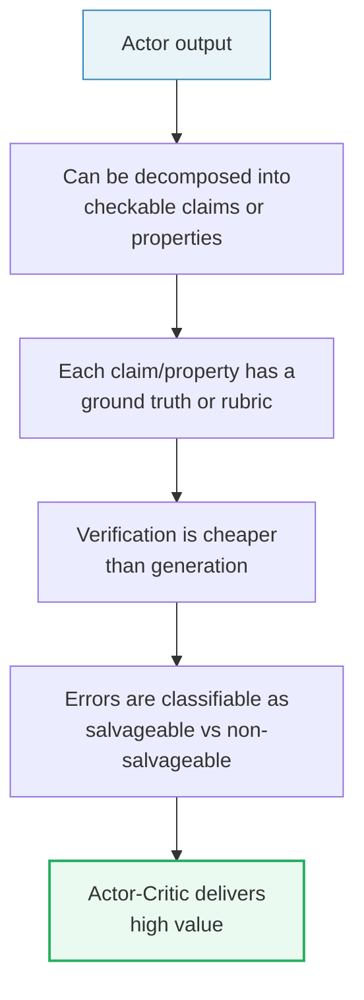

# Actor-Critic Agent Design Pattern

> A comprehensive reference for building adversarial dual-agent systems following the Actor-Critic Reinforcement Learning paradigm, where an Actor (Generator) produces outputs and a Critic (Validator) evaluates them — creating productive tension that yields higher-quality results than either agent alone.

---

## Overview

This document set describes a **generic Actor-Critic adversarial architecture** for LLM-based agentic systems. The Actor generates tool-augmented outputs (code, analysis, text) from natural language requests, while the Critic independently validates those outputs for correctness, completeness, security, and compliance. The architecture draws on concepts from reinforcement learning, game theory, and causal inference.

A **code generation** use case serves as the running example throughout: an Actor that produces code from natural language specifications, and a Critic that validates correctness, security, and style. The pattern generalizes to any domain where generation and validation benefit from adversarial separation.

---

## Documents

| # | Document | Description |
|---|---|---|
| 1 | [Architecture Overview](01_actor_critic_architecture.md) | High-level system design, static class diagrams (Core Agent, Critic Validation, Tool Execution, Infrastructure), PipelineConfig bridge pattern, configuration registry, storage architecture, environment-aware design |
| 2 | [Agentic Workflow Deep-Dive](02_actor_critic_workflow.md) | End-to-end sequence diagrams, system prompt construction, LLM interaction cycle, tool call loop mechanics, recursive self-correction flow, two-layer prompt guardrailing, session checkpointing, cost tracking, headless vs interactive execution |
| 3 | [Critic Validation System](03_critic_validation_system.md) | Validation architecture, structured output schema (code quality, security, correctness, compliance checks), salvageable vs non-salvageable errors, retry decision logic, failure pattern taxonomy, logging/observability, Critic prompt engineering |
| 4 | [Tool Calling System](04_tool_calling_system.md) | Spec + handler registration pattern, remote code execution (cloud sandbox), local static analysis, security model (4-layer defense), custom domain tools, result size management, pagination protocol, error handling patterns |
| 5 | [Guardrail Design & Causal Analysis](05_guardrail_design_and_causal_analysis.md) | Confounder problem in causal inference, three confounding flavors (task-difficulty, physical-constraint, temporal-state), guardrail taxonomy and interaction graph, SCM construction for guardrail interactions, backdoor path identification, deconfounding strategies, guardrail-aware validation architecture |
| 6 | [Adversarial Dynamics & Convergence](06_adversarial_dynamics_and_convergence.md) | Why the setup is adversarial (opposing objectives, cross-model diversity, veto power), intra-episode refinement vs inter-episode co-evolution, adversarial spectrum classification, co-evolution mechanisms (prompt augmentation, adversarial memory, parameterized state), causal inference integration (interventional best responses, counterfactual credit assignment, Causal SHAP for equilibrium verification) |
| 7 | [Limitations & Enhancements](07_limitations_and_enhancements.md) | 10 identified limitations (pass rate, instruction-following, latency, sandbox isolation, provider coupling), 10 enhancement proposals with Mermaid diagrams (graduated validation, instruction distillation, async streaming, multi-agent routing, process sandbox, cross-session memory, model-agnostic backend, observability dashboard), prioritized Gantt roadmap |
| 8 | [Causal Nash Equilibrium Convergence](08_causal_nash_equilibrium_convergence.md) | Formal game-theoretic foundations: Nash Equilibrium in MARL (Nash-Q, satisficing paths, ATMGs), confounding problem with structural causal model, four causal mechanisms for convergence (interventional best responses, game decomposition via d-separation, counterfactual credit assignment, Causal SHAP verification), complete walkthrough comparing standard MARL oscillation vs causal convergence, implementation architecture with pseudocode |

### User Input & System Prompt Construction

| Document | Description |
|---|---|
| [User Input](user_input.md) | How user input integrates with the Actor-Critic workflow — from unstructured natural language through context assembly (`PromptBuilder`), tool specifications, SQL generation, validation guardrails, and result size management. Defines the `prompts/` and `usecases/<slug>/` directory conventions for `DOMAIN_RULES.md` and `DATA_DICTIONARY.md` |

### Implementation Demos

| Demo | Stack | Description |
|---|---|---|
| [SQL Generation](sql_generation/) | LangGraph · Claude · Gemini · Vertex AI · LangSmith | Working dual-agent workflow for validated SQL query generation against the TPC-H benchmark dataset. Actor (Claude on Vertex AI Model Garden) generates SQL from natural language; Critic (Gemini on Vertex AI) validates against schema, logic, domain rules, and best practices. Includes a runnable demo notebook, 77 unit/integration tests, and three secret-management strategies (.env, hardcoded, Secret Manager). See [`sql_generation/README.md`](sql_generation/README.md) for GCP deployment and tracing instructions |

---

## Design Principles

The Actor-Critic pattern is built on five core principles:

1. **Adversarial Separation** — The Actor and Critic use different model families with different reasoning patterns, training data, and failure modes. This ensemble diversity catches errors that self-review would miss.

2. **Structured Evaluation** — The Critic returns machine-parseable JSON, not free text. This enables programmatic decision-making (pass/salvage/reject) rather than subjective judgment.

3. **Graduated Correction** — Three response tiers (pass, salvageable fix, non-salvageable feedback) route corrections to the most efficient path. Text-level fixes stay with the Critic; fundamental errors go back to the Actor for new tool calls.

4. **Causal Awareness** — Guardrails form a causal system whose interactions determine whether the adversarial loop converges. Building SCMs of guardrail interactions prevents deadlocks caused by unobserved confounders.

5. **Fail-Safe Defaults** — After exhausting correction attempts, the system presents the best available response with a warning rather than failing silently. The user always gets an answer.

--

## Use Cases & Applicability

The Actor-Critic pattern applies whenever an LLM produces an artifact that can be **independently verified against a rubric**. The key requirement is that validation must be cheaper or more reliable than generation — if the Critic is just as likely to be wrong as the Actor, the pattern adds cost without value.

### Strongly Suited — Critic Can Verify Objectively

These are the "sweet spot": the Critic has access to ground truth or deterministic checks, so its judgments are highly reliable.

| Use Case | Actor Produces | Critic Validates Against | Salvageable Example | Non-Salvageable Example |
|---|---|---|---|---|
| **SQL Generation** | SQL queries from natural language | Schema validation, query execution, result sanity | Missing WHERE clause, wrong column alias | Wrong table entirely, hallucinated column |
| **Code Generation** | Code from specifications | Syntax check, test suite, static analysis | Missing import, style violation | Wrong algorithm, hallucinated API |
| **Infrastructure-as-Code** | Terraform/CloudFormation | Plan validation, policy checks (Sentinel/OPA) | Missing tag, wrong instance size | Wrong provider, circular dependency |
| **API Request Construction** | API calls from intent | Schema validation, endpoint existence, auth check | Wrong parameter name | Fabricated endpoint |
| **Data Transformation** | ETL logic, Spark jobs | Input/output schema match, row count validation | Wrong column type cast | Wrong join key |
| **Test Generation** | Unit/integration tests | Tests compile, cover specified requirements, pass on known-good code | Missing edge case | Tests for wrong function signature |

The `sql_generation/` reference implementation in this folder is a textbook instance — the Critic can actually **execute** the SQL and verify results against expected output.

### Well Suited — Critic Can Verify with Structured Rubric

The Critic cannot run a deterministic check, but the validation criteria are well-defined enough for a structured rubric to work.

| Use Case | Actor Produces | Critic Validates Against | Key Rubric Dimensions |
|---|---|---|---|
| **Technical Documentation** | API docs, runbooks, architecture docs | Source code accuracy, completeness, formatting standards | All endpoints documented? Parameter types correct? Examples compile? |
| **Compliance Reports** | Regulatory filings, audit responses | Regulation text, policy documents | Every required section present? All claims traced to evidence? |
| **Contract/Legal Drafting** | Contract clauses, terms | Template library, legal requirements | Required clauses included? Defined terms used consistently? |
| **Incident Postmortems** | Root cause analysis, timeline | Monitoring data, logs, alert history | Timeline matches logs? Action items are SMART? |
| **Planning & Task Decomposition** | Project plans, sprint breakdowns | Requirements doc, dependency graph | All requirements covered? Dependencies realistic? No circular deps? |
| **Troubleshooting Guides** | Diagnostic steps, fix procedures | Known issue database, system architecture | Steps are actionable? Covers all listed symptoms? Fix doesn't break other components? |
| **Email/Communication Drafting** | Professional emails, executive briefs | Tone guidelines, factual accuracy against source data | Appropriate tone? All data points sourced? No speculation? |
| **RAG Response Validation** | Grounded answers from retrieved context | Citation verification, figure matching, entity consistency | All citations valid? Figures match sources? No entity confusion? |

### Moderately to Poorly Suited — Diminishing Returns

| Use Case | Suitability | Why |
|---|---|---|
| **Creative Writing / Marketing Copy** | Moderate | Critic can check brand guidelines and factual claims, but subjective quality is hard to rubric-ize; Critic may "improve" good writing into bland writing |
| **Data Analysis / Insights** | Moderate | Critic can re-run calculations and verify chart-data consistency, but interpretation and "so what" insights are subjective |
| **Translation** | Moderate | Critic can check terminology consistency and formatting, but fluency and style judgment requires near-human capability |
| **Chatbot Conversation Design** | Moderate | Critic can verify flow coverage and fallback handling, but conversational quality is subjective |
| **Open-ended brainstorming** | Poor | No objective rubric; the Critic would just be a second opinion, not a validator |
| **Summarization** (without source) | Poor | No ground truth to validate against; Critic and Actor have the same information |
| **Image/audio generation** | Poor | Verification requires perceptual judgment that text-based Critics cannot perform |

### The Structural Pattern That Makes It Work

Across all well-suited use cases, the same structure holds:

When this structure holds, the pattern delivers its highest value. When it does not — when the output is holistic, subjective, or cannot be decomposed — the Critic degrades into an expensive second opinion rather than a quality gate.

### When the Pattern Is Especially Valuable

Drawing from the convergence analysis in [Document 06](06_adversarial_dynamics_and_convergence.md) and [Document 08](08_causal_nash_equilibrium_convergence.md), the pattern is most valuable when:

1. **The cost of an undetected error is high** — executive briefings, production SQL, infrastructure configuration, compliance reports
2. **Cross-model diversity is achievable** — using different model families for Actor and Critic reduces shared blind spots
3. **The correction loop converges** — most errors are fixable in 1-2 iterations; if it takes 3+ attempts regularly, the Actor needs better prompting rather than more Critic cycles
4. **Salvageable errors dominate** — the ~55% salvageable rate observed in production (see [Document 07](07_limitations_and_enhancements.md)) means the system is operating in its ideal regime, where the Actor is directionally correct but imprecise

---

## Reading Order

For a complete understanding, read the documents in order (1 → 8). For specific topics:

- **"What can I use this pattern for?"** — [Use Cases & Applicability](#use-cases--applicability) (above)
- **"How does the Actor-Critic loop work?"** — Start with [02](02_actor_critic_workflow.md), then [03](03_critic_validation_system.md)
- **"How does user input get translated to SQL?"** — [user_input.md](user_input.md), then the [sql_generation/](sql_generation/) demo
- **"How are tools designed?"** — [04](04_tool_calling_system.md)
- **"Why do correction loops sometimes fail?"** — [05](05_guardrail_design_and_causal_analysis.md)
- **"Is this truly adversarial?"** — [06](06_adversarial_dynamics_and_convergence.md)
- **"What should I improve first?"** — [07](07_limitations_and_enhancements.md)
- **"Why does causal inference enable Nash Equilibrium convergence?"** — [08](08_causal_nash_equilibrium_convergence.md)
- **"Show me a working implementation"** — [sql_generation/](sql_generation/) with its [README](sql_generation/README.md) and [demo notebook](sql_generation/demo_sql_generation.ipynb)

---

## Diagram Reference

All diagrams use [Mermaid](https://mermaid.js.org/) syntax and render natively in GitHub, GitLab, and most Markdown editors. Diagram types used:

- **Class diagrams** — Static structure of agents, validators, tools, and infrastructure
- **Sequence diagrams** — Dynamic interaction flows (end-to-end workflow, self-correction, validation)
- **Flowcharts** — Decision logic, security model, prompt construction, guardrail analysis
- **State diagrams** — Tool call loop, oscillation mechanisms
- **Causal DAGs** — Confounding analysis, backdoor paths, deconfounding
- **Gantt charts** — Enhancement roadmap

---

*Generated: April 2026*
