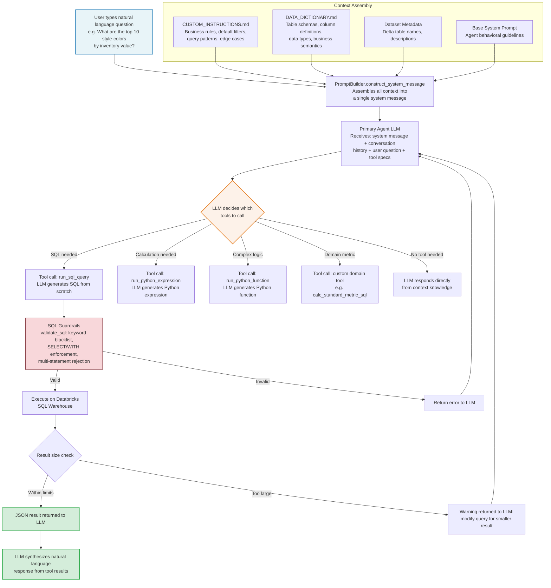

# User Input for Actor-Critic Agentic Workflow

Diagram showing how User Input integrates with the rest of the agentic workflow implementing the Actor-Critic paradygm

```mermaid
flowchart TD
    U["User types natural language question<br/>e.g. What are the top 10 style-colors<br/>by inventory value?"]

    subgraph ContextAssembly["Context Assembly"]
        CI["CUSTOM_INSTRUCTIONS.md<br/>Business rules, default filters,<br/>query patterns, edge cases"]
        DD["DATA_DICTIONARY.md<br/>Table schemas, column definitions,<br/>data types, business semantics"]
        META["Dataset Metadata<br/>Delta table names, descriptions"]
        BP["Base System Prompt<br/>Agent behavioral guidelines"]
    end

    PB["PromptBuilder.construct_system_message<br/>Assembles all context into<br/>a single system message"]

    LLM["Primary Agent LLM<br/>Receives: system message + conversation<br/>history + user question + tool specs"]

    DECIDE{"LLM decides which<br/>tools to call"}

    DECIDE -->|SQL needed| SQL_TC["Tool call: run_sql_query<br/>LLM generates SQL from scratch"]
    DECIDE -->|Calculation needed| PY_TC["Tool call: run_python_expression<br/>LLM generates Python expression"]
    DECIDE -->|Complex logic| FN_TC["Tool call: run_python_function<br/>LLM generates Python function"]
    DECIDE -->|Domain metric| CUSTOM_TC["Tool call: custom domain tool<br/>e.g. calc_standard_metric_sql"]
    DECIDE -->|No tool needed| DIRECT["LLM responds directly<br/>from context knowledge"]

    SQL_TC --> VALIDATE["SQL Guardrails<br/>validate_sql: keyword blacklist,<br/>SELECT/WITH enforcement,<br/>multi-statement rejection"]
    VALIDATE -->|Valid| EXEC["Execute on Databricks<br/>SQL Warehouse"]
    VALIDATE -->|Invalid| REJECT["Return error to LLM"]

    EXEC --> SIZE{"Result size check"}
    SIZE -->|Within limits| RESULT["JSON result returned to LLM"]
    SIZE -->|Too large| TRUNCWARN["Warning returned to LLM:<br/>modify query for smaller result"]

    RESULT --> RESPONSE["LLM synthesizes natural language<br/>response from tool results"]
    REJECT --> LLM
    TRUNCWARN --> LLM

    U --> PB
    CI --> PB
    DD --> PB
    META --> PB
    BP --> PB
    PB --> LLM
    LLM --> DECIDE

    style U fill:#e8f4f8,stroke:#2980b9,stroke-width:2px
    style DECIDE fill:#fdf2e9,stroke:#e67e22,stroke-width:2px
    style VALIDATE fill:#f8d7da,stroke:#721c24
    style RESULT fill:#d4edda,stroke:#28a745
    style RESPONSE fill:#d4edda,stroke:#28a745,stroke-width:2px
```
