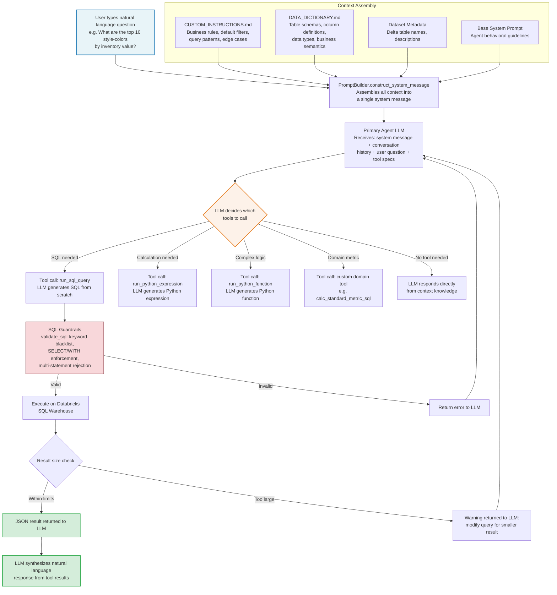

# User Input for Actor-Critic Agentic Workflow

Diagram showing how User Input integrates with the rest of the agentic workflow implementing the Actor-Critic paradygm



## Step 1: User Input — Unstructured Natural Language
The user types a free-form English question into the Streamlit chat widget. There is no schema, no required format, no keywords to include. 

**Examples**:

* _"What are the top 10 style-colors by inventory value?"_

* _"Show me the month-over-month trend for digital demand in Q4"_

* _"Compare sell-through rates across territories for running shoes"_

The raw string is captured as user_input and appended to the conversation history in OpenAI message format:

```json
{"role": "user", "content": [{"type": "text", "text": user_input}]}
```

## Step 2: System Prompt Construction — Grounding the LLM

The `PromptBuilder` assembles a system message that teaches the LLM how to map natural language concepts to specific tables, columns, and business logic. This is the critical bridging step — it gives the LLM the "vocabulary" to translate English into SQL.

```python
# utils/prompt_builder.py

def construct_system_message(custom_instructions, data_dictionary,
                             data_refresh_date, datasets, user_profile=None,
                             session_id=''):

    base_prompt_path = prompts_dir / "primary_agent_system_prompt.md"
    with open(base_prompt_path, 'r') as f:
        base_system_message = f.read()

    system_message = f"""# Instructions
{base_system_message}

## **Business Context**
{custom_instructions}

## **Data Dictionary**
{data_dictionary}

## **Metadata**
{add_dataset_metadata(datasets)}

## **Data Refresh Date**
The data was last refreshed on {data_refresh_date}.

## **Current Date & Time**
The current date and time is {current_datetime_pst}.
"""
    return system_message
```

The system message contains five injected sections:

| Section |	Source | Purpose |
| -- | -- | -- |
| Instructions |	prompts/primary_agent_system_prompt.md | Agent behavioral guidelines — how to reason, when to use tools, response formatting |
| Business Context |	usecases/<slug>/CUSTOM_INSTRUCTIONS.md | Domain-specific rules: default filters, known edge cases, business definitions |
| Data Dictionary |	usecases/<slug>/DATA_DICTIONARY.md | Table schemas, column names, data types, allowed values, data quality notes |
| Metadata |	PreProcessor.datasets |	Delta table fully-qualified names (catalog.schema.table) and descriptions |
| User Profile |	Saved user preferences	Role, territory, product focus — used to tailor responses |

The `DATA_DICTIONARY.md` is what enables the LLM to write correct SQL — it maps business concepts ("inventory value") to specific columns (`oh_qty`, `unit_cost`) and table names (catalog.schema.inventory_table).

## Step 3: Tool Specifications — What the LLM Can Call

The Agent registers tool specifications that describe the available tools in OpenAI function-calling format. The LLM reads these specs and decides autonomously which tools to invoke.

### SQL Tool Spec

```python
# utils/ai_tools.py

run_sql_toolspec = {
    "type": "function",
    "function": {
        "name": "run_sql_query",
        "description": "Run a SQL query and return the result.",
        "parameters": {
            "type": "object",
            "properties": {
                "sql_query": {
                    "type": "string",
                    "description": """
The SQL query to run.
The SQL query must return 5-20 rows of data and 7-8 columns at most.
Run multiple smaller queries if needed to get the desired data.
Outputs larger than 5000 tokens will fail gracefully.
Use ONLY SELECT statements to query data.
Use CTEs (Common Table Expressions) to structure complex queries.
Ensure that the query is well-formed and easy to read.
"""
                },
                "reason": {
                    "type": "string",
                    "description": """
The reason for running the SQL query.
Clearly explain why the function is being run, what is being calculated
and what insights are expected from it.
"""
                }
            },
            "required": ["sql_query", "reason"]
        }
    }
}
```

### Tool Wiring

The Agent class pairs each spec with a handler function:

```python
# utils/agent_helpers.py

tool_config = [
    {
        'spec': run_sql_toolspec,
        'handler': lambda args_dict: execute_sql_query(
            sql=args_dict.get('sql_query'),
            reason=args_dict.get('reason'),
            session_id=sid,
            config=self.config,
        )
    },
    {
        'spec': run_python_expression_toolspec,
        'handler': lambda args_dict: run_python_code(
            python_code=args_dict.get('python_expression'),
            reason=args_dict.get('reason'),
            files=[],
            report_function=None,
            session_id=sid,
        )
    },
    {
        'spec': run_python_function_toolspec,
        'handler': lambda args_dict: run_python_function(
            python_code=args_dict.get('function_definition'),
            reason=args_dict.get('reason'),
            files=[],
            report_function='generate_report',
            session_id=sid,
        )
    },
]

# Use-case-specific tools are appended from the preprocessor
additional_tools = self.config.additional_tool_specs
if additional_tools:
    for tool in additional_tools:
        tool_config.append(tool)
```

## Step 4: LLM Generates the SQL

The LLM receives the user's question, the full system prompt (with data dictionary and business rules), and the tool specifications. It then autonomously generates a tool_call containing the SQL it wants to execute. For example, given the question "What are the top 10 style-colors by inventory value?", the LLM might produce:

```json
{
  "id": "call_abc123",
  "type": "function",
  "function": {
    "name": "run_sql_query",
    "arguments": "{\"sql_query\": \"SELECT style_color, SUM(oh_qty * unit_cost) AS inventory_value FROM catalog.schema.inventory_table WHERE status = 'Active' GROUP BY style_color ORDER BY inventory_value DESC LIMIT 10\", \"reason\": \"Retrieving the top 10 style-colors ranked by total inventory value, using the on-hand quantity multiplied by unit cost as the value metric\"}"
  }
}
```

**Key points**:

* The LLM wrote the SQL entirely — no template, no parsing of the user's English.

* It knew to use `oh_qty * unit_cost` because the `DATA_DICTIONARY.md` defines those columns.

* It added `WHERE status = 'Active'` because `CUSTOM_INSTRUCTIONS.md` specifies default filters.

* It used `LIMIT 10` because the tool spec says "5-20 rows."

## Step 5: SQL Validation and Execution

Before reaching the Databricks SQL Warehouse, the generated SQL passes through guardrails in `SQLExecutor.validate_sql()`:

```python
# utils/sql_executor.py

def validate_sql(self, sql: str) -> Dict[str, Any]:
    sql_lower = sql.strip().lower()

    # Block multi-statement SQL (e.g. SELECT 1; DROP TABLE foo)
    sql_no_strings = re.sub(r"'[^']*'|\"[^\"]*\"", "", sql_lower)
    if ";" in sql_no_strings:
        return {"valid": False, "error": "Multi-statement SQL is not allowed"}

    # Whole-word keyword blacklist
    dangerous_keywords = [
        "drop", "delete", "truncate", "alter", "create",
        "insert", "update", "merge", "replace",
        "grant", "revoke", "call", "exec", "execute",
    ]
    for keyword in dangerous_keywords:
        if re.search(rf"\b{keyword}\b", sql_lower):
            return {"valid": False, "error": f"SQL contains forbidden keyword: {keyword.upper()}"}

    # Must start with SELECT or WITH (CTE)
    sql_no_comments = re.sub(r"(--[^\n]*|/\*.*?\*/)", "", sql_lower, flags=re.DOTALL).strip()
    if not sql_no_comments.startswith("select") and not sql_no_comments.startswith("with"):
        return {"valid": False, "error": "Only SELECT (and CTEs starting with WITH) are allowed"}

    return {"valid": True}
```
