# Building Structural Causal Models (SCMs) from Text Corpora Using Agentic Workflows

## Overview

This document extends the architecture presented in [building_causal_DAG.md](building_causal_DAG.md), which covered the construction of Causal DAGs — the qualitative skeleton of cause-and-effect relationships. Here we address the next, harder problem: constructing full **Structural Causal Models (SCMs)** — the quantitative machinery needed to answer *Why?*-type questions from Rung 3 of Pearl's causal ladder.

A Causal DAG tells us *what causes what*. An SCM tells us *how*, *how much*, and *what would have happened if things had been different*.

This document builds on two companion documents:

- [`building_causal_DAG.md`](building_causal_DAG.md) — agentic workflows for constructing causal DAGs (the qualitative skeleton)
- [`causal_inference_agentic_workflow.md`](causal_inference_agentic_workflow.md) — a ladder-aware multi-agent system that *uses* SCMs and DAGs to answer causal questions

The relationship between these three documents mirrors the causal inference pipeline itself:

```
  DAG Construction          SCM Construction          Causal Inference
  (building_causal_DAG.md)  (this document)           (causal_inference_agentic_workflow.md)
  ────────────────────────  ────────────────────────  ──────────────────────────────────────
  Qualitative structure  →  Quantitative mechanisms →  Answering causal questions
  "X causes Y"              "Y = f(X, U)"              "What if X had been different?"
  Rung 1–2 sufficient       Required for Rung 3        Uses all three rungs
```

---

## 1. Why SCMs Are Necessary Beyond Causal DAGs

An SCM $\mathcal{M} = \langle \mathbf{U}, \mathbf{V}, \mathbf{F}, P(\mathbf{U}) \rangle$ consists of four components:

| Symbol | Name | Meaning |
|--------|------|---------|
| **U** | Exogenous variables | Unobserved noise / background conditions |
| **V** | Endogenous variables | Observed variables (the nodes of the DAG) |
| **F** | Structural equations | $V_i = f_i(\text{Pa}(V_i), U_i)$ — one equation per node |
| **P(U)** | Exogenous distribution | Joint probability over background noise |

The Causal DAG — as constructed by the pipeline in `building_causal_DAG.md` — gives us the graph structure: which variables appear as parents in each equation. But the DAG alone is a *qualitative* object. The causal DAG is derivable from an SCM (it is the graph over **V** induced by the parent sets), but not vice versa — many SCMs can share the same DAG. To simulate interventions (`do`-operator) and reason about counterfactuals ("What would Y have been if X had been different?"), we need the **structural equations F** and the **exogenous distributions P(U)**.

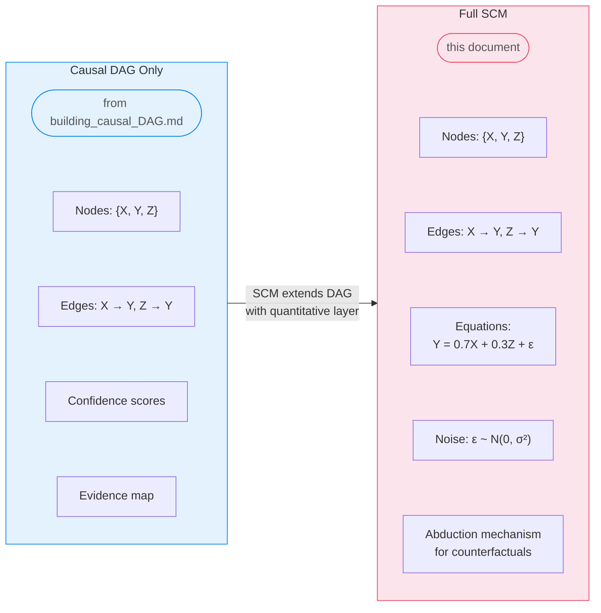

### What Each Rung Requires

Pearl's causal ladder defines three levels of causal reasoning with increasing demands on the underlying model:

| Pearl's Rung | Question Type | What It Requires | DAG Sufficient? |
|-------------|--------------|-----------------|----------------|
| **Rung 1** — Association | "What is?" P(Y\|X) | Joint distribution | ✅ With data |
| **Rung 2** — Intervention | "What if I do X?" P(Y\|do(X)) | DAG + adjustment formulae | ⚠️ Partially (needs identifiability) |
| **Rung 3** — Counterfactual | "What if X had been different?" | Full SCM (F + P(U) + abduction) | ❌ Insufficient |

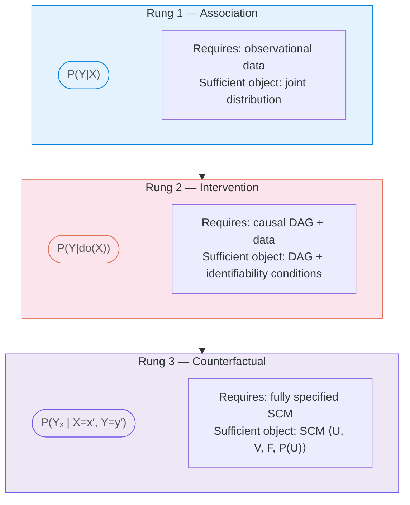

Rung 3 — the *Why?* rung — is where the DAG-only pipeline from `building_causal_DAG.md` reaches its limit. We need the full SCM.

### Why-Type Questions Need SCMs

Consider: *"Patient received treatment X=1 and outcome was Y=0. Would Y have been 1 had X been 0?"*

Answering this requires Pearl's three-step counterfactual procedure:

1. **Abduction** — Given observed (X=1, Y=0), infer the value of U (the exogenous noise) using the structural equations backwards
2. **Action** — Modify the SCM by setting X=0 (the hypothetical intervention)
3. **Prediction** — Propagate forward through the modified equations to compute Y under the counterfactual

Each step requires the functional equations **F** and the noise distribution P(**U**) — a DAG alone cannot answer this.

As noted in [`causal_inference_agentic_workflow.md`](causal_inference_agentic_workflow.md), the L3 Counterfactual Agent "requires a fully specified SCM (not just a DAG), uses the three-step abduction–action–prediction procedure, and produces unit-level counterfactual estimates. It flags when the SCM is underspecified and falls back to bounds."

---

## 2. Research Landscape

### 2.1 Foundational SCM / DSCM / NCM

#### Deep Structural Causal Models (DSCMs)

**Pawlowski, Castro, and Glocker (NeurIPS 2020)** introduced DSCMs — the first framework enabling tractable counterfactual inference across all three rungs of Pearl's hierarchy. They use normalizing flows and variational inference to model causal mechanisms as deep generative models. The critical innovation is enabling **abduction** — inferring the exogenous noise posterior $P(\mathbf{U} \mid \mathbf{X} = \mathbf{x})$ — which is the step that makes counterfactual reasoning mechanically possible. Demonstrated on Morpho-MNIST and brain MRI.

A comprehensive IJCAI 2024 survey classifies DSCMs by their deep generative component (VAEs, normalizing flows, GANs, diffusion models) and their identifiability guarantees for L3 (counterfactual) queries.

#### Neural Causal Models (NCMs)

**Xia, Lee, Bengio, and Bareinboim (NeurIPS 2021)** defined Neural Causal Models — SCMs where causal mechanisms are parameterized by feedforward neural networks. They proved NCMs are as expressive as arbitrary SCMs (L3-consistent). In a follow-up at **ICLR 2023**, Xia, Pan, and Bareinboim extended NCMs to counterfactual identification and estimation using GAN-based implementations, providing the first general counterfactual estimation technique that handles arbitrary combinations of observational and experimental data with unobserved confounders.

### 2.2 Agentic and LLM-Based Causal Systems

| System | Year | Contribution to SCM Construction | Reference |
|--------|------|----------------------------------|-----------|
| **Causal Modelling Agent (CMA)** | ICLR 2024 | Combines LLM metadata reasoning with Deep Structural Causal Models; LLM proposes initial graph, DSCM is fitted, LLM acts as critic in global/local phases; maintains memory of changes and model fit impact; demonstrated on Alzheimer's disease phenotyping | Abdulaal et al., [ICLR 2024](https://openreview.net/pdf?id=pAoqRlTBtY) |
| **SD-SCM (Sequence-Driven SCMs)** | EMNLP 2025 | Uses language models to *parameterize* SCMs: given a user-specified DAG, an LLM defines the functional mechanisms, enabling sampling from observational, interventional, and counterfactual distributions | Willig et al., [ACL Anthology](https://aclanthology.org/2025.emnlp-main.107/) |
| **Linear-LLM-SCM** | Feb 2026 | Benchmarks LLMs for coefficient elicitation in linear-Gaussian SCMs; decomposes DAGs into parent-child sets and prompts LLMs for regression-style structural equations; finds high stochasticity and sensitivity to perturbations | Yamaoka et al., [arXiv:2602.10282](https://arxiv.org/abs/2602.10282) |
| **Causal-Copilot** | Apr 2025 | Most complete autonomous causal analysis agent; automates full pipeline (preprocessing, algorithm selection, discovery, inference, counterfactual estimation) with 20+ methods; LLM-orchestrated with PDF report generation | Wang et al., [arXiv:2504.13263](https://arxiv.org/abs/2504.13263) |
| **CAIS (Causal AI Scientist)** | COLM 2025 | LLM-augmented tool for causal effect estimation with self-correction via validation feedback loops; decision-tree-based method selection | [OpenReview](https://openreview.net/forum?id=EDWTHMVOCj) |
| **ORCA** | 2025 | Orchestrating Causal Agent for relational databases; multi-agent architecture (planning, execution, discovery, inference, reporting); 7× improvement over GPT-4o mini on ATE estimation | [arXiv:2508.21304](https://arxiv.org/html/2508.21304v2) |
| **Automated Social Science** | 2024 | Uses SCMs as blueprints for LLM-agent design; automatically generates causal hypotheses and tests them through in-silico simulation | Manning et al., [arXiv:2404.11794](https://arxiv.org/abs/2404.11794) |
| **Agentic Stream of Thought (ASoT)** | 2025 | Orchestrates multiple LLMs for causal discovery via hierarchical query decomposition, dual-stream processing of competing hypotheses, and two-tiered consensus (Delphi + Ensemble Synthesis); the dual-stream pattern is transferable to SCM equation specification | ScienceDirect, 2025 |
| **Causal-Aware LLM Agents** | PHM 2025 | Dual-agent architecture: one agent constructs localized causal structures from case-based retrieval, a second simulates interventions and counterfactual effects; demonstrates the **localized SCM** pattern | Kirubanandan et al., PHM Conference 2025 |
| **Language Agents Meet Causality** | 2024 | Framework bridging LLMs and Causal World Models (CWMs); CWM acts as simulator that LLM queries, enabling causal inference and planning via MCTS over the causal model | Gou et al., [Project page](https://j0hngou.github.io/LLMCWM/) |
| **Project Ariadne** | Jan 2026 | Uses SCMs *of* LLM agents (not for building SCMs); demonstrates do-calculus interventions on reasoning traces to audit faithfulness; reveals "Causal Decoupling" failure mode | Khanzadeh, [arXiv:2601.02314](https://arxiv.org/abs/2601.02314) |

### 2.3 RAG / GraphRAG for Causal Knowledge

**CausalRAG (Wang et al., ACL Findings 2025)** — also referenced in `building_causal_DAG.md` under Paradigm 3 — integrates causal graphs into the retrieval process. While CausalRAG focuses on using causal structure for better retrieval, it demonstrates a principle critical for SCM construction: causal knowledge can be extracted, stored, and traversed in graph form, with retrieval precision improving when it follows causal pathways rather than pure semantic similarity.

**HugRAG (2025)** pushes this further with hierarchical causal knowledge graphs that explicitly organize retrieved knowledge along causal chains — a natural foundation for retrieving functional form information during equation specification.

### 2.4 Key Findings from Research

**What works:**
- LLMs can reliably identify **qualitative causal structure** (edges in a DAG) from domain knowledge (CMA, ARCADIA, `building_causal_DAG.md` workflow)
- LLMs can select appropriate **estimation methods** for causal inference given a specified model (Causal-Copilot, CAIS, ORCA)
- LLMs can parameterize SCMs when the **functional form is constrained** (e.g., linear-Gaussian) and the domain is well-represented in training data (SD-SCM)
- Multi-agent systems with **self-correction loops** significantly outperform single-pass approaches (CAIS, ORCA)
- The dual-stream debate pattern (ASoT) is promising for comparing competing functional forms

**What remains challenging:**
- **Quantitative coefficient estimation** from LLM world knowledge shows high stochasticity and sensitivity to prompt perturbations (Linear-LLM-SCM)
- **Noise distribution specification** is largely unexplored — no current system automatically determines appropriate P(U) from data + domain knowledge
- **Nonlinear functional forms** are hard for LLMs to propose reliably without strong domain priors
- **Counterfactual validation** (checking that an SCM produces sensible counterfactuals) has no established automated benchmark
- **Text-to-equation** extraction ("X has a logarithmic effect on Y with saturation around X=100") requires a fundamentally different capability than qualitative causal extraction and has not been systematically evaluated

### 2.5 The Gap: No End-to-End SCM Construction Workflow Exists

As of early 2026, **no published system provides a fully agentic end-to-end SCM construction pipeline from text**. The closest works are:

- **CMA** (ICLR 2024): iterates between LLM and DSCM but requires pre-specified variable sets and structured data
- **SD-SCM** (EMNLP 2025): parameterizes SCMs using LLMs, but requires the DAG to be user-specified and does not validate the resulting SCM against observational data
- **Causal-Copilot** (2025): automates the full inference pipeline but treats SCM as downstream, not as a construction target
- The DAG pipeline pattern from `building_causal_DAG.md` — solves the qualitative half of the problem

The gap is in connecting **LLM-driven knowledge extraction** (the strength of the DAG pipeline) with **automated structural equation specification and neural mechanism training** in a single orchestrated workflow.

---

## 3. How SCM Construction Differs from DAG Construction

The DAG pipeline from `building_causal_DAG.md` outputs a validated directed acyclic graph with confidence scores and an evidence map. The SCM pipeline starts where that pipeline ends — but introduces fundamentally different challenges.

### 3.1 Side-by-Side Comparison

| Dimension | DAG Pipeline (`building_causal_DAG.md`) | SCM Pipeline (this document) |
|-----------|----------------------------------------|------------------------------|
| **Core output** | Directed graph (nodes + edges + confidence) | Graph + structural equations + noise distributions |
| **Knowledge type** | Qualitative: "X causes Y" (confidence: 0.85) | Quantitative: "Y = 0.7X + 0.3Z + ε, ε ~ N(0, 0.4)" |
| **Data requirements** | Can work from text alone (Paradigm 1 in DAG doc) | Requires observational data to fit equations; text alone is insufficient |
| **Agent count** | 6 agents (Ingester → Variable Extractor → Causal Extractor → DAG Assembler → Validator → Reporter) | 6 DAG agents + 4–5 new SCM-specific agents |
| **Validation target** | Structural (acyclicity, connectivity, degree bounds) + Semantic (transitivity, domain coherence, evidence coverage) | All DAG checks + model fit (AIC/BIC), intervention prediction, counterfactual plausibility |
| **Iteration loop** | Refine edges and orientations | Refine edges + functional forms + noise distributions |
| **Memory schema** | `CausalDAGState` (edges, confidence, evidence map) | `CausalDAGState` + equations, parameters, exogenous distributions, abduction models, fit history |
| **Primary LLM role** | Edge extraction, orientation, validation | Additionally: functional form proposal, parameter initialization guidance, counterfactual interpretation |
| **RAG usage** | Retrieve evidence for edge existence | Additionally: retrieve domain-specific functional forms, known equations, mechanism types, parameter priors |
| **Identifiability concern** | Markov equivalence class (multiple DAGs fit same data) | L3-identifiability (can counterfactuals be uniquely determined?) |
| **Sufficient for** | Rung 1 (association), Rung 2 (intervention, if identified) | Rung 1, 2, and 3 (counterfactuals) |

### 3.2 The Three Additional Challenges for SCM

The DAG pipeline in `building_causal_DAG.md` solves the *graph structure* problem. SCM construction adds three challenges that the DAG pipeline does not face:

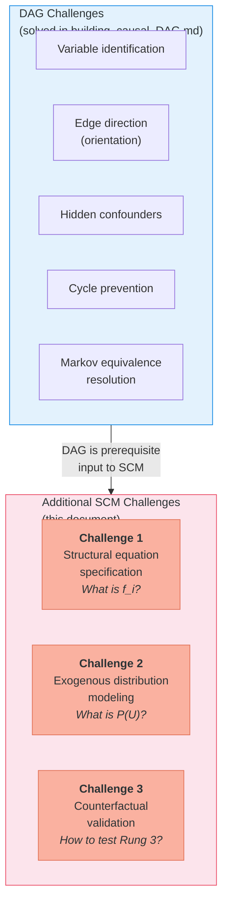

**Challenge 1 — Structural Equation Specification**: For every edge $X_i \to X_j$ in the DAG, the SCM requires a concrete function $X_j = f_j(\text{Pa}(X_j), U_j)$. This could be linear, polynomial, sigmoidal, threshold, or a neural network. The DAG pipeline only needed to determine *whether* an edge exists; the SCM pipeline must determine *how that edge works quantitatively*.

**Challenge 2 — Exogenous Distribution Modeling**: Each structural equation has a noise term $U_i$ with a specific distribution. For counterfactual reasoning, we need to perform *abduction* — inferring the individual-specific noise $P(U_i \mid \text{observed data})$. This requires either invertible mechanisms (normalizing flows) for exact abduction or amortized variational inference for approximation.

**Challenge 3 — Counterfactual Validation**: The DAG pipeline (per `building_causal_DAG.md`) validates against structural checks (acyclicity), semantic checks (domain coherence), and optionally statistical checks (conditional independence). But counterfactual predictions concern *unobservable* alternate worlds — we can never directly observe what *would have* happened. This makes validation fundamentally harder than anything in the DAG pipeline.

### 3.3 How the DAG State Schema Extends to SCM

The `building_causal_DAG.md` document defines a `CausalDAGState` for LangGraph:

```python
# From building_causal_DAG.md — DAG state
class CausalDAGState(TypedDict):
    corpus_chunks: list[str]
    embeddings_indexed: bool
    candidate_nodes: list[str]
    extracted_edges: list[dict]       # {source, target, confidence, evidence}
    dag: nx.DiGraph
    iteration: int
    max_iterations: int
    validation_log: list[dict]
    confidence_scores: dict[str, float]
    evidence_map: dict[str, list[str]]
```

The SCM state *wraps and extends* this:

```python
# SCM state — extends CausalDAGState
class SCMState(TypedDict):
    # ── Inherited from CausalDAGState ──────────────────────
    corpus_chunks: list[str]
    embeddings_indexed: bool
    candidate_nodes: list[str]
    extracted_edges: list[dict]
    dag: nx.DiGraph
    dag_iteration: int
    dag_max_iterations: int
    dag_validation_log: list[dict]
    confidence_scores: dict[str, float]
    evidence_map: dict[str, list[str]]

    # ── New: Structural Equations ──────────────────────────
    structural_equations: dict[str, dict]  # node → {form, params, fitted}
    # e.g. {"Y": {"form": "linear", "params": {"β_X": 0.7, "β_Z": 0.3},
    #              "fitted": True, "r_squared": 0.82}}
    candidate_forms: dict[str, list[str]]  # node → candidate functional forms
    equation_fit_scores: dict[str, float]  # node → AIC/BIC score

    # ── New: Exogenous Variables ───────────────────────────
    exogenous_distributions: dict[str, dict]  # node → {dist_type, params}
    # e.g. {"Y": {"dist_type": "normal", "params": {"mu": 0, "sigma": 0.4}}}
    abduction_models: dict[str, Any]  # node → trained encoder / inverse

    # ── New: SCM-Specific Validation ───────────────────────
    scm_iteration: int
    scm_max_iterations: int
    model_fit_history: list[dict]     # fit metric trajectory
    intervention_tests: list[dict]    # predicted vs actual intervention results
    counterfactual_log: list[dict]    # counterfactual queries + results
    sensitivity_report: dict          # sensitivity to form misspecification
    observational_data: Any           # DataFrame or path to data
```

---

## 4. Proposed Architecture: Agentic SCM Builder

### 4.1 Design Principles

1. **DAG-first, then quantify**: First build the DAG (using the workflow from [`building_causal_DAG.md`](building_causal_DAG.md)), then extend it to a full SCM
2. **RAG-grounded functional form selection**: Use retrieval over domain literature to propose functional forms, not just LLM parametric knowledge
3. **Data-driven parameter estimation**: Use statistical methods (not LLM guesses) for coefficient estimation whenever data is available
4. **Iterative validation with counterfactual consistency checks**: Validate the SCM not just on fit, but on whether its counterfactual predictions are coherent
5. **Graceful degradation**: If full SCM specification fails, report what *can* be specified and provide bounds for what cannot (mirroring the degradation strategy in [`causal_inference_agentic_workflow.md`](causal_inference_agentic_workflow.md))
6. **Hybrid mechanism spectrum**: Allow parametric, semi-parametric, and neural mechanisms per edge, guided by domain knowledge retrieval

### 4.2 Three-Stage Architecture

The architecture uses the DAG pipeline from `building_causal_DAG.md` as **Stage 1** — producing a validated Causal DAG — then hands that DAG to the SCM-specific agents in **Stage 2**. A third **Stage 3** handles validation, intervention simulation, and counterfactual reasoning.

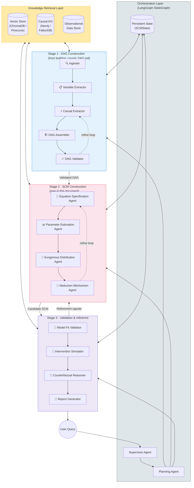

### 4.3 Agent Roster

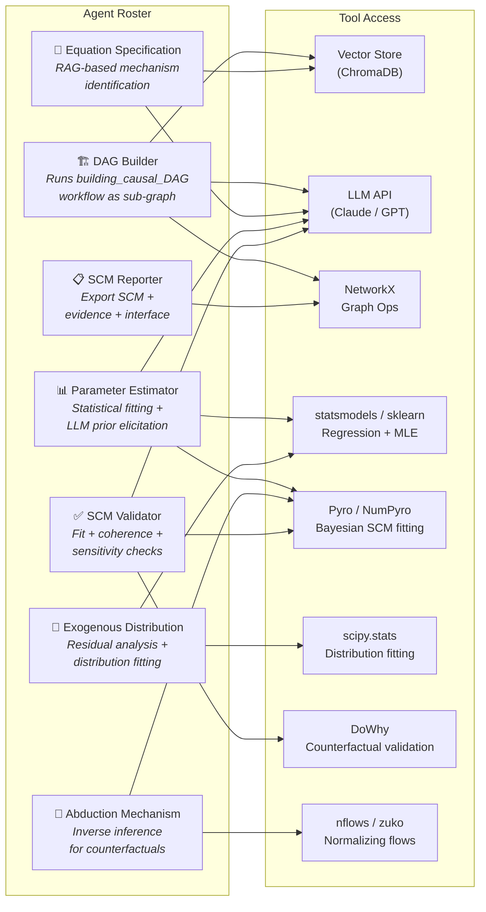

---

## 5. Stage 2 Agent Specifications

### 5.1 Equation Specification Agent

This is the most novel and challenging agent — nothing in the DAG pipeline has an equivalent. The DAG pipeline's **Causal Extractor** (agent ③ in `building_causal_DAG.md`) asks "Does X cause Y?" and outputs a confidence score. The Equation Specification Agent asks the harder question: "How does X affect Y, quantitatively?"

**Strategy: Retrieve → Propose → Compete → Select**

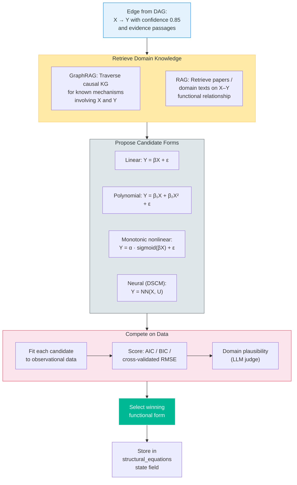

**RAG strategy for functional form selection:**

The agent uses a domain-specific vector store (the same corpus used for DAG construction, plus supplementary scientific literature) to retrieve evidence about mechanisms. For example:

- Query: *"What is the functional relationship between smoking intensity and lung cancer risk?"*
- Retrieved passage: *"The dose-response relationship between pack-years and lung cancer follows a log-linear pattern with an estimated coefficient of..."*
- Proposed form: `cancer_risk = β₀ + β₁·log(pack_years) + β₂·age + U`

When no mechanistic evidence is available, the agent defaults to **additive linear models** (the most common assumption in applied causal inference) and flags the equation for sensitivity analysis.

### 5.2 Parameter Estimation Agent

Fits parameters for the chosen functional forms:

| Functional Form | Data Available | Estimation Method |
|---|---|---|
| Linear, Gaussian noise | Yes | OLS via `statsmodels` |
| Linear, non-Gaussian | Yes | IV / 2SLS if instruments available; MLE otherwise |
| Nonlinear parametric | Yes | Nonlinear least squares or MLE |
| Semi-parametric | Yes | `PyGAM` (generalized additive models) |
| Neural mechanism | Yes | PyTorch / Pyro training loops |
| Any form | No data | LLM prior elicitation + literature-based ranges |
| Any form, Bayesian | Yes (small sample) | MCMC via Pyro/NumPyro with informative priors |

**LLM prior elicitation** (when data is unavailable) follows the approach benchmarked by Linear-LLM-SCM (Yamaoka et al., 2026): the agent decomposes the DAG into parent-child sets, prompts the LLM for coefficient magnitudes, and runs multiple prompts to estimate variance. However, following their findings about high stochasticity, the agent:
- Runs N=20+ independent elicitations and reports the distribution of estimates
- Always flags LLM-elicited parameters with high uncertainty
- Treats these as **informative priors** for Bayesian estimation when even small amounts of data become available

### 5.3 Exogenous Distribution Agent

Models the noise distribution $P(U_i)$ for each structural equation:

1. Compute residuals from fitted equations
2. Test distributional assumptions (normality, heavy tails, multimodality)
3. Fit candidate distributions (Normal, Student-t, mixture of Gaussians, etc.) using `scipy.stats`
4. For DSCM approaches: learn exogenous distributions implicitly through normalizing flows
5. Check independence between exogenous variables (Markovian assumption)
6. Report the best-fitting noise family and parameters for each equation

### 5.4 Abduction Mechanism Agent

Builds the machinery needed for Pearl's three-step counterfactual procedure:

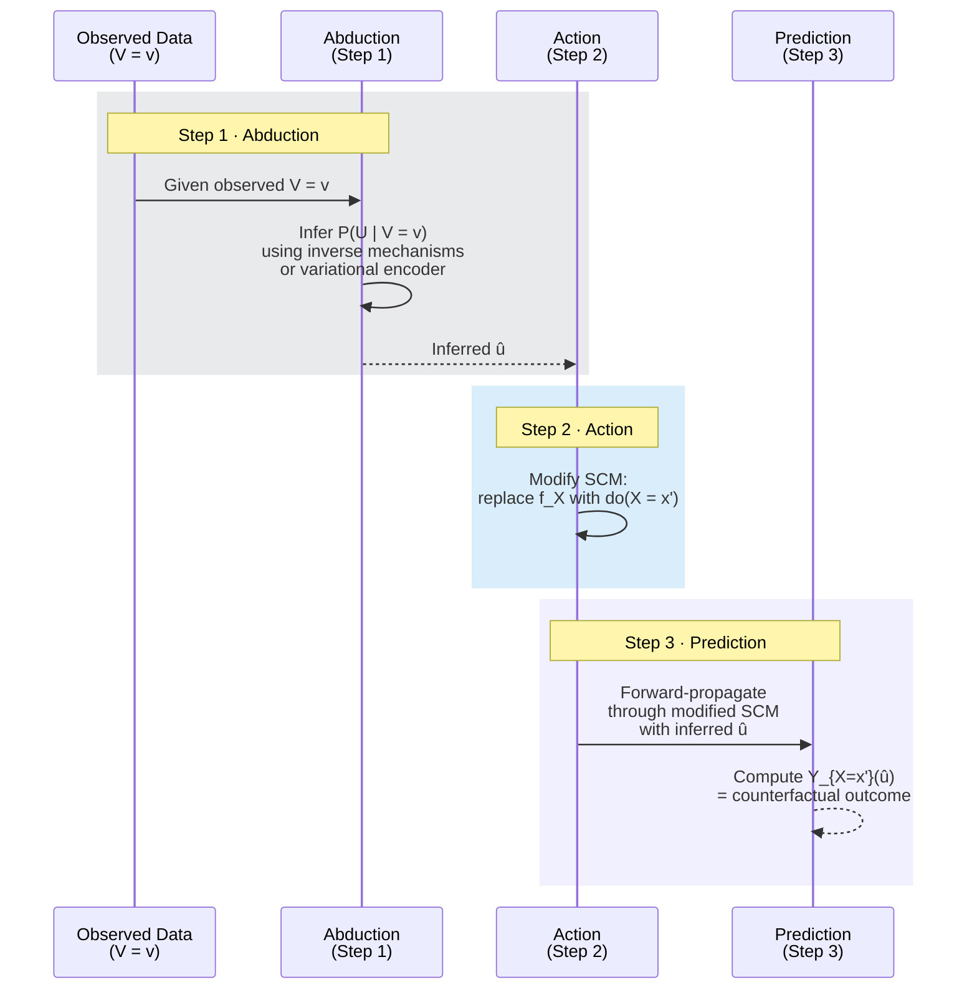

The agent selects the abduction approach per variable:

| Mechanism Type | Abduction Method | Exactness | When to Use |
|---------------|-----------------|-----------|-------------|
| Invertible (normalizing flow) | Direct inverse | Exact | When invertibility is achievable |
| Non-invertible parametric | Algebraic solve for U given V and parents | Exact (if solvable) | Simple functional forms |
| Non-invertible neural | Amortized variational encoder | Approximate | Complex, high-dimensional mechanisms |
| GAN-based (NCM-style) | Adversarial posterior estimation | Approximate | When unobserved confounders exist |

---

## 6. Role of RAG and GraphRAG: DAG vs. SCM

The DAG pipeline in `building_causal_DAG.md` uses RAG in one primary mode: **edge evidence retrieval** — the Causal Extractor agent retrieves relevant chunks for each variable pair and asks the LLM to assess the causal relationship. The SCM pipeline adds three new retrieval modes:

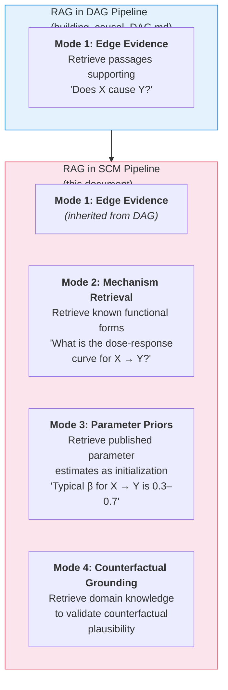

### Why GraphRAG for SCMs?

Functional form selection requires understanding not just individual edges but **causal pathways**. The mechanism between X and Y may be mediated by Z, and the functional form of the X → Y relationship may depend on understanding the X → Z → Y pathway. Standard RAG retrieves by semantic similarity to a query; GraphRAG traverses the causal DAG structure to identify relevant multi-hop evidence.

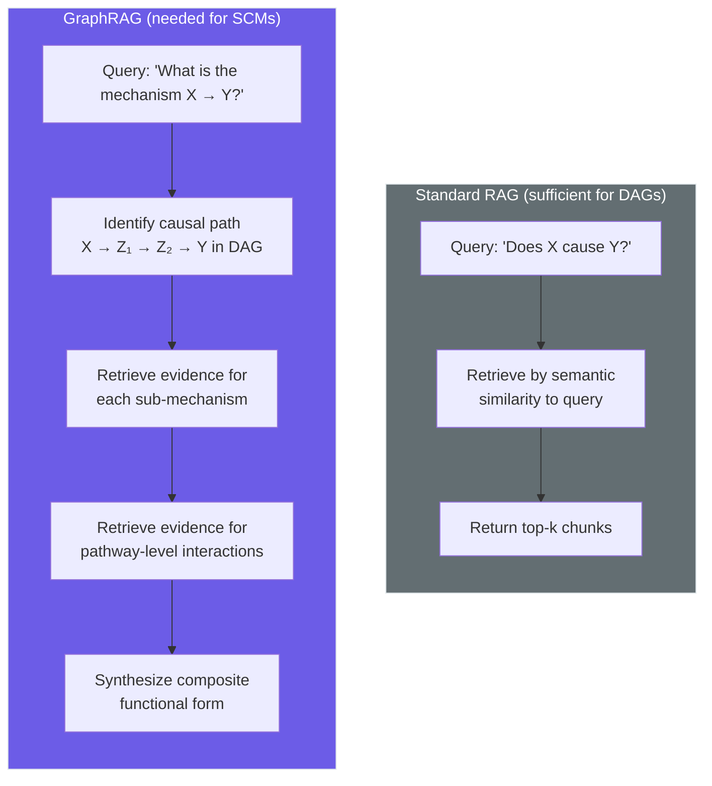

### GraphRAG Architecture for SCM Construction

The causal DAG itself serves as the knowledge graph backbone for GraphRAG:

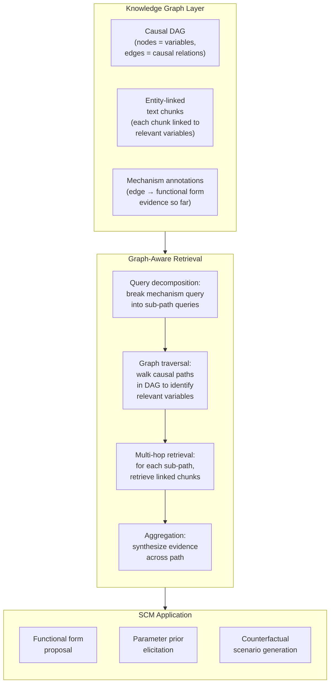

This approach directly extends the CausalRAG framework (ACL 2025 Findings) from retrieval-augmented question answering to retrieval-augmented model construction. For example, understanding that "insulin → β-cell function → glucose regulation" follows a Hill equation requires traversing the causal knowledge graph to find the intermediate mechanism, then retrieving pharmacokinetic literature on that specific pathway — multi-hop reasoning well beyond the single-hop retrieval sufficient for edge-existence queries in the DAG pipeline.

---

## 7. The Hybrid Approach: Parametric + Neural Mechanisms

A practical SCM builder should not commit to a single mechanism type. The Equation Specification Agent should deploy a spectrum, guided by RAG-retrieved domain knowledge:

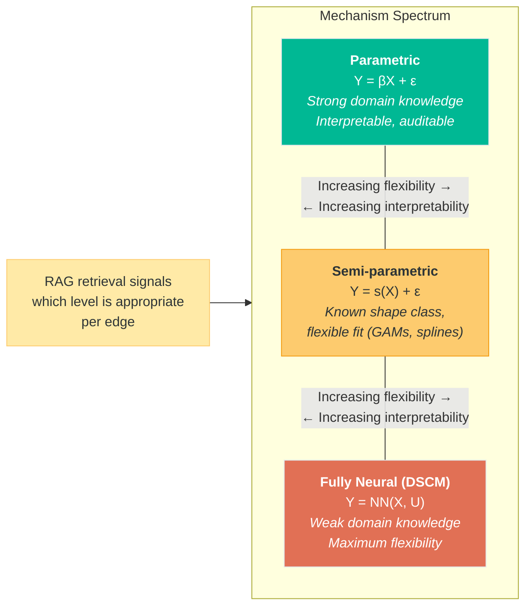

The decision is data- and knowledge-driven per edge: if RAG retrieves well-established functional forms from domain literature, use parametric; if the relationship is known to be nonlinear but the exact form is uncertain, use semi-parametric; if the mechanism is poorly understood, fall back to neural.

---

## 8. Validation: Extending the DAG Validator

The `building_causal_DAG.md` document specifies three tiers of validation checks — Structural, Semantic, and Statistical (optional). The SCM validator inherits all three tiers, expands the Statistical tier substantially, and adds a fourth tier:

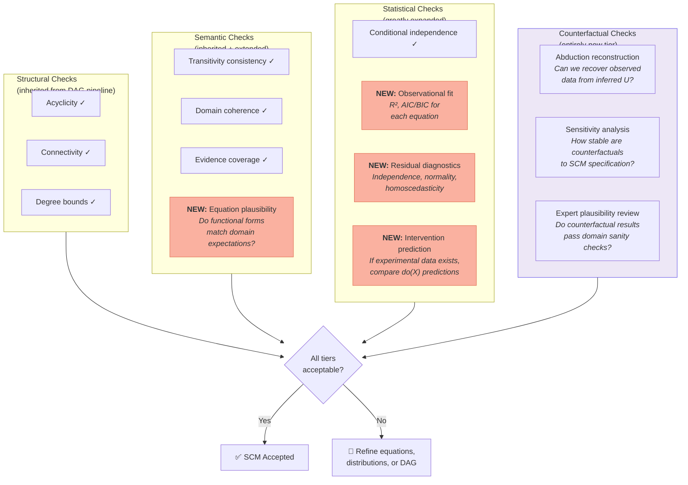

**Counterfactual coherence checks** are novel to SCM validation and have no counterpart in DAG validation. They verify that the SCM produces sensible counterfactual predictions — e.g., that intervening to increase a beneficial treatment does not decrease the outcome, that predictions stay within physically plausible bounds, and that the consistency axiom (Yₓ = Y when X = x) holds.

---

## 9. LangGraph Control Flow

### 9.1 Graph Topology

Extending the control flow from `building_causal_DAG.md` — which routes from `validate_dag` back to `extract_causal_relations` when issues are found — the SCM pipeline adds a second refinement loop over the quantitative layer:

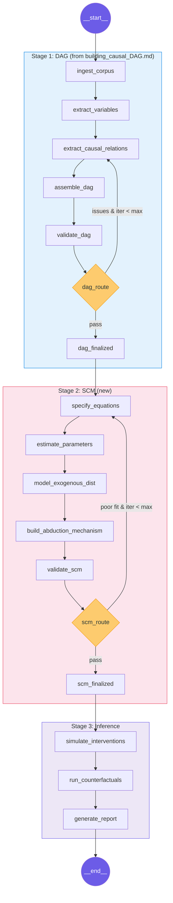

### 9.2 Implementation Skeleton

```python
from langgraph.graph import StateGraph, END

def route_after_validation(state: SCMState) -> str:
    if state["scm_iteration"] >= state["scm_max_iterations"]:
        return "report"
    log = state["dag_validation_log"][-1] if state["dag_validation_log"] else {}
    scm_log = state["model_fit_history"][-1] if state["model_fit_history"] else {}
    if scm_log.get("structural_issues"):
        return "dag_build"
    if scm_log.get("form_issues"):
        return "specify_eqs"
    if scm_log.get("fit_issues"):
        return "estimate_params"
    return "report"

builder = StateGraph(SCMState)

# Stage 1: DAG (sub-graph)
builder.add_node("dag_build", dag_construction_subgraph)

# Stage 2: SCM
builder.add_node("specify_eqs", equation_specification_agent)
builder.add_node("estimate_params", parameter_estimation_agent)
builder.add_node("model_exogenous", exogenous_distribution_agent)
builder.add_node("build_abduction", abduction_mechanism_agent)
builder.add_node("validate_scm", scm_validation_agent)

# Stage 3: Inference & Reporting
builder.add_node("simulate_interventions", intervention_simulator)
builder.add_node("run_counterfactuals", counterfactual_reasoner)
builder.add_node("report", scm_report_agent)

builder.set_entry_point("dag_build")
builder.add_edge("dag_build", "specify_eqs")
builder.add_edge("specify_eqs", "estimate_params")
builder.add_edge("estimate_params", "model_exogenous")
builder.add_edge("model_exogenous", "build_abduction")
builder.add_edge("build_abduction", "validate_scm")
builder.add_conditional_edges("validate_scm", route_after_validation, {
    "dag_build": "dag_build",
    "specify_eqs": "specify_eqs",
    "estimate_params": "estimate_params",
    "report": "simulate_interventions",
})
builder.add_edge("simulate_interventions", "run_counterfactuals")
builder.add_edge("run_counterfactuals", "report")
builder.add_edge("report", END)

scm_workflow = builder.compile()
```

---

## 10. Integration with the Causal Inference Workflow

The SCM produced by this workflow is designed to be consumed by the L3 Counterfactual Agent described in [`causal_inference_agentic_workflow.md`](causal_inference_agentic_workflow.md). The integration point is the **Shared Context Store**:

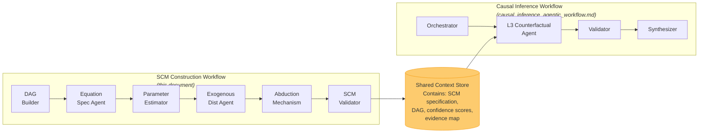

When the Causal Inference Orchestrator classifies a question as L3 (counterfactual), it checks the Shared Context Store for a fully specified SCM. If one is available (built by this workflow), the L3 Agent uses it for the abduction–action–prediction procedure. If not, the system either triggers this SCM construction workflow or degrades to L2 with bounds, as described in the graceful degradation strategy in `causal_inference_agentic_workflow.md`.

---

## 11. Connecting to the Iterative RL Loop

The `building_causal_DAG.md` document includes an advanced section on an **Iterative Causal-Aware RL Loop** where the SCM is used to generate interventional experiments that refine the DAG. The SCM pipeline proposed here provides the quantitative substrate that makes this loop operational:

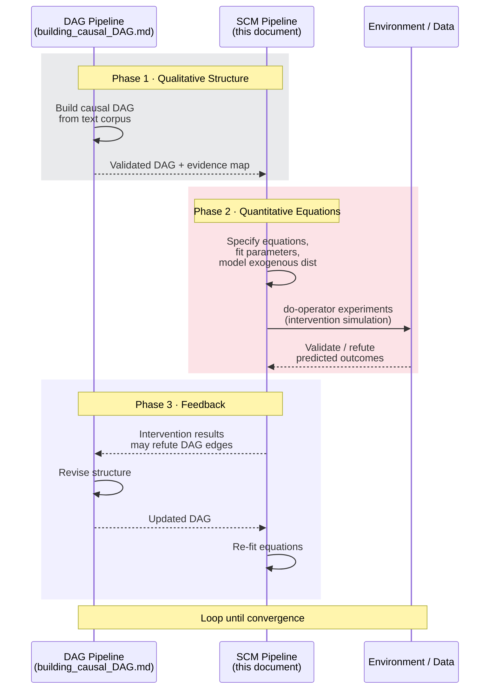

The DAG pipeline from `building_causal_DAG.md` described this loop conceptually using an LLM Agent ↔ Environment ↔ SCM sequence diagram. The SCM pipeline makes the **Adapting Phase** concrete — the SCM now has actual structural equations that generate testable interventional predictions, which either confirm or refute the DAG structure.

---

## 12. Open Challenges and Research Gaps

### 12.1 No End-to-End Agentic SCM Builder Exists

As of early 2026, no published system provides a fully agentic end-to-end SCM construction pipeline from text. The gap is in connecting LLM-driven knowledge extraction (the strength of the DAG pipeline) with automated structural equation specification and neural mechanism training in a single orchestrated workflow.

### 12.2 The Functional Form Bottleneck

The central challenge. Unlike DAG construction where the question is binary ("does this edge exist?"), functional form selection is an open-ended modeling choice:

- **LLMs default to linearity.** Linear-LLM-SCM (2026) shows that even when explicitly prompted, LLMs overwhelmingly propose linear relationships. Nonlinear forms require strong domain-specific evidence.
- **Misspecification compounds.** Errors in functional forms propagate through the SCM and amplify in counterfactual predictions. A wrong functional form for one equation can invalidate counterfactuals for all downstream variables.
- **No ground truth for validation.** Unlike DAG edges (which can be checked against conditional independence tests), functional forms cannot be validated purely from observational data without strong parametric assumptions.

### 12.3 The Noise Distribution Problem

Noise specification is the least-studied component:

- **Non-Gaussian noise breaks standard counterfactual procedures.** Most textbook SCM examples assume Gaussian noise, but real-world data often has heavy tails, skewness, or multimodality.
- **Correlated noise across equations** (shared unobserved confounders) violates the standard SCM factorization and requires latent variable models, which are much harder to specify and estimate.
- **The choice of noise distribution affects counterfactual identifiability.** Two SCMs with identical DAGs and functional forms but different noise distributions can produce different counterfactual predictions.

### 12.4 Counterfactual Validation Remains Fundamentally Hard

Counterfactual outcomes are never directly observed. The IJCAI 2024 DSCM survey underscores that the field lacks standardized benchmarks for counterfactual accuracy beyond synthetic datasets with known ground truth. Production systems will need to rely heavily on sensitivity analysis and domain expert review.

### 12.5 Text-to-Equation Is a Frontier Problem

The DAG pipeline from `building_causal_DAG.md` works with qualitative causal language ("X causes Y", "increasing X leads to Y"). Extracting *quantitative functional forms* from text ("X has a logarithmic effect on Y with saturation around X=100") requires a fundamentally different extraction capability that LLMs may possess but has not been systematically evaluated.

### 12.6 Scalability

The SCM construction workflow is substantially more expensive than DAG construction:

| Step | DAG Construction | SCM Construction |
|---|---|---|
| Variable extraction | O(n) LLM calls | Same (inherited) |
| Edge determination | O(n²) LLM calls | Same (inherited) |
| Functional form selection | N/A | O(m) RAG + LLM calls (m = number of edges) |
| Parameter estimation | N/A | O(m) statistical fits |
| Noise specification | N/A | O(n) distribution fits |
| Abduction mechanism training | N/A | O(n) model fits (expensive if neural) |
| Validation per iteration | O(n²) CI tests | All DAG checks + O(n) goodness-of-fit + O(k) counterfactual coherence |

Current DSCM and NCM implementations work on relatively small graphs (3–10 variables). The DAG pipeline already notes fragility beyond ~15 variables for direct extraction. SCM construction compounds this — each additional variable adds an equation, a noise model, and an abduction mechanism.

---

## 13. Tools & Stack Recommendations

Extending the stack table from `building_causal_DAG.md`:

| Component | DAG Pipeline (from DAG doc) | Additional for SCM |
|-----------|---------------------------|-------------------|
| **Orchestration** | LangGraph + LangSmith | Same (extended state schema) |
| **Graph Backend** | NetworkX → Neo4j | Same + equation metadata per edge/node |
| **Vector Store** | ChromaDB → Pinecone | Same (additional indexing for mechanism literature) |
| **LLM** | Claude Sonnet (extraction) + Opus (validation) | + Opus for equation specification & counterfactual reasoning |
| **Statistical CD** | `causal-learn` (PC, GES) | `DoWhy`, `EconML`, `CausalPy` |
| **Deep SCM training** | — | PyTorch, Pyro, `nflows`, `zuko` |
| **Parameter estimation** | — | `scipy.optimize`, `statsmodels`, `PyGAM` |
| **Tracking** | MLflow + LangSmith | Same (+ model fit metrics tracking) |
| **Visualization** | Graphviz / pyvis | + equation rendering, counterfactual plots |

---

## 14. Summary: From DAG to SCM to Causal Inference

```mermaid
flowchart LR
    subgraph DAG_Doc["building_causal_DAG.md"]
        D_IN["Text Corpus"] --> D_PIPE["6-Agent DAG Pipeline<br/>(Ingest → Extract → Assemble<br/>→ Validate → Report)"]
        D_PIPE --> D_OUT["Validated Causal DAG<br/>+ confidence scores<br/>+ evidence map"]
    end

    subgraph SCM_Doc["building_SCM.md<br/>(this document)"]
        S_IN["Validated DAG<br/>+ Observational Data"] --> S_PIPE["4-Agent SCM Pipeline<br/>(Equations → Parameters<br/>→ Exogenous → Abduction)"]
        S_PIPE --> S_VAL["3-Agent Validation<br/>(Fit → Intervention<br/>→ Counterfactual)"]
        S_VAL --> S_OUT["Full SCM<br/>capable of answering<br/>'Why?' questions<br/>(Pearl's Rung 3)"]
    end

    subgraph Inference_Doc["causal_inference_agentic_workflow.md"]
        direction TB
        U1["L1: Association<br/><i>needs data</i>"]
        U2["L2: Intervention<br/><i>needs DAG</i>"]
        U3["L3: Counterfactual<br/><i>needs SCM</i>"]
    end

    D_OUT -->|"DAG is prerequisite<br/>input to SCM"| S_IN
    S_OUT -->|"SCM consumed by<br/>L3 Agent"| Inference_Doc

    style DAG_Doc fill:#e3f2fd,stroke:#0984e3,color:#2d3436
    style SCM_Doc fill:#fce4ec,stroke:#e94560,color:#2d3436
    style Inference_Doc fill:#ede7f6,stroke:#6c5ce7,color:#2d3436
    style D_OUT fill:#74b9ff,stroke:#0984e3,color:#2d3436
    style S_OUT fill:#ff7675,stroke:#e94560,color:#fff
```

The three documents together describe a **complete path from raw text to counterfactual reasoning**: `building_causal_DAG.md` handles the qualitative structure (Rungs 1–2), this document handles the quantitative machinery (Rung 3), and `causal_inference_agentic_workflow.md` provides the ladder-aware agent system that answers user questions at any rung. The architecture is modular — the DAG pipeline can run independently, the SCM pipeline consumes its output, and the inference workflow consumes either — preserving the separation of concerns that makes agentic systems debuggable and iterable.

---

## References

### Foundational SCM / DSCM / NCM

- Pawlowski, N., Castro, D. C., & Glocker, B. (2020). Deep Structural Causal Models for Tractable Counterfactual Inference. *NeurIPS 2020*. [arXiv:2006.06485](https://arxiv.org/abs/2006.06485)
- Xia, K., Lee, K.-Z., Bengio, Y., & Bareinboim, E. (2021). The Causal-Neural Connection: Expressiveness, Learnability, and Inference. *NeurIPS 2021*.
- Xia, K., Pan, Y., & Bareinboim, E. (2023). Neural Causal Models for Counterfactual Identification and Estimation. *ICLR 2023*. [arXiv:2210.00035](https://arxiv.org/abs/2210.00035)
- DSCM Survey — Learning Structural Causal Models through Deep Generative Models: Methods, Guarantees, and Challenges. *IJCAI 2024*. [Proceedings](https://www.ijcai.org/proceedings/2024/0907.pdf)
- Pearl, J. (2009). *Causality: Models, Reasoning and Inference* (2nd ed.). Cambridge University Press.
- Bareinboim, E. et al. (2022). On Pearl's Hierarchy and the Foundations of Causal Inference. *ACM*.

### SCM Construction and Parameterization

- **Causal Modelling Agents (CMA)**: Abdulaal et al. (ICLR 2024) — "Causal Graph Discovery through Synergising Metadata- and Data-driven Reasoning" — [OpenReview](https://openreview.net/pdf?id=pAoqRlTBtY)
- **SD-SCM**: Willig et al. (EMNLP 2025) — "Language Models as Causal Effect Generators" — [ACL Anthology](https://aclanthology.org/2025.emnlp-main.107/)
- **Linear-LLM-SCM**: Yamaoka et al. (Feb 2026) — "Benchmarking LLMs for Coefficient Elicitation in Linear-Gaussian Causal Models" — [arXiv:2602.10282](https://arxiv.org/abs/2602.10282)
- **Automated Social Science**: Manning et al. (2024) — "Using SCMs as Blueprints for LLM-Agent Design" — [arXiv:2404.11794](https://arxiv.org/abs/2404.11794)

### Agentic Causal Analysis Systems

- **Causal-Copilot**: Wang et al. (Apr 2025) — "An Autonomous Causal Analysis Agent" — [arXiv:2504.13263](https://arxiv.org/abs/2504.13263)
- **CAIS**: (COLM 2025) — "Causal AI Scientist: Facilitating Causal Data Science with Large Language Models" — [OpenReview](https://openreview.net/forum?id=EDWTHMVOCj)
- **ORCA**: (2025) — "ORchestrating Causal Agent" — [arXiv:2508.21304](https://arxiv.org/html/2508.21304v2)
- Han, K. et al. (2024). Causal Agent based on Large Language Model. [arXiv:2408.06849](https://arxiv.org/abs/2408.06849v1)
- ASoT — Structured Knowledge-Based Causal Discovery: Agentic Streams of Thought. *ScienceDirect*, 2025.
- Causal MAS Survey — A Survey of Large Language Model Multi-Agent Systems for Causal Inference. *arXiv:2509.00987* (2025).
- Kirubanandan, R. et al. (2025). Causal-Aware LLM Agents for PHM Co-Pilots. *PHM Conference 2025*.

### SCMs Applied to LLM Agents

- **Project Ariadne**: Khanzadeh (Jan 2026) — "A Structural Causal Framework for Auditing Faithfulness in LLM Agents" — [arXiv:2601.02314](https://arxiv.org/abs/2601.02314)

### LLM + Causality Integration

- Gou, J. et al. (2024). Language Agents Meet Causality — Bridging LLMs and Causal World Models. [Project](https://j0hngou.github.io/LLMCWM/)
- Du, H. et al. (2025). Causal Discovery through Synergizing LLM and Data-Driven Reasoning (LLM-CD). *KDD 2025*.
- IJCAI 2025 Survey — Large Language Models for Causal Discovery: Current Landscape and Future Directions. [arXiv:2402.11068](https://arxiv.org/abs/2402.11068)

### RAG / GraphRAG for Causal Knowledge

- **CausalRAG**: Wang, N. et al. (2025) — "Integrating Causal Graphs into Retrieval-Augmented Generation" — *ACL Findings 2025*. [ACL Anthology](https://aclanthology.org/2025.findings-acl.1165/)
- HugRAG — Hierarchical Causal Knowledge Graph Design for RAG. *arXiv*, 2025.

### Pearl's Causal Hierarchy Theory

- **Causal Hierarchy Theorem**: Bareinboim et al. — Computational complexity across Pearl's ladder — [arXiv:2405.07373](https://arxiv.org/abs/2405.07373)
- **Counterfactual Unnesting Theorem**: Correa et al. — Mapping nested counterfactuals to unnested forms — [causalai.net/r79](https://causalai.net/r79.pdf)
- **Counterfactual Realizability**: (ICLR 2025 Spotlight) — Determining when counterfactual distributions can be sampled — [arXiv:2503.11870](https://arxiv.org/abs/2503.11870)

### Causal DAG Construction (Companion Documents)

- **DEMOCRITUS**: Mahadevan (Dec 2025) — "Large Causal Models from Large Language Models" — [arXiv:2512.07796](https://arxiv.org/abs/2512.07796)
- [building_causal_DAG.md](building_causal_DAG.md) — Building Causal DAGs from Text Corpora Using Agentic Workflows
- [causal_inference_agentic_workflow.md](causal_inference_agentic_workflow.md) — Agentic Workflow for Causal Inference via the Causal Ladder
