# Building Structural Causal Models (SCMs) from Text Corpora Using Agentic Workflows

## Overview

This document extends the architecture presented in [building_causal_DAG.md](building_causal_DAG.md), which covered the construction of Causal DAGs — the qualitative skeleton of cause-and-effect relationships. Here we address the next, harder problem: constructing full **Structural Causal Models (SCMs)** — the quantitative machinery needed to answer *Why?*-type questions from Rung 3 of Pearl's causal ladder.

A Causal DAG tells us *what causes what*. An SCM tells us *how*, *how much*, and *what would have happened if things had been different*.

---

## Why SCMs Are Necessary Beyond Causal DAGs

An SCM $\mathcal{M} = \langle \mathbf{U}, \mathbf{V}, \mathbf{F}, P(\mathbf{U}) \rangle$ consists of four components:

| Symbol | Name | Meaning |
|--------|------|---------|
| **U** | Exogenous variables | Unobserved noise / background conditions |
| **V** | Endogenous variables | Observed variables (the nodes of the DAG) |
| **F** | Structural equations | $V_i = f_i(\text{Pa}(V_i), U_i)$ — one equation per node |
| **P(U)** | Exogenous distribution | Joint probability over background noise |

The Causal DAG — as constructed by the pipeline in `building_causal_DAG.md` — gives us the graph structure: which variables appear as parents in each equation. But the DAG alone is a *qualitative* object. To simulate interventions (`do`-operator) and reason about counterfactuals ("What would Y have been if X had been different?"), we need the **structural equations F** and the **exogenous distributions P(U)**.

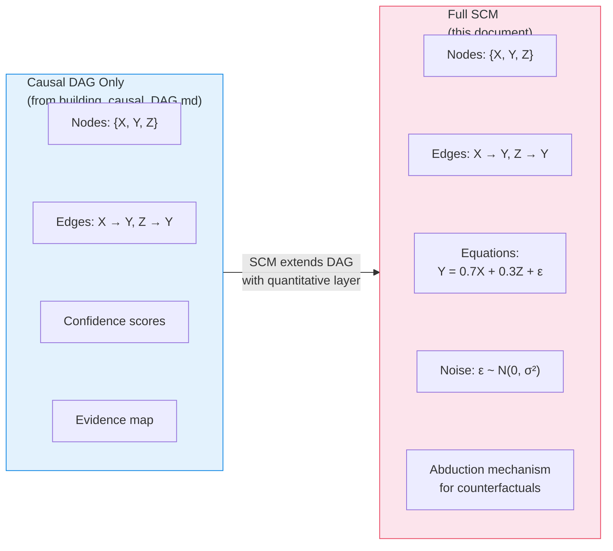

### What Each Rung Requires

| Pearl's Rung | Question Type | What It Requires | DAG Sufficient? |
|-------------|--------------|-----------------|----------------|
| **Rung 1** — Association | "What is?" P(Y\|X) | Joint distribution | ✅ With data |
| **Rung 2** — Intervention | "What if I do X?" P(Y\|do(X)) | DAG + adjustment formulae | ⚠️ Partially (needs identifiability) |
| **Rung 3** — Counterfactual | "What if X had been different?" | Full SCM (F + P(U) + abduction) | ❌ Insufficient |

Rung 3 — the *Why?* rung — is where the DAG-only pipeline from `building_causal_DAG.md` reaches its limit. We need the full SCM.

---

## Research Landscape

### Deep Structural Causal Models (DSCMs)

**Pawlowski, Castro, and Glocker (NeurIPS 2020)** introduced DSCMs — the first framework enabling tractable counterfactual inference across all three rungs of Pearl's hierarchy. They use normalizing flows and variational inference to model causal mechanisms as deep generative models. The critical innovation is enabling **abduction** — inferring the exogenous noise posterior $P(\mathbf{U} \mid \mathbf{X} = \mathbf{x})$ — which is the step that makes counterfactual reasoning mechanically possible. Demonstrated on Morpho-MNIST and brain MRI.

A comprehensive IJCAI 2024 survey classifies DSCMs by their deep generative component (VAEs, normalizing flows, GANs, diffusion models) and their identifiability guarantees for L3 (counterfactual) queries.

### Neural Causal Models (NCMs)

**Xia, Lee, Bengio, and Bareinboim (NeurIPS 2021)** defined Neural Causal Models — SCMs where causal mechanisms are parameterized by feedforward neural networks. They proved NCMs are as expressive as arbitrary SCMs (L3-consistent). In a follow-up at **ICLR 2023**, Xia, Pan, and Bareinboim extended NCMs to counterfactual identification and estimation using GAN-based implementations, providing the first general counterfactual estimation technique that handles arbitrary combinations of observational and experimental data with unobserved confounders.

### Causal Modelling Agent (CMA)

**Brown et al. (ICLR 2024)** introduced the Causal Modelling Agent — the closest existing system to a full agentic SCM construction pipeline. The CMA combines LLM metadata-based reasoning with data-driven DSCMs. An LLM proposes an initial causal graph, a DSCM is fitted to data based on that graph, and the LLM acts as a critic to propose amendments in global and local phases. The framework maintains a **memory of changes and their impact on model fit** — a pattern closely related to the validation log used in the DAG pipeline from `building_causal_DAG.md`, but extended to track quantitative model fit rather than purely structural properties.

### Agentic Stream of Thought (ASoT)

**ASoT (ScienceDirect, 2025)** orchestrates multiple smaller open-source LLMs for causal discovery through hierarchical query decomposition, dual-stream processing of competing causal hypotheses (affirmative vs. negative), and two-tiered consensus mechanisms (Delphi protocol and Ensemble Synthesis). While focused on DAG discovery, the dual-stream pattern is directly transferable to SCM equation specification — where competing functional forms can be debated by parallel agents.

### Causal-Copilot

**Wang et al. (arXiv, April 2025)** built the most complete autonomous causal analysis agent to date. It automates the full pipeline — data preprocessing, algorithm selection, causal discovery, causal inference, counterfactual estimation — orchestrated by an LLM. It integrates 20+ causal analysis methods and generates PDF reports. Causal-Copilot demonstrates that LLM-orchestrated causal workflows are viable at production scale, though it treats SCM as a downstream tool rather than a construction target.

### Causal-Aware LLM Agents

**Kirubanandan et al. (PHM Conference, 2025)** propose a dual-agent architecture for predictive health management where one agent constructs localized causal structures from case-based retrieval and a second agent simulates interventions and counterfactual effects. This demonstrates the **localized SCM** pattern — building small, context-specific SCMs rather than attempting a global model — which is a practical strategy for production systems.

### CausalRAG and HugRAG

**CausalRAG (Wang et al., ACL Findings 2025)** — also referenced in `building_causal_DAG.md` under Paradigm 3 — integrates causal graphs into the retrieval process. While CausalRAG focuses on using causal structure for better retrieval, it demonstrates a principle critical for SCM construction: causal knowledge can be extracted, stored, and traversed in graph form, with retrieval precision improving when it follows causal pathways rather than pure semantic similarity.

**HugRAG (2025)** pushes this further with hierarchical causal knowledge graphs that explicitly organize retrieved knowledge along causal chains — a natural foundation for retrieving functional form information during equation specification.

### Language Agents Meet Causality

**Gou et al. (2024)** propose a framework bridging LLMs and Causal World Models (CWMs). The CWM acts as a simulator that the LLM queries — enabling causal inference and planning via Monte Carlo Tree Search over the causal model. This is the clearest demonstration that LLM + SCM integration enables capabilities neither component achieves alone.

---

## How SCM Construction Differs from DAG Construction

The DAG pipeline from `building_causal_DAG.md` outputs a validated directed acyclic graph with confidence scores and an evidence map. The SCM pipeline starts where that pipeline ends — but introduces fundamentally different challenges.

### Side-by-Side Comparison

| Dimension | DAG Pipeline (`building_causal_DAG.md`) | SCM Pipeline (this document) |
|-----------|----------------------------------------|------------------------------|
| **Core output** | Directed graph (nodes + edges + confidence) | Graph + structural equations + noise distributions |
| **Knowledge type** | Qualitative: "X causes Y" (confidence: 0.85) | Quantitative: "Y = 0.7X + 0.3Z + ε, ε ~ N(0, 0.4)" |
| **Data requirements** | Can work from text alone (Paradigm 1 in DAG doc) | Requires observational data to fit equations; text alone is insufficient |
| **Agent count** | 6 agents (Ingester → Variable Extractor → Causal Extractor → DAG Assembler → Validator → Reporter) | 6 DAG agents + 4–5 new SCM-specific agents |
| **Validation target** | Structural (acyclicity, connectivity, degree bounds) + Semantic (transitivity, domain coherence, evidence coverage) | All DAG checks + model fit (AIC/BIC), intervention prediction, counterfactual plausibility |
| **Iteration loop** | Refine edges and orientations | Refine edges + functional forms + noise distributions |
| **Memory schema** | `CausalDAGState` (edges, confidence, evidence map) | `CausalDAGState` + equations, parameters, exogenous distributions, abduction models, fit history |
| **Primary LLM role** | Edge extraction, orientation, validation | Additionally: functional form proposal, parameter initialization guidance, counterfactual interpretation |
| **RAG usage** | Retrieve evidence for edge existence | Additionally: retrieve domain-specific functional forms, known equations, mechanism types |
| **Identifiability concern** | Markov equivalence class (multiple DAGs fit same data) | L3-identifiability (can counterfactuals be uniquely determined?) |

### The Three Additional Challenges for SCM

The DAG pipeline in `building_causal_DAG.md` solves the *graph structure* problem. SCM construction adds three challenges that the DAG pipeline does not face:

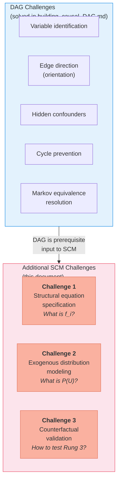

**Challenge 1 — Structural Equation Specification**: For every edge $X_i \to X_j$ in the DAG, the SCM requires a concrete function $X_j = f_j(\text{Pa}(X_j), U_j)$. This could be linear, polynomial, sigmoidal, threshold, or a neural network. The DAG pipeline only needed to determine *whether* an edge exists; the SCM pipeline must determine *how that edge works quantitatively*.

**Challenge 2 — Exogenous Distribution Modeling**: Each structural equation has a noise term $U_i$ with a specific distribution. For counterfactual reasoning, we need to perform *abduction* — inferring the individual-specific noise $P(U_i \mid \text{observed data})$. This requires either invertible mechanisms (normalizing flows) for exact abduction or amortized variational inference for approximation.

**Challenge 3 — Counterfactual Validation**: The DAG pipeline (per `building_causal_DAG.md`) validates against structural checks (acyclicity), semantic checks (domain coherence), and optionally statistical checks (conditional independence). But counterfactual predictions concern *unobservable* alternate worlds — we can never directly observe what *would have* happened. This makes validation fundamentally harder than anything in the DAG pipeline.

### How the DAG State Schema Extends to SCM

The `building_causal_DAG.md` document defines a `CausalDAGState` for LangGraph:

```python
# From building_causal_DAG.md — DAG state
class CausalDAGState(TypedDict):
    corpus_chunks: list[str]
    embeddings_indexed: bool
    candidate_nodes: list[str]
    extracted_edges: list[dict]       # {source, target, confidence, evidence}
    dag: nx.DiGraph
    iteration: int
    max_iterations: int
    validation_log: list[dict]
    confidence_scores: dict[str, float]
    evidence_map: dict[str, list[str]]
```

The SCM state *wraps and extends* this:

```python
# SCM state — extends CausalDAGState
class SCMState(TypedDict):
    # ── Inherited from CausalDAGState ──────────────────────
    corpus_chunks: list[str]
    embeddings_indexed: bool
    candidate_nodes: list[str]
    extracted_edges: list[dict]
    dag: nx.DiGraph
    dag_iteration: int
    dag_max_iterations: int
    dag_validation_log: list[dict]
    confidence_scores: dict[str, float]
    evidence_map: dict[str, list[str]]

    # ── New: Structural Equations ──────────────────────────
    structural_equations: dict[str, dict]  # node → {form, params, fitted}
    # e.g. {"Y": {"form": "linear", "params": {"β_X": 0.7, "β_Z": 0.3},
    #              "fitted": True, "r_squared": 0.82}}
    candidate_forms: dict[str, list[str]]  # node → candidate functional forms
    equation_fit_scores: dict[str, float]  # node → AIC/BIC score

    # ── New: Exogenous Variables ───────────────────────────
    exogenous_distributions: dict[str, dict]  # node → {dist_type, params}
    # e.g. {"Y": {"dist_type": "normal", "params": {"mu": 0, "sigma": 0.4}}}
    abduction_models: dict[str, Any]  # node → trained encoder / inverse

    # ── New: SCM-Specific Validation ───────────────────────
    scm_iteration: int
    scm_max_iterations: int
    model_fit_history: list[dict]     # fit metric trajectory
    intervention_tests: list[dict]    # predicted vs actual intervention results
    counterfactual_log: list[dict]    # counterfactual queries + results
    observational_data: Any           # DataFrame or path to data
```

---

## Proposed Architecture: Agentic SCM Builder

### Design Principle: DAG-First, Then Quantify

The architecture uses the DAG pipeline from `building_causal_DAG.md` as **Stage 1** — producing a validated Causal DAG — then hands that DAG to the SCM-specific agents in **Stage 2**. A third **Stage 3** handles validation, intervention simulation, and counterfactual reasoning.

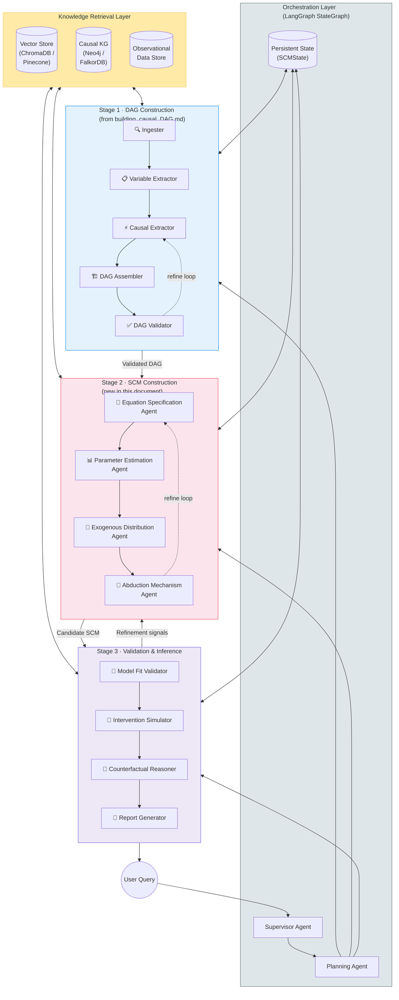

### LangGraph Control Flow

Extending the control flow from `building_causal_DAG.md` — which routes from `validate_dag` back to `extract_causal_relations` when issues are found — the SCM pipeline adds a second refinement loop over the quantitative layer:

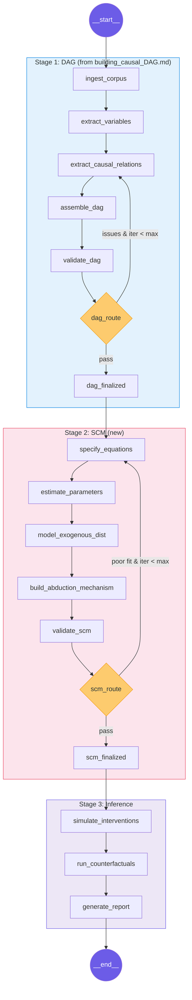

---

### Stage 2 Agent Specifications (New)

#### Equation Specification Agent

This is the most novel and challenging agent — nothing in the DAG pipeline has an equivalent. The DAG pipeline's **Causal Extractor** (agent ③ in `building_causal_DAG.md`) asks "Does X cause Y?" and outputs a confidence score. The Equation Specification Agent asks the harder question: "How does X affect Y, quantitatively?"

**Strategy: Retrieve → Propose → Compete → Select**

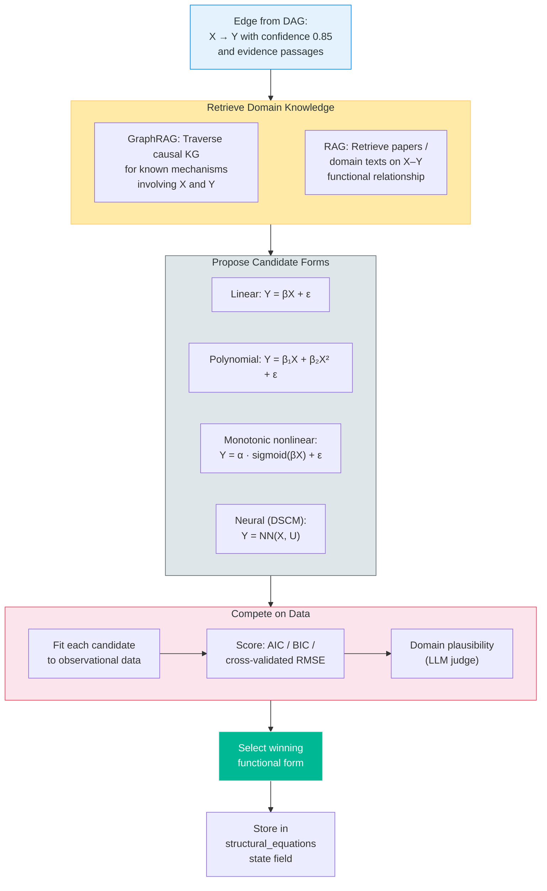

Note the critical RAG asymmetry: the same vector store used by the DAG pipeline's Causal Extractor is now queried for a different kind of information — not "does X cause Y?" but "what is the functional form of X's effect on Y?"

#### Parameter Estimation Agent

Fits parameters for the chosen functional forms using computational tools:

- For parametric models: `scipy.optimize`, `statsmodels`
- For semi-parametric models: `PyGAM` (generalized additive models)
- For neural mechanisms: PyTorch / Pyro training loops
- Computes confidence intervals via bootstrap or Bayesian posterior

#### Exogenous Distribution Agent

Models the noise distribution $P(U_i)$ for each structural equation:

1. Compute residuals from fitted equations
2. Test distributional assumptions (normality, heavy tails, multimodality)
3. For DSCM approaches: learn exogenous distributions implicitly through normalizing flows
4. Check independence between exogenous variables (Markovian assumption)

#### Abduction Mechanism Agent

Builds the machinery needed for Pearl's three-step counterfactual procedure:

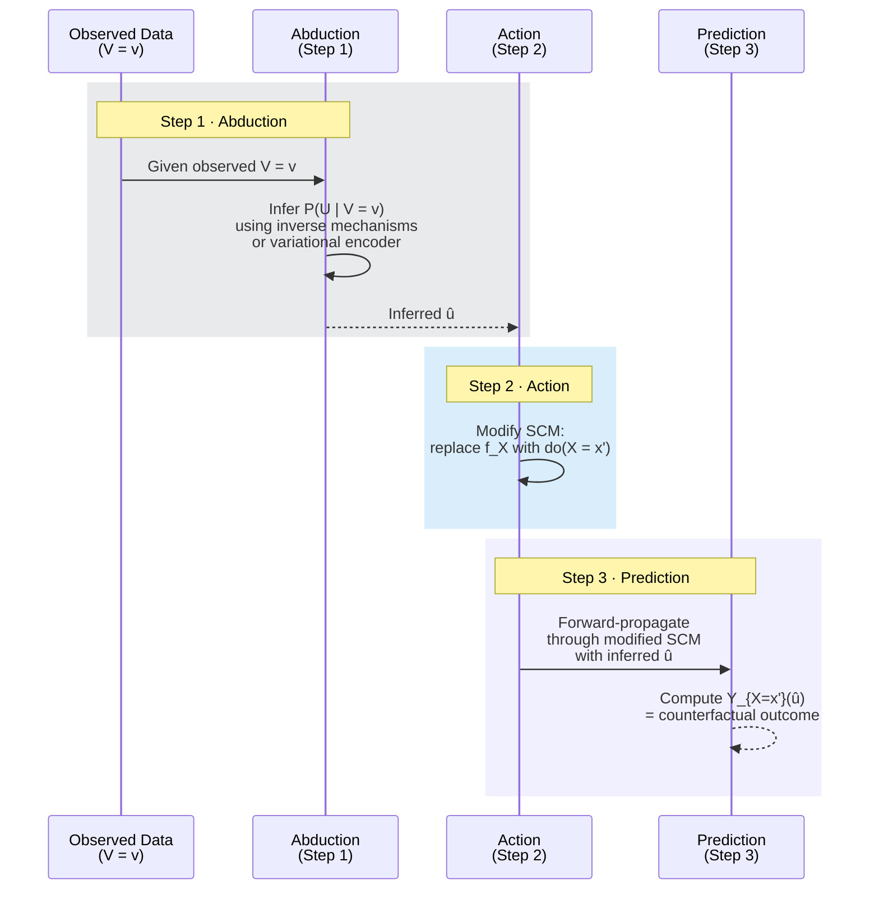

The agent selects the abduction approach per variable:

| Mechanism Type | Abduction Method | Exactness | When to Use |
|---------------|-----------------|-----------|-------------|
| Invertible (normalizing flow) | Direct inverse | Exact | When invertibility is achievable |
| Non-invertible parametric | Algebraic solve for U given V and parents | Exact (if solvable) | Simple functional forms |
| Non-invertible neural | Amortized variational encoder | Approximate | Complex, high-dimensional mechanisms |
| GAN-based (NCM-style) | Adversarial posterior estimation | Approximate | When unobserved confounders exist |

---

### Role of RAG and GraphRAG: DAG vs. SCM

The DAG pipeline in `building_causal_DAG.md` uses RAG in one primary mode: **edge evidence retrieval** — the Causal Extractor agent retrieves relevant chunks for each variable pair and asks the LLM to assess the causal relationship. The SCM pipeline adds three new retrieval modes:

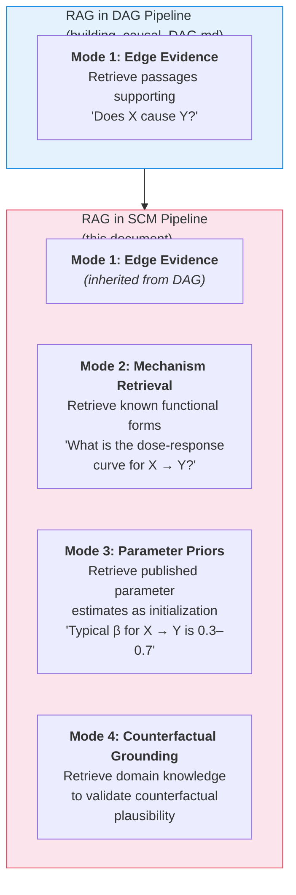

GraphRAG is particularly valuable for **Mode 2 (Mechanism Retrieval)** because functional forms often require multi-hop reasoning over causal pathways. For example, understanding that "insulin → β-cell function → glucose regulation" follows a Hill equation requires traversing the causal knowledge graph to find the intermediate mechanism, then retrieving pharmacokinetic literature on that specific pathway. This goes well beyond the single-hop retrieval sufficient for the DAG pipeline's edge-existence queries.

---

### Validation: Extending the DAG Validator

The `building_causal_DAG.md` document specifies three tiers of validation checks — Structural, Semantic, and Statistical (optional). The SCM validator inherits all three tiers, expands the Statistical tier substantially, and adds a fourth tier:

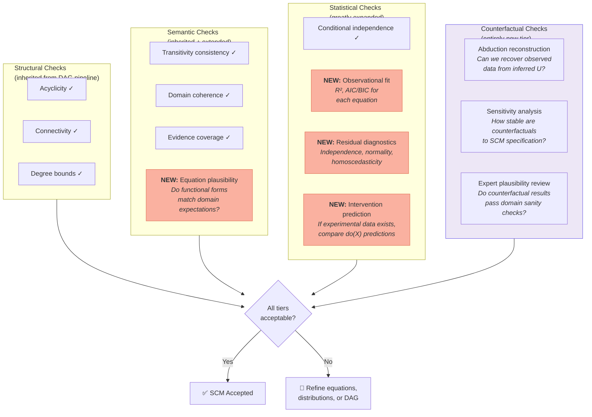

---

## The Hybrid Approach: Parametric + Neural Mechanisms

A practical SCM builder should not commit to a single mechanism type. The Equation Specification Agent should deploy a spectrum, guided by RAG-retrieved domain knowledge:

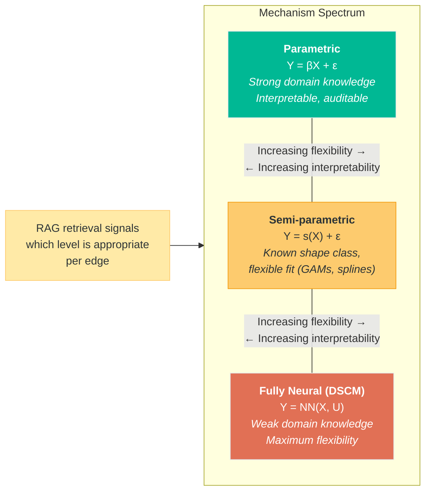

The decision is data- and knowledge-driven per edge: if RAG retrieves well-established functional forms from domain literature, use parametric; if the relationship is known to be nonlinear but the exact form is uncertain, use semi-parametric; if the mechanism is poorly understood, fall back to neural.

---

## Connecting to the Iterative RL Loop

The `building_causal_DAG.md` document includes an advanced section on an **Iterative Causal-Aware RL Loop** where the SCM is used to generate interventional experiments that refine the DAG. The SCM pipeline proposed here provides the quantitative substrate that makes this loop operational:

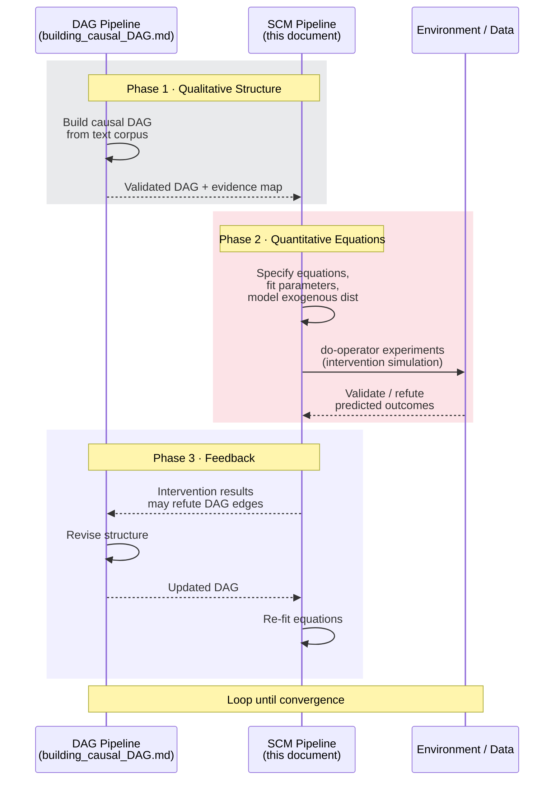

The DAG pipeline from `building_causal_DAG.md` described this loop conceptually using an LLM Agent ↔ Environment ↔ SCM sequence diagram. The SCM pipeline makes the **Adapting Phase** concrete — the SCM now has actual structural equations that generate testable interventional predictions, which either confirm or refute the DAG structure.

---

## Tools & Stack Recommendations

Extending the stack table from `building_causal_DAG.md`:

| Component | DAG Pipeline (from DAG doc) | Additional for SCM |
|-----------|---------------------------|-------------------|
| **Orchestration** | LangGraph + LangSmith | Same (extended state schema) |
| **Graph Backend** | NetworkX → Neo4j | Same + equation metadata per edge/node |
| **Vector Store** | ChromaDB → Pinecone | Same (additional indexing for mechanism literature) |
| **LLM** | Claude Sonnet (extraction) + Opus (validation) | + Opus for equation specification & counterfactual reasoning |
| **Statistical CD** | `causal-learn` (PC, GES) | `DoWhy`, `EconML`, `CausalPy` |
| **Deep SCM training** | — | PyTorch, Pyro, `nflows`, `zuko` |
| **Parameter estimation** | — | `scipy.optimize`, `statsmodels`, `PyGAM` |
| **Tracking** | MLflow + LangSmith | Same (+ model fit metrics tracking) |
| **Visualization** | Graphviz / pyvis | + equation rendering, counterfactual plots |

---

## Open Challenges and Research Gaps

### 1. No End-to-End Agentic SCM Builder Exists

As of early 2026, **no published system provides a fully agentic end-to-end SCM construction pipeline from text**. The closest works are:
- CMA (Brown et al., ICLR 2024) — iterates between LLM and DSCM but requires pre-specified variable sets and structured data
- Causal-Copilot (Wang et al., 2025) — automates analysis but treats SCM as downstream, not as a construction target
- The DAG pipeline pattern from `building_causal_DAG.md` — solves the qualitative half of the problem

The gap is in connecting **LLM-driven knowledge extraction** (the strength of the DAG pipeline) with **automated structural equation specification and neural mechanism training** in a single orchestrated workflow.

### 2. Automated Functional Form Selection Is Underexplored

Current agentic causal discovery focuses almost exclusively on graph structure. The problem of automatically choosing between linear, polynomial, neural, etc. functional forms for each structural equation — guided by domain knowledge retrieval — has no established solution in the multi-agent literature.

### 3. Counterfactual Validation Remains Fundamentally Hard

Counterfactual outcomes are never directly observed. The IJCAI 2024 DSCM survey underscores that the field lacks standardized benchmarks for counterfactual accuracy beyond synthetic datasets with known ground truth. Production systems will need to rely heavily on sensitivity analysis and domain expert review.

### 4. Text-to-Equation Is a Frontier Problem

The DAG pipeline from `building_causal_DAG.md` works with qualitative causal language ("X causes Y", "increasing X leads to Y"). Extracting *quantitative functional forms* from text ("X has a logarithmic effect on Y with saturation around X=100") requires a fundamentally different extraction capability that LLMs may possess but has not been systematically evaluated.

### 5. Scalability

Current DSCM and NCM implementations work on relatively small graphs (3–10 variables). The DAG pipeline in `building_causal_DAG.md` already notes fragility beyond ~15 variables for direct extraction. SCM construction compounds this — each additional variable adds an equation, a noise model, and an abduction mechanism.

---

## Summary: From DAG to SCM Pipeline

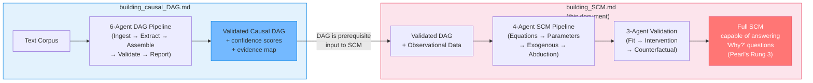

The two documents together describe a **complete path from raw text to counterfactual reasoning**: `building_causal_DAG.md` handles the qualitative structure (Rungs 1–2), and this document handles the quantitative machinery (Rung 3). The architecture is modular — the DAG pipeline can run independently, and the SCM pipeline consumes its output — preserving the separation of concerns that makes agentic systems debuggable and iterable.

---

## References

### Foundational SCM / DSCM / NCM

- Pawlowski, N., Castro, D. C., & Glocker, B. (2020). Deep Structural Causal Models for Tractable Counterfactual Inference. *NeurIPS 2020*. [arXiv:2006.06485](https://arxiv.org/abs/2006.06485)
- Xia, K., Lee, K.-Z., Bengio, Y., & Bareinboim, E. (2021). The Causal-Neural Connection: Expressiveness, Learnability, and Inference. *NeurIPS 2021*.
- Xia, K., Pan, Y., & Bareinboim, E. (2023). Neural Causal Models for Counterfactual Identification and Estimation. *ICLR 2023*. [arXiv:2210.00035](https://arxiv.org/abs/2210.00035)
- DSCM Survey — Learning Structural Causal Models through Deep Generative Models: Methods, Guarantees, and Challenges. *IJCAI 2024*. [Proceedings](https://www.ijcai.org/proceedings/2024/0907.pdf)
- Pearl, J. (2009). *Causality: Models, Reasoning and Inference* (2nd ed.). Cambridge University Press.
- Bareinboim, E. et al. (2022). On Pearl's Hierarchy and the Foundations of Causal Inference. *ACM*.

### Agentic Causal Systems

- Brown, D. C. et al. (2024). Causal Modelling Agents: Causal Graph Discovery through Synergising Metadata- and Data-Driven Reasoning. *ICLR 2024*. [OpenReview](https://openreview.net/pdf?id=pAoqRlTBtY)
- Wang, X. et al. (2025). Causal-Copilot: An Autonomous Causal Analysis Agent. *arXiv:2504.13263*. [GitHub](https://github.com/Lancelot39/Causal-Copilot)
- Han, K. et al. (2024). Causal Agent based on Large Language Model. *arXiv:2408.06849*. [arXiv](https://arxiv.org/abs/2408.06849v1)
- ASoT — Structured Knowledge-Based Causal Discovery: Agentic Streams of Thought. *ScienceDirect*, May 2025.
- Causal MAS Survey — A Survey of Large Language Model Multi-Agent Systems for Causal Inference. *arXiv:2509.00987* (2025).
- Kirubanandan, R. et al. (2025). Causal-Aware LLM Agents for PHM Co-Pilots. *PHM Conference 2025*.

### LLM + Causality Integration

- Gou, J. et al. (2024). Language Agents Meet Causality — Bridging LLMs and Causal World Models. [Project](https://j0hngou.github.io/LLMCWM/)
- Du, H. et al. (2025). Causal Discovery through Synergizing LLM and Data-Driven Reasoning (LLM-CD). *KDD 2025*.
- IJCAI 2025 Survey — Large Language Models for Causal Discovery: Current Landscape and Future Directions. [arXiv:2402.11068](https://arxiv.org/abs/2402.11068)

### RAG / GraphRAG for Causal Knowledge

- Wang, N. et al. (2025). CausalRAG: Integrating Causal Graphs into Retrieval-Augmented Generation. *ACL Findings 2025*. [ACL Anthology](https://aclanthology.org/2025.findings-acl.1165/)
- HugRAG — Hierarchical Causal Knowledge Graph Design for RAG. *arXiv*, 2025.

### Referenced Companion Document

- [building_causal_DAG.md](building_causal_DAG.md) — Building Causal DAGs from Text Corpora Using Agentic Workflows.
