# Building Structural Causal Models (SCMs) Using Agentic Workflows

## Overview

A **Structural Causal Model (SCM)** is the most complete formal object in Pearl's causal hierarchy. While a causal DAG encodes *which* variables cause *which* others (qualitative structure), an SCM additionally specifies *how* — through functional equations and noise distributions — making it the only object capable of answering **Why-type (counterfactual) questions** at Rung 3 of Pearl's causal ladder.

This document analyzes the feasibility, architecture, and research landscape for using **agentic workflows** (potentially RAG or GraphRAG-based) to construct SCMs automatically or semi-automatically. It builds on the companion documents:

- [`building_causal_DAG.md`](building_causal_DAG.md) — agentic workflows for constructing causal DAGs (the qualitative skeleton)
- [`causal_inference_agentic_workflow.md`](causal_inference_agentic_workflow.md) — a ladder-aware multi-agent system that *uses* SCMs and DAGs to answer causal questions

The relationship between these three documents mirrors the causal inference pipeline itself:

```
  DAG Construction          SCM Construction          Causal Inference
  (building_causal_DAG.md)  (this document)           (causal_inference_agentic_workflow.md)
  ────────────────────────  ────────────────────────  ──────────────────────────────────────
  Qualitative structure  →  Quantitative mechanisms →  Answering causal questions
  "X causes Y"              "Y = f(X, U)"              "What if X had been different?"
  Rung 1–2 sufficient       Required for Rung 3        Uses all three rungs
```

---

## 1. What Is an SCM and Why Does It Matter?

### 1.1 Formal Definition

An SCM **M** = ⟨**U**, **V**, **F**, P(**U**)⟩ consists of:

| Component | Symbol | Description |
|---|---|---|
| **Exogenous variables** | **U** | Unobserved background factors (noise terms) |
| **Endogenous variables** | **V** | Observed variables in the system |
| **Structural equations** | **F** | A set of functions {f₁, …, fₙ} where Vᵢ = fᵢ(PAᵢ, Uᵢ) |
| **Noise distribution** | P(**U**) | Joint probability distribution over exogenous variables |

The causal DAG is derivable from an SCM (it is the graph over **V** induced by the parent sets PAᵢ), but not vice versa — many SCMs can share the same DAG.

### 1.2 The Three Rungs and What They Require

Pearl's causal ladder defines three levels of causal reasoning with increasing demands on the underlying model:

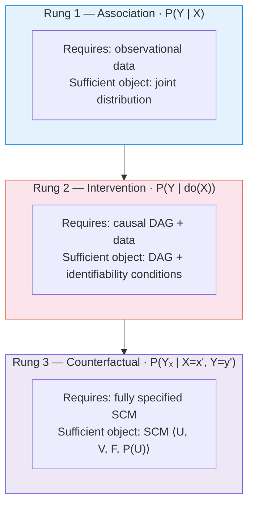

**The key insight:** A causal DAG is sufficient for Rung 2 (given identifiability), but **Rung 3 requires the full SCM** — including the functional forms fᵢ and the noise distributions P(**U**). This makes SCM construction fundamentally harder than DAG construction, because it demands quantitative specification of mechanisms, not just their existence.

### 1.3 Why-Type Questions Need SCMs

Consider: *"Patient received treatment X=1 and outcome was Y=0. Would Y have been 1 had X been 0?"*

Answering this requires Pearl's three-step counterfactual procedure:

1. **Abduction** — Given observed (X=1, Y=0), infer the value of U (the exogenous noise) using the structural equations backwards
2. **Action** — Modify the SCM by setting X=0 (the hypothetical intervention)
3. **Prediction** — Propagate forward through the modified equations to compute Y under the counterfactual

Each step requires the functional equations **F** and the noise distribution P(**U**) — a DAG alone cannot answer this.

As noted in [`causal_inference_agentic_workflow.md`](causal_inference_agentic_workflow.md), the L3 Counterfactual Agent "requires a fully specified SCM (not just a DAG), uses the three-step abduction–action–prediction procedure, and produces unit-level counterfactual estimates. It flags when the SCM is underspecified and falls back to bounds."

---

## 2. How SCM Construction Differs from DAG Construction

The [`building_causal_DAG.md`](building_causal_DAG.md) document describes agentic workflows for constructing causal DAGs from text corpora using variable extraction, pairwise causal relation assessment, graph assembly, and iterative validation. SCM construction starts where DAG construction ends and adds several qualitatively harder sub-problems.

### 2.1 Comparison Table

| Dimension | Causal DAG Construction | SCM Construction |
|---|---|---|
| **Output** | Directed acyclic graph G = (V, E) | M = ⟨U, V, F, P(U)⟩ |
| **Core question per edge** | "Does X cause Y?" (binary) | "How does X cause Y?" (functional form + parameters) |
| **Data requirements** | Text corpus and/or observational data | Observational data + domain knowledge + possibly experimental data |
| **LLM role** | Qualitative judgment (existence of edges) | Quantitative judgment (functional forms, coefficient magnitudes) |
| **Noise specification** | Not needed | Required — must specify P(Uᵢ) for each variable |
| **Identifiability** | Graph structure identifiable up to Markov equivalence class | Functional forms require stronger assumptions (e.g., linearity, additive noise) |
| **Validation** | Acyclicity, d-separation, conditional independence tests | All DAG checks + goodness-of-fit of structural equations + counterfactual consistency |
| **Iteration complexity** | Moderate (add/remove edges) | High (change functional forms, re-estimate parameters, re-specify noise) |
| **Sufficient for** | Rung 1 (association), Rung 2 (intervention, if identified) | Rung 1, 2, and 3 (counterfactuals) |

### 2.2 The Additional SCM Construction Steps

Starting from a validated causal DAG (the output of the workflow in [`building_causal_DAG.md`](building_causal_DAG.md)), SCM construction requires three additional stages:

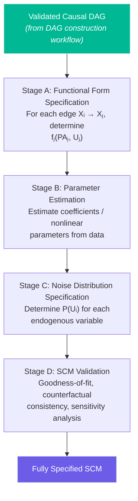

Each of these stages is substantially more complex than the corresponding DAG construction step, because it requires moving from qualitative to quantitative reasoning — from "X causes Y" to "Y = 0.7X + 0.3Z + U where U ~ N(0, σ²)."

---

## 3. Research Landscape: LLMs and Agents for SCM Construction

### 3.1 Directly Relevant Systems

| System | Year | Contribution to SCM Construction | Reference |
|---|---|---|---|
| **Causal Modelling Agents (CMA)** | ICLR 2024 | Combines LLM metadata reasoning with Deep Structural Causal Models; outperforms purely data-driven or metadata-driven causal discovery; demonstrated on Alzheimer's disease phenotyping | Abdulaal et al., [ICLR 2024](https://openreview.net/forum?id=pAoqRlTBtY) |
| **SD-SCM (Sequence-Driven SCMs)** | EMNLP 2025 | Uses language models to *parameterize* SCMs: given a user-specified DAG, an LLM defines the functional mechanisms, enabling sampling from observational, interventional, and counterfactual distributions | [ACL Anthology](https://aclanthology.org/2025.emnlp-main.107/) |
| **Linear-LLM-SCM** | Feb 2026 | Benchmarks LLMs for coefficient elicitation in linear-Gaussian SCMs; decomposes DAGs into parent-child sets and prompts LLMs for regression-style structural equations; finds high stochasticity and sensitivity to perturbations | Yamaoka et al., [arXiv:2602.10282](https://arxiv.org/abs/2602.10282) |
| **Causal-Copilot** | Apr 2025 | Autonomous agent automating full causal analysis pipeline (discovery + inference) with 20+ integrated methods; LLM-guided algorithm selection and hyperparameter optimization | Wang et al., [arXiv:2504.13263](https://arxiv.org/abs/2504.13263) |
| **CAIS (Causal AI Scientist)** | COLM 2025 | LLM-augmented tool for causal effect estimation with self-correction via validation feedback loops; decision-tree-based method selection | [COLM 2025](https://openreview.net/forum?id=EDWTHMVOCj) |
| **ORCA** | 2025 | Orchestrating Causal Agent for relational databases; multi-agent architecture for planning, causal discovery, inference, and reporting; 7× improvement over GPT-4o mini on ATE estimation | [arXiv:2508.21304](https://arxiv.org/html/2508.21304v2) |
| **Project Ariadne** | Jan 2026 | Uses SCMs *of* LLM agents (not for building SCMs); demonstrates do-calculus interventions on reasoning traces to audit faithfulness; reveals "Causal Decoupling" failure mode | Khanzadeh, [arXiv:2601.02314](https://arxiv.org/abs/2601.02314) |
| **Automated Social Science** | 2024 | Uses SCMs as blueprints for LLM-agent design; automatically generates causal hypotheses and tests them through in-silico simulation with LLM-based agents | Manning et al., [arXiv:2404.11794](https://arxiv.org/abs/2404.11794) |

### 3.2 Key Findings from Research

**What works:**
- LLMs can reliably identify **qualitative causal structure** (edges in a DAG) from domain knowledge (CMA, ARCADIA, building_causal_DAG.md workflow)
- LLMs can select appropriate **estimation methods** for causal inference given a specified model (Causal-Copilot, CAIS, ORCA)
- LLMs can parameterize SCMs when the **functional form is constrained** (e.g., linear-Gaussian) and the domain is well-represented in training data (SD-SCM)
- Multi-agent systems with **self-correction loops** significantly outperform single-pass approaches (CAIS, ORCA)

**What remains challenging:**
- **Quantitative coefficient estimation** from LLM world knowledge shows high stochasticity and sensitivity to prompt perturbations (Linear-LLM-SCM)
- **Noise distribution specification** is largely unexplored — no current system automatically determines appropriate P(U) from data + domain knowledge
- **Nonlinear functional forms** are hard for LLMs to propose reliably without strong domain priors
- **Counterfactual validation** (checking that an SCM produces sensible counterfactuals) has no established automated benchmark

### 3.3 The Gap: No End-to-End SCM Construction Workflow Exists

As of February 2026, **no published system provides an end-to-end agentic workflow that takes a text corpus (or data + domain descriptions) as input and produces a fully specified, validated SCM as output**. The closest systems are:

- **CMA** (ICLR 2024): gets closest by combining LLM reasoning with deep structural causal models, but focuses on discovery rather than full SCM specification
- **SD-SCM** (EMNLP 2025): parameterizes SCMs using LLMs, but requires the DAG to be user-specified and does not validate the resulting SCM against observational data
- **Causal-Copilot** (2025): automates the full inference pipeline but assumes the SCM/DAG is already specified or uses automated discovery that stops at the DAG level

This gap is exactly what the agentic workflow proposed below aims to fill.

---

## 4. Proposed Architecture: Agentic SCM Construction Workflow

### 4.1 Design Principles

1. **Two-phase pipeline**: First build the DAG (using the workflow from [`building_causal_DAG.md`](building_causal_DAG.md)), then extend it to a full SCM
2. **RAG-grounded functional form selection**: Use retrieval over domain literature to propose functional forms, not just LLM parametric knowledge
3. **Data-driven parameter estimation**: Use statistical methods (not LLM guesses) for coefficient estimation whenever data is available
4. **Iterative validation with counterfactual consistency checks**: Validate the SCM not just on fit, but on whether its counterfactual predictions are coherent
5. **Graceful degradation**: If full SCM specification fails, report what *can* be specified and provide bounds for what cannot (mirroring the degradation strategy in [`causal_inference_agentic_workflow.md`](causal_inference_agentic_workflow.md))

### 4.2 High-Level Architecture

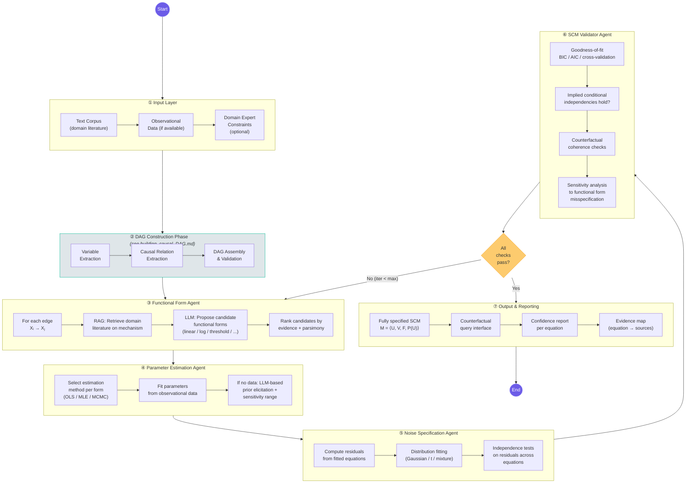

### 4.3 State Schema

```python
from typing import TypedDict, Annotated, Literal
from langgraph.graph import StateGraph
import networkx as nx

class SCMState(TypedDict):
    # ── Inherited from DAG construction phase ──
    corpus_chunks: list[str]
    candidate_nodes: list[str]
    dag: nx.DiGraph
    edge_evidence: dict[str, list[str]]       # edge → supporting passages

    # ── SCM-specific state ──
    functional_forms: dict[str, str]           # node → equation string, e.g. "Y = β₁X + β₂Z + U"
    form_candidates: dict[str, list[dict]]     # node → ranked candidate forms with evidence
    parameters: dict[str, dict]                # node → {coefficients, standard_errors, method}
    noise_distributions: dict[str, dict]       # node → {family, params} e.g. {"family": "normal", "params": {"mean": 0, "std": 0.5}}
    residuals: dict[str, list[float]]          # node → residual values from fitted equations
    scm_fit_metrics: dict[str, dict]           # node → {bic, aic, r_squared}
    counterfactual_checks: list[dict]          # results of coherence checks
    sensitivity_report: dict                   # sensitivity to form misspecification
    iteration: int
    max_iterations: int
    validation_log: list[dict]
    scm_complete: bool
```

### 4.4 Agent Roster

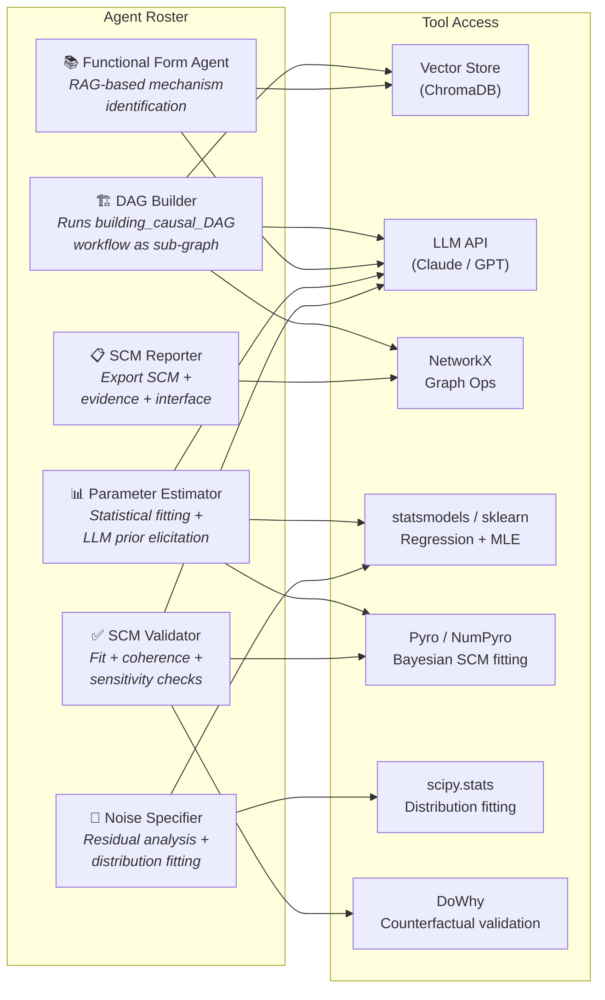

---

## 5. Agent Specifications in Detail

### 5.1 Functional Form Agent (the hardest novel component)

This agent is the most distinctive part of the SCM workflow — it has no counterpart in the DAG construction pipeline. Its job is to answer: **for each causal edge X → Y in the DAG, what is the functional relationship?**

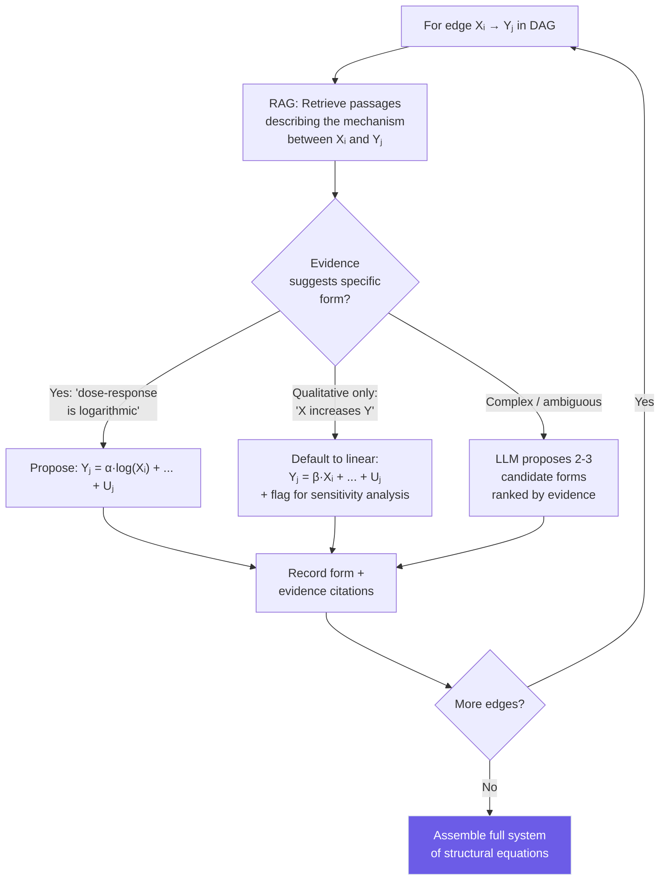

**RAG strategy for functional form selection:**

The agent uses a domain-specific vector store (the same corpus used for DAG construction, plus supplementary scientific literature) to retrieve evidence about mechanisms. For example:

- Query: *"What is the functional relationship between smoking intensity and lung cancer risk?"*
- Retrieved passage: *"The dose-response relationship between pack-years and lung cancer follows a log-linear pattern with an estimated coefficient of..."*
- Proposed form: `cancer_risk = β₀ + β₁·log(pack_years) + β₂·age + U`

When no mechanistic evidence is available, the agent defaults to **additive linear models** (the most common assumption in applied causal inference) and flags the equation for sensitivity analysis.

### 5.2 Parameter Estimation Agent

This agent selects and applies appropriate estimation methods based on the functional form and available data:

| Functional Form | Data Available | Estimation Method |
|---|---|---|
| Linear, Gaussian noise | Yes | OLS via `statsmodels` |
| Linear, non-Gaussian | Yes | IV / 2SLS if instruments available; MLE otherwise |
| Nonlinear parametric | Yes | Nonlinear least squares or MLE |
| Any form | No data | LLM prior elicitation + literature-based ranges |
| Any form, Bayesian | Yes (small sample) | MCMC via Pyro/NumPyro with informative priors |

**LLM prior elicitation** (when data is unavailable) follows the approach benchmarked by Linear-LLM-SCM (Yamaoka et al., 2026): the agent decomposes the DAG into parent-child sets, prompts the LLM for coefficient magnitudes, and runs multiple prompts to estimate variance. However, following their findings about high stochasticity, the agent:
- Runs N=20+ independent elicitations and reports the distribution of estimates
- Always flags LLM-elicited parameters with high uncertainty
- Treats these as **informative priors** for Bayesian estimation when even small amounts of data become available

### 5.3 Noise Specification Agent

After parameter estimation, this agent:

1. Computes residuals: ûᵢ = Vᵢ − f̂ᵢ(PAᵢ)
2. Fits candidate distributions to residuals (Normal, Student-t, mixture of Gaussians, etc.) using `scipy.stats`
3. Tests independence of residuals across equations (a core SCM assumption)
4. Reports the best-fitting noise family and parameters for each equation

### 5.4 SCM Validator Agent

The most critical agent. It enforces four levels of validation:

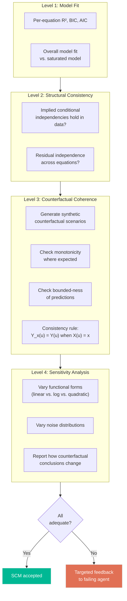

**Counterfactual coherence checks** are novel to SCM validation and have no counterpart in DAG validation. They verify that the SCM produces sensible counterfactual predictions — e.g., that intervening to increase a beneficial treatment does not decrease the outcome, that predictions stay within physically plausible bounds, and that the consistency axiom (Yₓ = Y when X = x) holds.

---

## 6. GraphRAG-Enhanced SCM Construction

While standard RAG suffices for the DAG construction phase (retrieving evidence for pairwise causal relations), SCM construction benefits from **GraphRAG** — retrieval that leverages the causal graph structure itself to guide evidence gathering.

### 6.1 Why GraphRAG for SCMs?

Functional form selection requires understanding not just individual edges but **causal pathways**. The mechanism between X and Y may be mediated by Z, and the functional form of the X → Y relationship may depend on understanding the X → Z → Y pathway.

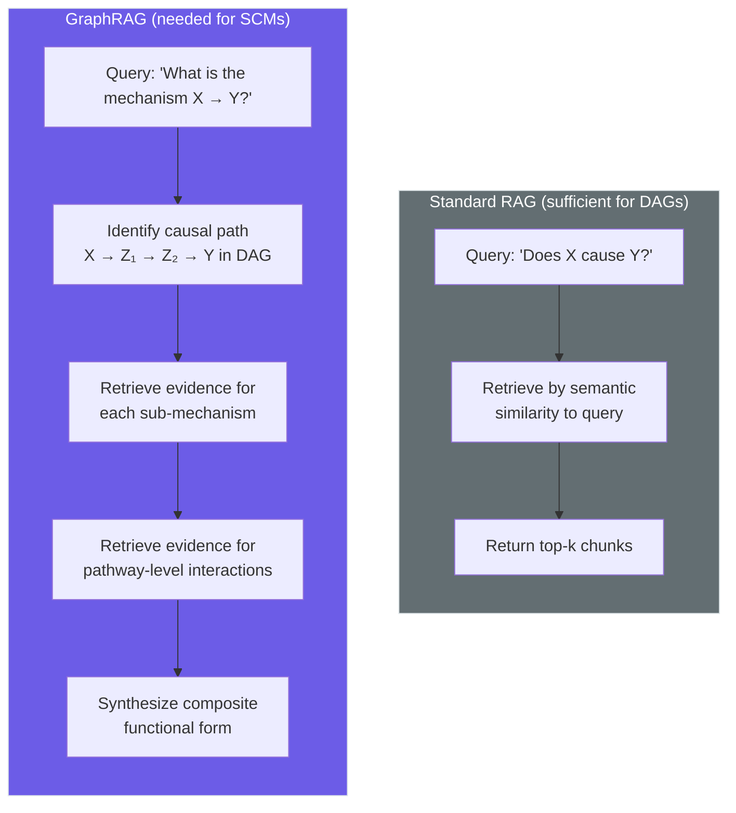

### 6.2 GraphRAG Architecture for SCM Construction

The causal DAG itself serves as the knowledge graph backbone for GraphRAG:

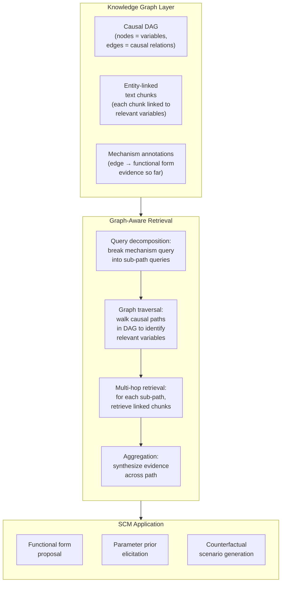

This approach directly extends the CausalRAG framework (ACL 2025 Findings) from retrieval-augmented question answering to retrieval-augmented model construction.

---

## 7. LangGraph Control Flow

### 7.1 Graph Topology

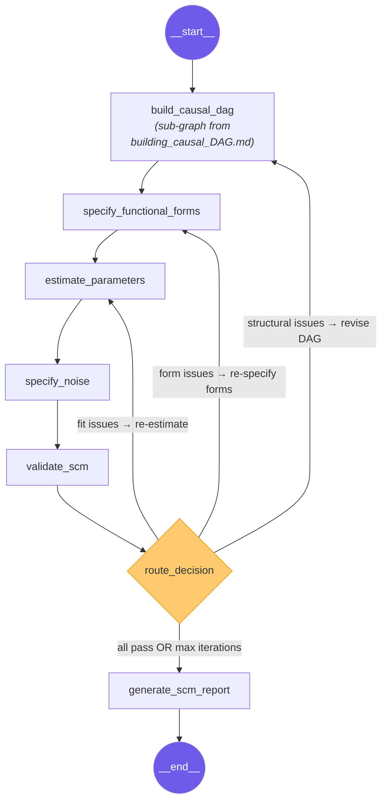

### 7.2 Implementation Skeleton

```python
from langgraph.graph import StateGraph, END

def route_after_validation(state: SCMState) -> str:
    if state["iteration"] >= state["max_iterations"]:
        return "report"
    log = state["validation_log"][-1] if state["validation_log"] else {}
    if log.get("structural_issues"):
        return "dag_build"
    if log.get("form_issues"):
        return "func_form"
    if log.get("fit_issues"):
        return "estimate"
    return "report"

builder = StateGraph(SCMState)
builder.add_node("dag_build", dag_construction_subgraph)
builder.add_node("func_form", functional_form_agent)
builder.add_node("estimate", parameter_estimation_agent)
builder.add_node("noise", noise_specification_agent)
builder.add_node("validate", scm_validation_agent)
builder.add_node("report", scm_report_agent)

builder.set_entry_point("dag_build")
builder.add_edge("dag_build", "func_form")
builder.add_edge("func_form", "estimate")
builder.add_edge("estimate", "noise")
builder.add_edge("noise", "validate")
builder.add_conditional_edges("validate", route_after_validation, {
    "dag_build": "dag_build",
    "func_form": "func_form",
    "estimate": "estimate",
    "report": "report",
})
builder.add_edge("report", END)

scm_workflow = builder.compile()
```

---

## 8. Integration with the Causal Inference Workflow

The SCM produced by this workflow is designed to be consumed by the L3 Counterfactual Agent described in [`causal_inference_agentic_workflow.md`](causal_inference_agentic_workflow.md). The integration point is the **Shared Context Store**:

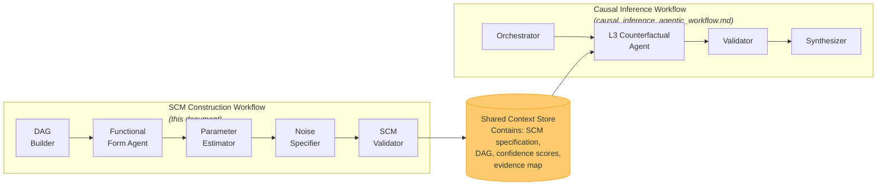

When the Causal Inference Orchestrator classifies a question as L3 (counterfactual), it checks the Shared Context Store for a fully specified SCM. If one is available (built by this workflow), the L3 Agent uses it for the abduction–action–prediction procedure. If not, the system either triggers this SCM construction workflow or degrades to L2 with bounds, as described in the graceful degradation strategy.

---

## 9. Challenges and Open Problems

### 9.1 The Functional Form Bottleneck

The central challenge of SCM construction is functional form specification. Unlike DAG construction where the question is binary ("does this edge exist?"), functional form selection is an open-ended modeling choice. Current limitations:

- **LLMs default to linearity.** Linear-LLM-SCM (2026) shows that even when explicitly prompted, LLMs overwhelmingly propose linear relationships. Nonlinear forms require strong domain-specific evidence.
- **Misspecification compounds.** Errors in functional forms propagate through the SCM and amplify in counterfactual predictions. A wrong functional form for one equation can invalidate counterfactuals for all downstream variables.
- **No ground truth for validation.** Unlike DAG edges (which can be checked against conditional independence tests), functional forms cannot be validated purely from observational data without strong parametric assumptions.

### 9.2 The Noise Distribution Problem

Noise specification is the least-studied component. Key issues:

- **Non-Gaussian noise breaks standard counterfactual procedures.** Most textbook SCM examples assume Gaussian noise, but real-world data often has heavy tails, skewness, or multimodality.
- **Correlated noise across equations** (shared unobserved confounders) violates the standard SCM factorization and requires latent variable models, which are much harder to specify and estimate.
- **The choice of noise distribution affects counterfactual identifiability.** Two SCMs with identical DAGs and functional forms but different noise distributions can produce different counterfactual predictions.

### 9.3 Scalability

The SCM construction workflow is substantially more expensive than DAG construction:

| Step | DAG Construction | SCM Construction |
|---|---|---|
| Variable extraction | O(n) LLM calls | Same (inherited) |
| Edge determination | O(n²) LLM calls | Same (inherited) |
| Functional form selection | N/A | O(m) RAG + LLM calls (m = number of edges) |
| Parameter estimation | N/A | O(m) statistical fits |
| Noise specification | N/A | O(n) distribution fits |
| Validation per iteration | O(n²) conditional independence tests | All DAG checks + O(n) goodness-of-fit + O(k) counterfactual coherence checks |

For a graph with 50 variables and 100 edges, the SCM workflow requires roughly 3-5× the computation of the DAG workflow.

---

## 10. Tool Stack

| Component | Prototyping | Production |
|---|---|---|
| **Orchestration** | LangGraph | LangGraph + LangSmith |
| **DAG Construction** | `building_causal_DAG` sub-graph | Same, with Neo4j backend |
| **Vector Store** | ChromaDB | Pinecone / Weaviate |
| **LLM** | Claude Sonnet (form selection) | Claude Opus (validation) + Sonnet (extraction) |
| **Statistical Estimation** | `statsmodels` + `sklearn` | `statsmodels` + `econml` |
| **Bayesian SCM Fitting** | Pyro / NumPyro | Pyro + custom MCMC samplers |
| **Distribution Fitting** | `scipy.stats` | `scipy.stats` + KDE methods |
| **Counterfactual Computation** | DoWhy | DoWhy + custom Pyro models |
| **Graph Backend** | NetworkX | Neo4j / FalkorDB |
| **Tracking** | MLflow | MLflow + LangSmith traces |

---

## 11. Summary: DAG Construction vs. SCM Construction

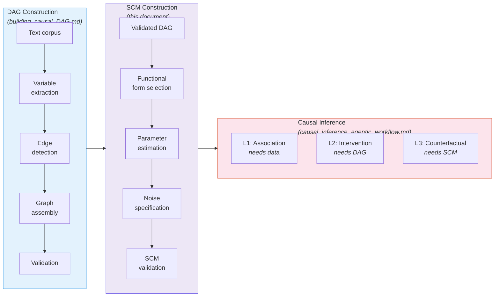

The DAG construction workflow answers "what causes what?" — a qualitative question that LLMs handle well. The SCM construction workflow answers "how does it cause it, and how much?" — a quantitative question that requires combining LLM domain knowledge, statistical estimation, and careful validation. Together, they provide the full model specification needed to answer Pearl's hardest questions: the counterfactual "why" and "what if" queries at Rung 3 of the causal ladder.

---

## References

### SCM Construction and Parameterization
- **Causal Modelling Agents (CMA)**: Abdulaal et al. (ICLR 2024) — "Causal Graph Discovery through Synergising Metadata- and Data-driven Reasoning" — [OpenReview](https://openreview.net/forum?id=pAoqRlTBtY)
- **SD-SCM**: Willig et al. (EMNLP 2025) — "Language Models as Causal Effect Generators" — [ACL Anthology](https://aclanthology.org/2025.emnlp-main.107/)
- **Linear-LLM-SCM**: Yamaoka et al. (Feb 2026) — "Benchmarking LLMs for Coefficient Elicitation in Linear-Gaussian Causal Models" — [arXiv:2602.10282](https://arxiv.org/abs/2602.10282)
- **Automated Social Science**: Manning et al. (2024) — "Using SCMs as Blueprints for LLM-Agent Design" — [arXiv:2404.11794](https://arxiv.org/abs/2404.11794)

### Agentic Causal Analysis Systems
- **Causal-Copilot**: Wang et al. (Apr 2025) — "An Autonomous Causal Analysis Agent" — [arXiv:2504.13263](https://arxiv.org/abs/2504.13263)
- **CAIS**: (COLM 2025) — "Causal AI Scientist: Facilitating Causal Data Science with Large Language Models" — [OpenReview](https://openreview.net/forum?id=EDWTHMVOCj)
- **ORCA**: (2025) — "ORchestrating Causal Agent" — [arXiv:2508.21304](https://arxiv.org/html/2508.21304v2)

### SCMs Applied to LLM Agents
- **Project Ariadne**: Khanzadeh (Jan 2026) — "A Structural Causal Framework for Auditing Faithfulness in LLM Agents" — [arXiv:2601.02314](https://arxiv.org/abs/2601.02314)

### Causal DAG Construction (Companion Documents)
- **DEMOCRITUS**: Mahadevan (Dec 2025) — "Large Causal Models from Large Language Models" — [arXiv:2512.07796](https://arxiv.org/abs/2512.07796)
- **CausalRAG**: (ACL 2025 Findings) — "Integrating Causal Graphs into Retrieval-Augmented Generation" — [ACL Anthology](https://aclanthology.org/2025.findings-acl.1165.pdf)
- **IJCAI 2025 Survey**: "Large Language Models for Causal Discovery" — [arXiv:2402.11068](https://arxiv.org/abs/2402.11068)

### Pearl's Causal Hierarchy Theory
- **Causal Hierarchy Theorem**: Bareinboim et al. — Computational complexity across Pearl's ladder — [arXiv:2405.07373](https://arxiv.org/abs/2405.07373)
- **Counterfactual Unnesting Theorem**: Correa et al. — Mapping nested counterfactuals to unnested forms — [causalai.net/r79](https://causalai.net/r79.pdf)
- **Counterfactual Realizability**: (ICLR 2025 Spotlight) — Determining when counterfactual distributions can be sampled — [arXiv:2503.11870](https://arxiv.org/abs/2503.11870)
