# Building Causal DAGs from Text Corpora Using Agentic Workflows

## Overview

Constructing causal Directed Acyclic Graphs (DAGs) from unstructured text is an emerging capability at the intersection of causal discovery, NLP, and agentic AI orchestration. This document synthesizes the current landscape — from practical architecture patterns to research-frontier methods — drawing on key recent work including DEMOCRITUS (Mahadevan, Dec 2025), ARCADIA, CausalRAG (ACL 2025), The Agentic Leash (Panda et al., Jan 2026), and the IJCAI 2025 survey on LLMs for causal discovery.

---

## Three Paradigms for Causal DAG Construction

The IJCAI 2025 survey identifies three distinct roles LLMs play in causal discovery:

1. **Direct causal inference** without observational data
2. **Post-hoc refinement** of statistically derived causal structures
3. **Integration of prior knowledge** into traditional statistical methods

For text corpora specifically, paradigm (1) is the most direct entry point, but the strongest results emerge from hybrid approaches that combine all three.

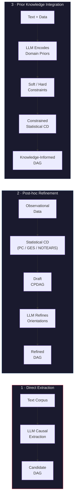

---

## Paradigm 1 — Direct LLM-Based Causal Extraction

The baseline approach uses LLMs to directly extract `(cause, effect)` pairs from text. Variables along with their descriptive texts are provided as input to an LLM, which performs causal discovery by identifying direct relationships after comprehending the semantic meaning of each variable (Ban et al., 2023).

### Pipeline

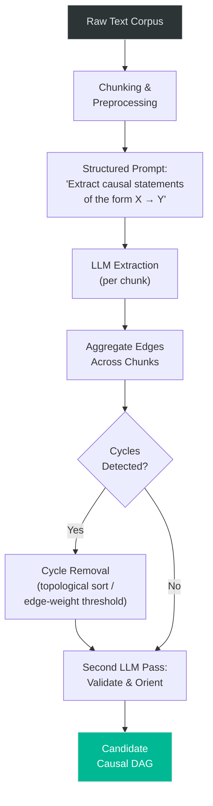

### Limitations

- LLMs hallucinate edges and miss implicit causation
- Transitivity consistency is not guaranteed
- No grounding in observational evidence
- Fragile on its own for graphs with more than ~15 variables

---

## Paradigm 2 — Agentic Multi-Step Pipeline

This is where multi-agent orchestration (e.g., LangGraph) delivers the most value. The strongest recent systems all use iterative refinement loops with specialized agents.

### High-Level Agentic Architecture

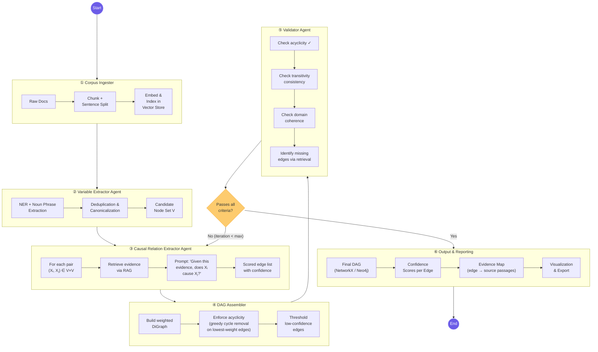

---

### Reference Systems

#### DEMOCRITUS (Mahadevan, Dec 2025)

The most ambitious text-to-causal-model pipeline. A strong LLM acts as a discovery engine for domain topics, causal questions, and statements, followed by a Geometric Transformer layer that produces manifold embeddings over the resulting relational graph.

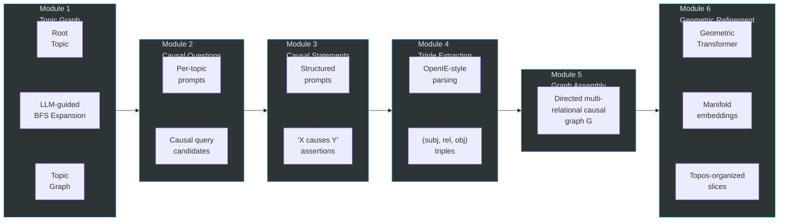

#### ARCADIA (Scalable Causal Discovery)

Uses an agentic LLM as an orchestration layer that constrains statistical discovery. The agent documents its theory at each step, and the workflow loops until the DAG satisfies six evaluation criteria.

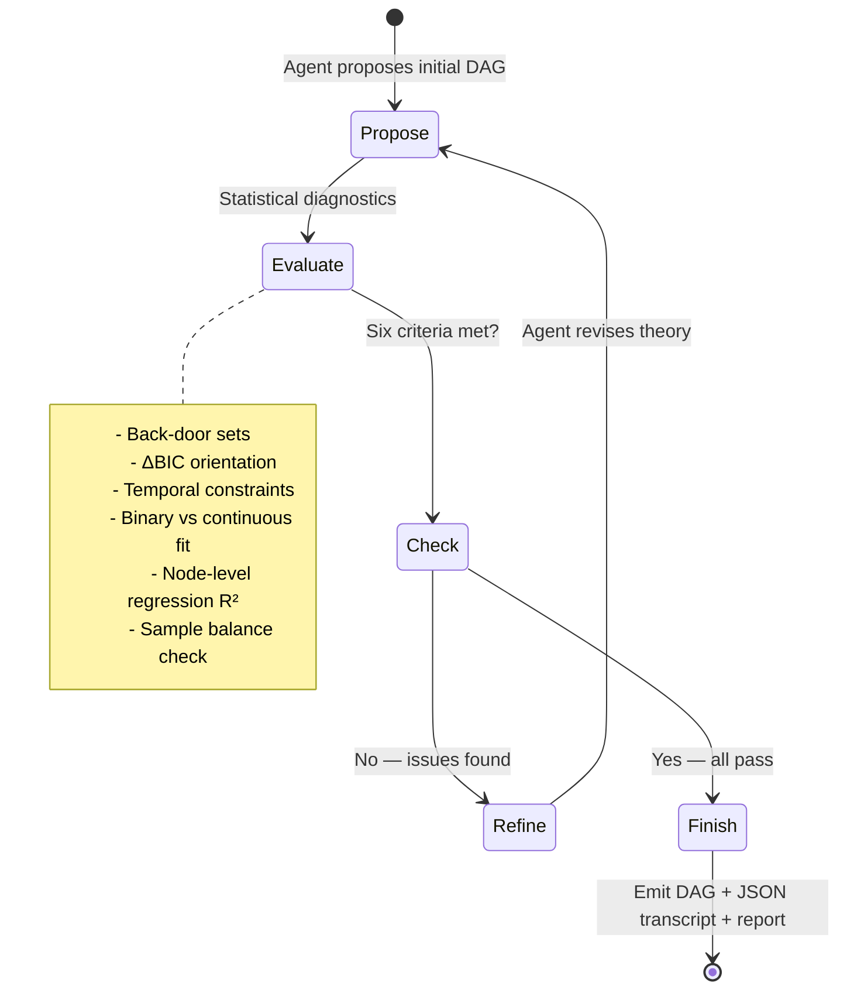

#### The Agentic Leash (Panda et al., Jan 2026)

Builds Fuzzy Cognitive Maps (FCMs) where the dynamical system's equilibria drive the LLM agent to fetch and process additional causal text — a bidirectional loop between extraction and the evolving causal structure.

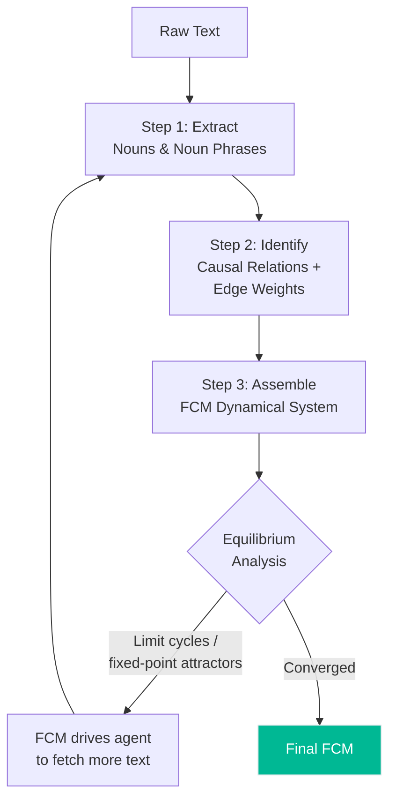

---

## Paradigm 3 — RAG-Enhanced Causal Discovery

CausalRAG (ACL 2025 Findings) combines causal graph structure with retrieval in a bidirectional manner: RAG grounds causal extraction in evidence, and the causal graph improves retrieval quality.

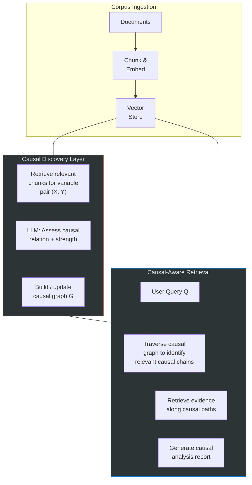

---

## Practical LangGraph Implementation Blueprint

### State Schema

```python
from typing import TypedDict, Annotated
from langgraph.graph import StateGraph
import networkx as nx

class CausalDAGState(TypedDict):
    corpus_chunks: list[str]              # Processed text chunks
    embeddings_indexed: bool              # Whether vector store is ready
    candidate_nodes: list[str]            # Extracted variable names
    extracted_edges: list[dict]           # {source, target, confidence, evidence}
    dag: nx.DiGraph                       # Current DAG state
    iteration: int                        # Refinement loop counter
    max_iterations: int                   # Loop bound
    validation_log: list[dict]            # Issues found per iteration
    confidence_scores: dict[str, float]   # Edge → confidence mapping
    evidence_map: dict[str, list[str]]    # Edge → supporting passages
```

### Agent Definitions

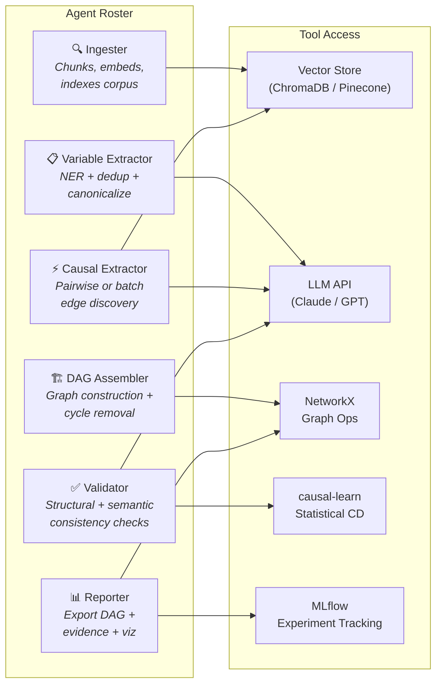

### Graph Topology (LangGraph Control Flow)

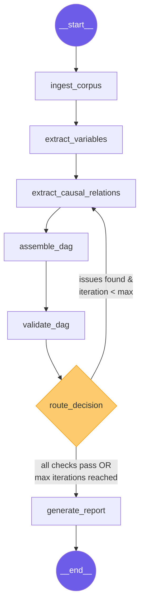

---

## Key Design Decisions

### With RAG vs. Without RAG

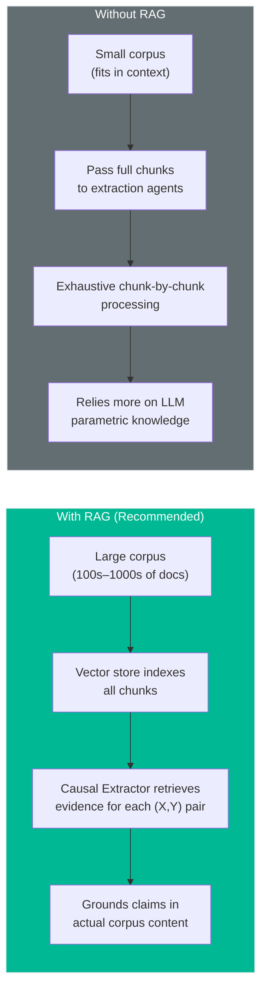

### Pairwise vs. Batch Extraction

| Strategy | Complexity | Accuracy | Best For |
|----------|-----------|----------|----------|
| **Pairwise** ("Does X cause Y?") | O(n²) in variables | Higher — focused reasoning | Graphs with < 30 nodes |
| **Batch** ("Output full adjacency matrix") | O(1) LLM calls | Lower — degrades > 15 nodes | Quick prototyping, small graphs |
| **Hybrid** (batch first, pairwise refinement) | O(n) + selective O(k²) | Best of both worlds | Production systems |

### Validation Criteria

The validator agent should enforce both structural and semantic checks:

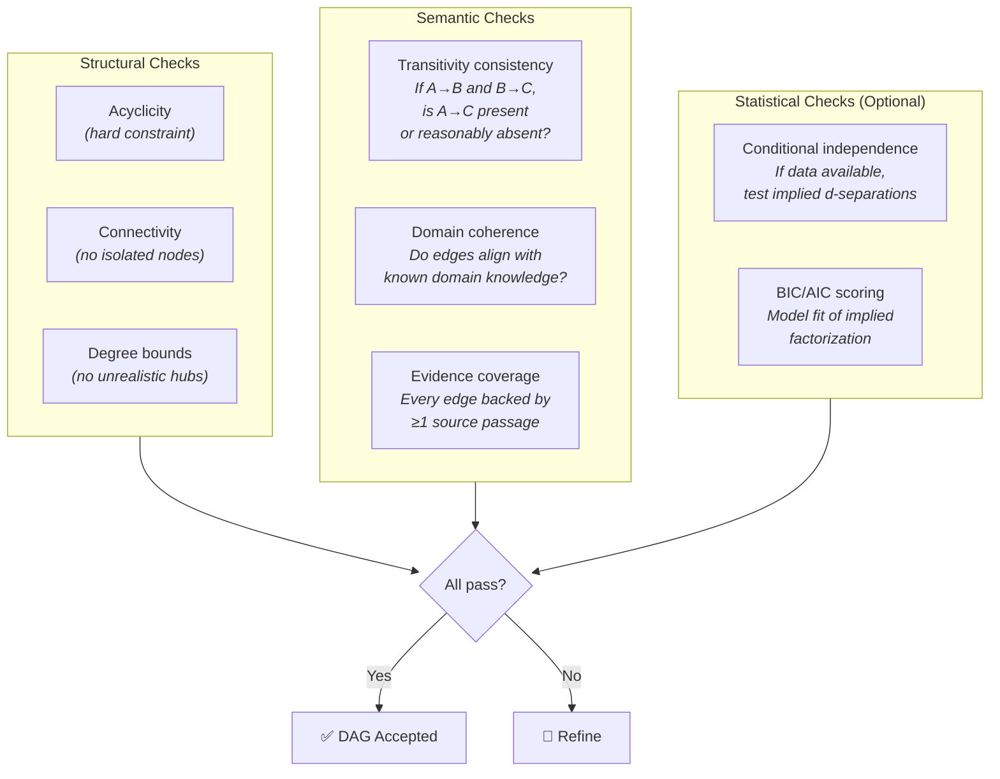

---

## Tools & Stack Recommendations

| Component | Prototyping | Production |
|-----------|------------|------------|
| **Orchestration** | LangGraph | LangGraph + LangSmith |
| **Graph Backend** | NetworkX | Neo4j / FalkorDB |
| **Vector Store** | ChromaDB | Pinecone / Weaviate |
| **LLM** | Claude Sonnet 4.5 | Claude Sonnet (extraction) + Opus (validation) |
| **Statistical CD** | `causal-learn` (PC, GES) | `causal-learn` + custom NOTEARS |
| **Tracking** | MLflow | MLflow + LangSmith traces |
| **Visualization** | Graphviz / pyvis | D3.js / Cytoscape.js |

---

## Iterative Causal-Aware RL Loop (Advanced)

For scenarios where observational data complements the text corpus, the iterative RL pattern offers an additional refinement mechanism:

```mermaid
sequenceDiagram
    participant LLM as LLM Agent
    participant ENV as Environment / Data
    participant SCM as Causal DAG (SCM)

    rect rgb(45, 52, 54)
    Note over LLM,SCM: Learning Phase
    LLM->>ENV: Extract candidate causal<br/>variables from text observations
    ENV-->>LLM: Candidate variables +<br/>textual evidence
    LLM->>SCM: Propose initial edges
    end

    rect rgb(39, 60, 117)
    Note over LLM,SCM: Adapting Phase
    SCM->>ENV: Interventional do-operator<br/>experiments
    ENV-->>SCM: Validate / refute<br/>proposed edges
    SCM->>SCM: Refine DAG structure
    end

    rect rgb(106, 27, 154)
    Note over LLM,SCM: Acting Phase
    SCM->>LLM: Refined causal structure
    LLM->>LLM: Generate adaptive policies<br/>with causal-aware reward shaping
    LLM-->>SCM: Updated edge proposals
    end

    Note over LLM,SCM: Loop until convergence
```

---

## References

- **DEMOCRITUS**: Mahadevan (Dec 2025) — "Large Causal Models from Large Language Models" — [arXiv:2512.07796](https://arxiv.org/abs/2512.07796)
- **ARCADIA**: "Scalable Causal Discovery for Corporate" — [arXiv:2512.00839](https://arxiv.org/abs/2512.00839)
- **The Agentic Leash**: Panda et al. (Jan 2026) — "Extracting Causal Feedback Fuzzy Cognitive Maps with LLMs" — [arXiv:2601.00097](https://arxiv.org/abs/2601.00097)
- **CausalRAG**: ACL 2025 Findings — "Integrating Causal Graphs into Retrieval-Augmented Generation" — [ACL Anthology](https://aclanthology.org/2025.findings-acl.1165.pdf)
- **Causal-LLM**: EMNLP 2025 Findings — "A Unified One-Shot Framework for Prompt" — [ACL Anthology](https://aclanthology.org/2025.findings-emnlp.439.pdf)
- **IJCAI 2025 Survey**: "Large Language Models for Causal Discovery: Current Landscape and Future Directions" — [arXiv:2402.11068](https://arxiv.org/abs/2402.11068)
- **LCMs Overview**: EmergentMind — [Large Causal Models topic page](https://www.emergentmind.com/topics/large-causal-models-lcms)
