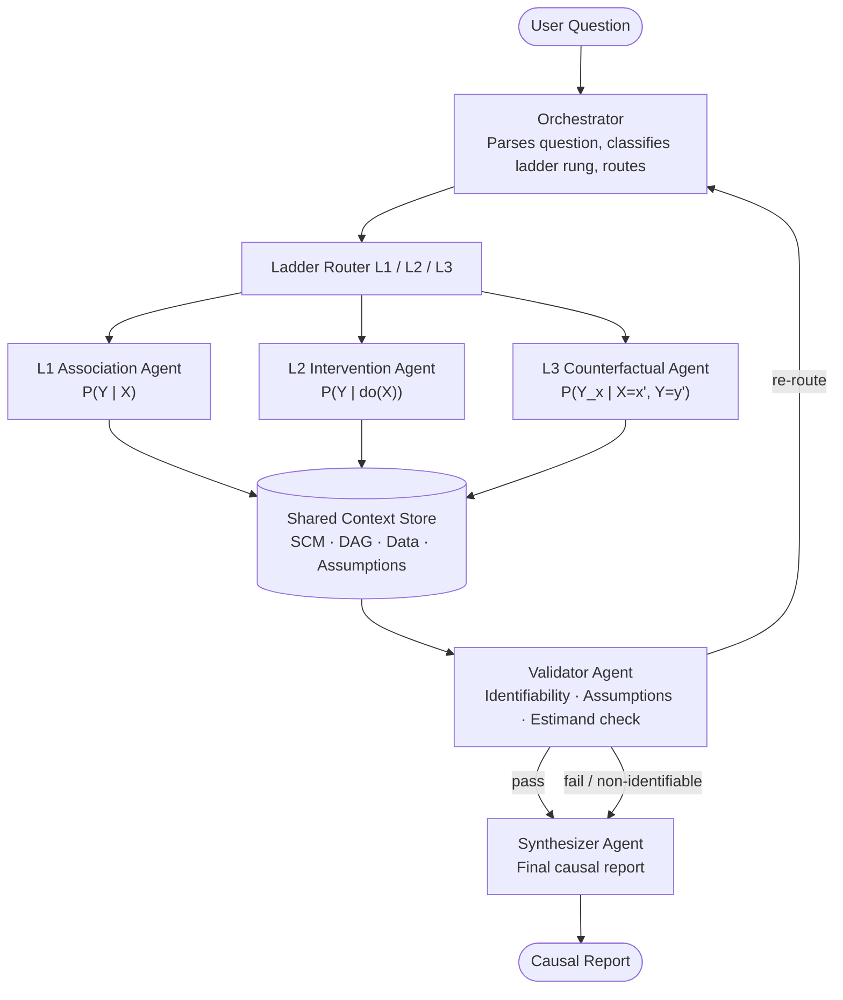
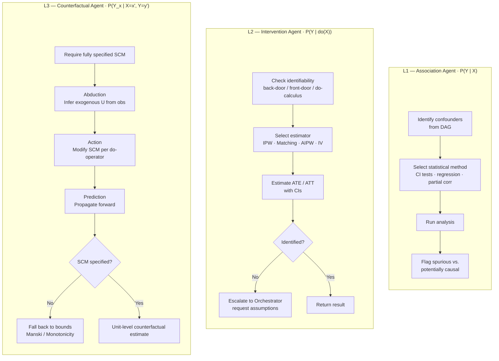
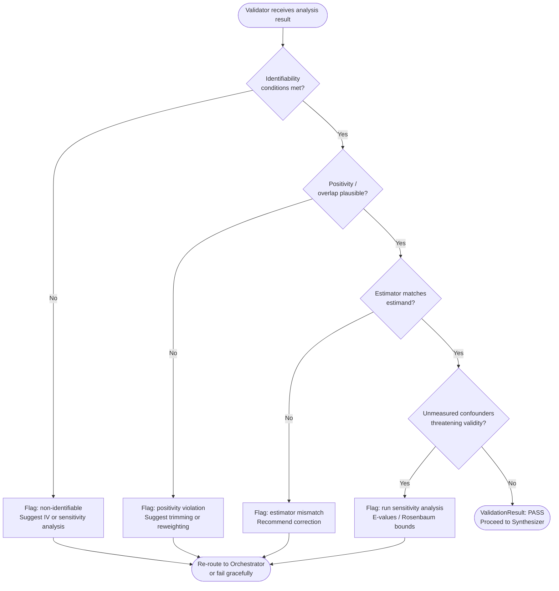
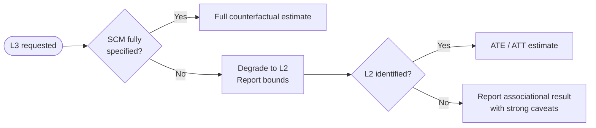
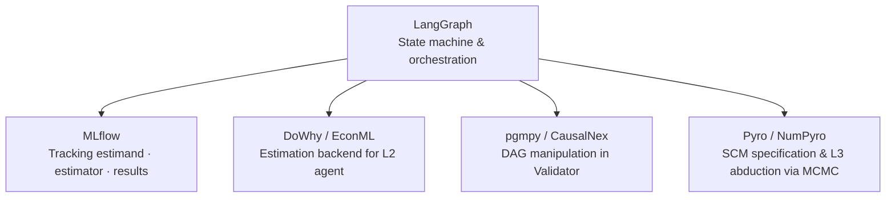

# Agentic Workflow for Causal Inference via the Causal Ladder

Given Pearl's causal ladder (Association → Intervention → Counterfactual), this document outlines a production-oriented agentic design that maps each rung to distinct agent roles in a LangGraph-based multi-agent system.

---

## Core Architecture: Hierarchical Multi-Agent with Ladder-Aware Routing



---

## Agent Roles in Detail

### 1. Orchestrator

Classifies the incoming question into a rung of the ladder using a structured prompt. The classification is non-trivial — *"what happens if we give treatment X?"* is L2 (intervention), but *"what would have happened had we not given X?"* is L3 (counterfactual). It also extracts the treatment variable, outcome variable, and any stated assumptions, producing a structured `CausalQuery` object passed downstream.

---

### 2. Ladder Router & Rung Agents



**L1 — Association Agent** handles observational questions. It identifies relevant confounders from the shared SCM/DAG context, selects appropriate statistical methods, runs analysis, and flags spurious associations vs. potentially causal ones. It explicitly marks its output as *associational only*.

**L2 — Intervention Agent** handles do-calculus questions. It checks identifiability via the back-door/front-door criteria or do-calculus rules against the DAG, selects an appropriate estimator (IPW, matching, AIPW, IV if instruments are available), runs estimation, and reports the ATE/ATT with confidence intervals. If the effect is non-identifiable from the given DAG, it escalates back to the Orchestrator with a request for additional assumptions.

**L3 — Counterfactual Agent** handles retrospective individual-level questions. It requires a fully specified SCM (not just a DAG), uses the three-step abduction–action–prediction procedure, and produces unit-level counterfactual estimates. It flags when the SCM is underspecified and falls back to bounds (Manski/natural bounds or tight bounds under monotonicity).

---

### 3. Shared Context Store

A persistent state object (LangGraph `StateGraph` state or external store) holding: the DAG/SCM specification, observed data reference, background domain knowledge, and any assumptions the user has confirmed. All agents read from and write to this.

---

### 4. Validator Agent



It checks: are the required identifiability conditions met? Are positivity/overlap assumptions plausible? Does the estimator match the estimand? Are there unmeasured confounders that invalidate the analysis? It returns a structured `ValidationResult` that can trigger re-routing (e.g., *"L2 not identified — suggest instrumental variable approach or sensitivity analysis"*).

---

### 5. Synthesizer Agent

Produces the final output: a causal report that clearly states which rung was addressed, what assumptions were made, what the estimate is (or why it's not identifiable), and what the key caveats are. For academic/presentation use it can emit a structured LaTeX-ready output.

---

## LangGraph Implementation Pattern

```python
from langgraph.graph import StateGraph, END
from typing import TypedDict, Literal

class CausalState(TypedDict):
    question: str
    causal_query: dict          # treatment, outcome, estimand
    ladder_rung: Literal["L1", "L2", "L3"]
    dag: dict                   # adjacency + edge types
    scm: dict | None            # structural equations (needed for L3)
    analysis_result: dict
    validation_result: dict
    final_report: str
    iteration: int

def route_by_rung(state: CausalState):
    return state["ladder_rung"]

builder = StateGraph(CausalState)
builder.add_node("orchestrator", orchestrator_agent)
builder.add_node("l1_association", l1_agent)
builder.add_node("l2_intervention", l2_agent)
builder.add_node("l3_counterfactual", l3_agent)
builder.add_node("validator", validator_agent)
builder.add_node("synthesizer", synthesizer_agent)

builder.set_entry_point("orchestrator")
builder.add_conditional_edges("orchestrator", route_by_rung, {
    "L1": "l1_association",
    "L2": "l2_intervention",
    "L3": "l3_counterfactual",
})
for rung in ["l1_association", "l2_intervention", "l3_counterfactual"]:
    builder.add_edge(rung, "validator")

# Validator can loop back or proceed
builder.add_conditional_edges("validator", validation_router, {
    "pass": "synthesizer",
    "re_route": "orchestrator",   # with updated state/assumptions
    "fail": "synthesizer",        # with non-identifiability message
})
builder.add_edge("synthesizer", END)
```

---

## Key Design Decisions

### Explicit Estimand Specification Before Estimation

The Orchestrator forces separation of the *estimand* (what causal quantity we want) from the *estimator* (the statistical method). This mirrors the target trial emulation philosophy and prevents the common failure mode of jumping straight to a method.

### DAG as First-Class State

The DAG/SCM lives in shared state and can be updated mid-workflow. If the user says *"assume no unmeasured confounding between Z and Y,"* the Validator updates the DAG and re-checks identifiability without restarting the full pipeline.

### Graceful Degradation Across Rungs



When L3 is requested but the SCM is unavailable, the system doesn't fail — it drops to L2 and reports bounds, clearly communicating the limitation.

### Sensitivity Analysis Sub-Agent

Worth adding as an optional node after the Validator: Rosenbaum bounds for L2, or E-values (Robustness-to-confounding) when unmeasured confounding is suspected.

---

## Tool Stack



Given existing infrastructure, this maps naturally to:

- **LangGraph** for the state machine
- **MLflow** for tracking each causal estimation run (estimand, estimator choice, parameters, results)
- **DoWhy / EconML** as the estimation backend called by the L2 agent
- **pgmpy or CausalNex** for DAG manipulation in the Validator
- **Pyro or NumPyro** for the SCM specification needed by L3, giving the probabilistic programming flexibility to express structural equations and run abduction via MCMC
