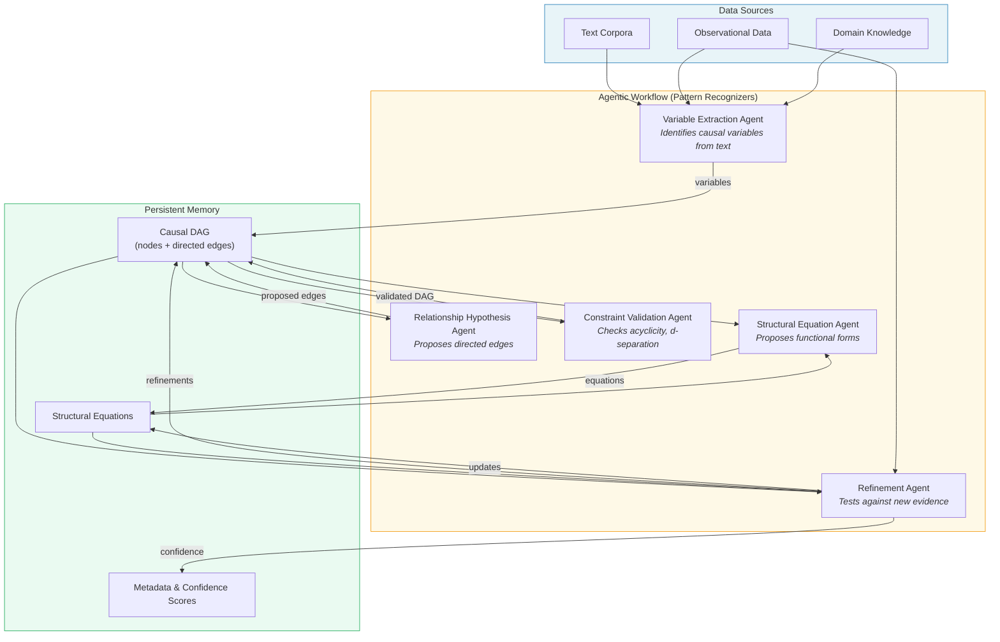
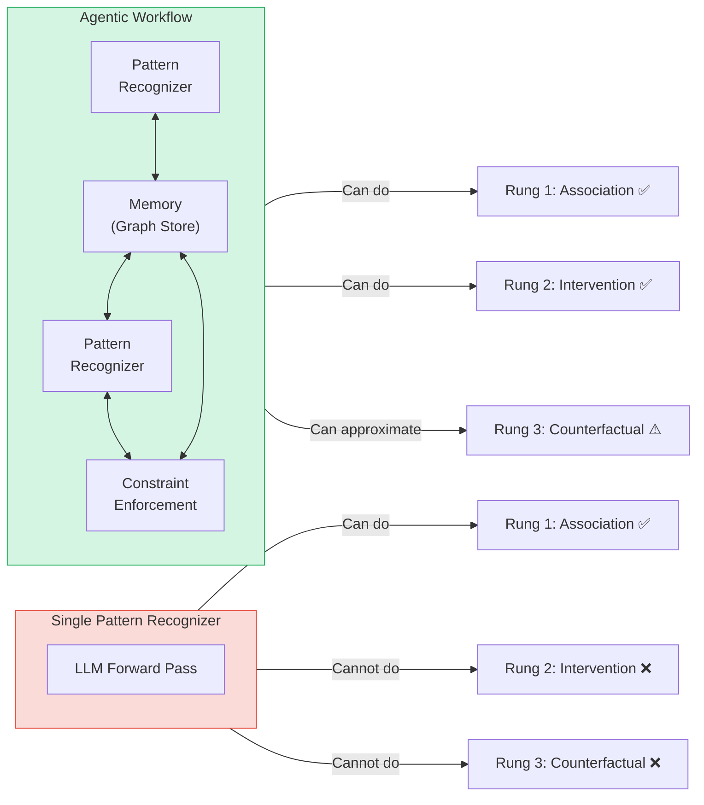
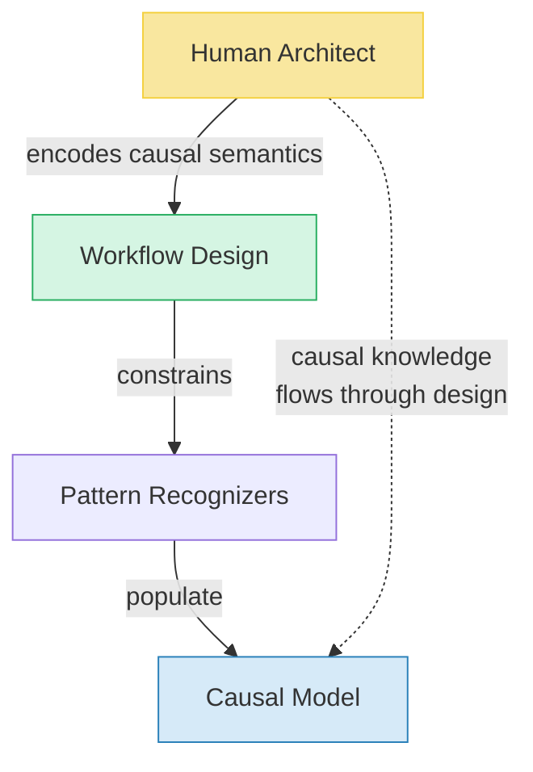
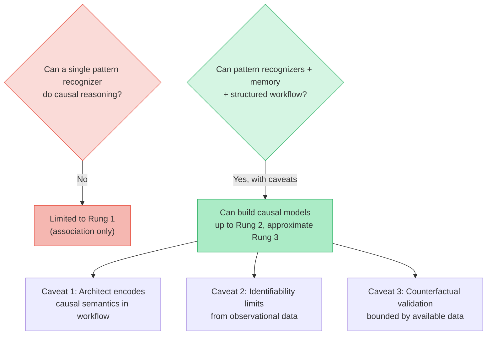

# Causal Reasoning with Agentic Workflows

## Can Pattern Recognizers Simulate Any Decision-Making Process?

Pattern recognizers — systems that learn statistical regularities from data — can approximate many decision-making processes, but not all. Understanding the boundary is critical for designing effective AI systems.

### Where Pattern Recognition Succeeds

Pattern recognizers excel at decisions that are:

- **Correlational**: driven by observable patterns (e.g., credit scoring, medical image diagnosis)
- **Reactive**: clear stimulus-response mappings
- **Interpolative**: decisions within the distribution of training data

Modern deep learning has shown that sufficiently large pattern recognizers can simulate surprisingly complex behaviors, including aspects of reasoning, planning, and language use.

### Where Pattern Recognition Falls Short

Several classes of decision-making resist pure pattern recognition:

**Causal Reasoning (Pearl's Causal Ladder)**

| Rung | Name | Question | Pattern Recognition Alone? |
|------|------|----------|---------------------------|
| 1 | Association | "What is?" (P(Y\|X)) | ✅ Yes |
| 2 | Intervention | "What if I do X?" (P(Y\|do(X))) | ❌ Requires causal model |
| 3 | Counterfactual | "What if X had been different?" | ❌ Requires structural equations |

**Novel/Out-of-Distribution Decisions** — Strategic reasoning in unprecedented situations (e.g., extensive-form game theory) requires model-based reasoning, not just pattern matching.

**Self-Referential Decisions** — Meta-cognition and reasoning about one's own reasoning process are difficult to reduce to pattern matching without recursive architecture.

**Normative Decisions** — Deciding what *should* be done involves value judgments not extractable from data patterns alone (the is-ought gap).

### The Theoretical Boundary

By the universal approximation theorem, a sufficiently large neural network can approximate any computable function. But there is a critical distinction between:

- **Approximating the input-output mapping** of a decision process (often achievable)
- **Actually implementing the decision-making process** itself (may require causal models, symbolic manipulation, or deliberative search)

This maps onto the System 1 / System 2 distinction: pattern recognizers excel at simulating System 1 (fast, associative) but struggle with genuine System 2 (slow, deliberative) reasoning unless augmented with explicit structure.

---

## Building Causal Models from Pattern Recognizers + Memory

The central claim: **yes, you can build causal models from a workflow composed entirely of pattern recognizers and memory** — and the causality emerges from the workflow architecture, not from any single component.

### Why This Works

Each step of causal model construction is individually achievable by pattern recognition + memory:

1. **Identify variables** → pattern recognition over text/data
2. **Hypothesize directional relationships** → pattern recognition over co-occurrence, temporal ordering, interventional language
3. **Store and retrieve the evolving graph** → memory
4. **Test consistency** → pattern matching against constraints (acyclicity, conditional independencies)
5. **Refine via new evidence** → update memory, re-evaluate patterns

### Architecture Overview

### The Key Insight: Structure Through Composition

The fundamental principle is that **structure emerges from the workflow topology, not from any single component**.

This is analogous to how:

- Individual neurons don't "reason," but networks with recurrent connections can
- A single LLM forward pass can't do causal inference, but an agentic loop with memory and structured prompting can iteratively build and validate a DAG

The **memory** is what allows the system to maintain an explicit representation (the DAG) that is fundamentally different from implicit statistical patterns in model weights. The pattern recognizer proposes; memory holds the evolving structure; the workflow enforces constraints.

---

## Critical Caveats

### 1. Causal Assumptions Are Smuggled Through Workflow Design

When the workflow enforces acyclicity, tests for d-separation, or climbs Pearl's ladder rung by rung — the **architect** is encoding causal semantics. The pattern recognizers don't discover that causation requires directed acyclic structure; the designer imposed it.

The system is causal because the architect is causal.

### 2. Identifiability Limits Remain

No amount of pattern recognition over purely observational data can distinguish between Markov-equivalent DAGs without:

- **Domain knowledge** injected into the workflow
- **Interventional data**
- **Strong structural assumptions** (faithfulness, causal sufficiency)

The workflow can build *a* causal model, but guaranteeing it's *the correct* one requires additional grounding.

### 3. Counterfactual Reasoning Is the Hardest Test

Rung 3 requires not just a DAG but structural equations with specific functional forms. A pattern recognizer can propose these ("the relationship is linear and positive"), and memory can store them, but validation of counterfactuals is fundamentally limited by available data.

---

## The Philosophical Punchline

This approach represents **symbol grounding through composition**: individual pattern recognizers are sub-symbolic, but when composed with explicit memory and structured workflows, symbolic-like (and causal) reasoning emerges from the architecture.

This is arguably what biological brains do:

| Brain Component | Agentic Workflow Analog | Role |
|----------------|------------------------|------|
| Cortical columns | LLM / Pattern recognizers | Pattern matching & association |
| Hippocampus | Graph store / Vector DB | Persistent memory & retrieval |
| Prefrontal cortex | Workflow orchestrator (LangGraph) | Planning, constraint enforcement |
| Basal ganglia | Reward / validation agents | Action selection, refinement |

**The causality lives in the workflow architecture and the memory schema, not in the pattern recognizers themselves.** The pattern recognizers are the muscle; the workflow is the skeleton that gives it structure.

The quality of the resulting causal models is therefore bounded by how well the scaffold has been designed — and that remains the hard engineering and epistemological challenge.

---

## Summary

