# Numerical Answer Evaluation using Bi-Encoder and Cross-Encoder

## UML Diagrams and Workflow Documentation

This document provides comprehensive UML diagrams (static class diagrams and sequence diagrams) with detailed explanations of the workflow present in the `numerical_answer_evaluation_using_bi-encoder_and_cross-encoder_demo.ipynb` notebook.

---

## Table of Contents

1. [Architecture Overview](#1-architecture-overview)
2. [Static Class Diagrams](#2-static-class-diagrams)
   - [2.1 Data Models and Dataclasses](#21-data-models-and-dataclasses)
   - [2.2 Core Processing Classes](#22-core-processing-classes)
   - [2.3 Alternative Implementations](#23-alternative-implementations)
   - [2.4 Complete System Architecture](#24-complete-system-architecture)
3. [Sequence Diagrams](#3-sequence-diagrams)
   - [3.1 Main Evaluation Pipeline](#31-main-evaluation-pipeline)
   - [3.2 Number Extraction Flow](#32-number-extraction-flow)
   - [3.3 Two-Stage Semantic Matching](#33-two-stage-semantic-matching)
   - [3.4 Statistical Comparison Flow](#34-statistical-comparison-flow)
   - [3.5 Bi-Encoder Only Matching (Alternative)](#35-bi-encoder-only-matching-alternative)
4. [Component Descriptions](#4-component-descriptions)
5. [Data Flow Diagram](#5-data-flow-diagram)
6. [Bi-Encoder vs Cross-Encoder Comparison](#6-bi-encoder-vs-cross-encoder-comparison)
7. [Configuration Options](#7-configuration-options)

---

## 1. Architecture Overview

The Sentence Transformer-based Numerical Answer Evaluation system uses a **two-stage matching approach** combining the speed of Bi-Encoders with the accuracy of Cross-Encoders to evaluate numerical accuracy in model-generated answers.

### High-Level Architecture

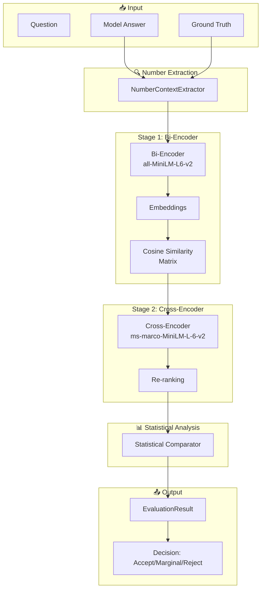

### Key Concept: Two-Stage Retrieval and Re-ranking

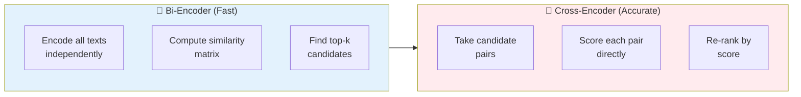

---

## 2. Static Class Diagrams

### 2.1 Data Models and Dataclasses

These classes define the data structures used throughout the pipeline.

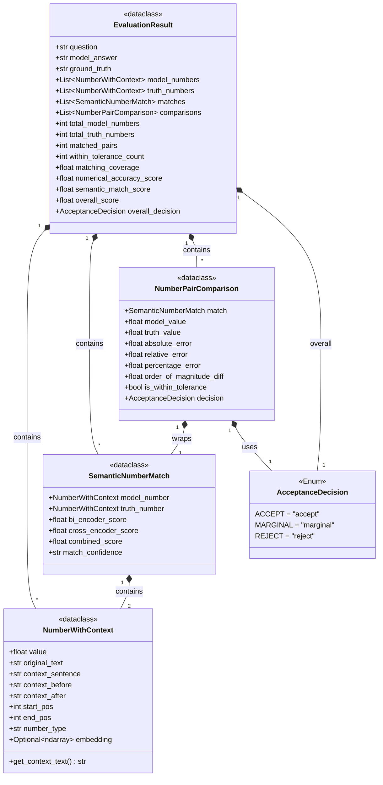

#### Data Model Descriptions

| Class | Purpose | Key Fields |
|-------|---------|------------|
| **NumberWithContext** | A number extracted from text with its surrounding context for embedding | `value`, `context_sentence`, `embedding` |
| **SemanticNumberMatch** | A matched pair with bi-encoder and cross-encoder scores | `bi_encoder_score`, `cross_encoder_score`, `combined_score` |
| **AcceptanceDecision** | Enum for evaluation outcomes | `ACCEPT`, `MARGINAL`, `REJECT` |
| **NumberPairComparison** | Detailed statistical comparison of a matched pair | `relative_error`, `is_within_tolerance` |
| **EvaluationResult** | Complete evaluation result with all metrics | `overall_score`, `overall_decision` |

---

### 2.2 Core Processing Classes

These classes implement the main processing logic.

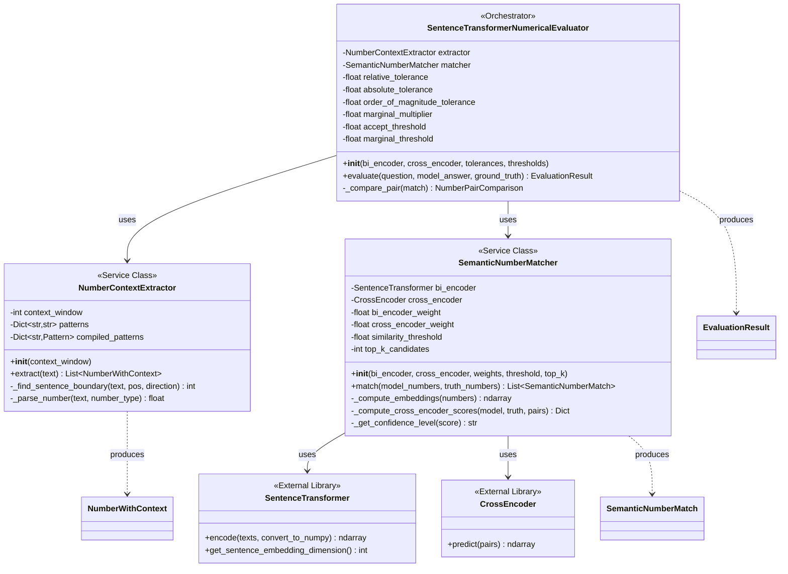

#### Class Responsibilities

| Class | Responsibility | External Dependencies |
|-------|---------------|----------------------|
| **NumberContextExtractor** | Extract numbers with regex patterns and capture surrounding context | None (pure Python) |
| **SemanticNumberMatcher** | Two-stage matching using bi-encoder retrieval + cross-encoder re-ranking | SentenceTransformer, CrossEncoder |
| **SentenceTransformerNumericalEvaluator** | Orchestrate full evaluation pipeline with statistical comparison | Uses all above |

---

### 2.3 Alternative Implementations

The notebook also includes alternative matcher implementations for comparison.

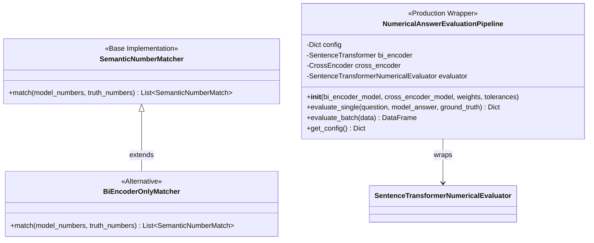

#### Implementation Comparison

| Implementation | Bi-Encoder | Cross-Encoder | Speed | Accuracy |
|---------------|------------|---------------|-------|----------|
| **SemanticNumberMatcher** | ✅ Used for retrieval | ✅ Used for re-ranking | Medium | High |
| **BiEncoderOnlyMatcher** | ✅ Used for matching | ❌ Skipped | Fast | Medium |

---

### 2.4 Complete System Architecture

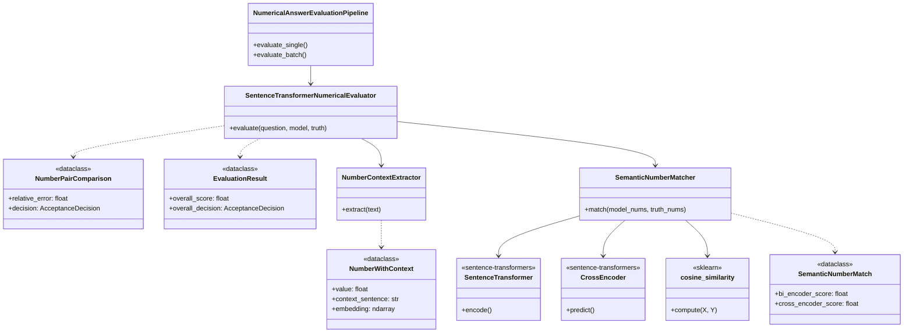

---

## 3. Sequence Diagrams

### 3.1 Main Evaluation Pipeline

This diagram shows the complete evaluation workflow from input to final decision.

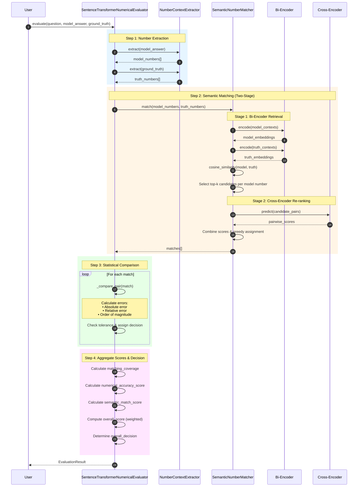

#### Pipeline Steps Explained

| Step | Component | Input | Output | Description |
|------|-----------|-------|--------|-------------|
| 1 | NumberContextExtractor | Text | NumberWithContext[] | Extract numbers with surrounding context |
| 2a | Bi-Encoder | Contexts | Embeddings | Encode text to dense vectors |
| 2b | Cosine Similarity | Embeddings | Similarity Matrix | Find candidate pairs |
| 2c | Cross-Encoder | Candidate Pairs | Pairwise Scores | Re-rank candidates |
| 3 | Comparator | Matches | Comparisons | Calculate error metrics |
| 4 | Decision Logic | All metrics | Decision | Determine accept/marginal/reject |

---

### 3.2 Number Extraction Flow

Detailed flow of how numbers are extracted from text with context.

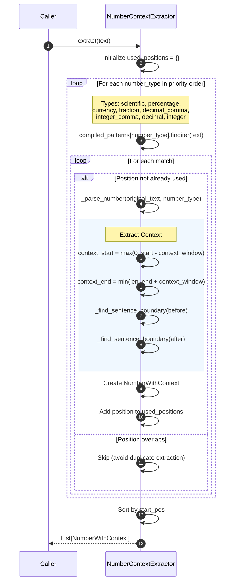

#### Number Parsing Logic

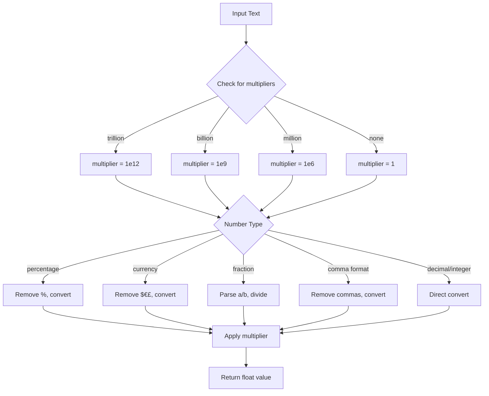

---

### 3.3 Two-Stage Semantic Matching

The core matching algorithm using bi-encoder retrieval and cross-encoder re-ranking.

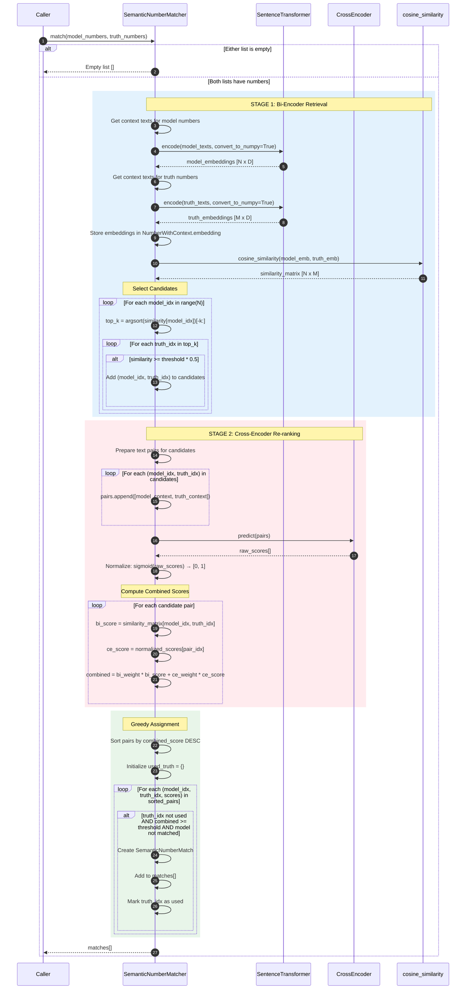

#### Combined Score Calculation

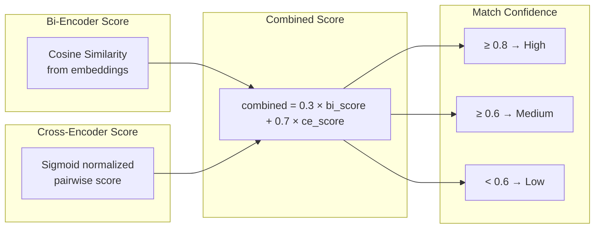

---

### 3.4 Statistical Comparison Flow

How numerical metrics are computed for matched pairs.

```mermaid
sequenceDiagram
    autonumber
    participant Evaluator as SentenceTransformerNumericalEvaluator
    
    Note over Evaluator: For each SemanticNumberMatch
    
    Evaluator->>Evaluator: Extract values
    Note over Evaluator: model_val = match.model_number.value<br/>truth_val = match.truth_number.value
    
    rect rgb(240, 240, 255)
        Note over Evaluator: Calculate Error Metrics
        
        Evaluator->>Evaluator: absolute_error = |model_val - truth_val|
        
        alt truth_val ≠ 0
            Evaluator->>Evaluator: relative_error = absolute_error / |truth_val|
        else truth_val = 0
            Evaluator->>Evaluator: relative_error = ∞ if model_val ≠ 0 else 0
        end
        
        Evaluator->>Evaluator: percentage_error = relative_error × 100
        
        alt model_val > 0 AND truth_val > 0
            Evaluator->>Evaluator: magnitude_diff = |log₁₀(model) - log₁₀(truth)|
        else either is 0
            Evaluator->>Evaluator: magnitude_diff = 0 or ∞
        end
    end
    
    rect rgb(240, 255, 240)
        Note over Evaluator: Check Tolerance
        
        alt relative_error ≤ relative_tolerance OR absolute_error ≤ absolute_tolerance
            alt magnitude_diff ≤ order_magnitude_tolerance
                Evaluator->>Evaluator: is_within_tolerance = True
                Evaluator->>Evaluator: decision = ACCEPT
            else
                Evaluator->>Evaluator: is_within_tolerance = False
            end
        else
            Evaluator->>Evaluator: is_within_tolerance = False
        end
    end
    
    rect rgb(255, 240, 240)
        Note over Evaluator: Determine Decision
        
        alt is_within_tolerance
            Evaluator->>Evaluator: decision = ACCEPT
        else relative_error ≤ tolerance × marginal_multiplier AND magnitude OK
            Evaluator->>Evaluator: decision = MARGINAL
        else
            Evaluator->>Evaluator: decision = REJECT
        end
    end
    
    Evaluator->>Evaluator: Create NumberPairComparison
```

#### Overall Score Calculation

```mermaid
flowchart TD
    subgraph Metrics["Individual Metrics"]
        MC[matching_coverage<br/>= matched / truth_total]
        NA[numerical_accuracy<br/>= within_tol / matched]
        SS[semantic_score<br/>= mean(combined_scores)]
    end
    
    subgraph Weights["Weighted Combination"]
        W["overall_score = 0.4 × coverage + 0.4 × accuracy + 0.2 × semantic"]
    end
    
    subgraph Decision["Final Decision"]
        D1{score ≥ 0.7 AND<br/>accuracy ≥ 0.7?}
        D2{score ≥ 0.5?}
        ACCEPT["✅ ACCEPT"]
        MARGINAL["⚠️ MARGINAL"]
        REJECT["❌ REJECT"]
    end
    
    MC --> W
    NA --> W
    SS --> W
    
    W --> D1
    D1 -->|Yes| ACCEPT
    D1 -->|No| D2
    D2 -->|Yes| MARGINAL
    D2 -->|No| REJECT
```

---

### 3.5 Bi-Encoder Only Matching (Alternative)

Simplified flow when skipping cross-encoder re-ranking.

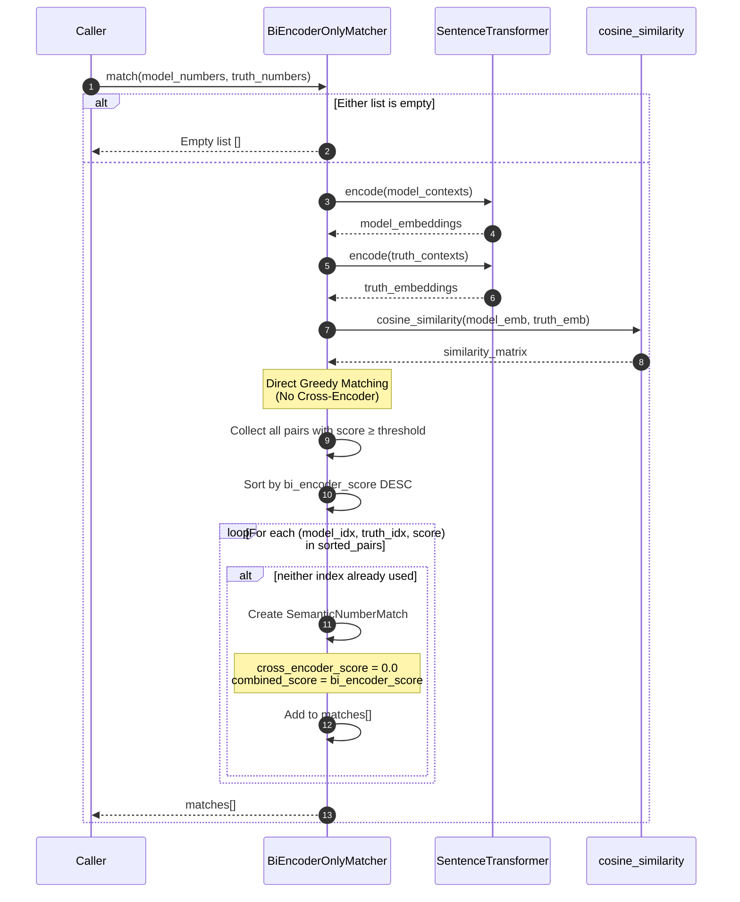

---

## 4. Component Descriptions

### 4.1 NumberContextExtractor

**Purpose**: Extract numerical values from text with rich surrounding context for semantic matching.

**Key Features**:
- Regex-based extraction with priority ordering
- Handles multiple formats: scientific, percentage, currency, fractions
- Captures sentence-level context for better embeddings
- Prevents duplicate extraction with position tracking

**Supported Number Types**:

| Type | Pattern Example | Parsed Value |
|------|-----------------|--------------|
| Scientific | `1.5e10` | 15,000,000,000 |
| Percentage | `15%` | 15.0 |
| Currency | `$2.5 billion` | 2,500,000,000 |
| Fraction | `3/4` | 0.75 |
| Decimal (comma) | `1,234.56` | 1234.56 |
| Integer (comma) | `1,234,567` | 1234567 |
| Decimal | `3.14159` | 3.14159 |
| Integer | `42` | 42 |

---

### 4.2 SemanticNumberMatcher

**Purpose**: Match numbers from model answer to ground truth using semantic similarity.

**Two-Stage Algorithm**:

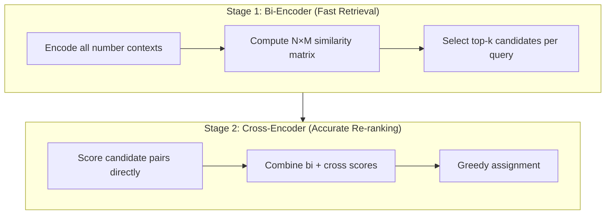

**Configuration Options**:

| Parameter | Default | Description |
|-----------|---------|-------------|
| `bi_encoder_weight` | 0.3 | Weight for bi-encoder score |
| `cross_encoder_weight` | 0.7 | Weight for cross-encoder score |
| `similarity_threshold` | 0.5 | Minimum combined score for match |
| `top_k_candidates` | 3 | Candidates per query from bi-encoder |

---

### 4.3 SentenceTransformerNumericalEvaluator

**Purpose**: Orchestrate full evaluation pipeline with statistical comparison.

**Tolerance Parameters**:

| Parameter | Default | Description |
|-----------|---------|-------------|
| `relative_tolerance` | 0.10 | 10% relative error allowed |
| `absolute_tolerance` | 0.01 | For small numbers near zero |
| `order_of_magnitude_tolerance` | 0.5 | Max log10 difference |
| `marginal_multiplier` | 2.0 | Multiplier for marginal threshold |

**Score Composition**:

| Component | Weight | Description |
|-----------|--------|-------------|
| Matching Coverage | 40% | % of truth numbers matched |
| Numerical Accuracy | 40% | % of matches within tolerance |
| Semantic Score | 20% | Average combined similarity score |

---

### 4.4 NumericalAnswerEvaluationPipeline

**Purpose**: Production-ready wrapper with batch processing support.

**Features**:
- Configurable model selection
- Single and batch evaluation modes
- Structured JSON output
- Configuration management

---

## 5. Data Flow Diagram

```mermaid
flowchart LR
    subgraph Inputs
        MA["Model Answer<br/>(text)"]
        GT["Ground Truth<br/>(text)"]
    end
    
    subgraph Extraction["Number Extraction"]
        E1["Extract from<br/>Model Answer"]
        E2["Extract from<br/>Ground Truth"]
    end
    
    subgraph Numbers["Extracted Numbers"]
        MN["Model Numbers<br/>(with context)"]
        TN["Truth Numbers<br/>(with context)"]
    end
    
    subgraph BiEncoder["Bi-Encoder Stage"]
        EMB["Generate<br/>Embeddings"]
        SIM["Similarity<br/>Matrix"]
        CAND["Top-k<br/>Candidates"]
    end
    
    subgraph CrossEncoder["Cross-Encoder Stage"]
        PAIR["Pair<br/>Scoring"]
        RANK["Re-ranking"]
        MATCH["Final<br/>Matches"]
    end
    
    subgraph Comparison["Statistical Comparison"]
        STATS["Error<br/>Metrics"]
        TOL["Tolerance<br/>Check"]
    end
    
    subgraph Output["Final Output"]
        SCORES["Scores"]
        DEC["Decision"]
        RESULT["EvaluationResult"]
    end
    
    MA --> E1
    GT --> E2
    E1 --> MN
    E2 --> TN
    
    MN --> EMB
    TN --> EMB
    EMB --> SIM
    SIM --> CAND
    
    CAND --> PAIR
    PAIR --> RANK
    RANK --> MATCH
    
    MATCH --> STATS
    STATS --> TOL
    
    TOL --> SCORES
    SCORES --> DEC
    DEC --> RESULT
```

---

## 6. Bi-Encoder vs Cross-Encoder Comparison

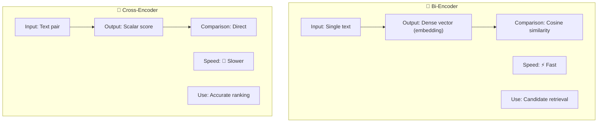

### Detailed Comparison

| Aspect | Bi-Encoder | Cross-Encoder |
|--------|------------|---------------|
| **Architecture** | Encode texts separately | Encode pair together |
| **Output** | Vector embeddings | Relevance score |
| **Comparison** | Cosine similarity | Direct output |
| **Complexity** | O(N + M) encoding | O(N × M) pairs |
| **Speed** | Very fast | Slower |
| **Accuracy** | Good | Excellent |
| **Best For** | Candidate retrieval | Final ranking |
| **Model Used** | all-MiniLM-L6-v2 | ms-marco-MiniLM-L-6-v2 |

### Why Two Stages?

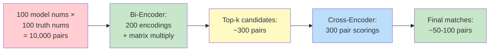

**Without two stages**: 10,000 cross-encoder calls (slow)
**With two stages**: 200 bi-encoder calls + 300 cross-encoder calls (fast)

---

## 7. Configuration Options

### Model Selection Guide

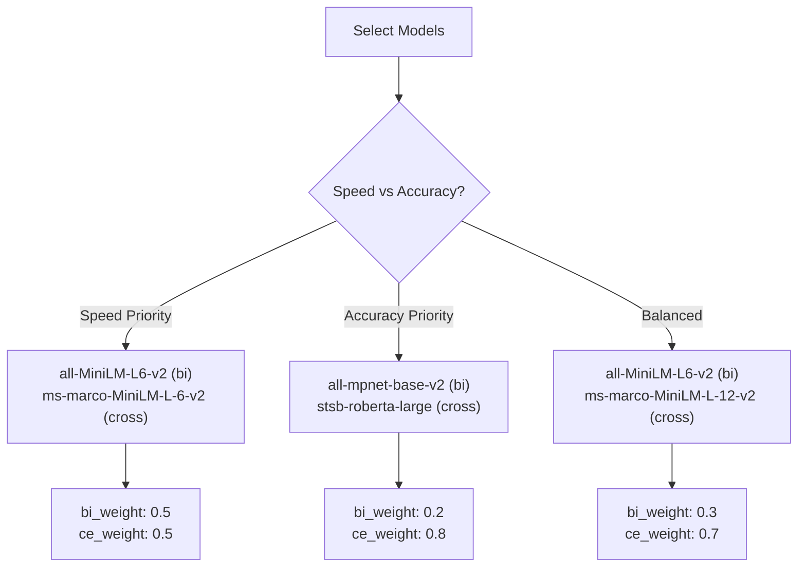

### Tolerance Recommendations by Domain

| Domain | relative_tolerance | absolute_tolerance | order_magnitude_tolerance |
|--------|-------------------|-------------------|--------------------------|
| Financial | 0.01 - 0.05 | 0.01 | 0.1 |
| Scientific | 0.005 - 0.02 | 0.001 | 0.1 |
| General Knowledge | 0.10 - 0.15 | 1.0 | 0.5 |
| Weather/Temperature | 0.05 | 1.0 - 2.0 | 0.3 |
| Population | 0.05 - 0.10 | 1000 | 0.5 |

### Weight Configuration Effects

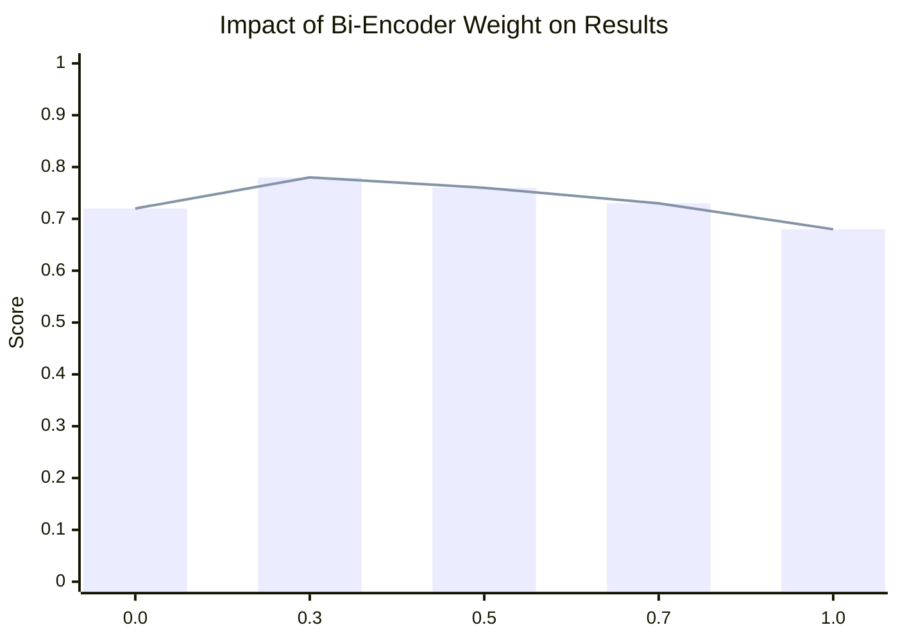

| Configuration | Bi-Encoder Weight | Cross-Encoder Weight | Best For |
|--------------|-------------------|---------------------|----------|
| Cross-Encoder Only | 0.0 | 1.0 | Maximum accuracy |
| Default | 0.3 | 0.7 | Balanced |
| Equal | 0.5 | 0.5 | General use |
| Bi-Encoder Heavy | 0.7 | 0.3 | Speed priority |
| Bi-Encoder Only | 1.0 | 0.0 | Maximum speed |

---

## Summary

The Sentence Transformer-based Numerical Answer Evaluation system provides a robust, fast, and deterministic approach to evaluating numerical accuracy:

### Key Components

1. **NumberContextExtractor**: Regex-based extraction with rich context capture
2. **SemanticNumberMatcher**: Two-stage bi-encoder + cross-encoder matching
3. **SentenceTransformerNumericalEvaluator**: Full pipeline with statistical comparison
4. **NumericalAnswerEvaluationPipeline**: Production-ready wrapper

### Pipeline Flow

```
Input → Extract Numbers → Bi-Encoder Retrieval → Cross-Encoder Re-ranking → Statistical Comparison → Decision
```

### Advantages

| Feature | Benefit |
|---------|---------|
| **Deterministic** | Same inputs always produce same outputs |
| **Fast** | Process hundreds of evaluations per second |
| **Local** | No API costs, no data privacy concerns |
| **Configurable** | Tune weights and thresholds per domain |
| **Accurate** | Two-stage matching captures semantic meaning |

### Comparison with LLM-as-Judge

| Aspect | Sentence Transformers | LLM-as-Judge |
|--------|----------------------|--------------|
| Speed | ⚡ Very Fast | 🐢 Slow |
| Cost | Free (local) | API costs |
| Consistency | Deterministic | Variable |
| Context Understanding | Pattern-based | Nuanced |
| Explainability | Scores only | Can explain reasoning |
| Offline Capable | ✅ Yes | ❌ No |


