# Numerical Answer Evaluation using Deterministic Heuristics

## UML Diagrams and Workflow Documentation

This document provides comprehensive UML diagrams (static class diagrams and sequence diagrams) with detailed explanations of the workflow present in the `numerical_answer_evaluation_using_deterministic_heuristics.ipynb` notebook.

---

## Table of Contents

1. [Architecture Overview](#1-architecture-overview)
2. [Static Class Diagrams](#2-static-class-diagrams)
   - [2.1 Data Models and Dataclasses](#21-data-models-and-dataclasses)
   - [2.2 Core Processing Classes](#22-core-processing-classes)
   - [2.3 Complete System Architecture](#23-complete-system-architecture)
3. [Sequence Diagrams](#3-sequence-diagrams)
   - [3.1 Main Evaluation Pipeline](#31-main-evaluation-pipeline)
   - [3.2 Number Extraction Flow](#32-number-extraction-flow)
   - [3.3 Number Matching Flow](#33-number-matching-flow)
   - [3.4 Statistical Comparison Flow](#34-statistical-comparison-flow)
   - [3.5 Overall Decision Flow](#35-overall-decision-flow)
4. [Component Descriptions](#4-component-descriptions)
5. [Data Flow Diagram](#5-data-flow-diagram)
6. [Matching Strategies](#6-matching-strategies)
7. [Configuration and Thresholds](#7-configuration-and-thresholds)

---

## 1. Architecture Overview

The Deterministic Heuristics-based Numerical Answer Evaluation system uses **pure rule-based methods** (regex for extraction, keyword matching for pairing, and mathematical formulas for comparison) to evaluate numerical accuracy in model-generated answers without requiring any machine learning models or external APIs.

### High-Level Architecture

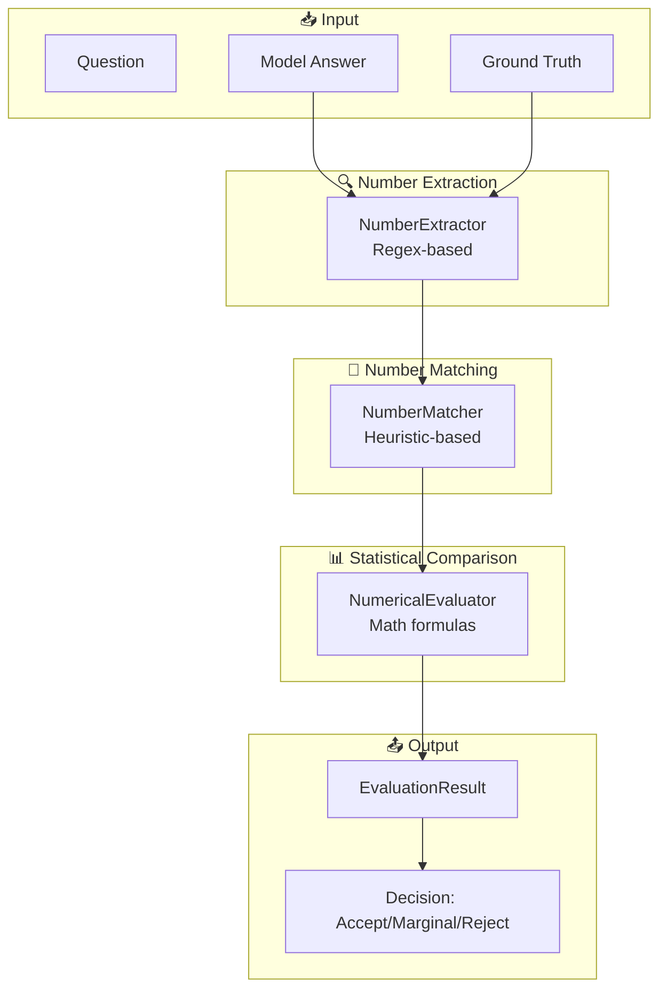

### Key Characteristics

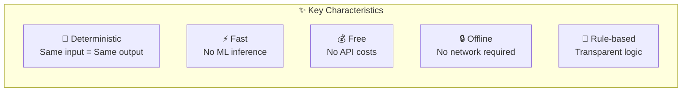

---

## 2. Static Class Diagrams

### 2.1 Data Models and Dataclasses

These classes define the data structures used throughout the pipeline.

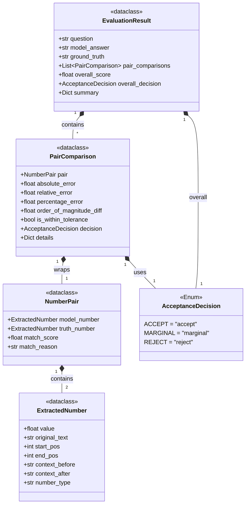

#### Data Model Descriptions

| Class | Purpose | Key Fields |
|-------|---------|------------|
| **ExtractedNumber** | A number extracted from text with position and context | `value`, `original_text`, `number_type` |
| **NumberPair** | A matched pair of numbers with match confidence | `model_number`, `truth_number`, `match_score` |
| **AcceptanceDecision** | Enum for evaluation outcomes | `ACCEPT`, `MARGINAL`, `REJECT` |
| **PairComparison** | Statistical comparison result for a pair | `relative_error`, `is_within_tolerance` |
| **EvaluationResult** | Complete evaluation with all comparisons | `overall_score`, `overall_decision` |

---

### 2.2 Core Processing Classes

These classes implement the main processing logic using deterministic heuristics.

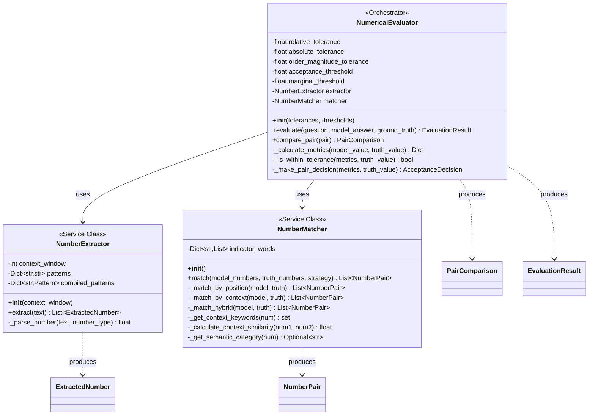

#### Class Responsibilities

| Class | Responsibility | Method |
|-------|---------------|--------|
| **NumberExtractor** | Extract numbers from text using regex patterns | Pure regex matching |
| **NumberMatcher** | Match numbers using position, context, or hybrid strategy | Keyword overlap, Jaccard similarity |
| **NumericalEvaluator** | Orchestrate evaluation with statistical comparison | Mathematical formulas |

---

### 2.3 Complete System Architecture

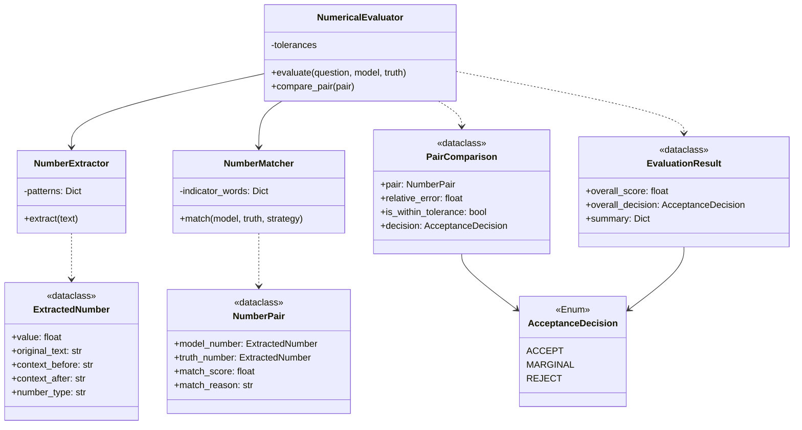

---

## 3. Sequence Diagrams

### 3.1 Main Evaluation Pipeline

This diagram shows the complete evaluation workflow from input to final decision.

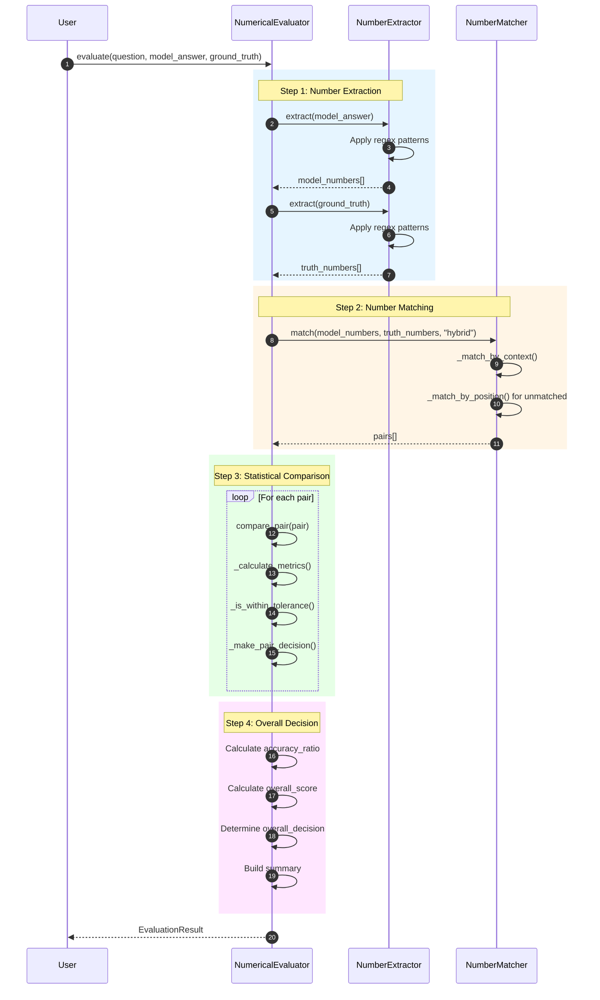

#### Pipeline Steps Explained

| Step | Component | Input | Output | Method |
|------|-----------|-------|--------|--------|
| 1 | NumberExtractor | Text | ExtractedNumber[] | Regex pattern matching |
| 2 | NumberMatcher | Two number lists | NumberPair[] | Context similarity + position |
| 3 | NumericalEvaluator | NumberPair | PairComparison | Mathematical formulas |
| 4 | NumericalEvaluator | All comparisons | EvaluationResult | Threshold-based decision |

---

### 3.2 Number Extraction Flow

Detailed flow of how numbers are extracted from text using regex patterns.

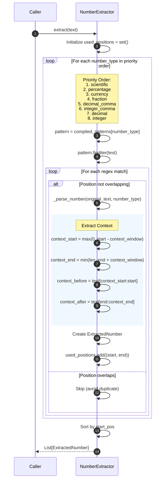

#### Regex Patterns

```mermaid
flowchart TD
    subgraph Patterns["📐 Regex Patterns (Priority Order)"]
        P1["1️⃣ Scientific: [-+]?\d+\.?\d*[eE][-+]?\d+<br/>Example: 1.5e6, 3.2E-4"]
        P2["2️⃣ Percentage: [-+]?\d+\.?\d*\s*%<br/>Example: 15%, 23.4%"]
        P3["3️⃣ Currency: [$€£¥₹]\s*\d...<br/>Example: $100, €50.00"]
        P4["4️⃣ Fraction: \d+\s*/\s*\d+<br/>Example: 1/2, 3/4"]
        P5["5️⃣ Decimal w/comma: [-+]?\d{1,3}(?:,\d{3})*\.\d+<br/>Example: 1,234.56"]
        P6["6️⃣ Integer w/comma: [-+]?\d{1,3}(?:,\d{3})+<br/>Example: 1,234,567"]
        P7["7️⃣ Decimal: [-+]?\d+\.\d+<br/>Example: 3.14"]
        P8["8️⃣ Integer: [-+]?\d+<br/>Example: 42"]
        
        P1 --> P2 --> P3 --> P4 --> P5 --> P6 --> P7 --> P8
    end
```

#### Number Parsing Logic

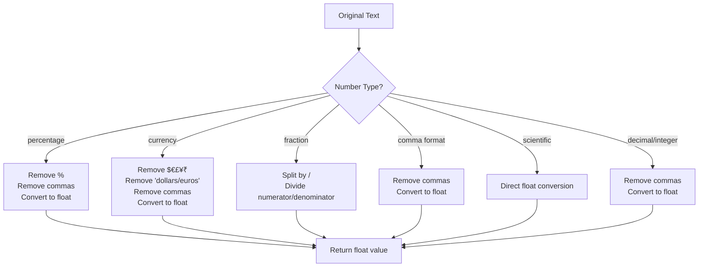

---

### 3.3 Number Matching Flow

How numbers from model answer and ground truth are matched using heuristics.

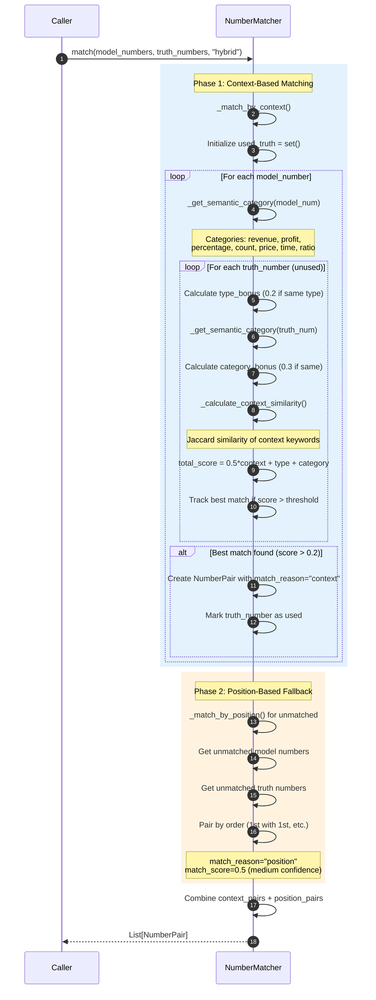

#### Context Similarity Calculation

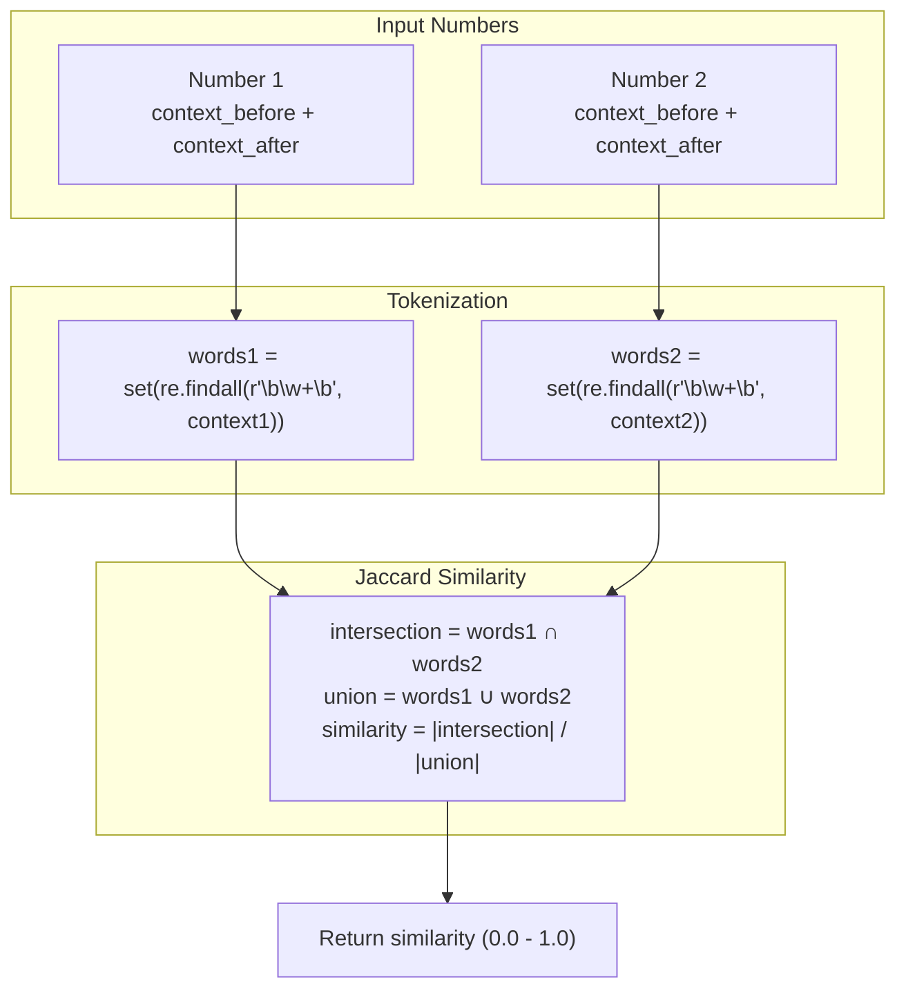

#### Semantic Category Detection

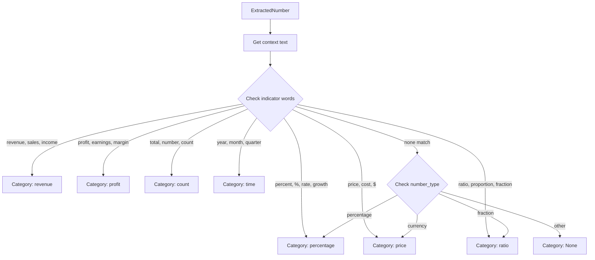

---

### 3.4 Statistical Comparison Flow

How numerical metrics are computed for matched pairs.

```mermaid
sequenceDiagram
    autonumber
    participant Evaluator as NumericalEvaluator
    
    Note over Evaluator: For each NumberPair
    
    Evaluator->>Evaluator: Extract values
    Note over Evaluator: model_val = pair.model_number.value<br/>truth_val = pair.truth_number.value
    
    Evaluator->>Evaluator: _calculate_metrics(model_val, truth_val)
    
    rect rgb(240, 240, 255)
        Note over Evaluator: Calculate Error Metrics
        
        Evaluator->>Evaluator: absolute_error = |model_val - truth_val|
        
        alt truth_val ≠ 0
            Evaluator->>Evaluator: relative_error = absolute_error / |truth_val|
        else truth_val = 0
            Evaluator->>Evaluator: relative_error = ∞ if model_val ≠ 0 else 0
        end
        
        Evaluator->>Evaluator: percentage_error = relative_error × 100
        
        alt model_val ≠ 0 AND truth_val ≠ 0
            Evaluator->>Evaluator: magnitude_diff = |log₁₀(|model|) - log₁₀(|truth|)|
        else either is 0
            Evaluator->>Evaluator: magnitude_diff = 0 if both 0 else ∞
        end
    end
    
    Evaluator->>Evaluator: _is_within_tolerance(metrics, truth_val)
    
    rect rgb(240, 255, 240)
        Note over Evaluator: Check Tolerance
        
        alt |truth_val| < 1.0
            Note over Evaluator: Use absolute tolerance for small numbers
            Evaluator->>Evaluator: within = absolute_error ≤ absolute_tolerance
        else |truth_val| ≥ 1.0
            Note over Evaluator: Use relative tolerance for larger numbers
            Evaluator->>Evaluator: within = relative_error ≤ relative_tolerance<br/>AND magnitude_diff ≤ order_magnitude_tolerance
        end
    end
    
    Evaluator->>Evaluator: _make_pair_decision(metrics, truth_val)
    
    rect rgb(255, 240, 240)
        Note over Evaluator: Make Decision
        
        alt is_within_tolerance
            Evaluator->>Evaluator: decision = ACCEPT
        else relative_error ≤ tolerance × 2
            Evaluator->>Evaluator: decision = MARGINAL
        else
            Evaluator->>Evaluator: decision = REJECT
        end
    end
    
    Evaluator->>Evaluator: Create PairComparison
```

#### Metrics Calculation Formulas

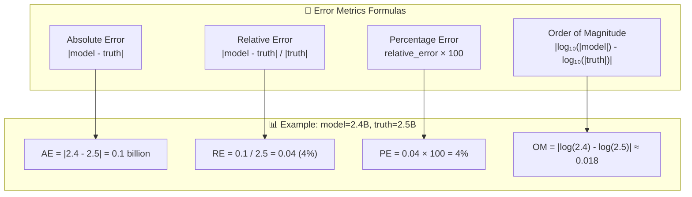

---

### 3.5 Overall Decision Flow

How the final evaluation decision is made.

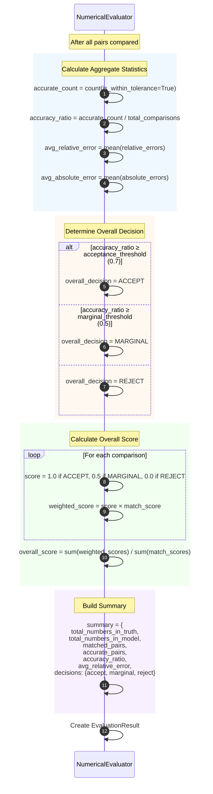

#### Decision Thresholds

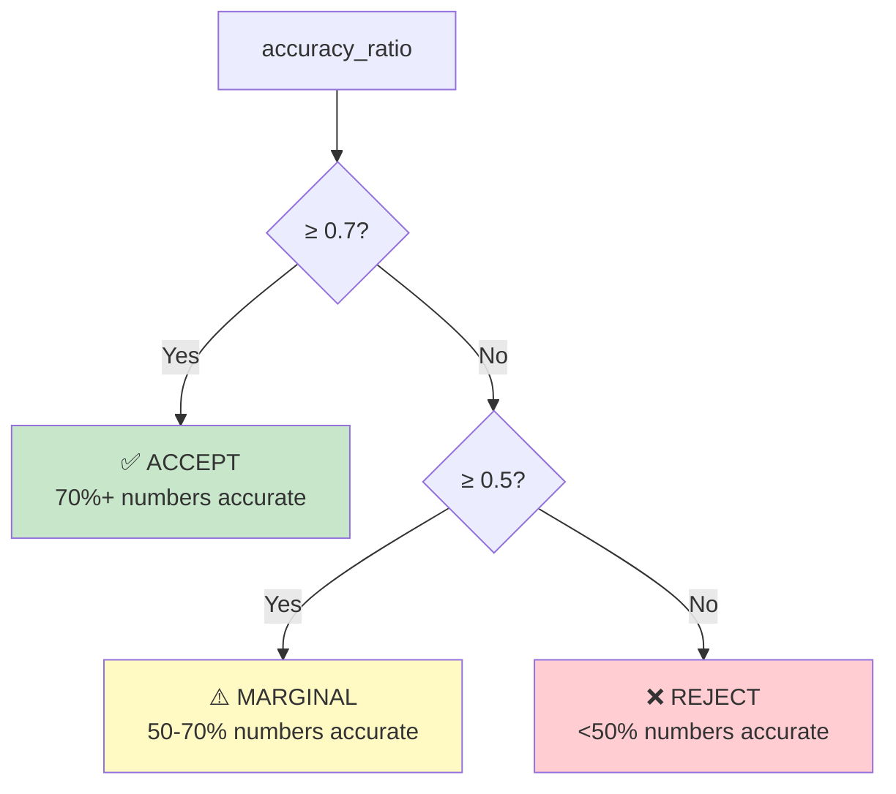

---

## 4. Component Descriptions

### 4.1 NumberExtractor

**Purpose**: Extract numerical values from text using regex patterns.

**Key Features**:
- Priority-ordered pattern matching to avoid overlaps
- Handles multiple formats: integers, decimals, percentages, scientific notation, currency, fractions
- Captures surrounding context for semantic matching
- Tracks positions to prevent duplicate extraction

**Supported Number Types**:

| Type | Regex Pattern | Example |
|------|--------------|---------|
| Scientific | `[-+]?\d+\.?\d*[eE][-+]?\d+` | `1.5e6`, `3.2E-4` |
| Percentage | `[-+]?\d+\.?\d*\s*%` | `15%`, `23.4%` |
| Currency | `[$€£¥₹]\s*\d...` | `$100`, `€50.00` |
| Fraction | `\d+\s*/\s*\d+` | `1/2`, `3/4` |
| Decimal (comma) | `[-+]?\d{1,3}(?:,\d{3})*\.\d+` | `1,234.56` |
| Integer (comma) | `[-+]?\d{1,3}(?:,\d{3})+` | `1,234,567` |
| Decimal | `[-+]?\d+\.\d+` | `3.14` |
| Integer | `[-+]?\d+` | `42` |

---

### 4.2 NumberMatcher

**Purpose**: Match numbers from model answer to ground truth using heuristic strategies.

**Matching Strategies**:

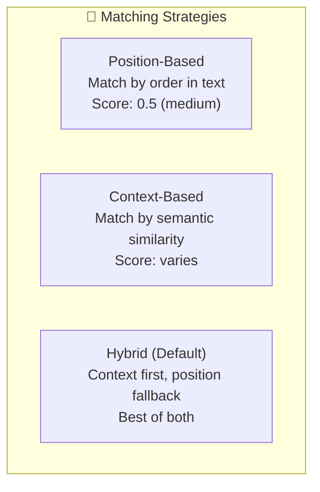

**Scoring Components**:

| Component | Weight | Description |
|-----------|--------|-------------|
| Context Similarity | 50% | Jaccard similarity of surrounding words |
| Type Bonus | +0.2 | Same number_type (e.g., percentage) |
| Category Bonus | +0.3 | Same semantic category (e.g., revenue) |

**Indicator Words for Categories**:

| Category | Keywords |
|----------|----------|
| Revenue | revenue, sales, income |
| Profit | profit, earnings, margin, net income |
| Percentage | percent, %, rate, growth, increase, decrease |
| Count | total, number, count, employees, users |
| Price | price, cost, value, $, dollar, euro |
| Time | year, month, quarter, q1, q2, q3, q4 |
| Ratio | ratio, proportion, fraction |

---

### 4.3 NumericalEvaluator

**Purpose**: Orchestrate full evaluation pipeline with statistical comparison.

**Configuration Parameters**:

| Parameter | Default | Description |
|-----------|---------|-------------|
| `relative_tolerance` | 0.10 | 10% relative error allowed |
| `absolute_tolerance` | 0.01 | For small numbers near zero |
| `order_magnitude_tolerance` | 1.0 | Max log10 difference |
| `acceptance_threshold` | 0.70 | 70% accurate for ACCEPT |
| `marginal_threshold` | 0.50 | 50% accurate for MARGINAL |

**Computed Metrics**:

| Metric | Formula | Purpose |
|--------|---------|---------|
| Absolute Error | \|model - truth\| | Raw difference |
| Relative Error | \|model - truth\| / \|truth\| | Proportional difference |
| Percentage Error | Relative Error × 100 | Human-readable |
| Order of Magnitude | \|log₁₀(model) - log₁₀(truth)\| | Scale check |

---

## 5. Data Flow Diagram

```mermaid
flowchart LR
    subgraph Inputs
        MA["Model Answer<br/>(text)"]
        GT["Ground Truth<br/>(text)"]
    end
    
    subgraph Extraction["Number Extraction"]
        E1["Regex<br/>Matching"]
        E2["Context<br/>Capture"]
    end
    
    subgraph Numbers["Extracted Numbers"]
        MN["Model Numbers<br/>(with context)"]
        TN["Truth Numbers<br/>(with context)"]
    end
    
    subgraph Matching["Number Matching"]
        CTX["Context-Based<br/>Matching"]
        POS["Position-Based<br/>Fallback"]
    end
    
    subgraph Pairs["Matched Pairs"]
        MP["NumberPair[]<br/>(with scores)"]
    end
    
    subgraph Comparison["Statistical Comparison"]
        CALC["Calculate<br/>Errors"]
        TOL["Check<br/>Tolerance"]
        DEC["Make<br/>Decision"]
    end
    
    subgraph Output["Final Output"]
        COMP["PairComparison[]"]
        SCORE["Overall Score"]
        DECISION["Overall Decision"]
        RESULT["EvaluationResult"]
    end
    
    MA --> E1
    GT --> E1
    E1 --> E2
    E2 --> MN
    E2 --> TN
    
    MN --> CTX
    TN --> CTX
    CTX --> POS
    POS --> MP
    
    MP --> CALC
    CALC --> TOL
    TOL --> DEC
    DEC --> COMP
    
    COMP --> SCORE
    COMP --> DECISION
    SCORE --> RESULT
    DECISION --> RESULT
```

---

## 6. Matching Strategies

### Strategy Comparison

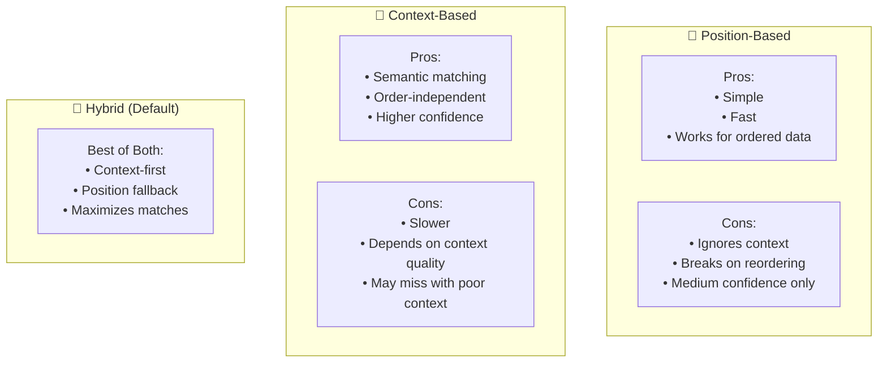

### When to Use Each Strategy

| Strategy | Best For | Avoid When |
|----------|----------|------------|
| **Position** | Structured data, tables, lists | Text is reordered |
| **Context** | Natural language, varied phrasing | Poor/minimal context |
| **Hybrid** | Most cases, general use | N/A (recommended default) |

---

## 7. Configuration and Thresholds

### Tolerance Recommendations by Domain

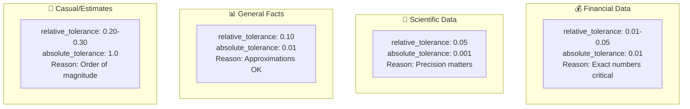

### Threshold Configuration Table

| Use Case | relative_tolerance | absolute_tolerance | acceptance_threshold |
|----------|-------------------|-------------------|---------------------|
| Financial Reporting | 1-2% | 0.01 | 90% |
| Scientific Calculations | 5% | 0.001 | 80% |
| General Fact-Checking | 10% | 0.01 | 70% |
| Casual Comparisons | 20-30% | 1.0 | 60% |

### Decision Matrix

```mermaid
flowchart LR
    subgraph Input["Accuracy Ratio"]
        I1["≥ 70%"]
        I2["50-69%"]
        I3["< 50%"]
    end
    
    subgraph Decision["Decision"]
        D1["✅ ACCEPT"]
        D2["⚠️ MARGINAL"]
        D3["❌ REJECT"]
    end
    
    I1 --> D1
    I2 --> D2
    I3 --> D3
    
    style D1 fill:#c8e6c9
    style D2 fill:#fff9c4
    style D3 fill:#ffcdd2
```

---

## Summary

The Deterministic Heuristics-based Numerical Answer Evaluation system provides a fast, transparent, and cost-free approach to evaluating numerical accuracy:

### Key Components

1. **NumberExtractor**: Regex-based extraction with position tracking
2. **NumberMatcher**: Heuristic matching using context similarity and position
3. **NumericalEvaluator**: Mathematical comparison with configurable tolerances

### Pipeline Flow

```
Input → Regex Extraction → Heuristic Matching → Statistical Comparison → Decision
```

### Advantages

| Feature | Benefit |
|---------|---------|
| **Deterministic** | Same inputs always produce same outputs |
| **Fast** | No ML inference, pure computation |
| **Free** | No API costs or subscriptions |
| **Offline** | Works without network connection |
| **Transparent** | Clear, auditable logic |
| **Configurable** | Tunable tolerances per domain |

### Comparison with Other Approaches

| Aspect | Deterministic Heuristics | Sentence Transformers | LLM-as-Judge |
|--------|-------------------------|----------------------|--------------|
| Speed | ⚡⚡⚡ Fastest | ⚡⚡ Fast | ⚡ Slow |
| Cost | Free | Free (local) | API costs |
| Accuracy | Good for structured | Better semantic | Best nuanced |
| Consistency | Perfect | High | Variable |
| Setup | Minimal | Model download | API key |
| Explainability | Full | Scores only | Can explain |

### When to Use

✅ **Recommended For**:
- High-throughput evaluation pipelines
- Structured numerical data (tables, lists)
- Cost-sensitive applications
- Offline/air-gapped environments
- Simple numerical comparisons

⚠️ **Limitations**:
- Limited semantic understanding
- Relies on context keywords
- May struggle with complex paraphrasing
- Position matching can break on reordering


