# Numerical Answer Evaluation using LLM-as-Judge

## UML Diagrams and Workflow Documentation

This document provides comprehensive UML diagrams (static class diagrams and sequence diagrams) with detailed explanations of the workflow present in the `numerical_answer_evaluation_using_llm-as-judge_demo.ipynb` notebook.

---

## Table of Contents

1. [Architecture Overview](#1-architecture-overview)
2. [Static Class Diagrams](#2-static-class-diagrams)
   - [2.1 Pydantic Data Models](#21-pydantic-data-models)
   - [2.2 Core Processing Classes](#22-core-processing-classes)
   - [2.3 Result Dataclasses](#23-result-dataclasses)
   - [2.4 Complete System Architecture](#24-complete-system-architecture)
3. [Sequence Diagrams](#3-sequence-diagrams)
   - [3.1 Main Evaluation Pipeline](#31-main-evaluation-pipeline)
   - [3.2 Number Extraction Flow](#32-number-extraction-flow)
   - [3.3 Number Matching Flow](#33-number-matching-flow)
   - [3.4 Statistical Comparison Flow](#34-statistical-comparison-flow)
   - [3.5 LLM Judge Decision Flow](#35-llm-judge-decision-flow)
4. [Component Descriptions](#4-component-descriptions)
5. [Data Flow Diagram](#5-data-flow-diagram)
6. [Error Handling Strategy](#6-error-handling-strategy)

---

## 1. Architecture Overview

The LLM-as-Judge Numerical Answer Evaluation system is designed to evaluate the numerical accuracy of model-generated answers by comparing them to ground truth. The system leverages Large Language Models (LLMs) for semantic understanding while combining statistical metrics for quantitative assessment.

### High-Level Architecture

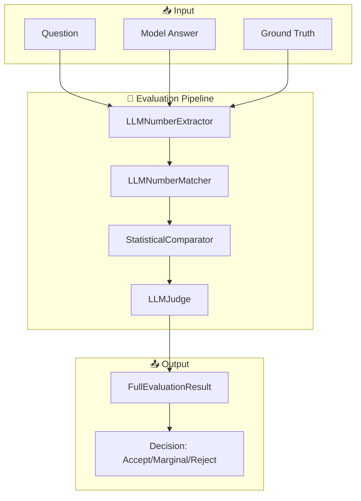

---

## 2. Static Class Diagrams

### 2.1 Pydantic Data Models

These models define the structured data schemas used for LLM inputs and outputs.

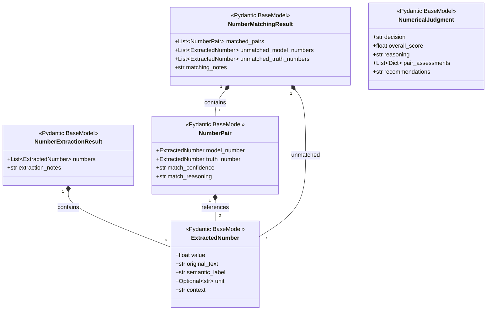

#### Model Descriptions

| Model | Purpose | Key Fields |
|-------|---------|------------|
| **ExtractedNumber** | Represents a single number extracted from text | `value`, `semantic_label`, `context` |
| **NumberExtractionResult** | Contains all extracted numbers from a text | `numbers`, `extraction_notes` |
| **NumberPair** | A matched pair of numbers for comparison | `model_number`, `truth_number`, `match_confidence` |
| **NumberMatchingResult** | Result of the matching process | `matched_pairs`, `unmatched_*_numbers` |
| **NumericalJudgment** | Final judgment from the LLM judge | `decision`, `overall_score`, `reasoning` |

---

### 2.2 Core Processing Classes

These classes implement the main processing logic of the evaluation pipeline.

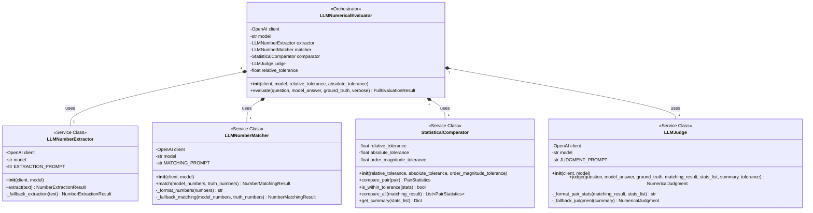

#### Class Responsibilities

| Class | Responsibility | LLM-Powered |
|-------|---------------|-------------|
| **LLMNumberExtractor** | Extract numbers with semantic labels from text | ✅ Yes |
| **LLMNumberMatcher** | Match corresponding numbers based on semantic meaning | ✅ Yes |
| **StatisticalComparator** | Compute error metrics for matched pairs | ❌ No |
| **LLMJudge** | Make final accept/marginal/reject decision | ✅ Yes |
| **LLMNumericalEvaluator** | Orchestrate the entire evaluation pipeline | N/A (Orchestrator) |

---

### 2.3 Result Dataclasses

These dataclasses store intermediate and final results.

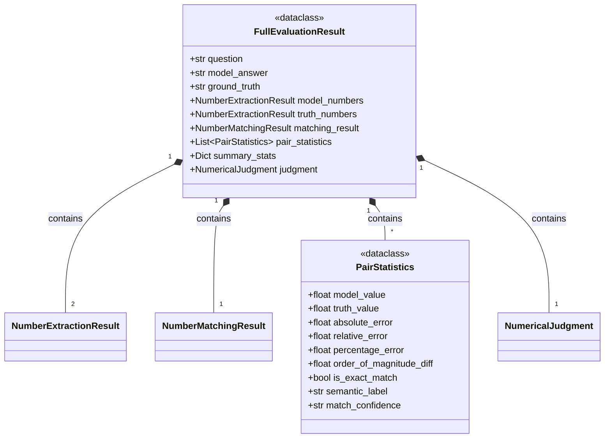

---

### 2.4 Complete System Architecture

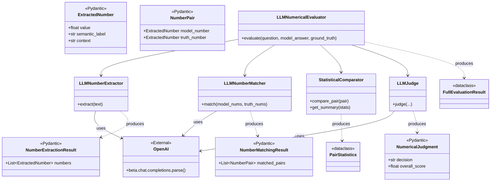

---

## 3. Sequence Diagrams

### 3.1 Main Evaluation Pipeline

This diagram shows the complete evaluation workflow from input to final judgment.

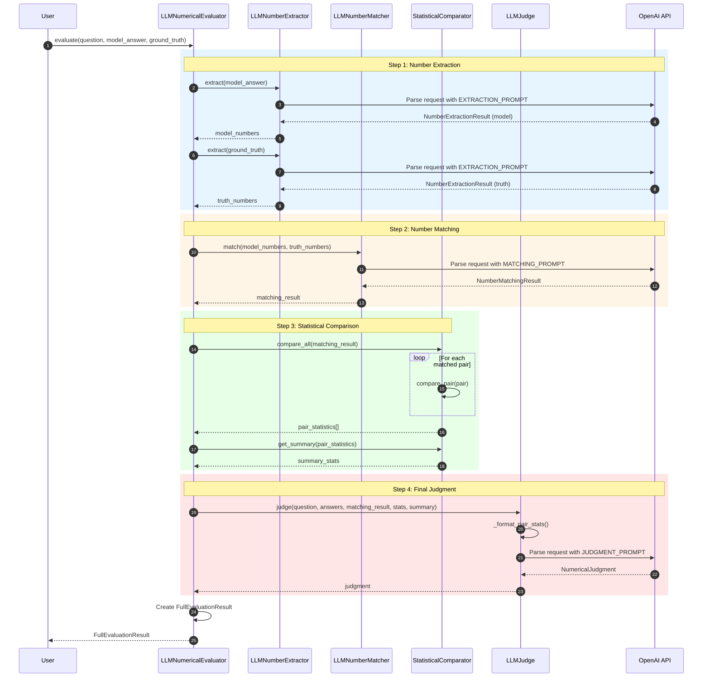

#### Pipeline Steps Explained

| Step | Component | Input | Output | Description |
|------|-----------|-------|--------|-------------|
| 1a | LLMNumberExtractor | Model Answer | NumberExtractionResult | Extract numbers with semantic context from model answer |
| 1b | LLMNumberExtractor | Ground Truth | NumberExtractionResult | Extract numbers with semantic context from ground truth |
| 2 | LLMNumberMatcher | Two NumberExtractionResults | NumberMatchingResult | Match corresponding numbers semantically |
| 3 | StatisticalComparator | NumberMatchingResult | PairStatistics[] + Summary | Calculate error metrics |
| 4 | LLMJudge | All previous results | NumericalJudgment | Make final decision with reasoning |

---

### 3.2 Number Extraction Flow

Detailed flow of how numbers are extracted from text.

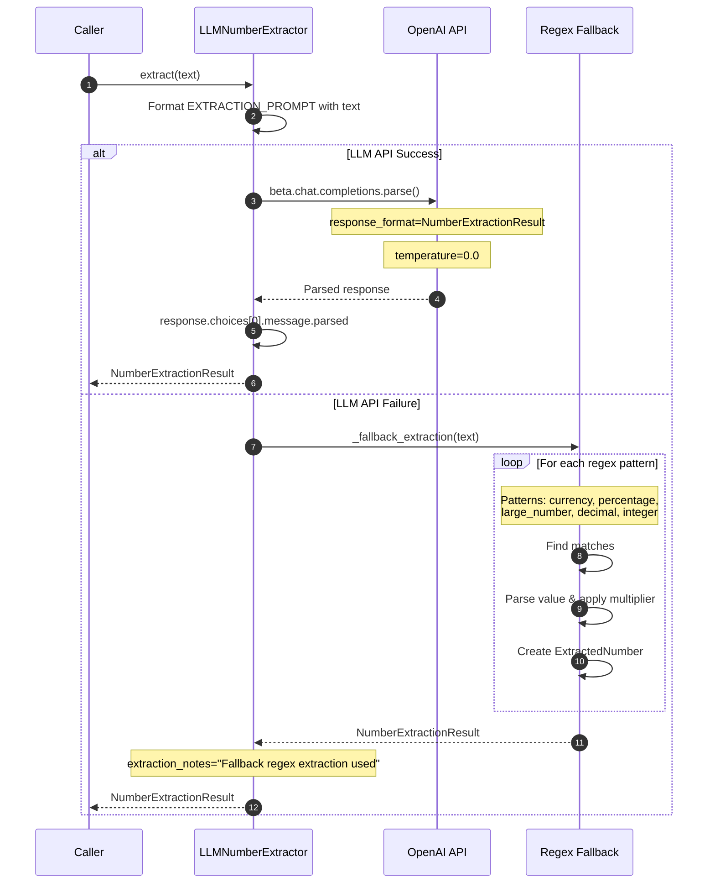

#### Extraction Prompt Structure

The LLM is instructed to extract:
- **Value**: Numerical value in standard notation (e.g., "$2.5 billion" → 2,500,000,000)
- **Original Text**: The exact text representation
- **Semantic Label**: What the number represents (e.g., "revenue", "profit margin")
- **Unit**: Unit of measurement if applicable
- **Context**: Brief surrounding context

---

### 3.3 Number Matching Flow

How numbers from model answer and ground truth are matched semantically.

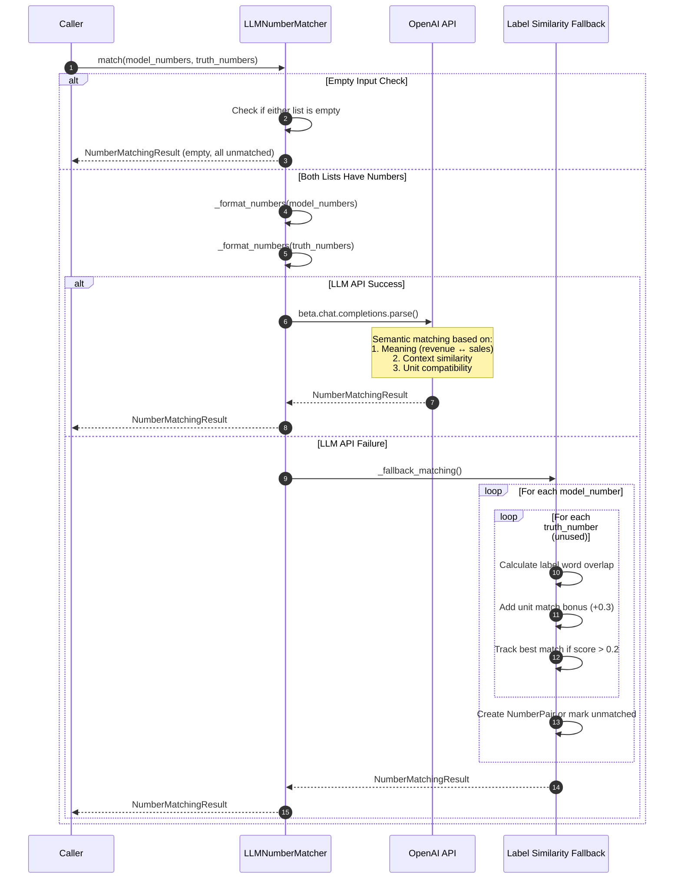

#### Match Confidence Levels

| Confidence | Score Threshold | Description |
|------------|----------------|-------------|
| **High** | > 0.8 | Strong semantic match with same units |
| **Medium** | 0.5 - 0.8 | Good semantic match |
| **Low** | 0.2 - 0.5 | Weak match, primarily positional |

---

### 3.4 Statistical Comparison Flow

How statistical metrics are computed for each matched pair.

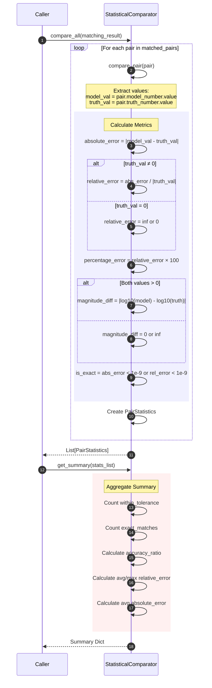

#### Tolerance Check Logic

```mermaid
flowchart TD
    A[PairStatistics] --> B{|truth_value| < 1.0?}
    B -->|Yes| C{absolute_error ≤ absolute_tolerance?}
    C -->|Yes| D[✅ Within Tolerance]
    C -->|No| E[❌ Outside Tolerance]
    
    B -->|No| F{relative_error ≤ relative_tolerance?}
    F -->|No| E
    F -->|Yes| G{magnitude_diff ≤ magnitude_tolerance?}
    G -->|Yes| D
    G -->|No| E
```

---

### 3.5 LLM Judge Decision Flow

How the final judgment is made.

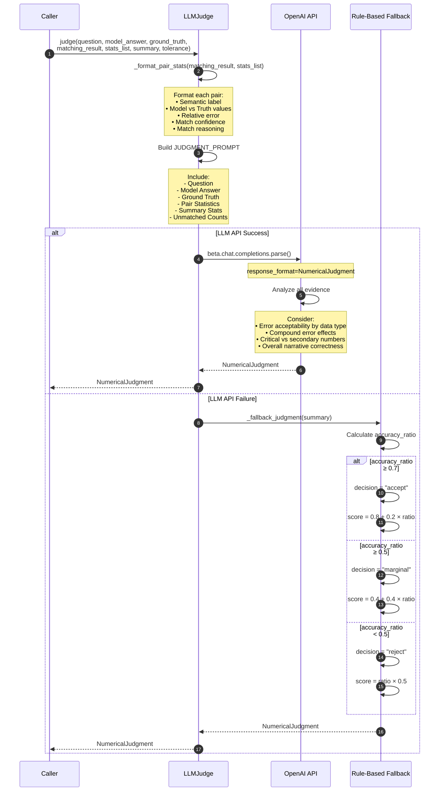

#### Decision Criteria

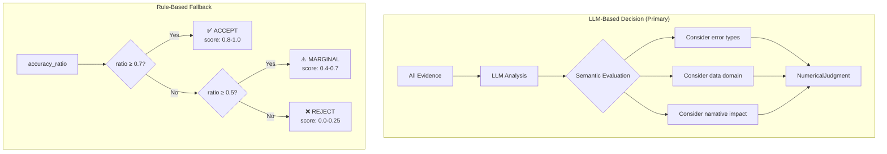

---

## 4. Component Descriptions

### 4.1 LLMNumberExtractor

**Purpose**: Extract numerical values from text with semantic understanding.

**Key Features**:
- Uses structured output parsing with Pydantic models
- Converts various number formats to standard notation
- Captures semantic labels (what the number represents)
- Records surrounding context for better matching
- Has regex-based fallback for resilience

**Extracted Number Types**:
- Integers and decimals
- Percentages
- Currency amounts
- Large numbers with words (billion, million)
- Fractions
- Scientific notation

---

### 4.2 LLMNumberMatcher

**Purpose**: Match numbers from model answer to corresponding ground truth numbers.

**Matching Criteria**:
1. **Semantic Meaning**: "revenue" matches "sales", "profit margin" matches "margin"
2. **Context Similarity**: Numbers discussed in similar contexts
3. **Unit Compatibility**: Same or convertible units

**Output**:
- Matched pairs with confidence levels
- Unmatched numbers from both texts
- Matching reasoning for each pair

---

### 4.3 StatisticalComparator

**Purpose**: Compute quantitative error metrics for matched pairs.

**Computed Metrics**:

| Metric | Formula | Purpose |
|--------|---------|---------|
| Absolute Error | \|model - truth\| | Raw difference |
| Relative Error | \|model - truth\| / \|truth\| | Proportional difference |
| Percentage Error | Relative Error × 100 | Human-readable proportion |
| Order of Magnitude | \|log₁₀(model) - log₁₀(truth)\| | Scale difference |

**Configurable Tolerances**:
- `relative_tolerance`: Default 10% (0.10)
- `absolute_tolerance`: Default 0.01 (for small numbers)
- `order_magnitude_tolerance`: Default 1.0 (within same order)

---

### 4.4 LLMJudge

**Purpose**: Make final judgment considering both statistical and semantic factors.

**Decision Options**:
| Decision | Meaning | Typical Conditions |
|----------|---------|-------------------|
| **accept** | Numerically accurate enough | Most pairs within tolerance |
| **marginal** | Borderline accuracy | Mixed results |
| **reject** | Too many or critical errors | Significant deviations |

**Evaluation Considerations**:
- Data type sensitivity (financial vs. general)
- Critical vs. secondary numbers
- Compound error effects
- Overall narrative correctness

---

### 4.5 LLMNumericalEvaluator

**Purpose**: Orchestrate the complete evaluation pipeline.

**Pipeline Steps**:
1. Extract numbers from model answer
2. Extract numbers from ground truth
3. Match corresponding numbers
4. Compute statistical metrics
5. Make final judgment

**Configuration**:
- `model`: LLM model to use (default: gpt-4o-mini)
- `relative_tolerance`: Error threshold (default: 10%)
- `absolute_tolerance`: Small number threshold (default: 0.01)

---

## 5. Data Flow Diagram

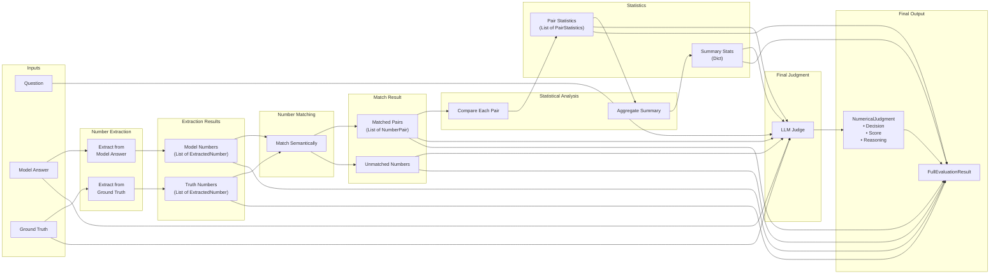

---

## 6. Error Handling Strategy

The system implements a multi-layer error handling approach:

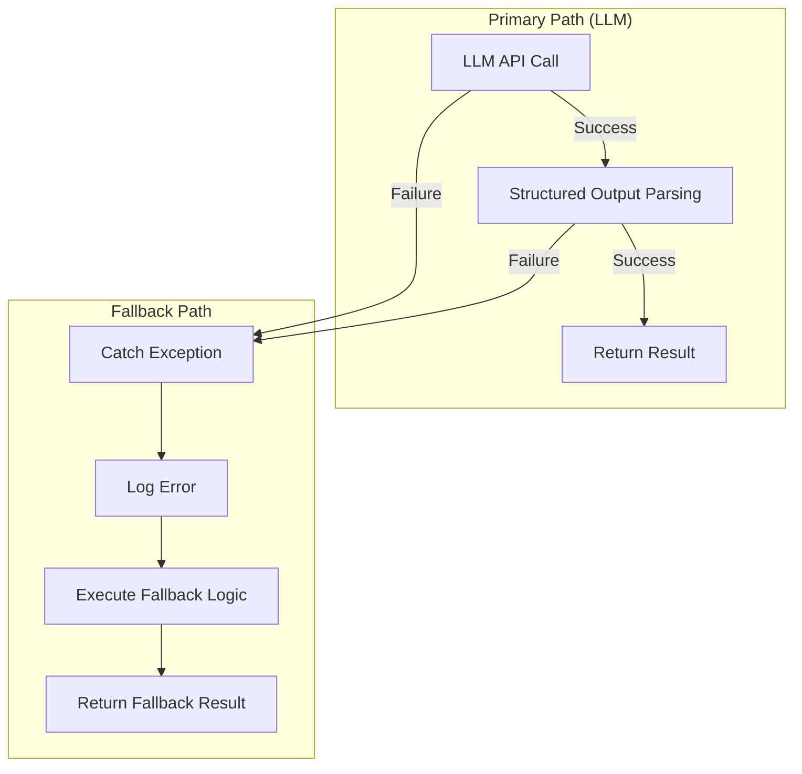

### Fallback Mechanisms by Component

| Component | Primary Method | Fallback Method |
|-----------|---------------|-----------------|
| **LLMNumberExtractor** | LLM with structured output | Regex pattern matching |
| **LLMNumberMatcher** | LLM semantic matching | Label word overlap scoring |
| **LLMJudge** | LLM with full context | Accuracy ratio thresholds |

### Error Resilience Features

1. **Temperature = 0**: Ensures deterministic LLM outputs
2. **Structured Outputs**: Uses Pydantic models for type safety
3. **Graceful Degradation**: Falls back to rule-based methods on failure
4. **Empty Input Handling**: Handles edge cases where no numbers exist

---

## Summary

The LLM-as-Judge Numerical Answer Evaluation system provides a robust, multi-stage pipeline for evaluating numerical accuracy in generated text. By combining LLM-based semantic understanding with statistical metrics, it offers:

- **Semantic Awareness**: Understanding synonyms and context
- **Quantitative Rigor**: Precise error measurements
- **Explainability**: Detailed reasoning for decisions
- **Resilience**: Fallback mechanisms for reliability

The modular architecture allows for easy customization of tolerances, models, and evaluation criteria to suit different domains and use cases.


