# Design Patterns for an Agent Coordinator Communicating With Specialized Worker Agents via MCP - Architecture Documentation

This document provides comprehensive UML diagrams and flowcharts describing the architecture and workflow of the Multi-Agent System of a Coordinator and Specialized Workers using Model Context Protocol (MCP) for inter-agent communication, resource sharing, and workflow orchestration.

---

## Table of Contents

1. [Overview](#overview)
2. [Class Diagram](#class-diagram)
3. [Component Diagram](#component-diagram)
4. [MessageBus Architecture](#messagebus-architecture)
5. [Agent Hierarchy Diagram](#agent-hierarchy-diagram)
6. [Sequence Diagram - Sequential Workflow](#sequence-diagram---sequential-workflow)
7. [Sequence Diagram - Parallel Execution](#sequence-diagram---parallel-execution)
8. [Resource Sharing Flowchart](#resource-sharing-flowchart)
9. [Coordinator Orchestration Flowchart](#coordinator-orchestration-flowchart)
10. [Agent Discovery Diagram](#agent-discovery-diagram)
11. [Tool Registry Pattern](#tool-registry-pattern)
12. [End-to-End Data Pipeline](#end-to-end-data-pipeline)

---

## Overview

This system demonstrates a comprehensive multi-agent architecture using the **Model Context Protocol (MCP)** for standardized communication between AI agents.

### MCP Protocol Benefits

| Benefit | Description |
|---------|-------------|
| **Standardized Communication** | All agents use the same protocol |
| **Resource Sharing** | Agents can share data, tools, and context |
| **Loose Coupling** | Agents don't need to know internals of others |
| **Discoverability** | Agents can discover capabilities of other agents |
| **Scalability** | Easy to add new agents without changes |
| **Interoperability** | Different AI systems can work together |

### System Components

| Component | Role | Description |
|-----------|------|-------------|
| **MessageBus** | Communication Hub | Pub/sub messaging and resource storage |
| **MCPAgent** | Base Agent | Client/server hybrid with MCP capabilities |
| **DataCollectorAgent** | Worker | Web scraping, API calls, data extraction |
| **AnalysisAgent** | Worker | Statistical analysis, pattern recognition |
| **ReportGeneratorAgent** | Worker | Report writing, visualization |
| **ValidationAgent** | Worker | Quality checks, verification |
| **MCPCoordinator** | Orchestrator | Workflow management and execution |
| **MCPToolRegistry** | Service | Tool registration and discovery |

---

## Class Diagram

This diagram shows all classes, their attributes, methods, and relationships.

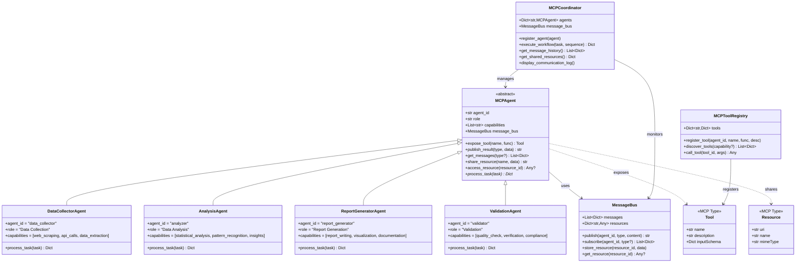

### Description

The class diagram shows:

- **MessageBus**: Central pub/sub system with resource storage
- **MCPAgent**: Abstract base class defining the MCP agent interface
- **Specialized Agents**: Four concrete implementations with specific capabilities
- **MCPCoordinator**: Orchestrator managing agent registration and workflow execution
- **MCPToolRegistry**: Service for tool registration and discovery
- **MCP Types**: Tool and Resource from the MCP protocol specification

---

## Component Diagram

This diagram shows the high-level system architecture.

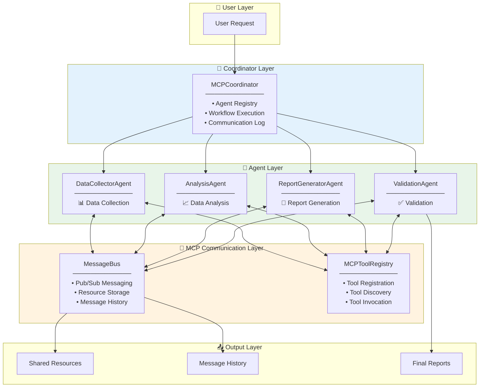

### Description

The system is organized into layers:

- **User Layer**: Entry point for workflow requests
- **Coordinator Layer**: Manages agent registration and workflow execution
- **MCP Communication Layer**: MessageBus for messaging, ToolRegistry for tool discovery
- **Agent Layer**: Four specialized agents with specific capabilities
- **Output Layer**: Shared resources, message logs, and final reports

---

## MessageBus Architecture

This diagram details the MessageBus publish/subscribe and resource sharing mechanisms.

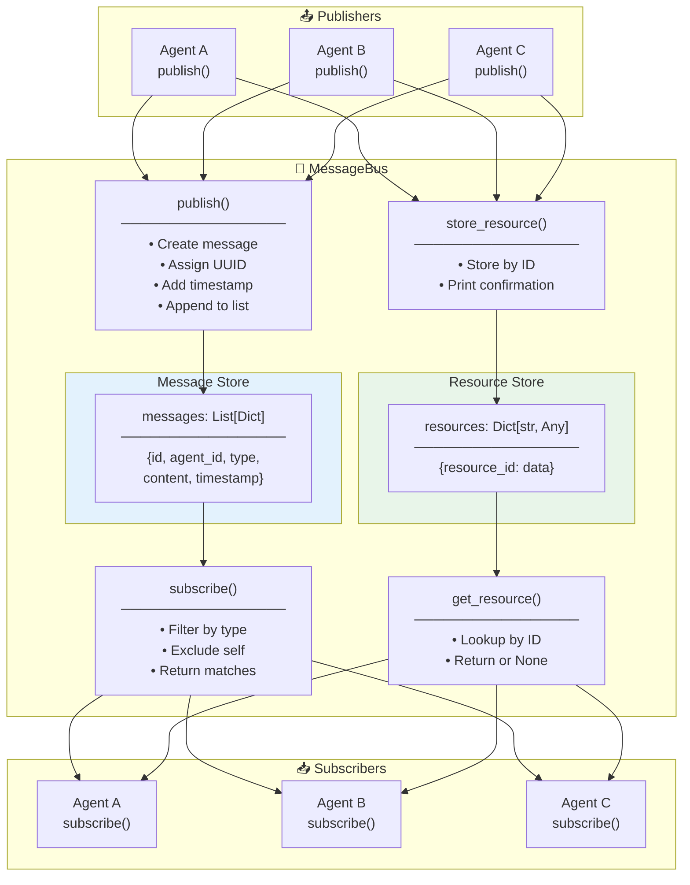

### Description

The MessageBus provides two key services:

**Pub/Sub Messaging:**
- `publish()`: Create message with UUID, timestamp, and content
- `subscribe()`: Filter messages by type, exclude sender's own messages

**Resource Sharing:**
- `store_resource()`: Store data with unique ID
- `get_resource()`: Retrieve data by ID

---

## Agent Hierarchy Diagram

This diagram shows the inheritance hierarchy and capabilities of each agent.

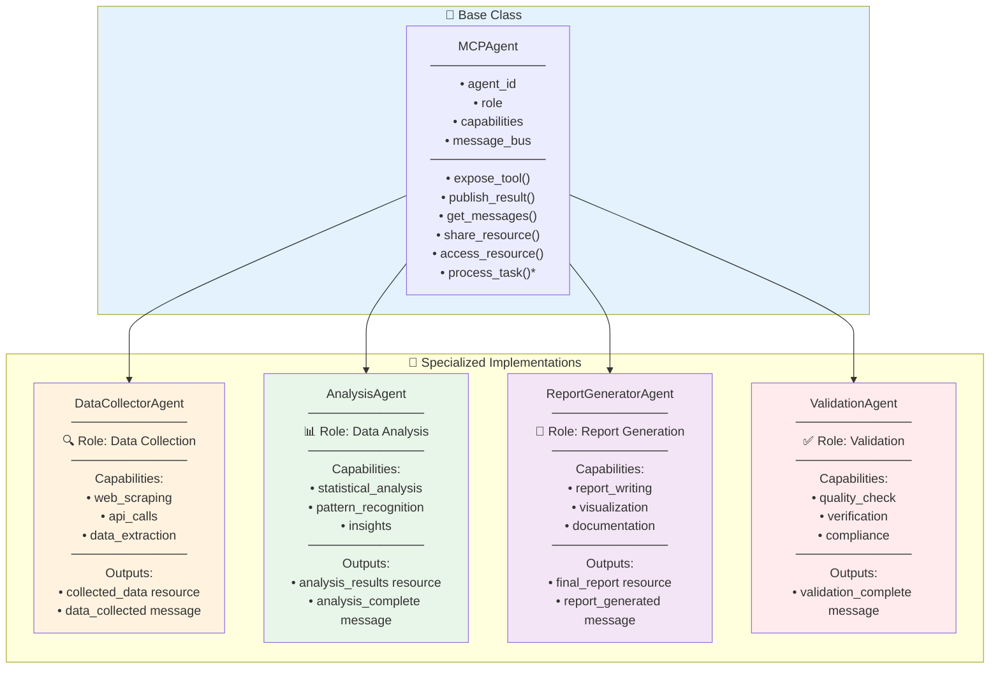

### Description

Each agent extends MCPAgent and specializes in a specific domain:

| Agent | Input | Output |
|-------|-------|--------|
| **DataCollector** | Task description | Raw data resource |
| **Analysis** | Data resource | Statistics + insights |
| **ReportGenerator** | Analysis resource | Formatted report |
| **Validation** | All messages | Validation status |

---

## Sequence Diagram - Sequential Workflow

This diagram shows the complete sequential workflow execution.

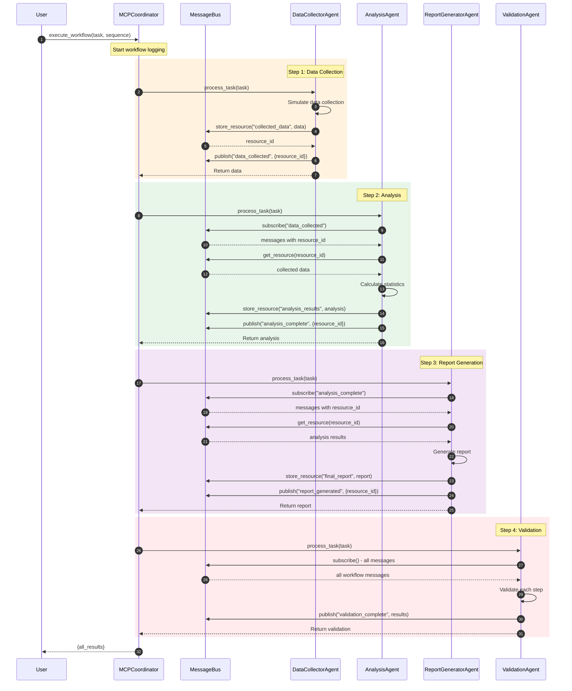

### Description

The sequential workflow executes agents in order:

1. **Data Collection**: Collects data, shares via resource, publishes completion
2. **Analysis**: Subscribes to data_collected, retrieves resource, analyzes, shares results
3. **Report Generation**: Subscribes to analysis_complete, generates formatted report
4. **Validation**: Reviews all messages to validate workflow completeness

---

## Sequence Diagram - Parallel Execution

This diagram shows multiple agents executing in parallel.

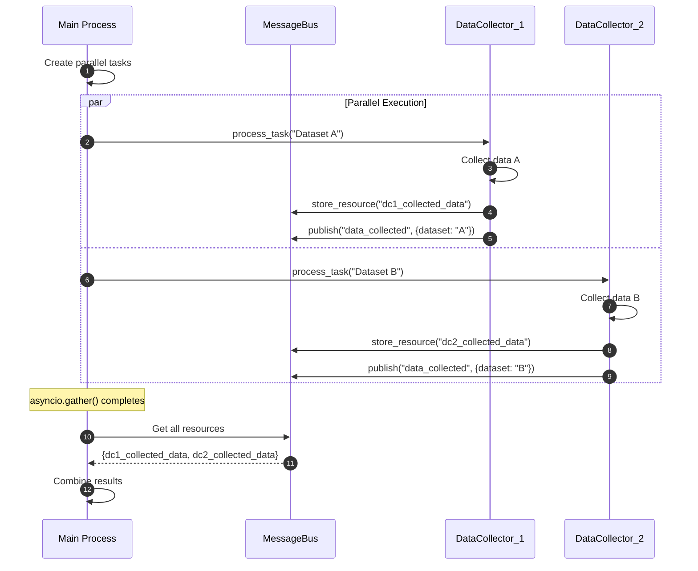

### Description

MCP enables parallel agent execution:

- Multiple agents run concurrently via `asyncio.gather()`
- Each agent publishes to the shared MessageBus
- Results are combined after all agents complete
- Enables horizontal scaling of workloads

---

## Resource Sharing Flowchart

This diagram details how agents share resources via MCP.

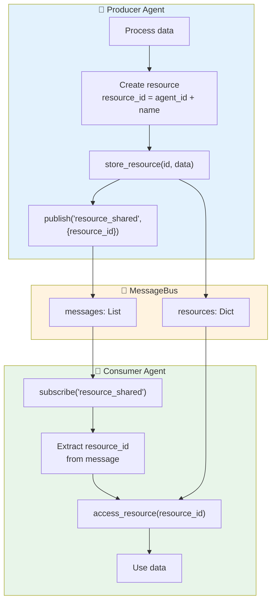

### Description

Resource sharing follows this pattern:

**Producer Side:**
1. Process data to be shared
2. Generate unique resource_id (agent_id + resource_name)
3. Store in MessageBus resources dict
4. Publish notification with resource_id

**Consumer Side:**
1. Subscribe to resource_shared messages
2. Extract resource_id from message content
3. Access resource from MessageBus
4. Use the retrieved data

---

## Coordinator Orchestration Flowchart

This diagram shows how the MCPCoordinator manages workflows.

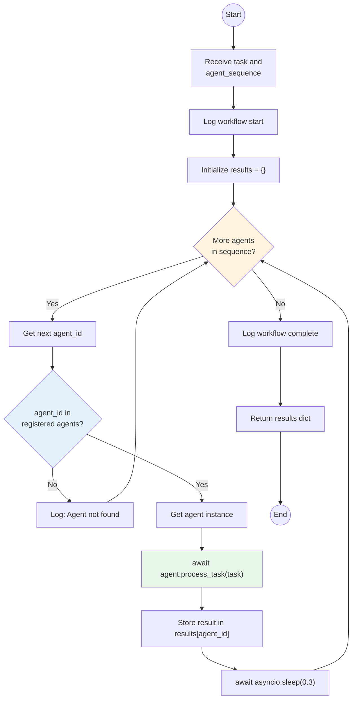

### Description

The MCPCoordinator orchestration logic:

1. **Receive Request**: Task description and agent sequence
2. **Initialize**: Empty results dictionary
3. **Iterate Agents**: Process each agent in sequence
4. **Validate**: Check if agent is registered
5. **Execute**: Call agent's `process_task()` asynchronously
6. **Store**: Save result keyed by agent_id
7. **Delay**: Brief pause between agents
8. **Return**: Complete results dictionary

---

## Agent Discovery Diagram

This diagram shows how agents discover each other via MCP.

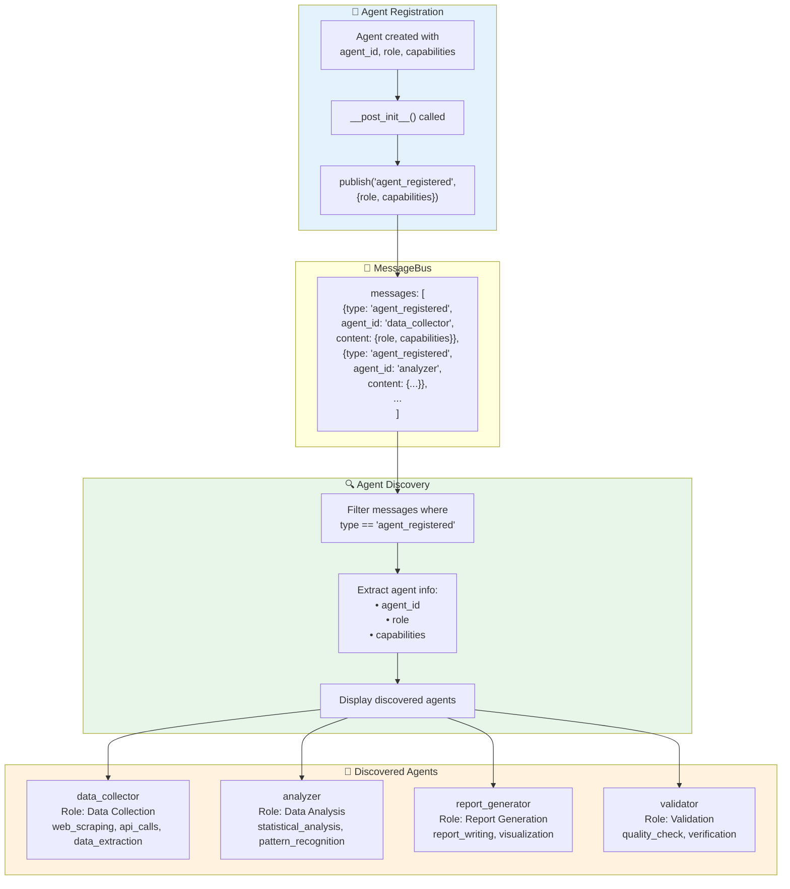

### Description

Agent discovery workflow:

**Registration (Automatic):**
- Each agent publishes `agent_registered` message on creation
- Message contains role and capabilities list

**Discovery:**
- Query MessageBus for `agent_registered` messages
- Extract agent details from each message
- Build registry of available agents and their capabilities

This enables dynamic agent composition without hardcoding dependencies.

---

## Tool Registry Pattern

This diagram shows the MCPToolRegistry for tool management.

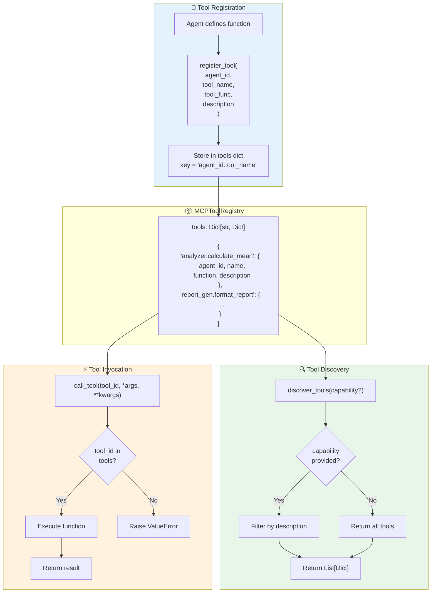

### Description

The MCPToolRegistry provides:

**Registration:**
- Tools registered with unique ID: `{agent_id}.{tool_name}`
- Stores function reference and description

**Discovery:**
- `discover_tools()`: List all available tools
- `discover_tools(capability)`: Filter by description keyword

**Invocation:**
- `call_tool(tool_id, args)`: Execute registered function
- Raises error if tool not found

---

## End-to-End Data Pipeline

This diagram shows a complete workflow example with all components.

```mermaid
flowchart TD
    subgraph Input["📥 Input"]
        USER["User Request:<br/>'Quarterly Sales Analysis'"]
    end

    subgraph Coordinator["🎯 Coordinator"]
        INIT["Initialize workflow<br/>agent_sequence = [<br/>  data_collector,<br/>  analyzer,<br/>  report_generator,<br/>  validator<br/>]"]
    end

    subgraph Step1["Step 1: Data Collection"]
        DC["DataCollectorAgent"]
        DC_OUT["Output:<br/>─────────────<br/>Resource: data_collector_collected_data<br/>Data: {data_points: [10,25,30,45,50]}<br/>Message: data_collected"]
    end

    subgraph Step2["Step 2: Analysis"]
        AN["AnalysisAgent"]
        AN_IN["Input:<br/>─────────────<br/>Subscribe: data_collected<br/>Resource: collected_data"]
        AN_OUT["Output:<br/>─────────────<br/>Resource: analyzer_analysis_results<br/>Data: {mean: 32, max: 50, min: 10}<br/>Message: analysis_complete"]
    end

    subgraph Step3["Step 3: Report Generation"]
        RG["ReportGeneratorAgent"]
        RG_IN["Input:<br/>─────────────<br/>Subscribe: analysis_complete<br/>Resource: analysis_results"]
        RG_OUT["Output:<br/>─────────────<br/>Resource: report_generator_final_report<br/>Data: {title, summary, details}<br/>Message: report_generated"]
    end

    subgraph Step4["Step 4: Validation"]
        VA["ValidationAgent"]
        VA_IN["Input:<br/>─────────────<br/>Subscribe: all messages"]
        VA_OUT["Output:<br/>─────────────<br/>Validated steps:<br/>✓ data_collected<br/>✓ analysis_complete<br/>✓ report_generated<br/>workflow_complete: true"]
    end

    subgraph Output["📤 Output"]
        RESULT["Final Results:<br/>─────────────<br/>{<br/>  data_collector: {...},<br/>  analyzer: {...},<br/>  report_generator: {...},<br/>  validator: {complete: true}<br/>}"]
    end

    USER --> INIT
    INIT --> DC
    DC --> DC_OUT
    DC_OUT --> AN_IN
    AN_IN --> AN
    AN --> AN_OUT
    AN_OUT --> RG_IN
    RG_IN --> RG
    RG --> RG_OUT
    RG_OUT --> VA_IN
    VA_IN --> VA
    VA --> VA_OUT
    VA_OUT --> RESULT

    style Step1 fill:#fff3e0
    style Step2 fill:#e8f5e9
    style Step3 fill:#f3e5f5
    style Step4 fill:#ffebee
```

### Description

Complete pipeline execution:

1. **Data Collection**: Simulates API call, stores 5 data points
2. **Analysis**: Calculates mean (32), max (50), min (10), identifies trends
3. **Report Generation**: Creates formatted report with title, summary, details
4. **Validation**: Verifies all 3 required steps completed successfully

Each step communicates via MessageBus publish/subscribe and shares data via resources.

---

## Real-Time Communication Flowchart

This diagram shows live agent-to-agent messaging.

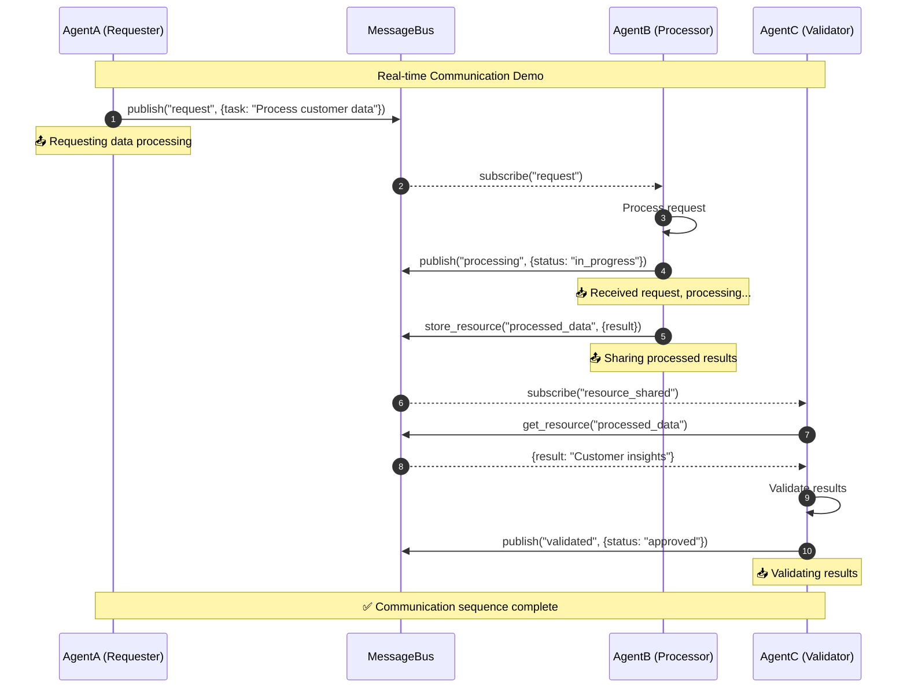

### Description

Real-time inter-agent communication:

1. **AgentA** publishes a request for data processing
2. **AgentB** subscribes, processes, and shares results as a resource
3. **AgentC** subscribes to resource notifications, retrieves data, validates, and publishes approval

This demonstrates the pub/sub pattern enabling loose coupling between agents.

---

## Summary

This documentation covers the complete architecture of the MCP-based Multi-Agent System:

| Diagram Type | Purpose |
|-------------|---------|
| Class Diagram | Data structures and relationships |
| Component Diagram | High-level system layers |
| MessageBus Architecture | Pub/sub and resource sharing |
| Agent Hierarchy | Inheritance and capabilities |
| Sequential Workflow | Step-by-step execution |
| Parallel Execution | Concurrent agent processing |
| Resource Sharing | Data exchange pattern |
| Coordinator Orchestration | Workflow management logic |
| Agent Discovery | Dynamic agent registration |
| Tool Registry | Tool management pattern |
| End-to-End Pipeline | Complete example walkthrough |
| Real-Time Communication | Live messaging demo |

### Key Architecture Patterns

1. **Pub/Sub Messaging**: Loose coupling via MessageBus
2. **Resource Sharing**: Data exchange through shared storage
3. **Agent Registration**: Self-announcing agents on creation
4. **Tool Registry**: Discoverable tool capabilities
5. **Sequential Orchestration**: Coordinator-managed workflows
6. **Parallel Execution**: Async concurrent processing

### MCP Protocol Implementation

| MCP Concept | Implementation |
|-------------|----------------|
| **Tools** | Agent methods exposed via `expose_tool()` |
| **Resources** | Data stored via `share_resource()` |
| **Messages** | Pub/sub via `publish()`/`subscribe()` |
| **Discovery** | Agent registration messages |
| **Interoperability** | Standardized message format |

### Real-World Applications

- **Data Processing Pipelines**: ETL with specialized agents
- **Autonomous Systems**: Robotics and IoT coordination
- **AI Assistants**: Multiple specialized AI agents collaborating
- **Microservices**: Agent-based service architectures
- **Distributed Computing**: Cross-system agent communication

### Extension Points

- Integrate with real MCP SDK servers and clients
- Add authentication and authorization
- Implement persistent message storage (Redis, Kafka)
- Add monitoring and observability (OpenTelemetry)
- Scale to distributed systems with network transport
- Add error recovery and retry logic
- Implement agent health checks and heartbeats
