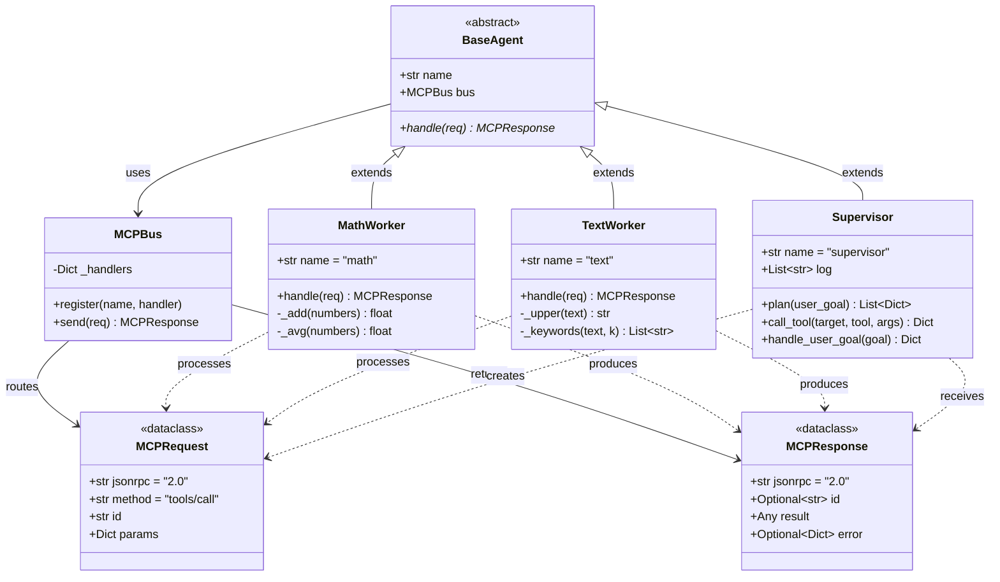
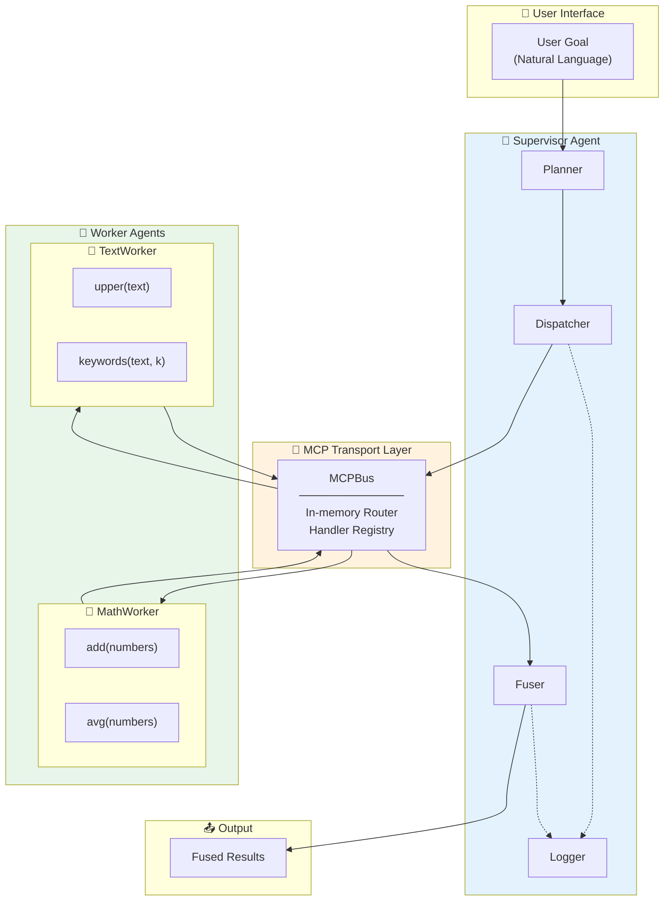
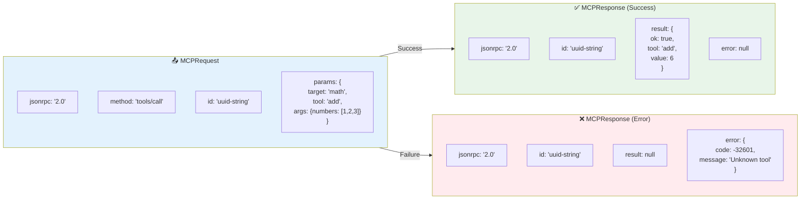
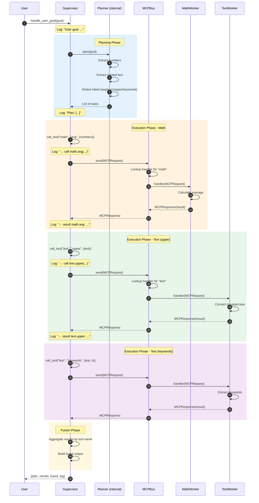
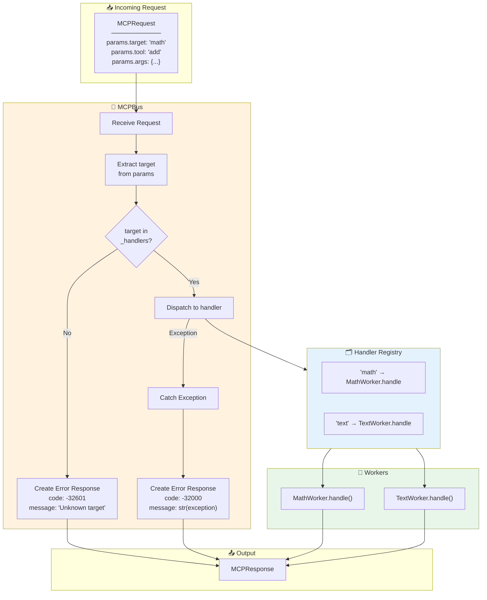
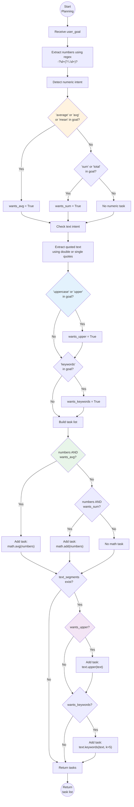
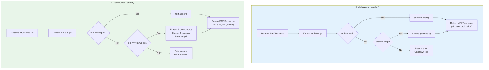
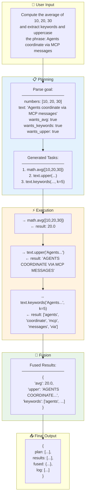
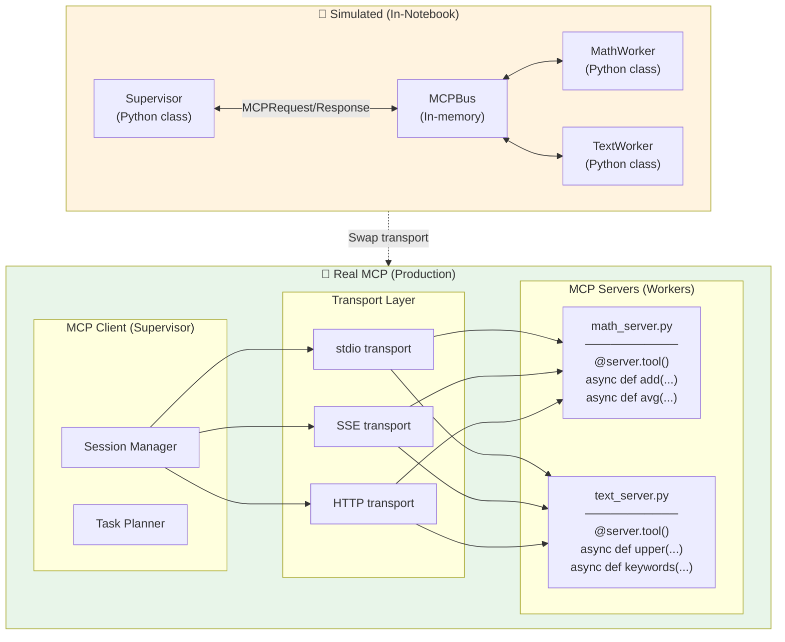
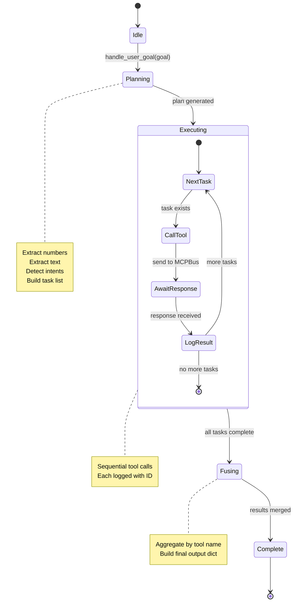

# Multi-Agent Supervisor-Worker Design Pattern with MCP-style Messaging - Architecture Documentation

This document provides comprehensive UML diagrams and flowcharts describing the architecture and workflow of the Multi-Agent Supervisor-Worker design pattern and mock workflow using Model Context Protocol (MCP) style messaging patterns.

---

## Table of Contents

1. [Overview](#overview)
2. [Class Diagram](#class-diagram)
3. [Component Diagram](#component-diagram)
4. [Message Format Diagram](#message-format-diagram)
5. [Sequence Diagram](#sequence-diagram)
6. [MCPBus Routing Diagram](#mcpbus-routing-diagram)
7. [Supervisor Planning Flowchart](#supervisor-planning-flowchart)
8. [Worker Tool Execution Flowchart](#worker-tool-execution-flowchart)
9. [End-to-End Workflow Diagram](#end-to-end-workflow-diagram)
10. [Real MCP Architecture](#real-mcp-architecture)

---

## Overview

This system demonstrates a **Supervisor Agent** orchestrating multiple **Worker Agents** using a lightweight simulation of the **Model Context Protocol (MCP)** message pattern.

### Key Components

| Component | Role | Description |
|-----------|------|-------------|
| **MCPBus** | Message Router | In-memory transport mimicking MCP protocol |
| **Supervisor** | Orchestrator | Plans tasks, dispatches to workers, fuses results |
| **MathWorker** | Specialized Worker | Provides `add` and `avg` numeric tools |
| **TextWorker** | Specialized Worker | Provides `upper` and `keywords` text tools |

### Architecture Overview

```
+-------------------+          JSON-RPC-ish messages          +------------------+
|   Supervisor      |  ------------------------------------>  |  Worker A (Math) |
|   Agent           |  <------------------------------------  |  Tools: add, avg |
+---------+---------+                                          +------------------+
          |                                                                
          |                                  +------------------+
          |--------------------------------->|  Worker B (Text) |
          |<---------------------------------|  Tools: upper, kw|
                                             +------------------+
```

---

## Class Diagram

This diagram shows all classes, their attributes, methods, and inheritance relationships.



### Description

The class diagram illustrates the inheritance hierarchy and relationships:

- **MCPRequest/MCPResponse**: Dataclasses following JSON-RPC 2.0 message format
- **MCPBus**: Central message router with handler registration
- **BaseAgent**: Abstract base class defining the agent interface
- **MathWorker**: Concrete worker with numeric computation tools
- **TextWorker**: Concrete worker with text processing tools
- **Supervisor**: Orchestrator that plans, dispatches, and aggregates results

---

## Component Diagram

This diagram shows the high-level system architecture and component interactions.



### Description

The component diagram shows:

- **User Interface**: Entry point for natural language goals
- **Supervisor Agent**: Contains planning, dispatching, fusing, and logging capabilities
- **MCP Transport Layer**: The MCPBus routes messages between agents
- **Worker Agents**: Specialized tools registered with the bus
- **Output**: Aggregated results from all tool executions

---

## Message Format Diagram

This diagram details the MCP-style JSON-RPC message structure.



### Description

The message format follows JSON-RPC 2.0 conventions:

**MCPRequest Fields:**
- `jsonrpc`: Protocol version ("2.0")
- `method`: Operation type ("tools/call")
- `id`: Unique request identifier (UUID)
- `params`: Contains `target` (worker), `tool` (function), and `args` (parameters)

**MCPResponse Fields:**
- `jsonrpc`: Protocol version
- `id`: Matching request ID
- `result`: Tool execution result (on success)
- `error`: Error details with code and message (on failure)

---

## Sequence Diagram

This diagram shows the complete message flow from user goal to final result.



### Description

The sequence diagram shows the complete flow:

1. **User Input**: Natural language goal is submitted
2. **Planning Phase** (blue): Supervisor analyzes goal and creates task list
3. **Execution Phase - Math** (orange): Numeric computation dispatched to MathWorker
4. **Execution Phase - Text** (green): Text processing dispatched to TextWorker
5. **Fusion Phase** (yellow): Results aggregated into final output

Each tool call is logged with request and response details.

---

## MCPBus Routing Diagram

This diagram details how the MCPBus routes messages to registered handlers.



### Description

The MCPBus routing logic:

1. **Receive**: Accept incoming MCPRequest
2. **Extract**: Get `target` from `params`
3. **Lookup**: Check if target exists in handler registry
4. **Dispatch**: Route to registered handler function
5. **Error Handling**: 
   - Unknown target → Error code -32601
   - Handler exception → Error code -32000
6. **Return**: MCPResponse with result or error

---

## Supervisor Planning Flowchart

This diagram details the heuristic planning logic in the Supervisor.



### Description

The Supervisor's planning algorithm:

1. **Number Extraction**: Use regex to find all numeric values
2. **Numeric Intent Detection**: Check for keywords like "average", "sum", "total"
3. **Text Extraction**: Find text within quotes
4. **Text Intent Detection**: Check for "uppercase" or "keywords"
5. **Task Generation**: Build list of tool calls based on detected intents

This is a simple heuristic planner; a production system would use an LLM for more sophisticated planning.

---

## Worker Tool Execution Flowchart

This diagram shows how workers process tool requests.



### Description

**MathWorker Tools:**
| Tool | Input | Output | Description |
|------|-------|--------|-------------|
| `add` | `numbers: List[float]` | `float` | Sum of all numbers |
| `avg` | `numbers: List[float]` | `float` | Arithmetic mean |

**TextWorker Tools:**
| Tool | Input | Output | Description |
|------|-------|--------|-------------|
| `upper` | `text: str` | `str` | Uppercase conversion |
| `keywords` | `text: str, k: int` | `List[str]` | Top k keywords by frequency |

---

## End-to-End Workflow Diagram

This diagram shows a complete example execution.



### Description

This example shows the complete flow for a multi-intent goal:

1. **Input**: User provides a complex goal with numeric and text operations
2. **Planning**: Supervisor extracts data and detects multiple intents
3. **Execution**: Three sequential tool calls via MCPBus
4. **Fusion**: Results aggregated by tool name
5. **Output**: Complete response with plan, results, fused data, and logs

---

## Real MCP Architecture

This diagram shows how to transition from the simulated MCPBus to real MCP servers.



### Description

**Simulated MCP (Current Implementation):**
- In-memory MCPBus for message routing
- Python class handlers for tool execution
- No network, runs entirely in notebook

**Real MCP (Production):**
- MCP SDK with async client/server
- Multiple transport options (stdio, SSE, HTTP)
- Separate server processes for each worker
- JSON-RPC over network/IPC

**Migration Path:**
1. Install MCP SDK: `pip install mcp anyio`
2. Convert workers to MCP servers with `@server.tool()` decorators
3. Use `stdio_client()` to spawn server processes
4. Replace `bus.send()` with `session.call_tool()`

---

## State Flow Diagram

This diagram shows how state changes through the supervisor workflow.



### Description

The Supervisor's state transitions:

1. **Idle**: Waiting for user goal
2. **Planning**: Analyzing goal and generating tasks
3. **Executing**: Processing each task sequentially
   - Call tool via MCPBus
   - Await response
   - Log result
   - Repeat for remaining tasks
4. **Fusing**: Combining all results
5. **Complete**: Returning final output

---

## Summary

This documentation covers the complete architecture of the Multi-Agent MCP-style Supervisor system:

| Diagram Type | Purpose |
|-------------|---------|
| Class Diagram | Data structures and inheritance hierarchy |
| Component Diagram | High-level system organization |
| Message Format | JSON-RPC request/response structure |
| Sequence Diagram | Complete message flow |
| MCPBus Routing | Handler dispatch logic |
| Planning Flowchart | Heuristic task decomposition |
| Worker Execution | Tool processing logic |
| End-to-End | Complete example walkthrough |
| Real MCP Architecture | Production migration path |
| State Flow | Supervisor state transitions |

### Key Architecture Decisions

1. **JSON-RPC 2.0 Style**: Messages follow standard protocol for interoperability
2. **Handler Registry**: Dynamic registration enables extensible worker pool
3. **Simulated Transport**: In-memory bus for easy development and testing
4. **Heuristic Planning**: Simple regex-based planning (replaceable with LLM)
5. **Sequential Execution**: Tasks processed one at a time (parallelizable in production)
6. **Result Fusion**: Simple aggregation by tool name

### MCP Protocol Key Concepts

| Concept | Description |
|---------|-------------|
| **JSON-RPC** | Standard protocol for request/response messaging |
| **Method** | Operation type (e.g., "tools/call") |
| **Params** | Request parameters including target and args |
| **Transport** | Communication channel (stdio, SSE, HTTP) |
| **Server** | Process exposing tools via MCP |
| **Client** | Process consuming tools via MCP |

### Extension Points

- Replace heuristic planner with LLM-based decomposition
- Add parallel task execution
- Implement real MCP transport (stdio/SSE/HTTP)
- Add more specialized workers (database, API, file system)
- Implement tool discovery via `tools/list` method
- Add authentication and access control
- Implement streaming responses for long-running tools
