# Multi-Agent Workflow Orchestration via Google's A2A Protocol — Architecture & Design Documentation

This document provides a detailed architectural analysis of the
`agentic_workflow_orchestration.ipynb` notebook, which implements a
**multi-agent system** communicating through **Google's Agent-to-Agent (A2A)
protocol**. It covers the three core A2A capabilities — **interoperability**,
**agent discovery**, and **workflow orchestration** — with UML class diagrams,
sequence diagrams, and workflow flowcharts rendered in Mermaid.

---

## Table of Contents

1. [System Overview](#1-system-overview)
2. [Static Architecture — UML Class Diagrams](#2-static-architecture--uml-class-diagrams)
   - 2.1 [A2A Protocol Data Types](#21-a2a-protocol-data-types)
   - 2.2 [A2A Infrastructure](#22-a2a-infrastructure)
   - 2.3 [Agent Executor Hierarchy](#23-agent-executor-hierarchy)
   - 2.4 [Full System Class Diagram](#24-full-system-class-diagram)
3. [Dynamic Behaviour — UML Sequence Diagrams](#3-dynamic-behaviour--uml-sequence-diagrams)
   - 3.1 [Agent Registration and Card Publishing](#31-agent-registration-and-card-publishing)
   - 3.2 [Agent Discovery Sequence](#32-agent-discovery-sequence)
   - 3.3 [Task Execution Lifecycle](#33-task-execution-lifecycle)
   - 3.4 [Data Exchange via DataPart](#34-data-exchange-via-datapart)
   - 3.5 [End-to-End Orchestrated Workflow](#35-end-to-end-orchestrated-workflow)
   - 3.6 [Direct Agent-to-Agent Interoperability](#36-direct-agent-to-agent-interoperability)
4. [Workflow Flowcharts](#4-workflow-flowcharts)
   - 4.1 [LangGraph Workflow DAG](#41-langgraph-workflow-dag)
   - 4.2 [A2A Server Task Routing](#42-a2a-server-task-routing)
   - 4.3 [Orchestrator Execution Flowchart](#43-orchestrator-execution-flowchart)
   - 4.4 [Research Agent Flowchart](#44-research-agent-flowchart)
   - 4.5 [Analysis Agent Flowchart](#45-analysis-agent-flowchart)
   - 4.6 [Writer Agent Flowchart](#46-writer-agent-flowchart)
   - 4.7 [Task State Machine](#47-task-state-machine)
   - 4.8 [Discovery Service Lookup Flowchart](#48-discovery-service-lookup-flowchart)
5. [Component Descriptions](#5-component-descriptions)
6. [Design Patterns & Key Decisions](#6-design-patterns--key-decisions)
7. [A2A Capability Mapping](#7-a2a-capability-mapping)

---

## 1. System Overview

The system consists of four **LLM-powered agents** that collaborate via the
A2A protocol. Each agent publishes an `AgentCard` describing its skills.
An `OrchestratorExecutor` discovers agents by skill, decomposes user queries,
and delegates `Task` objects — passing upstream `Artifact` data as `DataPart`
objects to downstream agents.

| Layer | Components |
|---|---|
| **LLM** | OpenAI (`gpt-4o-mini`) or Anthropic (`claude-sonnet-4-20250514`) |
| **Agents** | `OrchestratorExecutor`, `ResearchExecutor`, `AnalysisExecutor`, `WriterExecutor` |
| **A2A Infrastructure** | `A2AServer` (JSON-RPC router), `DiscoveryService` (AgentCard registry), `A2AClient` |
| **A2A Data Types** | `AgentCard`, `Skill`, `Task`, `Message`, `Part` (Text/Data/File), `Artifact`, `TaskState` |
| **Orchestration** | LangGraph `StateGraph` (Section 15) + native A2A task delegation (Section 12) |

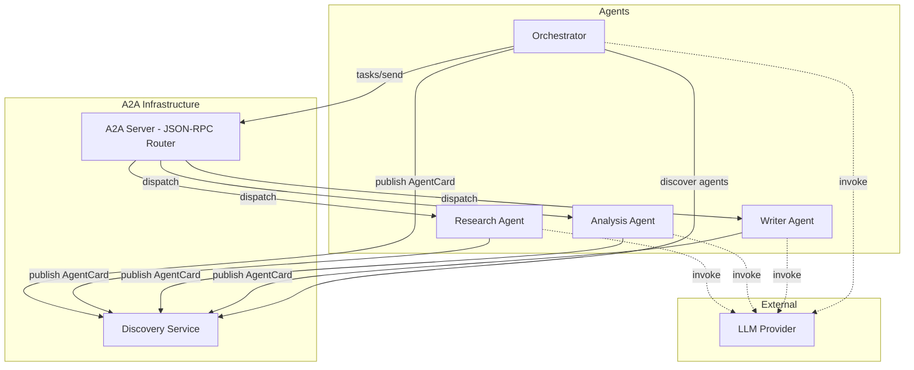
```mermaid
graph TD
    subgraph A2A Infrastructure
        DS[Discovery Service]
        SRV[A2A Server - JSON-RPC Router]
    end

    subgraph Agents
        O[Orchestrator]
        R[Research Agent]
        A[Analysis Agent]
        W[Writer Agent]
    end

    subgraph External
        LLM[LLM Provider]
    end

    O -->|publish AgentCard| DS
    R -->|publish AgentCard| DS
    A -->|publish AgentCard| DS
    W -->|publish AgentCard| DS

    O -->|discover agents| DS
    O -->|tasks/send| SRV
    SRV -->|dispatch| R
    SRV -->|dispatch| A
    SRV -->|dispatch| W

    R -.->|invoke| LLM
    A -.->|invoke| LLM
    W -.->|invoke| LLM
    O -.->|invoke| LLM
```

---

## 2. Static Architecture — UML Class Diagrams

### 2.1 A2A Protocol Data Types

These dataclasses mirror the [A2A specification](https://google.github.io/A2A/)
primitives.

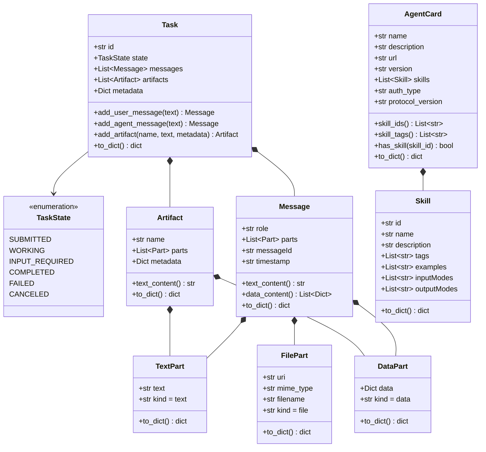
```mermaid
classDiagram
    class TaskState {
        <<enumeration>>
        SUBMITTED
        WORKING
        INPUT_REQUIRED
        COMPLETED
        FAILED
        CANCELED
    }

    class TextPart {
        +str text
        +str kind = text
        +to_dict() dict
    }

    class DataPart {
        +Dict data
        +str kind = data
        +to_dict() dict
    }

    class FilePart {
        +str uri
        +str mime_type
        +str filename
        +str kind = file
        +to_dict() dict
    }

    class Message {
        +str role
        +List~Part~ parts
        +str messageId
        +str timestamp
        +text_content() str
        +data_content() List~Dict~
        +to_dict() dict
    }

    class Artifact {
        +str name
        +List~Part~ parts
        +Dict metadata
        +text_content() str
        +to_dict() dict
    }

    class Task {
        +str id
        +TaskState state
        +List~Message~ messages
        +List~Artifact~ artifacts
        +Dict metadata
        +add_user_message(text) Message
        +add_agent_message(text) Message
        +add_artifact(name, text, metadata) Artifact
        +to_dict() dict
    }

    class Skill {
        +str id
        +str name
        +str description
        +List~str~ tags
        +List~str~ examples
        +List~str~ inputModes
        +List~str~ outputModes
        +to_dict() dict
    }

    class AgentCard {
        +str name
        +str description
        +str url
        +str version
        +List~Skill~ skills
        +str auth_type
        +str protocol_version
        +skill_ids() List~str~
        +skill_tags() List~str~
        +has_skill(skill_id) bool
        +to_dict() dict
    }

    Message *-- TextPart
    Message *-- DataPart
    Message *-- FilePart
    Artifact *-- TextPart
    Artifact *-- DataPart
    Task *-- Message
    Task *-- Artifact
    Task --> TaskState
    AgentCard *-- Skill
```

### 2.2 A2A Infrastructure

The runtime consists of three components: a server that routes tasks, a
discovery service that indexes agent cards, and a client that ties them together.

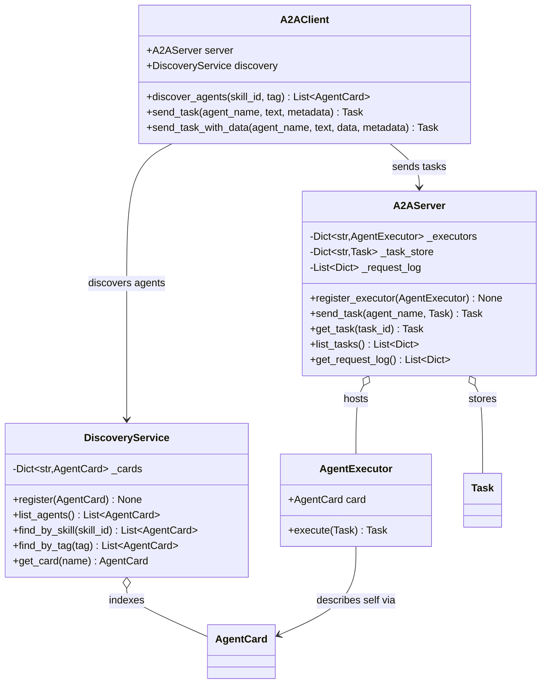
```mermaid
classDiagram
    class AgentExecutor {
        +AgentCard card
        +execute(Task) Task
    }

    class A2AServer {
        -Dict~str,AgentExecutor~ _executors
        -Dict~str,Task~ _task_store
        -List~Dict~ _request_log
        +register_executor(AgentExecutor) None
        +send_task(agent_name, Task) Task
        +get_task(task_id) Task
        +list_tasks() List~Dict~
        +get_request_log() List~Dict~
    }

    class DiscoveryService {
        -Dict~str,AgentCard~ _cards
        +register(AgentCard) None
        +list_agents() List~AgentCard~
        +find_by_skill(skill_id) List~AgentCard~
        +find_by_tag(tag) List~AgentCard~
        +get_card(name) AgentCard
    }

    class A2AClient {
        +A2AServer server
        +DiscoveryService discovery
        +discover_agents(skill_id, tag) List~AgentCard~
        +send_task(agent_name, text, metadata) Task
        +send_task_with_data(agent_name, text, data, metadata) Task
    }

    A2AServer o-- AgentExecutor : hosts
    A2AServer o-- Task : stores
    DiscoveryService o-- AgentCard : indexes
    A2AClient --> A2AServer : sends tasks
    A2AClient --> DiscoveryService : discovers agents
    AgentExecutor --> AgentCard : describes self via
```

### 2.3 Agent Executor Hierarchy

All agents extend `AgentExecutor`. Each publishes an `AgentCard` with
distinct skills.

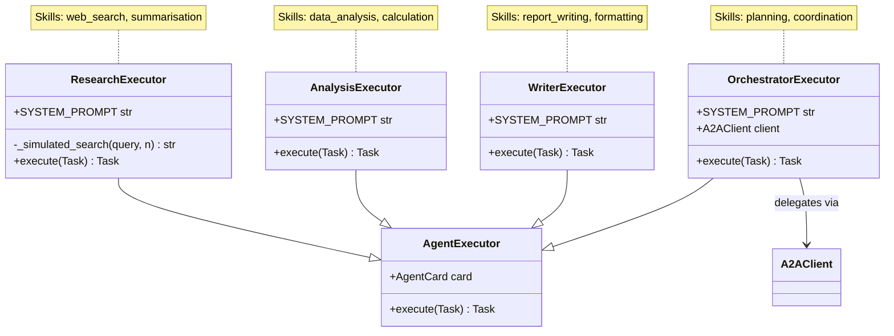
```mermaid
classDiagram
    class AgentExecutor {
        +AgentCard card
        +execute(Task) Task
    }

    class ResearchExecutor {
        +SYSTEM_PROMPT str
        -_simulated_search(query, n) str
        +execute(Task) Task
    }

    class AnalysisExecutor {
        +SYSTEM_PROMPT str
        +execute(Task) Task
    }

    class WriterExecutor {
        +SYSTEM_PROMPT str
        +execute(Task) Task
    }

    class OrchestratorExecutor {
        +SYSTEM_PROMPT str
        +A2AClient client
        +execute(Task) Task
    }

    ResearchExecutor --|> AgentExecutor
    AnalysisExecutor --|> AgentExecutor
    WriterExecutor --|> AgentExecutor
    OrchestratorExecutor --|> AgentExecutor
    OrchestratorExecutor --> A2AClient : delegates via

    note for ResearchExecutor "Skills: web_search, summarisation"
    note for AnalysisExecutor "Skills: data_analysis, calculation"
    note for WriterExecutor "Skills: report_writing, formatting"
    note for OrchestratorExecutor "Skills: planning, coordination"
```

### 2.4 Full System Class Diagram

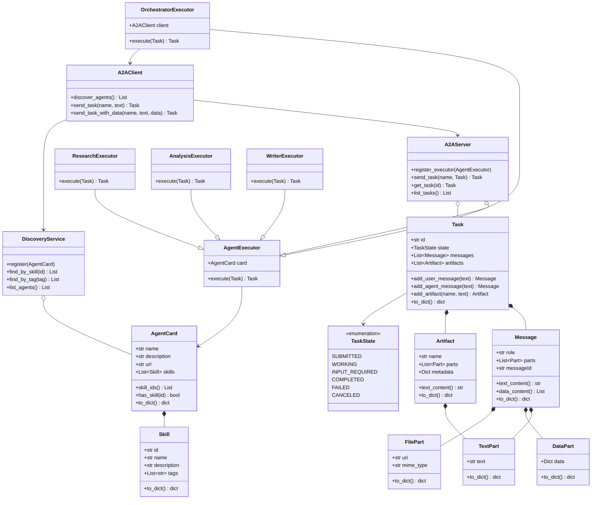
```mermaid
classDiagram
    class TaskState {
        <<enumeration>>
        SUBMITTED
        WORKING
        INPUT_REQUIRED
        COMPLETED
        FAILED
        CANCELED
    }

    class TextPart {
        +str text
        +to_dict() dict
    }

    class DataPart {
        +Dict data
        +to_dict() dict
    }

    class FilePart {
        +str uri
        +str mime_type
        +to_dict() dict
    }

    class Message {
        +str role
        +List~Part~ parts
        +str messageId
        +text_content() str
        +data_content() List
        +to_dict() dict
    }

    class Artifact {
        +str name
        +List~Part~ parts
        +Dict metadata
        +text_content() str
        +to_dict() dict
    }

    class Task {
        +str id
        +TaskState state
        +List~Message~ messages
        +List~Artifact~ artifacts
        +add_user_message(text) Message
        +add_agent_message(text) Message
        +add_artifact(name, text) Artifact
        +to_dict() dict
    }

    class Skill {
        +str id
        +str name
        +str description
        +List~str~ tags
        +to_dict() dict
    }

    class AgentCard {
        +str name
        +str description
        +str url
        +List~Skill~ skills
        +skill_ids() List
        +has_skill(id) bool
        +to_dict() dict
    }

    class AgentExecutor {
        +AgentCard card
        +execute(Task) Task
    }

    class A2AServer {
        +register_executor(AgentExecutor)
        +send_task(name, Task) Task
        +get_task(id) Task
        +list_tasks() List
    }

    class DiscoveryService {
        +register(AgentCard)
        +find_by_skill(id) List
        +find_by_tag(tag) List
        +list_agents() List
    }

    class A2AClient {
        +discover_agents() List
        +send_task(name, text) Task
        +send_task_with_data(name, text, data) Task
    }

    class ResearchExecutor {
        +execute(Task) Task
    }
    class AnalysisExecutor {
        +execute(Task) Task
    }
    class WriterExecutor {
        +execute(Task) Task
    }
    class OrchestratorExecutor {
        +A2AClient client
        +execute(Task) Task
    }

    Task *-- Message
    Task *-- Artifact
    Task --> TaskState
    Message *-- TextPart
    Message *-- DataPart
    Message *-- FilePart
    Artifact *-- TextPart
    AgentCard *-- Skill
    AgentExecutor --> AgentCard

    A2AServer o-- AgentExecutor
    A2AServer o-- Task
    DiscoveryService o-- AgentCard
    A2AClient --> A2AServer
    A2AClient --> DiscoveryService

    ResearchExecutor --|> AgentExecutor
    AnalysisExecutor --|> AgentExecutor
    WriterExecutor --|> AgentExecutor
    OrchestratorExecutor --|> AgentExecutor
    OrchestratorExecutor --> A2AClient
```

---

## 3. Dynamic Behaviour — UML Sequence Diagrams

### 3.1 Agent Registration and Card Publishing

At bootstrap, each executor is registered with the `A2AServer` (so it can
receive tasks) and its `AgentCard` is published to the `DiscoveryService`
(so others can find it).

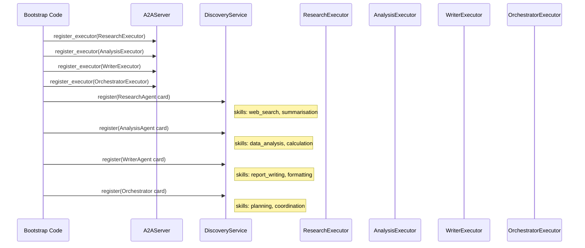
```mermaid
sequenceDiagram
    participant Boot as Bootstrap Code
    participant SRV as A2AServer
    participant DS as DiscoveryService
    participant RE as ResearchExecutor
    participant AE as AnalysisExecutor
    participant WE as WriterExecutor
    participant OE as OrchestratorExecutor

    Boot->>SRV: register_executor(ResearchExecutor)
    Boot->>SRV: register_executor(AnalysisExecutor)
    Boot->>SRV: register_executor(WriterExecutor)
    Boot->>SRV: register_executor(OrchestratorExecutor)

    Boot->>DS: register(ResearchAgent card)
    Note right of DS: skills: web_search, summarisation
    Boot->>DS: register(AnalysisAgent card)
    Note right of DS: skills: data_analysis, calculation
    Boot->>DS: register(WriterAgent card)
    Note right of DS: skills: report_writing, formatting
    Boot->>DS: register(Orchestrator card)
    Note right of DS: skills: planning, coordination
```

### 3.2 Agent Discovery Sequence

The orchestrator queries the `DiscoveryService` to find agents by skill id
before delegating tasks.

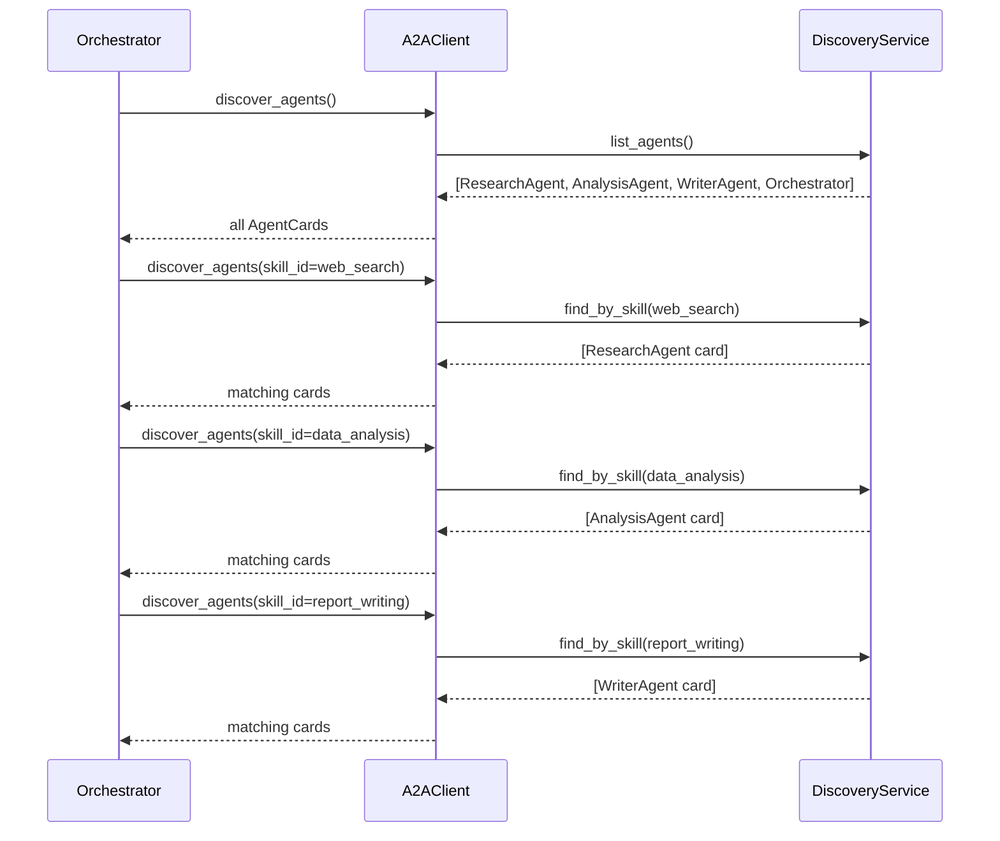
```mermaid
sequenceDiagram
    participant O as Orchestrator
    participant CL as A2AClient
    participant DS as DiscoveryService

    O->>CL: discover_agents()
    CL->>DS: list_agents()
    DS-->>CL: [ResearchAgent, AnalysisAgent, WriterAgent, Orchestrator]
    CL-->>O: all AgentCards

    O->>CL: discover_agents(skill_id=web_search)
    CL->>DS: find_by_skill(web_search)
    DS-->>CL: [ResearchAgent card]
    CL-->>O: matching cards

    O->>CL: discover_agents(skill_id=data_analysis)
    CL->>DS: find_by_skill(data_analysis)
    DS-->>CL: [AnalysisAgent card]
    CL-->>O: matching cards

    O->>CL: discover_agents(skill_id=report_writing)
    CL->>DS: find_by_skill(report_writing)
    DS-->>CL: [WriterAgent card]
    CL-->>O: matching cards
```

### 3.3 Task Execution Lifecycle

A single task flowing through the A2A server from client to executor.

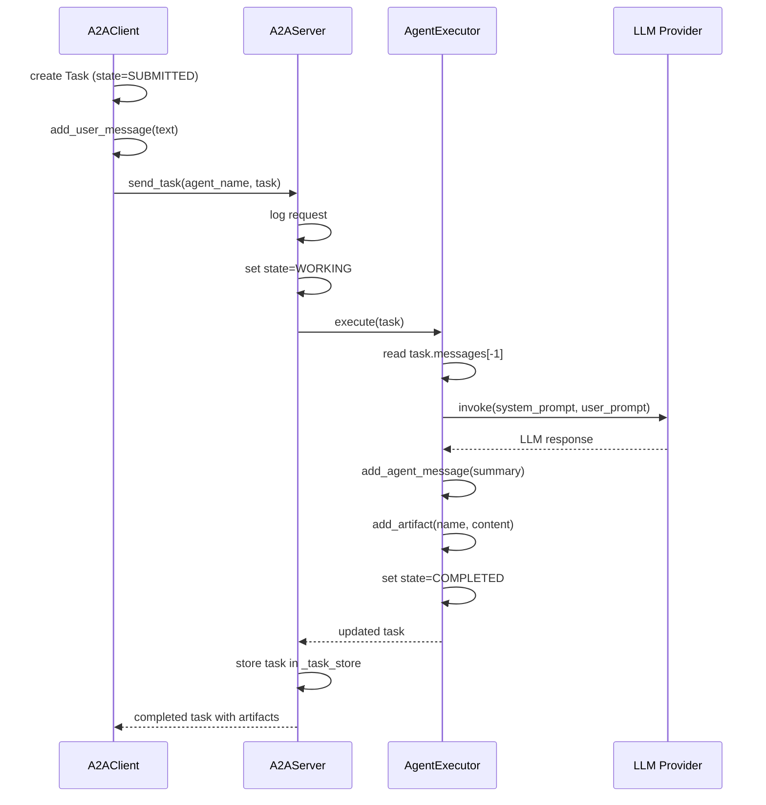
```mermaid
sequenceDiagram
    participant CL as A2AClient
    participant SRV as A2AServer
    participant EX as AgentExecutor
    participant LLM as LLM Provider

    CL->>CL: create Task (state=SUBMITTED)
    CL->>CL: add_user_message(text)
    CL->>SRV: send_task(agent_name, task)
    SRV->>SRV: log request
    SRV->>SRV: set state=WORKING
    SRV->>EX: execute(task)

    EX->>EX: read task.messages[-1]
    EX->>LLM: invoke(system_prompt, user_prompt)
    LLM-->>EX: LLM response
    EX->>EX: add_agent_message(summary)
    EX->>EX: add_artifact(name, content)
    EX->>EX: set state=COMPLETED
    EX-->>SRV: updated task

    SRV->>SRV: store task in _task_store
    SRV-->>CL: completed task with artifacts
```

### 3.4 Data Exchange via DataPart

When the orchestrator delegates to a downstream agent, it includes upstream
`Artifact` content as a `DataPart` inside the task `Message`. This is how
agents exchange structured data through the A2A protocol.

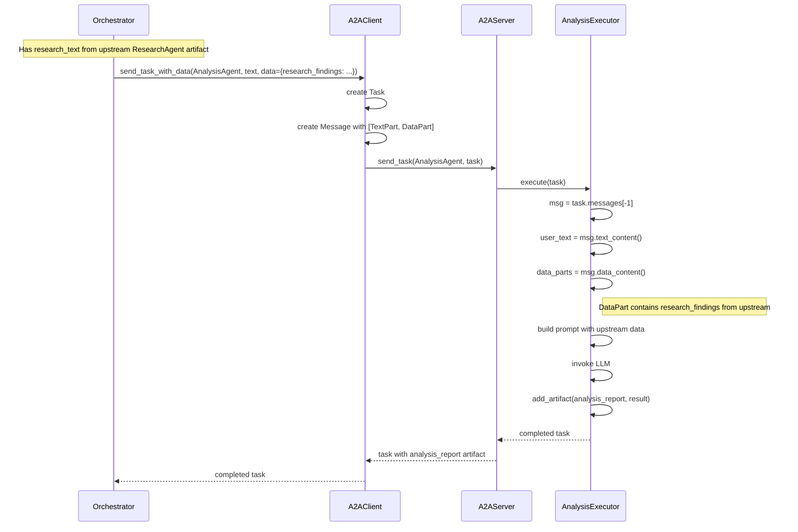
```mermaid
sequenceDiagram
    participant O as Orchestrator
    participant CL as A2AClient
    participant SRV as A2AServer
    participant AE as AnalysisExecutor

    Note over O: Has research_text from upstream ResearchAgent artifact

    O->>CL: send_task_with_data(AnalysisAgent, text, data={research_findings: ...})
    CL->>CL: create Task
    CL->>CL: create Message with [TextPart, DataPart]
    CL->>SRV: send_task(AnalysisAgent, task)
    SRV->>AE: execute(task)

    AE->>AE: msg = task.messages[-1]
    AE->>AE: user_text = msg.text_content()
    AE->>AE: data_parts = msg.data_content()
    Note right of AE: DataPart contains research_findings from upstream

    AE->>AE: build prompt with upstream data
    AE->>AE: invoke LLM
    AE->>AE: add_artifact(analysis_report, result)
    AE-->>SRV: completed task
    SRV-->>CL: task with analysis_report artifact
    CL-->>O: completed task
```

### 3.5 End-to-End Orchestrated Workflow

The complete workflow from user query through all phases.

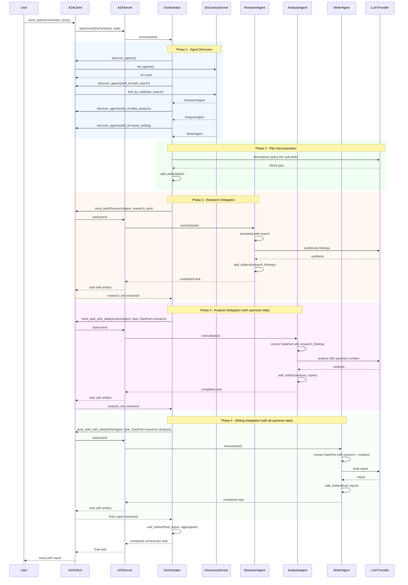
```mermaid
sequenceDiagram
    participant U as User
    participant CL as A2AClient
    participant SRV as A2AServer
    participant O as Orchestrator
    participant DS as DiscoveryService
    participant R as ResearchAgent
    participant A as AnalysisAgent
    participant W as WriterAgent
    participant LLM as LLM Provider

    U->>CL: send_task(Orchestrator, query)
    CL->>SRV: tasks/send(Orchestrator, task)
    SRV->>O: execute(task)

    rect rgb(240, 248, 255)
        Note over O,DS: Phase 1 - Agent Discovery
        O->>CL: discover_agents()
        CL->>DS: list_agents()
        DS-->>CL: all cards
        O->>CL: discover_agents(skill_id=web_search)
        CL->>DS: find_by_skill(web_search)
        DS-->>O: ResearchAgent
        O->>CL: discover_agents(skill_id=data_analysis)
        DS-->>O: AnalysisAgent
        O->>CL: discover_agents(skill_id=report_writing)
        DS-->>O: WriterAgent
    end

    rect rgb(240, 255, 240)
        Note over O,LLM: Phase 2 - Plan Decomposition
        O->>LLM: decompose query into sub-tasks
        LLM-->>O: JSON plan
        O->>O: add_artifact(plan)
    end

    rect rgb(255, 248, 240)
        Note over O,R: Phase 3 - Research Delegation
        O->>CL: send_task(ResearchAgent, research_task)
        CL->>SRV: tasks/send
        SRV->>R: execute(task)
        R->>R: simulated web search
        R->>LLM: synthesise findings
        LLM-->>R: synthesis
        R->>R: add_artifact(research_findings)
        R-->>SRV: completed task
        SRV-->>CL: task with artifact
        CL-->>O: research_text extracted
    end

    rect rgb(255, 240, 255)
        Note over O,A: Phase 4 - Analysis Delegation (with upstream data)
        O->>CL: send_task_with_data(AnalysisAgent, task, DataPart=research)
        CL->>SRV: tasks/send
        SRV->>A: execute(task)
        A->>A: extract DataPart with research_findings
        A->>LLM: analyse with upstream context
        LLM-->>A: analysis
        A->>A: add_artifact(analysis_report)
        A-->>SRV: completed task
        SRV-->>CL: task with artifact
        CL-->>O: analysis_text extracted
    end

    rect rgb(248, 255, 248)
        Note over O,W: Phase 5 - Writing Delegation (with all upstream data)
        O->>CL: send_task_with_data(WriterAgent, task, DataPart=research+analysis)
        CL->>SRV: tasks/send
        SRV->>W: execute(task)
        W->>W: extract DataPart with research + analysis
        W->>LLM: draft report
        LLM-->>W: report
        W->>W: add_artifact(final_report)
        W-->>SRV: completed task
        SRV-->>CL: task with artifact
        CL-->>O: final_report extracted
    end

    O->>O: add_artifact(final_report, aggregated)
    O-->>SRV: completed orchestrator task
    SRV-->>CL: final task
    CL-->>U: result with report
```

### 3.6 Direct Agent-to-Agent Interoperability

Section 14 of the notebook demonstrates sending tasks directly between agents
without any orchestrator, proving A2A interoperability.

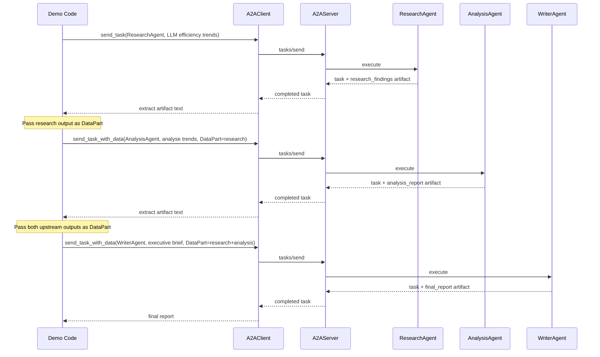
```mermaid
sequenceDiagram
    participant Demo as Demo Code
    participant CL as A2AClient
    participant SRV as A2AServer
    participant R as ResearchAgent
    participant A as AnalysisAgent
    participant W as WriterAgent

    Demo->>CL: send_task(ResearchAgent, LLM efficiency trends)
    CL->>SRV: tasks/send
    SRV->>R: execute
    R-->>SRV: task + research_findings artifact
    SRV-->>CL: completed task
    CL-->>Demo: extract artifact text

    Note over Demo: Pass research output as DataPart

    Demo->>CL: send_task_with_data(AnalysisAgent, analyse trends, DataPart=research)
    CL->>SRV: tasks/send
    SRV->>A: execute
    A-->>SRV: task + analysis_report artifact
    SRV-->>CL: completed task
    CL-->>Demo: extract artifact text

    Note over Demo: Pass both upstream outputs as DataPart

    Demo->>CL: send_task_with_data(WriterAgent, executive brief, DataPart=research+analysis)
    CL->>SRV: tasks/send
    SRV->>W: execute
    W-->>SRV: task + final_report artifact
    SRV-->>CL: completed task
    CL-->>Demo: final report
```

---

## 4. Workflow Flowcharts

### 4.1 LangGraph Workflow DAG

Section 15 of the notebook wires the agents into a LangGraph `StateGraph`.
Each node sends an A2A task to the appropriate agent.

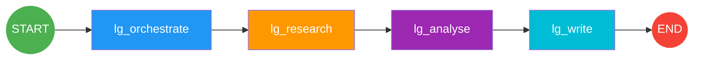
```mermaid
graph LR
    S((START)) --> O[lg_orchestrate]
    O --> R[lg_research]
    R --> A[lg_analyse]
    A --> W[lg_write]
    W --> E((END))

    style S fill:#4CAF50,color:#fff,stroke:none
    style E fill:#f44336,color:#fff,stroke:none
    style O fill:#2196F3,color:#fff
    style R fill:#FF9800,color:#fff
    style A fill:#9C27B0,color:#fff
    style W fill:#00BCD4,color:#fff
```

| Node | A2A Action | Reads from State | Writes to State |
|---|---|---|---|
| `lg_orchestrate` | LLM plan decomposition | `query` | `plan`, `messages` |
| `lg_research` | `send_task(ResearchAgent, ...)` | `plan.research_task` | `research`, `messages` |
| `lg_analyse` | `send_task_with_data(AnalysisAgent, ..., DataPart)` | `plan.analysis_task`, `research` | `analysis`, `messages` |
| `lg_write` | `send_task_with_data(WriterAgent, ..., DataPart)` | `plan.writing_task`, `research`, `analysis` | `report`, `messages` |

### 4.2 A2A Server Task Routing

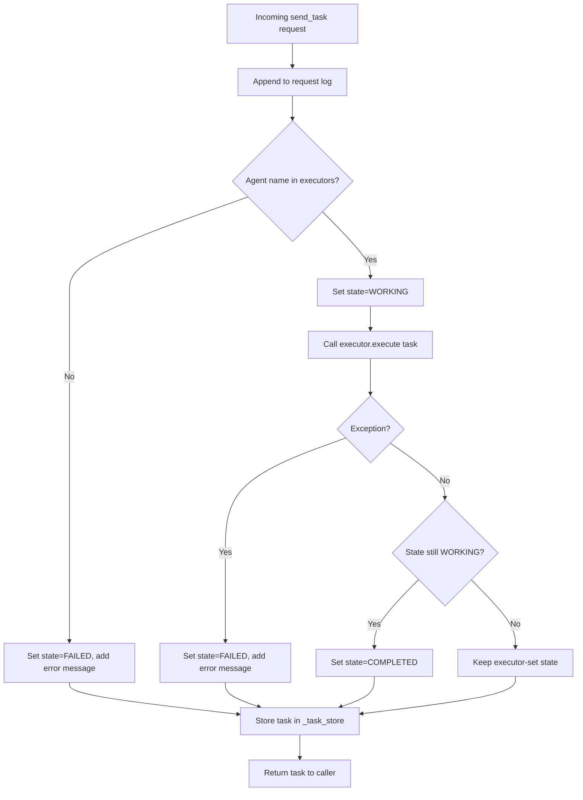
```mermaid
flowchart TD
    IN[Incoming send_task request] --> LOG[Append to request log]
    LOG --> FIND{Agent name in executors?}
    FIND -->|No| FAIL[Set state=FAILED, add error message]
    FIND -->|Yes| WORK[Set state=WORKING]
    WORK --> EXEC[Call executor.execute task]
    EXEC --> ERR{Exception?}
    ERR -->|Yes| FAIL2[Set state=FAILED, add error message]
    ERR -->|No| CHECK{State still WORKING?}
    CHECK -->|Yes| COMPLETE[Set state=COMPLETED]
    CHECK -->|No| KEEP[Keep executor-set state]
    FAIL --> STORE[Store task in _task_store]
    FAIL2 --> STORE
    COMPLETE --> STORE
    KEEP --> STORE
    STORE --> RETURN[Return task to caller]
```

### 4.3 Orchestrator Execution Flowchart

```mermaid
flowchart TD
    START([execute called with Task]) --> READ[Read user query from task messages]
    READ --> DISC1[Discover all worker agents via DiscoveryService]
    DISC1 --> DISC2[Find agents by skill: web_search, data_analysis, report_writing]
    DISC2 --> PLAN_PROMPT[Build LLM prompt with query + agent skills]
    PLAN_PROMPT --> LLM1[Invoke LLM for plan decomposition]
    LLM1 --> PARSE[Parse JSON plan from response]
    PARSE --> FENCE{Starts with code fence?}
    FENCE -->|Yes| STRIP[Strip markdown fences]
    FENCE -->|No| JSON[Parse JSON directly]
    STRIP --> JSON
    JSON --> ART1[Add plan artifact to task]

    ART1 --> DEL_R[Delegate research_task via send_task]
    DEL_R --> EXTRACT_R[Extract research_findings from artifact]

    EXTRACT_R --> DEL_A[Delegate analysis_task via send_task_with_data]
    Note right of DEL_A: DataPart contains research_findings
    DEL_A --> EXTRACT_A[Extract analysis_report from artifact]

    EXTRACT_A --> DEL_W[Delegate writing_task via send_task_with_data]
    Note right of DEL_W: DataPart contains research + analysis
    DEL_W --> EXTRACT_W[Extract final_report from artifact]

    EXTRACT_W --> AGG[Aggregate: add final_report artifact with sub-task metadata]
    AGG --> DONE([Set state=COMPLETED, return task])
```

### 4.4 Research Agent Flowchart

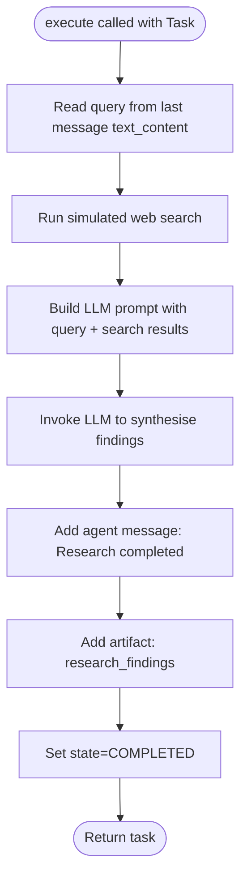
```mermaid
flowchart TD
    START([execute called with Task]) --> READ[Read query from last message text_content]
    READ --> SEARCH[Run simulated web search]
    SEARCH --> PROMPT[Build LLM prompt with query + search results]
    PROMPT --> LLM[Invoke LLM to synthesise findings]
    LLM --> MSG[Add agent message: Research completed]
    MSG --> ART[Add artifact: research_findings]
    ART --> STATE[Set state=COMPLETED]
    STATE --> RETURN([Return task])
```

### 4.5 Analysis Agent Flowchart

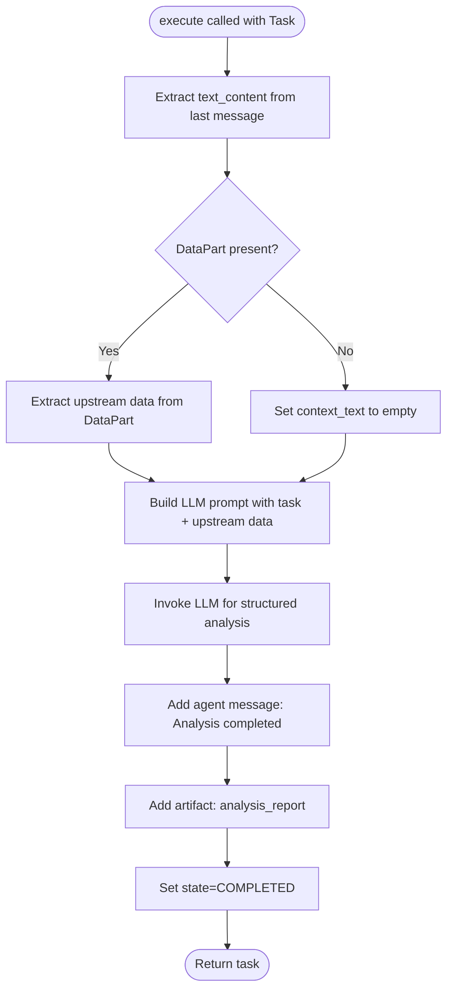
```mermaid
flowchart TD
    START([execute called with Task]) --> TEXT[Extract text_content from last message]
    TEXT --> DATA{DataPart present?}
    DATA -->|Yes| EXTRACT[Extract upstream data from DataPart]
    DATA -->|No| NODATA[Set context_text to empty]
    EXTRACT --> PROMPT[Build LLM prompt with task + upstream data]
    NODATA --> PROMPT
    PROMPT --> LLM[Invoke LLM for structured analysis]
    LLM --> MSG[Add agent message: Analysis completed]
    MSG --> ART[Add artifact: analysis_report]
    ART --> STATE[Set state=COMPLETED]
    STATE --> RETURN([Return task])
```

### 4.6 Writer Agent Flowchart

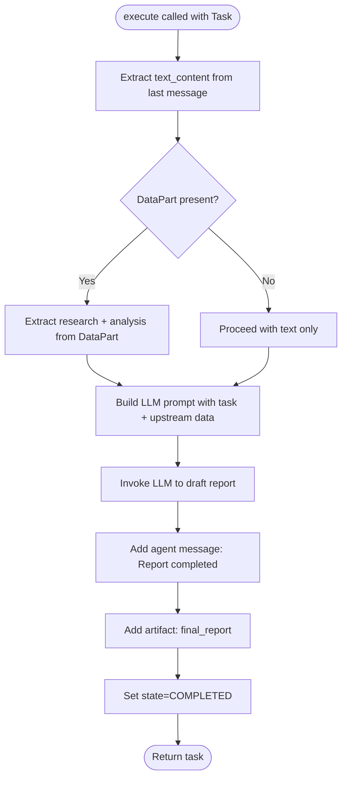
```mermaid
flowchart TD
    START([execute called with Task]) --> TEXT[Extract text_content from last message]
    TEXT --> DATA{DataPart present?}
    DATA -->|Yes| EXTRACT[Extract research + analysis from DataPart]
    DATA -->|No| NODATA[Proceed with text only]
    EXTRACT --> PROMPT[Build LLM prompt with task + upstream data]
    NODATA --> PROMPT
    PROMPT --> LLM[Invoke LLM to draft report]
    LLM --> MSG[Add agent message: Report completed]
    MSG --> ART[Add artifact: final_report]
    ART --> STATE[Set state=COMPLETED]
    STATE --> RETURN([Return task])
```

### 4.7 Task State Machine

The A2A `Task` progresses through a well-defined lifecycle.

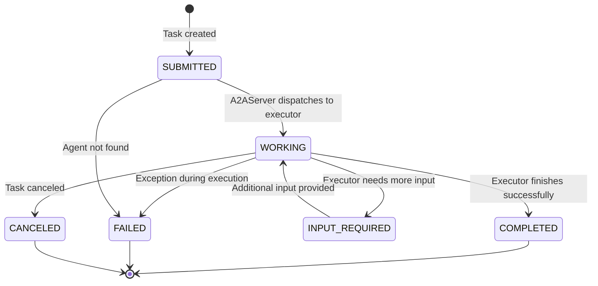
```mermaid
stateDiagram-v2
    [*] --> SUBMITTED : Task created
    SUBMITTED --> WORKING : A2AServer dispatches to executor
    WORKING --> COMPLETED : Executor finishes successfully
    WORKING --> FAILED : Exception during execution
    WORKING --> INPUT_REQUIRED : Executor needs more input
    INPUT_REQUIRED --> WORKING : Additional input provided
    SUBMITTED --> FAILED : Agent not found
    COMPLETED --> [*]
    FAILED --> [*]
    WORKING --> CANCELED : Task canceled
    CANCELED --> [*]
```

### 4.8 Discovery Service Lookup Flowchart

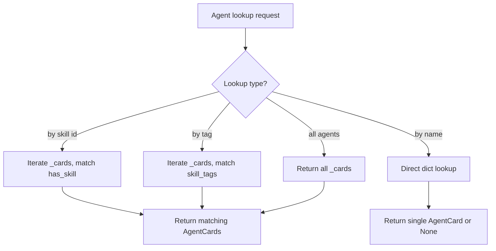
```mermaid
flowchart TD
    REQ[Agent lookup request] --> TYPE{Lookup type?}
    TYPE -->|by skill id| SKILL[Iterate _cards, match has_skill]
    TYPE -->|by tag| TAG[Iterate _cards, match skill_tags]
    TYPE -->|all agents| ALL[Return all _cards]
    TYPE -->|by name| NAME[Direct dict lookup]

    SKILL --> FILTER[Return matching AgentCards]
    TAG --> FILTER
    ALL --> FILTER
    NAME --> SINGLE[Return single AgentCard or None]
```

---

## 5. Component Descriptions

### A2A Protocol Data Types

**TaskState** — Enum defining the lifecycle states a `Task` can occupy:
`SUBMITTED`, `WORKING`, `INPUT_REQUIRED`, `COMPLETED`, `FAILED`, `CANCELED`.

**TextPart / DataPart / FilePart** — The smallest content units within a
`Message` or `Artifact`. `TextPart` carries plain text, `DataPart` carries
structured JSON (used for passing upstream artifacts as context), and
`FilePart` carries file references.

**Message** — A single communication turn with a `role` (`user` or `agent`)
and a list of `Part` objects. Provides `text_content()` to extract all text
and `data_content()` to extract all structured data.

**Artifact** — A named output produced by an agent during task execution.
Carries content as `Part` objects and optional metadata (e.g. source agent,
sub-task references).

**Task** — The fundamental unit of work. Identified by a unique ID, carries a
state, a list of messages (the conversation), a list of artifacts (the outputs),
and metadata. Provides helper methods to add messages and artifacts.

**Skill** — Describes a specific capability an agent advertises: id, name,
description, tags, examples, and supported input/output modes.

**AgentCard** — The JSON metadata document an agent publishes (at
`/.well-known/agent.json` in production). Contains name, description, URL,
version, skills, auth type, and protocol version. Provides `has_skill()` and
`skill_tags()` for capability matching.

### A2A Infrastructure

**AgentExecutor** — Abstract base class. Holds an `AgentCard` and defines
`execute(task) -> task`. Subclasses implement domain-specific logic.

**A2AServer** — In-process simulation of the A2A JSON-RPC transport layer.
Hosts registered executors, routes `send_task` requests to the correct executor,
manages the task lifecycle (setting states, handling exceptions), and maintains
a task store and request log for auditing.

**DiscoveryService** — In-memory registry of `AgentCard` objects. Supports
lookup by name, by skill id, by tag, or listing all agents. In production this
would be replaced by fetching cards from each agent's `/.well-known/agent.json`
endpoint.

**A2AClient** — Thin client that wraps the `A2AServer` and `DiscoveryService`.
Provides convenience methods: `discover_agents()`, `send_task()`, and
`send_task_with_data()` (which bundles a `TextPart` and a `DataPart` into the
task message).

### Agent Executors

**ResearchExecutor** — Runs a simulated web search, feeds results to the LLM
for synthesis, and attaches the output as a `research_findings` artifact.
Skills: `web_search`, `summarisation`.

**AnalysisExecutor** — Reads the user message's `TextPart` and optional
`DataPart` (upstream context), invokes the LLM for structured analysis, and
attaches an `analysis_report` artifact. Skills: `data_analysis`, `calculation`.

**WriterExecutor** — Reads upstream data from `DataPart`, invokes the LLM to
draft a report, and attaches a `final_report` artifact. Skills:
`report_writing`, `formatting`.

**OrchestratorExecutor** — The workflow coordinator. Discovers agents via the
`DiscoveryService`, uses the LLM to decompose the user query into sub-tasks,
delegates each sub-task as an A2A `Task` to the appropriate agent (passing
upstream `Artifact` data as `DataPart`), and aggregates all results into a
final artifact with sub-task metadata.

---

## 6. Design Patterns & Key Decisions

| Pattern | Application |
|---|---|
| **Strategy** | `AgentExecutor.execute()` — each subclass implements a different execution strategy |
| **Service Locator** | `DiscoveryService` lets agents find peers by capability at runtime |
| **Facade** | `A2AClient` provides a simple interface over `A2AServer` + `DiscoveryService` |
| **Message Passing** | All inter-agent communication uses `Task` / `Message` / `Part` / `Artifact` — no shared memory |
| **Pipeline** | The orchestrator chains research -> analysis -> writing, passing `DataPart` downstream |
| **Factory** | `_build_llm()` selects OpenAI or Anthropic based on configuration |
| **Observer (audit)** | `A2AServer._request_log` and `_task_store` record all operations |

### Why an in-process A2A simulation?

For educational clarity and zero infrastructure dependencies. The protocol
boundary (AgentCards, Tasks, Messages, Artifacts, JSON serialisation) mirrors
the real A2A spec. Migrating to real HTTP/JSON-RPC transport would only require
replacing the `A2AServer.send_task()` method with HTTP calls and the
`DiscoveryService` with `/.well-known/agent.json` fetches — no agent logic
changes.

### How data flows between agents

The A2A protocol is intentionally **opaque**: agents do not share memory,
tools, or internal state. The orchestrator extracts `Artifact.text_content()`
from a completed task and embeds it as a `DataPart` in the next task's
`Message`. This preserves the A2A principle that agents collaborate through
declared capabilities and structured data exchange only.

---

## 7. A2A Capability Mapping

| A2A Capability | Protocol Primitives | Notebook Sections | Key Code Paths |
|---|---|---|---|
| **Interoperability** | `Task`, `Message`, `Part` (TextPart, DataPart), `Artifact` | 12 (orchestrated), 14 (direct agent-to-agent) | `A2AClient.send_task()` / `send_task_with_data()` -> `A2AServer.send_task()` -> `AgentExecutor.execute()` |
| **Agent Discovery** | `AgentCard`, `Skill`, `DiscoveryService` | 10 (registration), 11 (skill and tag queries), 9 (orchestrator uses discovery) | `DiscoveryService.register()` / `find_by_skill()` / `find_by_tag()` |
| **Workflow Orchestration** | `Task` delegation, `DataPart` for upstream context, `Artifact` aggregation | 9 (OrchestratorExecutor), 12 (workflow run), 15 (LangGraph version) | `OrchestratorExecutor.execute()` -> discover -> plan -> delegate -> aggregate |
