# Multi-Agent Agentic Workflow with MCP Protocol — Architecture & Design Documentation

This document provides a detailed architectural analysis of the
`agentic_workflow_tool_use.ipynb` notebook, which implements a **multi-agent
system** communicating through the **Model Context Protocol (MCP)**. It covers
the four core MCP capabilities — **tool calling**, **dynamic tool discovery**,
**contextual data sharing with persistence**, and **agent registration** — with
UML class diagrams, sequence diagrams, and workflow flowcharts rendered in
Mermaid.

---

## Table of Contents

1. [System Overview](#1-system-overview)
2. [Static Architecture — UML Class Diagrams](#2-static-architecture--uml-class-diagrams)
   - 2.1 [MCP Protocol Layer](#21-mcp-protocol-layer)
   - 2.2 [Agent Hierarchy](#22-agent-hierarchy)
   - 2.3 [Full System Class Diagram](#23-full-system-class-diagram)
3. [Dynamic Behaviour — UML Sequence Diagrams](#3-dynamic-behaviour--uml-sequence-diagrams)
   - 3.1 [Agent Registration Sequence](#31-agent-registration-sequence)
   - 3.2 [Dynamic Tool Discovery Sequence](#32-dynamic-tool-discovery-sequence)
   - 3.3 [Tool Calling Sequence](#33-tool-calling-sequence)
   - 3.4 [Contextual Data Sharing Sequence](#34-contextual-data-sharing-sequence)
   - 3.5 [End-to-End Workflow Sequence](#35-end-to-end-workflow-sequence)
4. [Workflow Flowcharts](#4-workflow-flowcharts)
   - 4.1 [LangGraph Workflow DAG](#41-langgraph-workflow-dag)
   - 4.2 [MCP Server Request Routing](#42-mcp-server-request-routing)
   - 4.3 [Orchestrator Planning Flowchart](#43-orchestrator-planning-flowchart)
   - 4.4 [Research Agent Flowchart](#44-research-agent-flowchart)
   - 4.5 [Analysis Agent Flowchart](#45-analysis-agent-flowchart)
   - 4.6 [Writer Agent Flowchart](#46-writer-agent-flowchart)
   - 4.7 [Dynamic Runtime Tool Registration Flowchart](#47-dynamic-runtime-tool-registration-flowchart)
   - 4.8 [Context Persistence Lifecycle](#48-context-persistence-lifecycle)
5. [Component Descriptions](#5-component-descriptions)
6. [Design Patterns & Key Decisions](#6-design-patterns--key-decisions)
7. [MCP Capability Mapping](#7-mcp-capability-mapping)

---

## 1. System Overview

The system consists of four **LLM-powered agents** that collaborate to answer
complex user queries. All inter-agent data exchange, tool invocation, and
agent discovery is routed through a lightweight, in-process **MCP server**.

| Layer | Components |
|---|---|
| **LLM** | OpenAI (`gpt-4o-mini`) or Anthropic (`claude-sonnet-4-20250514`), configurable at startup |
| **Agents** | `OrchestratorAgent`, `ResearchAgent`, `AnalysisAgent`, `WriterAgent` |
| **MCP Server** | `MCPToolRegistry`, `MCPAgentRegistry`, `MCPContextStore`, request router |
| **Tools** | `web_search`, `calculator`, `text_summariser`, `format_report`, (+ runtime-registered `sentiment_analyser`) |
| **Orchestration** | LangGraph `StateGraph` wiring agents into a linear DAG |

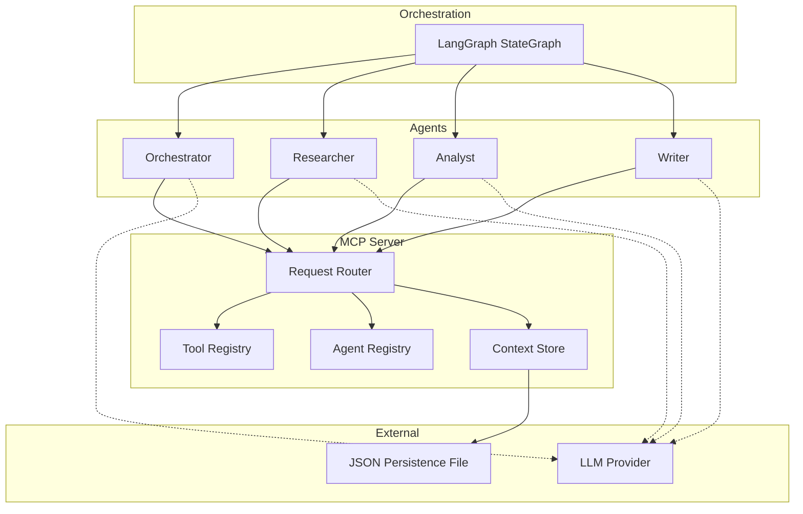

---

## 2. Static Architecture — UML Class Diagrams

### 2.1 MCP Protocol Layer

The protocol layer uses a **JSON-RPC 2.0 inspired** message envelope
(`MCPMessage` / `MCPResponse`) and three registries managed by a central
`MCPServer` facade.

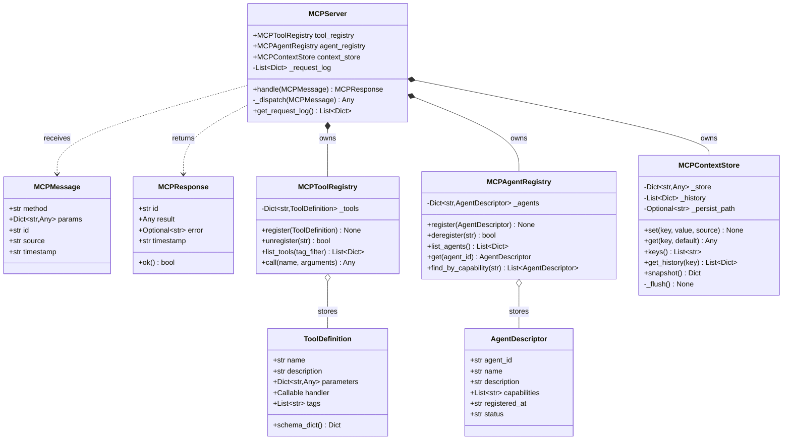

### 2.2 Agent Hierarchy

All agents extend `MCPAgent`, which provides the LLM integration and MCP
helper methods. Each specialised agent adds a domain-specific `run()` or
`plan()` method.

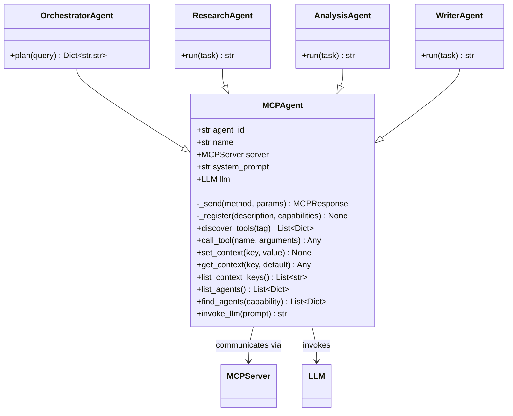

### 2.3 Full System Class Diagram

Combines all classes and relationships into a single view.

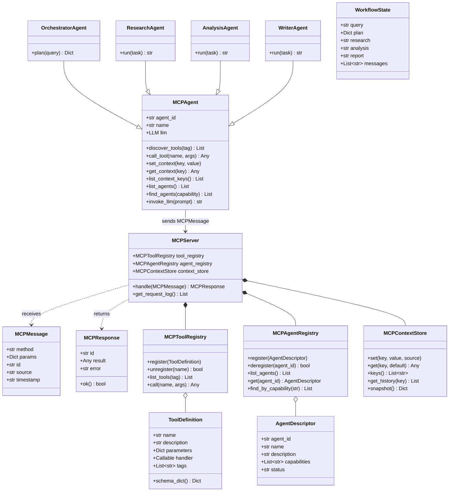

---

## 3. Dynamic Behaviour — UML Sequence Diagrams

### 3.1 Agent Registration Sequence

When `build_workflow()` is called, each agent constructor triggers a
`agents/register` MCP message. This happens before any user query is processed.

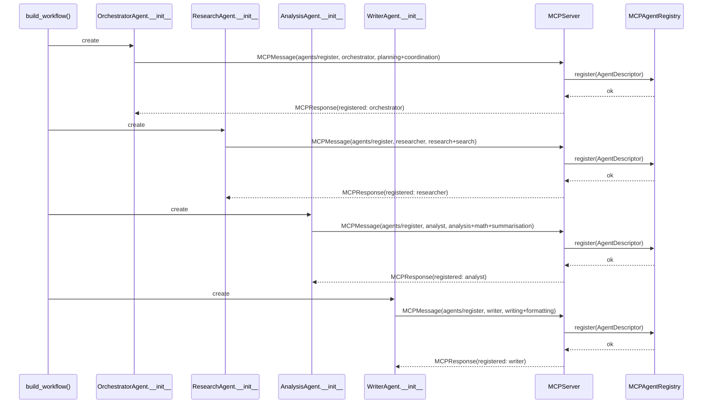

### 3.2 Dynamic Tool Discovery Sequence

Before performing work, each agent issues a `tools/list` request with an
optional tag filter to discover relevant tools at runtime.

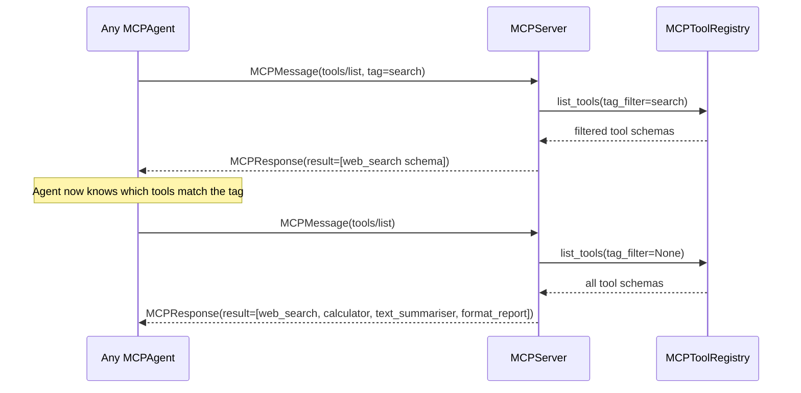

### 3.3 Tool Calling Sequence

Agents call tools by sending a `tools/call` MCP message with the tool name
and arguments. The MCP server delegates to the registered handler.

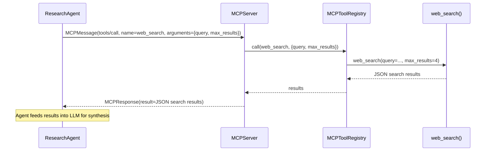

### 3.4 Contextual Data Sharing Sequence

Agents write data to and read data from the shared `MCPContextStore` via
`context/set` and `context/get` messages. The store flushes to disk on
every write.

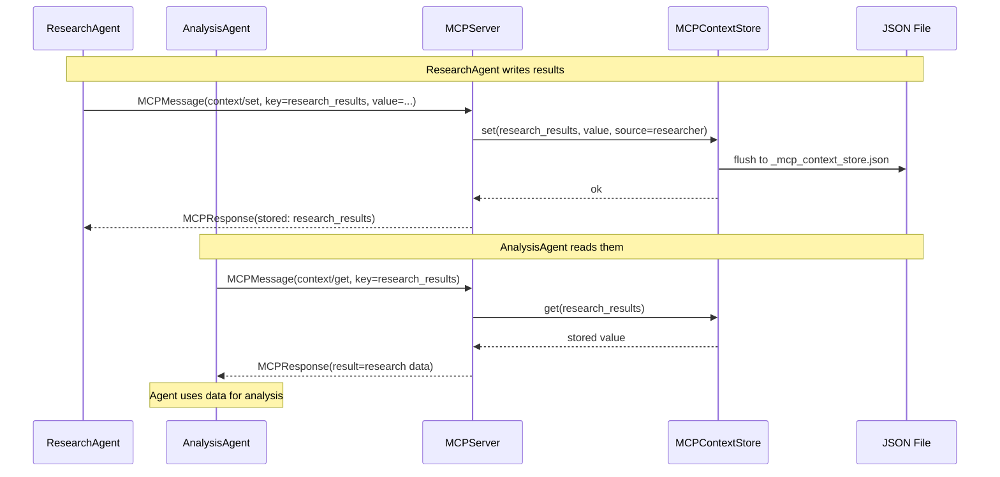

### 3.5 End-to-End Workflow Sequence

The complete workflow from user query through all four agents to final report.

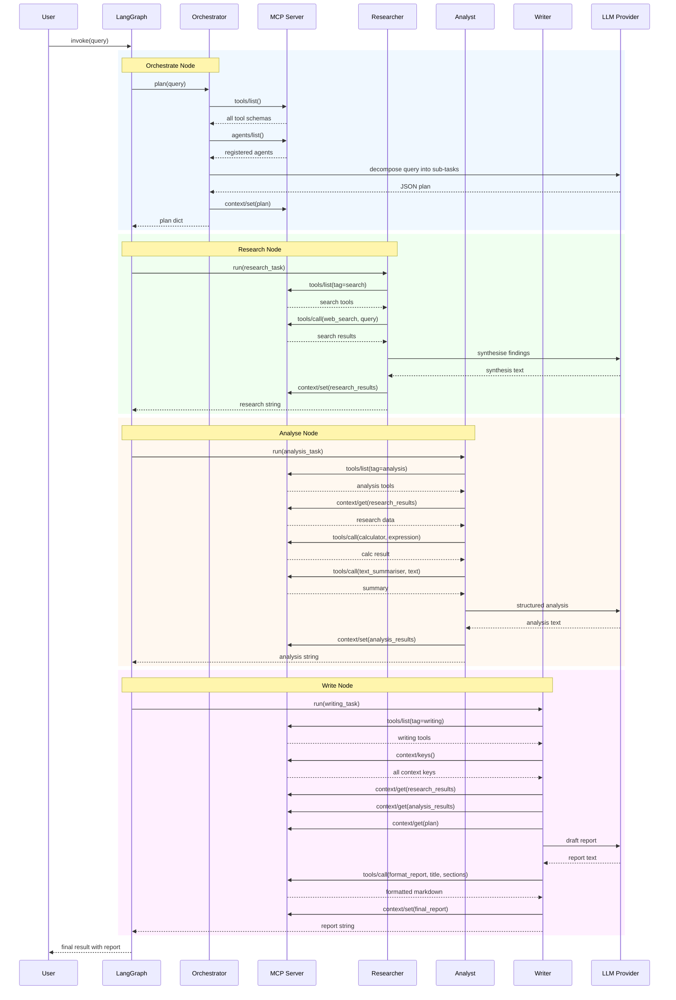

---

## 4. Workflow Flowcharts

### 4.1 LangGraph Workflow DAG

The four agents are wired into a strictly sequential DAG via LangGraph's
`StateGraph`.

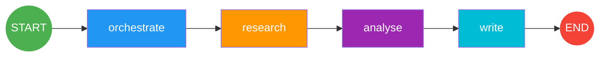

Each node receives the shared `WorkflowState` and returns a partial update:

| Node | Reads from state | Writes to state |
|---|---|---|
| `orchestrate` | `query` | `plan`, `messages` |
| `research` | `plan.research_task` | `research`, `messages` |
| `analyse` | `plan.analysis_task` | `analysis`, `messages` |
| `write` | `plan.writing_task` | `report`, `messages` |

### 4.2 MCP Server Request Routing

The `MCPServer._dispatch()` method routes incoming messages to the correct
subsystem based on the `method` prefix.

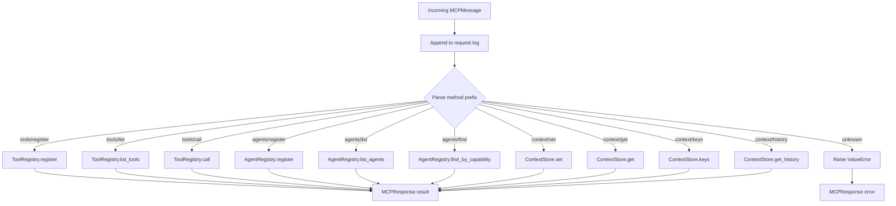

### 4.3 Orchestrator Planning Flowchart

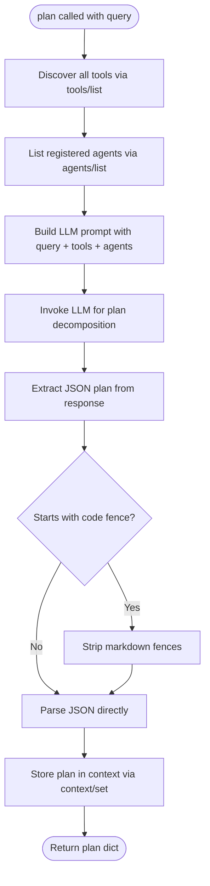

### 4.4 Research Agent Flowchart

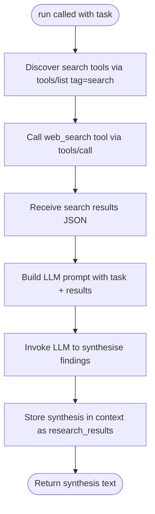

### 4.5 Analysis Agent Flowchart

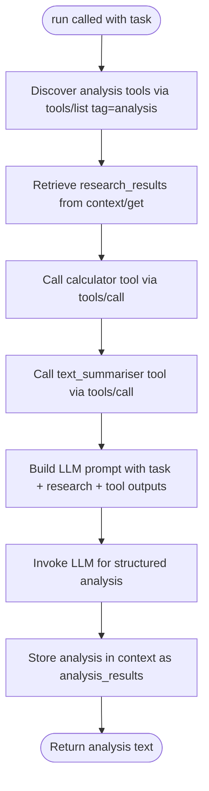

### 4.6 Writer Agent Flowchart

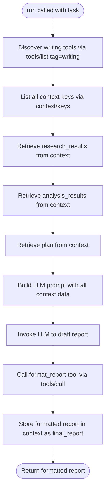

### 4.7 Dynamic Runtime Tool Registration Flowchart

After the main workflow finishes, Section 12 of the notebook demonstrates
adding a tool at runtime and using it immediately.

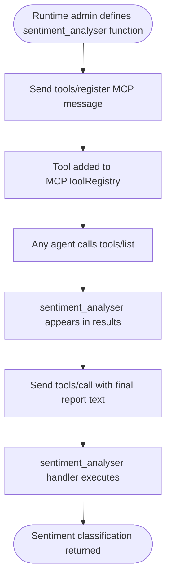

### 4.8 Context Persistence Lifecycle

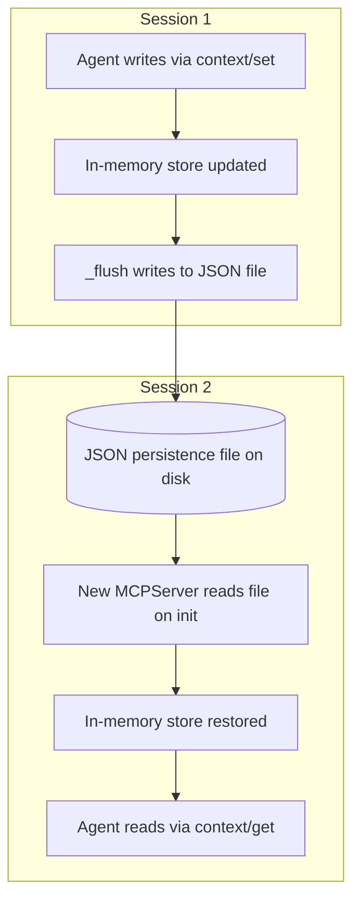

---

## 5. Component Descriptions

### MCPMessage / MCPResponse

The communication primitive. Modelled after **JSON-RPC 2.0**: every request
carries a `method` string (e.g. `tools/call`), a `params` dict, a unique
`id`, and the `source` agent that sent it. Responses echo the `id` and carry
either a `result` or an `error`.

### MCPToolRegistry

A **dynamic service catalogue** for tools. Tools are stored as
`ToolDefinition` objects that bundle a name, description, JSON-Schema style
parameter spec, a callable handler, and a set of tags for filtering. Agents
can:
- **Register** new tools at any time (`tools/register`).
- **Discover** tools, optionally filtered by tag (`tools/list`).
- **Call** tools by name with arguments (`tools/call`).

### MCPAgentRegistry

Maintains an inventory of all **live agents** and their self-declared
capabilities. Supports:
- **Registration** with full metadata (`agents/register`).
- **Listing** all agents (`agents/list`).
- **Capability search** to find agents with a specific skill (`agents/find`).

### MCPContextStore

A **key-value store** shared across agents with built-in audit history. Each
`set()` appends a timestamped history entry. The store optionally persists to
a JSON file on every write, enabling **cross-session state recovery**.

### MCPServer

The **routing facade**. It logs every request, dispatches to the correct
subsystem based on the method prefix (`tools/`, `agents/`, `context/`), and
wraps results in `MCPResponse` envelopes. All error handling is centralised
here.

### MCPAgent (Base)

Wraps an LLM instance and provides convenience methods for every MCP
operation: tool discovery, tool calling, context read/write, agent listing.
The constructor **automatically registers** the agent with the MCP server.

### OrchestratorAgent

Uses the LLM to decompose a user query into three sub-tasks. Before planning,
it discovers available tools and registered agents to inform the LLM. The plan
is stored in the shared context for downstream agents to reference.

### ResearchAgent

Discovers search-tagged tools, calls `web_search` through MCP, and feeds the
results to the LLM for synthesis. Stores findings in context under
`research_results`.

### AnalysisAgent

Reads the researcher's findings from context, calls `calculator` and
`text_summariser` for quantitative and textual analysis, and produces a
structured analysis stored as `analysis_results`.

### WriterAgent

Reads all accumulated context (plan, research, analysis), uses the LLM to
draft a report, formats it via the `format_report` tool, and stores the final
output as `final_report`.

### WorkflowState

A `TypedDict` flowing through LangGraph nodes. Fields are: `query`, `plan`,
`research`, `analysis`, `report`, and an append-only `messages` list for
tracing.

---

## 6. Design Patterns & Key Decisions

| Pattern | Application |
|---|---|
| **Facade** | `MCPServer` provides a single entry point for three subsystems |
| **Service Locator** | `MCPToolRegistry` and `MCPAgentRegistry` let agents discover services at runtime |
| **Template Method** | `MCPAgent` defines the registration and communication skeleton; subclasses override `run()` / `plan()` |
| **Observer (audit)** | `MCPContextStore._history` and `MCPServer._request_log` record all mutations |
| **Strategy** | `_build_llm()` factory selects OpenAI or Anthropic based on configuration |
| **Pipeline** | LangGraph DAG chains agents in a linear pipeline with shared state |
| **Message Passing** | All cross-component calls use `MCPMessage` / `MCPResponse` rather than direct method calls |

### Why an in-process MCP server?

For educational clarity and zero external dependencies. The protocol boundary
(message envelopes, routing, registries) mirrors the real MCP specification
closely enough that upgrading to an out-of-process server (HTTP/SSE or
stdio transport) would only require replacing the `_send()` method on
`MCPAgent` and the transport layer on `MCPServer`, without changing any agent
logic.

### Why LangGraph for orchestration?

LangGraph provides a declarative way to define the agent pipeline as a
`StateGraph` with typed state. This makes the execution order explicit,
enables future branching or parallelism by changing edges, and provides
built-in support for checkpointing.

---

## 7. MCP Capability Mapping

| MCP Capability | Protocol Methods | Notebook Sections | Components Involved |
|---|---|---|---|
| **Tool Calling** | `tools/call` | 8 (agent `run` methods), 10 (workflow execution), 12 (runtime tool call) | `MCPAgent.call_tool()` -> `MCPServer` -> `MCPToolRegistry.call()` -> handler |
| **Dynamic Tool Discovery** | `tools/list`, `tools/register` | 8 (every agent's `run`/`plan`), 12 (runtime registration) | `MCPAgent.discover_tools()` -> `MCPServer` -> `MCPToolRegistry.list_tools()` |
| **Contextual Data Sharing & Persistence** | `context/set`, `context/get`, `context/keys`, `context/history` | 8 (agents store/retrieve results), 11 (inspect store), 14 (cross-session restore) | `MCPAgent.set_context()` / `get_context()` -> `MCPServer` -> `MCPContextStore` -> JSON file |
| **Agent Registration** | `agents/register`, `agents/list`, `agents/find` | 7-8 (auto-registration in constructor), 10 (orchestrator queries agents), 13 (capability search) | `MCPAgent._register()` -> `MCPServer` -> `MCPAgentRegistry` |
