# Multi-Agent System with Supervisor - Architecture Documentation

This document provides comprehensive UML diagrams and flowcharts describing the architecture and workflow of the Multi-Agent System with a Supervisor Agent that coordinates specialized worker agents using LangGraph.

---

## Table of Contents

1. [Overview](#overview)
2. [Class Diagram](#class-diagram)
3. [Component Diagram](#component-diagram)
4. [State Graph Architecture](#state-graph-architecture)
5. [Sequence Diagram - Simple Task](#sequence-diagram---simple-task)
6. [Sequence Diagram - Complex Task](#sequence-diagram---complex-task)
7. [Supervisor Decision Flowchart](#supervisor-decision-flowchart)
8. [Agent Node Execution Flowchart](#agent-node-execution-flowchart)
9. [Routing Logic Flowchart](#routing-logic-flowchart)
10. [State Transition Diagram](#state-transition-diagram)
11. [Message Flow Diagram](#message-flow-diagram)

---

## Overview

This system implements a **Supervisor Pattern** for multi-agent orchestration where a central Supervisor Agent coordinates multiple specialized worker agents.

### System Components

| Component | Role | Description |
|-----------|------|-------------|
| **Supervisor Agent** | Orchestrator | Analyzes tasks and routes to appropriate workers |
| **Research Agent** | Worker | Gathers information, facts, and research |
| **Code Agent** | Worker | Writes code and technical implementations |
| **Writer Agent** | Worker | Creates articles, documentation, content |

### Architecture Pattern

```
┌─────────────────────────────────────────────────────────────┐
│                    SUPERVISOR PATTERN                        │
├─────────────────────────────────────────────────────────────┤
│                                                             │
│                    ┌──────────────┐                         │
│         ┌─────────►│  Supervisor  │◄─────────┐              │
│         │          │    Agent     │          │              │
│         │          └──────┬───────┘          │              │
│         │                 │                  │              │
│    ┌────┴────┐      ┌────┴────┐       ┌────┴────┐         │
│    │Research │      │  Code   │       │ Writer  │          │
│    │ Agent   │      │  Agent  │       │  Agent  │          │
│    └─────────┘      └─────────┘       └─────────┘          │
│                                                             │
└─────────────────────────────────────────────────────────────┘
```

---

## Class Diagram

This diagram shows the data structures, agent functions, and their relationships.

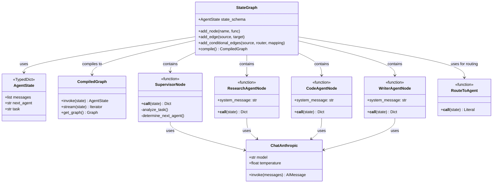

### Description

The class diagram shows:

- **AgentState**: TypedDict holding messages (accumulating), next_agent routing decision, and the original task
- **StateGraph**: LangGraph workflow builder for defining nodes and edges
- **CompiledGraph**: Executable workflow that can be invoked
- **ChatAnthropic**: Claude LLM for all agent reasoning
- **Agent Nodes**: Functions that process state and return updates
- **RouteToAgent**: Routing function for conditional edges

---

## Component Diagram

This diagram shows the high-level system organization.

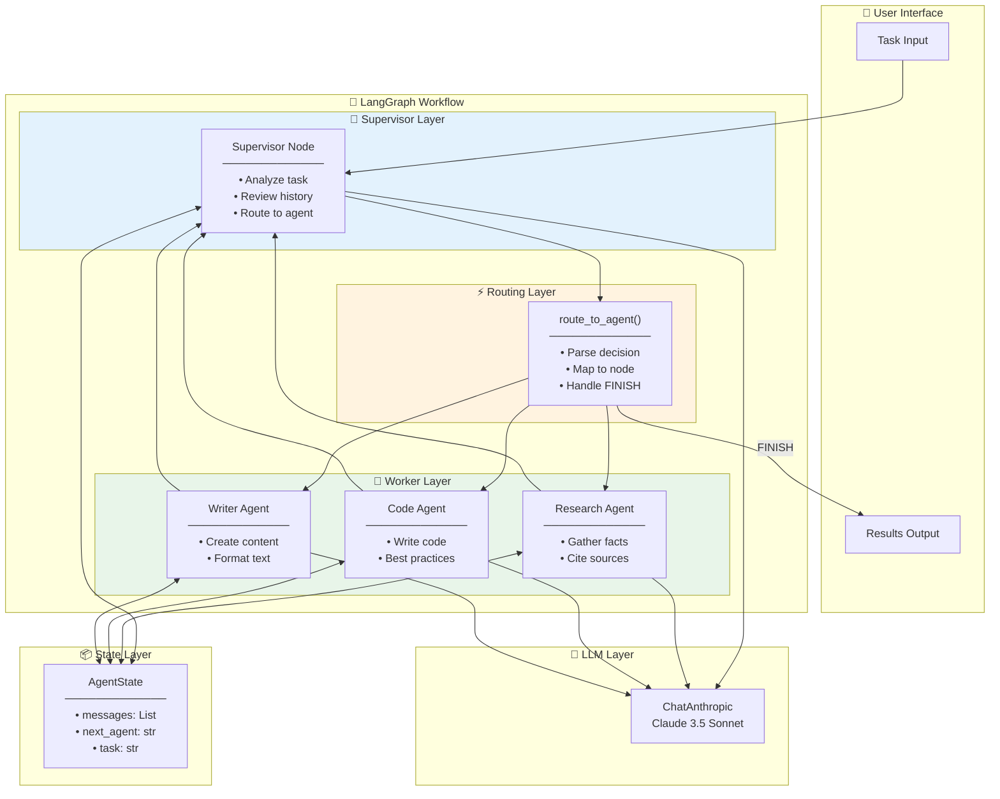

### Description

The system is organized into layers:

- **User Interface**: Task input and results output
- **Supervisor Layer**: Central routing and orchestration
- **Worker Layer**: Three specialized agents
- **Routing Layer**: Conditional edge logic
- **State Layer**: Shared state across all nodes
- **LLM Layer**: Claude model for all reasoning

---

## State Graph Architecture

This diagram shows the LangGraph workflow structure.

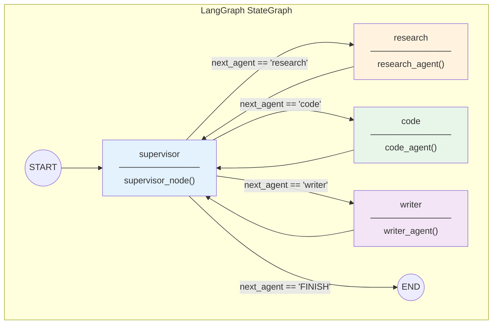

### Description

The graph structure:

- **START → Supervisor**: All workflows begin at the supervisor
- **Conditional Edges**: Supervisor routes to appropriate worker based on `next_agent`
- **Worker → Supervisor**: All workers return to supervisor after completing
- **Supervisor → END**: Workflow terminates when supervisor decides "FINISH"

This creates a hub-and-spoke pattern with the supervisor at the center.

---

## Sequence Diagram - Simple Task

This diagram shows a simple task that requires only one agent.

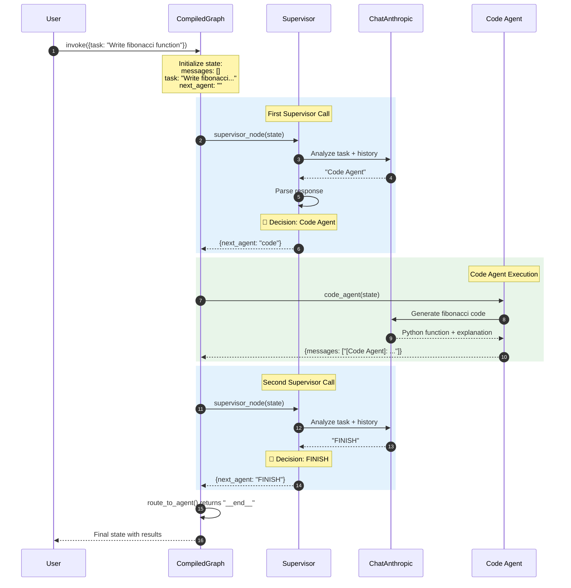

### Description

Simple task flow:

1. **User Input**: Task submitted to compiled graph
2. **First Supervisor**: Analyzes task, routes to Code Agent
3. **Code Agent**: Generates fibonacci function
4. **Second Supervisor**: Reviews completed work, decides FINISH
5. **Termination**: Workflow ends, results returned

---

## Sequence Diagram - Complex Task

This diagram shows a complex task requiring multiple agents.

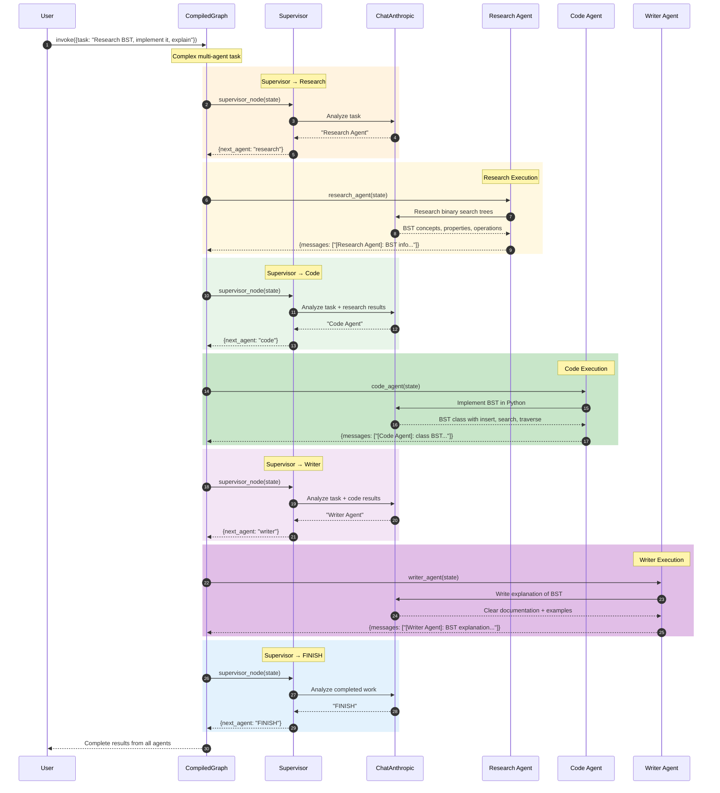

### Description

Complex task flow with multiple agents:

1. **Research Phase**: Gather information about BST concepts
2. **Code Phase**: Implement BST based on research
3. **Writing Phase**: Create explanation based on research and code
4. **Completion**: All sub-tasks done, supervisor finishes

Messages accumulate, giving each subsequent agent full context.

---

## Supervisor Decision Flowchart

This diagram details the supervisor's decision-making logic.

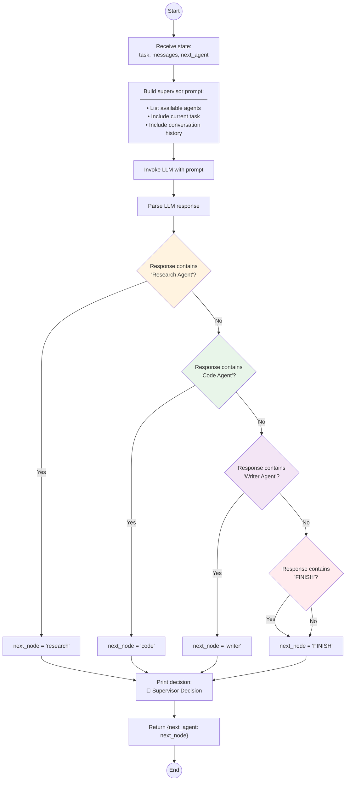

### Description

Supervisor decision process:

1. **Build Prompt**: Include agent descriptions, task, and full history
2. **LLM Reasoning**: Claude analyzes what's needed next
3. **Parse Response**: Match response to known agent names
4. **Default Handling**: Unknown responses default to FINISH
5. **Return Decision**: Update `next_agent` in state

The supervisor uses case-insensitive matching for flexibility.

---

## Agent Node Execution Flowchart

This diagram shows how worker agents process their tasks.

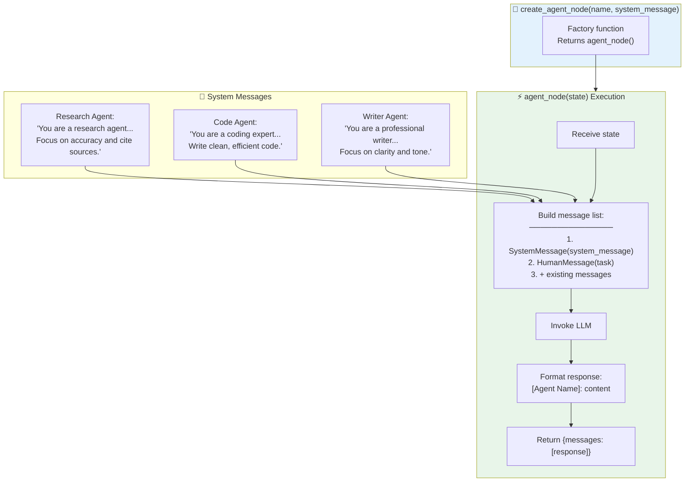

### Description

Agent node creation and execution:

**Factory Pattern:**
- `create_agent_node()` returns a configured agent function
- Each agent has a unique system message defining its role

**Execution Flow:**
1. Receive current state
2. Build messages: system prompt + task + history
3. Invoke LLM for response
4. Format with agent name prefix
5. Return message to accumulate in state

---

## Routing Logic Flowchart

This diagram shows the conditional routing implementation.

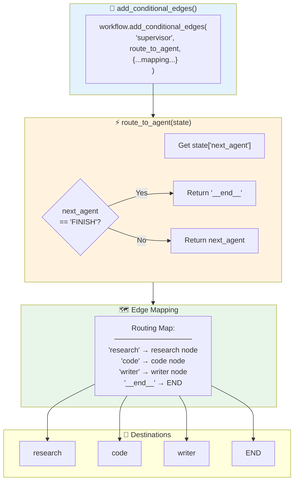

### Description

Routing implementation:

**Conditional Edges:**
- Defined on the supervisor node
- Uses `route_to_agent()` function
- Maps return values to destination nodes

**route_to_agent():**
- Checks if `next_agent` is "FINISH"
- Returns `"__end__"` for termination
- Otherwise returns the agent node name

**Edge Mapping:**
- Dictionary mapping route values to actual nodes
- `"__end__"` maps to LangGraph's END constant

---

## State Transition Diagram

This diagram shows all possible state transitions.

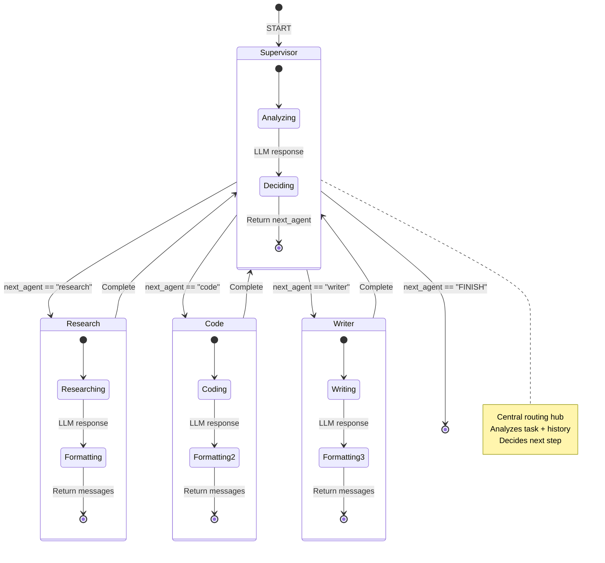

### Description

State transitions:

- **Supervisor**: Always the entry point and routing hub
- **Worker Agents**: Execute tasks and return to supervisor
- **Termination**: Only supervisor can end the workflow
- **Cycling**: Workers always return to supervisor for next decision

---

## Message Flow Diagram

This diagram shows how messages accumulate through the workflow.

```mermaid
flowchart TD
    subgraph Initial["📥 Initial State"]
        I1["messages: []<br/>task: 'Research BST...'<br/>next_agent: ''"]
    end

    subgraph AfterSup1["After Supervisor #1"]
        S1["messages: []<br/>task: 'Research BST...'<br/>next_agent: 'research'"]
    end

    subgraph AfterResearch["After Research Agent"]
        R1["messages: [<br/>  '[Research]: BST info...'<br/>]<br/>task: 'Research BST...'<br/>next_agent: 'research'"]
    end

    subgraph AfterSup2["After Supervisor #2"]
        S2["messages: [<br/>  '[Research]: BST info...'<br/>]<br/>task: 'Research BST...'<br/>next_agent: 'code'"]
    end

    subgraph AfterCode["After Code Agent"]
        C1["messages: [<br/>  '[Research]: BST info...',<br/>  '[Code]: class BST...'<br/>]<br/>task: 'Research BST...'<br/>next_agent: 'code'"]
    end

    subgraph AfterSup3["After Supervisor #3"]
        S3["messages: [<br/>  '[Research]: BST info...',<br/>  '[Code]: class BST...'<br/>]<br/>task: 'Research BST...'<br/>next_agent: 'writer'"]
    end

    subgraph AfterWriter["After Writer Agent"]
        W1["messages: [<br/>  '[Research]: BST info...',<br/>  '[Code]: class BST...',<br/>  '[Writer]: BST explanation...'<br/>]<br/>task: 'Research BST...'<br/>next_agent: 'writer'"]
    end

    subgraph Final["📤 Final State"]
        F1["messages: [<br/>  '[Research]: BST info...',<br/>  '[Code]: class BST...',<br/>  '[Writer]: BST explanation...'<br/>]<br/>task: 'Research BST...'<br/>next_agent: 'FINISH'"]
    end

    Initial --> AfterSup1
    AfterSup1 --> AfterResearch
    AfterResearch --> AfterSup2
    AfterSup2 --> AfterCode
    AfterCode --> AfterSup3
    AfterSup3 --> AfterWriter
    AfterWriter --> Final

    style Initial fill:#e3f2fd
    style Final fill:#e8f5e9
```

### Description

Message accumulation pattern:

- **Initial**: Empty messages list
- **After Each Agent**: New message appended via `operator.add`
- **Context Building**: Each agent sees all previous messages
- **Final State**: Complete conversation history preserved

The `Annotated[list, operator.add]` enables automatic message accumulation.

---

## Complete Workflow Example

This diagram shows a full end-to-end example.

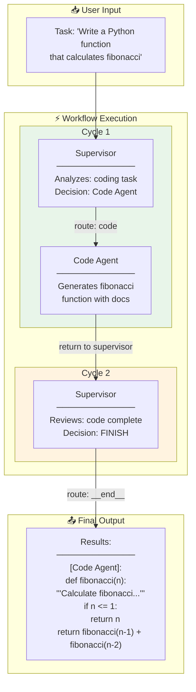

### Description

Complete workflow for a coding task:

1. **Input**: User submits fibonacci function request
2. **Cycle 1**: Supervisor → Code Agent → generates function
3. **Cycle 2**: Supervisor reviews and decides FINISH
4. **Output**: Complete code with documentation

---

## Summary

This documentation covers the complete architecture of the Multi-Agent Supervisor System:

| Diagram Type | Purpose |
|-------------|---------|
| Class Diagram | Data structures and relationships |
| Component Diagram | High-level system layers |
| State Graph | LangGraph workflow structure |
| Simple Sequence | Single-agent task flow |
| Complex Sequence | Multi-agent task flow |
| Supervisor Decision | Routing decision logic |
| Agent Execution | Worker node implementation |
| Routing Logic | Conditional edge implementation |
| State Transitions | All possible state changes |
| Message Flow | State evolution through workflow |
| Complete Example | End-to-end execution |

### Key Architecture Patterns

1. **Supervisor Pattern**: Central coordinator routes to specialized workers
2. **Hub-and-Spoke**: All paths go through the supervisor
3. **Message Accumulation**: Context builds via `operator.add`
4. **Factory Pattern**: `create_agent_node()` generates configured agents
5. **Conditional Routing**: Dynamic edge selection based on state

### Supervisor Pattern Benefits

| Benefit | Description |
|---------|-------------|
| **Centralized Control** | Single point for routing decisions |
| **Context Awareness** | Supervisor sees full conversation history |
| **Dynamic Routing** | Any agent can be called at any time |
| **Graceful Termination** | Supervisor decides when task is complete |
| **Scalability** | Easy to add new specialized agents |

### Extension Points

- **Add More Agents**: Data analyst, translator, validator, etc.
- **Agent Tools**: Give agents access to web search, calculators, databases
- **Memory Systems**: Long-term context across sessions
- **Human-in-the-Loop**: Approval steps before certain actions
- **Hierarchical Supervisors**: Sub-supervisors for complex workflows
- **Parallel Execution**: Multiple agents working simultaneously
- **Error Recovery**: Retry logic and fallback agents
