# ⚖️ LLM-as-Judge Prompt Selection — Architecture & Design Diagrams

This document provides a comprehensive set of **UML class diagrams**, **sequence diagrams**, and **workflow flowcharts** for the `llm-as-judge_prompt_selection.ipynb` notebook. All diagrams use Mermaid syntax.

---

## Table of Contents

1. [System Overview Flowchart](#1-system-overview-flowchart)
2. [LangGraph Workflow Flowchart](#2-langgraph-workflow-flowchart)
3. [UML Class Diagram — Data Models & Enums](#3-uml-class-diagram--data-models--enums)
4. [UML Class Diagram — LLM Service Layer](#4-uml-class-diagram--llm-service-layer)
5. [UML Class Diagram — Multi-Armed Bandit Hierarchy](#5-uml-class-diagram--multi-armed-bandit-hierarchy)
6. [UML Class Diagram — Judge Prompt Pool](#6-uml-class-diagram--judge-prompt-pool)
7. [UML Class Diagram — Production System](#7-uml-class-diagram--production-system)
8. [UML Class Diagram — Full System Relationships](#8-uml-class-diagram--full-system-relationships)
9. [Sequence Diagram — Single Training Iteration](#9-sequence-diagram--single-training-iteration)
10. [Sequence Diagram — LLM Judge Execution](#10-sequence-diagram--llm-judge-execution)
11. [Sequence Diagram — Reward Computation](#11-sequence-diagram--reward-computation)
12. [Sequence Diagram — Thompson Sampling Arm Selection](#12-sequence-diagram--thompson-sampling-arm-selection)
13. [Sequence Diagram — Production Evaluation Request](#13-sequence-diagram--production-evaluation-request)
14. [Sequence Diagram — Online Learning with Human Feedback](#14-sequence-diagram--online-learning-with-human-feedback)
15. [Flowchart — Reward Computation Pipeline](#15-flowchart--reward-computation-pipeline)
16. [Flowchart — JSON Response Parsing](#16-flowchart--json-response-parsing)
17. [Flowchart — Bandit Algorithm Decision Logic](#17-flowchart--bandit-algorithm-decision-logic)
18. [Flowchart — Training Orchestration](#18-flowchart--training-orchestration)
19. [State Diagram — LangGraph Bandit Loop](#19-state-diagram--langgraph-bandit-loop)
20. [Data Flow Diagram](#20-data-flow-diagram)

---

## 1. System Overview Flowchart

High-level view of the entire system: how evaluation samples, bandit algorithms, judge prompts, LLM calls, and reward signals interact.

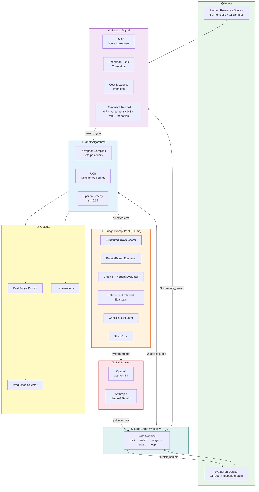
```mermaid
flowchart TB
    subgraph INPUTS["📥 Inputs"]
        DS["Evaluation Dataset<br/>11 (query, response) pairs"]
        HR["Human Reference Scores<br/>5 dimensions × 11 samples"]
    end

    subgraph BANDITS["🎰 Bandit Algorithms"]
        TS["Thompson Sampling<br/>Beta posteriors"]
        UCB["UCB<br/>Confidence bounds"]
        EG["Epsilon-Greedy<br/>ε = 0.15"]
    end

    subgraph JUDGES["🧑‍⚖️ Judge Prompt Pool (6 Arms)"]
        J1["Structured JSON Scorer"]
        J2["Rubric-Based Evaluator"]
        J3["Chain-of-Thought Evaluator"]
        J4["Reference-Anchored Evaluator"]
        J5["Checklist Evaluator"]
        J6["Strict Critic"]
    end

    subgraph LLM_LAYER["🤖 LLM Service"]
        OAI["OpenAI<br/>gpt-4o-mini"]
        ANT["Anthropic<br/>claude-3.5-haiku"]
    end

    subgraph REWARD["📊 Reward Signal"]
        AGR["1 − MAE<br/>Score Agreement"]
        RNK["Spearman Rank<br/>Correlation"]
        CST["Cost & Latency<br/>Penalties"]
        CMP["Composite Reward<br/>0.7 × agreement + 0.3 × rank − penalties"]
    end

    subgraph ORCHESTRATION["⚙️ LangGraph Workflow"]
        WF["State Machine<br/>pick → select → judge → reward → loop"]
    end

    subgraph OUTPUT["📈 Outputs"]
        BEST["Best Judge Prompt"]
        VIZ["Visualisations"]
        PROD["Production Selector"]
    end

    DS --> WF
    HR --> REWARD
    WF -->|"1. pick_sample"| DS
    WF -->|"2. select_judge"| BANDITS
    BANDITS -->|"selected arm"| JUDGES
    JUDGES -->|"system prompt"| LLM_LAYER
    LLM_LAYER -->|"judge scores"| WF
    WF -->|"3. compute_reward"| REWARD
    REWARD -->|"reward signal"| BANDITS
    BANDITS --> BEST
    BANDITS --> VIZ
    BEST --> PROD

    style INPUTS fill:#e8f5e9,stroke:#2e7d32
    style BANDITS fill:#e3f2fd,stroke:#1565c0
    style JUDGES fill:#fff3e0,stroke:#e65100
    style LLM_LAYER fill:#fce4ec,stroke:#c62828
    style REWARD fill:#f3e5f5,stroke:#6a1b9a
    style ORCHESTRATION fill:#e0f2f1,stroke:#00695c
    style OUTPUT fill:#fff9c4,stroke:#f57f17
```

### Explanation

The system follows a closed-loop reinforcement learning pattern:

1. **Inputs** — An evaluation dataset of 11 (query, response) pairs with human expert reference scores on 5 quality dimensions (relevance, accuracy, completeness, clarity, overall). These span three quality tiers: HIGH (3 samples, overall > 0.85), MEDIUM (4 samples, 0.55–0.85), and LOW (4 samples, < 0.55).

2. **Bandit Algorithms** — Three classic multi-armed bandit algorithms compete: Thompson Sampling (Bayesian with Beta posteriors), UCB (Upper Confidence Bound with exploration bonus), and Epsilon-Greedy (random exploration with probability ε = 0.15). Each algorithm independently learns which judge prompt is best.

3. **Judge Prompt Pool** — Six different LLM judge prompt templates serve as the bandit's arms. They vary in evaluation methodology: direct scoring, rubric grading, chain-of-thought reasoning, reference anchoring, checklist evaluation, and strict criticism.

4. **LLM Service** — Real API calls to OpenAI (gpt-4o-mini) and Anthropic (claude-3.5-haiku) via LangChain. Token usage and cost are tracked per call.

5. **Reward Signal** — Agreement between the LLM judge's scores and human reference scores, computed as a weighted combination of MAE-based agreement (70%) and Spearman rank correlation (30%), with small penalties for cost and latency.

6. **LangGraph Workflow** — A state machine orchestrates each training iteration: pick a sample, select a judge via the bandit, run the judge (real LLM call), compute the reward, update the bandit, and loop.

7. **Outputs** — The best judge prompt identified by each algorithm, training visualisations, and a production-ready `AdaptiveJudgeSelector` wrapper.

---

## 2. LangGraph Workflow Flowchart

The core training loop is implemented as a LangGraph `StateGraph` with four nodes and a conditional loop edge.

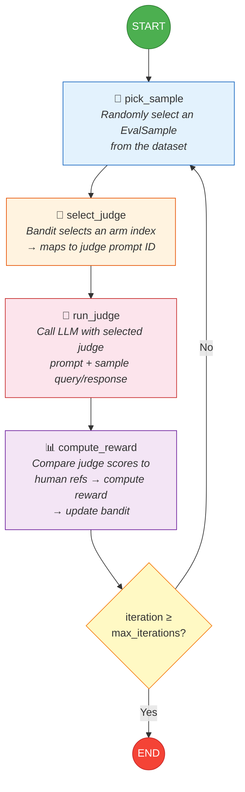
```mermaid
flowchart TD
    START((START)) --> PS["🎲 pick_sample<br/><i>Randomly select an EvalSample<br/>from the dataset</i>"]
    PS --> SJ["🎯 select_judge<br/><i>Bandit selects an arm index<br/>→ maps to judge prompt ID</i>"]
    SJ --> RJ["🤖 run_judge<br/><i>Call LLM with selected judge<br/>prompt + sample query/response</i>"]
    RJ --> CR["📊 compute_reward<br/><i>Compare judge scores to<br/>human refs → compute reward<br/>→ update bandit</i>"]
    CR --> CHECK{"iteration ≥<br/>max_iterations?"}
    CHECK -->|"No"| PS
    CHECK -->|"Yes"| DONE((END))

    style START fill:#4caf50,stroke:#2e7d32,color:#fff
    style DONE fill:#f44336,stroke:#c62828,color:#fff
    style PS fill:#e3f2fd,stroke:#1565c0
    style SJ fill:#fff3e0,stroke:#e65100
    style RJ fill:#fce4ec,stroke:#c62828
    style CR fill:#f3e5f5,stroke:#6a1b9a
    style CHECK fill:#fff9c4,stroke:#f57f17
```

### Explanation — Step by Step

| Step | Node | What Happens | State Fields Updated |
|------|------|-------------|---------------------|
| 1 | `pick_sample` | A random `EvalSample` is drawn from `EVAL_DATASET`. Its ID, query text, response text, query type, and human overall score are stored in the workflow state. | `sample_id`, `sample_query`, `sample_response`, `sample_query_type`, `human_overall` |
| 2 | `select_judge` | The bandit algorithm (Thompson Sampling, UCB, or Epsilon-Greedy) calls `select_arm()` to choose which judge prompt template to use. The arm index and corresponding judge ID are stored. | `selected_judge_id`, `arm_idx` |
| 3 | `run_judge` | The selected judge prompt's `system_prompt` is sent along with the sample's query and response to the LLM via `LLMService.call()`. The raw response is parsed into 5 float scores. Cost and latency from the API call are recorded. | `judge_relevance`, `judge_accuracy`, `judge_completeness`, `judge_clarity`, `judge_overall`, `cost`, `latency` |
| 4 | `compute_reward` | The judge's 5 scores are compared against the human reference scores using `compute_agreement()` (1 − MAE) and `compute_rank_agreement()` (Spearman). A composite reward is calculated and the bandit is updated via `bandit.update(arm_idx, reward)`. The reward and full details are appended to accumulating log lists. The iteration counter is incremented. | `agreement`, `reward`, `iteration`, `rewards_log`, `details_log` |
| 5 | `should_continue` | A conditional edge checks whether `iteration >= max_iterations`. If yes, the workflow terminates. Otherwise, it loops back to `pick_sample`. | — |

Each full cycle of the loop makes exactly **one real LLM API call** (in the `run_judge` node). With 40 iterations per algorithm and 3 algorithms, the training run makes 120 LLM calls total.

---

## 3. UML Class Diagram — Data Models & Enums

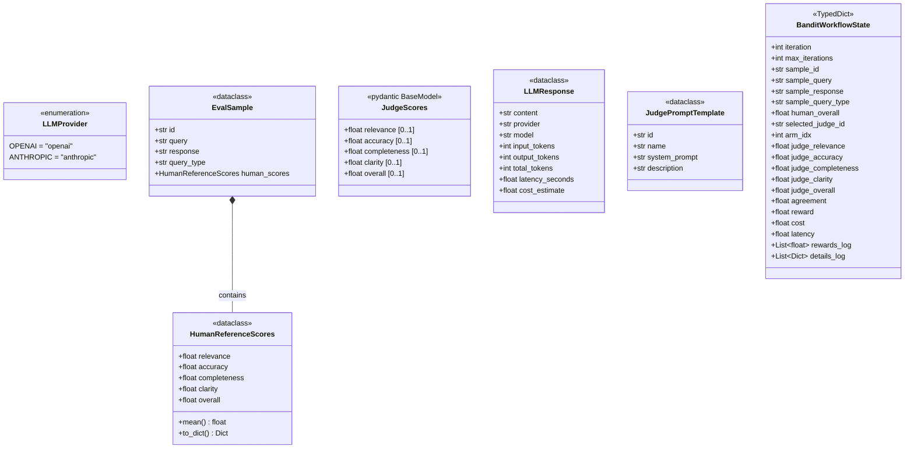
```mermaid
classDiagram
    class LLMProvider {
        <<enumeration>>
        OPENAI = "openai"
        ANTHROPIC = "anthropic"
    }

    class HumanReferenceScores {
        <<dataclass>>
        +float relevance
        +float accuracy
        +float completeness
        +float clarity
        +float overall
        +mean() float
        +to_dict() Dict
    }

    class EvalSample {
        <<dataclass>>
        +str id
        +str query
        +str response
        +str query_type
        +HumanReferenceScores human_scores
    }

    class JudgeScores {
        <<pydantic BaseModel>>
        +float relevance  [0..1]
        +float accuracy   [0..1]
        +float completeness [0..1]
        +float clarity    [0..1]
        +float overall    [0..1]
    }

    class LLMResponse {
        <<dataclass>>
        +str content
        +str provider
        +str model
        +int input_tokens
        +int output_tokens
        +int total_tokens
        +float latency_seconds
        +float cost_estimate
    }

    class JudgePromptTemplate {
        <<dataclass>>
        +str id
        +str name
        +str system_prompt
        +str description
    }

    class BanditWorkflowState {
        <<TypedDict>>
        +int iteration
        +int max_iterations
        +str sample_id
        +str sample_query
        +str sample_response
        +str sample_query_type
        +float human_overall
        +str selected_judge_id
        +int arm_idx
        +float judge_relevance
        +float judge_accuracy
        +float judge_completeness
        +float judge_clarity
        +float judge_overall
        +float agreement
        +float reward
        +float cost
        +float latency
        +List~float~ rewards_log
        +List~Dict~ details_log
    }

    EvalSample *-- HumanReferenceScores : contains
```

### Explanation

- **`LLMProvider`** — An enum that selects between OpenAI and Anthropic. Used throughout to route API calls to the correct LangChain client.

- **`HumanReferenceScores`** — A dataclass holding 5 float scores (0–1) assigned by human expert annotators. These are the ground truth against which LLM judges are measured. The `mean()` method provides a single scalar summary; `to_dict()` serialises for display.

- **`EvalSample`** — Represents one evaluation instance: a query, a response to evaluate, a query type tag (factual/analytical/coding), and the associated human scores. The dataset contains 11 of these spanning high/medium/low quality.

- **`JudgeScores`** — A Pydantic `BaseModel` for the parsed output of an LLM judge call. Uses Pydantic's `Field(ge=0, le=1)` validators to enforce valid score ranges. The same 5 dimensions as `HumanReferenceScores` enable direct comparison.

- **`LLMResponse`** — Captures everything returned from a single LLM API call: the text content, provider/model metadata, token counts (input, output, total), latency in seconds, and estimated cost in USD.

- **`JudgePromptTemplate`** — Defines one judge prompt (one bandit arm): an ID, a human-readable name, the full system prompt text sent to the LLM, and a description of the evaluation methodology.

- **`BanditWorkflowState`** — The LangGraph `TypedDict` that flows through the state machine. It carries all per-iteration data (current sample, selected judge, scores, reward) plus accumulating logs (`rewards_log`, `details_log`) that grow across iterations.

---

## 4. UML Class Diagram — LLM Service Layer

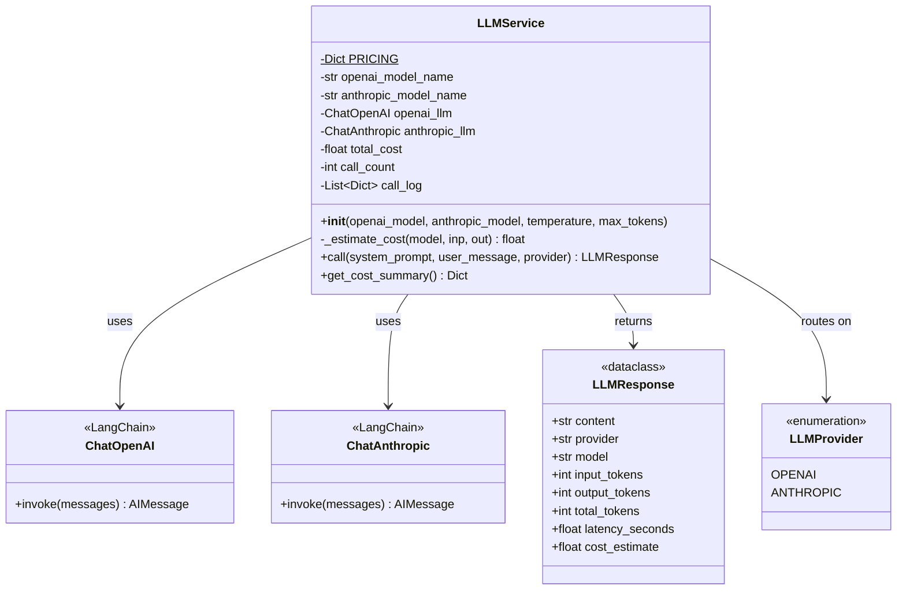
```mermaid
classDiagram
    class LLMService {
        -Dict PRICING$
        -str openai_model_name
        -str anthropic_model_name
        -ChatOpenAI openai_llm
        -ChatAnthropic anthropic_llm
        -float total_cost
        -int call_count
        -List~Dict~ call_log
        +__init__(openai_model, anthropic_model, temperature, max_tokens)
        -_estimate_cost(model, inp, out) float
        +call(system_prompt, user_message, provider) LLMResponse
        +get_cost_summary() Dict
    }

    class ChatOpenAI {
        <<LangChain>>
        +invoke(messages) AIMessage
    }

    class ChatAnthropic {
        <<LangChain>>
        +invoke(messages) AIMessage
    }

    class LLMResponse {
        <<dataclass>>
        +str content
        +str provider
        +str model
        +int input_tokens
        +int output_tokens
        +int total_tokens
        +float latency_seconds
        +float cost_estimate
    }

    class LLMProvider {
        <<enumeration>>
        OPENAI
        ANTHROPIC
    }

    LLMService --> ChatOpenAI : uses
    LLMService --> ChatAnthropic : uses
    LLMService --> LLMResponse : returns
    LLMService --> LLMProvider : routes on
```

### Explanation

The `LLMService` class is the single point of contact for all LLM API calls in the system:

- **Dual-provider support** — It wraps both `ChatOpenAI` and `ChatAnthropic` (LangChain clients), each configured at construction with model name, temperature (0.3 for consistency), and max output tokens (512).

- **Token and cost tracking** — Every call records input/output token counts (from `usage_metadata`), latency, and estimated cost via per-model pricing tables (e.g. gpt-4o-mini at $0.15/$0.60 per million input/output tokens). Cumulative totals are maintained for session-level reporting.

- **Routing** — The `provider` parameter (an `LLMProvider` enum) determines which LangChain client handles the call. This enables the cross-provider comparison in Section 12 of the notebook.

- **Cost summary** — `get_cost_summary()` returns aggregated statistics: total calls, total cost in USD, average latency, average tokens, and a per-model cost breakdown.

---

## 5. UML Class Diagram — Multi-Armed Bandit Hierarchy

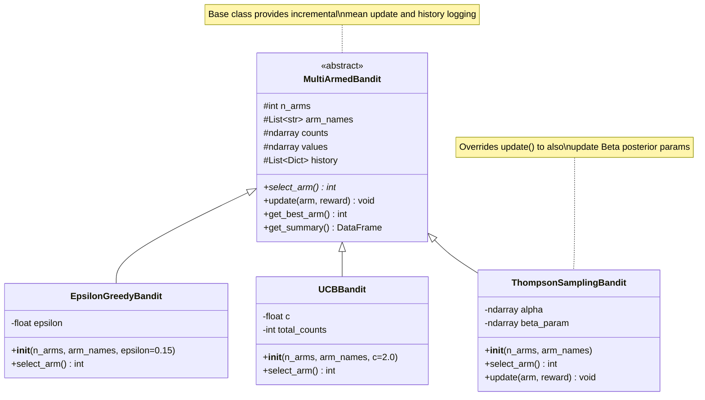
```mermaid
classDiagram
    class MultiArmedBandit {
        <<abstract>>
        #int n_arms
        #List~str~ arm_names
        #ndarray counts
        #ndarray values
        #List~Dict~ history
        +select_arm()* int
        +update(arm, reward) void
        +get_best_arm() int
        +get_summary() DataFrame
    }

    class EpsilonGreedyBandit {
        -float epsilon
        +__init__(n_arms, arm_names, epsilon=0.15)
        +select_arm() int
    }

    class UCBBandit {
        -float c
        -int total_counts
        +__init__(n_arms, arm_names, c=2.0)
        +select_arm() int
    }

    class ThompsonSamplingBandit {
        -ndarray alpha
        -ndarray beta_param
        +__init__(n_arms, arm_names)
        +select_arm() int
        +update(arm, reward) void
    }

    MultiArmedBandit <|-- EpsilonGreedyBandit
    MultiArmedBandit <|-- UCBBandit
    MultiArmedBandit <|-- ThompsonSamplingBandit

    note for MultiArmedBandit "Base class provides incremental\nmean update and history logging"
    note for ThompsonSamplingBandit "Overrides update() to also\nupdate Beta posterior params"
```

### Explanation

The bandit hierarchy uses the Template Method pattern through Python's `ABC`:

- **`MultiArmedBandit` (abstract)** — Provides the shared infrastructure: `counts` (how many times each arm was pulled), `values` (running mean reward per arm), `history` (full log), `update()` (incremental mean update: `Q += (r - Q) / n`), `get_best_arm()` (argmax of values), and `get_summary()` (DataFrame for display). The `select_arm()` method is abstract — each subclass implements its own selection strategy.

- **`EpsilonGreedyBandit`** — The simplest algorithm. With probability ε (default 0.15), it picks a random arm (exploration); otherwise it picks the arm with the highest mean reward (exploitation). No additional state beyond ε.

- **`UCBBandit`** — Uses the UCB1 formula: `Q(a) + c * sqrt(ln(t) / N(a))`. The confidence bonus decreases as an arm is pulled more, guaranteeing that under-explored arms eventually get tried. Tracks `total_counts` (t) and uses an exploration constant `c = 2.0`. If any arm has count 0, it is selected deterministically (initialization phase).

- **`ThompsonSamplingBandit`** — The most sophisticated algorithm. Maintains Beta distribution posteriors (`alpha`, `beta_param`) for each arm. On each step, it samples from each arm's posterior and selects the arm with the highest sample. The `update()` method is overridden: in addition to the base incremental mean update, it adjusts the Beta parameters — rewards above 0.5 increase `alpha` (success), rewards below 0.5 increase `beta_param` (failure). This creates a natural exploration-exploitation balance: uncertain arms have wide posteriors and occasionally generate high samples, while well-explored arms have narrow posteriors centred on their true reward.

---

## 6. UML Class Diagram — Judge Prompt Pool

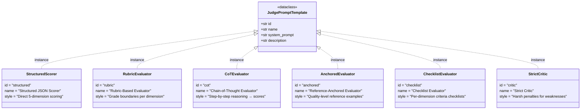
```mermaid
classDiagram
    class JudgePromptTemplate {
        <<dataclass>>
        +str id
        +str name
        +str system_prompt
        +str description
    }

    class StructuredScorer {
        id = "structured"
        name = "Structured JSON Scorer"
        style = "Direct 5-dimension scoring"
    }

    class RubricEvaluator {
        id = "rubric"
        name = "Rubric-Based Evaluator"
        style = "Grade boundaries per dimension"
    }

    class CoTEvaluator {
        id = "cot"
        name = "Chain-of-Thought Evaluator"
        style = "Step-by-step reasoning → scores"
    }

    class AnchoredEvaluator {
        id = "anchored"
        name = "Reference-Anchored Evaluator"
        style = "Quality-level reference examples"
    }

    class ChecklistEvaluator {
        id = "checklist"
        name = "Checklist Evaluator"
        style = "Per-dimension criteria checklists"
    }

    class StrictCritic {
        id = "critic"
        name = "Strict Critic"
        style = "Harsh penalties for weaknesses"
    }

    JudgePromptTemplate <|.. StructuredScorer : instance
    JudgePromptTemplate <|.. RubricEvaluator : instance
    JudgePromptTemplate <|.. CoTEvaluator : instance
    JudgePromptTemplate <|.. AnchoredEvaluator : instance
    JudgePromptTemplate <|.. ChecklistEvaluator : instance
    JudgePromptTemplate <|.. StrictCritic : instance
```

### Explanation

The six judge prompt templates are stored as instances of `JudgePromptTemplate` in the `JUDGE_PROMPTS` dictionary. Each prompt is an "arm" of the multi-armed bandit:

| Arm | Methodology | Expected Behaviour |
|-----|------------|-------------------|
| **Structured** | Minimal instructions, direct JSON scoring | Fast, low-token, but may lack calibration |
| **Rubric** | Explicit grade boundaries (0.9–1.0, 0.7–0.89, etc.) for each dimension | Well-calibrated, tends to agree with human rubric-style grading |
| **CoT** | Forces step-by-step reasoning before outputting scores | More thoughtful but higher token usage; JSON extracted from last line |
| **Anchored** | Provides reference examples of each quality level | Helps the model calibrate by analogy; good for relative scoring |
| **Checklist** | Per-dimension checklists (3 criteria each) | Systematic but may produce coarser scores |
| **Critic** | Instructed to be extremely strict, penalise harshly | Tends to under-score, likely lower agreement with human scores |

All prompts output the same JSON schema: `{"relevance": float, "accuracy": float, "completeness": float, "clarity": float, "overall": float}`, enabling direct comparison.

---

## 7. UML Class Diagram — Production System

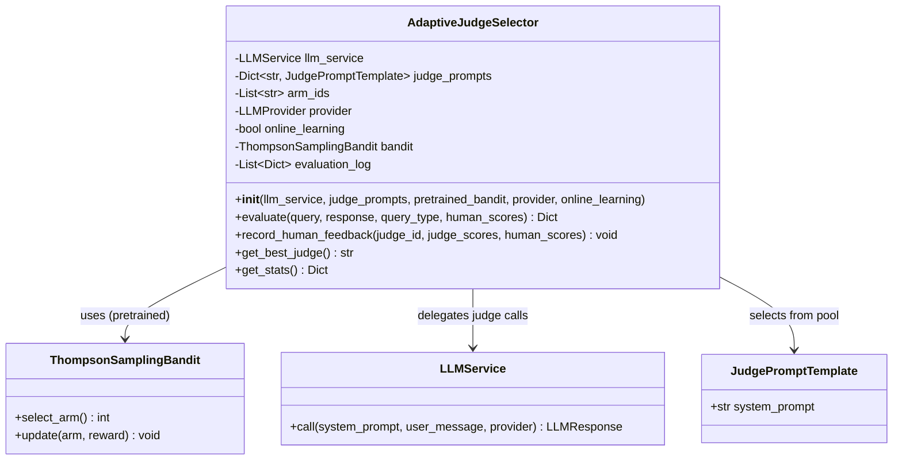
```mermaid
classDiagram
    class AdaptiveJudgeSelector {
        -LLMService llm_service
        -Dict~str, JudgePromptTemplate~ judge_prompts
        -List~str~ arm_ids
        -LLMProvider provider
        -bool online_learning
        -ThompsonSamplingBandit bandit
        -List~Dict~ evaluation_log
        +__init__(llm_service, judge_prompts, pretrained_bandit, provider, online_learning)
        +evaluate(query, response, query_type, human_scores) Dict
        +record_human_feedback(judge_id, judge_scores, human_scores) void
        +get_best_judge() str
        +get_stats() Dict
    }

    class ThompsonSamplingBandit {
        +select_arm() int
        +update(arm, reward) void
    }

    class LLMService {
        +call(system_prompt, user_message, provider) LLMResponse
    }

    class JudgePromptTemplate {
        +str system_prompt
    }

    AdaptiveJudgeSelector --> ThompsonSamplingBandit : uses (pretrained)
    AdaptiveJudgeSelector --> LLMService : delegates judge calls
    AdaptiveJudgeSelector --> JudgePromptTemplate : selects from pool
```

### Explanation

The `AdaptiveJudgeSelector` is the production-ready wrapper designed for deployment:

- **Pretrained bandit** — It accepts a pretrained `ThompsonSamplingBandit` (from the training run) so it starts with learned preferences rather than cold-starting.

- **`evaluate()`** — The main entry point. It calls `bandit.select_arm()` to choose a judge prompt, constructs an `EvalSample`, runs the judge via `run_judge()`, and returns scores, cost, and latency. If `human_scores` are provided and `online_learning` is enabled, the bandit is updated immediately with the computed reward — enabling continuous improvement in production.

- **`record_human_feedback()`** — Supports **delayed feedback**: when human scores arrive asynchronously (e.g. a human annotator reviews the judge's output hours later), this method updates the bandit retroactively.

- **`get_best_judge()`** — Returns the ID of the currently best-performing judge prompt based on accumulated evidence.

- **`get_stats()`** — Returns session statistics: total evaluations, cost, average latency, best judge, and the full bandit summary table.

---

## 8. UML Class Diagram — Full System Relationships

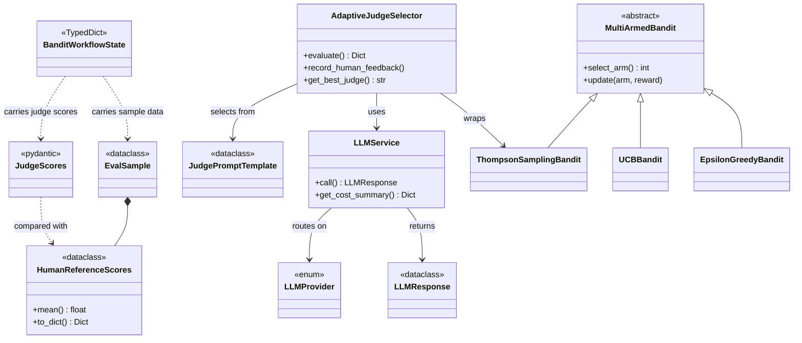
```mermaid
classDiagram
    class LLMProvider {
        <<enum>>
    }

    class LLMResponse {
        <<dataclass>>
    }

    class LLMService {
        +call() LLMResponse
        +get_cost_summary() Dict
    }

    class HumanReferenceScores {
        <<dataclass>>
        +mean() float
        +to_dict() Dict
    }

    class EvalSample {
        <<dataclass>>
    }

    class JudgePromptTemplate {
        <<dataclass>>
    }

    class JudgeScores {
        <<pydantic>>
    }

    class MultiArmedBandit {
        <<abstract>>
        +select_arm() int
        +update(arm, reward)
    }

    class ThompsonSamplingBandit {
    }

    class UCBBandit {
    }

    class EpsilonGreedyBandit {
    }

    class BanditWorkflowState {
        <<TypedDict>>
    }

    class AdaptiveJudgeSelector {
        +evaluate() Dict
        +record_human_feedback()
        +get_best_judge() str
    }

    LLMService --> LLMProvider : routes on
    LLMService --> LLMResponse : returns
    EvalSample *-- HumanReferenceScores
    MultiArmedBandit <|-- ThompsonSamplingBandit
    MultiArmedBandit <|-- UCBBandit
    MultiArmedBandit <|-- EpsilonGreedyBandit
    AdaptiveJudgeSelector --> LLMService : uses
    AdaptiveJudgeSelector --> ThompsonSamplingBandit : wraps
    AdaptiveJudgeSelector --> JudgePromptTemplate : selects from
    BanditWorkflowState ..> EvalSample : carries sample data
    BanditWorkflowState ..> JudgeScores : carries judge scores
    JudgeScores ..> HumanReferenceScores : compared with
```

### Explanation

This diagram shows how all classes relate across the full system:

- **Data flow path**: `EvalSample` (containing `HumanReferenceScores`) → `BanditWorkflowState` → `LLMService` (producing `LLMResponse`) → `JudgeScores` → compared with `HumanReferenceScores` → reward → `MultiArmedBandit`.

- **Inheritance**: The three bandit algorithms share a common `MultiArmedBandit` interface but differ in their `select_arm()` strategy.

- **Composition**: `AdaptiveJudgeSelector` composes `LLMService`, `ThompsonSamplingBandit`, and the `JudgePromptTemplate` pool into a single production-facing API.

- **State**: `BanditWorkflowState` is not a class with methods — it is a `TypedDict` that acts as the immutable state carrier in the LangGraph workflow. Each node returns a partial dictionary that updates specific fields.

---

## 9. Sequence Diagram — Single Training Iteration

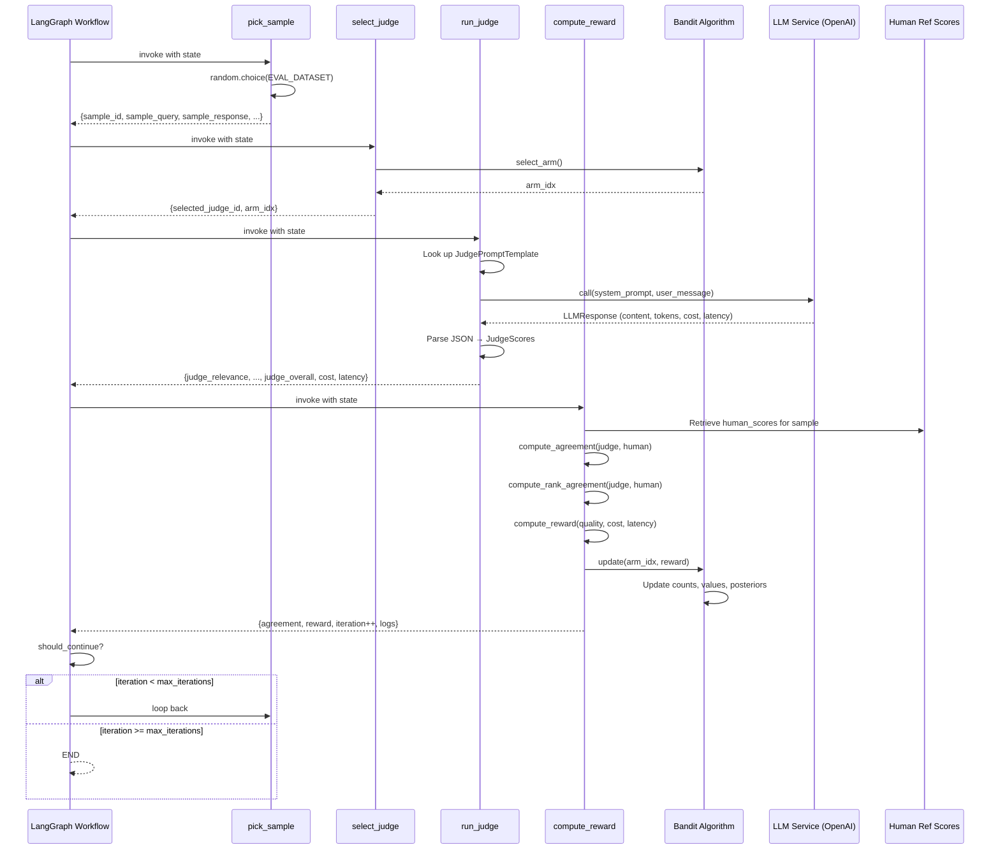
```mermaid
sequenceDiagram
    participant WF as LangGraph Workflow
    participant PS as pick_sample
    participant SJ as select_judge
    participant RJ as run_judge
    participant CR as compute_reward
    participant B as Bandit Algorithm
    participant LLM as LLM Service (OpenAI)
    participant HR as Human Ref Scores

    WF->>PS: invoke with state
    PS->>PS: random.choice(EVAL_DATASET)
    PS-->>WF: {sample_id, sample_query, sample_response, ...}

    WF->>SJ: invoke with state
    SJ->>B: select_arm()
    B-->>SJ: arm_idx
    SJ-->>WF: {selected_judge_id, arm_idx}

    WF->>RJ: invoke with state
    RJ->>RJ: Look up JudgePromptTemplate
    RJ->>LLM: call(system_prompt, user_message)
    LLM-->>RJ: LLMResponse (content, tokens, cost, latency)
    RJ->>RJ: Parse JSON → JudgeScores
    RJ-->>WF: {judge_relevance, ..., judge_overall, cost, latency}

    WF->>CR: invoke with state
    CR->>HR: Retrieve human_scores for sample
    CR->>CR: compute_agreement(judge, human)
    CR->>CR: compute_rank_agreement(judge, human)
    CR->>CR: compute_reward(quality, cost, latency)
    CR->>B: update(arm_idx, reward)
    B->>B: Update counts, values, posteriors
    CR-->>WF: {agreement, reward, iteration++, logs}

    WF->>WF: should_continue?
    alt iteration < max_iterations
        WF->>PS: loop back
    else iteration >= max_iterations
        WF-->>WF: END
    end
```

### Explanation

This sequence diagram traces **one complete iteration** of the LangGraph bandit training loop:

1. **pick_sample** — Randomly selects one `EvalSample` from the 11-sample dataset. The sample's metadata (ID, query, response, query type, human overall score) is written into the workflow state.

2. **select_judge** — Delegates to the bandit algorithm's `select_arm()` method. Thompson Sampling draws from Beta posteriors; UCB computes confidence bounds; Epsilon-Greedy flips a coin. The result is an arm index that maps to a judge prompt ID.

3. **run_judge** — The core LLM call. The selected judge prompt's `system_prompt` is combined with a user message containing the sample's query and response. The LLM (via `LLMService.call()`) returns a JSON string which is parsed into a `JudgeScores` object. If parsing fails (e.g. malformed JSON), a fallback score of 0.5 across all dimensions is used.

4. **compute_reward** — The judge's 5 scores are compared against the human reference scores on two metrics: (a) `compute_agreement` = 1 − MAE across 5 dimensions, and (b) `compute_rank_agreement` = normalised Spearman correlation. These are combined as `0.7 × agreement + 0.3 × rank_agreement`, then penalised by normalised cost and latency. The bandit's `update()` is called with this reward, adjusting its beliefs (mean estimates, or Beta posteriors for Thompson Sampling).

5. **should_continue** — A simple conditional edge: if `iteration < max_iterations`, loop back to `pick_sample`; otherwise terminate.

---

## 10. Sequence Diagram — LLM Judge Execution

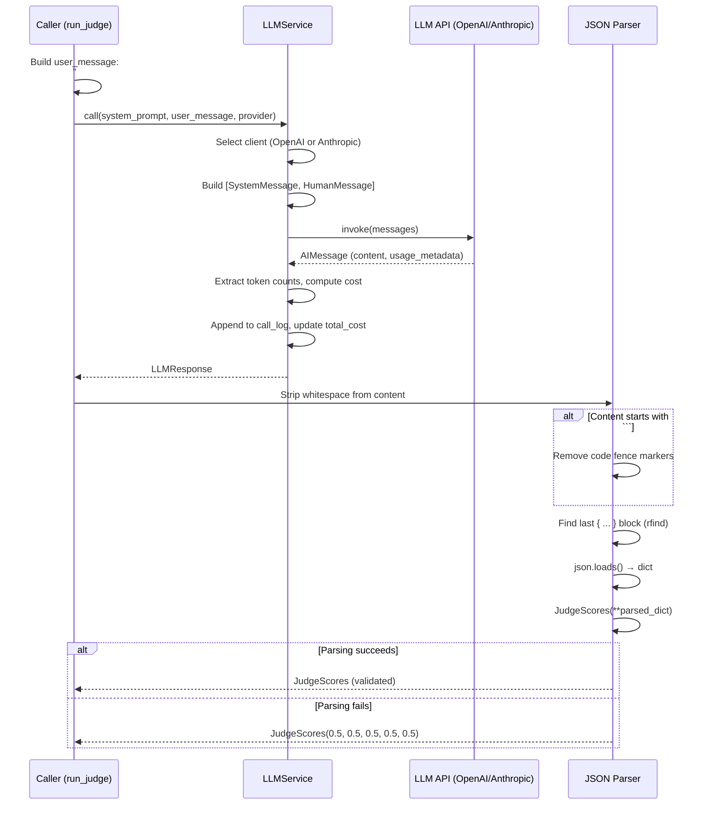
```mermaid
sequenceDiagram
    participant C as Caller (run_judge)
    participant LS as LLMService
    participant LLM as LLM API (OpenAI/Anthropic)
    participant P as JSON Parser

    C->>C: Build user_message:<br/>"## Query\n{query}\n\n## Response to Evaluate\n{response}"
    C->>LS: call(system_prompt, user_message, provider)

    LS->>LS: Select client (OpenAI or Anthropic)
    LS->>LS: Build [SystemMessage, HumanMessage]
    LS->>LLM: invoke(messages)
    LLM-->>LS: AIMessage (content, usage_metadata)
    LS->>LS: Extract token counts, compute cost
    LS->>LS: Append to call_log, update total_cost
    LS-->>C: LLMResponse

    C->>P: Strip whitespace from content
    alt Content starts with ```
        P->>P: Remove code fence markers
    end
    P->>P: Find last { ... } block (rfind)
    P->>P: json.loads() → dict
    P->>P: JudgeScores(**parsed_dict)

    alt Parsing succeeds
        P-->>C: JudgeScores (validated)
    else Parsing fails
        P-->>C: JudgeScores(0.5, 0.5, 0.5, 0.5, 0.5)
    end
```

### Explanation

The `run_judge()` function handles the full cycle from prompt construction to validated scores:

1. **Message construction** — The user message is formatted with markdown headers separating the query and the response to evaluate. This structure is consistent across all judge prompts.

2. **LLM call** — Delegated to `LLMService.call()`, which handles provider routing, timing, token extraction, and cost estimation.

3. **Response parsing** — The raw LLM output is processed defensively:
   - Markdown code fences (` ```json ... ``` `) are stripped.
   - For Chain-of-Thought prompts that produce reasoning text before the JSON, the parser uses `rfind("{")` and `rfind("}")` to extract the **last** JSON block in the output.
   - The extracted JSON is parsed and validated through Pydantic's `JudgeScores` model, which enforces `0.0 ≤ score ≤ 1.0` for all five dimensions.
   - If any step fails (malformed JSON, out-of-range values, missing keys), a safe fallback of 0.5 on all dimensions is used. This ensures the training loop never crashes, though fallback scores will yield lower agreement and push the bandit away from prompts that produce unparseable outputs.

---

## 11. Sequence Diagram — Reward Computation

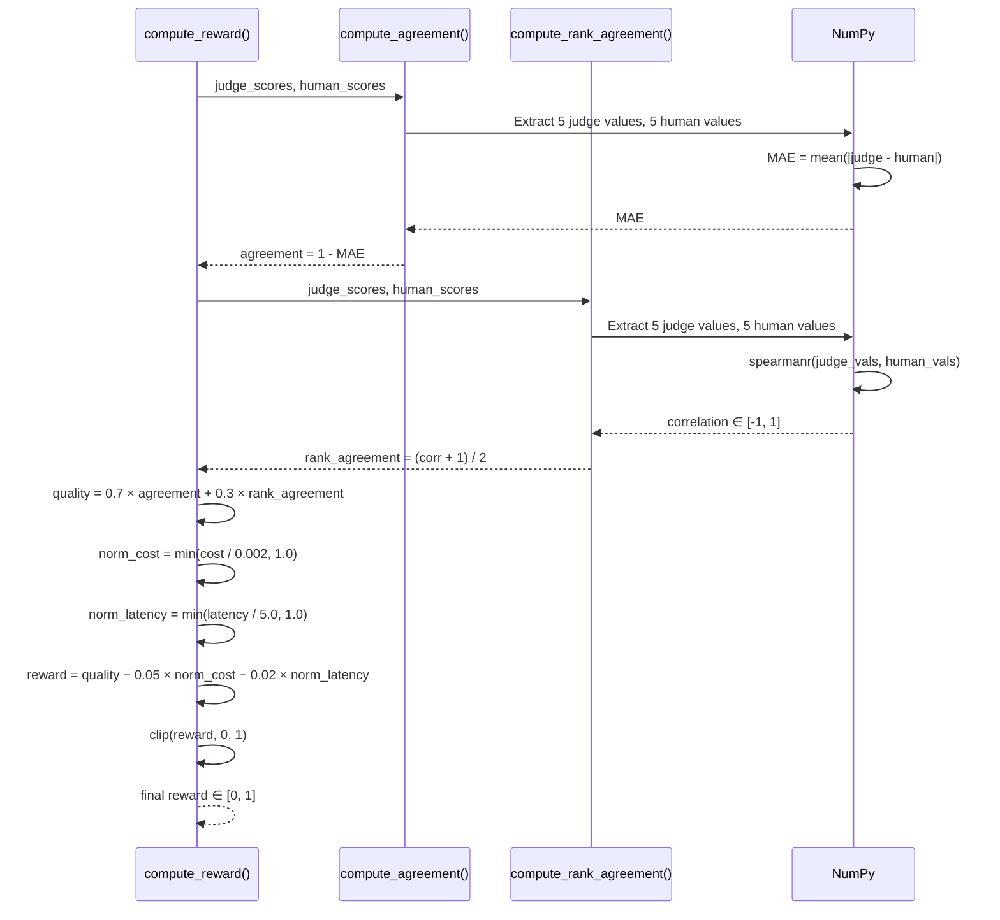
```mermaid
sequenceDiagram
    participant CR as compute_reward()
    participant AG as compute_agreement()
    participant RK as compute_rank_agreement()
    participant NP as NumPy

    CR->>AG: judge_scores, human_scores
    AG->>NP: Extract 5 judge values, 5 human values
    NP->>NP: MAE = mean(|judge - human|)
    NP-->>AG: MAE
    AG-->>CR: agreement = 1 - MAE

    CR->>RK: judge_scores, human_scores
    RK->>NP: Extract 5 judge values, 5 human values
    NP->>NP: spearmanr(judge_vals, human_vals)
    NP-->>RK: correlation ∈ [-1, 1]
    RK-->>CR: rank_agreement = (corr + 1) / 2

    CR->>CR: quality = 0.7 × agreement + 0.3 × rank_agreement
    CR->>CR: norm_cost = min(cost / 0.002, 1.0)
    CR->>CR: norm_latency = min(latency / 5.0, 1.0)
    CR->>CR: reward = quality − 0.05 × norm_cost − 0.02 × norm_latency
    CR->>CR: clip(reward, 0, 1)
    CR-->>CR: final reward ∈ [0, 1]
```

### Explanation

The reward signal has three components:

1. **Agreement (70% weight)** — Measured as `1 − MAE` across the 5 evaluation dimensions. If the judge assigns exactly the same scores as the human, agreement = 1.0. If every score differs by 0.3 on average, agreement = 0.7. This captures absolute calibration.

2. **Rank agreement (30% weight)** — Measured as Spearman rank correlation between the judge's 5 scores and the human's 5 scores, normalised from [−1, 1] to [0, 1]. This captures whether the judge correctly identifies which dimensions are strongest/weakest, even if the absolute values differ. A judge that says "accuracy > relevance > completeness" when the human says the same thing scores well here even if the magnitudes differ.

3. **Cost and latency penalties** — Small subtractive penalties discourage expensive or slow judge prompts. Cost is normalised by $0.002 (capped at 1.0); latency by 5 seconds (capped at 1.0). The weights are 0.05 and 0.02 respectively — intentionally small so quality dominates.

The final reward is clipped to [0, 1] to stay within the valid range for Beta-distribution updates in Thompson Sampling.

---

## 12. Sequence Diagram — Thompson Sampling Arm Selection

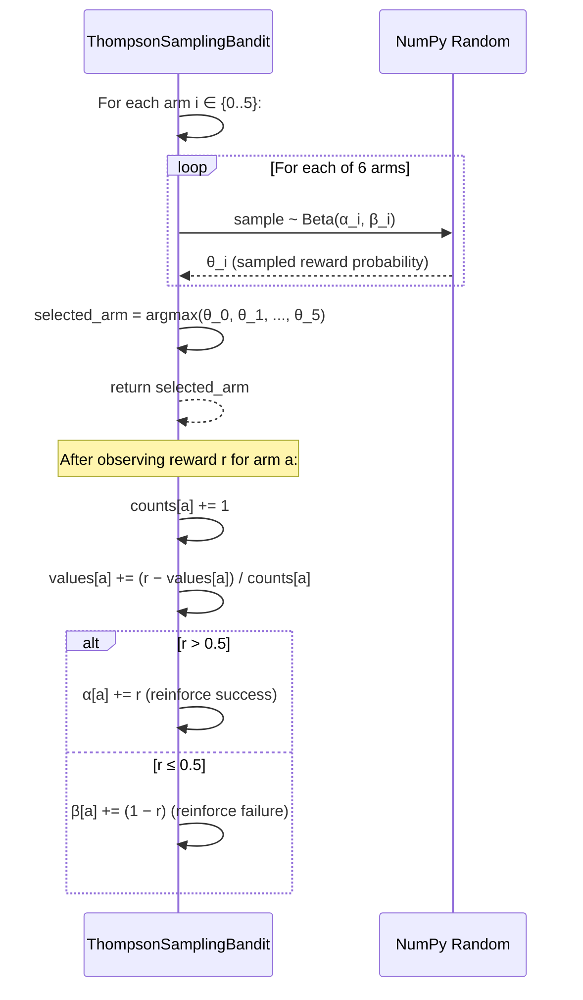
```mermaid
sequenceDiagram
    participant B as ThompsonSamplingBandit
    participant NP as NumPy Random

    B->>B: For each arm i ∈ {0..5}:
    loop For each of 6 arms
        B->>NP: sample ~ Beta(α_i, β_i)
        NP-->>B: θ_i (sampled reward probability)
    end
    B->>B: selected_arm = argmax(θ_0, θ_1, ..., θ_5)
    B-->>B: return selected_arm

    Note over B: After observing reward r for arm a:
    B->>B: counts[a] += 1
    B->>B: values[a] += (r − values[a]) / counts[a]
    alt r > 0.5
        B->>B: α[a] += r (reinforce success)
    else r ≤ 0.5
        B->>B: β[a] += (1 − r) (reinforce failure)
    end
```

### Explanation

Thompson Sampling works by maintaining a **Beta posterior distribution** for each arm:

- **Initialisation** — All arms start with `α = 1, β = 1` (uniform prior — maximum uncertainty).

- **Selection** — At each step, a random sample is drawn from each arm's Beta(α, β) distribution. The arm with the highest sample wins. Arms with high mean reward and low variance (well-explored, good) produce consistently high samples. Arms with high uncertainty (under-explored) have wide distributions that occasionally produce very high samples, driving exploration.

- **Update** — After observing the reward, the posterior is updated asymmetrically:
  - High rewards (> 0.5) increase α, pushing the distribution mean higher.
  - Low rewards (≤ 0.5) increase β, pushing the distribution mean lower.
  - The incremental mean estimator in the base class also updates in parallel for reporting purposes.

Over time, the best arm's posterior becomes narrow and peaked at a high value, causing it to be selected most often. Inferior arms' posteriors become either narrow (peaked low) or remain wide (but their samples rarely beat the best arm's).

---

## 13. Sequence Diagram — Production Evaluation Request

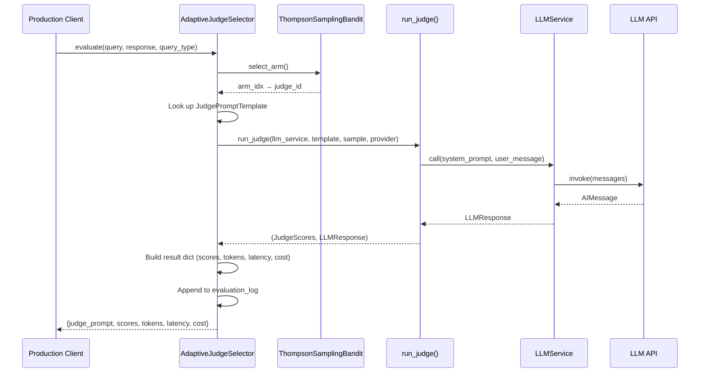
```mermaid
sequenceDiagram
    participant User as Production Client
    participant AS as AdaptiveJudgeSelector
    participant B as ThompsonSamplingBandit
    participant RJ as run_judge()
    participant LS as LLMService
    participant LLM as LLM API

    User->>AS: evaluate(query, response, query_type)
    AS->>B: select_arm()
    B-->>AS: arm_idx → judge_id
    AS->>AS: Look up JudgePromptTemplate

    AS->>RJ: run_judge(llm_service, template, sample, provider)
    RJ->>LS: call(system_prompt, user_message)
    LS->>LLM: invoke(messages)
    LLM-->>LS: AIMessage
    LS-->>RJ: LLMResponse
    RJ-->>AS: (JudgeScores, LLMResponse)

    AS->>AS: Build result dict (scores, tokens, latency, cost)
    AS->>AS: Append to evaluation_log
    AS-->>User: {judge_prompt, scores, tokens, latency, cost}
```

### Explanation

In production mode (without human scores provided), the `AdaptiveJudgeSelector` operates as a simple inference pipeline:

1. The client calls `evaluate()` with a query, response, and optional query type.
2. The pretrained Thompson Sampling bandit selects the best judge prompt — since the bandit has already learned from 40 training iterations, it will strongly prefer the best-performing prompt but still occasionally explore others.
3. The selected judge prompt is run against the (query, response) pair via a real LLM call.
4. The parsed scores, token usage, latency, and cost are returned to the caller.
5. No bandit update occurs (no human scores to compare against).

This flow adds minimal overhead beyond the LLM call itself — the bandit selection is O(k) where k = 6 arms.

---

## 14. Sequence Diagram — Online Learning with Human Feedback

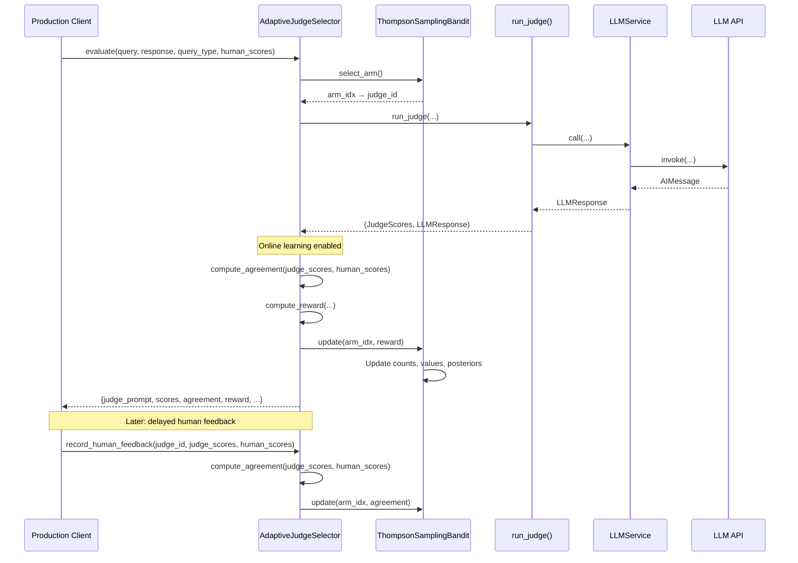
```mermaid
sequenceDiagram
    participant User as Production Client
    participant AS as AdaptiveJudgeSelector
    participant B as ThompsonSamplingBandit
    participant RJ as run_judge()
    participant LS as LLMService
    participant LLM as LLM API

    User->>AS: evaluate(query, response, query_type, human_scores)
    AS->>B: select_arm()
    B-->>AS: arm_idx → judge_id
    AS->>RJ: run_judge(...)
    RJ->>LS: call(...)
    LS->>LLM: invoke(...)
    LLM-->>LS: AIMessage
    LS-->>RJ: LLMResponse
    RJ-->>AS: (JudgeScores, LLMResponse)

    Note over AS: Online learning enabled
    AS->>AS: compute_agreement(judge_scores, human_scores)
    AS->>AS: compute_reward(...)
    AS->>B: update(arm_idx, reward)
    B->>B: Update counts, values, posteriors

    AS-->>User: {judge_prompt, scores, agreement, reward, ...}

    Note over User,AS: Later: delayed human feedback
    User->>AS: record_human_feedback(judge_id, judge_scores, human_scores)
    AS->>AS: compute_agreement(judge_scores, human_scores)
    AS->>B: update(arm_idx, agreement)
```

### Explanation

Online learning extends the production flow with two feedback mechanisms:

1. **Immediate feedback** — When `human_scores` are provided in the `evaluate()` call, the system immediately computes agreement and reward, then updates the bandit. This is useful when a human annotator scores the response in real time (e.g. in a labelling interface).

2. **Delayed feedback** — The `record_human_feedback()` method handles the more common case where human scores arrive asynchronously. The caller provides the `judge_id` used, the `JudgeScores` the judge produced, and the `HumanReferenceScores` the human assigned. The agreement is computed and used directly as the reward to update the bandit. This allows the system to continuously improve even when feedback is sparse and delayed.

Both mechanisms update the same underlying Thompson Sampling bandit, so the production system's judge selection improves over time as more feedback accumulates.

---

## 15. Flowchart — Reward Computation Pipeline

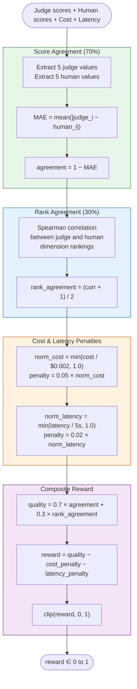
```mermaid
flowchart TD
    START([Judge scores + Human scores + Cost + Latency]) --> AGR

    subgraph AGREEMENT["Score Agreement (70%)"]
        AGR["Extract 5 judge values<br/>Extract 5 human values"]
        AGR --> MAE["MAE = mean(|judge_i − human_i|)"]
        MAE --> AGR_SCORE["agreement = 1 − MAE"]
    end

    subgraph RANK["Rank Agreement (30%)"]
        AGR_SCORE --> RNK["Spearman correlation<br/>between judge and human<br/>dimension rankings"]
        RNK --> RNK_NORM["rank_agreement = (corr + 1) / 2"]
    end

    subgraph PENALTIES["Cost & Latency Penalties"]
        RNK_NORM --> COST["norm_cost = min(cost / $0.002, 1.0)<br/>penalty = 0.05 × norm_cost"]
        COST --> LAT["norm_latency = min(latency / 5s, 1.0)<br/>penalty = 0.02 × norm_latency"]
    end

    subgraph COMPOSITE["Composite Reward"]
        LAT --> QUAL["quality = 0.7 × agreement + 0.3 × rank_agreement"]
        QUAL --> FINAL["reward = quality − cost_penalty − latency_penalty"]
        FINAL --> CLIP["clip(reward, 0, 1)"]
    end

    CLIP --> OUTPUT([reward ∈ 0 to 1])

    style AGREEMENT fill:#e8f5e9,stroke:#2e7d32
    style RANK fill:#e3f2fd,stroke:#1565c0
    style PENALTIES fill:#fff3e0,stroke:#e65100
    style COMPOSITE fill:#f3e5f5,stroke:#6a1b9a
```

### Explanation

The reward computation is a multi-stage pipeline that balances **scoring accuracy**, **ranking fidelity**, and **operational efficiency**:

- **Score agreement** captures how close the judge's absolute scores are to the human's. A judge that consistently scores 0.1 higher than the human across all dimensions would get agreement = 0.9.

- **Rank agreement** captures whether the judge correctly identifies the relative strengths and weaknesses of a response. Even if absolute values differ, preserving the ordering (e.g. "accuracy is higher than completeness") is valuable.

- **Cost and latency penalties** are small but non-zero. With the default weights (0.05 and 0.02), a judge call costing $0.002 and taking 5 seconds would reduce the reward by only 0.07 total. This ensures quality is the primary selection criterion while gently preferring cheaper, faster prompts when quality is equal.

---

## 16. Flowchart — JSON Response Parsing

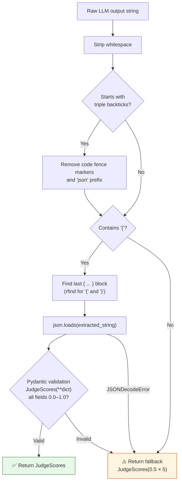
```mermaid
flowchart TD
    RAW["Raw LLM output string"] --> STRIP["Strip whitespace"]
    STRIP --> FENCE{"Starts with<br/>triple backticks?"}

    FENCE -->|"Yes"| REMOVE_FENCE["Remove code fence markers<br/>and 'json' prefix"]
    FENCE -->|"No"| CHECK_JSON

    REMOVE_FENCE --> CHECK_JSON{"Contains '{'?"}

    CHECK_JSON -->|"Yes"| EXTRACT["Find last { ... } block<br/>(rfind for '{' and '}')"]
    CHECK_JSON -->|"No"| FALLBACK

    EXTRACT --> PARSE["json.loads(extracted_string)"]
    PARSE --> VALIDATE{"Pydantic validation<br/>JudgeScores(**dict)<br/>all fields 0.0–1.0?"}

    VALIDATE -->|"Valid"| SUCCESS["✅ Return JudgeScores"]
    VALIDATE -->|"Invalid"| FALLBACK["⚠️ Return fallback<br/>JudgeScores(0.5 × 5)"]

    PARSE -->|"JSONDecodeError"| FALLBACK

    style SUCCESS fill:#e8f5e9,stroke:#2e7d32
    style FALLBACK fill:#fff3e0,stroke:#e65100
```

### Explanation

This parsing pipeline is designed to handle the variety of output formats different judge prompts produce:

- **Code fences** — Some LLMs wrap JSON in markdown code fences. The parser strips these.
- **CoT reasoning** — Chain-of-Thought prompts produce paragraphs of reasoning text before the JSON. The `rfind()` approach extracts only the **last** JSON object in the output, ignoring any earlier brace-like characters in the reasoning.
- **Validation** — Pydantic enforces that all 5 fields exist and are floats in [0, 1].
- **Fallback** — On any failure, scores of 0.5 are used. This neutral fallback means unparseable outputs neither strongly reward nor punish the arm, but the lack of agreement with human scores (which are rarely all 0.5) will naturally produce lower rewards, discouraging prompts that frequently fail parsing.

---

## 17. Flowchart — Bandit Algorithm Decision Logic

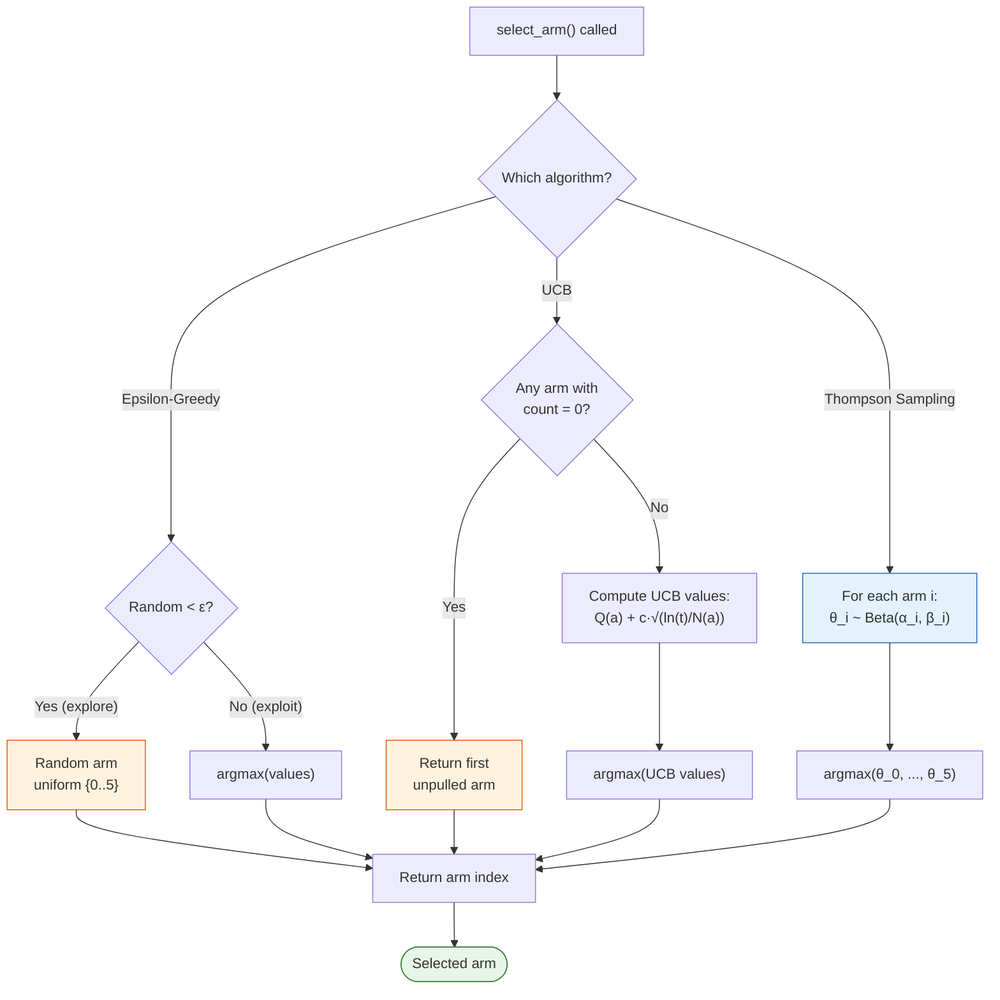
```mermaid
flowchart TD
    SELECT["select_arm() called"] --> WHICH{"Which algorithm?"}

    WHICH -->|"Epsilon-Greedy"| EG_COIN{"Random < ε?"}
    EG_COIN -->|"Yes (explore)"| EG_RAND["Random arm<br/>uniform {0..5}"]
    EG_COIN -->|"No (exploit)"| EG_BEST["argmax(values)"]
    EG_RAND --> RETURN["Return arm index"]
    EG_BEST --> RETURN

    WHICH -->|"UCB"| UCB_INIT{"Any arm with<br/>count = 0?"}
    UCB_INIT -->|"Yes"| UCB_FIRST["Return first<br/>unpulled arm"]
    UCB_INIT -->|"No"| UCB_CALC["Compute UCB values:<br/>Q(a) + c·√(ln(t)/N(a))"]
    UCB_CALC --> UCB_BEST["argmax(UCB values)"]
    UCB_FIRST --> RETURN
    UCB_BEST --> RETURN

    WHICH -->|"Thompson Sampling"| TS_SAMPLE["For each arm i:<br/>θ_i ~ Beta(α_i, β_i)"]
    TS_SAMPLE --> TS_BEST["argmax(θ_0, ..., θ_5)"]
    TS_BEST --> RETURN

    RETURN --> DONE(["Selected arm"])

    style DONE fill:#e8f5e9,stroke:#2e7d32
    style EG_RAND fill:#fff3e0,stroke:#e65100
    style UCB_FIRST fill:#fff3e0,stroke:#e65100
    style TS_SAMPLE fill:#e3f2fd,stroke:#1565c0
```

### Explanation

The three algorithms represent different points on the exploration-exploitation spectrum:

- **Epsilon-Greedy** — The simplest approach. A fixed fraction of the time (15%), it explores randomly; otherwise, it exploits the best-known arm. The main weakness is that it explores uniformly — wasting pulls on arms already known to be poor.

- **UCB** — Uses a deterministic exploration bonus that shrinks with more pulls. The formula `Q(a) + c·√(ln(t)/N(a))` guarantees logarithmic regret. In early iterations, under-explored arms get large bonuses; as they accumulate pulls, the bonus shrinks and the algorithm converges. The initialisation phase (returning any arm with count 0) ensures every arm is tried at least once.

- **Thompson Sampling** — The most nuanced. By sampling from posteriors, it naturally explores uncertain arms (wide distributions) and exploits known-good arms (narrow distributions). No explicit exploration parameter is needed — the algorithm balances exploration and exploitation organically through Bayesian updating.

---

## 18. Flowchart — Training Orchestration


```mermaid
flowchart TD
    INIT["Initialise:<br/>• 6 judge prompts (arms)<br/>• 11 eval samples<br/>• LLMService<br/>• 3 bandit algorithms"]

    INIT --> TS_TRAIN["🎰 Train Thompson Sampling<br/>40 iterations via LangGraph"]
    TS_TRAIN --> TS_RESULT["Store ts_rewards, ts_details"]

    TS_RESULT --> UCB_TRAIN["📊 Train UCB<br/>40 iterations via LangGraph"]
    UCB_TRAIN --> UCB_RESULT["Store ucb_rewards, ucb_details"]

    UCB_RESULT --> EG_TRAIN["🎲 Train Epsilon-Greedy<br/>40 iterations via LangGraph"]
    EG_TRAIN --> EG_RESULT["Store eg_rewards, eg_details"]

    EG_RESULT --> VIZ["📈 Visualise:<br/>• Reward curves<br/>• Algorithm comparison<br/>• Arm pull distribution<br/>• Per-prompt rewards"]

    VIZ --> ANALYSIS["📊 Analyse:<br/>• Agreement by judge prompt<br/>• Agreement by query type<br/>• Heatmaps (judge × quality tier)<br/>• Heatmaps (judge × query type)"]

    ANALYSIS --> H2H["🏆 Head-to-Head:<br/>Best vs worst judge prompt<br/>on all 11 samples"]

    H2H --> CROSS["🔀 Cross-Provider:<br/>Best judge prompt on<br/>OpenAI vs Anthropic"]

    CROSS --> PROD["🚀 Production:<br/>AdaptiveJudgeSelector<br/>with pretrained bandit"]

    PROD --> SUMMARY["💰 Cost & Performance<br/>Summary + Beta posteriors"]

    style INIT fill:#e0f2f1,stroke:#00695c
    style TS_TRAIN fill:#e3f2fd,stroke:#1565c0
    style UCB_TRAIN fill:#e3f2fd,stroke:#1565c0
    style EG_TRAIN fill:#e3f2fd,stroke:#1565c0
    style VIZ fill:#fff9c4,stroke:#f57f17
    style ANALYSIS fill:#f3e5f5,stroke:#6a1b9a
    style H2H fill:#fce4ec,stroke:#c62828
    style CROSS fill:#fff3e0,stroke:#e65100
    style PROD fill:#e8f5e9,stroke:#2e7d32
    style SUMMARY fill:#efebe9,stroke:#4e342e
```

### Explanation

The notebook follows a structured pipeline:

1. **Initialisation** — Define all components: 6 judge prompt templates, 11 evaluation samples with human scores, the LLM service (OpenAI + Anthropic), and initialise three bandit algorithms.

2. **Training** — Each algorithm runs 40 iterations through its own LangGraph workflow instance. Each iteration makes one real LLM call. The three runs are sequential (not parallel) to avoid API rate limits and to enable clear per-algorithm progress logging. Total: 120 LLM calls.

3. **Visualisation** — Four-panel plot comparing reward curves, mean rewards, arm pull distributions, and per-prompt reward breakdowns across all three algorithms.

4. **Analysis** — Detailed breakdowns of agreement by judge prompt, by query type, and cross-tabulated heatmaps (judge × quality tier, judge × query type). These reveal which prompts work best for which scenarios.

5. **Head-to-Head** — The best and worst judge prompts (identified by Thompson Sampling) are run on all 11 samples to quantify the improvement from prompt selection. This makes 22 additional LLM calls.

6. **Cross-Provider** — The best judge prompt is run on both OpenAI and Anthropic on 5 samples to check if performance is provider-dependent. This makes 10 additional LLM calls.

7. **Production** — The `AdaptiveJudgeSelector` is instantiated with the trained Thompson Sampling bandit and demonstrated on a live evaluation.

8. **Summary** — Final cost breakdown, bandit summaries, and Beta posterior distribution plots.

---

## 19. State Diagram — LangGraph Bandit Loop

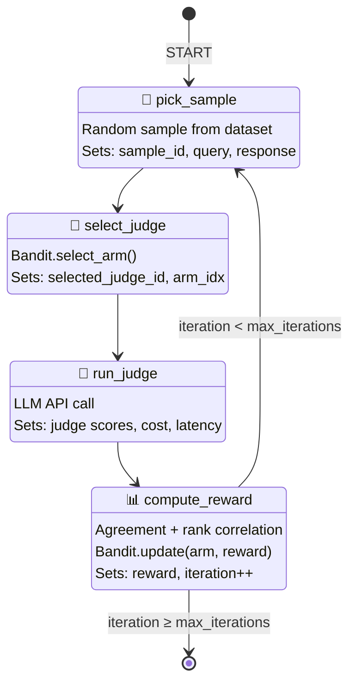
```mermaid
stateDiagram-v2
    [*] --> PickSample : START

    PickSample : 🎲 pick_sample
    PickSample : Random sample from dataset
    PickSample : Sets: sample_id, query, response

    SelectJudge : 🎯 select_judge
    SelectJudge : Bandit.select_arm()
    SelectJudge : Sets: selected_judge_id, arm_idx

    RunJudge : 🤖 run_judge
    RunJudge : LLM API call
    RunJudge : Sets: judge scores, cost, latency

    ComputeReward : 📊 compute_reward
    ComputeReward : Agreement + rank correlation
    ComputeReward : Bandit.update(arm, reward)
    ComputeReward : Sets: reward, iteration++

    PickSample --> SelectJudge
    SelectJudge --> RunJudge
    RunJudge --> ComputeReward

    ComputeReward --> PickSample : iteration < max_iterations
    ComputeReward --> [*] : iteration ≥ max_iterations
```

### Explanation

The state diagram shows the lifecycle of the LangGraph workflow:

- The workflow begins in the `PickSample` state and transitions linearly through `SelectJudge` → `RunJudge` → `ComputeReward`.
- After `ComputeReward`, the `should_continue` conditional edge evaluates the iteration counter. If more iterations remain, the workflow transitions back to `PickSample` (forming the training loop). Otherwise, it reaches the terminal state.
- Each state (node) receives the full `BanditWorkflowState` dictionary and returns a partial update dictionary. LangGraph merges the update into the existing state, preserving all fields not explicitly overwritten.
- The `rewards_log` and `details_log` fields grow monotonically — each `ComputeReward` invocation appends to the existing lists rather than overwriting them.

---

## 20. Data Flow Diagram

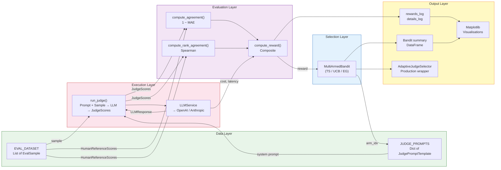
```mermaid
flowchart LR
    subgraph DATA["Data Layer"]
        DATASET["EVAL_DATASET<br/>List of EvalSample"]
        PROMPTS["JUDGE_PROMPTS<br/>Dict of JudgePromptTemplate"]
    end

    subgraph SELECTION["Selection Layer"]
        BANDIT["MultiArmedBandit<br/>(TS / UCB / EG)"]
    end

    subgraph EXECUTION["Execution Layer"]
        JUDGE["run_judge()<br/>Prompt + Sample → LLM → JudgeScores"]
        LLM_SVC["LLMService<br/>→ OpenAI / Anthropic"]
    end

    subgraph EVALUATION["Evaluation Layer"]
        AGREE["compute_agreement()<br/>1 − MAE"]
        RANK["compute_rank_agreement()<br/>Spearman"]
        REWARD["compute_reward()<br/>Composite"]
    end

    subgraph OUTPUT_LAYER["Output Layer"]
        LOGS["rewards_log<br/>details_log"]
        SUMMARY_DF["Bandit summary<br/>DataFrame"]
        PLOTS["Matplotlib<br/>Visualisations"]
        PROD_SEL["AdaptiveJudgeSelector<br/>Production wrapper"]
    end

    DATASET -->|"sample"| JUDGE
    PROMPTS -->|"system prompt"| JUDGE
    BANDIT -->|"arm_idx"| PROMPTS
    JUDGE --> LLM_SVC
    LLM_SVC -->|"LLMResponse"| JUDGE
    JUDGE -->|"JudgeScores"| AGREE
    DATASET -->|"HumanReferenceScores"| AGREE
    JUDGE -->|"JudgeScores"| RANK
    DATASET -->|"HumanReferenceScores"| RANK
    AGREE --> REWARD
    RANK --> REWARD
    LLM_SVC -->|"cost, latency"| REWARD
    REWARD -->|"reward"| BANDIT
    REWARD --> LOGS
    BANDIT --> SUMMARY_DF
    LOGS --> PLOTS
    SUMMARY_DF --> PLOTS
    BANDIT --> PROD_SEL

    style DATA fill:#e8f5e9,stroke:#2e7d32
    style SELECTION fill:#e3f2fd,stroke:#1565c0
    style EXECUTION fill:#fce4ec,stroke:#c62828
    style EVALUATION fill:#f3e5f5,stroke:#6a1b9a
    style OUTPUT_LAYER fill:#fff9c4,stroke:#f57f17
```

### Explanation

This diagram traces the data flow through the system's five layers:

1. **Data Layer** — Static inputs: the 11-sample evaluation dataset and the 6-prompt judge pool. These are read-only during training.

2. **Selection Layer** — The bandit algorithm, which maps the current belief state (mean rewards, posteriors) to a judge prompt selection. It is the only stateful component — updated after each iteration.

3. **Execution Layer** — The `run_judge()` function and `LLMService` work together to execute the selected judge prompt against the sample via a real LLM API call. This is where the external API interaction happens.

4. **Evaluation Layer** — Three pure functions compute the reward signal by comparing `JudgeScores` against `HumanReferenceScores`. No side effects, no state — just numerical computation.

5. **Output Layer** — Accumulated logs feed into visualisations (matplotlib) and summary tables (pandas). The trained bandit is wrapped in `AdaptiveJudgeSelector` for production use. The logs also enable the detailed agreement analysis (heatmaps, per-query-type breakdowns).

The key feedback loop is: **Bandit → Prompt selection → LLM execution → Scores → Reward computation → Bandit update**. This closed loop is what makes the system adaptive — the bandit's beliefs converge toward the true quality ranking of judge prompts through repeated interaction.
