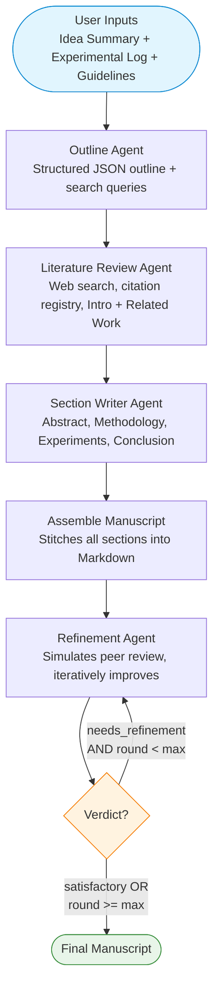
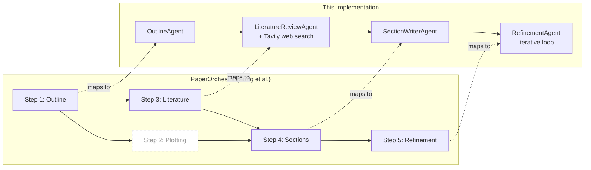

# PaperOrchestra — Multi-Agent Research Paper Writing

A multi-agent pipeline for automated AI research paper writing, inspired by [PaperOrchestra](https://yiwen-song.github.io/paper_orchestra/) (Song et al., 2026). The system transforms raw pre-writing materials (idea summary + experimental log) into a complete research manuscript through four specialized agents.

| Component | Technology |
|-----------|-----------|
| **Orchestration** | LangGraph |
| **LLM Backend** | Configurable: OpenAI, Anthropic, Google Gemini, Vertex AI |
| **Literature Search** | Tavily (web search) or mock for demo |
| **Tracing** | LangSmith (optional) |
| **Output** | Markdown manuscript |

---

## Architecture



### Agent Details

| Agent | Input | Output | LLM Task |
|-------|-------|--------|----------|
| **Outline** | Idea summary, experimental log, guidelines | JSON outline with sections, contributions, search queries | Structured planning |
| **Literature Review** | Outline + web search results | Citation registry, Introduction draft, Related Work draft | Synthesis + academic writing |
| **Section Writer** | Outline, citations, experimental data, lit sections | Abstract, Methodology, Experiments, Conclusion | Long-form technical writing |
| **Refinement** | Full manuscript, guidelines | Review verdict, issues list, refined manuscript | Critical review + editing |

---

## Directory Structure

```
research_paper_creation/
├── README.md
├── requirements.txt
├── .env.example
├── .gitignore
├── pyproject.toml
├── demo_paper_generation.ipynb       ← Runnable demo notebook
│
├── config/
│   ├── __init__.py
│   └── settings.py                   ← PipelineConfig + LLM factory
│
├── prompts/
│   ├── outline_agent.md              ← Outline Agent system prompt
│   ├── literature_review_agent.md    ← Literature Review Agent prompt
│   ├── section_writing_agent.md      ← Section Writer Agent prompt
│   └── refinement_agent.md           ← Refinement Agent prompt
│
├── agents/
│   ├── __init__.py
│   ├── outline.py                    ← OutlineAgent
│   ├── literature_review.py          ← LiteratureReviewAgent
│   ├── section_writer.py             ← SectionWriterAgent
│   └── refinement.py                 ← RefinementAgent
│
├── tools/
│   ├── __init__.py
│   └── web_search.py                 ← Tavily + mock search implementations
│
├── workflow/
│   ├── __init__.py
│   ├── state.py                      ← LangGraph PaperState schema
│   └── graph.py                      ← LangGraph graph definition
│
├── examples/
│   └── sample_inputs/
│       ├── idea_summary.md           ← Sample: AdaSparse attention
│       ├── experimental_log.md       ← Sample: experimental results
│       └── conference_guidelines.md  ← Sample: submission guidelines
│
└── tests/
    ├── __init__.py
    ├── conftest.py                   ← Mock LLMs + sample responses
    ├── test_agents.py                ← Agent unit tests
    ├── test_tools.py                 ← Search tool tests
    └── test_graph_integration.py     ← End-to-end pipeline tests
```

---

## Quick Start

### 1. Install dependencies

```bash
cd research_paper_creation
pip install -r requirements.txt
```

### 2. Configure

Copy `.env.example` to `.env` and set your API keys:

```bash
cp .env.example .env
# Edit .env with your keys
```

**Minimum required:** one LLM API key (OpenAI, Anthropic, or Google) + Tavily API key for web search.

**For demo without Tavily:** set `SEARCH_PROVIDER=mock` to use pre-defined sample papers.

### 3. Run the demo notebook

```bash
jupyter notebook demo_paper_generation.ipynb
```

Or run programmatically:

```python
from config.settings import PipelineConfig
from workflow.graph import build_paper_workflow
from pathlib import Path

config = PipelineConfig.from_env()
graph = build_paper_workflow(config)

result = graph.invoke({
    "idea_summary": Path("examples/sample_inputs/idea_summary.md").read_text(),
    "experimental_log": Path("examples/sample_inputs/experimental_log.md").read_text(),
    "conference_guidelines": Path("examples/sample_inputs/conference_guidelines.md").read_text(),
})

print(result["final_manuscript"])
```

---

## Configuring the LLM Backend

The pipeline supports multiple LLM providers through a single configuration:

| Provider | `LLM_PROVIDER` | `LLM_MODEL` (examples) | API Key Env Var |
|----------|----------------|------------------------|-----------------|
| OpenAI | `openai` | `gpt-4o`, `gpt-4.1` | `OPENAI_API_KEY` |
| Anthropic | `anthropic` | `claude-sonnet-4-20250514` | `ANTHROPIC_API_KEY` |
| Google AI | `google` | `gemini-2.5-flash` | `GOOGLE_API_KEY` |
| Vertex AI | `google_vertex` | `gemini-2.5-flash` | `GCP_PROJECT_ID` + ADC |

All four agents use the same LLM by default. To use different models per agent, extend `PipelineConfig` with per-agent settings.

---

## Running Tests

All tests use mocked LLMs and mock search — no API keys or network required.

```bash
pytest -v
```

| Test Module | Tests | Coverage |
|-------------|------:|----------|
| `test_agents.py` | 10 | All 4 agents: JSON parsing, state updates, edge cases |
| `test_tools.py` | 5 | Mock/Tavily factory, result format, error handling |
| `test_graph_integration.py` | 4 | Full pipeline: pass-first-try, refinement loop, max rounds |

---

## How It Maps to PaperOrchestra



| PaperOrchestra Step | This Implementation | Status |
|--------------------|--------------------|--------|
| Step 1: Outline Generation | `OutlineAgent` | Implemented |
| Step 2: Plot Generation | — | Not implemented (out of scope for core pipeline) |
| Step 3: Literature Review | `LiteratureReviewAgent` + Tavily web search | Implemented |
| Step 4: Section Writing | `SectionWriterAgent` | Implemented |
| Step 5: Content Refinement | `RefinementAgent` with iterative loop | Implemented |
| Semantic Scholar API verification | — | Could be added as a post-search filter |
| LaTeX output | Markdown output | Could add LaTeX conversion |
| PaperWritingBench evaluation | — | Could add automated evaluation |

---

## Extending

### Add a new LLM provider

Add a new branch to `create_llm()` in `config/settings.py`.

### Add plot generation

Create `agents/plotting.py`, add it as a node in `workflow/graph.py` running in parallel with the literature review (LangGraph supports parallel nodes).

### Switch to LaTeX output

Modify `assemble_manuscript()` in `workflow/graph.py` to output LaTeX instead of Markdown, or add a post-processing node that converts Markdown to LaTeX using `pandoc`.

### Use different models per agent

Extend `PipelineConfig` with `outline_model`, `lit_review_model`, etc., and create separate LLM instances in `build_paper_workflow()`.

---

## Reference

> Song, Y., Song, Y., Pfister, T., & Yoon, J. (2026). *PaperOrchestra: A Multi-Agent Framework for Automated AI Research Paper Writing*. arXiv:2604.05018.
