# Research Paper Agentic Workflow — Architecture & Design

This document provides a comprehensive technical analysis of the multi-agent paper-writing pipeline, covering static class structure, dynamic interaction sequences, decision logic, and data flow. All diagrams use Mermaid notation.

---

## Table of Contents

1. [System Architecture Overview](#1-system-architecture-overview)
2. [Module Dependency Graph](#2-module-dependency-graph)
3. [Static Structure — UML Class Diagrams](#3-static-structure--uml-class-diagrams)
   - 3.1 [Configuration Layer](#31-configuration-layer)
   - 3.2 [Agent Hierarchy](#32-agent-hierarchy)
   - 3.3 [Search Tool Abstraction](#33-search-tool-abstraction)
   - 3.4 [Workflow State Schema](#34-workflow-state-schema)
   - 3.5 [Complete System Class Diagram](#35-complete-system-class-diagram)
4. [Dynamic Behavior — Sequence Diagrams](#4-dynamic-behavior--sequence-diagrams)
   - 4.1 [Pipeline Initialization](#41-pipeline-initialization)
   - 4.2 [Full Paper Generation Sequence](#42-full-paper-generation-sequence)
   - 4.3 [Literature Search Detail](#43-literature-search-detail)
   - 4.4 [Refinement Loop](#44-refinement-loop)
5. [Decision Logic — Flowcharts](#5-decision-logic--flowcharts)
   - 5.1 [Route After Review](#51-route-after-review)
   - 5.2 [JSON Response Parsing](#52-json-response-parsing)
6. [Data Flow Through the Pipeline](#6-data-flow-through-the-pipeline)

---

## 1. System Architecture Overview

The pipeline follows a linear chain of four specialized agents, with a conditional feedback loop at the refinement stage. Each agent is a LangGraph node that reads from and writes to a shared `PaperState` dictionary.

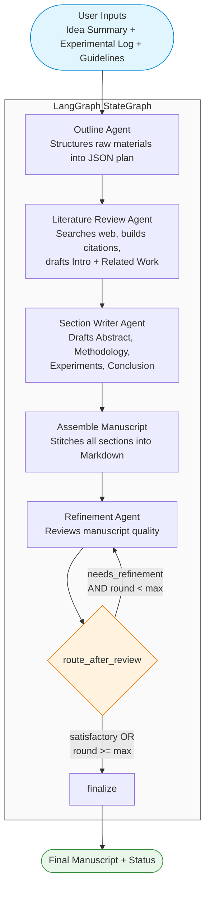

The critical design choice is the **conditional edge** after the Refinement Agent. Rather than using a fixed number of refinement passes, the router inspects both the agent's verdict and the current round counter, giving the system flexibility to terminate early when the manuscript is satisfactory.

---

## 2. Module Dependency Graph

The following diagram shows how Python modules import from each other. `workflow/graph.py` is the composition root that wires all components together.

```mermaid
flowchart BT
    subgraph config_pkg["config/"]
        settings["settings.py<br/>PipelineConfig + create_llm"]
    end

    subgraph tools_pkg["tools/"]
        web_search["web_search.py<br/>WebSearchTool hierarchy"]
    end

    subgraph prompts_pkg["prompts/"]
        p1["outline_agent.md"]
        p2["literature_review_agent.md"]
        p3["section_writing_agent.md"]
        p4["refinement_agent.md"]
    end

    subgraph agents_pkg["agents/"]
        outline["outline.py"]
        lit_review["literature_review.py"]
        section_writer["section_writer.py"]
        refinement["refinement.py"]
    end

    subgraph workflow_pkg["workflow/"]
        state["state.py<br/>PaperState"]
        graph["graph.py<br/>build_paper_workflow"]
    end

    outline --> p1
    lit_review --> p2
    lit_review --> web_search
    section_writer --> p3
    refinement --> p4

    graph --> settings
    graph --> web_search
    graph --> outline
    graph --> lit_review
    graph --> section_writer
    graph --> refinement
    graph --> state

    style graph fill:#e3f2fd,stroke:#1565c0
    style settings fill:#fce4ec,stroke:#c62828
```

Key observations:

- **`graph.py`** is the single composition root. No agent knows about any other agent; all coordination happens through LangGraph's state-passing mechanism.
- **Agents depend only on their own prompt file** and on `BaseChatModel` (via constructor injection). `LiteratureReviewAgent` additionally depends on `WebSearchTool`.
- **`PaperState`** is imported only by `graph.py`. Agents receive and return plain `dict` values, keeping them decoupled from the state schema.

---

## 3. Static Structure — UML Class Diagrams

### 3.1 Configuration Layer

`PipelineConfig` is the single entry point for all configuration. It uses the **Factory Method** pattern: `build_llm()` delegates to the module-level `create_llm()` function, which selects the appropriate LangChain chat model based on the provider string.

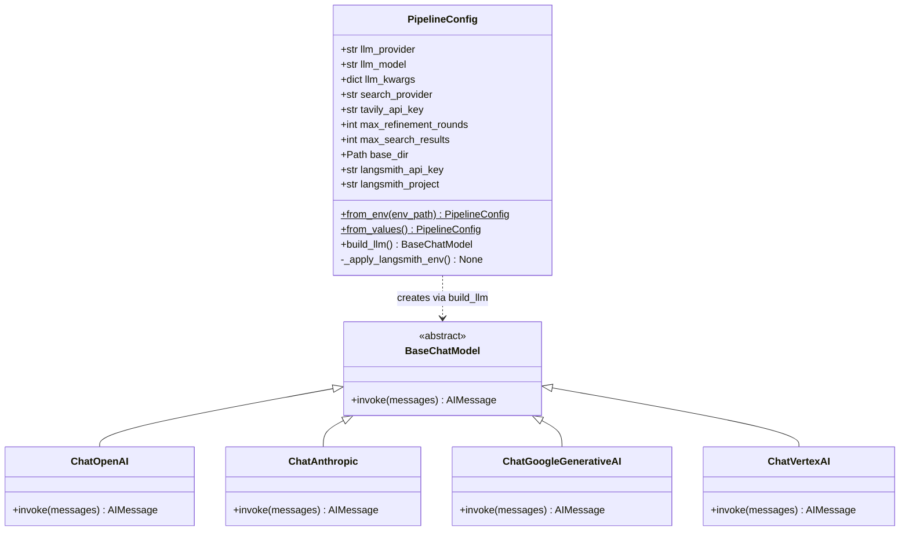

The factory function delegates to the correct LangChain constructor at runtime:

```python
def create_llm(provider: str, model: str, **kwargs) -> BaseChatModel:
    if provider == "openai":
        from langchain_openai import ChatOpenAI
        return ChatOpenAI(model=model, **kwargs)
    if provider == "anthropic":
        from langchain_anthropic import ChatAnthropic
        return ChatAnthropic(model=model, **kwargs)
    if provider == "google":
        from langchain_google_genai import ChatGoogleGenerativeAI
        return ChatGoogleGenerativeAI(model=model, **kwargs)
    if provider == "google_vertex":
        from langchain_google_vertexai import ChatVertexAI
        return ChatVertexAI(model_name=model, **kwargs)
    raise ValueError(f"Unknown LLM provider: {provider}")
```

The lazy imports (`from langchain_openai import ...` inside each branch) ensure that only the selected provider's SDK needs to be installed at runtime.

`PipelineConfig` also supports two factory class methods for construction:

- **`from_env()`** — loads settings from a `.env` file via `python-dotenv`.
- **`from_values()`** — accepts all parameters explicitly, useful for notebooks and hardcoded configuration.

Both factories call `_apply_langsmith_env()` to propagate LangSmith tracing environment variables when an API key is present.

---

### 3.2 Agent Hierarchy

All four agents share a common structural pattern: they accept a `BaseChatModel` via constructor injection, load their system prompt from a Markdown file at init time, and implement `__call__(state: dict) -> dict` so LangGraph can invoke them as nodes.

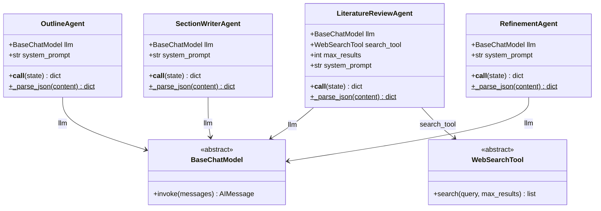

**Common pattern across all agents:**

1. **Constructor** stores the LLM reference and reads the system prompt from disk.
2. **`__call__`** builds a user message from the relevant state fields, invokes the LLM with `[SystemMessage, HumanMessage]`, parses the JSON response, and returns a partial state update dictionary.
3. **`_parse_json`** (static method) implements a three-tier parsing strategy: try clean JSON, try stripping code fences, try regex extraction.

The key asymmetry is that `LiteratureReviewAgent` has two dependencies (`llm` + `search_tool`) rather than just one. This reflects its dual responsibility: it first _retrieves_ information from the web, then _synthesizes_ it through the LLM.

---

### 3.3 Search Tool Abstraction

The search layer uses the **Strategy pattern** behind an abstract base class, allowing easy swapping between real and mock search at configuration time.

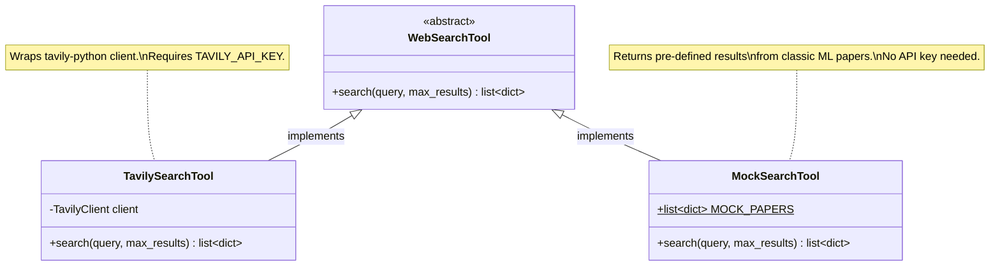

The `create_search_tool` factory function mirrors `create_llm`:

```python
def create_search_tool(provider: str, **kwargs) -> WebSearchTool:
    if provider == "tavily":
        api_key = kwargs.get("api_key") or kwargs.get("tavily_api_key", "")
        if not api_key:
            raise ValueError("TAVILY_API_KEY is required for Tavily search")
        return TavilySearchTool(api_key=api_key)
    if provider == "mock":
        return MockSearchTool()
    raise ValueError(f"Unknown search provider: {provider}")
```

Both implementations return `list[dict]` where each dict contains `{title, url, content}`. The `LiteratureReviewAgent` is coded against the `WebSearchTool` abstraction and never needs to know which concrete implementation it is using.

---

### 3.4 Workflow State Schema

`PaperState` is a `TypedDict` that serves as the shared memory for the entire LangGraph pipeline. Fields are grouped by the agent that writes them.

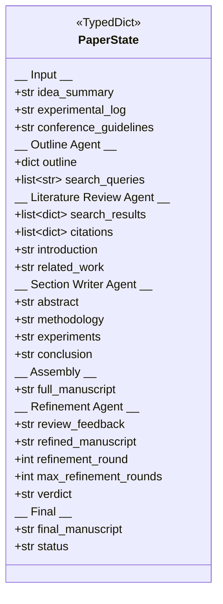

The state uses `total=False`, meaning all fields are optional. This is important because the state is populated incrementally — the Outline Agent writes `outline` and `search_queries`, the Literature Review Agent adds `citations`, `introduction`, and `related_work`, and so on. Each agent reads only the fields it needs and writes only the fields it is responsible for.

---

### 3.5 Complete System Class Diagram

This diagram shows the full static structure, including how `build_paper_workflow` connects all components.

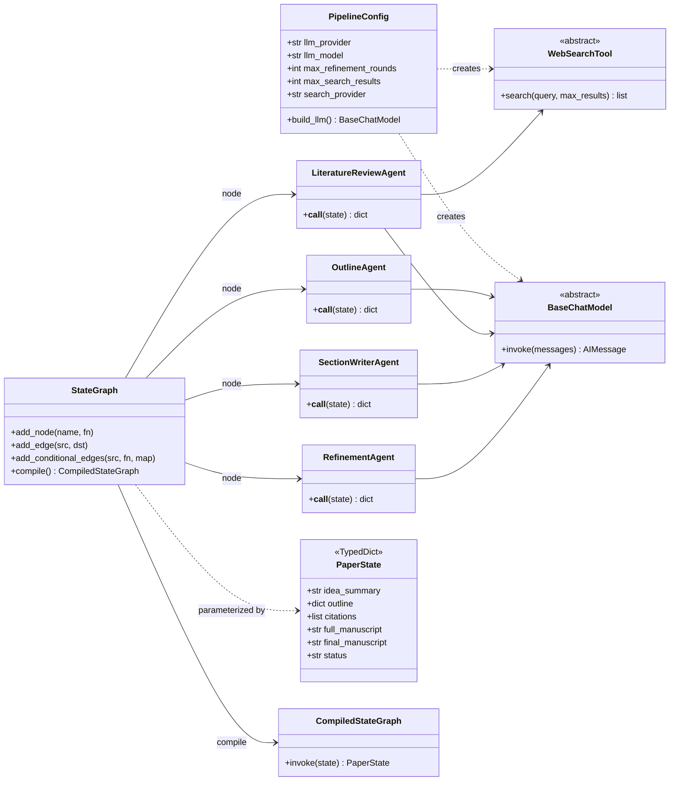

The `build_paper_workflow` function in `workflow/graph.py` is the composition root that orchestrates all of these relationships. It:

1. Creates a `BaseChatModel` via `config.build_llm()`
2. Creates a `WebSearchTool` via `create_search_tool()`
3. Instantiates all four agents, injecting their dependencies
4. Constructs the `StateGraph`, adds nodes and edges
5. Returns the `CompiledStateGraph`

---

## 4. Dynamic Behavior — Sequence Diagrams

### 4.1 Pipeline Initialization

Before any paper generation happens, the system must be initialized. This sequence shows how the user configures the pipeline and obtains a compiled graph.

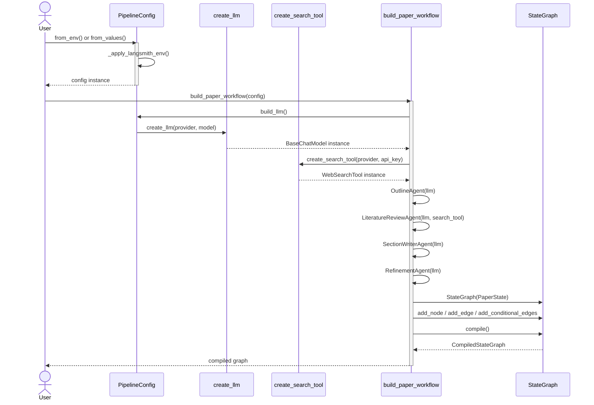

Corresponding code in `workflow/graph.py`:

```python
def build_paper_workflow(config: PipelineConfig) -> CompiledStateGraph:
    llm = config.build_llm()
    search_tool = create_search_tool(config.search_provider, api_key=config.tavily_api_key)

    outline_agent = OutlineAgent(llm)
    lit_agent = LiteratureReviewAgent(llm, search_tool, config.max_search_results)
    section_agent = SectionWriterAgent(llm)
    refinement_agent = RefinementAgent(llm)

    graph = StateGraph(PaperState)
    graph.add_node("generate_outline", outline_agent)
    graph.add_node("search_literature", lit_agent)
    graph.add_node("write_sections", section_agent)
    graph.add_node("assemble", assemble_manuscript)
    graph.add_node("review", refinement_agent)
    graph.add_node("finalize", finalize)

    graph.set_entry_point("generate_outline")
    graph.add_edge("generate_outline", "search_literature")
    graph.add_edge("search_literature", "write_sections")
    graph.add_edge("write_sections", "assemble")
    graph.add_edge("assemble", "review")
    graph.add_conditional_edges("review", route_after_review, {
        "refine": "review",
        "done": "finalize",
    })
    graph.add_edge("finalize", END)

    return graph.compile()
```

---

### 4.2 Full Paper Generation Sequence

This is the end-to-end sequence when a user invokes the compiled graph with their input materials. Each agent interacts with the LLM, and the `LiteratureReviewAgent` additionally calls the web search tool.

```mermaid
sequenceDiagram
    actor U as User
    participant LG as LangGraph Runtime
    participant OA as OutlineAgent
    participant LRA as LiteratureReviewAgent
    participant SWA as SectionWriterAgent
    participant ASM as assemble_manuscript
    participant RA as RefinementAgent
    participant RT as route_after_review
    participant FN as finalize
    participant LLM as BaseChatModel
    participant ST as WebSearchTool

    U->>LG: graph.invoke(initial_state)
    activate LG

    Note over LG,LLM: Step 1 — Outline Generation
    LG->>OA: __call__(state)
    activate OA
    OA->>LLM: invoke([SystemMsg, HumanMsg])
    LLM-->>OA: JSON outline
    OA-->>LG: outline, search_queries
    deactivate OA

    Note over LG,ST: Step 2 — Literature Search and Review
    LG->>LRA: __call__(state)
    activate LRA
    loop For each search query
        LRA->>ST: search(query, max_results)
        ST-->>LRA: results list
    end
    LRA->>LRA: Deduplicate by URL
    LRA->>LLM: invoke([SystemMsg, HumanMsg])
    LLM-->>LRA: JSON citations + intro + related_work
    LRA-->>LG: search_results, citations, introduction, related_work
    deactivate LRA

    Note over LG,LLM: Step 3 — Section Writing
    LG->>SWA: __call__(state)
    activate SWA
    SWA->>LLM: invoke([SystemMsg, HumanMsg])
    LLM-->>SWA: JSON abstract + methodology + experiments + conclusion
    SWA-->>LG: abstract, methodology, experiments, conclusion
    deactivate SWA

    Note over LG: Step 4 — Assembly
    LG->>ASM: assemble_manuscript(state)
    activate ASM
    ASM-->>LG: full_manuscript, refinement_round=0
    deactivate ASM

    Note over LG,LLM: Step 5 — Refinement Loop
    loop Review cycle
        LG->>RA: __call__(state)
        activate RA
        RA->>LLM: invoke([SystemMsg, HumanMsg])
        LLM-->>RA: JSON verdict + issues + refined_manuscript
        RA-->>LG: verdict, review_feedback, full_manuscript, refinement_round
        deactivate RA
        LG->>RT: route_after_review(state)
        break verdict is satisfactory OR round >= max
            RT-->>LG: done
        end
        RT-->>LG: refine
    end

    Note over LG: Step 6 — Finalize
    LG->>FN: finalize(state)
    activate FN
    FN-->>LG: final_manuscript, status
    deactivate FN

    LG-->>U: Complete PaperState
    deactivate LG
```

**Observations on the sequence:**

1. **The LLM is called exactly once per agent** (per invocation of that agent). There is no multi-turn conversation within a single agent call — each agent constructs a fresh `[SystemMessage, HumanMessage]` pair.

2. **The web search calls happen synchronously** inside the Literature Review Agent's `__call__`. Each query is searched independently, and results are deduplicated before the synthesis LLM call.

3. **The refinement loop is the only non-linear control flow.** The `break` in the sequence diagram corresponds to the conditional edge where `route_after_review` returns `"done"`. If it returns `"refine"`, the loop continues and the Review node is re-invoked with the updated state.

---

### 4.3 Literature Search Detail

The Literature Review Agent has the most complex internal behavior of any agent, combining external tool use with LLM synthesis. This diagram focuses on the search and deduplication logic.

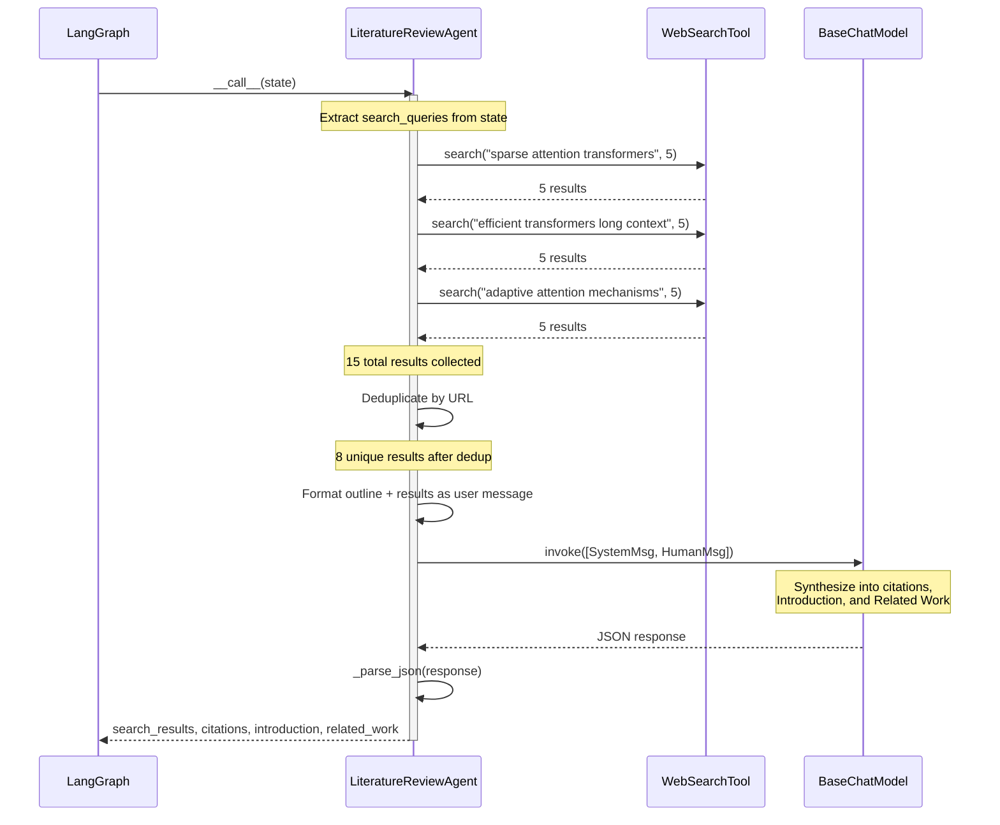

The deduplication logic uses a URL-based set to eliminate duplicates that appear across multiple search queries:

```python
seen_urls: set[str] = set()
unique_results = []
for r in all_results:
    url = r.get("url", "")
    if url and url not in seen_urls:
        seen_urls.add(url)
        unique_results.append(r)
```

This is important because queries like "sparse attention transformers" and "efficient transformers long context" are likely to return overlapping results (e.g., the FlashAttention and Longformer papers).

---

### 4.4 Refinement Loop

This diagram isolates the refinement feedback loop, showing three scenarios: pass on first review, pass after one refinement, and termination at max rounds.

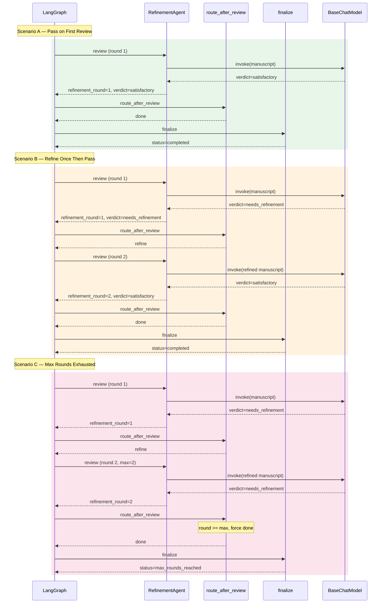

In Scenario C, the final `status` is `"max_rounds_reached"` rather than `"completed"`, signaling to the user that the refinement process was cut short. The manuscript returned is the best version achieved within the allowed rounds.

---

## 5. Decision Logic — Flowcharts

### 5.1 Route After Review

The `route_after_review` function is the conditional routing logic that decides whether to continue refining or finalize the manuscript.

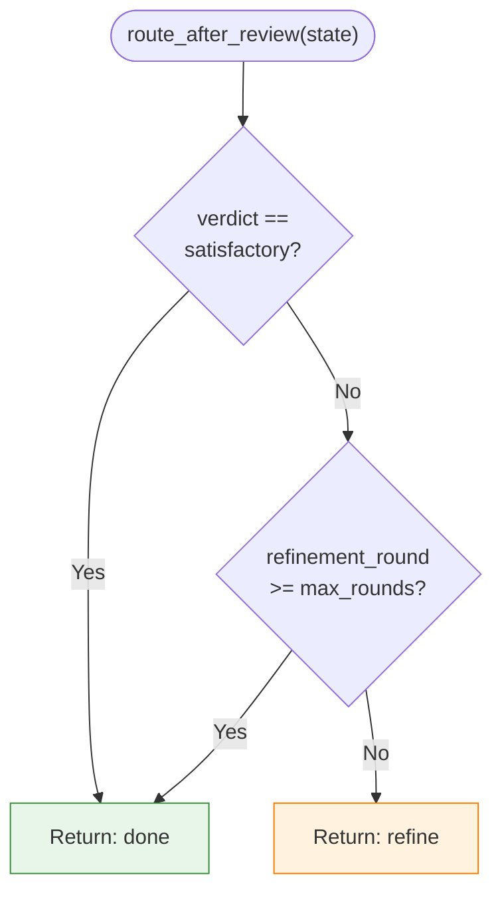

The corresponding implementation:

```python
def route_after_review(state: PaperState) -> str:
    verdict = state.get("verdict", "satisfactory")
    round_num = state.get("refinement_round", 0)
    max_rounds = state.get("max_refinement_rounds", 2)

    if verdict == "satisfactory" or round_num >= max_rounds:
        return "done"
    return "refine"
```

Note the **safe default behavior**: if the verdict field is missing from the state (e.g., due to a parsing failure), it defaults to `"satisfactory"`, which routes to finalize rather than creating an infinite loop. This is a deliberate defensive design choice.

### 5.2 JSON Response Parsing

All four agents share the same three-tier JSON parsing strategy implemented in their respective `_parse_json` static methods. This strategy is necessary because LLMs do not always return clean JSON — they frequently wrap it in Markdown code fences or embed it within explanatory text.

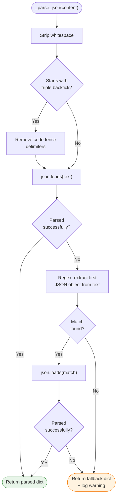

The three tiers are:

1. **Direct parse** — try `json.loads()` on the raw content (handles well-behaved LLM responses).
2. **Code fence removal** — strip the opening `` ```json `` and closing `` ``` `` lines, then retry.
3. **Regex extraction** — use `re.search(r"\{.*\}", text, re.DOTALL)` to find the first complete JSON object embedded in surrounding text.

If all three tiers fail, each agent returns a different fallback dict appropriate to its role (e.g., the Outline Agent returns a minimal `{title: "Untitled Paper", sections: []}` structure).

```python
@staticmethod
def _parse_json(content: str) -> dict:
    text = content.strip()
    if text.startswith("```"):
        lines = text.split("\n")
        lines = lines[1:]                            # remove opening fence
        if lines and lines[-1].strip() == "```":
            lines = lines[:-1]                       # remove closing fence
        text = "\n".join(lines)
    try:
        return json.loads(text)
    except json.JSONDecodeError:
        match = re.search(r"\{.*\}", text, re.DOTALL)
        if match:
            try:
                return json.loads(match.group())
            except json.JSONDecodeError:
                pass
    logger.warning("Could not parse JSON, returning fallback")
    return { ... }  # agent-specific fallback
```

---

## 6. Data Flow Through the Pipeline

Each node in the graph reads a subset of the state and writes a disjoint subset. The following diagram traces how state fields accumulate through the pipeline.

```mermaid
flowchart LR
    subgraph Input
        direction TB
        F_idea["idea_summary"]
        F_exp["experimental_log"]
        F_guide["conference_guidelines"]
    end

    subgraph OA_out["Outline Agent writes"]
        direction TB
        F_outline["outline"]
        F_queries["search_queries"]
    end

    subgraph LRA_out["Literature Review Agent writes"]
        direction TB
        F_results["search_results"]
        F_cites["citations"]
        F_intro["introduction"]
        F_rw["related_work"]
    end

    subgraph SWA_out["Section Writer Agent writes"]
        direction TB
        F_abs["abstract"]
        F_meth["methodology"]
        F_exp2["experiments"]
        F_conc["conclusion"]
    end

    subgraph ASM_out["assemble_manuscript writes"]
        direction TB
        F_full["full_manuscript"]
        F_round["refinement_round = 0"]
        F_max["max_refinement_rounds"]
    end

    subgraph RA_out["Refinement Agent writes"]
        direction TB
        F_feedback["review_feedback"]
        F_refined["refined_manuscript"]
        F_verdict["verdict"]
        F_round2["refinement_round++"]
        F_full2["full_manuscript (updated)"]
    end

    subgraph FIN_out["finalize writes"]
        direction TB
        F_final["final_manuscript"]
        F_status["status"]
    end

    Input --> OA_out --> LRA_out --> SWA_out --> ASM_out --> RA_out --> FIN_out
```

The following table summarizes the read/write pattern for each node:

| Node | Reads from State | Writes to State |
|------|-----------------|-----------------|
| **generate_outline** | `idea_summary`, `experimental_log`, `conference_guidelines` | `outline`, `search_queries` |
| **search_literature** | `search_queries`, `outline` | `search_results`, `citations`, `introduction`, `related_work` |
| **write_sections** | `outline`, `citations`, `idea_summary`, `experimental_log`, `introduction`, `related_work` | `abstract`, `methodology`, `experiments`, `conclusion` |
| **assemble** | `outline`, `abstract`, `introduction`, `related_work`, `methodology`, `experiments`, `conclusion`, `citations` | `full_manuscript`, `refinement_round`, `max_refinement_rounds` |
| **review** | `full_manuscript`, `conference_guidelines`, `refinement_round`, `max_refinement_rounds` | `review_feedback`, `refined_manuscript`, `full_manuscript`, `refinement_round`, `verdict` |
| **route_after_review** | `verdict`, `refinement_round`, `max_refinement_rounds` | *(routing decision only — no state writes)* |
| **finalize** | `full_manuscript`, `refinement_round`, `verdict` | `final_manuscript`, `status` |

Key observations:

- **`full_manuscript` is the linchpin.** It is written by `assemble`, read and overwritten by `review` (with the refined version), and read by `finalize` for the final output.
- **No agent reads another agent's output directly** — all communication happens through the shared `PaperState`. This makes agents independently testable (see `tests/test_agents.py` where each agent is tested with a `MockLLM` and hand-crafted state dictionaries).
- **The `write_sections` node reads the most fields** (6 fields), because it needs the full context of the paper to write coherent technical sections. The `assemble` node reads the most _section_ fields because it stitches all of them together.
- **The `review` node is the only node that overwrites a field written by another node** — it replaces `full_manuscript` with its refined version. This ensures the next review round (if any) operates on the latest version.
