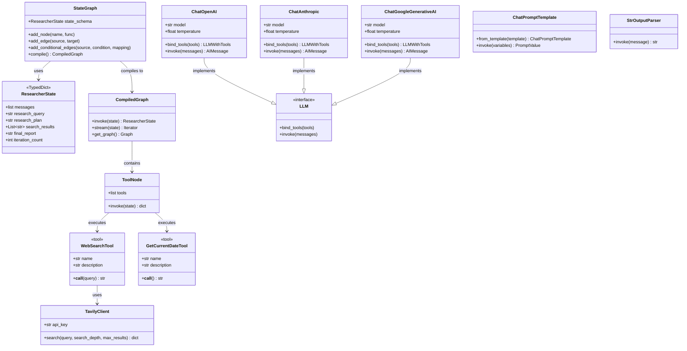
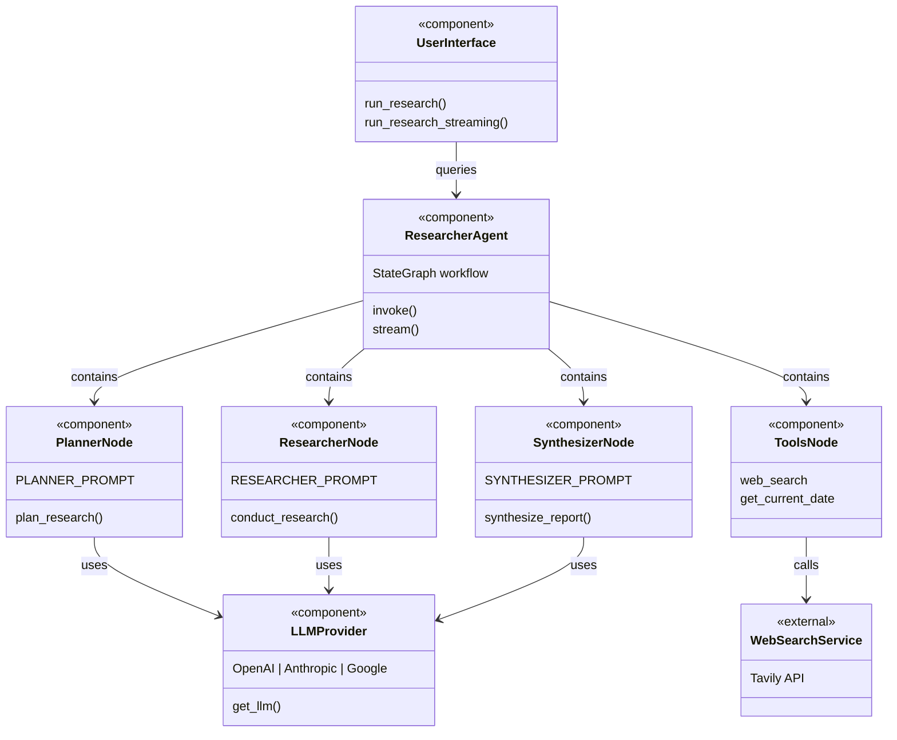
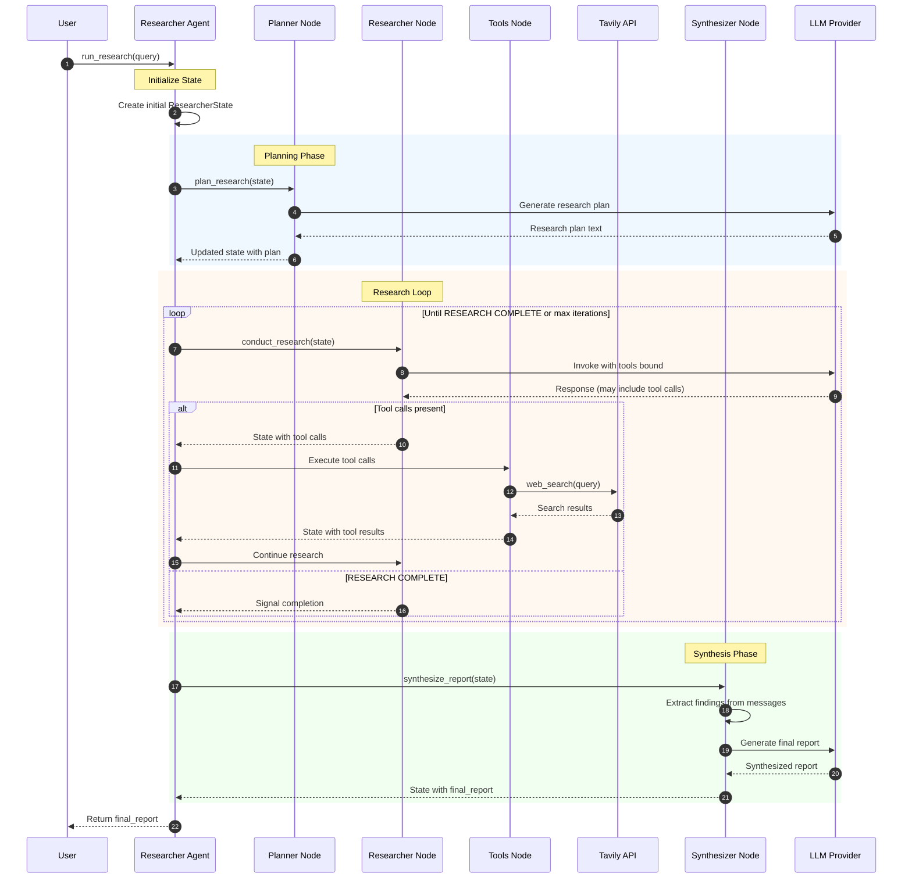
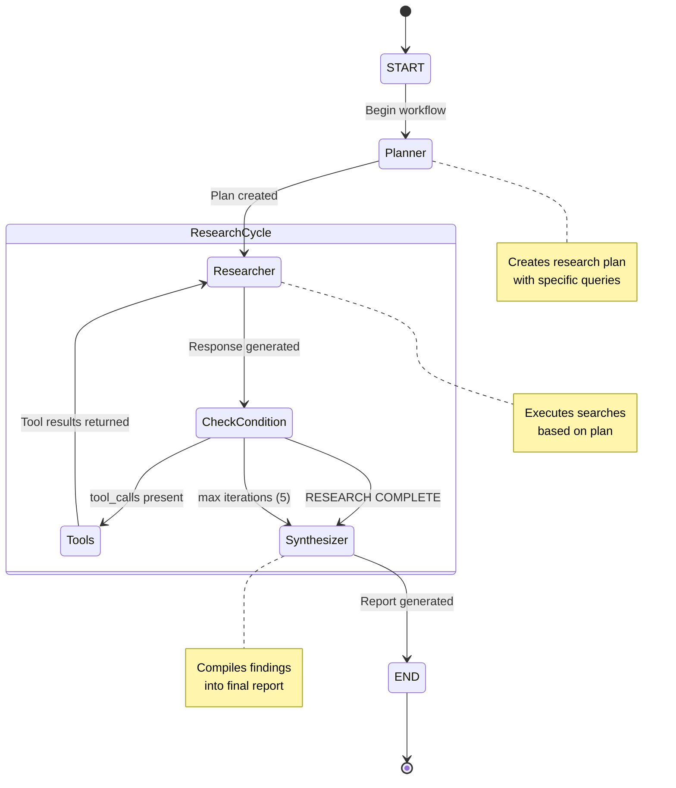
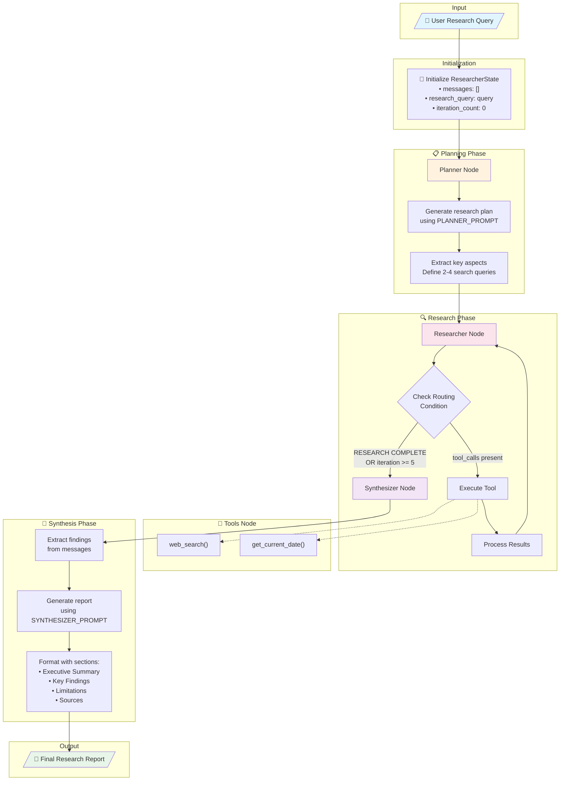
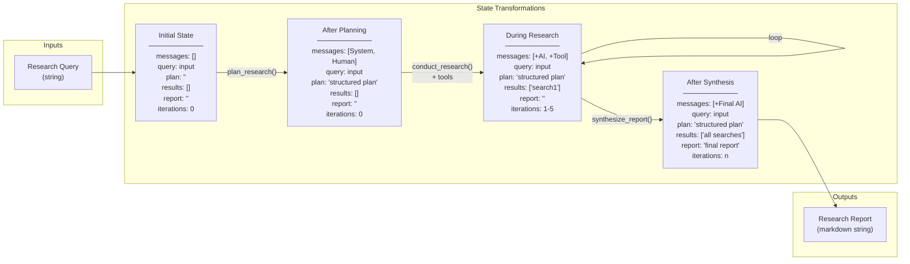
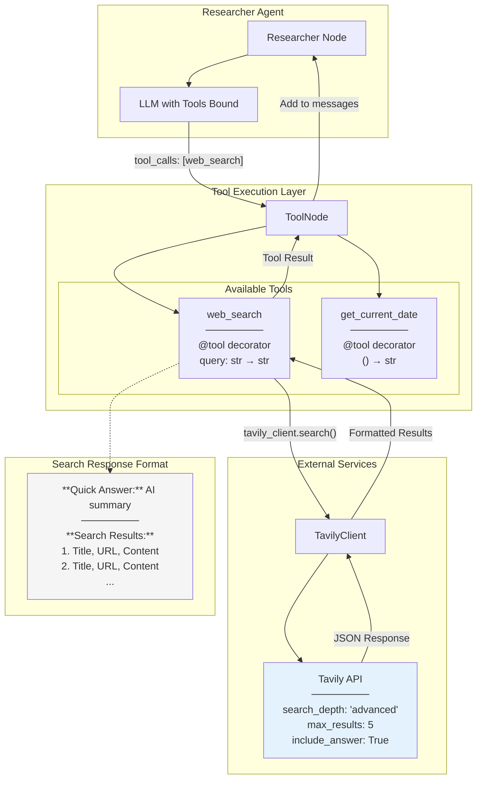
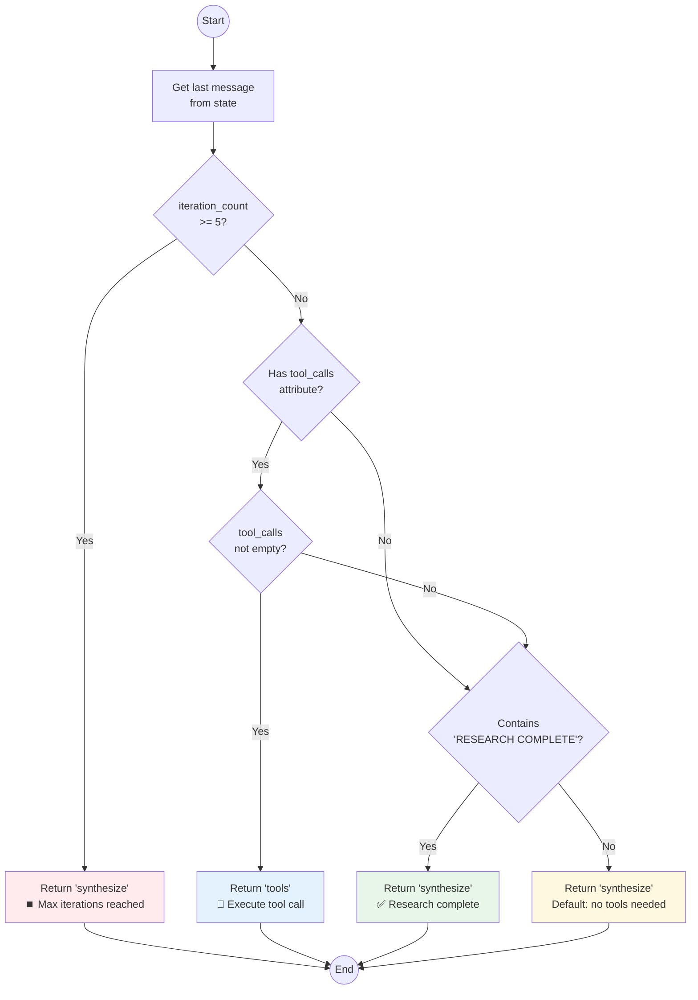

# 🔬 Researcher Agent with LangGraph - Architecture Documentation

This document provides comprehensive UML diagrams and flowcharts describing the architecture and workflow of the Researcher Agent implementation using LangGraph.

---

## Table of Contents

1. [Overview](#overview)
2. [Class Diagram](#class-diagram)
3. [Component Diagram](#component-diagram)
4. [Sequence Diagram](#sequence-diagram)
5. [State Machine Diagram](#state-machine-diagram)
6. [Workflow Flowchart](#workflow-flowchart)
7. [Data Flow Diagram](#data-flow-diagram)
8. [Tool Interaction Diagram](#tool-interaction-diagram)

---

## Overview

The Researcher Agent is an intelligent system built using LangGraph and LangChain that:
- Accepts natural language research queries
- Creates structured research plans
- Searches the web for relevant information
- Synthesizes findings into comprehensive research reports

The agent uses a graph-based workflow with multiple specialized nodes that collaborate to produce high-quality research outputs.

---

## Class Diagram

This diagram shows the main classes, their attributes, methods, and relationships within the Researcher Agent system.

### Description

The class diagram illustrates the core components of the Researcher Agent:

- **ResearcherState**: A TypedDict that maintains the agent's state throughout execution, including messages, query, plan, results, and iteration tracking.
- **StateGraph**: The LangGraph workflow builder that defines nodes and edges for the agent graph.
- **CompiledGraph**: The executable version of the state graph that can be invoked or streamed.
- **LLM Providers**: Three interchangeable LLM implementations (OpenAI, Anthropic, Google) that share a common interface.
- **Tools**: Specialized functions (`web_search`, `get_current_date`) that the agent can call during research.
- **TavilyClient**: The web search client that provides real-time internet search capabilities.

---

## Component Diagram

This diagram shows the high-level components and their dependencies.

### Description

The component diagram shows how the Researcher Agent is organized into modular components:

- **UserInterface**: Entry point functions for executing research queries
- **ResearcherAgent**: The main orchestrator containing all workflow nodes
- **PlannerNode**: Responsible for analyzing queries and creating research plans
- **ResearcherNode**: Executes the research plan using available tools
- **SynthesizerNode**: Compiles findings into coherent reports
- **ToolsNode**: Container for executable tools (web search, date retrieval)
- **LLMProvider**: Abstraction layer for LLM selection and initialization
- **WebSearchService**: External Tavily API integration

---

## Sequence Diagram

This diagram shows the temporal flow of a research query through the system.

### Description

The sequence diagram illustrates the complete lifecycle of a research query:

1. **Initialization**: User submits a query, agent creates initial state
2. **Planning Phase**: The planner node analyzes the query and generates a structured research plan with specific search queries
3. **Research Loop**: The researcher node iteratively:
   - Decides whether to search or synthesize
   - Executes web searches via the Tools node
   - Accumulates findings in the message history
   - Continues until "RESEARCH COMPLETE" or max iterations reached
4. **Synthesis Phase**: The synthesizer compiles all findings into a professional report
5. **Return**: Final report is returned to the user

---

## State Machine Diagram

This diagram shows the states and transitions of the Researcher Agent workflow.

### Description

The state machine diagram shows the possible states and transitions:

- **START**: Initial entry point
- **Planner**: Creates the research strategy
- **Researcher**: Core research execution state
- **CheckCondition**: Decision point for routing
- **Tools**: Tool execution state
- **Synthesizer**: Report generation state
- **END**: Terminal state

Transitions are governed by:
- Presence of tool calls in the LLM response
- Detection of "RESEARCH COMPLETE" signal
- Maximum iteration count (5) reached

---

## Workflow Flowchart

This diagram provides a detailed view of the decision logic and data flow.

### Description

The workflow flowchart provides a comprehensive view of the agent's execution:

1. **Input**: User provides a natural language research query
2. **Initialization**: State object is created with default values
3. **Planning Phase**: 
   - Analyzes the query
   - Identifies key aspects to investigate
   - Generates 2-4 specific search queries
4. **Research Phase**:
   - Iteratively executes searches
   - Routes based on tool calls or completion signals
   - Maximum 5 iterations as safety limit
5. **Tools Node**: Executes web searches via Tavily
6. **Synthesis Phase**:
   - Extracts findings from message history
   - Generates structured report with sections
7. **Output**: Returns the final research report

---

## Data Flow Diagram

This diagram shows how data transforms as it flows through the system.

### Description

The data flow diagram traces how the `ResearcherState` evolves:

1. **Initial State**: Empty state with only the research query populated
2. **After Planning**: State gains a research plan and initial messages (system prompt + human query)
3. **During Research**: Messages accumulate AI responses and tool results; iteration counter increases
4. **After Synthesis**: Final report is generated and stored in state

Key data transformations:
- Query → Research Plan (via LLM)
- Plan → Search Results (via Tavily)
- Search Results → Synthesized Report (via LLM)

---

## Tool Interaction Diagram

This diagram details the tool execution flow and Tavily API interaction.

### Description

The tool interaction diagram shows how tools are invoked and executed:

1. **LLM Decision**: The LLM decides to call a tool and includes tool_calls in its response
2. **ToolNode Processing**: LangGraph's ToolNode receives the tool call request
3. **Tool Execution**: The appropriate tool function is invoked:
   - `web_search`: Calls Tavily API with advanced search depth
   - `get_current_date`: Returns current timestamp
4. **Response Formatting**: Search results are formatted into a readable string
5. **State Update**: Results are added to the message history

### Tavily API Parameters:
- `search_depth`: "advanced" for comprehensive results
- `max_results`: 5 results per query
- `include_answer`: True for AI-generated quick answers
- `include_raw_content`: False to reduce response size

---

## Routing Decision Flowchart

This diagram details the conditional routing logic in the research phase.

### Description

The routing decision flowchart shows the `should_continue_research()` logic:

1. **Check Iteration Limit**: If 5 or more iterations, force synthesis
2. **Check Tool Calls**: If the LLM's response contains tool calls, route to tools
3. **Check Completion Signal**: If "RESEARCH COMPLETE" is in the response, proceed to synthesis
4. **Default**: If none of the above, default to synthesis

This ensures:
- Research doesn't run indefinitely (max 5 iterations)
- Tool calls are properly executed
- Agent can signal when it has enough information
- Graceful fallback to synthesis when uncertain

---

## Summary

This documentation covers the complete architecture of the Researcher Agent:

| Diagram Type | Purpose |
|-------------|---------|
| Class Diagram | Shows data structures and their relationships |
| Component Diagram | High-level system organization |
| Sequence Diagram | Temporal flow of operations |
| State Machine | Workflow states and transitions |
| Workflow Flowchart | Detailed execution logic |
| Data Flow | State transformations |
| Tool Interaction | External API integration |
| Routing Decision | Conditional logic details |

### Key Architecture Decisions

1. **Graph-based Workflow**: LangGraph enables clear separation of concerns and conditional routing
2. **Multi-provider LLM**: Abstraction allows switching between OpenAI, Anthropic, and Google
3. **Tool-augmented Research**: Web search provides real-time information retrieval
4. **Iterative Research Loop**: Agent can conduct multiple searches before synthesizing
5. **Structured State**: TypedDict provides type safety and clear data contracts
6. **Streaming Support**: Real-time output for better user experience

### Extension Points

- Add more tools (academic search, document analysis)
- Implement memory for multi-session research
- Add citation verification and fact-checking
- Create web interface with Gradio/Streamlit
- Integrate additional LLM providers
