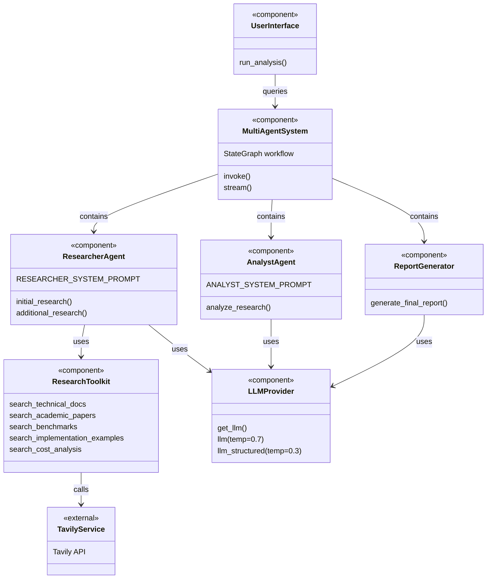
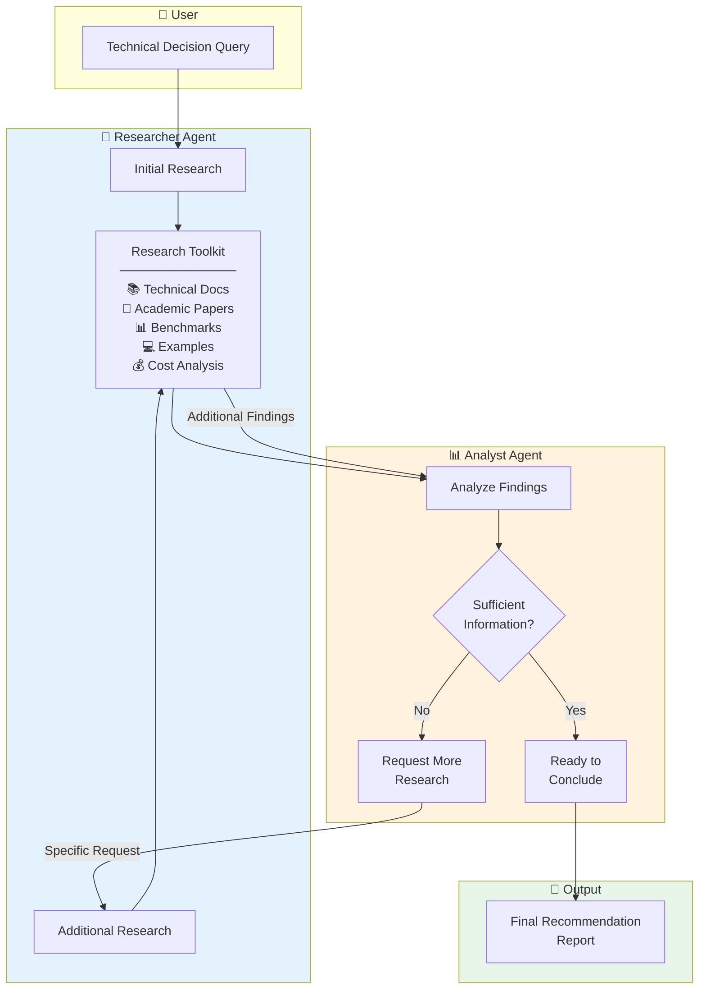
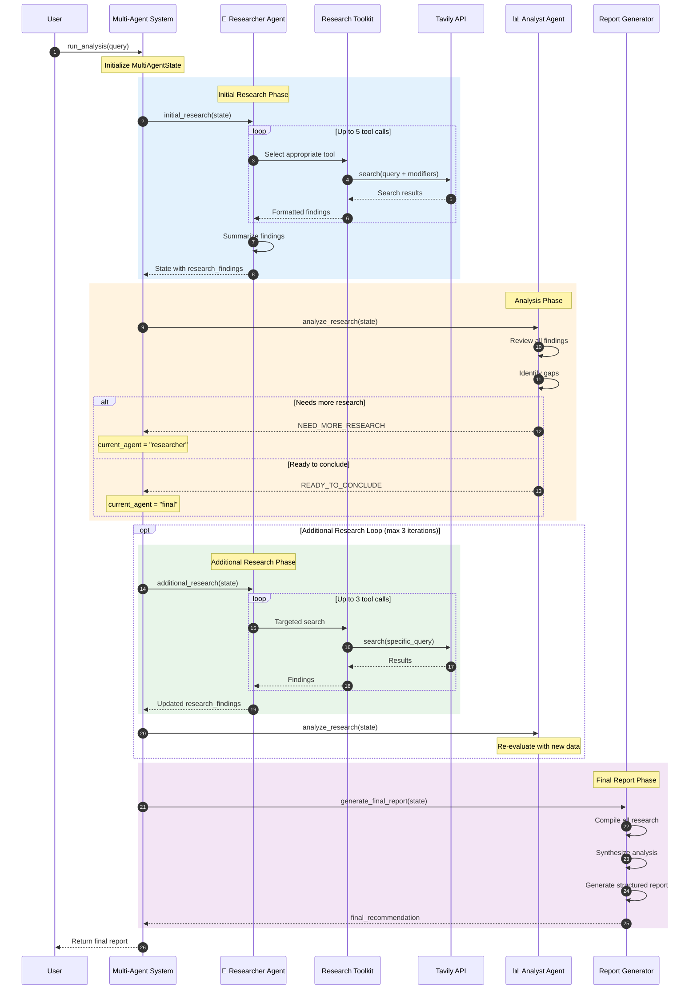
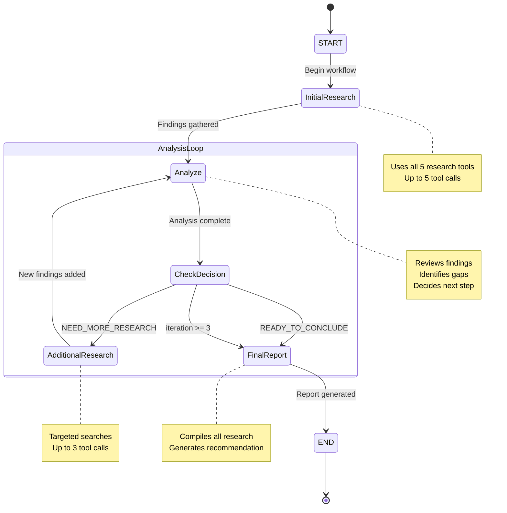
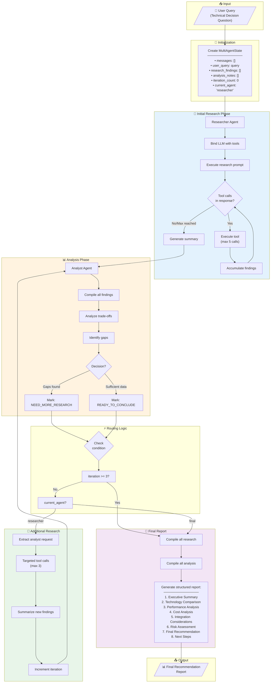
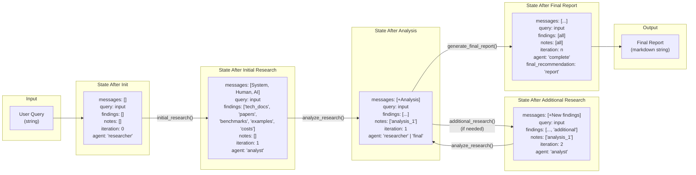
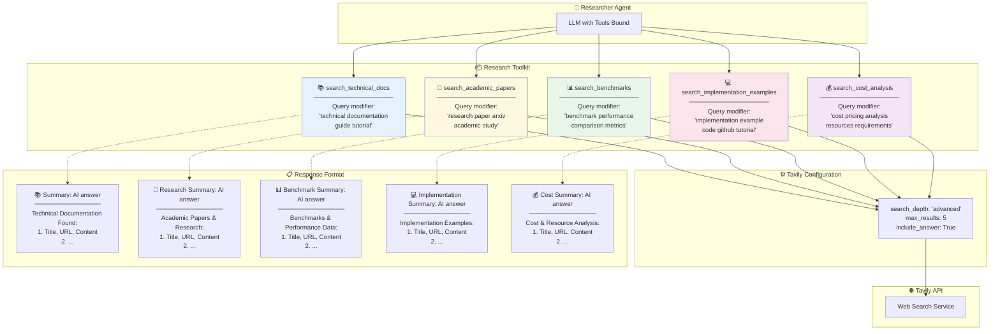
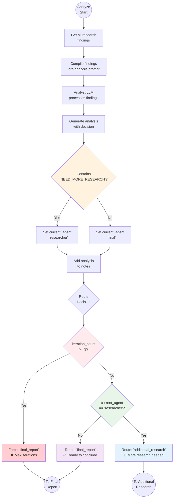
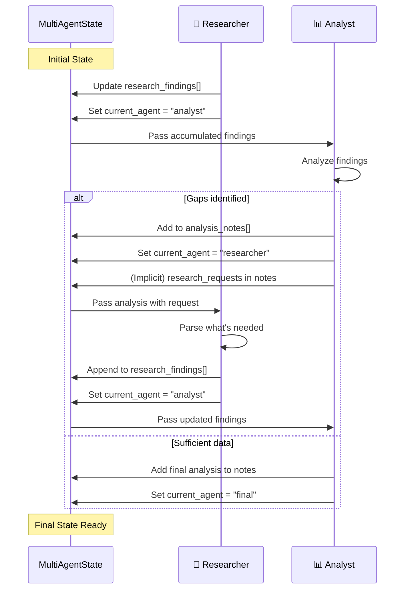

# 🔬📊 Multi-Agent Research & Analysis System - Architecture Documentation

This document provides comprehensive UML diagrams and flowcharts describing the architecture and workflow of the Multi-Agent Research & Analysis System using LangGraph, featuring collaborative Researcher and Analyst agents.

---

## Table of Contents

1. [Overview](#overview)
2. [Class Diagram](#class-diagram)
3. [Component Diagram](#component-diagram)
4. [Agent Interaction Diagram](#agent-interaction-diagram)
5. [Sequence Diagram](#sequence-diagram)
6. [State Machine Diagram](#state-machine-diagram)
7. [Workflow Flowchart](#workflow-flowchart)
8. [Data Flow Diagram](#data-flow-diagram)
9. [Tool Architecture Diagram](#tool-architecture-diagram)
10. [Iterative Loop Flowchart](#iterative-loop-flowchart)

---

## Overview

The Multi-Agent Research & Analysis System is a collaborative AI system featuring two specialized agents:

| Agent | Role | Capabilities |
|-------|------|--------------|
| 🔬 **Researcher Agent** | Information Gathering | Search docs, papers, benchmarks, examples, costs |
| 📊 **Analyst Agent** | Critical Analysis | Compare trade-offs, assess costs, identify challenges, recommend |

The system uses an iterative workflow where the Analyst can request additional research until sufficient information is gathered to make a well-supported recommendation.

---

## Class Diagram

This diagram shows all classes, their attributes, methods, and relationships within the multi-agent system.

```mermaid
classDiagram
    class MultiAgentState {
        <<TypedDict>>
        +list messages
        +str user_query
        +List~str~ research_findings
        +List~str~ analysis_notes
        +List~str~ research_requests
        +int iteration_count
        +str current_agent
        +str final_recommendation
    }

    class AgentAction {
        <<Enum>>
        +NEED_MORE_RESEARCH
        +READY_TO_CONCLUDE
    }

    class ResearchRequest {
        <<BaseModel>>
        +str request_type
        +str specific_query
        +str reason
    }

    class StateGraph {
        +MultiAgentState state_schema
        +add_node(name, func)
        +add_edge(source, target)
        +add_conditional_edges(source, condition, mapping)
        +compile() CompiledGraph
    }

    class CompiledGraph {
        +invoke(state) MultiAgentState
        +stream(state) Iterator
        +get_graph() Graph
    }

    class ChatOpenAI {
        +str model
        +float temperature
        +bind_tools(tools) LLMWithTools
        +invoke(messages) AIMessage
    }

    class ChatAnthropic {
        +str model
        +float temperature
        +bind_tools(tools) LLMWithTools
        +invoke(messages) AIMessage
    }

    class ChatGoogleGenerativeAI {
        +str model
        +float temperature
        +bind_tools(tools) LLMWithTools
        +invoke(messages) AIMessage
    }

    class TavilyClient {
        +str api_key
        +search(query, search_depth, max_results) dict
    }

    class SearchTechnicalDocs {
        <<tool>>
        +name: "search_technical_docs"
        +__call__(query) str
    }

    class SearchAcademicPapers {
        <<tool>>
        +name: "search_academic_papers"
        +__call__(query) str
    }

    class SearchBenchmarks {
        <<tool>>
        +name: "search_benchmarks"
        +__call__(query) str
    }

    class SearchImplementationExamples {
        <<tool>>
        +name: "search_implementation_examples"
        +__call__(query) str
    }

    class SearchCostAnalysis {
        <<tool>>
        +name: "search_cost_analysis"
        +__call__(query) str
    }

    class ToolNode {
        +list tools
        +invoke(state) dict
    }

    StateGraph --> MultiAgentState : uses
    StateGraph --> CompiledGraph : compiles to
    MultiAgentState --> AgentAction : tracks
    MultiAgentState --> ResearchRequest : contains

    ChatOpenAI --|> LLM : implements
    ChatAnthropic --|> LLM : implements
    ChatGoogleGenerativeAI --|> LLM : implements

    class LLM {
        <<interface>>
        +bind_tools(tools)
        +invoke(messages)
    }

    SearchTechnicalDocs --> TavilyClient : uses
    SearchAcademicPapers --> TavilyClient : uses
    SearchBenchmarks --> TavilyClient : uses
    SearchImplementationExamples --> TavilyClient : uses
    SearchCostAnalysis --> TavilyClient : uses

    ToolNode --> SearchTechnicalDocs : executes
    ToolNode --> SearchAcademicPapers : executes
    ToolNode --> SearchBenchmarks : executes
    ToolNode --> SearchImplementationExamples : executes
    ToolNode --> SearchCostAnalysis : executes
```

### Description

The class diagram illustrates the core components:

- **MultiAgentState**: Extended state tracking conversation, findings, analysis notes, and current agent
- **AgentAction**: Enum defining possible analyst decisions (need more research vs ready to conclude)
- **ResearchRequest**: Pydantic model for structured research requests from analyst
- **Five Specialized Tools**: Each tool targets a specific type of information search
- **LLM Providers**: Interchangeable implementations (OpenAI, Anthropic, Google)
- **TavilyClient**: Shared web search client used by all research tools

---

## Component Diagram

This diagram shows the high-level system architecture and component relationships.

### Description

The component diagram shows the modular organization:

- **UserInterface**: Entry point for running analysis queries
- **MultiAgentSystem**: Main orchestrator managing the workflow graph
- **ResearcherAgent**: Handles initial and additional research phases
- **AnalystAgent**: Reviews research, identifies gaps, makes decisions
- **ReportGenerator**: Creates the final comprehensive recommendation
- **ResearchToolkit**: Collection of 5 specialized search tools
- **LLMProvider**: Dual LLM configuration (standard + structured output)
- **TavilyService**: External API for web searches

---

## Agent Interaction Diagram

This diagram illustrates how the two agents collaborate and communicate.

### Description

The agent interaction diagram shows the collaborative workflow:

1. **User Query** flows to the Researcher Agent
2. **Researcher** gathers initial information using the toolkit
3. **Analyst** reviews findings and determines if sufficient
4. **Iterative Loop**: Analyst requests specific additional research if needed
5. **Final Output**: Comprehensive recommendation when Analyst is satisfied

---

## Sequence Diagram

This diagram shows the complete temporal flow including iterative cycles.

### Description

The sequence diagram shows the complete lifecycle:

1. **Initialization**: System creates MultiAgentState with user query
2. **Initial Research** (blue): Researcher uses up to 5 tool calls to gather comprehensive information
3. **Analysis** (orange): Analyst reviews findings and decides next action
4. **Additional Research** (green, optional): If gaps identified, Researcher conducts targeted searches
5. **Iterative Loop**: Analysis and additional research can repeat up to 3 times
6. **Final Report** (purple): All findings compiled into comprehensive recommendation

---

## State Machine Diagram

This diagram shows all possible states and transitions in the workflow.

### Description

The state machine shows:

- **START**: Entry point
- **InitialResearch**: Comprehensive information gathering
- **Analyze**: Analyst evaluation state
- **CheckDecision**: Decision point based on analyst's assessment
- **AdditionalResearch**: Targeted follow-up research
- **FinalReport**: Report generation state
- **END**: Terminal state

Key transitions:
- `NEED_MORE_RESEARCH` triggers additional research loop
- `READY_TO_CONCLUDE` proceeds to final report
- Maximum 3 iterations enforced as safety limit

---

## Workflow Flowchart

This diagram provides a detailed view of the complete workflow logic.

### Description

The workflow flowchart shows:

1. **Input**: User provides a technical decision query
2. **Initialization**: MultiAgentState created with all tracking fields
3. **Initial Research**: Comprehensive gathering using all 5 tools
4. **Analysis**: Analyst evaluates and decides on next action
5. **Routing**: Conditional logic for iteration limits and agent decisions
6. **Additional Research**: Targeted searches to fill identified gaps
7. **Final Report**: Structured recommendation with 8 sections

---

## Data Flow Diagram

This diagram shows how data transforms through the system.

### Description

The data flow diagram traces how `MultiAgentState` evolves:

1. **After Init**: Empty state with only query populated
2. **After Initial Research**: Findings populated from 5 tool types, agent switches to analyst
3. **After Analysis**: Analysis notes added, agent may switch back to researcher or to final
4. **After Additional Research**: New findings appended, iteration incremented
5. **After Final Report**: Complete state with final_recommendation

---

## Tool Architecture Diagram

This diagram details the research toolkit and how each tool specializes.

### Description

The tool architecture shows the 5 specialized research tools:

| Tool | Purpose | Query Modifiers |
|------|---------|-----------------|
| `search_technical_docs` | Official docs, guides | "technical documentation guide tutorial" |
| `search_academic_papers` | Research, studies | "research paper arxiv academic study" |
| `search_benchmarks` | Performance metrics | "benchmark performance comparison metrics" |
| `search_implementation_examples` | Code samples | "implementation example code github" |
| `search_cost_analysis` | Pricing, resources | "cost pricing analysis resources" |

All tools share:
- Tavily advanced search depth
- 5 results maximum
- AI-generated answer included

---

## Iterative Loop Flowchart

This diagram details the analyst decision logic and iteration control.

### Description

The iterative loop flowchart shows the analyst's decision process:

1. **Compile Findings**: Gather all research data
2. **LLM Analysis**: Analyst evaluates trade-offs and gaps
3. **Decision Detection**: Check for "NEED_MORE_RESEARCH" in response
4. **State Update**: Set `current_agent` based on decision
5. **Iteration Check**: Enforce maximum 3 iterations
6. **Routing**: Direct to additional research or final report

Safety mechanisms:
- Maximum 3 research-analysis cycles
- Clear decision keywords for routing
- Graceful fallback to final report

---

## Agent Communication Protocol

This diagram shows how agents communicate through state.

### Description

Agents communicate indirectly through state:

- **Researcher → Analyst**: Via `research_findings` list
- **Analyst → Researcher**: Via `analysis_notes` (containing research requests)
- **Coordination**: Via `current_agent` field

This decoupled design enables:
- Clear separation of concerns
- Traceable communication history
- Easy extension with additional agents

---

## Summary

This documentation covers the complete architecture of the Multi-Agent Research & Analysis System:

| Diagram Type | Purpose |
|-------------|---------|
| Class Diagram | Data structures and type relationships |
| Component Diagram | High-level system organization |
| Agent Interaction | Collaboration between agents |
| Sequence Diagram | Complete temporal flow with iterations |
| State Machine | All states and valid transitions |
| Workflow Flowchart | Detailed execution logic |
| Data Flow | State transformations through phases |
| Tool Architecture | Specialized research tool details |
| Iterative Loop | Analyst decision and routing logic |
| Communication Protocol | Inter-agent state-based messaging |

### Key Architecture Decisions

1. **Dual-Agent Design**: Separation of research (information gathering) and analysis (critical evaluation)
2. **Specialized Tools**: 5 tools targeting different information types for comprehensive coverage
3. **Iterative Refinement**: Analyst can request additional research to fill gaps
4. **State-Based Communication**: Agents communicate through shared state rather than direct messaging
5. **Bounded Iteration**: Maximum 3 cycles prevents infinite loops
6. **Dual LLM Configuration**: Standard temperature for creativity, lower temperature for structured outputs

### Use Cases

- Technology adoption decisions (e.g., GraphRAG vs Traditional RAG)
- Framework comparison (e.g., LangChain vs LlamaIndex)
- Infrastructure selection (e.g., Vector database comparison)
- Any technical decision requiring research and analysis

### Extension Points

- Add more specialized search tools (e.g., GitHub code search, patent search)
- Implement memory for multi-session research projects
- Add fact-checking/verification agent
- Create domain-specific analyst variants
- Integrate with internal knowledge bases
- Add confidence scoring to recommendations
