# 🔄 Task-Driven Load Distribution Pattern - Architecture Documentation

This document provides comprehensive UML diagrams, flowcharts, and detailed discussion of the Task-Driven Load Distribution design pattern for multi-agent workflows using LangGraph.

---

## Table of Contents

1. [Overview](#overview)
2. [Design Pattern Analysis](#design-pattern-analysis)
3. [Class Diagram](#class-diagram)
4. [Component Diagram](#component-diagram)
5. [Task Queue Architecture](#task-queue-architecture)
6. [Sequence Diagram - Complete Workflow](#sequence-diagram---complete-workflow)
7. [Orchestrator Agent Flowchart](#orchestrator-agent-flowchart)
8. [Worker Agent Flowchart](#worker-agent-flowchart)
9. [Routing Logic Flowchart](#routing-logic-flowchart)
10. [State Transition Diagram](#state-transition-diagram)
11. [Data Flow Diagram](#data-flow-diagram)
12. [Detailed Design Discussion](#detailed-design-discussion)
13. [Architecture Decisions](#architecture-decisions)
14. [Future Work](#future-work)

---

## Overview

The **Task-Driven Load Distribution** pattern implements a producer-consumer architecture where:
- An **Orchestrator Agent** (producer) creates tasks and pushes them to a shared queue
- **Worker Agents** (consumers) pop tasks from the queue and execute them
- A **Result Aggregator** synthesizes all results into a final report

### System Architecture

```
┌──────────────────────────────────────────────────────────────────────────┐
│                    TASK-DRIVEN LOAD DISTRIBUTION                         │
├──────────────────────────────────────────────────────────────────────────┤
│                                                                          │
│  ┌─────────────────┐        push         ┌─────────────────┐            │
│  │  ORCHESTRATOR   │ ──────────────────► │   TASK QUEUE    │            │
│  │     AGENT       │                     │                 │            │
│  └─────────────────┘                     └────────┬────────┘            │
│                                                   │ pop                  │
│                    ┌──────────────────────────────┼───────────────┐      │
│                    ▼                              ▼               ▼      │
│           ┌─────────────┐              ┌─────────────┐    ┌─────────────┐│
│           │  Worker 1   │              │  Worker 2   │    │  Worker N   ││
│           └──────┬──────┘              └──────┬──────┘    └──────┬──────┘│
│                  └────────────────────────────┼──────────────────┘       │
│                                               ▼                          │
│                                    ┌─────────────────┐                   │
│                                    │ Result Aggregator│                  │
│                                    └─────────────────┘                   │
└──────────────────────────────────────────────────────────────────────────┘
```

### Key Benefits

| Benefit | Description |
|---------|-------------|
| **Decoupling** | Orchestrator and workers communicate only through the queue |
| **Scalability** | Add more workers without changing orchestrator logic |
| **Load Balancing** | Tasks distributed on first-come, first-served basis |
| **Fault Isolation** | Worker failures don't affect other workers |
| **Observability** | Clear task lifecycle tracking |

---

## Design Pattern Analysis

### Producer-Consumer Pattern

The implementation follows the classic producer-consumer pattern with these characteristics:

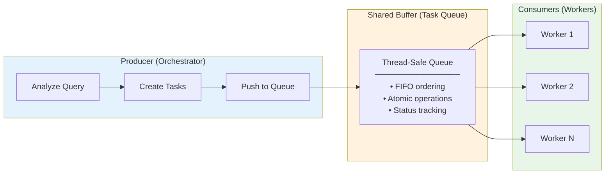
```mermaid
flowchart LR
    subgraph Producer["Producer (Orchestrator)"]
        P1["Analyze Query"]
        P2["Create Tasks"]
        P3["Push to Queue"]
        P1 --> P2 --> P3
    end

    subgraph Buffer["Shared Buffer (Task Queue)"]
        Q["Thread-Safe Queue<br/>───────────────<br/>• FIFO ordering<br/>• Atomic operations<br/>• Status tracking"]
    end

    subgraph Consumers["Consumers (Workers)"]
        C1["Worker 1"]
        C2["Worker 2"]
        C3["Worker N"]
    end

    P3 --> Q
    Q --> C1
    Q --> C2
    Q --> C3

    style Producer fill:#e3f2fd
    style Buffer fill:#fff3e0
    style Consumers fill:#e8f5e9
```

### Pattern Characteristics

| Characteristic | Implementation |
|----------------|----------------|
| **Synchronization** | Thread-safe Queue with Lock |
| **Ordering** | FIFO (First-In, First-Out) |
| **Blocking** | Non-blocking (get_nowait) |
| **Capacity** | Unbounded |
| **Multiple Consumers** | Yes, configurable |

---

## Class Diagram

This diagram shows all classes, their attributes, methods, and relationships.

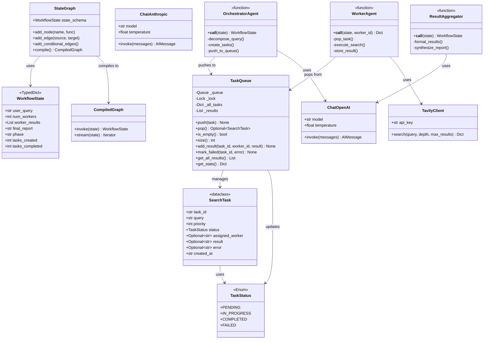
```mermaid
classDiagram
    class TaskStatus {
        <<Enum>>
        +PENDING
        +IN_PROGRESS
        +COMPLETED
        +FAILED
    }

    class SearchTask {
        <<dataclass>>
        +str task_id
        +str query
        +int priority
        +TaskStatus status
        +Optional~str~ assigned_worker
        +Optional~str~ result
        +Optional~str~ error
        +str created_at
    }

    class TaskQueue {
        -Queue _queue
        -Lock _lock
        -Dict _all_tasks
        -List _results
        +push(task) None
        +pop() Optional~SearchTask~
        +is_empty() bool
        +size() int
        +add_result(task_id, worker_id, result) None
        +mark_failed(task_id, error) None
        +get_all_results() List
        +get_stats() Dict
    }

    class WorkflowState {
        <<TypedDict>>
        +str user_query
        +int num_workers
        +List worker_results
        +str final_report
        +str phase
        +int tasks_created
        +int tasks_completed
    }

    class StateGraph {
        +WorkflowState state_schema
        +add_node(name, func)
        +add_edge(source, target)
        +add_conditional_edges()
        +compile() CompiledGraph
    }

    class CompiledGraph {
        +invoke(state) WorkflowState
        +stream(state) Iterator
    }

    class TavilyClient {
        +str api_key
        +search(query, depth, max_results) Dict
    }

    class ChatOpenAI {
        +str model
        +float temperature
        +invoke(messages) AIMessage
    }

    class ChatAnthropic {
        +str model
        +float temperature
        +invoke(messages) AIMessage
    }

    SearchTask --> TaskStatus : uses
    TaskQueue --> SearchTask : manages
    TaskQueue --> TaskStatus : updates
    StateGraph --> WorkflowState : uses
    StateGraph --> CompiledGraph : compiles to

    class OrchestratorAgent {
        <<function>>
        +__call__(state) WorkflowState
        -decompose_query()
        -create_tasks()
        -push_to_queue()
    }

    class WorkerAgent {
        <<function>>
        +__call__(state, worker_id) Dict
        -pop_task()
        -execute_search()
        -store_result()
    }

    class ResultAggregator {
        <<function>>
        +__call__(state) WorkflowState
        -format_results()
        -synthesize_report()
    }

    OrchestratorAgent --> TaskQueue : pushes to
    OrchestratorAgent --> ChatOpenAI : uses
    WorkerAgent --> TaskQueue : pops from
    WorkerAgent --> TavilyClient : uses
    ResultAggregator --> ChatOpenAI : uses
```

### Class Descriptions

| Class | Responsibility |
|-------|----------------|
| **TaskStatus** | Enum defining task lifecycle states |
| **SearchTask** | Dataclass representing a single search task |
| **TaskQueue** | Thread-safe queue with push/pop and result tracking |
| **WorkflowState** | TypedDict for LangGraph state management |
| **OrchestratorAgent** | Creates and distributes tasks |
| **WorkerAgent** | Executes individual search tasks |
| **ResultAggregator** | Synthesizes results into final report |

---

## Component Diagram

High-level system organization showing component interactions.

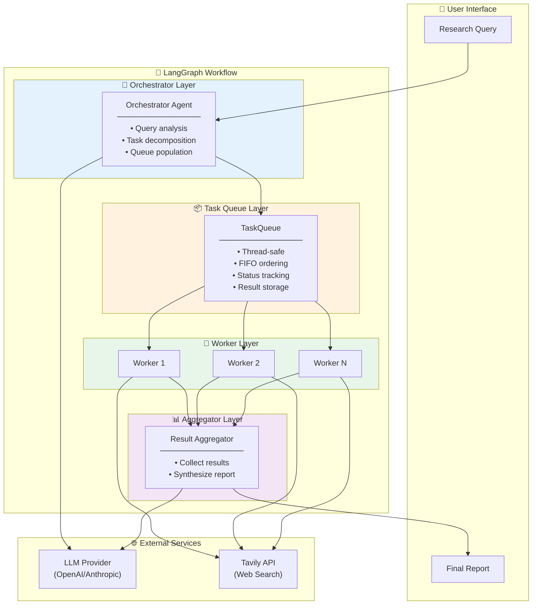
```mermaid
flowchart TB
    subgraph UserInterface["👤 User Interface"]
        INPUT["Research Query"]
        OUTPUT["Final Report"]
    end

    subgraph LangGraphWorkflow["🔄 LangGraph Workflow"]
        subgraph OrchestratorLayer["🎯 Orchestrator Layer"]
            ORCH["Orchestrator Agent<br/>───────────────<br/>• Query analysis<br/>• Task decomposition<br/>• Queue population"]
        end

        subgraph QueueLayer["📦 Task Queue Layer"]
            QUEUE["TaskQueue<br/>───────────────<br/>• Thread-safe<br/>• FIFO ordering<br/>• Status tracking<br/>• Result storage"]
        end

        subgraph WorkerLayer["👷 Worker Layer"]
            W1["Worker 1"]
            W2["Worker 2"]
            W3["Worker N"]
        end

        subgraph AggregatorLayer["📊 Aggregator Layer"]
            AGG["Result Aggregator<br/>───────────────<br/>• Collect results<br/>• Synthesize report"]
        end
    end

    subgraph ExternalServices["🌐 External Services"]
        LLM["LLM Provider<br/>(OpenAI/Anthropic)"]
        TAVILY["Tavily API<br/>(Web Search)"]
    end

    INPUT --> ORCH
    ORCH --> QUEUE
    QUEUE --> W1 & W2 & W3
    W1 & W2 & W3 --> AGG
    AGG --> OUTPUT

    ORCH --> LLM
    W1 & W2 & W3 --> TAVILY
    AGG --> LLM

    style OrchestratorLayer fill:#e3f2fd
    style QueueLayer fill:#fff3e0
    style WorkerLayer fill:#e8f5e9
    style AggregatorLayer fill:#f3e5f5
```

---

## Task Queue Architecture

Detailed view of the TaskQueue implementation.

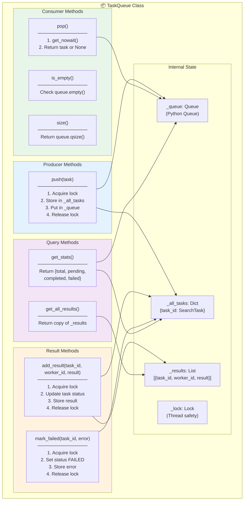
```mermaid
flowchart TD
    subgraph TaskQueueClass["📦 TaskQueue Class"]
        subgraph InternalState["Internal State"]
            Q["_queue: Queue<br/>(Python Queue)"]
            LOCK["_lock: Lock<br/>(Thread safety)"]
            TASKS["_all_tasks: Dict<br/>{task_id: SearchTask}"]
            RESULTS["_results: List<br/>[{task_id, worker_id, result}]"]
        end

        subgraph ProducerMethods["Producer Methods"]
            PUSH["push(task)<br/>───────────────<br/>1. Acquire lock<br/>2. Store in _all_tasks<br/>3. Put in _queue<br/>4. Release lock"]
        end

        subgraph ConsumerMethods["Consumer Methods"]
            POP["pop()<br/>───────────────<br/>1. get_nowait()<br/>2. Return task or None"]
            EMPTY["is_empty()<br/>───────────────<br/>Check queue.empty()"]
            SIZE["size()<br/>───────────────<br/>Return queue.qsize()"]
        end

        subgraph ResultMethods["Result Methods"]
            ADD_RES["add_result(task_id, worker_id, result)<br/>───────────────<br/>1. Acquire lock<br/>2. Update task status<br/>3. Store result<br/>4. Release lock"]
            MARK_FAIL["mark_failed(task_id, error)<br/>───────────────<br/>1. Acquire lock<br/>2. Set status FAILED<br/>3. Store error<br/>4. Release lock"]
        end

        subgraph QueryMethods["Query Methods"]
            GET_RES["get_all_results()<br/>───────────────<br/>Return copy of _results"]
            GET_STATS["get_stats()<br/>───────────────<br/>Return {total, pending,<br/>completed, failed}"]
        end
    end

    PUSH --> Q & TASKS
    POP --> Q
    ADD_RES --> TASKS & RESULTS
    MARK_FAIL --> TASKS
    GET_RES --> RESULTS
    GET_STATS --> TASKS & Q

    style ProducerMethods fill:#e3f2fd
    style ConsumerMethods fill:#e8f5e9
    style ResultMethods fill:#fff3e0
    style QueryMethods fill:#f3e5f5
```

### Thread Safety Analysis

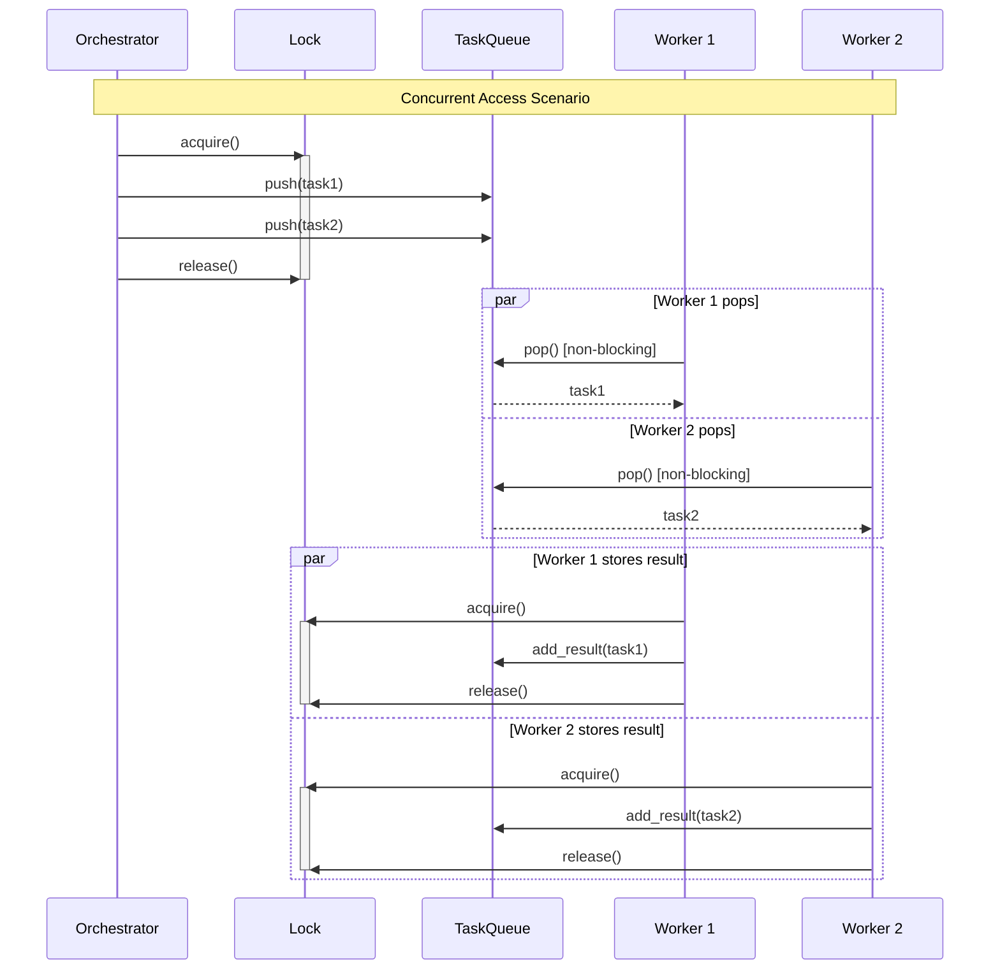
```mermaid
sequenceDiagram
    participant O as Orchestrator
    participant L as Lock
    participant Q as TaskQueue
    participant W1 as Worker 1
    participant W2 as Worker 2

    Note over O,W2: Concurrent Access Scenario

    O->>L: acquire()
    activate L
    O->>Q: push(task1)
    O->>Q: push(task2)
    O->>L: release()
    deactivate L

    par Worker 1 pops
        W1->>Q: pop() [non-blocking]
        Q-->>W1: task1
    and Worker 2 pops
        W2->>Q: pop() [non-blocking]
        Q-->>W2: task2
    end

    par Worker 1 stores result
        W1->>L: acquire()
        activate L
        W1->>Q: add_result(task1)
        W1->>L: release()
        deactivate L
    and Worker 2 stores result
        W2->>L: acquire()
        activate L
        W2->>Q: add_result(task2)
        W2->>L: release()
        deactivate L
    end
```

---

## Sequence Diagram - Complete Workflow

This diagram shows the full execution flow from user query to final report.

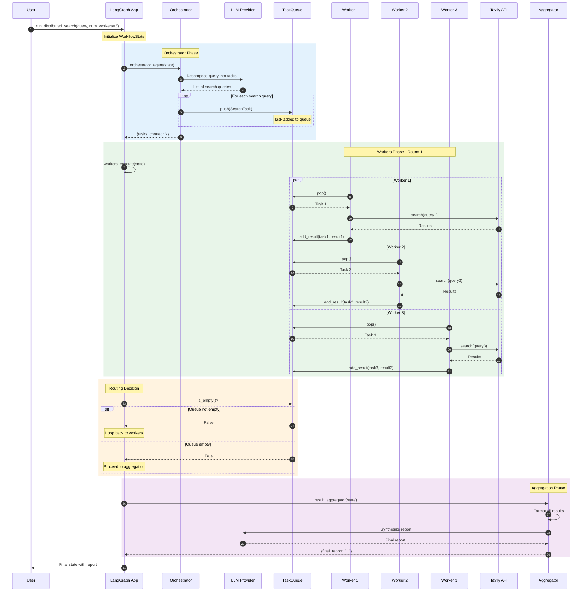
```mermaid
sequenceDiagram
    autonumber
    participant User
    participant App as LangGraph App
    participant Orch as Orchestrator
    participant LLM as LLM Provider
    participant Queue as TaskQueue
    participant W1 as Worker 1
    participant W2 as Worker 2
    participant W3 as Worker 3
    participant Tavily as Tavily API
    participant Agg as Aggregator

    User->>App: run_distributed_search(query, num_workers=3)
    
    Note over App: Initialize WorkflowState

    rect rgb(227, 242, 253)
        Note over Orch: Orchestrator Phase
        App->>Orch: orchestrator_agent(state)
        Orch->>LLM: Decompose query into tasks
        LLM-->>Orch: List of search queries
        
        loop For each search query
            Orch->>Queue: push(SearchTask)
            Note over Queue: Task added to queue
        end
        
        Orch-->>App: {tasks_created: N}
    end

    rect rgb(232, 245, 233)
        Note over W1,W3: Workers Phase - Round 1
        App->>App: workers_execute(state)
        
        par Worker 1
            W1->>Queue: pop()
            Queue-->>W1: Task 1
            W1->>Tavily: search(query1)
            Tavily-->>W1: Results
            W1->>Queue: add_result(task1, result1)
        and Worker 2
            W2->>Queue: pop()
            Queue-->>W2: Task 2
            W2->>Tavily: search(query2)
            Tavily-->>W2: Results
            W2->>Queue: add_result(task2, result2)
        and Worker 3
            W3->>Queue: pop()
            Queue-->>W3: Task 3
            W3->>Tavily: search(query3)
            Tavily-->>W3: Results
            W3->>Queue: add_result(task3, result3)
        end
    end

    rect rgb(255, 243, 224)
        Note over App: Routing Decision
        App->>Queue: is_empty()?
        
        alt Queue not empty
            Queue-->>App: False
            Note over App: Loop back to workers
        else Queue empty
            Queue-->>App: True
            Note over App: Proceed to aggregation
        end
    end

    rect rgb(243, 229, 245)
        Note over Agg: Aggregation Phase
        App->>Agg: result_aggregator(state)
        Agg->>Agg: Format all results
        Agg->>LLM: Synthesize report
        LLM-->>Agg: Final report
        Agg-->>App: {final_report: "..."}
    end

    App-->>User: Final state with report
```

---

## Orchestrator Agent Flowchart

Detailed logic of the orchestrator agent.

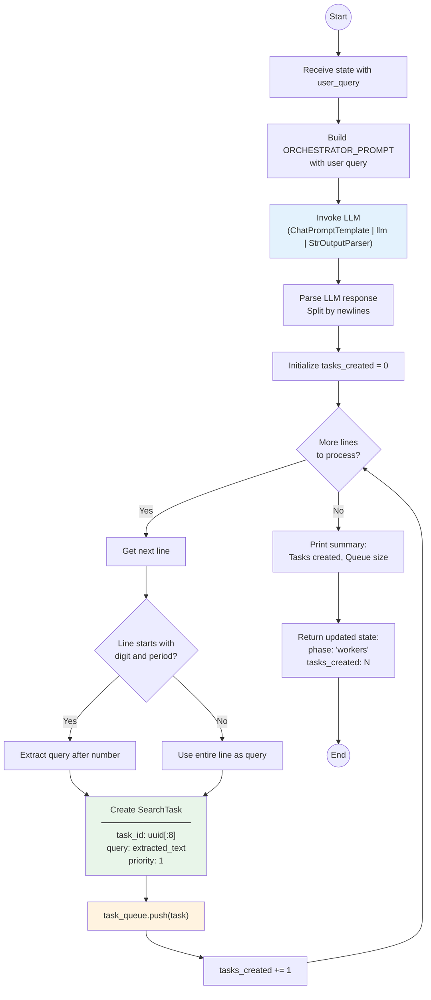
```mermaid
flowchart TD
    START((Start)) --> A["Receive state with user_query"]
    
    A --> B["Build ORCHESTRATOR_PROMPT<br/>with user query"]
    
    B --> C["Invoke LLM<br/>(ChatPromptTemplate | llm | StrOutputParser)"]
    
    C --> D["Parse LLM response<br/>Split by newlines"]
    
    D --> E["Initialize tasks_created = 0"]
    
    E --> F{"More lines<br/>to process?"}
    
    F -->|No| L["Print summary:<br/>Tasks created, Queue size"]
    
    F -->|Yes| G["Get next line"]
    
    G --> H{"Line starts with<br/>digit and period?"}
    
    H -->|Yes| I["Extract query after number"]
    H -->|No| J["Use entire line as query"]
    
    I --> K["Create SearchTask<br/>───────────────<br/>task_id: uuid[:8]<br/>query: extracted_text<br/>priority: 1"]
    J --> K
    
    K --> M["task_queue.push(task)"]
    
    M --> N["tasks_created += 1"]
    
    N --> F
    
    L --> O["Return updated state:<br/>phase: 'workers'<br/>tasks_created: N"]
    
    O --> END((End))

    style C fill:#e3f2fd
    style K fill:#e8f5e9
    style M fill:#fff3e0
```

---

## Worker Agent Flowchart

Detailed logic of worker task execution.

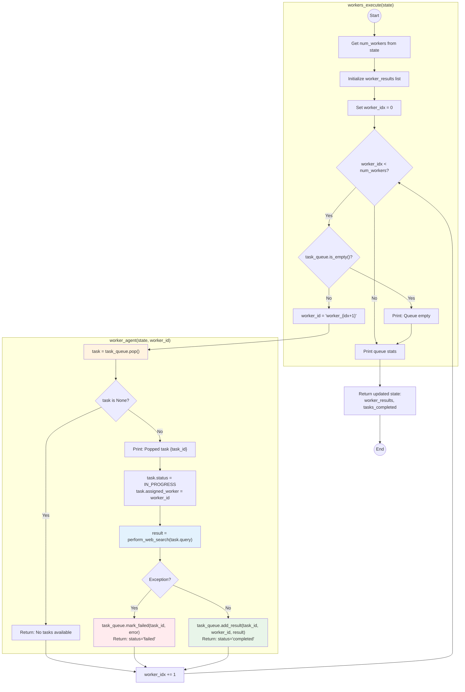
```mermaid
flowchart TD
    subgraph WorkersExecute["workers_execute(state)"]
        START((Start)) --> A["Get num_workers from state"]
        A --> B["Initialize worker_results list"]
        B --> C["Set worker_idx = 0"]
        
        C --> D{"worker_idx < num_workers?"}
        
        D -->|No| R["Print queue stats"]
        
        D -->|Yes| E{"task_queue.is_empty()?"}
        
        E -->|Yes| Q["Print: Queue empty"]
        Q --> R
        
        E -->|No| F["worker_id = 'worker_{idx+1}'"]
    end

    subgraph WorkerAgent["worker_agent(state, worker_id)"]
        F --> G["task = task_queue.pop()"]
        
        G --> H{"task is None?"}
        
        H -->|Yes| I["Return: No tasks available"]
        
        H -->|No| J["Print: Popped task {task_id}"]
        
        J --> K["task.status = IN_PROGRESS<br/>task.assigned_worker = worker_id"]
        
        K --> L["result = perform_web_search(task.query)"]
        
        L --> M{"Exception?"}
        
        M -->|Yes| N["task_queue.mark_failed(task_id, error)<br/>Return: status='failed'"]
        
        M -->|No| O["task_queue.add_result(task_id, worker_id, result)<br/>Return: status='completed'"]
    end

    I --> P["worker_idx += 1"]
    N --> P
    O --> P
    P --> D

    R --> S["Return updated state:<br/>worker_results, tasks_completed"]
    S --> END((End))

    style L fill:#e3f2fd
    style G fill:#fff3e0
    style O fill:#e8f5e9
    style N fill:#ffebee
```

---

## Routing Logic Flowchart

Conditional routing between workers and aggregator.

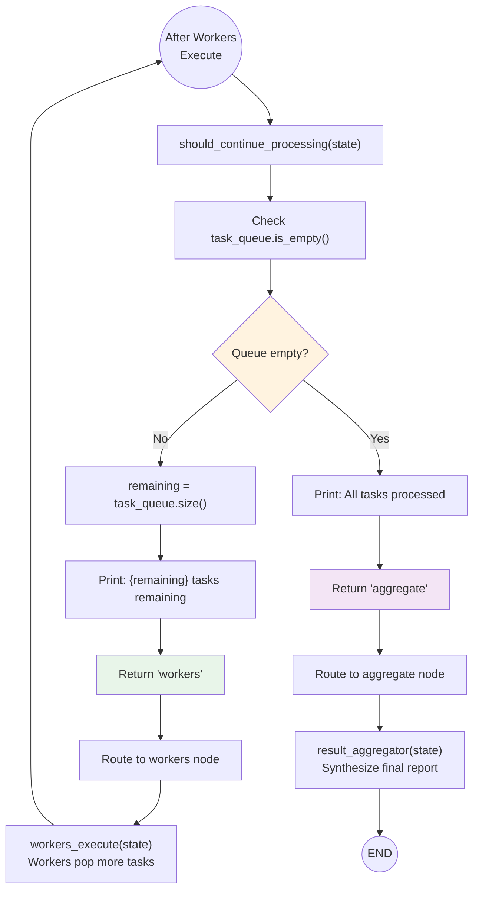
```mermaid
flowchart TD
    START((After Workers<br/>Execute)) --> A["should_continue_processing(state)"]
    
    A --> B["Check task_queue.is_empty()"]
    
    B --> C{"Queue empty?"}
    
    C -->|No| D["remaining = task_queue.size()"]
    D --> E["Print: {remaining} tasks remaining"]
    E --> F["Return 'workers'"]
    
    C -->|Yes| G["Print: All tasks processed"]
    G --> H["Return 'aggregate'"]
    
    F --> I["Route to workers node"]
    H --> J["Route to aggregate node"]
    
    I --> K["workers_execute(state)<br/>Workers pop more tasks"]
    J --> L["result_aggregator(state)<br/>Synthesize final report"]
    
    K --> START
    L --> END((END))

    style C fill:#fff3e0
    style F fill:#e8f5e9
    style H fill:#f3e5f5
```

---

## State Transition Diagram

All possible states and transitions in the workflow.

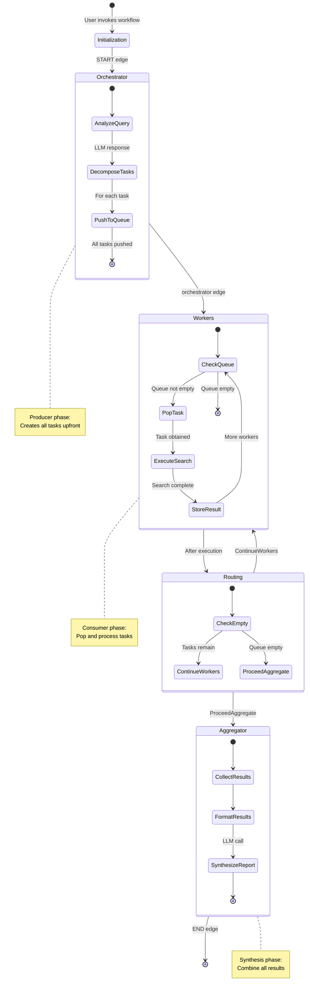
```mermaid
stateDiagram-v2
    [*] --> Initialization: User invokes workflow
    
    Initialization --> Orchestrator: START edge
    
    state Orchestrator {
        [*] --> AnalyzeQuery
        AnalyzeQuery --> DecomposeTasks: LLM response
        DecomposeTasks --> PushToQueue: For each task
        PushToQueue --> [*]: All tasks pushed
    }
    
    Orchestrator --> Workers: orchestrator edge
    
    state Workers {
        [*] --> CheckQueue
        CheckQueue --> PopTask: Queue not empty
        CheckQueue --> [*]: Queue empty
        PopTask --> ExecuteSearch: Task obtained
        ExecuteSearch --> StoreResult: Search complete
        StoreResult --> CheckQueue: More workers
    }
    
    Workers --> Routing: After execution
    
    state Routing {
        [*] --> CheckEmpty
        CheckEmpty --> ContinueWorkers: Tasks remain
        CheckEmpty --> ProceedAggregate: Queue empty
    }
    
    Routing --> Workers: ContinueWorkers
    Routing --> Aggregator: ProceedAggregate
    
    state Aggregator {
        [*] --> CollectResults
        CollectResults --> FormatResults
        FormatResults --> SynthesizeReport: LLM call
        SynthesizeReport --> [*]
    }
    
    Aggregator --> [*]: END edge
    
    note right of Orchestrator
        Producer phase:
        Creates all tasks upfront
    end note
    
    note right of Workers
        Consumer phase:
        Pop and process tasks
    end note
    
    note right of Aggregator
        Synthesis phase:
        Combine all results
    end note
```

---

## Data Flow Diagram

How data transforms through the system.


```mermaid
flowchart LR
    subgraph Input
        Q["User Query<br/>(string)"]
    end

    subgraph OrchestratorTransform["Orchestrator Transform"]
        T1["Query → LLM → Search Queries"]
        T2["Search Queries → SearchTask objects"]
    end

    subgraph QueueStorage["Queue Storage"]
        QS["SearchTask objects<br/>in FIFO queue"]
    end

    subgraph WorkerTransform["Worker Transform"]
        T3["SearchTask → Tavily API → Results"]
        T4["Results stored in queue"]
    end

    subgraph AggregatorTransform["Aggregator Transform"]
        T5["All Results → LLM → Report"]
    end

    subgraph Output
        R["Final Report<br/>(string)"]
    end

    Q --> T1 --> T2 --> QS
    QS --> T3 --> T4
    T4 --> T5 --> R

    style OrchestratorTransform fill:#e3f2fd
    style QueueStorage fill:#fff3e0
    style WorkerTransform fill:#e8f5e9
    style AggregatorTransform fill:#f3e5f5
```

### State Evolution

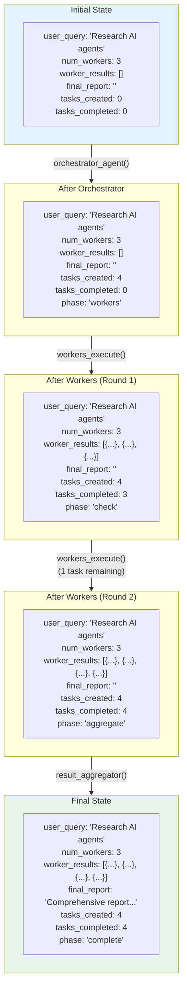
```mermaid
flowchart TD
    subgraph S1["Initial State"]
        I1["user_query: 'Research AI agents'<br/>num_workers: 3<br/>worker_results: []<br/>final_report: ''<br/>tasks_created: 0<br/>tasks_completed: 0"]
    end

    subgraph S2["After Orchestrator"]
        I2["user_query: 'Research AI agents'<br/>num_workers: 3<br/>worker_results: []<br/>final_report: ''<br/>tasks_created: 4<br/>tasks_completed: 0<br/>phase: 'workers'"]
    end

    subgraph S3["After Workers (Round 1)"]
        I3["user_query: 'Research AI agents'<br/>num_workers: 3<br/>worker_results: [{...}, {...}, {...}]<br/>final_report: ''<br/>tasks_created: 4<br/>tasks_completed: 3<br/>phase: 'check'"]
    end

    subgraph S4["After Workers (Round 2)"]
        I4["user_query: 'Research AI agents'<br/>num_workers: 3<br/>worker_results: [{...}, {...}, {...}, {...}]<br/>final_report: ''<br/>tasks_created: 4<br/>tasks_completed: 4<br/>phase: 'aggregate'"]
    end

    subgraph S5["Final State"]
        I5["user_query: 'Research AI agents'<br/>num_workers: 3<br/>worker_results: [{...}, {...}, {...}, {...}]<br/>final_report: 'Comprehensive report...'<br/>tasks_created: 4<br/>tasks_completed: 4<br/>phase: 'complete'"]
    end

    S1 -->|"orchestrator_agent()"| S2
    S2 -->|"workers_execute()"| S3
    S3 -->|"workers_execute()<br/>(1 task remaining)"| S4
    S4 -->|"result_aggregator()"| S5

    style S1 fill:#e3f2fd
    style S5 fill:#e8f5e9
```

---

## Detailed Design Discussion

### 1. Why Producer-Consumer Pattern?

The producer-consumer pattern was chosen for several reasons:

| Reason | Explanation |
|--------|-------------|
| **Decoupling** | Orchestrator doesn't need to know about workers |
| **Scalability** | Workers can be added/removed dynamically |
| **Load Balancing** | Natural distribution through queue |
| **Simplicity** | Well-understood pattern with clear semantics |

### 2. Task Queue Design Decisions

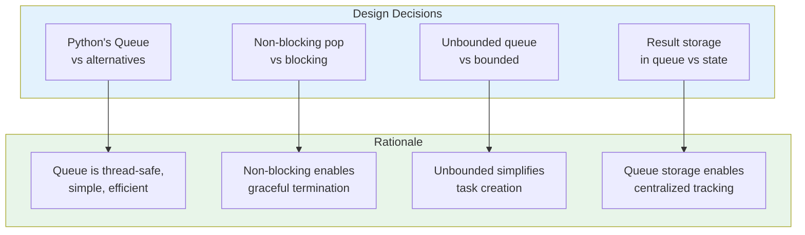
```mermaid
flowchart TD
    subgraph Decisions["Design Decisions"]
        D1["Python's Queue<br/>vs alternatives"]
        D2["Non-blocking pop<br/>vs blocking"]
        D3["Unbounded queue<br/>vs bounded"]
        D4["Result storage<br/>in queue vs state"]
    end

    subgraph Rationale["Rationale"]
        R1["Queue is thread-safe,<br/>simple, efficient"]
        R2["Non-blocking enables<br/>graceful termination"]
        R3["Unbounded simplifies<br/>task creation"]
        R4["Queue storage enables<br/>centralized tracking"]
    end

    D1 --> R1
    D2 --> R2
    D3 --> R3
    D4 --> R4

    style Decisions fill:#e3f2fd
    style Rationale fill:#e8f5e9
```

### 3. Worker Execution Model

The current implementation uses **sequential-within-round** execution:

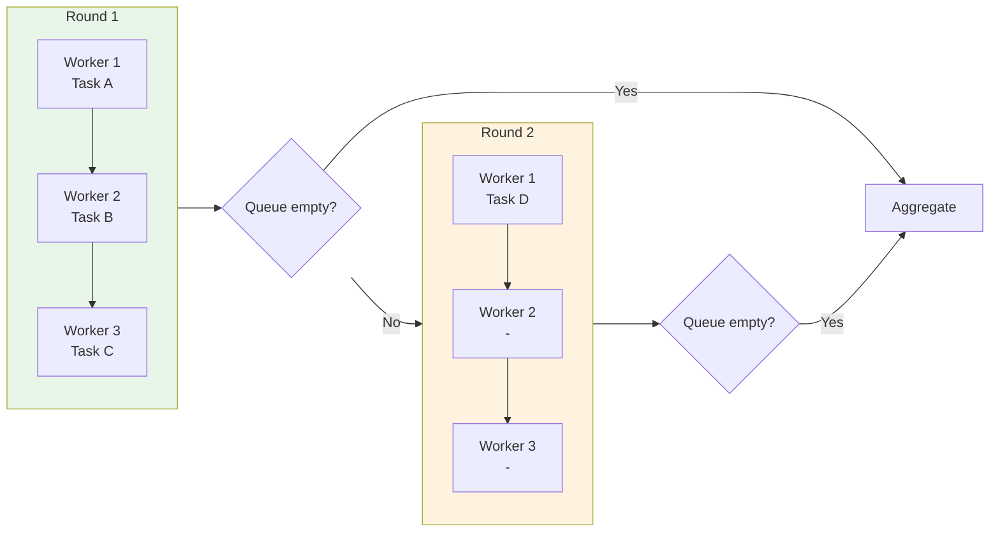
```mermaid
flowchart LR
    subgraph Round1["Round 1"]
        W1R1["Worker 1<br/>Task A"] --> W2R1["Worker 2<br/>Task B"] --> W3R1["Worker 3<br/>Task C"]
    end

    subgraph Round2["Round 2"]
        W1R2["Worker 1<br/>Task D"] --> W2R2["Worker 2<br/>-"] --> W3R2["Worker 3<br/>-"]
    end

    Round1 --> Check1{"Queue empty?"}
    Check1 -->|No| Round2
    Check1 -->|Yes| Done["Aggregate"]
    Round2 --> Check2{"Queue empty?"}
    Check2 -->|Yes| Done

    style Round1 fill:#e8f5e9
    style Round2 fill:#fff3e0
```

**Trade-offs:**
- ✅ Simple implementation
- ✅ Predictable execution order
- ❌ Not truly parallel (sequential within each round)
- ❌ Workers wait for each other

### 4. Error Handling Strategy

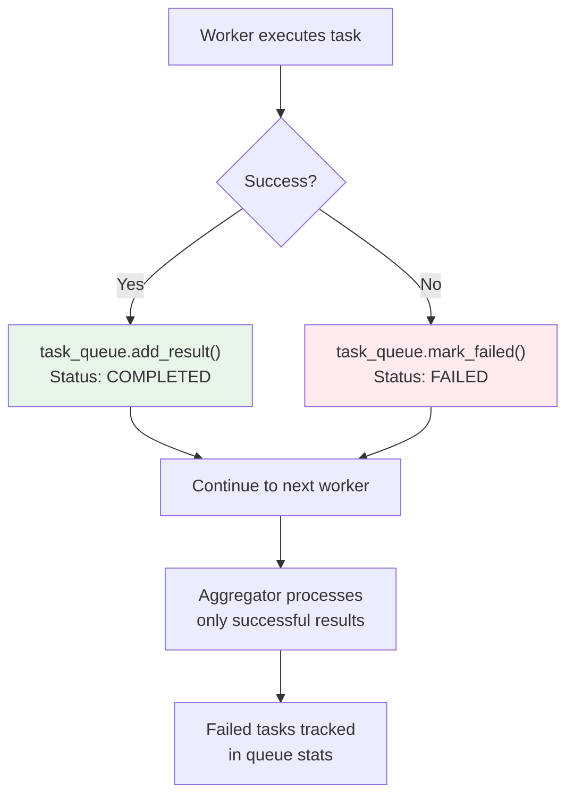
```mermaid
flowchart TD
    A["Worker executes task"] --> B{"Success?"}
    
    B -->|Yes| C["task_queue.add_result()<br/>Status: COMPLETED"]
    B -->|No| D["task_queue.mark_failed()<br/>Status: FAILED"]
    
    C --> E["Continue to next worker"]
    D --> E
    
    E --> F["Aggregator processes<br/>only successful results"]
    
    F --> G["Failed tasks tracked<br/>in queue stats"]

    style C fill:#e8f5e9
    style D fill:#ffebee
```

**Current Approach:**
- Failed tasks are marked but not retried
- Aggregator only uses successful results
- Statistics track failure count

---

## Architecture Decisions

### Decision Record

| Decision | Options Considered | Choice | Rationale |
|----------|-------------------|--------|-----------|
| **Queue Type** | List, deque, Queue | Queue | Thread-safe, blocking support |
| **Pop Behavior** | Blocking, non-blocking | Non-blocking | Graceful empty handling |
| **Task Storage** | State only, Queue only, Both | Both | Enables lifecycle tracking |
| **LLM Calls** | Parallel, Sequential | Sequential | Simpler, rate limit friendly |
| **Worker Count** | Fixed, Dynamic | Fixed (configurable) | Predictable behavior |

### Architectural Layers

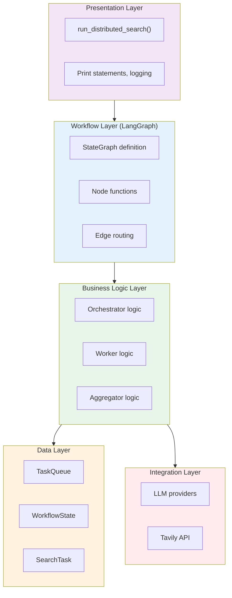
```mermaid
flowchart TB
    subgraph PresentationLayer["Presentation Layer"]
        RUN["run_distributed_search()"]
        PRINT["Print statements, logging"]
    end

    subgraph WorkflowLayer["Workflow Layer (LangGraph)"]
        GRAPH["StateGraph definition"]
        NODES["Node functions"]
        EDGES["Edge routing"]
    end

    subgraph BusinessLayer["Business Logic Layer"]
        ORCH["Orchestrator logic"]
        WORKER["Worker logic"]
        AGG["Aggregator logic"]
    end

    subgraph DataLayer["Data Layer"]
        QUEUE["TaskQueue"]
        STATE["WorkflowState"]
        TASK["SearchTask"]
    end

    subgraph IntegrationLayer["Integration Layer"]
        LLM["LLM providers"]
        SEARCH["Tavily API"]
    end

    PresentationLayer --> WorkflowLayer
    WorkflowLayer --> BusinessLayer
    BusinessLayer --> DataLayer
    BusinessLayer --> IntegrationLayer

    style PresentationLayer fill:#f3e5f5
    style WorkflowLayer fill:#e3f2fd
    style BusinessLayer fill:#e8f5e9
    style DataLayer fill:#fff3e0
    style IntegrationLayer fill:#ffebee
```

---

## Future Work

### 1. Priority Queue Implementation

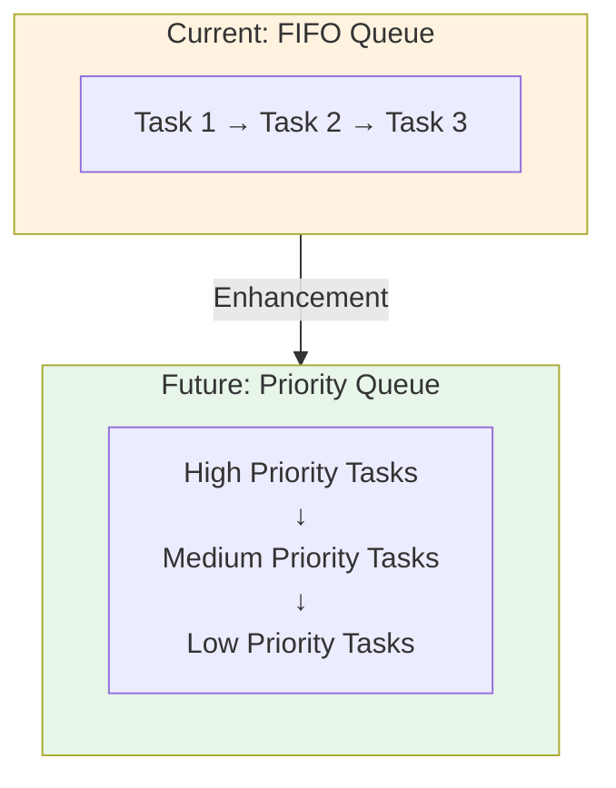
```mermaid
flowchart TD
    subgraph CurrentQueue["Current: FIFO Queue"]
        CQ["Task 1 → Task 2 → Task 3"]
    end

    subgraph PriorityQueue["Future: Priority Queue"]
        PQ["High Priority Tasks<br/>↓<br/>Medium Priority Tasks<br/>↓<br/>Low Priority Tasks"]
    end

    CurrentQueue -->|"Enhancement"| PriorityQueue

    style CurrentQueue fill:#fff3e0
    style PriorityQueue fill:#e8f5e9
```

**Implementation Ideas:**
- Use `heapq` or `PriorityQueue`
- Add priority field to SearchTask
- Orchestrator assigns priorities based on query analysis

### 2. Task Retry Mechanism

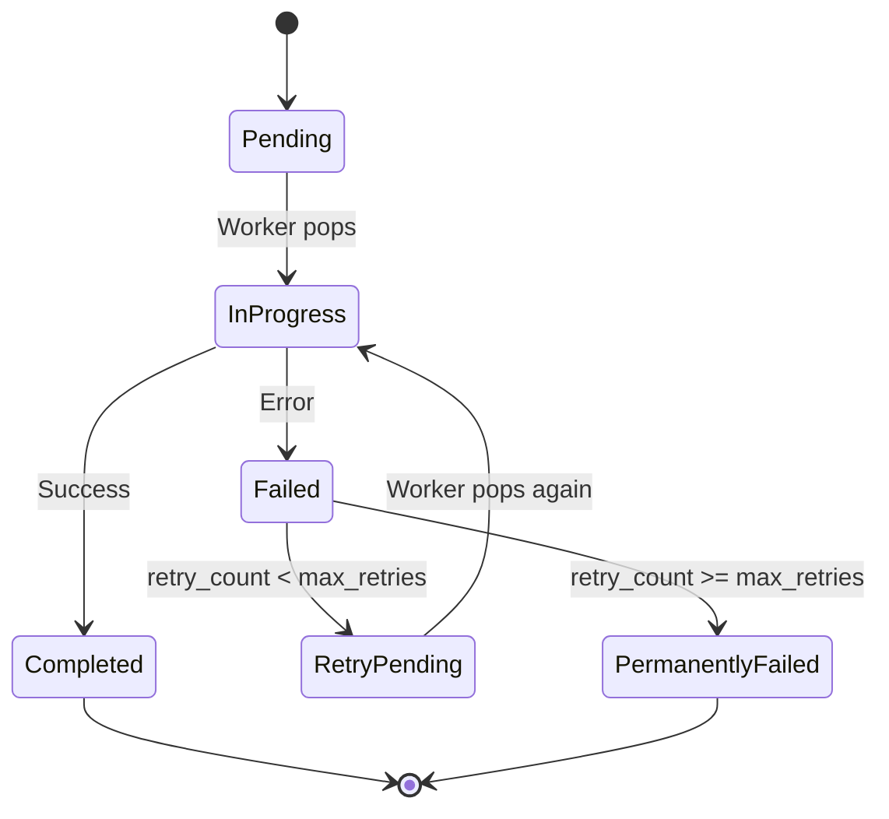
```mermaid
stateDiagram-v2
    [*] --> Pending
    Pending --> InProgress: Worker pops
    InProgress --> Completed: Success
    InProgress --> Failed: Error
    Failed --> RetryPending: retry_count < max_retries
    Failed --> PermanentlyFailed: retry_count >= max_retries
    RetryPending --> InProgress: Worker pops again
    Completed --> [*]
    PermanentlyFailed --> [*]
```

### 3. Async Parallel Execution

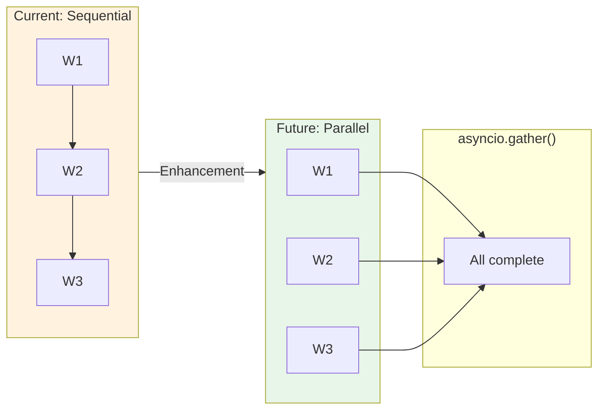
```mermaid
flowchart LR
    subgraph CurrentModel["Current: Sequential"]
        S1["W1"] --> S2["W2"] --> S3["W3"]
    end

    subgraph FutureModel["Future: Parallel"]
        P1["W1"]
        P2["W2"]
        P3["W3"]
    end

    subgraph AsyncGather["asyncio.gather()"]
        P1 & P2 & P3 --> GATHER["All complete"]
    end

    CurrentModel -->|"Enhancement"| FutureModel

    style CurrentModel fill:#fff3e0
    style FutureModel fill:#e8f5e9
```

### 4. Worker Health Monitoring

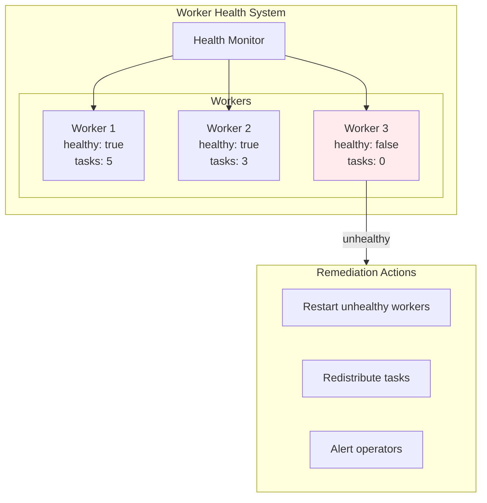
```mermaid
flowchart TD
    subgraph HealthSystem["Worker Health System"]
        HM["Health Monitor"]
        
        subgraph Workers["Workers"]
            W1["Worker 1<br/>healthy: true<br/>tasks: 5"]
            W2["Worker 2<br/>healthy: true<br/>tasks: 3"]
            W3["Worker 3<br/>healthy: false<br/>tasks: 0"]
        end
        
        HM --> W1 & W2 & W3
    end

    subgraph Actions["Remediation Actions"]
        A1["Restart unhealthy workers"]
        A2["Redistribute tasks"]
        A3["Alert operators"]
    end

    W3 -->|"unhealthy"| Actions

    style W3 fill:#ffebee
```

### 5. Task Type Specialization

```mermaid
flowchart TD
    subgraph TaskTypes["Task Types"]
        T1["SearchTask"]
        T2["AnalysisTask"]
        T3["SummaryTask"]
    end

    subgraph WorkerTypes["Specialized Workers"]
        SW1["Search Worker<br/>+ Tavily"]
        SW2["Analysis Worker<br/>+ LLM reasoning"]
        SW3["Summary Worker<br/>+ LLM synthesis"]
    end

    subgraph Routing["Type-Based Routing"]
        R["Router matches<br/>task type to worker type"]
    end

    TaskTypes --> R
    R --> WorkerTypes

    style TaskTypes fill:#e3f2fd
    style WorkerTypes fill:#e8f5e9
    style Routing fill:#fff3e0
```

### 6. Distributed Queue

```mermaid
flowchart TB
    subgraph Current["Current: In-Memory Queue"]
        IMQ["Python Queue<br/>Single process"]
    end

    subgraph Future["Future: Distributed Queue"]
        subgraph Options["Options"]
            REDIS["Redis Queue"]
            KAFKA["Apache Kafka"]
            SQS["AWS SQS"]
            RABBIT["RabbitMQ"]
        end
    end

    subgraph Benefits["Benefits"]
        B1["Multi-process support"]
        B2["Persistence"]
        B3["Horizontal scaling"]
        B4["Monitoring"]
    end

    Current -->|"Scale"| Future
    Future --> Benefits

    style Current fill:#fff3e0
    style Future fill:#e8f5e9
```

---

## Summary

### Pattern Overview

| Aspect | Implementation |
|--------|----------------|
| **Pattern** | Task-Driven Load Distribution (Producer-Consumer) |
| **Framework** | LangGraph with StateGraph |
| **Queue** | Thread-safe Python Queue |
| **Producer** | Orchestrator Agent (LLM-powered decomposition) |
| **Consumers** | Worker Agents (Tavily web search) |
| **Aggregator** | Result Synthesizer (LLM-powered) |

### Key Takeaways

1. **Separation of Concerns**: Each component has a single responsibility
2. **Queue as Communication**: Decouples orchestrator from workers
3. **Lifecycle Tracking**: Full visibility into task states
4. **Configurable Workers**: Easy to scale horizontally
5. **Extensible Design**: Clear paths for future enhancements

### Metrics to Monitor

| Metric | Description |
|--------|-------------|
| **Tasks Created** | Number of tasks from orchestrator |
| **Tasks Completed** | Successfully processed tasks |
| **Tasks Failed** | Tasks that encountered errors |
| **Queue Wait Time** | Time tasks spend in queue |
| **Worker Utilization** | Tasks per worker distribution |
| **End-to-End Latency** | Total workflow execution time |

---

## References

- [LangGraph Documentation](https://python.langchain.com/docs/langgraph)
- [Python Queue Module](https://docs.python.org/3/library/queue.html)
- [Producer-Consumer Pattern](https://en.wikipedia.org/wiki/Producer%E2%80%93consumer_problem)
- [Tavily API Documentation](https://tavily.com/docs)
