# 🏊 Worker Pool with Semaphore Pattern - Architecture Documentation

This document provides comprehensive UML diagrams, flowcharts, and detailed discussion of the Worker Pool with Semaphore design pattern for multi-agent workflows using LangGraph.

---

## Table of Contents

1. [Overview](#overview)
2. [Design Pattern Analysis](#design-pattern-analysis)
3. [Class Diagram](#class-diagram)
4. [Component Diagram](#component-diagram)
5. [Semaphore Mechanism](#semaphore-mechanism)
6. [Sequence Diagram - Complete Workflow](#sequence-diagram---complete-workflow)
7. [Worker Pool Execution Flowchart](#worker-pool-execution-flowchart)
8. [Semaphore Acquire/Release Flowchart](#semaphore-acquirerelease-flowchart)
9. [State Transition Diagram](#state-transition-diagram)
10. [Comparison: Task Queue vs Worker Pool](#comparison-task-queue-vs-worker-pool)
11. [Detailed Design Discussion](#detailed-design-discussion)
12. [Architecture Decisions](#architecture-decisions)
13. [Future Work](#future-work)

---

## Overview

The **Worker Pool with Semaphore** pattern implements a pool-based execution model where:
- An **Orchestrator Agent** creates all tasks upfront
- A **Semaphore** controls the maximum concurrent executions
- A **ThreadPoolExecutor** manages worker thread lifecycle
- Tasks execute in **true parallel** (up to the semaphore limit)

### System Architecture

```
┌──────────────────────────────────────────────────────────────────────────┐
│                    WORKER POOL WITH SEMAPHORE                            │
├──────────────────────────────────────────────────────────────────────────┤
│                                                                          │
│  ┌─────────────────┐                                                     │
│  │  ORCHESTRATOR   │ ──► Creates all tasks upfront                       │
│  └────────┬────────┘                                                     │
│           │ submit all tasks                                             │
│           ▼                                                              │
│  ┌─────────────────────────────────────────────────────┐                │
│  │              WORKER POOL                             │                │
│  │  ┌─────────────────────────────────────────────────┐│                │
│  │  │       🚦 SEMAPHORE (max_workers=N)              ││                │
│  │  │  ┌─────────┐  ┌─────────┐  ┌─────────┐         ││                │
│  │  │  │ Slot 1  │  │ Slot 2  │  │ Slot N  │         ││                │
│  │  │  │(active) │  │(active) │  │(waiting)│         ││                │
│  │  │  └─────────┘  └─────────┘  └─────────┘         ││                │
│  │  └─────────────────────────────────────────────────┘│                │
│  │  ┌─────────────────────────────────────────────────┐│                │
│  │  │         ThreadPoolExecutor                      ││                │
│  │  │  • Manages thread lifecycle                     ││                │
│  │  │  • Reuses threads                               ││                │
│  │  │  • Returns Future objects                       ││                │
│  │  └─────────────────────────────────────────────────┘│                │
│  └──────────────────────┬──────────────────────────────┘                │
│                         │ all futures complete                           │
│                         ▼                                                │
│                ┌─────────────────┐                                       │
│                │ Result Aggregator│                                      │
│                └─────────────────┘                                       │
└──────────────────────────────────────────────────────────────────────────┘
```

### Key Benefits

| Benefit | Description |
|---------|-------------|
| **True Parallelism** | Tasks execute concurrently, not round-robin |
| **Resource Control** | Semaphore limits concurrent resource usage |
| **Thread Reuse** | ThreadPoolExecutor manages thread lifecycle |
| **Automatic Blocking** | New tasks wait when pool is full |
| **Simpler Logic** | No explicit queue management or looping |

---

## Design Pattern Analysis

### Worker Pool Pattern

The Worker Pool pattern pre-creates a pool of worker threads that are reused for task execution:

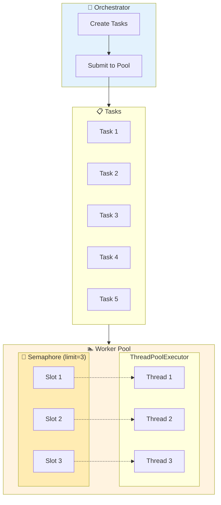

### Semaphore Pattern

A semaphore is a synchronization primitive that controls access to a shared resource:

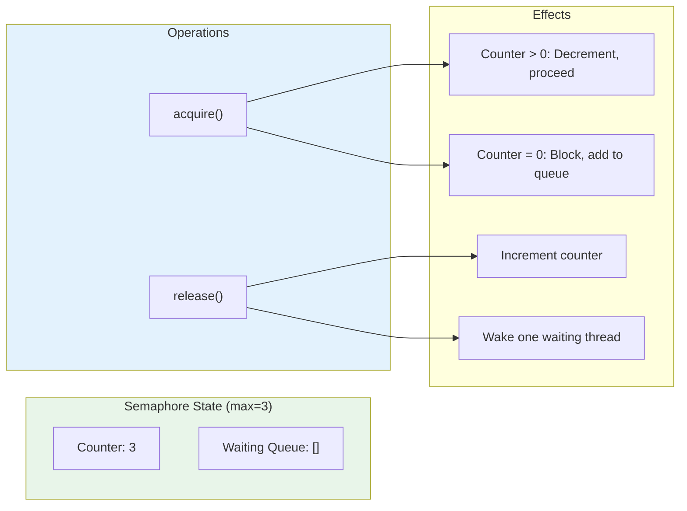

---

## Class Diagram

Complete UML class diagram showing all classes, attributes, methods, and relationships.

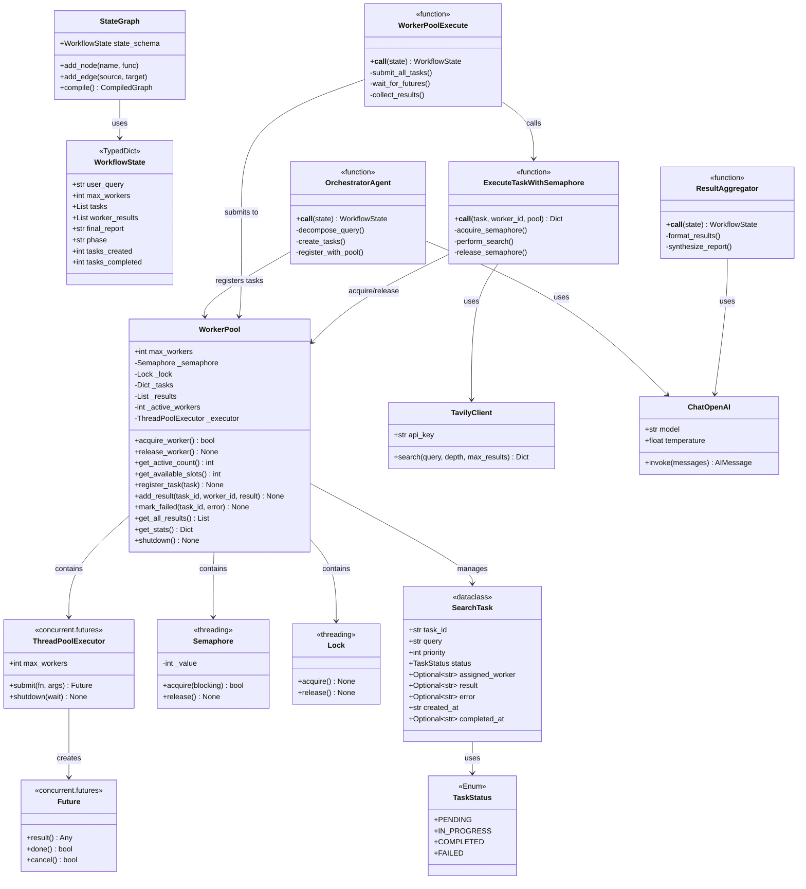

### Class Responsibilities

| Class | Responsibility |
|-------|----------------|
| **TaskStatus** | Enum for task lifecycle states |
| **SearchTask** | Dataclass representing a search task |
| **Semaphore** | Controls concurrent access to resources |
| **WorkerPool** | Manages workers, semaphore, and results |
| **ThreadPoolExecutor** | Manages thread lifecycle and task submission |
| **OrchestratorAgent** | Creates and registers all tasks |
| **ExecuteTaskWithSemaphore** | Executes task with semaphore protection |
| **ResultAggregator** | Synthesizes final report |

---

## Component Diagram

High-level system organization showing component interactions.

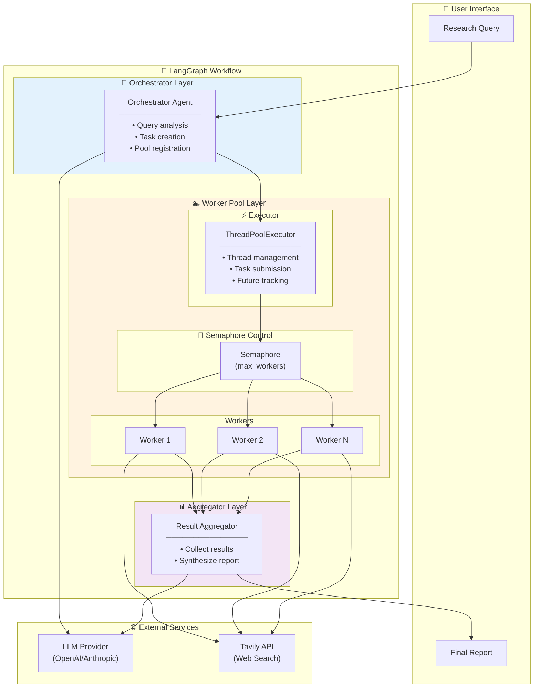

---

## Semaphore Mechanism

Detailed view of how the semaphore controls concurrent execution.

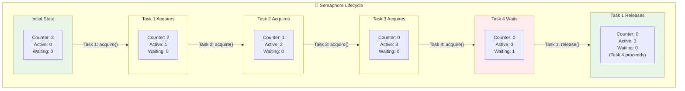

### Thread-Safety Analysis

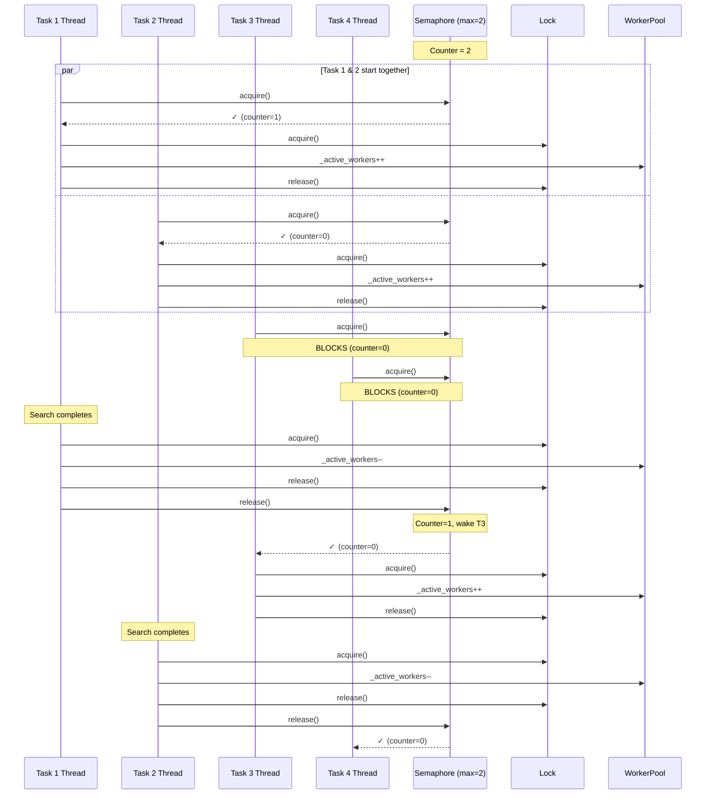

---

## Sequence Diagram - Complete Workflow

Full execution flow from user query to final report.

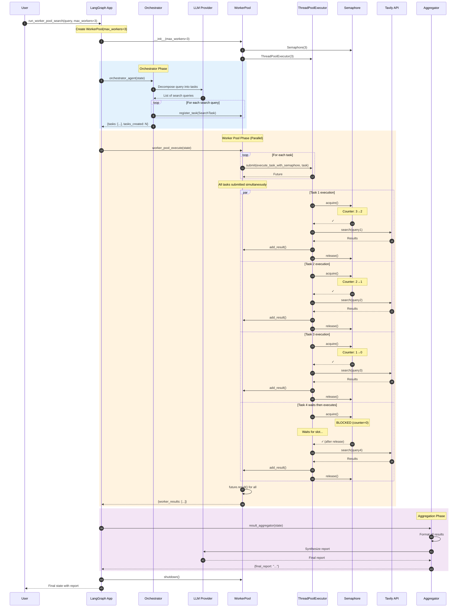

---

## Worker Pool Execution Flowchart

Detailed logic of the worker pool execution node.

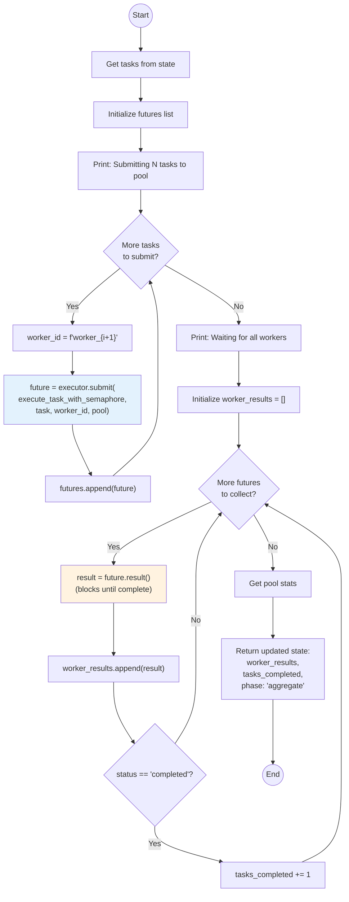

---

## Semaphore Acquire/Release Flowchart

Detailed logic of the semaphore-controlled task execution.

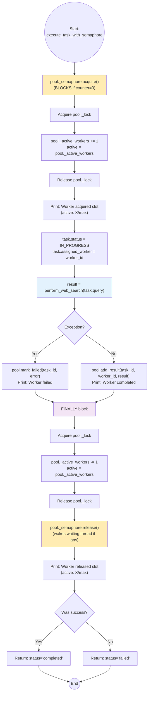

---

## State Transition Diagram

All possible states and transitions in the workflow.

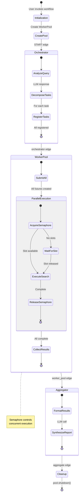

---

## Comparison: Task Queue vs Worker Pool

Side-by-side comparison of the two patterns.

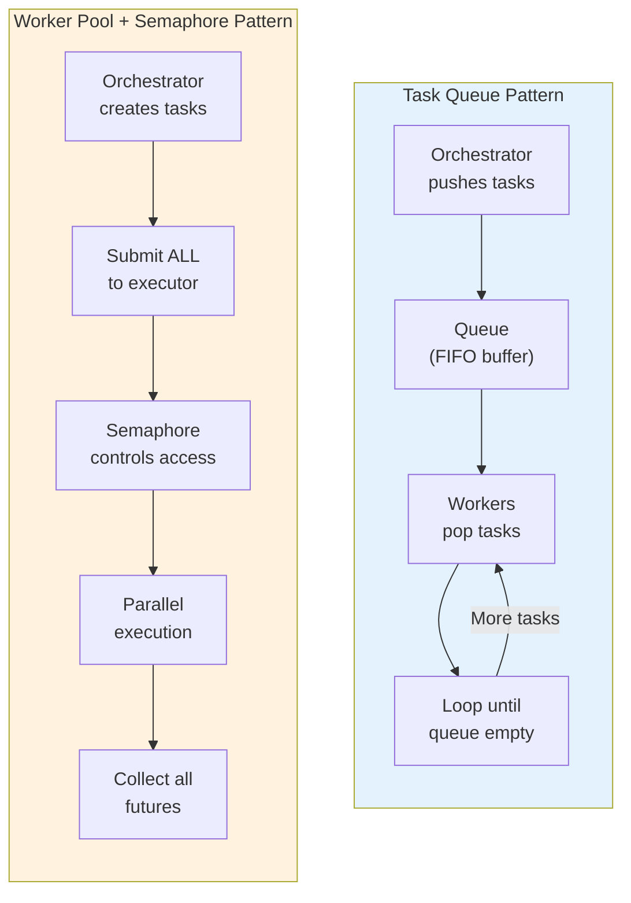

### Detailed Comparison

| Aspect | Task Queue | Worker Pool + Semaphore |
|--------|------------|------------------------|
| **Task Flow** | Push → Queue → Pop | Create → Submit → Execute |
| **Concurrency** | Sequential rounds | True parallel |
| **Control Mechanism** | Queue emptiness | Semaphore count |
| **Worker Lifecycle** | Created per round | Managed by pool |
| **Task Distribution** | Workers pull | Tasks pushed |
| **Blocking** | Non-blocking pop | Blocking acquire |
| **Thread Management** | Manual | ThreadPoolExecutor |
| **Best For** | Streaming tasks | Batch processing |

### Execution Timeline Comparison

```mermaid
gantt
    title Task Queue vs Worker Pool Execution (5 tasks, 3 workers)
    dateFormat X
    axisFormat %s

    section Task Queue
    Round 1 - Worker 1    :tq1, 0, 3
    Round 1 - Worker 2    :tq2, 0, 3
    Round 1 - Worker 3    :tq3, 0, 3
    Check Queue           :milestone, tqm1, after tq3, 0
    Round 2 - Worker 1    :tq4, after tq3, 3
    Round 2 - Worker 2    :tq5, after tq3, 3
    Check Queue           :milestone, tqm2, after tq5, 0

    section Worker Pool
    Task 1 (Slot 1)       :wp1, 0, 3
    Task 2 (Slot 2)       :wp2, 0, 3
    Task 3 (Slot 3)       :wp3, 0, 3
    Task 4 (waits)        :wp4, 3, 3
    Task 5 (waits)        :wp5, 3, 3
```

---

## Detailed Design Discussion

### 1. Why Worker Pool + Semaphore?

This pattern was chosen for scenarios where:

| Scenario | Benefit |
|----------|---------|
| **All tasks known upfront** | Submit all at once, no queue management |
| **True parallelism needed** | Tasks execute concurrently, not in rounds |
| **Resource limiting required** | Semaphore controls API rate limits |
| **Thread reuse desired** | Pool manages thread lifecycle |

### 2. Semaphore vs Other Concurrency Primitives

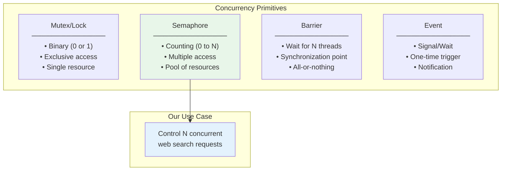

### 3. ThreadPoolExecutor Benefits

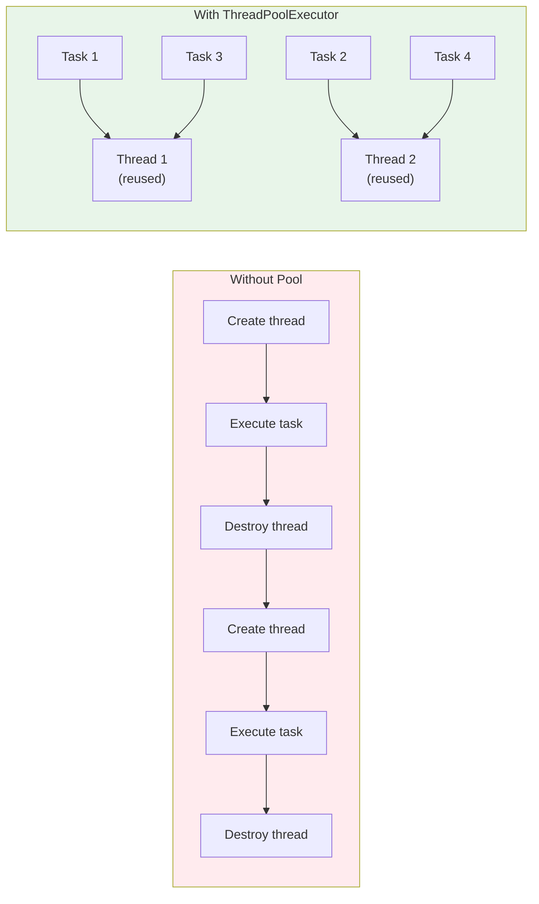

### 4. Error Handling in Finally Block

The `finally` block ensures semaphore release even on exception:

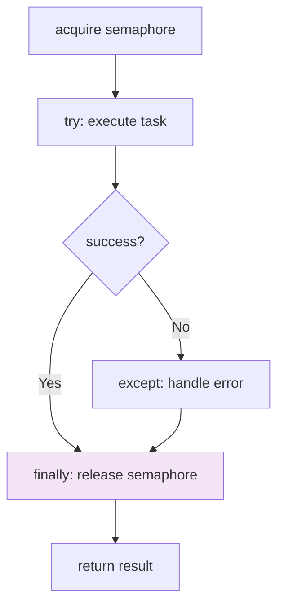

---

## Architecture Decisions

### Decision Record

| Decision | Options Considered | Choice | Rationale |
|----------|-------------------|--------|-----------|
| **Concurrency Control** | Queue, Semaphore, Lock | Semaphore | Allows N concurrent, not just 1 |
| **Thread Management** | Manual, ThreadPool | ThreadPoolExecutor | Thread reuse, cleaner API |
| **Task Submission** | Sequential, Batch | Batch (all at once) | Maximizes parallelism |
| **Blocking Behavior** | Non-blocking, Blocking | Blocking acquire | Simpler, automatic queueing |
| **Result Collection** | Polling, Future.result() | Future.result() | Blocks until complete |

### Architectural Layers

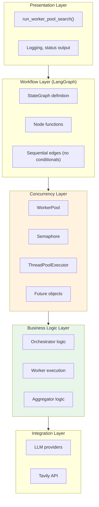

---

## Future Work

### 1. Async/Await Implementation

Replace threading with asyncio for I/O-bound tasks:

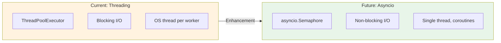

### 2. Dynamic Pool Sizing

Adjust pool size based on load:

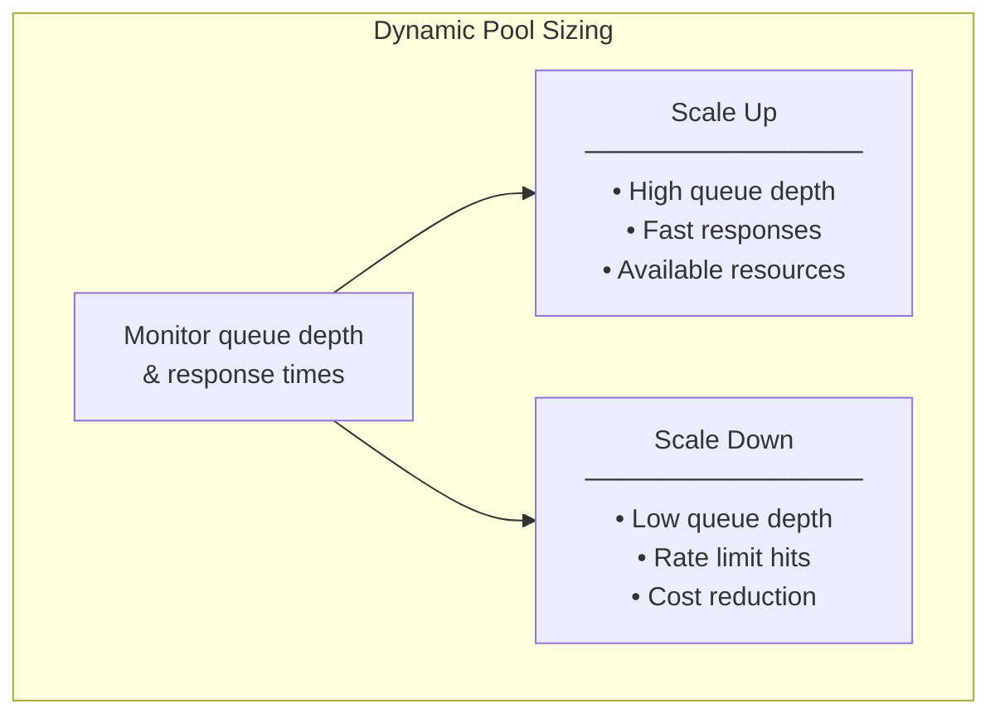

### 3. Priority-Based Scheduling

Tasks with higher priority acquire semaphore first:

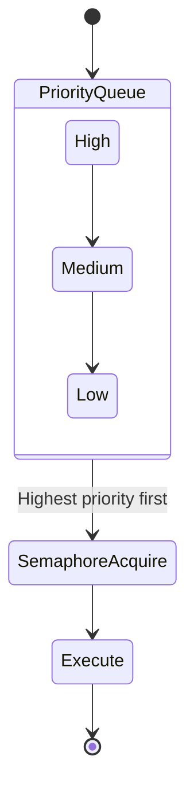

### 4. Circuit Breaker Pattern

Protect against external service failures:

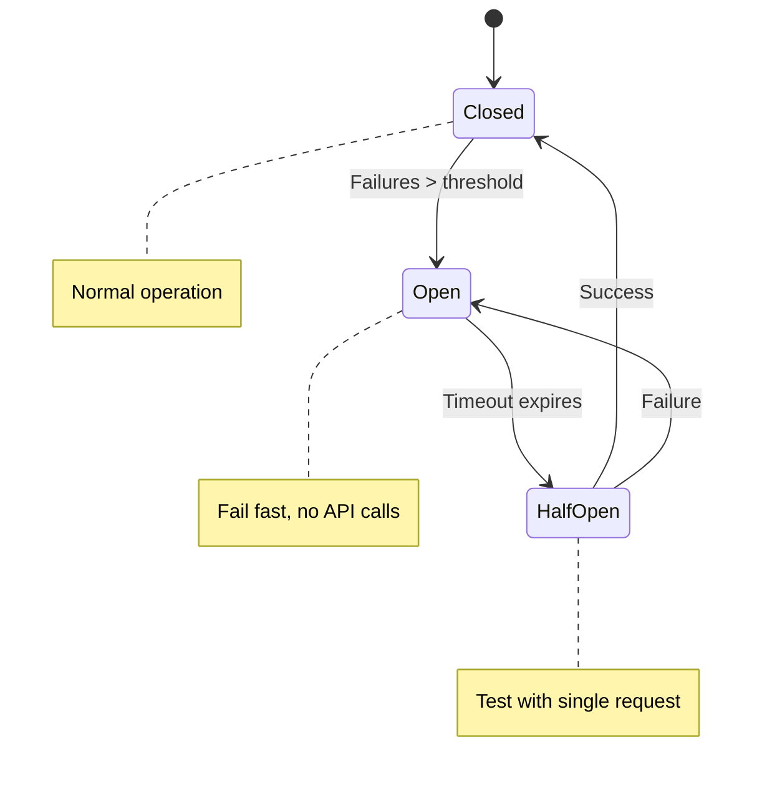

### 5. Distributed Worker Pool

Scale across multiple processes/machines:

```mermaid
flowchart TB
    subgraph Current["Current: Single Process"]
        SP["WorkerPool<br/>ThreadPoolExecutor<br/>Local Semaphore"]
    end

    subgraph Future["Future: Distributed"]
        subgraph Coordinator["Coordinator"]
            REDIS["Redis<br/>Distributed Semaphore"]
            QUEUE["Task Queue<br/>(Redis/Kafka)"]
        end
        
        subgraph Workers["Worker Processes"]
            W1["Worker 1<br/>(Machine A)"]
            W2["Worker 2<br/>(Machine B)"]
            W3["Worker 3<br/>(Machine C)"]
        end
        
        REDIS --> W1 & W2 & W3
        QUEUE --> W1 & W2 & W3
    end

    Current -->|"Scale"| Future

    style Current fill:#fff3e0
    style Future fill:#e8f5e9
```

---

## Summary

### Pattern Overview

| Aspect | Implementation |
|--------|----------------|
| **Pattern** | Worker Pool with Semaphore |
| **Framework** | LangGraph with StateGraph |
| **Concurrency Control** | threading.Semaphore |
| **Thread Management** | concurrent.futures.ThreadPoolExecutor |
| **Parallelism** | True parallel (up to semaphore limit) |
| **Task Distribution** | All submitted at once |

### Key Takeaways

1. **Semaphore = Counting Lock**: Controls N concurrent accesses, not just 1
2. **Submit All, Execute Limited**: All tasks submitted, semaphore limits execution
3. **True Parallelism**: No round-robin, tasks run concurrently
4. **Automatic Blocking**: Semaphore handles waiting for slots
5. **Thread Reuse**: Executor manages thread lifecycle efficiently
6. **Finally Block Critical**: Ensures semaphore release on any exit path

### When to Use This Pattern

| Use Worker Pool + Semaphore When | Don't Use When |
|----------------------------------|----------------|
| All tasks known upfront | Tasks arrive over time |
| True parallelism needed | FIFO ordering required |
| Resource limiting needed | Unbounded parallelism OK |
| Batch processing | Event-driven processing |
| API rate limiting | No external rate limits |

---

## References

- [Python threading.Semaphore](https://docs.python.org/3/library/threading.html#semaphore-objects)
- [Python concurrent.futures](https://docs.python.org/3/library/concurrent.futures.html)
- [LangGraph Documentation](https://python.langchain.com/docs/langgraph)
- [Worker Pool Pattern](https://en.wikipedia.org/wiki/Thread_pool)
- [Semaphore (programming)](https://en.wikipedia.org/wiki/Semaphore_(programming))
